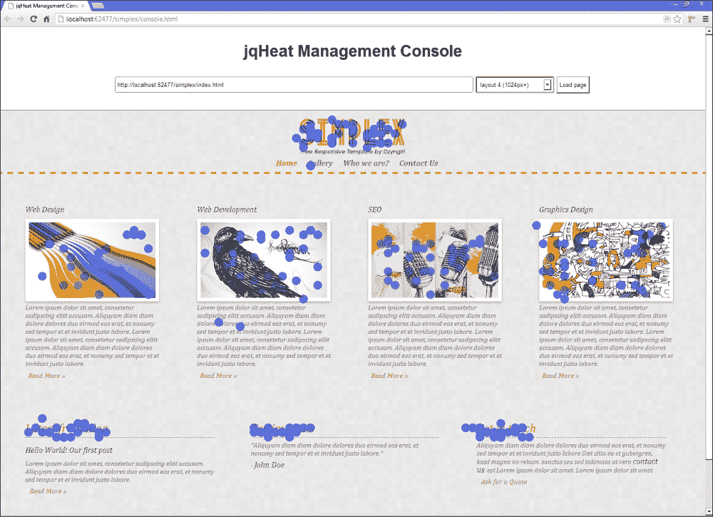
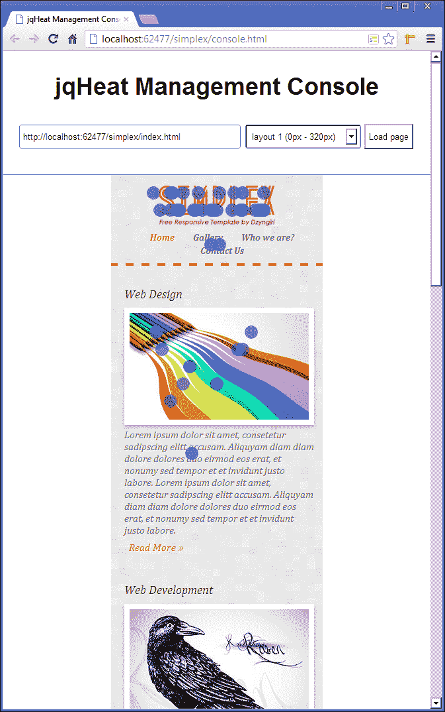

# 九、jQuery 热图

热图可以告诉你很多关于你的网站是如何使用的。在分析领域，它是一个很有价值的工具，可以告诉你网站的哪些功能使用最多，哪些领域可能需要一些改进才能真正吸引访问者。

# 任务简报

在这个项目中，我们将构建我们自己的热图来记录任何页面的哪些区域被点击最多。我们需要建立一种方法来记录每次点击发生的位置，并将信息传输到某个地方以便存储。

实际上，我们将构建整个热图的两个不同部分——客户端部分，在访问者的浏览器中执行以捕获点击，以及管理控制台，向站点所有者显示热图。

我们需要考虑不同的分辨率和设备，以便捕获最大数量的信息，并确保我们的脚本足够高效，可以在后台运行而不被注意。

当然，客户端不会出现任何可见的情况（该部分所做的只是记录和存储点击），但在项目结束时，我们将能够在管理控制台中显示页面上所有点击次数和位置的详细信息，如以下屏幕截图所示：



## 为什么太棒了？

所有分析对网站所有者都很有用，可以提供访问网站的用户的详细信息，包括他们的计算环境、他们进入网站的页面、离开的页面以及访问的页面数量等。

热图可以提供同样的信息，但从开发人员而不是所有者的角度来看。您的页面中哪些部分被点击的频率最高？热图可以告诉你。

我们将构建的热图将针对能够改变布局以适应用于查看站点的设备屏幕宽度的响应性网站。一个项目几乎不足以涵盖响应性设计的所有方面，因为我们主要关注脚本本身，所以不会详细介绍它。

如果您已经使用了响应技术，那么您就不需要额外的信息。如果您以前没有使用过响应性原则，那么这应该是对该主题的温和介绍，可以作为该主题的入门。

## 你的热门目标

在本项目中，我们将涵盖以下任务：

*   确定和拯救环境
*   捕获访客点击
*   保存单击数据
*   添加管理控制台
*   请求单击数据
*   显示热图
*   允许选择不同的布局
*   显示每个布局的热图

## 任务清单

这是唯一一个项目，我们不会构建我们自己需要的 HTML 和 CSS。我们希望我们的热图能够与各种布局协同工作，而测试热图的最佳方法是使用响应性布局。如果我们自己编写代码的话，我们需要花大部分时间来编写代码并讨论布局，甚至在我们得到热图之前。

我们将为这个项目使用一个预先构建的响应模板，这样我们就可以直接进入有趣的部分而不会分心。我们将使用的模板称为 Simplex，但不幸的是，它不再在线提供。您需要使用本书附带下载中的模板文件。只需将下载的归档文件中的`simplex`文件夹复制到主`jquery-hotshots`项目目录中即可。我们需要做的就是为模板中的每个 HTML 页面添加一些脚本引用。应更新的文件包括：

*   `contact.html`
*   `gallery.html`
*   `index.html`
*   `who-we-are.html`

新的`<script>`元素可以放在四页中每一页`<body>`的底部。首先，我们显然需要 jQuery：

```js
<script src="../js/jquery-1.9.0.min.js"></script>
```

我们还将使用上次项目中使用的 imagesLoaded 插件：

```js
<script src="../js/jquery.imagesloaded.min.js"></script>
```

在这个项目中，我们将创建两个脚本，一个在客户端上运行，另一个用于管理控制台。最初，我们将使用客户端脚本，因此我们应该在每个页面中添加以下内容：

```js
<script src="../js/heat-map-client.js"></script>
```

当然，这个文件还不存在，所以当我们开始设置时，我们现在就可以开始创建这个文件了。它应该和我们的其他脚本一起保存在`js`目录中。

# 确定和拯救环境

在我们的第一个任务中，我们将存储有关当前浏览环境的一些信息，例如当前页面的 URL。我们还将解析任何附加的样式表以查找媒体查询。

## 准备起飞

我们将从我们的`document ready`捷径开始，就像我们在大多数其他项目中一样。在`heat-map-client.js`文件中，添加以下代码：

```js
$(function () {

});
```

我们添加到此文件的所有附加代码都将进入此回调函数。

## 启动推进器

我们将首先设置一系列变量，这些变量将在整个脚本中使用。我们还需要解析任何附加的样式表并查找**媒体查询**，以便确定为不同布局定义了哪些断点。

### 注

媒体查询是一种在 CSS 中指定只有在满足某些条件（如屏幕宽度）时才应用一组样式的方法。更多信息请参见[http://en.wikipedia.org/wiki/Media_queries](http://en.wikipedia.org/wiki/Media_queries) 。

在刚才添加的回调函数中添加以下代码：

```js
var doc = $(document),
    clickStats = {
        url: document.location.href,
        clicks: []
    },
    layouts = [];

$.ajaxSetup({
    type: "POST",
    contentType: "application/json",
    dataType: "json"
});

$.each(doc[0].styleSheets, function (x, ss) {

  $.each(ss.rules, function (y, rule) {

    if (rule.media&&rule.media.length) {

      var jq = $,
          current = rule.media[0],
          mq = {
            min: (current.indexOf("min") !== -1) ? 
            jq.trim(current.split("min-width:")[1]
            .split("px")[0]) : 0,

            max: (current.indexOf("max") !== -1) ? 
            jq.trim(current.split("max-width:")[1]
            .split("px")[0]) : "none"
          };

      layouts.push(mq);
    }
  });
});

layouts.sort(function (a, b) {
    return a.min - b.min;
});

$.ajax({
    url: "/heat-map.asmx/saveLayouts",
    data: JSON.stringify({ url: url, layouts: layouts })
});
```

## 目标完成-小型任务汇报

我们从定义一系列变量开始。我们缓存对`document`对象的引用，并使用 jQuery 功能将其包装起来。然后，我们创建一个名为`clickStats`的对象，将其用作会话的通用存储容器。

在对象中，我们存储页面的 URL，并定义一个名为`clicks`的空数组，用于存储发生的每次单击。最后，我们创建了另一个数组，这次在`clickStats`对象之外，我们将使用它来存储表示文档每个布局的对象。

我们还使用 jQuery 的`ajaxSetup()`方法为任何 AJAX 请求设置了一些默认值，该方法接受一个包含要设置的选项的对象。我们将提出几个请求，因此为我们在两个请求中设置的任何选项设置默认值是有意义的。在本例中，我们需要将`type`设置为`POST`，将`contentType`设置为`application/json`，将`dataType`设置为`json`。

我们的下一段代码涉及通过`<link>`元素解析附加到文档的任何样式表，并提取其中定义的任何媒体查询。

我们首先使用 jQuery 的`each()`方法迭代`document`对象的`StyleSheets`集合中存储的样式表对象。对于每个样式表，集合中都有一个对象，其中包含其所有选择器和规则，包括任何媒体查询。

我们正在迭代的集合由对象组成，因此我们传递给`each()`方法的回调函数将接收当前对象的索引，我们将其设置为`x`，以及当前对象本身，我们将其设置为`ss`作为参数。

在回调函数中，我们再次使用 jQuery 的`each()`方法。这次我们迭代传递到回调函数中的`ss`对象的`rules`集合。此集合将包含一系列对象。我们传递给这个方法咒语的回调函数将再次接收索引，这次设置为`y`，当前对象，这次设置为`rule`。

对象的类型将因对象的不同而有所不同。对于`@import`语句，它可以是`CSSImportRule`，对于`@font-face`规则，它可以是`CSSFontFaceRule`，对于样式表定义的任何选择器，它可以是`CSSStyleRule`，对于任何媒体查询，它可以是`CSSMediaRule`。

我们只对`CSSMediaRule`对象感兴趣，所以在嵌套的`each()`中的回调中，我们首先检查规则对象是否有`media`属性，媒体属性是否有`length`。

只有`CSSMediaRule`对象将具有`media`属性，但该属性可能为空，因此我们可以使用嵌套回调中的`if`条件检查该属性是否存在，并检查其是否具有`length`。

如果这两个条件都是`true`（或 truthy），我们就知道我们找到了一个媒体查询。我们首先设置了两个新变量。第一个变量是`media`集合的第一项，它将包含定义媒体查询的文本字符串，第二个变量是一个名为`mq`的对象，我们将使用它来存储媒体查询的断点。

我们设置了这个对象的两个属性——媒体查询的`min`和`max`值。我们通过检查文本字符串是否包含单词`min`来设置`min`属性。如果是这样的话，我们首先拆分术语`min-width:`上的字符串并获取`split()`函数将返回的数组中的第二项，然后拆分术语`px`上的结果字符串并获取第一项。我们可以像这样链接`split()`，因为函数返回一个数组，这也是它调用的数组。

如果字符串不包含单词`min`，我们将该值设置为`0`。如果有`max-width`的话，我们也会这样做。如果没有`max-width`，则将其设置为字符串`none`。一旦我们创建了`layout`对象，我们就将其推入`layouts`数组。

最后我们将断点数组按升序排序。我们可以通过将排序函数传递给 JavaScript 的`sort()`方法来实现这一点，该方法在数组中调用。我们传入的函数将从正在排序的数组中接收两个项。

如果第一个对象的`min`属性小于第二个`b`对象的`min`属性，则函数将返回一个负数，该负数将把数组中较小的数字放在较大的数字之前——这正是我们想要的。

因此，我们将最终得到一个数组，其中每个项都是一个特定的断点，它在整个数组中不断增加，使得以后更容易对其进行检查以检测应用了哪个断点。

最后，我们需要将这些数据发送到服务器，以便保存这些数据。我们需要为该请求设置的唯一选项是向其发出请求的 URL，以及用于向服务器发布页面 URL 和媒体查询数组的`data`选项。当然，我们前面设置的 AJAX 默认值也将被使用。

## 机密情报

如果您已经熟悉媒体查询，请跳到下一个任务的开头；如果没有，我们将在这里简单地看一下它们，以便我们都知道我们的脚本试图做什么。

媒体查询类似于`if`条件查询，但用 CSS 表示。CSS 文件中的媒体查询类似于以下代码段：

```js
@media screen and (max-width:320px) {
    css-selector { property: style; }
}
```

该声明以`@media`开头，表示媒体查询。查询指定介质，如`screen`，以及可选的附加条件，如`max-width`或`min-width`。仅当满足查询时，才会应用查询中包含的样式。

媒体查询是响应式网页设计的主要元素之一，另一个是相对维度。通常，一个响应式构建的网页将有一个或多个媒体查询，允许我们为一系列屏幕大小指定不同的布局。

我们包含的每个媒体查询将在布局之间设置一个断点。当超过断点时，例如当设备的最大宽度小于上一次媒体查询中的`320px`时，布局将根据媒体查询的指示进行更改。

# 捕捉访客点击

在这个任务中，我们需要构建部分来捕获页面上发生的任何点击。当页面打开时，我们希望记录有关布局和单击本身的信息。

## 启动推进器

我们可以使用以下代码捕获点击并记录我们想要存储的其他信息，这些信息应该直接添加到我们在上一个任务中添加到`heat-map-client.js`的`ajax()`方法之后：

```js
$.imagesLoaded(function() {

    doc.on("click.jqHeat", function (e) {

        var x = e.pageX,
              y = e.pageY,
             docWidth = doc.outerWidth(),
             docHeight = doc.outerHeight(),
             layout,
             click = {
                 url: url,
                 x: Math.ceil((x / docWidth) * 100),
                 y: Math.ceil((y / docHeight) * 100)
            };

        $.each(layouts, function (i, item) {

            var min = item.min || 0,
                  max = item.max || docWidth,
                  bp = i + 1;

            if (docWidth>= min &&docWidth<= max) {
                click.layout = bp;
            } else if (docWidth> max) {
                click.layout = bp + 1;
            }
        });

        clickStats.clicks.push(click);
    });
});
```

## 目标完成-小型任务汇报

我们可以通过使用 jQuery 的`on()`方法添加一个处理程序来监听页面上的点击，并且我们还希望在开始捕获点击之前确保页面中的任何图像都已完全加载，因为图像会影响文档的高度，而这反过来又会影响我们的计算。因此，我们需要在`imagesLoaded()`方法的回调函数中附加事件处理程序。

我们将`click`指定为要侦听的事件作为第一个参数，但也使用`jqHeat`命名该事件的名称空间。我们可能希望在一系列页面上使用它，每个页面可能都有自己的事件处理代码，我们不想干扰这些代码。

在事件处理程序中，我们首先需要设置一些变量。函数接收事件对象作为参数，我们使用它来设置前两个变量，它们存储点击的`x`和`y`位置。此图将表示页面上的像素点。

然后存储文档的宽度和高度。我们在每次单击时存储此信息的原因是，打开页面时，文档的宽度以及高度可能会发生变化。

人们说只有开发人员在测试响应性构建时才调整浏览器的大小，但情况并非总是如此。根据使用中的任何媒体查询定义的断点，设备方向的更改可能会影响文档的宽度和高度，这可能在加载页面后的任何时间发生。

接下来我们定义`layout`变量，但目前我们不给它赋值。我们还创建一个新对象来表示单击。在该对象中，我们最初将单击坐标存储为百分比。

将像素坐标转换为百分比坐标是一个简单的操作，只需将像素坐标除以文档的宽度（或高度），然后将数字乘以`100`。我们使用 JavaScript 的`Math.ceil()`函数，以便将数字向上舍入到下一个整数。

接下来，我们需要确定我们所处的布局。我们可以再次使用 jQuery 的`each()`方法迭代我们的`layouts`数组。回调函数接收`layouts`数组中当前项的索引作为第一个参数，第二个是实际对象。

在回调函数中，我们首先设置变量。这次我们需要的变量是布局的最小宽度，我们将其设置为对象的`min`属性，如果没有定义`min`，则设置为零。我们还将`max`变量设置为当前项的`max`属性，如果没有`max`属性，则设置为文档的`width`。

我们的最后一个变量只是将`1`添加到当前指数中。该索引将以零为基础，但将版面编号标记为`1`比将版面编号标记为`0`更有意义。

然后，我们使用`if`条件来确定当前应用的布局。我们首先检查当前文档宽度是否大于或等于媒体查询的最小值，是否小于或等于最大值。如果是，我们知道我们在当前布局中，因此将转换后的布局索引保存到`click`对象中。

如果我们没有匹配任何版面，浏览器必须大于媒体查询定义的最高`max-width`值，因此我们再次将版面设置为转换后的版面加 1。最后，我们将已经创建的`click`对象添加到`clickStats`对象中的`clicks`数组中。

# 保存点击数据

有人访问了一个页面，我们的热图客户端脚本正在该页面上运行，他们已经点击过了，到目前为止，我们的脚本已经记录了每一次点击。现在怎么办？现在，我们需要一种将该信息传输到服务器的方法，以便在管理控制台中进行永久存储和显示。这就是我们将在本任务中看到的。

## 启动推进器

我们可以使用以下代码确保捕获到的点击被发送到服务器进行永久存储，这些代码应该添加在`imagesLoaded()`回调函数之后：

```js
window.onbeforeunload = function () {

    $.ajax({
        async: false,
        type: "POST",
        contentType: "application/json",
        url: "/heat-map.asmx/saveClicks",
        dataType: "json",
        data: JSON.stringify({ clicks: clicks })
    });
}
```

## 目标完成-小型任务汇报

我们将事件的处理程序附加到`window`对象，以便在离开页面之前将数据发布到服务器。不幸的是，这个事件没有 100%的时间得到处理——有时它可能不会触发。

为了尽可能地减少这种情况，我们将事件处理程序直接附加到本机`window`对象，而不是 jQuery 包装的对象，我们可以通过数组中的第一项 jQuery 对象访问它。

使用任何 jQuery 方法，包括`on()`，都会增加该 jQuery 方法的开销，并且会调用底层 JavaScript 函数。为了尽可能地减少这种开销，我们在这里避免使用 jQuery，并通过在事件名称前面加上`on`前缀并分配一个函数作为它们的值，恢复到附加事件处理程序的老派方式。

在这个函数中，我们需要做的就是将数据发布到服务器，以便将其插入到数据库中。我们使用 jQuery 的`ajax()`方法发出请求，并将`async`选项设置为`false`以使请求同步。

这一点很重要，可以确保请求是在 Chrome 中提出的。无论如何，我们对服务器的响应不感兴趣——我们只需要确保在页面卸载之前发出请求。

在向服务器发送数据时，我们还将`type`设置为`POST`，并将`contentType`设置为`application/json`，这将为请求设置适当的头，以确保在服务器上正确处理数据。

`url`显然是我们将数据发送到的 web 服务的 URL，我们将`dataType`设置为`json`，这同样有助于在服务器上使用数据。

最后，我们对`clicks`数组进行字符串化，并使用浏览器的原生 JSON 引擎将其包装到一个对象中。我们使用`data`选项将字符串化数据发送到服务器。

此时，当打开此脚本附加到的页面时，脚本将在后台安静运行，记录页面上单击的任何点的坐标。当用户离开页面时，他们生成的点击数据被发送到服务器进行存储。

## 机密情报

没有 JSON 引擎的浏览器，例如 Internet Explorer 的版本 7 和更低版本，将无法运行我们在该任务中添加的代码，尽管在这些情况下可以使用 polyfill 脚本。

有关更多信息，请参阅 Github 上的 JSON 存储库（[https://github.com/douglascrockford/JSON-js](https://github.com/douglascrockford/JSON-js) ）。

# 增加管理控制台

我在项目开始时说过，我们不需要编写任何 HTML 或 CSS。这有点夸张；我们必须自己构建管理控制台页面，但别担心，我们不需要编写太多内容——页面上显示的大部分内容都是动态创建的。

## 准备起飞

根据我们的标准模板文件`console.html`创建一个新的 HTML 页面，并将其保存在我们为该项目工作的`simplex`目录中。接下来创建一个名为`console.js`的新脚本文件，并将其保存在同一文件夹中。最后，创建一个名为`console.css`的新样式表，并将其保存在`simplex`目录下的`css`文件夹中。

我们应该从新 HTML 页面的`<head>`链接到新样式表：

```js
<link rel="stylesheet" href="css/console.css" />
```

我们还应该在`<body>`底部链接到 jQuery 和我们的新脚本文件：

```js
<script src="../js/jquery-1.9.0.min.js"></script>
<script src="console.js"></script>
```

最后，我们应该将类名`jqheat`添加到`<body>`元素中：

```js
<body class="jqheat">
```

## 启动推进器

该页面将需要显示一个界面，该界面可用于选择一个页面以查看单击统计信息。将以下代码添加到`console.html`的`<body>`中：

```js
<header>
    <h1>jqHeat Management Console</h1>
    <fieldset>
        <legend>jqHeat page loader</legend>
        <input placeholder="Enter URL" id="url" />
        <button id="load" type="button">Load page</button>
    </fieldset>
</header>
<section role="main">
    <iframe scrolling="no" id="page" />
</section>
```

我们还可以为这些元素添加一些非常基本的 CSS。将以下代码添加到`console.css`：

```js
.jqheat{ overflow-y:scroll; }
.jqheat header { 
    border-bottom:1px solid #707070; text-align:center; 
}
.jqheat h1 { display:inline-block; width:100%; margin:1em 0; }
.jqheat fieldset { 
    display:inline-block; width:100%; margin-bottom:3em; 
}
.jqheat legend { display:none; }
.jqheat input { 
    width:50%; height:34px; padding:0 5px; 
    border:1px solid #707070; border-radius:3px; 
}
.jqheat input.empty{ border-color:#ff0000; }
.jqheat button { padding:9px5px; }
.jqheat section {
    width:100%;margin:auto;
    position:relative;
}
.jqheat iframe, .jqheat canvas {
    Width:100%; height:100%; position:absolute; left:0; top:0;
}
.jqheat canvas { z-index:999; }
```

在这个任务中，我们不会添加任何真正的功能，但是我们可以使用通常的`document ready`处理程序准备我们的脚本文件，为下一个任务做准备。在`console.js`中，添加以下代码：

```js
$(function () {

});
```

## 目标完成-小型任务汇报

我们的页面以`<header>`元素开始，该元素包含`<h1>`和`<fieldset>`中页面的标题。在`<fieldset>`的内部是强制性的`<legend>`和一个非常简单的页面 UI，它由一个`<input>`和一个`<button>`元素组成。`<input>`和`<button>`元素都有`id`属性，因此我们可以轻松地从脚本的页面中选择它们。

页面的主要内容区域由一个`<section>`元素组成，该元素的`role`属性为`main`。标准做法是使用此属性标记页面的主要内容区域，这有助于澄清该区域对辅助技术的意图。

`<section>`内有一个`<iframe>`。我们将使用`<iframe>`显示用户想要查看点击统计信息的页面。现在它只有一个`id`属性，这样我们可以很容易地选择它，而非标准`scrolling`属性设置为`no`。我不太喜欢使用非标准属性，但在本例中，这是防止`<iframe>`在加载内容文档时出现无意义滚动条的最简单方法。

页面很有可能导致滚动条出现，与其在滚动条出现时发生移动，不如将页面的`<body>`设置为永久性垂直滚动条，我们在 CSS 中就是这样做的。除此之外，CSS 主要是位置的东西，我们不会深入研究。

## 机密情报

我们在`<input>`元素上使用了 HTML5`placeholder`属性，在支持浏览器的情况下，该属性将添加的文本显示为`<input>`中的属性值，充当内联标签。

这很有用，因为这意味着我们不必为了显示一个`<label>`而添加一个全新的元素，但是支持虽然在编写本文时很好，但并不是 100%。幸运的是，有一些优秀的`polyfills`能够在不支持的浏览器中提供合理的回退。

### 注

Modernizer 团队推荐了一系列`placeholder`聚填料（除此之外还有更多）。您可以访问[查看完整列表 https://github.com/Modernizr/Modernizr/wiki/HTML5-Cross-Browser-Polyfills](https://github.com/Modernizr/Modernizr/wiki/HTML5-Cross-Browser-Polyfills) 。

# 请求点击数据

控制台页面一开始几乎是空的，主要包含一个表单，用于加载我们想要查看的点击数据的页面。在本任务中，我们将了解如何加载该页面并从服务器请求其数据。

## 启动推进器

首先在`console.js`中的空函数中添加以下代码：

```js
var doc = $(document),
    input = doc.find("#url"),
    button = doc.find("#load"),
    iframe = doc.find("#page"),
    canvas = document.createElement("canvas");

$.ajaxSetup({
    type: "POST",
    contentType: "application/json",
    dataType: "json",
    converters: {
        "textjson": function (data) {
            var parsed = JSON.parse(data);

            return parsed.d || parsed;
        }
    }
});
```

然后我们可以为`<button>`元素添加一个点击处理程序：

```js
doc.on("click", "#load", function (e) {
    e.preventDefault();

    var url = input.val(),
        len;

    if (url) {
        input.removeClass("empty").data("url", url);
        button.prop("disabled", true);
        iframe.attr("src", url).load(function() {
          $(this).trigger("iframeloaded");
        });
    } else {
        input.addClass("empty");
        button.prop("disabled", false);
  }
});
```

最后，我们可以为自定义`iframeloaded`事件添加一个事件处理程序：

```js
doc.on("iframeloaded", function () {

    var url = input.data("url");

    $.ajax({
        type: "POST",
        contentType: "application/json",
        url: "/heat-map.asmx/getClicks",
        dataType: "json",
        data: JSON.stringify({ url:url, layout: 4 }),
        converters: {
          "textjson": function (data) {
              var parsed = JSON.parse(data);

              returnparsed.d || parsed;
          }
        }
    });
});
```

## 目标完成-小型任务汇报

我们开始，就像我们通常做的那样，设置一些变量。我们存储了对 jQuery 中包装的`document`对象的引用，我们可以使用该引用作为起点来选择页面上的任何元素，而无需在每次选择元素或绑定事件处理程序时创建新的 jQuery 对象。

我们还存储了一个对`<input>`元素的引用，该元素将包含页面的 URL，`<input>`旁边的`<button>`引用，以及我们将呈现请求页面的`<iframe>`引用。最后，我们设置了一个名为 canvas 的未定义变量，我们将使用该变量存储对使用 JavaScript 的`createElement()`函数创建的`<canvas>`元素的引用。

当然，我们可以使用 jQuery 来创建这个元素，但是我们只创建一个元素，而不是一个复杂的 DOM 结构，因此我们也可以使用普通 JavaScript，同时获得性能提升。

与之前一样，我们可以使用`ajaxSetup()`方法为我们将向服务器发出的请求设置`type`、`contentType`和`dataType`选项。我们还使用了一个转换器来转换服务器返回的数据。

`converters`选项采用一个对象，其中转换器应用于的数据类型被指定为键，而作为转换器使用的函数被指定为值。

为了安全起见，一些服务器会返回包装在对象中并存储在属性`d`中的 JSON 数据，而其他服务器不会这样做。通常使用 jQuery 的`parseJSON()`方法解析`text json`数据类型，但在这种情况下，我们的代码仍然需要从对象中提取实际数据才能使用。

相反，我们的转换器使用浏览器的原生 JSON 解析器解析 JSON，然后返回`d`的内容（如果存在）或解析的数据。这意味着无论数据是否包装在对象中，处理数据的代码都是相同的。

在这个特定的例子中，转换器虽然不是关键的，但在代码正在分发且其运行平台事先未知的情况下，转换器可能非常有用。

接下来，我们在事件委派模式下使用 jQuery 的`on()`方法向`document`添加了一个点击处理程序。为了添加委托处理程序，我们将处理程序附加到父元素，在本例中为`document`，并使用`on()`的第二个参数提供一个选择器，事件应根据该选择器进行筛选。

事件在页面上冒泡，从触发元素一直到外部`window`对象。仅当触发元素与作为第二个参数传递的选择器匹配时，才会执行处理程序。第一个参数当然是事件类型，第三个参数是处理函数本身。

在函数中，我们首先阻止事件的默认浏览器操作，然后将`<input>`元素的值存储在变量`url`中。我们还设置了一个名为`len`的未定义变量。我们还不需要使用它，但稍后我们会使用它。

接下来，我们检查我们设置的`url`变量是否有真实值，比如一个带有长度的字符串。如果有，我们移除`<input>`元素中的类名`empty`，然后使用 jQuery 的`data()`方法将`<input>`的内容设置为元素的数据。

以这种方式将 URL 与元素关联是一种保存数据的好方法，这样就可以从代码中其他无法访问事件处理程序作用域的函数中获取数据。我们还禁用了`<button>`以防止重复请求。我们可以在稍后将热图绘制到屏幕上时启用它。

然后，我们添加了从`<input>`元素获得的 URL 作为`<inframe>`的`src`属性，这会导致`<iframe>`加载 URL 所在的页面。我们为`load`事件添加了一个处理程序，该事件将在页面加载后由`<iframe>`触发。在这个处理程序中，我们使用 jQuery 的`trigger()`方法触发一个自定义`iframeloaded`事件。

如果`url`变量不包含真实值，我们将`empty`类添加到`<input>`并再次启用`<button>`。

最后我们为自定义`iframeloaded`事件添加了一个事件处理程序。自定义事件将像常规事件一样冒泡到`document`上，因此我们可以将处理程序附加到缓存的`<body>`元素，并且它仍将在适当的时间触发。

在这个处理程序中，我们通过调用与`<input>`元素相关联的数据来获取已加载页面的 URL。然后，我们使用 jQuery 的`ajax()`方法向服务器发出请求。

我们已经再次使用`ajaxSetup()`将一些必需的 AJAX 选项设置为默认值，因此对于这个请求，我们只需设置`url`和`data`选项。这一次，我们发送的数据是一个字符串化对象，其中包含页面的 URL 和获取点击数据的布局。对此，我们期望一个 JSON 对象包含一系列单击对象，其中每个对象都包含指向页面上特定点的`x`和`y`坐标。

请注意，此时，我们正在硬编码要加载到请求中的布局，我们将其设置为编号`4`。我们将在下一部分回到这一点，并允许用户选择要查看的布局。

# 显示热图

我们都准备好展示热图了。在本任务中，我们将处理点击数据以生成热图，然后使用`<iframe>`顶部的`<canvas>`元素显示它。

## 启动推进器

首先，我们可以为上一个任务结束时发出的 AJAX 请求添加一个成功处理程序。我们可以将`done()`方法链接到`ajax()`方法：

```js
}).done(function (clicks) {

    var loadedHeight = $("html", iframe[0].contentDocument)
.outerHeight();

    doc.find("section").height(loadedHeight);

    canvas.width = doc.width();
    canvas.height = loadedHeight;
    $(canvas).appendTo(doc.find("section"))
             .trigger("canvasready", { clicks: clicks });

});
```

然后，我们可以为自定义`canvasready`事件添加一个处理程序。这应该直接添加到`iframeloaded`事件处理程序之后：

```js
doc.on("canvasready", function (e, clickdata) {

    var docWidth = canvas.width,
        docHeight = canvas.height,
        ctx = canvas.getContext("2d") || null;

    if (ctx) {

        ctx.fillStyle = "rgba(0,0,255,0.5)";

        $.each(clickdata.clicks, function (i, click) {

            var x = Math.ceil(click.x * docWidth / 100),
                y = Math.ceil(click.y * docHeight / 100);

            ctx.beginPath();
            ctx.arc(x, y, 10, 0, (Math.PI/180)*360, true);
            ctx.closePath();
            ctx.fill();

        });
    }

    button.prop("disabled", false);

});
```

## 目标完成-小型任务汇报

一旦 AJAX 请求完成，我们首先将已加载的文档的高度存储在`<iframe>`中。jQuery 方法可以在选择器之后传递第二个参数，该参数设置应该搜索的上下文以匹配选择器。我们可以将上下文设置为页面上第一个`<iframe>`的`contentDocument`对象，我们可以使用`frame[0]`访问该对象。

设置`<section>`元素的`height`将自动使我们之前创建的`<iframe>`和`<canvas>`元素成为`<section>`的`width`和`height`，这样页面就可以全尺寸查看。

接下来，我们设置在上一个任务中创建的`<canvas>`元素的`width`和`height`属性。我们还没有设置`<canvas>`元素的`width`或`height`属性，因此默认情况下，它的大小将仅为 300 x 300 像素，而与 CSS 设置的可见大小无关。因此，我们将属性设置为正确的大小。

然后我们可以将新的`<canvas>`附加到页面上的`<section>`元素，然后触发定制`canvasready`事件。我们希望在事件处理程序中使用服务器传递的数据来处理该事件，因此我们使用`trigger()`方法的第二个参数将其传递给处理程序函数。

然后，我们为`canvasready`事件添加了一个处理程序。此函数接收事件对象和单击数据作为参数。在函数中，我们首先得到`<canvas>`元素的`width`和`height`。我们将点击数据存储为百分比，需要将其转换回像素值。

为了在`<canvas>`上绘制，我们需要获得上下文。我们可以为`<canvas>`获取 2D 上下文，并使用 canvas 对象的`getContext()`函数将其存储在变量中。如果不支持`<canvas>`元素，`ctx`变量将设置为`null`。只有在上下文不是`null`的情况下，我们才能继续与画布交互。

如果`ctx`不是`null`，我们首先使用画布 API 的`clearRect()`函数清除`<canvas>`，然后设置要在画布上绘制的颜色。我们可以将其设置为 RGBA（红、绿、蓝、阿尔法）字符串`0,0,255,.05`，它是半透明的蓝色。这只需要设置一次。

然后，我们使用 jQuery 的`each()`方法迭代服务器返回的点击数据。迭代器函数（将针对 clicks 数组中的项目数执行）传递数组中当前项目和`click`对象的索引。

我们首先存储单击的每个像素的`x`和`y`位置。这些数字目前是百分比，所以我们需要将它们转换回像素值。这与我们在热图的客户端部分执行的计算正好相反。我们只需将百分比乘以`<canvas>`的`width`或`height`，然后将该数字除以`100`。

然后我们可以在`<canvas>`上点击发生的地方画一个点。为此，我们使用 canvas 对象的`beginPath()`方法启动一条新路径。点是使用`arc()`方法绘制的，该方法传递了许多参数。前两个是弧中心的坐标，我们将其设置为刚才计算的`x`和`y`值。

第三个参数是圆的半径。如果我们将点设置为单个像素，数据将很难解释，因此使用大点而不是单个像素可以显著改善热图的外观。

第三个和第四个参数是开始和停止圆弧的角度，以弧度而不是度表示。我们可以画一个完整的圆，从零弧度开始，到 6.5 弧度结束。

定义弧后，我们可以使用`closePath()`方法关闭路径，并使用`fill()`方法用颜色填充弧。此时，我们应该能够在浏览器中运行控制台，输入其中一个模板页面的 URL，并查看页面上的点对应于单击。

# 允许选择不同的布局

在项目的这个任务中，我们需要允许用户选择页面支持的每个布局。我们可以通过使用`<select>`框来实现这一点，在页面加载时，我们使用每个不同的布局填充该框。

## 启动推进器

首先，我们可以在页面中添加`<select>`元素。这可以进入搜索字段和`console.html`页面顶部的按钮之间：

```js
<select id="layouts"></select>
```

接下来，我们需要在页面加载时发出一个请求，为每个不同的布局在`<select>`元素中填充一个`<option>`。我们可以在前面在`console.js`中添加的`<button>`的单击处理程序中执行此操作。

它需要进入条件的第一个分支，检查 URL 是否已输入到`<input>`中，就在我们设置`<iframe>`的`src`之前：

```js
$.ajax({
    url: "/heat-map.asmx/getLayouts",
    data: JSON.stringify({ url: url })
}).done(function (layouts) {

    var option = $("<option/>"),
        max;

    len = layouts.length;

    function optText(type, i, min, max) {

        var s,
            t1 = "layout ";

        switch (type) {
            case "normal":
                s = [t1, i + 1, " (", min, "px - ", max, "px)"];
                break;
            case "lastNoMax":
                s = [t1, len + 1, " (", min, "px)"];
                break;
            case "lastWithMax":
                s = [t1, len + 1, " (", max, "px+)"];
                break;
        }

        return s.join("");
    }

    $.each(layouts, function (i, layout) {

        var lMin = layout.min,
            lMax = layout.max,
            text = optText("normal", i, lMin, lMax);

        if (i === len - 1) {
            if (lMax === "none") {
                text = optText("lastNoMax", null, lMin, null);
            } else {
                max = lMax;
            }
        }

        option.clone()
              .text(text)
              .val(i + 1)
              .appendTo("#layouts");
        });

        if (max) {

            var fText = optText("lastWithMax", null, null, max);

            option.clone()
                  .text(fText)
                  .val(len + 1)
                  .prop("selected",true)
                  .appendTo("#layouts");
  }
});
```

我们还可以为新的`<select>`元素添加一点 CSS。我们可以把这个放到`console.css`的底部：

```js
.jqheat select { 
    width:175px; height:36px; padding:5px;
    margin:0 .25em 0 .5em; border:1px solid #707070;
    border-radius:3px;
}
```

## 目标完成-小型任务汇报

首先，我们请求服务器获取布局信息。`url`被设置为返回布局的 web 服务，`data`是我们想要布局的页面的 URL。

我们使用`done()`方法设置了一个成功处理程序，这是推荐的将成功处理程序添加到 promise 对象的技术，当它们被解析时。在处理程序中，我们首先设置一些变量。

我们创建了一个`<option>`元素，因为每个布局都需要其中一个元素，因此可以使用`clone()`方法复制任意次数的元素。我们还将之前创建但未定义的`len`变量更新为布局数量，即函数将接收的数组的`length`，以及一个名为`max`的未定义变量。

接下来我们定义一个名为`optText()`的函数，我们可以使用它为我们创建的每个`<option>`元素生成文本。此函数将接受要创建的字符串类型、索引以及最小值和最大值。

在这个函数中，我们设置了几个变量。第一个被称为`s`，目前尚未定义。第二个变量`t1`用于存储字符串的每个变量中使用的一些简单文本。

然后，我们使用一个`switch`条件来确定基于类型构建哪个字符串，该字符串将作为第一个参数传递到函数中，并将其设置为`normal`、`lastNoMax`或`lastWithMax`，并且应该考虑到可能找到的不同类型的媒体查询。

在`normal case`中，我们指定了`min`和`max`值。当没有`max`值时，我们使用`min`值构建字符串，当有`max`值时，我们使用`max`值构建字符串。

每个字符串都是使用一个数组构造的，然后在函数末尾，我们通过连接创建的数组返回一个字符串。

然后，我们使用 jQuery 的`each()`方法迭代服务器返回的`layouts`对象。一如既往，迭代器函数将当前项的索引和当前项本身作为参数传递。

在迭代器函数中，我们设置变量，在本例中是来自当前布局对象的`min`和`max`属性值，以及文本字符串的常规变量，我们肯定会至少使用一次。我们调用`optText()`函数并存储结果以备将来使用。

然后我们检查是否在最后一次迭代中，当索引等于我们之前存储的`layouts`数组的长度减去`1`时，我们就知道了。如果我们在最后一次迭代中，那么我们将检查`max`值是否等于字符串`none`。如果是，我们再次调用`optText()`函数并将文本设置为`lastNoMax`类型，这将为我们生成所需的文本字符串。如果不是，我们将`max`变量设置为当前对象的`max`值，该变量最初声明为未定义。最后，我们创建了`layouts`数组中每个对象所需的`<option>`元素。`<option>`给出了我们设置的文本，以及索引的值加上`1`。创建后，`<option>`将附加到`<select>`元素。

最后我们检查`max`变量是否有真实值。如果有，我们再次调用`optText()`函数，这次使用`lastWithMax`类型，并创建另一个`<option>`元素，我们将其设置为所选项。这是必需的，因为我们比`layouts`数组中的对象多了一个布局。

当我们现在在浏览器中运行页面时，我们会发现，只要我们在`<input>`中输入 URL 并点击加载页面，`<select>`元素就会为每个布局填充一个`<option>`。

## 机密情报

我们的`optText()`函数中`switch`语句中的中间`case`（`lastNoMax`）实际上不会在本例中使用，因为我们使用的模板中的媒体查询是如何构造的。在本例中，最后一个断点的媒体查询为`769px`到`1024px`。有时，媒体查询的结构可能会使最终断点仅包含一个`min-width`。

我已经包含了`switch`中的`case`，以使代码支持这种其他类型的媒体查询格式，因为它非常常见，您自己使用媒体查询时可能会遇到它。

# 显示每个布局的热图

现在我们在`<select>`元素中有了每个布局，我们可以将其连接起来，这样当所选布局发生更改时，页面将更新以显示该布局的热图。

## 启动推进器

在本任务中，我们需要修改前一个任务中编写的一些代码。我们需要更改`<button>`的点击处理程序，这样布局就不会硬编码到请求中。

首先，我们需要将`len`变量传递给`iframeloaded`事件的处理程序。我们可以在`trigger()`方法中添加第二个参数：

```js
$(this).trigger("iframeloaded", { len: len });
```

现在我们需要更新回调函数，以便函数接收此对象：

```js
doc.on("iframeloaded", function (e, maxLayouts) {
```

现在，我们可以将硬编码布局`4`的位更改为请求点击数据时传递给服务器的数据：

```js
data: JSON.stringify({ url: url, layout: maxLayouts.len + 1 }),
```

现在我们准备在`<select>`发生变化时更新热图。直接在`console.js`中的`canvasready`处理程序后添加以下代码：

```js
doc.on("change", "#layouts", function () {

    var url = input.data("url"),
          el = $(this),
          layout = el.val();

    $.ajax({
        url: "/heat-map.asmx/getClicks",
        data: JSON.stringify({ url: url, layout: layout })
    }).done(function (clicks) {

        doc.find("canvas").remove();

        var width,
              loadedHeight,
              opt = el.find("option").eq(layout - 1),
              text = opt.text(),
              min = text.split("(")[1].split("px")[0],
              section = doc.find("section"),
              newCanvas = document.createElement("canvas");

        if (parseInt(layout, 10) === el.children().length) {
            width = doc.width();
        } else if (parseInt(min, 10) > 0) {
            width = min; 
        } else {
            width = text.split("- ")[1].split("px")[0];
      }

        section.width(width);
        newCanvas.width = width;

        loadedHeight = $("html", 
        iframe[0].contentDocument).outerHeight();

        section.height(loadedHeight);
        newCanvas.height = loadedHeight;

        canvas = newCanvas;

        $(newCanvas).appendTo(section).trigger("canvasready", { 
            clicks: clicks });
        });
    });
```

## 目标完成-小型任务汇报

我们从开始，将我们的处理程序委托给文档，就像我们与大多数其他事件处理程序一样。这次我们正在监听由元素触发的`change`事件，该元素的`id`为`layouts`，这是我们在上一个任务中添加的`<select>`元素。

然后，我们通过设置几个变量继续遵循前面的形式。我们将 URL 保存为`<input>`元素的`data`。我们还缓存了`<select>`元素和所选`<option>`的值。

接下来，我们需要发出 AJAX 请求，以获取所选布局的热图。我们将`url`设置为一个 web 服务，该服务将返回此信息，并将`url`作为请求的一部分发送我们想要的热图和布局。不要忘记，此请求也将使用我们使用`ajaxSetup()`设置的默认值。

我们再次使用`done()`方法为请求添加一个成功处理程序。当收到响应时，我们首先从页面中删除现有的`<canvas>`元素，然后设置更多的变量。

前两个变量一开始没有定义；我们将在稍后填充这些。我们存储所选的`<option>`，以便获得其文本，该文本存储在下一个变量中。我们通过拆分刚刚存储的文本来获得断点的最小宽度，然后缓存对页面上`<section>`的引用。最后，我们创建一个新的`<canvas>`元素来显示新的热图。

变量后面的条件 if 语句处理设置第一个未定义变量–`width`。第一个分支测试请求的布局是否是最后一个布局，如果是，则将新的`<canvas>`设置为屏幕宽度。

如果未请求最后一个布局，则条件的下一个分支将检查布局的最小宽度是否大于`0`。如果是，则将`width`变量设置为最小断点。

当断点的最小宽度为`0`时，使用最后一个分支。如果最小宽度为`0`，则使用断点的最大`width`，可以通过再次拆分`<option>`的文本来获得。

然后，我们使用刚才计算的宽度设置`<section>`元素和新`<canvas>`元素的宽度。

接下来，我们可以定义第二个未定义的变量–`loadedHeight`。这与之前的计算方法相同，通过进入加载到`<iframe>`中的文档，并使用 jQuery 的`outerHeight()`方法获取其`document`对象的高度，该方法包括元素可能具有的任何填充。一旦我们有了这个值，我们就可以设置`<section>`元素和新`<canvas>`元素的高度。

我们将再次触发`canvasready`事件，因为这将消耗点击数据并生成热图。然而，在我们这样做之前，我们只需要将新创建的`<canvas>`元素保存回我们在`console.js`顶部设置的`canvas`变量。

此时，我们应该能够加载 URL 的默认热图，然后使用`<select>`元素查看其他布局的热图：



## 机密情报

我使用了一个**MS SQL**数据库来存储数据，一个**c#**web 服务包含了本项目所需的各种 web 方法。本书附带的代码下载中包括数据库的备份和 web 服务文件的副本，供您在需要时使用。

MS SQL express 是 SQL server 的免费版本，数据库可以还原到该版本，而同样免费的 Visual Studio 2012 for web 将通过其内置的开发服务器愉快地运行 web 服务。

如果您没有安装这些产品，并且您可以访问 Windows 计算机，我强烈建议您安装这些产品，以便您可以查看此项目中使用的代码。开放源代码替代品 PHP 和 MySQL 也可以同样容易地使用，尽管您需要自己编写这段代码。

# 任务完成

在这个项目中，我们构建了一个简单的热图生成器，用于捕获使用响应技术构建的网页上的点击数据。我们为热图生成器构建了两个部分——一些代码在网站访问者的浏览器中运行，以捕获屏幕上的每一次点击；另一部分与简单的管理控制台结合使用，其中热图所在页面的 URL 以及要显示的布局可以选择。

虽然我们必须考虑像素到百分比的转换，以及不同的屏幕分辨率和不同断点之间的范围，但这个易于实现的热图仍然可以为我们提供关于我们的网站如何使用的有价值的信息，哪些功能很受欢迎，哪些功能浪费了屏幕空间。

# 你准备好了吗？热门挑战

有一件事我们还没有处理，那就是颜色。我们的热图是由均匀的蓝色圆点构成的。由于它们是半透明的，当浓缩区域中出现更多的点时，它们会变得更暗，但是有了足够的数据，我们应该改变颜色，对于点击最多的区域，通过红色、黄色，直到白色。看看你是否可以自己添加这个功能来真正完成这个项目。