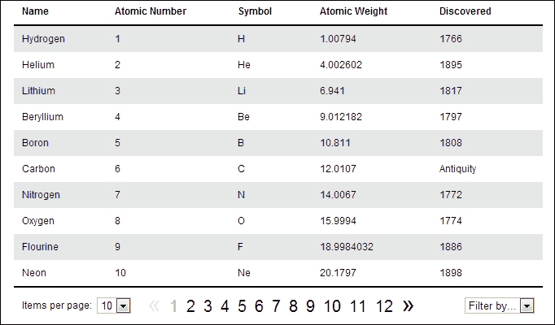
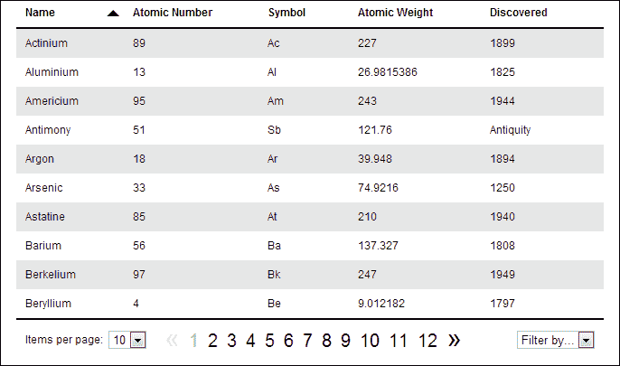
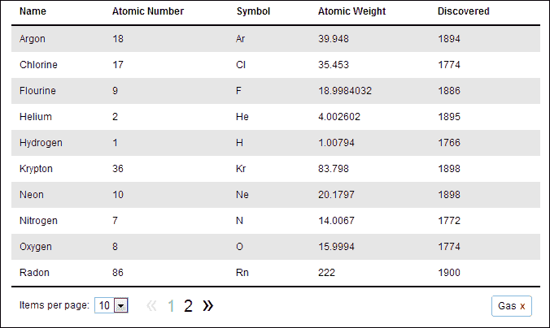

# 十、使用 Knockout.js 的可排序分页表

js 是一个奇妙的 JavaScript**模型视图视图模型****MVVM**框架，可以帮助您在编写复杂的交互式用户界面时节省时间。它与 jQuery 配合得非常好，甚至具有内置的基本模板支持，用于构建显示不同数据的重复元素。

# 任务简报

在这个项目中，我们将使用 jQuery 和 Knockout.js 从数据构建一个分页表。客户端分页本身是一个很好的特性，但我们还将允许通过提供可单击的表标题对表进行排序，并添加一些附加特性，例如根据特定属性过滤数据。

在本次任务结束时，我们将构建如下屏幕截图所示的内容：



## 为什么太棒了？

构建能够快速响应用户交互的复杂用户界面非常困难。它需要时间，而且应用越复杂或交互式，所需时间越长，所需代码越多。一个应用需要的代码越多，就越难保持它的组织性和可维护性。

尽管 jQuery 擅长帮助我们编写简洁的代码，但它在设计时从未考虑过构建大规模、动态和交互式应用。它很强大，在它所做的事情和它被设计用来做的事情上很出色；它的设计初衷并不是要用它来构建整个应用。

在构建大规模应用时，还需要一些其他东西，这些东西提供了一个框架，我们可以在其中保持代码的组织和可维护性。js 就是这样一个框架，旨在实现这一点。

js 被称为 MVVM 框架，它基于三个核心组件：**模型**、**视图**和**视图模型**。这类似于众所周知的 MVC 模式。这些模式和其他类似模式的目的是将应用的可视部分与管理数据所需的代码明确分开。

可以将**模型**视为应用的数据。实际上，实际数据是模型的结果，但是在客户端工作时，我们可能会忘记服务器端代码是如何访问数据的，因为通常我们只是发出 AJAX 请求，然后将数据传递给我们。

**视图**是该数据的视觉表示，是用于向用户呈现模型的实际 HTML 和 CSS。当使用 Knockout.js 时，应用的这一部分还可以包括绑定，将页面上的元素映射到特定的数据位。

**视图模型**位于模型和视图之间，实际上是视图的模型——视图状态的简化表示。它管理用户交互，发出和处理数据请求，然后将数据反馈给用户界面。

## 你的热门目标

完成此任务所需的任务如下：

*   呈现初始表
*   整理桌子
*   设置页面大小
*   添加上一个和下一个链接
*   添加数字页面链接
*   管理类名
*   重置页面
*   筛选表

## 任务清单

我们将在项目中使用 Knockout.js，因此您现在需要获取它的副本。本书出版时的最新版本 2.2.1 可从以下网站下载：[http://knockoutjs.com/downloads/index.html](http://  http://knockoutjs.com/downloads/index.html) 。应将其保存在`jquery-hotshots`项目主文件夹的`js` 目录中，作为`knockout-2.2.1.js`保存。

我们还需要这个项目的一些数据。我们需要使用一个相当大的数据集，该数据集由可以以多种方式排序的数据组成。我们将使用 JSON 格式的元素周期表作为数据源。

我提供了一个名为`table-data.js`的文件作为本例的一部分，其中包含一个名为`elements`的属性对象。此属性的值是一个对象数组，其中每个对象表示一个元素。对象的格式如下：

```js
{ 
    name: "Hydrogen", 
    number: 1, 
    symbol: "H", 
    weight: 1.00794, 
    discovered: 1766,
    state: "Gas"
}
```

# 呈现初始表

在本项目的第一项任务中，我们将构建一个超级简单的视图模型，添加一个基本视图，并将模型渲染成一个裸露的`<table>`视图，而无需任何增强或附加功能。这将使我们能够熟悉击倒的一些基本原则，而不会让我们陷入困境。

## 准备起飞

此时，我们将创建在该项目中使用的文件。将模板文件的副本另存为根项目目录中的`sortable-table.html`。

我们还需要一个名为`sortable-table.css`的样式表，我们应该将其保存在`css`文件夹中，以及一个名为`sortable-table.js`的 JavaScript 文件，当然应该将其保存在`js`目录中。

HTML 文件应该链接到这些资源中的每一个，以及`knockout-2.2.1.js`文件。样式表应该直接链接到`common.css`之后，到目前为止，我们已经在书中的大多数项目中使用了`common.css`，而`knockout.js`、`table-data.js`以及该项目的自定义脚本文件（`sortable-table.js`应该按照该顺序链接到 jQuery 之后。

## 启动推进器

首先，我们可以构建 ViewModel。在`sortable-table.js`中，添加以下代码：

```js
$(function () {

    var vm = {
        elements: ko.observableArray(data.elements)
    }

    ko.applyBindings(vm);

});
```

接下来，我们可以添加视图，它是由一些简单的 HTML 构建的。将以下标记添加到`sortable-table.html`的`<body>`中`<script>`元素之前：

```js
<table>
    <thead>
        <tr>
            <th>Name</th>
            <th>Atomic Number</th>
            <th>Symbol</th>
            <th>Atomic Weight</th>
            <th>Discovered</th>
        </tr>
    </thead>
    <tbody data-bind="foreach: elements">
        <tr>
            <td data-bind="text: name"></td>
            <td data-bind="text: number"></td>
            <td data-bind="text: symbol"></td>
            <td data-bind="text: weight"></td>
            <td data-bind="text: discovered"></td>
        </tr>
    </tbody>
</table>
```

最后，我们可以通过在`sortable-table.css`中添加以下代码，在`<table>`及其内容中添加一些基本样式：

```js
table { 
    width:650px; margin:auto; border-collapse:collapse;
}
tbody { border-bottom:2px solid #000; }
tbodytr:nth-child(odd) td { background-color:#e6e6e6; }
th, td { 
    padding:10px 50px 10px 0; border:none; cursor:default;
}
th { 
    border-bottom:2px solid #000;cursor:pointer;
    position:relative;
}
td:first-child, th:first-child { padding-left:10px; }
td:last-child { padding-right:10px; }
```

## 目标完成-小型任务汇报

在我们的脚本中，我们首先添加了通常的回调函数，以便在加载文档时执行。在此过程中，我们使用存储在变量`vm`中的对象文字创建了 ViewModel。

此对象唯一的属性是`elements`，其值是使用敲除方法设置的。Knockout 添加了一个全局`ko`对象，我们可以使用它来调用方法。其中一种方法是`observableArray()`。此方法接受数组作为参数，传递给该方法的数组将变得可观察。这是我们应用的数据。

在敲除中，可以观察到字符串或数字等原语，这允许它们在值更改时通知订阅者。可观测阵列与之类似，只是它们与阵列一起使用。无论何时从可观察数组中添加或删除值，它都会通知任何订阅者。

定义 ViewModel 之后，我们需要应用视图中可能存在的任何绑定。稍后我们将查看绑定；现在请注意，在我们调用 Knockout 的`applyBindings()`方法之前，我们添加到视图中的任何绑定都不会被应用。

我们添加的 HTML 几乎不起眼，它只是一个简单的`<table>`，每个元素的属性都有一列。如果您查看`table-data.js`文件，您将看到数组中每个元素的属性都与`<th>`元素匹配。

第一件有趣的事情是我们添加到`<tbody>`元素的`data-bind`属性。这是 Knockout 用于实现声明性绑定的机制。这就是如何将视图中的元素连接到 ViewModel 的属性。

`data-bind`属性的值由两部分组成–绑定和要连接的 ViewModel 属性。第一部分是绑定，我们将其设置为`foreach`。这是 Knockout 的流控制绑定之一，其行为方式与常规 JavaScript 中的标准`for`循环类似。

绑定的第二部分是要绑定到的 ViewModel 属性。我们的 ViewModel 目前拥有的一个属性是`elements`，它包含一个可观察的数组。`foreach`绑定映射到一个数组，然后为数组中的每个项呈现它拥有的所有子元素。

该元素的子元素是一个`<tr>`和一系列`<td>`元素，因此我们将在表中为`elements`数组中的每个项获取一行。为了用内容填充`<td>`元素，我们将使用另一个敲除绑定`text`绑定。

`text`绑定绑定到单个可观察属性，因此我们有一个`<td>`绑定到`elements`数组中对象中的每个属性。每个`<td>`的文本将设置为当前数组项中每个属性的值。

我们在任务结束时添加的 CSS 纯粹是为了表示，不包含任何与击倒或 jQuery 相关的内容。此时，我们应该能够在浏览器中运行页面，并看到来自`table-data.js`的数据以整洁的`<table>`显示。

## 机密情报

视图的元素与 ViewModel 属性之间的绑定是敲除的核心。ViewModel 是 UI 状态的简化版本。由于绑定的原因，每当基础 ViewModel 发生更改时，视图都会更新以反映这些更改。

因此，如果我们以编程方式将新元素对象添加到可观察数组中，`<table>`将立即更新以显示新元素。类似地，如果我们从 ViewModel 中的数组中删除一个项目，相应的`<tr>`将立即被删除。

# 整理桌子

在本任务中，我们可以更改`<th>`元素，使其可单击。当单击其中一个时，我们可以根据单击的列对表行进行排序。

## 启动推进器

首先我们可以更新`<tr>`和`sortable-table.html`中包含的`<th>`元素：

```js
<tr data-bind="click: sort">
    <th data-bind="css: nameOrder">Name</th>
    <th data-bind="css: numberOrder">Atomic Number</th>
    <th data-bind="css: symbolOrder">Symbol</th>
    <th data-bind="css: weightOrder">Atomic Weight</th>
    <th data-bind="css: discoveredOrder">Discovered</th>
</tr>
```

接下来我们可以在`sortable-table.js`中为我们的 ViewModel 添加一些新的可观察属性：

```js
nameOrder: ko.observable("ascending"),
numberOrder: ko.observable("ascending"),
symbolOrder: ko.observable("ascending"),
weightOrder: ko.observable("ascending"),
discoveredOrder: ko.observable("ascending"),
```

我们还增加了一个名为`sort`的新方法：

```js
sort: function (viewmodel, e) {

    var orderProp = $(e.target).attr("data-bind")
                               .split(" ")[1],

        orderVal = viewmodel[orderProp](),
        comparatorProp = orderProp.split("O")[0];

    viewmodel.elements.sort(function (a, b) {

        var propA = a[comparatorProp],
            propB = b[comparatorProp];

        if (typeof (propA) !== typeof (propB)) {

            propA = (typeof (propA) === "string") ? 0 :propA;
            propB = (typeof (propB) === "string") ? 0 :propB;
        }

        if (orderVal === "ascending") {
            return (propA === propB) ? 0 : (propA<propB) ? -1 : 1;

        } else {
            return (propA === propB) ? 0 : (propA<propB) ? 1 : -1;

        }

    });

    orderVal = (orderVal === "ascending") ? "descending" : "ascending";

    viewmodel[orderProp](orderVal);

    for (prop in viewmodel) {
        if (prop.indexOf("Order") !== -1 && prop !== orderProp) {
            viewmodel[prop]("ascending");
        }
    }
}
```

最后，我们可以添加一些附加 CSS 来设计我们的可点击`<th>`元素：

```js
.ascending:hover:after { 
    content:""; display:block; border-width:7px; 
    border-style:solid; border-left-color:transparent; 
    border-right-color:transparent; border-top-color:#000;
    border-bottom:none; position:absolute; margin-top:-3px; 
    right:15px; top:50%; 
}
.descending:hover:after {
    content:""; display:block; border-width:7px; 
    border-style:solid; border-left-color:transparent; 
    border-right-color:transparent; border-bottom-color:#000; 
    border-top:none; position:absolute; margin-top:-3px; 
    right:15px; top:50%; 
}
```

## 目标完成-小型任务汇报

我们首先用更多的绑定更新了 HTML。首先，我们使用父级`<tr>`上的`data-bind`属性添加了`click`绑定。`click`绑定用于向任何 HTML 元素添加事件处理程序。

处理函数可以是 ViewModel 方法或任何常规 JavaScript 函数。在本例中，我们将处理程序绑定到一个名为`sort`的函数，该函数将是 ViewModel 的一个方法。

还要注意，我们已经将绑定添加到父元素`<tr>`而不是单个`<th>`元素。我们可以利用事件冒泡到其父元素的事实来实现一种非常简单且计算成本低廉的事件委派形式。

我们还向每个`<th>`元素添加了`css`绑定。`css`绑定用于向元素添加类名。因此，元素获取的类名取决于它绑定到的 ViewModel 属性。我们的每个`<th>`元素都绑定到不同的 ViewModel 属性，并将用作排序的一部分。

接下来，我们对脚本文件做了一些更改。首先，我们添加了一系列新的可观察属性。我们添加了以下属性：

*   `nameOrder`
*   `numberOrder`
*   `symbolOrder`
*   `weightOrder`
*   `discoveredOrder`

这些属性中的每一个都是可观察的，这是允许`<th>`元素的类名在任何属性更改时自动更新所必需的。每个属性最初都设置为字符串`ascending`，因此这是每个`<th>`元素将给出的类名。

### 整理数据

接下来，我们在 ViewModel 中添加了我们的`sort`方法。由于此方法是事件处理绑定（我们添加到`<tr>`的`click`绑定）的一部分，因此将自动向该方法传递两个参数—第一个参数是 ViewModel，第二个参数是 event object。我们可以在函数中使用这两种方法。

首先我们定义一些变量。我们使用 jQuery 来选择点击的`<th>`元素。我们可以使用事件对象的`target`属性来确定这一点，我们将其包装在 jQuery 中，以便可以对所选元素调用 jQuery 方法。

然后，我们可以使用 jQuery 的`attr()`方法获取元素的`data-bind`属性，然后我们可以在绑定名称和绑定到的属性之间的空格上进行拆分。例如，如果我们在浏览器中点击包含**名称**的`<th>`，我们的第一个变量`orderProp`将设置为`nameOrder`。

下一个变量`orderVal`设置为`orderProp`变量指向的 ViewModel 属性的当前值。Knockout 提供了一种以编程方式获取或设置任何 ViewModel 属性的简单方法。

如果我们想要获取属性的值，我们调用属性就像调用函数一样，如下所示：

```js
property();
```

如果我们想设置属性，我们仍然像调用函数一样调用它，但我们将要设置的值作为参数传入：

```js
property(value);
```

因此，继续这个例子，当点击包含**名称**的`<th>`时，`orderVal`变量将具有值`ascending`，因为这是每个`…Order` 属性的默认值。注意我们如何使用`orderProp`变量和方括号表示法获得正确的值。

最后一个变量`comparatorProp`可以方便地存储`elements`数组中要排序的对象的属性。我们的 ViewModel 属性末尾有字符串`Order`，但`elements`数组中对象内部的属性没有。因此，为了获得正确的属性，我们只需拆分大写的字符串`O`，并从`split()`返回的数组中获取第一项。

### 可观察的耳环

接下来我们使用`sort()`方法执行排序。看起来我们正在使用 JavaScript 的常规`sort()`函数来实现这一点，但实际上我们没有。别忘了，`elements`数组不仅仅是一个常规数组；它是一个**observableArray**，因此，虽然我们可以从元素的`viewModel`属性中获取底层数组，然后在其上调用常规 JavaScript`sort()`函数，但 Knockout 为我们提供了更好的方法。

Knockout 提供了一系列来自 JavaScript 的标准数组函数，我们可以调用可观察数组。在大多数情况下，它们的工作方式与原始 JavaScript 版本非常相似，但在可能的情况下使用淘汰变体几乎总是更好的，因为与原始 JavaScript 版本相比，跨浏览器（尤其是传统浏览器）更好地支持它们。一些淘汰方法也给了我们一些额外的功能或便利。

其中一个例子是敲除法。这不是我们在这里使用该方法的原因，但它是一个示例，说明了 Knockout 如何改进原始 JavaScript 函数。

JavaScript 内置的默认`sort()`函数不能很好地对数字进行排序，因为它会自动将数字转换为字符串，然后根据字符串而不是数字进行排序，从而产生我们不期望的结果。

Knockout 的`sort()`方法不能做到这一点，可以同样成功地对字符串或数字数组进行排序。此时我们不知道是对字符串、数字还是两者进行排序，因为`elements`数组中的对象同时包含字符串和数字，有时属性相同。

与 JavaScript`sort()`函数一样，传递给 Knockout`sort()`方法的函数将自动传递两个值，这两个值是当前要排序的项。与 JavaScript 的`sort()`函数类似，如果要比较的值相等，Knockout 的`sort()`方法应返回`0`，如果第一个值较低，则返回负数；如果第一个值较高，则返回正数。

在传递给`sort()`的函数中，我们首先从对象中获取要比较的值。传递给函数的两个值都是对象，但我们只想比较每个对象中的一个属性，因此为了方便起见，我们将要比较的属性存储在`propA`和`propB`变量中。

### 比较不同的价值类型

我刚才提到，有时我们可能会比较不同类型的值。如果我们按日期列排序，可能会出现这种情况，日期列可能包含一个以年为单位的数字，也可能是字符串`Antiquity`，其中一些对象包含该字符串。

因此，我们使用 JavaScript 的`typeof`运算符和常规`if`语句检查所比较的两个值是否属于同一类型。如果它们不是同一类型，我们将检查每个属性是否为字符串，如果是，则将其值转换为数字`0`。在`if`语句中，为了简洁起见，我们使用 JavaScript 的三元语句。

### 检查订单

然后检查刚才设置的`orderProp`变量是否设置为升序。如果是，则执行标准排序。我们检查两个值是否相等，如果相等，则返回`0`。如果两个值不相等，我们可以检查第一个值是否小于第二个值，如果小于，则返回`-1`，如果不小于，则返回`1`。为了使整个语句保持在一行上，我们可以使用复合三元。

如果顺序不是`ascending`，则必须是`descending`，所以我们可以进行降序排序。这方面的代码几乎相同，只是如果第一个值小于第二个值，我们返回`1`，如果不小于第二个值，则返回`-1`，与条件语句的第一个分支中的语句相反。

然后，我们需要为刚刚排序的列更新`…Order`属性的值。这段代码就像一个简单的切换开关——如果该值当前设置为`ascending`，我们将其设置为`descending`。如果设置为`descending`，我们只需将其设置为`ascending`。这允许的行为是，当第一次单击`<th>`元素时，它将执行默认的升序排序。如果再次单击它，它将执行降序排序。

最后，我们希望重置 ViewModel 的任何其他`…Order`属性（如果它们已更改）。我们使用一个简单的 JavaScript`for in`循环来迭代 ViewModel 的属性。对于每个属性，我们检查它是否包含字符串`Order`，并且它不是我们刚刚更新的属性。

如果这两个条件都通过，我们将当前属性的值重置为默认值`ascending`。

### 添加图标

我们添加的 CSS 用于在每个`<th>`元素悬停时向其添加一个小排序图标。我们可以利用 CSS 形状技术创建一个向下箭头用于升序，一个向上箭头用于降序。我们还使用了`:after`CSS 伪选择器，以避免硬编码非语义元素（如`<span>`或类似元素）来显示形状。显示哪个箭头由绑定到 ViewModel 的`…Order`属性的类名决定。

### 注

如果您以前从未使用过 CSS 形状，我强烈建议您研究它们，因为它们是一种创建图标的奇妙方式，无需非语义占位符元素或 HTTP 重图像。有关更多信息，请查看[上的 CSS 形状指南 http://css-tricks.com/examples/ShapesOfCSS/](http://css-tricks.com/examples/ShapesOfCSS/) 。

此时，我们应该能够在浏览器中运行页面，并单击任意标题一次以执行升序排序，或单击两次以执行降序排序：



# 设置页面大小

所以我们添加的排序功能非常棒。但是`<table>`仍然相当大和笨拙——事实上太大了，无法在整个页面上看到。因此，它非常适合分页。

我们需要做的一件事是确定一页数据应该包含多少项。我们可以在脚本中硬编码一个值，以确定每页显示的项目数，但更好的方法是在 UI 中添加一个工具，以便用户可以自行设置每页显示的项目数。这就是我们在这项任务中要做的。

## 启动推进器

我们可以从添加一些附加标记开始。直接在`<tbody>`元素后添加以下元素：

```js
<tfoot>
    <tr>
        <tdcolspan="5">
            <div id="paging" class="clearfix">
                <label for="perPage">Items per page:</label>
                <select id="perPage" data-bind="value: pageSize">
                    <option value="10">10</option>
                    <option value="30">30</option>
                    <option value="all">All</option>
                </select>
            </div>
        </td>
    </tr>
</tfoot>
```

我们还需要对`<tbody>`元素做一个小改动。它目前与观察到的元素数组有一个`foreach`绑定。稍后我们将向 ViewModel 添加一个新属性，我们需要更新`sortable-table.html`中的绑定，以便它链接到此新属性：

```js
<tbody data-bind="foreach: elementsPaged">
```

接下来我们可以在`sortable-table.js`中添加一些新的 ViewModel 属性：

```js
pageSize: ko.observable(10),
currentPage: ko.observable(0),
elementsPaged: ko.observableArray(),
```

最后，我们可以添加一个特殊的新变量，称为**计算可观测**。这应该在`vm`变量之后：

```js
vm.createPage = ko.computed(function () {

    if (this.pageSize() === "all") {
        this.elementsPaged(this.elements.slice(0));
    } else {
        var pagesize = parseInt(this.pageSize(), 10),
            startIndex = pagesize * this.currentPage(),
            endIndex = startIndex + pagesize;

        this.elementsPaged(this.elements.slice(startIndex,endIndex));
    }

}, vm);
```

## 目标完成-小型任务汇报

我们从这个任务开始，添加了一个`<tfoot>`元素，其中包含一行和一个单元格。单元内部是分页元素的容器。然后我们有一个`<label>`和一个`<select>`元素。

`<select>`元素包含几个显示不同数量项目的选项，包括查看所有数据的选项。它还使用 Knockout 的`value data-bind`属性将`<select>`元素的值链接到 ViewModel 上名为`pageSize`的属性。此绑定意味着每当`<select>`元素的值更改时，例如当用户进行选择时，ViewModel 属性将自动更新。

这种绑定是双向的，因此如果我们在脚本中以编程方式更新`pageSize`属性，页面上的元素将自动更新。

然后，我们将`<tbody>foreach`绑定链接到我们的 VeiwModel 上名为`elementsPaged`的新属性。我们将使用这个新属性来存储`elements`数组中项目的子集。此属性中的实际项目将构成一页数据。

接下来，我们向存储在`vm`变量中的对象文本添加了一些新属性，也称为我们的 ViewModel。这些属性包括我们刚才讨论的`currentPage`、`pageSize`和`elementsPaged`属性。

我们要做的最后一件事是添加一个称为计算可观测的淘汰特性。这是一个非常有用的工具，它允许我们监视一个或多个变量，并在任何可观察值发生变化时执行代码。

我们使用`ko.computed()`方法将计算的可观测值设置为 ViewModel 的一种方法，传入一个函数作为第一个参数。ViewModel 作为第二个参数传入。我们现在不在连接到 ViewModel 的方法中，因此我们需要将 ViewModel 传递到`computed()`方法中，以便将其设置为 ViewModel。

在作为第一个参数传递的函数中，我们引用了刚才添加的三个新 ViewModel 属性。将监视此函数中引用的任何 ViewModel 属性的更改，并在发生这种情况时调用该函数。

函数所做的只是检查`pageSize()`属性是否等于字符串`all`。如果是，它只是将元素数组中的所有对象添加到`elementsPaged`数组中。它通过从第一个项目开始的`elements`数组切片来实现这一点。当`slice()`与单个参数一起使用时，它将切片到数组的末尾，这正是我们获取整个数组所需要的。

如果`pageSize`不等于字符串`all`，我们首先需要确保它是一个整数。由于此 ViewModel 属性链接到页面上的`<select>`元素，因此有时该值可能是数字字符串，而不是实际数字。我们可以通过在属性上使用`parseInt()`JavaScript 函数并将其存储在变量`pagesize`中以供在函数的其余部分使用，从而确保它始终是一个数字。

接下来，我们需要确定作为第一个参数传递给`slice()`的起始索引应该是什么。为了解决这个问题，我们只需将`pageSize`属性的值乘以`currentPage`属性，该属性最初设置为`0`。

然后我们可以用`elements`数组的一个片段填充`elementsPaged`数组，该片段从我们刚刚确定的`startIndex`值开始，到`endIndex`值结束，即`startIndex`加上每页的项目数。

当我们在浏览器中运行页面时，`<select>`框最初将设置值 10，这将触发我们的计算可观测值，选择`elements`数组中的前 10 项，并在`<table>`中显示它们。

我们应该发现，我们可以使用`<select>`来更改动态显示的项目数量。

## 机密情报

在这项任务中，我们使用`slice()`敲除方法。您可能认为我们使用的是 JavaScript 的原生`Array.slice()`方法，但实际上我们使用的是淘汰版，有一种简单的方法可以发现这一点。

通常，当我们想要在可观察属性中获取值时，我们会像调用函数一样调用该属性。因此，当我们想要获得 ViewModel 的`pageSize`属性时，我们使用了`this.pageSize()`。

然而，当我们调用`slice()`方法时，我们没有像调用函数一样调用 elements 属性，因此没有返回属性中的实际数组。直接对可观察对象调用`slice()`方法。

Knockout 重新实现了一系列可以在数组上调用的本机方法，包括我们在上一个任务中使用的`push()`、`pop()`、`unshift()`、`shift()`、`reverse()`和`sort()`。

建议使用这些方法的 Knockout 版本，而不是本机 JavaScript 版本，因为 Knockout 支持的所有浏览器都支持这些方法，因此可以维护依赖项跟踪，并保持应用的 UI 同步。

# 添加上一个和下一个链接

此时，我们的页面现在仅显示前 10 项。我们需要添加一个界面，允许用户导航到其他数据页面。在这个任务中，我们可以添加**下一个**和**上一个**链接，这样就可以按线性顺序查看页面。

## 启动推进器

我们将再次从添加此功能的 HTML 组件开始。直接在`<tfoot>`元素中的`<select>`元素之后，添加以下新标记：

```js
<nav>
    <a href="#" title="Previous page" 
    data-bind="click: goToPrevPage">&laquo;</a>

    <a href="#" title="Next page" 
    data-bind="click: goToNextPage">&raquo;</a>
</nav>
```

接下来，我们可以向 ViewModel 添加一些新方法。这些可以直接在我们前面在`sortable-table.js`中添加的`sort`方法之后进行：

```js
totalPages: function () {
    var totalPages = this.elements().length / this.pageSize() || 1;
        return Math.ceil(totalPages);
},
goToNextPage: function () {
    if (this.currentPage() < this.totalPages() - 1) {
        this.currentPage(this.currentPage() + 1);
    }
},
goToPrevPage: function () {
    if (this.currentPage() > 0) {
        this.currentPage(this.currentPage() - 1);
    }
}
```

最后，我们可以添加一点 CSS 来整理我们在本部分中添加的新元素，以及我们在上一部分中添加的元素，方法是在`sortable-table.css`中添加以下代码：

```js
tfoot label, tfoot select, tfootnav {
    margin-right:4px; float: left; line-height:24px; 
}
tfoot select { margin-right:20px; }
tfootnav a { 
    display:inline-block; font-size:30px; line-height:20px; 
    text-decoration:none; color:#000; 
}
```

## 目标完成-小型任务汇报

我们从开始，在页面中添加了一个包含两个`<a>`元素的`<nav>`元素，使**上一个**和**下一个**链接。我们向链接添加数据绑定，这些链接将**上一个**链接连接到`goToPrevPage()`方法，并将**下一个**链接连接到`goToNextPage()`方法。

然后，我们在 ViewModel 中添加了一个小实用方法，以及这两个新方法。我们的方法不必像`sort()`方法那样接受参数，我们可以使用`this`在方法中访问 ViewModel。

第一种方法`totalPages()`通过将`elements`数组中的项目总数除以`pageSize`属性中的值，简单地返回总页数。

有时`currentPage`属性将等于字符串`all`，在数学运算中使用时返回`NaN`，因此在这种情况下，我们可以添加双栏或（`||`来返回`1`。我们还使用`Math.ceil()`来确保我们得到一个整数，因此当有 11.8 页的数据时（默认为每页 10 项），该方法将返回 12。`Ceil()`函数将始终向上取整，因为我们不能拥有页面的一部分。

我们在上一个任务中添加的`createPage`计算可观测值实际上为我们完成了大部分工作。接下来的两种方法只是更新`currentPage`属性，这反过来会自动触发`createPage()`计算的可观测值。

在`goToNextPage()`方法中，我们首先检查我们是否已经在最后一页上，只要我们没有，我们就将`currentPage`属性增加 1。当我们检查是否在最后一页时，我们使用`totalPages()`方法。

`goToPrevPage()`方法同样简单。这次我们检查我们是否已经在数据的第一页上（如果`currentPage`等于`0`，如果我们没有，我们将`currentPage`的值减少`1`。

我们添加的一点点 CSS 只是简单地整理了`<tfoot>`元素中的元素，允许它们彼此浮动，并使新链接比默认情况下的链接大一点。

# 增加数字页面链接

我们现在可以根据需要添加任意数量的链接，以允许用户直接访问任何页面。这些是直接链接到每个页面的数字页面链接。

## 启动推进器

首先，我们需要在`sortable-table.js`中现有的可观察属性之后，直接向 ViewModel 添加一个新的可观察属性：

```js
pages: ko.observableArray(),
```

在此之后，我们可以向 ViewModel 添加一个新方法。可以在`goToPrevPage()`方法之后，在`vm`对象文本中添加：

```js
changePage: function (obj, e) {
    var el = $(e.target),
        newPage = parseInt(el.text(), 10) - 1;

    vm.currentPage(newPage);
}
```

别忘了在`goToPrevPage()`方法后面加一个逗号！然后我们可以添加一个新的计算可观测值，方法与之前相同。这可以直接出现在我们在上一个任务中添加的`createPage`计算可观测值之后：

```js
vm.createPages = ko.computed(function () {

    var tmp = [];

    for (var x = 0; x < this.totalPages(); x++) {
        tmp.push({ num: x + 1 });
    }

    this.pages(tmp);

}, vm);
```

接下来，我们需要向 HTML 页面添加一些新标记。这应该添加到我们在上一个任务中添加的**上一个**和**下一个**链接之间：

```js
<ul id="pages" data-bind="foreach: pages">
    <li>
        <a href="#" data-bind="text: num, 
        click: $parent.changePage"></a>
    </li>
</ul>
```

最后我们可以添加一点 CSS 来定位`sortable-table.css`中的新元素：

```js
tfoot nav ul { margin:3px 0 0 10px; }
tfoot nav ul, tfootnav li { float:left; }
tfoot nav li { margin-right:10px; }
tfoot nav li a { font-size:20px; }
```

## 目标完成-小型任务汇报

首先，我们在 ViewModel 中添加了一个新的`pages`可观测阵列。我们一开始并没有给它一个数组；我们将在适当的时候动态地添加它。

我们添加为`createPages`的计算可观测值用于构建一个数组，其中数组中的每个项表示一页数据。我们可以像以前一样使用`totalPages()`方法获得总页数。

一旦确定了这一点，无论何时`pageSize()`可观测值发生变化，我们就可以填充刚才添加的可观测数组。

添加到数组中的对象是使用一个简单的`for`循环来创建对象并将其推入数组中的。一旦我们为每个页面构建了一个对象，我们就可以将数组设置为`pages`属性的值。

我们创建的每个对象只有一个名为`num`的属性，其值是循环使用的`x`计数器变量的当前值。

在 HTML 页面中，我们使用`foreach`数据绑定来迭代添加到`pages`数组中的数组。对于数组中的每个对象，我们创建一个`<li>`元素和一个`<a>`元素。`<a>`有两个使用`data-bind`属性指定的绑定。

第一个是`text`绑定，它设置元素的文本。在本例中，我们将文本设置为每个对象所具有的`num`属性的值。

第二个绑定是单击绑定，它调用一个名为`changePage`的方法。然而，在`foreach`绑定中，上下文被设置为`pages`数组中的当前对象，因此我们需要使用特殊的`$parent`上下文属性来访问 ViewModel 上的方法。

最后我们添加了`<a>`元素使用的`changePage`方法。在这个简单的方法中，我们需要做的就是获取被单击元素的文本，从其值中删除`1`，因为实际的页码是以零为基础的，并更新 ViewModel 的`curentPage`可观察属性。在这个方法中，由于某种原因，`this`的值没有设置为单击的元素，正如我们在前面添加的`sort()`方法中遇到的情况所期望的那样。

因为触发`changePage`方法的`<a>`元素是在`foreach`绑定中创建的，所以传递给`changePage`的第一个参数将是`<a>`元素关联的 pages 数组中的对象。幸运的是，我们仍然可以使用变量`vm`访问 ViewModel。

我们添加的 CSS 只是将列表项彼此浮动，将它们隔开一点，并设置文本的颜色和大小。

## 机密情报

除了允许我们访问在`foreach`绑定中迭代的 ViewModel 属性的父对象的`$parent`上下文属性外，我们还可以使用`$data`，它指向正在迭代的数组。

除此之外，还有一个`$index`属性，允许我们访问当前迭代索引，我们可以在本例中使用它，而不是在每个对象上设置`num`属性。

# 管理类名

在此任务中，我们可以向用户显示反馈，以描述当前正在查看的页面。如果我们在数据的第一页或最后一页，我们还可以禁用**上一页**或**下一页**链接。我们可以使用更多的脚本和一些简单的 CSS 来完成这一切。

## 启动推进器

首先，我们需要将另一种方法添加到我们的 ViewModel 中，直接在`sortable-table.js`中的现有方法之后：

```js
manageClasses: function () {
    var nav = $("#paging").find("nav"),
        currentpage = this.currentPage();

    nav.find("a.active")
       .removeClass("active")
       .end()
       .find("a.disabled")
       .removeClass("disabled"); 

    if (currentpage === 0) {
       nav.children(":first-child").addClass("disabled");
    } else if (currentpage === this.totalPages() - 1) {
        nav.children(":last-child").addClass("disabled");
    }

    $("#pages").find("a")
               .eq(currentpage)
               .addClass("active");
}
```

然后我们需要在现有代码中的几个地方调用这个方法。首先，我们需要在`createPage()`和`createPages()`计算的可观测值末尾调用它，方法是在每个函数的最后一行（以`this`开头的那一行）末尾添加以下代码：

```js
.manageClasses();
```

然后，为了在与表交互之前添加初始类名，我们需要在 ViewModel 的之后的`applyBindings()`方法之后调用它：

```js
vm.manageClasses();
```

最后，我们可以添加我在任务介绍中提到的其他 CSS：

```js
tfoot nav a.disabled, tfoot nav a.disabled:hover { 
    opacity: .25; cursor: default; color:#aaa;
}
tfoot nav li a.active, tfoot a:hover { color:#aaa; }
```

## 目标完成-小型任务汇报

在这项任务中，我们做的第一件事是在 ViewModel 中添加一个新方法，`manageClasses()`方法。此方法负责在**上一个**和**下一个**链接中添加或删除`disabled`类，并将活动类添加到当前页面对应的编号链接中。

在方法内部，我们首先为包含的`<nav>`元素缓存一个选择器，以便我们能够尽可能高效地访问需要更新的元素。我们还得到了`curentPage`ViewModel 属性，因为我们将对其值进行几次比较。

然后我们找到具有`disabled`和`active`类的元素，并移除它们。请注意，在删除`active`类后，我们是如何使用 jQuery 的`end()`方法返回到原始的`<nav>`选择的。

我们现在需要做的就是将类放回适当的元素上。如果`currentPage`是`0`，我们使用 jQuery 的`:first-child`选择器结合`children()`方法将`disabled`类添加到`<nav>`中的第一个链接中。

或者，如果我们在最后一页，我们将`disabled`类添加到`<nav>`的最后一个子类，这次使用`:last-child`选择器。

使用 jQuery`eq()`方法可以轻松地选择要应用`active`类的元素，从而将元素的选择减少到单个元素作为指定索引。我们使用`currentpage`作为元素的索引，以保留在选择中。

添加 CSS 纯粹是为了给具有类名的元素提供不同的样式，以便在添加和删除类时很容易看到。

当我们现在在浏览器中运行页面时，我们会发现前面的**链接一开始就被禁用，并且编号`1`处于活动状态。如果我们访问任何一个页面，该数字将获得`active`类。**

# 重新设置页面

现在，我们已经连接了数字分页链接，一个问题变得显而易见。有时，更改每页的项目数时，会显示一个空表。

我们可以通过向`<select>`元素添加另一个绑定来解决这个问题，该绑定在`<select>`元素的`value`发生更改时重置当前页面。

## 启动推进器

首先，我们可以将新绑定添加到 HTML。更改`<select>`元素，使其显示如下：

```js
<select id="perPage" data-bind="value: pageSize, event: { 
 change: goToFirstPage
}">
```

现在我们可以将`goToFirstPage()`方法添加到 ViewModel 中：

```js
goToFirstPage: function () {
    this.currentPage(0);
}
```

## 目标完成-小型任务汇报

首先，我们将`event`绑定作为第二个绑定添加到`<select>`元素，该元素负责设置每页的项目数。此绑定的格式与我们在此项目中使用的其他绑定略有不同。

在绑定的名称之后，`event`在本例中，我们指定事件的名称以及事件发生在花括号中时要调用的处理程序。之所以使用这种格式，是因为如果需要，我们可以在大括号中指定多个事件和处理程序。

然后，我们添加了新的事件处理程序`goToFirstPage()`，作为 ViewModel 的一种方法。我们在处理程序中需要做的就是将`currentPage`可观察设置为`0`，这将自动将我们移回结果的第一页。只要`<select>`元素的值发生变化，就会发生这种情况。

# 过滤表

为了完成项目，我们可以添加过滤，以便显示不同类型的元素。该表的数据包含一个我们尚未使用的列–元素的`state`（实际的物理元素，而不是 HTML 元素！）

在这个任务中，我们可以添加一个`<select>`元素，它允许我们根据元素的状态过滤元素。

## 启动推进器

首先，我们需要在 ViewModel 中添加一个新的可观察数组，该数组将用于存储表示元素可能处于的不同状态的对象：

```js
states: ko.observableArray(),
```

我们还可以向 ViewModel 添加一个简单的不可见属性：

```js
originalElements: null,
```

接下来，我们需要填充新数组。我们可以在 ViewModel 之外直接在调用`vm.manageClasses()`的地方执行此操作：

```js
var tmpArr = [],
      refObj = {};

tmpArr.push({ state: "Filter by..." });

$.each(vm.elements(), function(i, item) {

    var state = item.state;

    if (!refObj.hasOwnProperty(state)) {

        var tmpObj = {state: state};
        refObj[state] = state;
        tmpArr.push(tmpObj);
    }
});

vm.states(tmpArr);
```

然后我们可以添加新的 HTML，它将创建用于过滤`<table>`数据的`<select>`元素：

```js
<div class="filter clearfix">
    <label for="states">Filter by:</label>
    <select id="states" data-bind="foreach: states, event: { 
        change: filterStates
    }">
        <option data-bind="value: state, text: state">
        </option>
    </select>
</div>
```

现在我们需要在我们的 ViewModel 中添加一个最终方法，该方法将在进行选择时实际过滤数据：

```js
filterStates: function (obj, e) {

    if (e.originalEvent.target.selectedIndex !== 0) {

        var vm = this,
            tmpArr = [],
            state = e.originalEvent.target.value;

        vm.originalElements = vm.elements();

        $.each(vm.elements(), function (i, item) {
            if (item.state === state) {
                tmpArr.push(item);
            }
        });

        vm.elements(tmpArr).currentPage(0);

        var label = $("<span/>", {
            "class": "filter-label",
            text: state
        });
        $("<a/>", {
            text: "x",
            href: "#",
            title: "Remove this filter"
        }).appendTo(label).on("click", function () {

            $(this).parent().remove();
            $("#states").show().prop("selectedIndex", 0);
            vm.elements(vm.originalElements).currentPage(0);

        });

        label.insertBefore("#states").next().hide();
    }
}
```

最后，我们可以在`sortable-table.css`中添加一点 CSS，只是为了整理新元素：

```js
tfoot .filter { float:right; }
tfoot .filter label { 
    display:inline-block; height:0; line-height:0; 
    text-indent:-9999em; overflow:hidden; 
}
tfoot .filter select { margin-right:0; float:right; }
tfoot .filter span { 
    display:block; padding:0 7px; border:1px solid #abadb3;
    border-radius:3px; float:right; line-height:24px;
}
tfoot .filter span a { 
    display:inline-block; margin-left:4px; color:#ff0000;
    text-decoration:none; font-weight:bold;
}
```

## 目标完成-小型任务汇报

首先，我们添加了一个新的可观测数组，名为`states`，用于包含构成数据的元素的不同状态。这些状态是固态、液态、气态或未知状态。

我们还向 ViewModel 添加了一个名为`originalElements`的简单属性，该属性将用于存储完整的元素集合。这个属性只是一个常规对象属性，因为我们不需要观察它的值。

### 填充状态数组

接下来，我们用数据中发现的所有唯一状态填充状态数组。我们只需要填充此数组一次，这样它就可以显示在 ViewModel 之外。我们首先创建一个空数组和一个空对象。

然后，我们将一个项目添加到数组中，该项目将用于`<select>`元素中的第一个`<option>`元素，并在与`<select>`框交互之前用作标签。

然后我们可以使用 jQuery 的`each()`方法来迭代`elements`数组。对于数组中的每个项目（如果您还记得的话，它将是一个表示单个元素的对象），我们得到它的`state`并检查它是否存储在引用对象中。我们可以使用`hasOwnProperty()`JavaScript 函数来检查这一点。

如果状态在对象中还不存在，我们就添加它。如果它已经存在，我们不需要做任何事情。如果对象不包含状态，我们也会将状态推送到空数组中。

一旦`each()`循环完成，我们就应该有一个数组，其中包含在数据中找到的每个`state`的单个实例，因此我们可以将该数组添加为`states`可观察数组的值。

### 建立<选择>框

过滤功能的基础标记非常简单。我们添加了一个包含两个类名的容器`<div>`，一个`<label>`和一个`<select>`。`<label>`类名只是为了便于访问而添加的，我们不会显示它，因为`<select>`元素的第一个`<option>`将用作标签。

`<select>`元素有几个敲除绑定。我们使用连接到 states 数组的`foreach`绑定，因此一旦填充了它，`<select>`的`<option>`元素将自动添加。

我们还再次使用了`event`绑定来为`change`事件添加一个处理程序，每当与`<select>`框交互时都会触发该处理程序。

在`<select>`元素中，我们为`<option>`元素添加了一个模板。每个选项将被赋予`states`数组中当前对象的`state`属性的`text`和`value`。

### 过滤数据

然后，我们将该方法添加到 ViewModel 中，负责过滤`<table>`中显示的数据。我们在方法中要做的第一件事是检查第一个`<option>`是否未被选中，因为这只是一个标签，与状态无关。

我们可以通过查看`target`元素（`<select>`的`selectedIndex`属性来确定这一点，该属性在`originalEvent`对象中可用。这本身就是自动传递给事件处理程序的事件对象的一部分。

因为我们将要更改`elements`可观察数组（为了触发过滤元素的分页），所以我们希望存储原始元素以备将来使用。我们可以将它们存储在 ViewModel 的`originalElements`属性中。

接下来，我们需要构建一个新的数组，该数组只包含在`<select>`元素中选择了`state`的元素。为此，我们可以创建一个空数组，然后遍历`elements`数组并检查每个元素的`state`。如果匹配，我们将其推入新数组。

我们可以使用传递给事件处理程序的事件对象再次从`<select>`元素中选择`state`。这次我们使用了`originalEvent`对象中`target`元素的`value`属性。

填充新数组后，我们更新`elements`数组，使其仅包含我们刚刚创建的新数组，然后将`currentPage`设置为`0`。

我们添加的过滤器是互斥的，因此一次只能应用一个过滤器。一旦选择了一个过滤器，我们希望隐藏`<select>`框，以便无法选择另一个过滤器。

我们还可以创建一个标签，显示当前应用的过滤器。该标签由一个显示过滤器文本的`<span>`元素制成，还包含一个`<a>`元素，可用于移除过滤器并将`<table>`返回到显示所有元素的初始状态。

我们可以使用 jQuery 的`on()`方法在`<a>`元素被创建并附加到页面后立即附加该元素的处理程序。在处理程序中，我们只需将 ViewModel 的`elements`属性设置回保存在`originalEvents`属性中的数组，然后通过将`currentPage`属性设置为`0`再次将`<table>`重置回第一页。

现在我们应该可以在`<select>`框中选择一个选项，只查看过滤数据和过滤标签，然后点击过滤标签中的红十字符号返回初始`<table>`。数据和过滤器标签的过滤选择如以下屏幕截图所示：



# 任务完成

我们的应用主要依靠敲除功能运行，这使我们能够轻松地用内容填充动态元素，添加事件处理程序，并通常管理应用的状态。我们也使用 jQuery，主要是在 DOM 选择功能中，偶尔也在希望使用实用程序时使用 jQuery，比如我们多次使用的`$.each()`方法。

完全使用 jQuery 构建这个应用，而不使用 Knockout，同样是可能的；然而，jQuery 本身从来没有被设计过，也不打算成为构建复杂动态应用的完整解决方案。

当我们试图单独使用 jQuery 构建复杂的动态应用时，我们通常会发现，我们的脚本很快就会变成一堆臃肿的事件处理程序，既不容易阅读，也不容易维护，也不容易在将来更新。

使用 Knockout 来维护应用的状态，并使用 jQuery 来实现其预期的角色，这为我们提供了一个理想的工具包，可以用很少的代码构建高度动态、数据驱动、复杂的应用。

在本例中，我一直试图使单个方法尽可能简单，并让它们只做一件事。以这种方式隔离各个功能单元有助于保持代码的可维护性，因为很容易看到每个现有功能的功能，并且很容易在不破坏现有功能的情况下添加新功能。

# 你准备好了吗？热门挑战

Knockout 可以很容易地从一组数据构建一个`<table>`，因为数据是动态的，所以可以很容易地对其进行编辑或添加新项目，并更新应用中的数据。尽管在本例中，数据存储在本地文件中，但将数据存储在服务器上并使用简单的 AJAX 函数在页面加载时填充元素数组将是非常简单的。

如果您想进一步了解这个示例，这将是第一件要做的事情。完成后，为什么不看看是否可以使表格单元格可编辑，以便更改其值，或者添加一个功能，允许您将新行插入到`<table>`中。完成此操作后，您需要将新数据发布回服务器，以便永久存储。