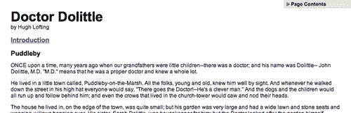

# 一、jQuery 脚本的剖析

> 他有了一个全新的开始
> 
> 现在他是个快乐的人
> 
> -德沃，
> 
> “快乐的家伙”

典型的 jQuery 脚本使用库提供的各种方法。选择器、DOM 操作、事件处理等根据手头任务的需要发挥作用。为了充分利用 jQuery，我们需要记住它提供的各种功能。

本书将详细列出 jQuery 库中的每个方法和函数。由于有许多方法和函数需要排序，因此了解方法的基本类别以及它们如何在 jQuery 脚本中发挥作用将非常有用。在这里，我们将看到一个功能完整的脚本，并检查在脚本的每个部分中如何利用 jQuery 的不同方面。

# 动态目录

作为 jQuery 的一个实例，我们将构建一个小脚本，它将动态地从 HTML 文档中提取标题，并将它们组装到该页面的目录中。

我们的目录将位于页面的右上角：



如上图所示，我们将使其最初折叠，但单击会将其扩展到全高：


同时，我们将向主体文本添加一个特性。页面上的文本介绍最初不会加载，但当用户单击单词**简介**时，介绍性文本将从另一个文件插入到位：


在展示执行这些任务的脚本之前，我们应该先了解脚本所在的环境。

## 获取 jQuery

jQuery 官方网站（[http://jquery.com/](http://jquery.com/) 始终是与库相关的代码和新闻的最新资源。首先，我们需要一份 jQuery 的副本，可以直接从网站主页下载。jQuery 的多个版本在任何给定时刻都可能可用；最新的未压缩版本最适合我们。

jQuery 不需要安装。要使用 jQuery，我们只需要将它放在网站的公共位置。因为 JavaScript 是一种解释语言，所以不需要担心编译或构建阶段。每当我们需要一个页面来提供 jQuery 时，我们只需从 HTML 文档中引用文件的位置。

## 设置 HTML 文档

jQuery 使用的大多数示例有三个部分——HTML 文档本身、用于设置其样式的 CSS 文件和用于对其进行操作的 JavaScript 文件。在本例中，我们将使用包含书籍文本的页面：

```js
<?xml version="1.0" encoding="UTF-8" ?>
<!DOCTYPE html PUBLIC "-//W3C//DTD XHTML 1.0 Transitional//EN"
	"http://www.w3.org/TR/xhtml1/DTD/xhtml1-transitional.dtd">

<html  xml:lang="en" lang="en">
  <head>
  	<meta http-equiv="Content-Type" content="text/html;
                                                   charset=utf-8"/>
  	<title>Doctor Dolittle</title>
    <link rel="stylesheet" href="dolittle.css" type="text/css" />
  	<script src="jquery.js" type="text/javascript"></script>
  	<script src="dolittle.js" type="text/javascript"></script>
  </head>
  <body>
    <div id="container">
      <h1>Doctor Dolittle</h1>
      <div class="author">by Hugh Lofting</div>
      <div id="introduction">
        <h2><a href="introduction.html">Introduction</a></h2>
      </div>
      <div id="content">
        <h2>Puddleby</h2>
        <p>ONCE upon a time, many years ago when our grandfatherswere little children--there was a doctor; and his name wasDolittle-- John Dolittle, M.D.  &quot;M.D.&quot; means that he was a proper doctor and knew a whole lot.</p>

           <!-- More text follows... -->

      </div>
    </div>
  </body>
</html>
```

### 注

服务器上文件的实际布局无关紧要。从一个文件到另一个文件的引用只需要调整以匹配我们选择的组织。在本书的大多数示例中，我们将使用参考文件的相对路径（`img/foo.png`），而不是绝对路径 img/foo.png`）。这将允许代码在本地运行，而不需要 web 服务器。

样式表在标准`<head>`元素之后立即加载。以下是样式表中影响动态元素的部分：

```js
/* -----------------------------------
   Page Table of Contents
-------------------------------------- */
#page-contents {
  position: absolute;
  text-align: left;
  top: 0;
  right: 0;
  width: 15em;
  border: 1px solid #ccc;
  border-top-width: 0;
  border-right-width: 0;
  background-color: #e3e3e3;
}
#page-contents h3 {
  margin: 0;
  padding: .25em .5em .25em 15px;
  background: url(arrow-right.gif) no-repeat 0 2px;
  font-size: 1.1em;
  cursor: pointer;
}
#page-contents h3.arrow-down {
  background-image: url(arrow-down.gif);
}
#page-contents a {
  display: block;
  font-size: 1em;
  margin: .4em 0;
  font-weight: normal;
}
#page-contents div {
  padding: .25em .5em .5em;  
  display: none;
  background-color: #efefef;
}

/* -----------------------------------
   Introduction
-------------------------------------- */
.dedication {
  margin: 1em;
  text-align: center;
  border: 1px solid #555;
  padding: .5em;
}
```

引用样式表后，将包含 JavaScript 文件。jQuery 库的脚本标记必须放在定制脚本的标记前面*处，这一点很重要；否则，当我们的代码试图引用 jQuery 框架时，它将不可用。*

## 编写 jQuery 代码

我们的自定义代码将出现在第二个 JavaScript 文件中，该文件当前为空，我们使用`<script src="dolittle.js" type="text/javascript"></script>`从 HTML 中包含该文件。不管它完成了多少，脚本还是相当简短：

```js
jQuery.fn.toggleNext = function() {
  this.toggleClass('arrow-down')
    .next().slideToggle('fast');
};

$(document).ready(function() {
  $('<div id="page-contents"></div>')
    .prepend('<h3>Page Contents</h3>')
    .append('<div></div>')
    .prependTo('body'); 

  $('#content h2').each(function(index) {
    var $chapterTitle = $(this);
    var chapterId = 'chapter-' + (index + 1);
    $chapterTitle.attr('id', chapterId);
    $('<a></a>').text($chapterTitle.text())
      .attr({
        'title': 'Jump to ' + $chapterTitle.text(),
        'href': '#' + chapterId
      })
      .appendTo('#page-contents div');
  });

  $('#page-contents h3').click(function() {
    $(this).toggleNext();
  });

  $('#introduction > h2 a').click(function() {
    $('#introduction').load(this.href);
    return false;
  });
});
```

我们现在有了一个动态目录，可以让用户看到文本的相关部分，还有一个按需加载的简介。

# 脚本解析

之所以选择这个脚本，是因为它展示了 jQuery 库的广泛功能。现在我们已经看到了整个代码，我们可以确定其中使用的方法的类别。

### 注

这里我们将不详细讨论此脚本的操作，但类似的脚本将作为学习 jQuery web 日志的教程提供：[http://www.learningjquery.com/2007/06/ 自动页面内容](http://www.learningjquery.com/2007/06/)。

## 选择器表达式

在处理 HTML 文档之前，我们需要找到相关部分。在我们的脚本中，我们有时使用一种简单的方法来查找元素：

```js
$('#introduction')

```

此表达式创建一个新的 jQuery 对象，该对象引用 ID 为`introduction`的元素。另一方面，有时我们需要更复杂的选择器：

```js
$('#introduction > h2 a')

```

这里我们生成一个 jQuery 对象，它可能引用许多元素。如果元素是锚定标记，则包含这些元素，但仅当它们是本身是 ID 为`introduction`的元素的子元素的`<h2>`元素的后代时，才会包含这些元素。

这些**选择器表达式**可以根据需要简单或复杂。[第 2 章](02.html "Chapter 2. Selector Expressions")将列举我们可以使用的所有选择器，以及它们如何组合。

## DOM 遍历方法

有时，我们有一个 jQuery 对象，它已经引用了一组 DOM 元素，但是我们需要对另一组相关的元素执行操作。在这些情况下，**DOM 遍历**方法非常有用。我们可以在部分脚本中看到这一点：

```js
this.toggleClass('arrow-down')
 .next()
  .slideToggle('fast');
```

由于这段代码的上下文，关键字`this`指的是 jQuery 对象（它通常指的是 DOM 元素）。在我们的例子中，这个 jQuery 对象依次指向目录的`<h3>`标题。`.toggleClass`方法调用操纵这个标题元素。不过，随后的`.next()`操作会更改我们正在使用的元素，因此下面的`.slideToggle`方法调用将作用于包含目录而不是其标题的`<div>`。[第 3 章](03.html "Chapter 3. DOM Traversal Methods")中列出了允许我们像这样在 DOM 树上自由移动的方法。

## DOM 操作方法

寻找元素是不够的；我们也希望能够改变它们。这样的更改可以像更改单个属性一样简单：

```js
$chapterTitle.attr('id', chapterId);

```

这里我们动态修改匹配元素的 ID。

另一方面，有时变化会进一步扩大：

```js
$('<div id="page-contents"></div>')
  .prepend('<h3>Page Contents</h3>')
  .append('<div></div>')
  .prependTo('body'); 
```

脚本的这一部分说明了**DOM 操纵**方法不仅可以在适当的位置更改元素，还可以移除、洗牌和插入元素。这些行在`<div id="page-contents">`的开头添加一个新标题，在其末尾插入另一个`<div>`容器，并将整个内容放在文档体的开头。[第 4 章](04.html "Chapter 4. DOM Manipulation Methods")将详细介绍这些以及更多修改 DOM 树的方法。

## 事件方法

即使我们可以随意修改页面，我们的页面也会原地不动，毫无反应。我们需要**事件方法**对用户输入做出反应，在适当的时间进行更改：

```js
$('#introduction > h2 a').click(function() {
  $('#introduction').load(this.href);
  return false;
});
```

在这个代码段中，我们注册了一个处理程序，它将在每次单击选定的锚标记时执行。点击事件是观察到的最常见事件之一，但还有许多其他事件；与之交互的 jQuery 方法将在[第 5 章](05.html "Chapter 5. Event Methods")中讨论。

[第 5 章](05.html "Chapter 5. Event Methods")还讨论了一种非常特殊的事件方法`.ready`：

```js
$(document).ready(function() {
  // ...
});
```

此方法允许我们注册在 DOM 结构可用于代码时立即发生的行为，甚至在加载图像之前。

## 效果方法

事件方法允许我们对用户输入做出反应；**效果方法**让我们用风格来做这件事。我们不需要立即隐藏和显示元素，而是可以通过动画来实现：

```js
this.toggleClass('arrow-down')
  .next()
 .slideToggle('fast');

```

该方法对元素执行快速滑动转换，在每次调用时交替隐藏和显示元素。[第 6 章](06.html "Chapter 6. Effect Methods")中列出了内置效果方法，以及创建新方法的方法。

## AJAX 方法

许多现代网站采用技术在请求时加载内容，无需页面刷新；jQuery 允许我们轻松地完成这项工作。**AJAX 方法**启动这些内容请求，并允许我们监控其进度：

```js
$('#introduction > h2 a').click(function() {
 $('#introduction').load(this.href);
  return false;
});
```

这里的`.load`方法允许我们从服务器获取另一个 HTML 文档，并将其插入当前文档中，所有操作都只需一行代码。[第 7 章](07.html "Chapter 7. AJAX Methods")中列出了从服务器检索信息的这种和更复杂的机制。

## 其他方法

有些方法比其他方法更难分类。jQuery 库包含了几个**杂项方法**，它们可以作为常用 JavaScript 习惯用法的简写。

jQuery 甚至简化了迭代等基本任务：

```js
$('#content h2').each(function(index) {
  // ...
});
```

这里看到的`.each`方法依次遍历匹配元素，在所有匹配元素上执行封闭代码。在本例中，该方法帮助我们收集页面上的所有标题，以便我们可以组装一个完整的目录。在[第 8 章](08.html "Chapter 8. Miscellaneous Methods")中可以找到更多类似的帮助函数。

## 插件式 API

我们也不需要局限于内置功能。作为 jQuery 一部分的**插件 API**允许我们使用新的功能来扩展现有的功能，以满足我们的需求。即使在我们在这里编写的小脚本中，我们也发现了插件的用途：

```js
jQuery.fn.toggleNext = function() {
  this.toggleClass('arrow-down')
    .next().slideToggle('fast');
};
```

这段代码定义了一个新的`.toggleNext`jQuery 方法，该方法可以滑动打开和关闭以下元素。现在，我们可以在以后需要时调用新方法：

```js
$('#page-contents h3').click(function() {
  $(this).toggleNext();
});
```

只要代码可以在当前脚本之外重用，它就可以作为一个插件。[第 9 章](09.html "Chapter 9. Plug-In API")将介绍用于构建这些扩展的插件 API。

# 总结

我们现在看到了一个完整的、功能强大的 jQuery 脚本。这个示例虽然很小，但为页面带来了大量的交互性和可用性。脚本还说明了 jQuery 提供的主要工具类型。我们观察了脚本如何在 DOM 中查找项并根据需要对其进行更改。我们见证了对用户操作的响应，以及在操作后向用户提供反馈的动画。我们甚至看到了如何在不刷新页面的情况下从服务器中提取信息，以及如何以插件的形式教授 jQuery 全新的技巧。

现在，我们将一章一章地逐步介绍 jQuery 库中的每个函数、方法和选择器表达式。在演示其中许多方面时，定制的日志功能将有助于我们的示例。此`.log`方法在有用的上下文中将文本打印到屏幕上；我们将在[第 9 章](09.html "Chapter 9. Plug-In API")末尾将其作为插件的一个示例进行剖析。

每个方法都将介绍其语法摘要、参数列表和返回值。然后我们将进行讨论，在适用的情况下提供示例。有关任何方法的进一步阅读，请参考[附录 A](12.html "Appendix A. Online Resources")中列出的在线资源。