# 四、DOM 操作方法

> 使他摆脱了致命的命运
> 
> 他使自己处于一种改变了的状态
> 
> -德沃，
> 
> “机械狂男孩”

本章中的所有方法都以某种方式操作 DOM。其中一些只是更改元素的一个属性，而另一些则设置元素的样式属性。还有一些修改整个图元（或图元组）本身，如插入、复制、删除等。

其中的一些方法，例如`.attr(), .html()`和`.val()`也充当**getter**，从 DOM 元素中检索信息以供以后使用。

# 一般属性

## .attr（属性）

<colgroup><col style="text-align: left"></colgroup> 
| 获取匹配元素集中第一个元素的属性值。

```js
.attr(attribute)

```

 |

### 参数

*   属性：要获取的属性的名称

### 返回值

包含属性值的字符串。

### 说明

通过使用本机 JavaScript 函数`getAttribute`，我们可以很容易地获得元素的任何属性，而无需 jQuery。此外，这些属性中的大多数可以通过 JavaScript 作为 DOM 节点属性使用。一些更常见的属性包括：

*   `className`
*   `tagName`
*   `id`
*   `href`
*   `title`
*   `rel`
*   `src`

让我们考虑以下链接：

```js
<a id="myid" href="/archives/jquery-links.htm" title="A few jQuery links from long ago">old jQuery links</a>

```

使用 jQuery 的`.attr`方法获取元素的属性有两个主要优点：

1.  **方便性**：可以链接到 jQuery 对象。
2.  **跨浏览器一致性**：无论使用哪个浏览器，`.attr`方法始终获取实际属性文本。另一方面，当将`getAttribute()`与`href, src`和`cite`等属性一起使用时，一些浏览器（正确）会获取属性文本，而其他浏览器则会获取绝对 URL，无论该属性是绝对 URL 还是相对 URL。

为了使用`getAttribute()`或元素的任何属性来替代`.attr()`，我们需要确保使用的是 DOM 节点，而不是 jQuery 对象。要将 jQuery 对象中表示的第一个元素转换为 DOM 节点，我们可以使用`[0]`或`.get(0)`。

以下所有操作都使用`getAttribute('title')`获取其`title`属性：

1.  `document.getElementById('myid').getAttribute('title')`
2.  `$('#myid').get(0).getAttribute('title')`
3.  `$('#myid')[0].getAttribute('title')`

使用这些选项中的任何一个，我们都可以用`.title`替换`.getAttribute('title')`。

## .attr（）

<colgroup><col style="text-align: left"></colgroup> 
| 为匹配元素集设置一个或多个属性。

```js
.attr(attribute, value)
.attr(map)
.attr(attribute, function)

```

 |

### 参数（第一版）

*   属性：要设置的属性的名称
*   值：要为属性设置的值

### 参数（第二版）

*   映射：要设置的属性值对的映射

### 参数（第三版）

*   属性：要设置的属性的名称
*   函数：返回要设置的值的函数

### 返回值

jQuery 对象，用于链接目的。

### 说明

`.attr`方法是设置属性值的一种方便而强大的方法，尤其是在设置多个属性或函数返回的值时。让我们考虑下面的形象：

```js


```

### .attr（属性、值）

我们通过将`'alt'`后跟一个逗号和新值放在`.attr`方法的括号内来更改`alt`属性：

```js
$('#greatphoto').attr('alt', 'Beijing Brush Seller');

```

我们可以用同样的方式*添加*属性：

```js
$('#greatphoto').attr('title', 'Beijing Brush Seller photo by Kelly Clark');

```

### .attr（{map}）

要更改`alt`属性并同时添加`title`属性，我们可以使用映射（JavaScript 对象语法）将两组名称和值同时传递到方法中。我们用冒号将每个属性与其值连接起来，并用逗号分隔每个属性对：

```js
$('#greatphoto').attr({alt:'Beijing Brush Seller', title: 'Beijing Brush Seller photo by Kelly Clark'});

```

设置多个属性时，属性名称周围的引号是可选的。

### .attr（属性、函数）

通过使用函数设置属性，我们可以将新值与现有值连接起来：

```js
$('#greatphoto').attr({alt: function() {return 'Beijing ' + this.alt}, title: function() {return 'Beijing ' + this.alt + ' photo by Kelly Clark'}});

```

当我们将属性应用于多个元素时，函数的这种使用会更加有用。

## .removeAttr（）

<colgroup><col style="text-align: left"></colgroup> 
| 从匹配元素集中的每个元素中删除属性。

```js
.removeAttr(attribute)

```

 |

### 参数

*   属性：属性

### 返回值

jQuery 对象，用于链接目的。

### 说明

`.removeAttr`方法使用 JavaScript`removeAttribute`函数，但它的优点是可以链接到 jQuery 选择器表达式。

# 风格属性

## .css（属性）

<colgroup><col style="text-align: left"></colgroup> 
| 获取匹配元素集中第一个元素的样式属性的值。

```js
.css(property)

```

 |

### 参数

*   属性：CSS 属性

### 返回值

包含 CSS 属性值的字符串。

### 说明

`.css`方法是从第一个匹配元素获取样式属性的一种方便方法，特别是考虑到浏览器对某些属性使用的不同术语。例如，Internet Explorer 的 DOM 实现将`float`属性称为`styleFloat`，而基于 Mozilla 的浏览器将其称为`cssFloat`。`.css`方法解释了这些差异，无论我们使用哪个术语，都会产生相同的结果。例如，向左浮动的元素将为以下三行中的每一行返回字符串`left`：

1.  `$('div.left').css('float')`；
2.  `$('div.left').css('cssFloat')`；
3.  `$('div.left').css('styleFloat')`；

此外，jQuery 还可以同等地解释多个单词属性的 CSS 和 DOM 格式。例如，jQuery 理解并返回`.css('background-color')`和`.css('backgroundColor')`的正确值。

## .css（）

<colgroup><col style="text-align: left"></colgroup> 
| 为匹配的元素集设置一个或多个 CSS 属性。

```js
.css(property, value)
.css(map)
.css(property, function)

```

 |

### 参数（第一版）

*   属性：CSS 属性名称
*   值：要为属性设置的值

### 参数（第二版）

*   映射：要设置的属性值对的映射

### 参数（第三版）

*   属性：CSS 属性名称
*   函数：返回要设置的值的函数

### 返回值

jQuery 对象，用于链接目的。

### 说明

与`.attr`方法一样，`.css`方法可以快速轻松地设置元素的属性。此方法可以采用逗号分隔的键值对，也可以采用冒号分隔的键值对的映射（JavaScript 对象表示法）。

此外，jQuery 还可以同等地解释多个单词属性的 CSS 和 DOM 格式。例如，jQuery 理解并返回`.css({'background-color':'#ffe', 'border-left': '5px solid #ccc'})`和`.css({backgroundColor:'#ffe', borderLeft: '5px solid #ccc'})`的正确值。请注意，对于 DOM 表示法，属性名称周围的引号是可选的，但是对于 CSS 表示法，由于名称中的连字符，它们是必需的。

由于`.css`方法在内部调用`.attr`方法，我们也可以传递一个函数作为属性值：

```js
$('div.example').css('width', function(index) {
  return index * 50;
});
```

本例将匹配元素的宽度设置为增量较大的值。

## .高度（）

<colgroup><col style="text-align: left"></colgroup> 
| 获取匹配元素集中第一个元素的当前计算高度。

```js
.height()

```

 |

### 参数

没有一个

### 返回值

元素的高度，以像素为单位。

### 说明

`.css('height')`和`.height()`之间的区别在于后者返回无单位像素值（例如`400`），而前者返回单位完整的值（例如`400px`）。当需要在数学计算中使用元件高度时，建议使用`.height`方法。

## .高度（值）

<colgroup><col style="text-align: left"></colgroup> 
| 设置匹配元素集中每个元素的 CSS 高度。

```js
.height(value)

```

 |

### 参数

*   值：表示像素数的整数，或附加可选度量单位的整数

### 返回值

jQuery 对象，用于链接目的。

### 说明

与`.css('height','value')`不同，使用`.height('value')`时，值可以是字符串（数字和单位）或数字。如果只为值提供了一个数字，jQuery 将采用像素单位。

## .宽度（）

<colgroup><col style="text-align: left"></colgroup> 
| 获取匹配元素集中第一个元素的当前计算宽度。

```js
.width()

```

 |

### 参数

没有一个

### 返回值

元素的宽度，以像素为单位。

### 说明

`.css(width)`和`.width()`的区别在于后者返回的是无单位像素值（例如`400)`，而前者返回的是单位完整的值（例如`400px)`。当需要在数学计算中使用元素宽度时，建议使用`.width`方法。

## .宽度（值）

<colgroup><col style="text-align: left"></colgroup> 
| 设置匹配元素集中每个元素的 CSS 宽度。

```js
.width(value)

```

 |

### 参数

*   值：表示像素数的整数，或附加可选度量单位的整数

### 返回值

jQuery 对象，用于链接目的。

### 说明

与`.css('width','value')`不同，使用`.width('value')`时，值可以是字符串（数字和单位）或数字。如果只为值提供了一个数字，jQuery 将采用像素单位。

# 类属性

## .addClass（）

<colgroup><col style="text-align: left"></colgroup> 
| 向匹配元素集中的每个元素添加一个或多个类。

```js
.addClass(class)

```

 |

### 参数

*   class：要添加到每个匹配元素的 class 属性中的一个或多个类名

### 返回值

jQuery 对象，用于链接目的。

### 说明

需要注意的是，这个方法并没有*替换类；它只是*添加了*类。*

一次可以向匹配元素集添加多个类，这些类之间用空格分隔，如下所示：`$('p').addClass('myclass yourclass')`。

此方法通常与`.removeClass()`一起用于将元素的类从一个切换到另一个，如下所示：

```js
$('p').removeClass('myclass noclass').addClass('yourclass')

```

这里，从所有段落中删除`myclass`和`noclass`类，同时添加`yourclass`。

## .removeClass（）

<colgroup><col style="text-align: left"></colgroup> 
| 从匹配元素集中的每个元素中删除一个或所有类。

```js
.removeClass([class])

```

 |

### 参数

*   类（可选）：要从每个匹配元素的 class 属性中删除的类名

### 返回值

jQuery 对象，用于链接目的。

### 说明

如果将类名作为参数包含，则仅该类将从匹配元素集中移除。如果参数中未指定类名，则将删除所有类。

一次可以从匹配的元素集合中删除多个类，并用空格分隔，如：`$('p').removeClass('myclass yourclass')`。

此方法通常与`.addClass()`一起用于将元素的类从一个切换到另一个，如下所示：

```js
$('p').removeClass('myclass').addClass('yourclass')

```

在这里，类`myclass`从所有段落中删除，同时添加 yourclass。

要用另一个类替换所有现有类，请使用`.attr('class','new-class')`。

## .toggleClass（）

<colgroup><col style="text-align: left"></colgroup> 
| 如果该类存在，`.toggleClass()`将其从匹配元素集中的每个元素中移除；如果不存在，则添加该类。

```js
.toggleClass(class)

```

 |

### 参数

*   class：要在匹配集中每个元素的 class 属性中切换的类名

### 返回值

jQuery 对象，用于链接目的。

### 说明

此方法将一个或多个类名作为其参数。如果匹配元素集中的元素已经具有该类，则将其移除；如果元素没有该类，则添加该类。例如，我们可以将`.toggleClass()`应用于一个简单的`<div>`：

```js
<div class="tumble">Some text.</div>

```

第一次申请`$('div.tumble').toggleClass('bounce')`时，我们得到以下信息：

```js
<div class="tumble bounce">Some text.</div>

```

第二次应用`$('div.tumble').toggleClass('bounce')`时，`<div>`类返回到单个`tumble`值：

```js
<div class="tumble">Some text.</div>

```

对同一个`<div>`应用`.toggleClass('bounce spin')`在`<div class="tumble bounce spin'>`和`<div class="tumble'>`之间交替。

# DOM 替换

## .html（）

<colgroup><col style="text-align: left"></colgroup> 
| 获取匹配元素集中第一个元素的 HTML 内容。

```js
.html()

```

 |

### 参数

没有一个

### 返回值

包含元素的 HTML 表示形式的字符串。

### 说明

此方法在 XML 文档上不可用。

在 HTML 文档中，我们可以使用`.html`方法获取任何元素的内容。如果选择器表达式匹配多个元素，则只返回第一个元素的 HTML 内容。考虑这个代码：

```js
$('div.demo-container').html();

```

为了检索以下`<div>`标记的内容，它必须是文档中的第一个内容：

```js
<div class="demo-container">
  <div class="demo-box">Demonstration Box
  </div>
</div>
```

结果如下所示：

```js
<div class="demo-box">Demonstration Box</div>

```

## .html（html）

<colgroup><col style="text-align: left"></colgroup> 
| 设置匹配元素集中每个元素的 HTML 内容。

```js
.html(HTML)

```

 |

### 参数

*   HTML：设置为每个匹配元素内容的 HTML 字符串

### 返回值

jQuery 对象，用于链接目的。

### 说明

`.html(HTML)`在 XML 文档中不可用。

当我们使用`.html(HTML)`设置元素的内容时，这些元素中的任何内容都会被新内容完全替换。考虑下面的 HTML：

```js
<div class="demo-container">
  <div class="demo-box">Demonstration Box
  </div>
</div>
```

我们可以这样设置`<div class="demo-container">`的 HTML 内容：

```js
$('div.demo-container'>.html('<p>All new content. <em>You bet!</em>');

```

该行代码将替换`<div class="demo-container">`中的所有内容：

```js
<div class="demo-container"><p>All new content. <em>You bet!</em></div>

```

## .text（）

<colgroup><col style="text-align: left"></colgroup> 
| 获取匹配元素集中每个元素（包括其子元素）的组合文本内容。

```js
.text()

```

 |

### 参数

没有一个

### 返回值

包含匹配元素的组合文本内容的字符串。

### 说明

与`.html`方法不同，`.text`方法可用于 XML 和 HTML 文档。`.text`方法的结果是一个字符串，包含所有匹配元素的组合文本。考虑下面的 HTML：

```js
<div class="demo-container">
  <div class="demo-box">Demonstration Box
  </div>
  <ul>
    <li>list item 1</li>
    <li>list <strong>item</strong> 2</li>
  </ul>
</div>
```

代码`$('div.demo-container').text()`将产生以下结果：

```js
Demonstration Boxlist item 1list item 2

```

## .文本（文本）

<colgroup><col style="text-align: left"></colgroup> 
| 将匹配元素集中每个元素的内容设置为指定文本。

```js
.text(text)

```

 |

### 参数

*   文本：设置为每个匹配元素内容的文本字符串

### 返回值

jQuery 对象，用于链接目的。

### 说明

与`.html(html)`方法不同，`.text(text)`可以在 XML 和 HTML 文档中使用。

需要注意的是，该方法将`<`和`>`替换为`&lt`；及`&gt`；，分别地考虑下面的 HTML：

```js
<div class="demo-container">
  <div class="demo-box">Demonstration Box
  </div>
  <ul>
    <li>list item 1</li>
    <li>list <strong>item</strong> 2</li>
  </ul>
</div>
```

代码`$('div.demo-container').text('<p>This is a test.</p>')`将生成以下 HTML：

```js
<div class="demo-container">&lt;p&gt;This is a test.&lt;/p&gt;</div>

```

它将显示在呈现的页面上，就像暴露了标记一样，如下所示：

```js
<p>This is a test</p>

```

## .val（）

<colgroup><col style="text-align: left"></colgroup> 
| 获取匹配元素集中第一个元素的当前值。

```js
.val()

```

 |

### 参数

没有一个

### 返回值

包含元素值的字符串。

### 说明

`.val`方法主要用于获取表单元素的值。

## .val（值）

<colgroup><col style="text-align: left"></colgroup> 
| 设置匹配元素集中每个元素的值。

```js
.val(value)

```

 |

### 参数

*   value：要设置为每个匹配元素的 value 属性的文本字符串

### 返回值

jQuery 对象，用于链接目的。

### 说明

此方法通常用于设置表单字段的值。

# DOM 插入，在内

## .prepend（）

<colgroup><col style="text-align: left"></colgroup> 
| 在匹配元素集中每个元素的开头插入由参数指定的内容。

```js
.prepend(content)

```

 |

### 参数

*   内容：在匹配元素集中每个元素的开头插入的元素、HTML 字符串或 jQuery 对象

### 返回值

jQuery 对象，用于链接目的。

### 说明

`.prepend`和`.prependTo`方法执行相同的任务。唯一的区别在于语法，特别是内容和目标的位置。对于`.prepend()`，方法前面的选择器表达式是插入内容的容器。另一方面，对于`.prependTo()`，内容位于方法之前，作为选择器表达式或动态创建的标记，并插入到目标容器中。

考虑下面的 HTML：

```js
<div class="demo-container">
  <div class="demo-box">Demonstration Box
  </div> 
</div>
```

两个`<div>`带有一点 CSS，呈现在页面右侧，如下所示：

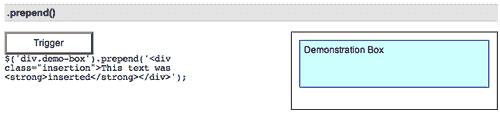

我们可以在`<div class="demo-box">`的开头插入 HTML 结构，如下所示：

```js
$('div.demo-box').prepend('<div class="insertion">This text was <strong>inserted</strong></div>');

```

新的`<div>`和`<strong>`元素以及文本节点是动态创建的，并添加到 DOM 中。结果是一个新的`<div>`位于**演示框**文本之前：

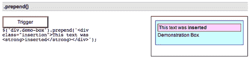

页面上已经存在的元素（或元素数组）也可以移动到`<div class="demo-box">`的开头。例如，以下代码使用 jQuery 对象移动文档的第一段：

```js
$('div.demo-box').prepend( $('p:eq(0)') );

```

## .prependTo（）

<colgroup><col style="text-align: left"></colgroup> 
| 在目标的开头插入匹配元素集中的每个元素。

```js
.prependTo(target)

```

 |

### 参数

*   目标：选择器、元素、HTML 字符串或 jQuery 对象；匹配的元素集将插入到此参数指定的元素的开头

### 返回值

jQuery 对象，用于链接目的。

### 说明

`.prepend`和`.prependTo`方法执行相同的任务。唯一的区别在于语法，特别是内容和目标的位置。对于`.prepend()`，方法前面的选择器表达式是插入内容的容器。另一方面，对于`.prependTo()`，*内容*位于方法之前，作为选择器表达式或动态创建的标记，并插入到目标容器中。

考虑下面的 HTML：

```js
<div class="demo-container">
  <div class="demo-box">Demonstration Box
  </div> 
</div>
```

两个`<div>`带有一点 CSS，呈现在页面右侧，如下所示：

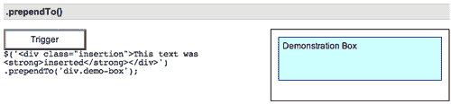

使用`.prependTo()`，我们可以在`<div class="demo-box">`的开头插入一个 HTML 结构，如下所示：

```js
$('<div class="insertion">This text was <strong>inserted</strong> </div>').prependTo('div.demo-box');

```

新的`<div>`和`<strong>`元素以及文本节点是动态创建的，并添加到 DOM 中。结果是一个新的`<div>`位于**演示框**文本之前：

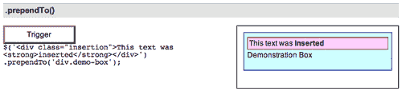

页面上已经存在的元素（或元素数组）也可以移动到`<div class="demo-box">`的开头。例如，以下代码通过对要插入的内容和目标使用选择器表达式来移动文档的第一段：

```js
$('p:eq(0)').prependTo('div.demo-box');

```

## .append（）

<colgroup><col style="text-align: left"></colgroup> 
| 在匹配元素集中每个元素的末尾插入参数指定的内容。

```js
.append(content)

```

 |

### 参数

*   内容：在匹配元素集中的每个元素末尾插入的选择器、元素、HTML 字符串或 jQuery 对象。

### 返回值

jQuery 对象，用于链接目的。

### 说明

`.append`和`.appendTo`方法执行相同的任务。唯一的区别在于语法，特别是内容和目标的位置。对于`.append()`，方法前面的选择器表达式是插入内容的容器。另一方面，对于`.appendTo()`，*内容*位于方法之前，作为选择器表达式或动态创建的标记，并插入到目标容器中。

考虑下面的 HTML：

```js
<div class="demo-container">
  <div class="demo-box">Demonstration Box
  </div> 
</div>
```

两个`<div>`带有一点 CSS，呈现在页面右侧，如下所示：

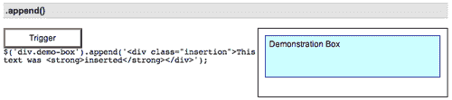

我们可以在`<div class="demo-box">`的末尾插入一个 HTML 结构，如下所示：

```js
$('div.demo-box').append('<div class="insertion">This text was <strong>inserted</strong></div>');

```

新的`<div>`和`<strong>`元素以及文本节点是动态创建的，并添加到 DOM 中。结果是一个新的`<div>`位于**演示框**文本之后：

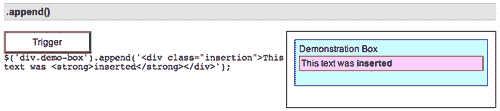

页面上已经存在的元素（或元素数组）也可以移动到`<div class="demo-box">`的末尾。例如，以下代码使用 jQuery 对象移动文档的第一段：

```js
$('div.demo-box').append( $('p:eq(0)') );

```

## .附录（）

<colgroup><col style="text-align: left"></colgroup> 
| 在目标的末尾插入匹配元素集中的每个元素。

```js
.appendTo(target)

```

 |

### 参数

*   目标：选择器、元素、HTML 字符串或 jQuery 对象；匹配的元素集将插入到此参数指定的元素末尾

### 返回值

jQuery 对象，用于链接目的。

### 说明

`.append`和`.appendTo`方法执行相同的任务。唯一的区别在于语法，特别是内容和目标的位置。对于`.append()`，方法前面的选择器表达式是插入内容的容器。另一方面，对于`.appendTo()`，*内容*位于方法之前，作为选择器表达式或动态创建的标记，并插入到目标容器中。

考虑下面的 HTML：

```js
<div class="demo-container">
  <div class="demo-box">Demonstration Box
  </div> 
</div>
```

两个`<div>`带有一点 CSS，呈现在页面右侧，如下所示：


使用`.appendTo()`，我们可以在`<div class="demo-box">`的末尾插入一个 HTML 结构，如下所示：

```js
$('<div class="insertion">This text was <strong>inserted</strong> </div>').appendTo('div.demo-box');

```

新的`<div>`和`<strong>`元素以及文本节点是动态创建的，并添加到 DOM 中。结果是一个新的`<div>`位于**演示框**文本之后：

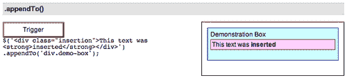

页面上已经存在的元素（或元素数组）也可以移动到`<div class="demo-box">`的末尾。例如，以下代码通过对要插入的内容和目标使用选择器表达式来移动文档的第一段：

```js
$('p:eq(0)').appendTo('div.demo-box');

```

# DOM 插入，外部

## .before（）

<colgroup><col style="text-align: left"></colgroup> 
| 在匹配元素集中的每个元素之前插入参数指定的内容。

```js
.before(content)

```

 |

### 参数

*   内容：在匹配元素集合中的每个元素之前插入的元素、HTML 字符串或 jQuery 对象

### 返回值

jQuery 对象，用于链接目的。

### 说明

`.before`和`.insertBefore`方法执行相同的任务。唯一的区别在于语法，特别是内容和目标的位置。对于`.before()`，方法前面的选择器表达式是插入内容的容器。另一方面，对于`.insertBefore()`，*内容*位于方法之前，作为选择器表达式或动态创建的标记，并插入到目标容器之前。

考虑下面的 HTML：

```js
<div class="demo-container">
  <div class="demo-box">Demonstration Box
  </div> 
</div>
```

两个`<div>`带有一点 CSS，呈现在页面右侧，如下所示：

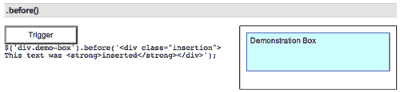

我们可以在`<div class="demo-box">`之前插入 HTML 结构，如下所示：

```js
$('div.demo-box').before('<div class="insertion">This text was <strong>inserted</strong></div>');

```

新的`<div>`和`<strong>`元素以及文本节点是动态创建的，并添加到 DOM 中。结果是一个新的`<div>`位于`<div class="demo-box">`之前的外部：

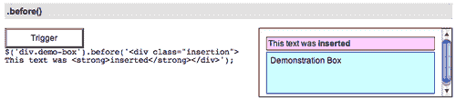

页面上已经存在的元素（或元素数组）也可以移动到`<div class="demo-box">`之前的 DOM 位置。例如，以下代码使用 jQuery 对象移动文档的第一段：

```js
$('div.demo-box').before( $('p:eq(0)') );

```

## .insertBefore（）

<colgroup><col style="text-align: left"></colgroup> 
| 在参数中指定的元素集之前插入匹配元素集中的每个元素。

```js
.insertBefore(content)

```

 |

### 参数

*   内容：将在其前面插入匹配的元素集的选择器或元素

### 返回值

jQuery 对象，用于链接目的。

### 说明

`.before`和`.insertBefore`方法执行相同的任务。唯一的区别在于语法，特别是内容和目标的位置。对于`.before()`，方法前面的选择器表达式是插入内容的容器。另一方面，对于`.insertBefore()`，*内容*位于方法之前，作为选择器表达式或动态创建的标记，并插入到目标容器之前。

考虑下面的 HTML：

```js
<div class="demo-container">
  <div class="demo-box">Demonstration Box
  </div> 
</div>
```

两个`<div>`带有一点 CSS，呈现在页面右侧，如下所示：

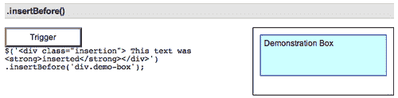

我们可以在`<div class="demo-box">`之前插入一个 HTML 结构，如下所示：

```js
$('<div class="insertion">This text was <strong>inserted</strong> </div>').insertBefore('div.demo-box');

```

新的`<div>`和`<strong>`元素以及文本节点是动态创建的，并添加到 DOM 中。结果是一个新的`<div>`位于`<div class="demo-box">`之前的外部：

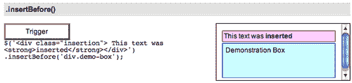

页面上已经存在的元素（或元素数组）也可以移动到`<div class="demo-box">`之前的 DOM 位置。例如，以下代码使用 jQuery 对象移动文档的第一段：

```js
$('p:eq(0)').insertBefore('div.demo-box');

```

## 。在（）之后

<colgroup><col style="text-align: left"></colgroup> 
| 在匹配元素集中的每个元素后插入参数指定的内容。

```js
.after(content)

```

 |

### 参数

*   内容：在匹配元素集中的每个元素之后插入的元素、HTML 字符串或 jQuery 对象。

### 返回值

jQuery 对象，用于链接目的。

### 说明

`.after`和`.insertAfter`方法执行相同的任务。唯一的区别在于语法，特别是内容和目标的位置。对于`.after()`，方法前面的选择器表达式是插入内容的容器。另一方面，对于`.insertAfter()`，*内容*位于方法之前，作为选择器表达式或动态创建的标记，并插入到目标容器之后。

考虑下面的 HTML：

```js
<div class="demo-container">
  <div class="demo-box">Demonstration Box
  </div> 
</div>
```

两个`<div>`带有一点 CSS，呈现在页面右侧，如下所示：

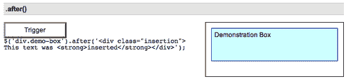

我们可以在`<div class="demo-box">`之后插入 HTML 结构，如下所示：

```js
$('div.demo-box').after('<div class="insertion">This text was <strong>inserted</strong></div>');

```

新的`<div>`和`<strong>`元素以及文本节点是动态创建的，并添加到 DOM 中。结果是一个新的`<div>`位于`<div class="demo-box">`之外，紧随其后：

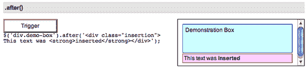

页面上已经存在的元素（或元素数组）也可以在`<div class="demo-box">`之后移动到 DOM 位置。例如，以下代码使用 jQuery 对象移动文档的第一段：

```js
$('div.demo-box').after( $('p:eq(0)') );

```

## .insertAfter（）

<colgroup><col style="text-align: left"></colgroup> 
| 在参数中指定的元素集之后插入匹配元素集中的每个元素。

```js
.insertAfter(content)

```

 |

### 参数

*   内容：一个选择器或元素，在该选择器或元素之后将插入匹配的元素集

### 返回值

jQuery 对象，用于链接目的。

### 说明

`.after`和`.insertAfter`方法执行相同的任务。唯一的区别在于语法，特别是内容和目标的位置。对于`.after()`，方法前面的选择器表达式是插入内容的容器。另一方面，对于`.insertAfter()`，*内容*位于方法之前，作为选择器表达式或动态创建的标记，并插入到目标容器之后。

考虑下面的 HTML：

```js
<div class="demo-container">
  <div class="demo-box">Demonstration Box
  </div> 
</div>
```

两个`<div>`带有一点 CSS，呈现在页面右侧，如下所示：

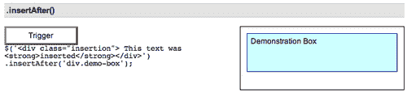

使用`.insertAfter()`，我们可以在`<div class="demo-box">`之后插入一个 HTML 结构，如下所示：

```js
$('<div class="insertion">This text was <strong>inserted</strong> </div>').insertAfter('div.demo-box');

```

新的`<div>`和`<strong>`元素以及文本节点是动态创建的，并添加到 DOM 中。结果是一个新的`<div>`位于`<div class="demo-box">`之外，紧随其后：

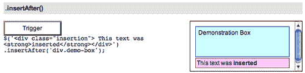

页面上已经存在的元素（或元素数组）也可以在`<div class="demo-box">`之后移动到 DOM 位置。例如，以下代码使用 jQuery 对象移动文档的第一段：

```js
$('p:eq(0)').insertAfter('div.demo-box');

```

# DOM 插入，大约

## .wrap（）

<colgroup><col style="text-align: left"></colgroup> 
| 围绕匹配元素集中的每个元素包装元素结构。

```js
.wrap(html)
.wrap(element)

```

 |

### 参数（第一版）

*   html：围绕匹配元素集合的 html 标记字符串

### 参数（第二版）

*   元素：环绕匹配元素集的现有元素

### 返回值

jQuery 对象，用于链接目的。

### 说明

注意：HTML 必须只包含格式良好、有效的元素结构。如果包含任何文本，或任何标签未关闭，`.wrap()`将失败。

考虑下面的 HTML：

```js
<div class="demo-container">
  <div class="demo-box">Demonstration Box
  </div> 
</div>
```

两个`<div>`带有一点 CSS，呈现在页面右侧，如下所示：

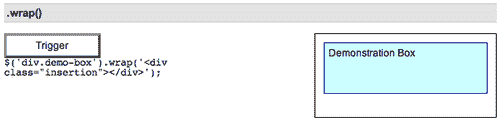

使用`.wrap()`，我们可以在`<div class="demo-box">`周围插入 HTML 结构，如下所示：

```js
$('div.demo-box').wrap('<div class="insertion"> </div>');

```

新的`<div>`元素是动态创建的，并添加到 DOM 中。结果是一个新的`<div>`包裹在`<div class="demo-box">`周围：

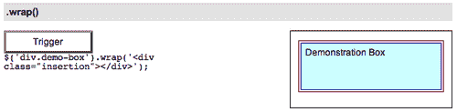

使用 DOM 节点作为我们的参数，我们可以将新的`<div>`包装在带有`id="demo-box1"`的元素周围，如下所示：

```js
$(document.getElementById('demo-box1')).wrap(' <div class="insertion"> </div>');

```

# DOM 复制

## .clone（）

<colgroup><col style="text-align: left"></colgroup> 
| 创建匹配元素集的副本。

```js
.clone([deep])

```

 |

### 参数

*   深度（可选）：布尔值。默认为`true`。如果设置为`false`，则`.clone`方法仅复制匹配的元素本身，不包括任何子元素/子元素和文本。

### 返回值

一个新的 jQuery 对象，引用创建的元素。

### 说明

`.clone`方法与其中一种插入方法结合使用时，可以方便地复制页面上的元素。考虑下面的 HTML：

```js
<div class="demo-container">
  <div class="demo-box">Demonstration Box
  </div> 
</div>
```

两个`<div>`带有一点 CSS，呈现在页面右侧，如下所示：

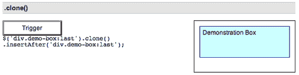

要复制`<div class="demo-box">`并将该副本粘贴到原件之后，我们可以编写以下内容：

```js
$('div.demo-box:last').clone().insertAfter('div.demo-box:last');

```

现在我们有两个**演示箱**：

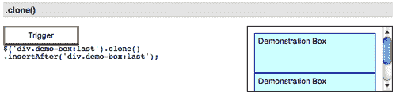

请注意，我们在这里使用了`:last`选择器，因此我们确保只复制（`.clone()`）和粘贴（`.insertAfter()`）单个副本。我们需要意识到无意中克隆或插入超出我们预期的内容的可能性，并采取必要的预防措施防止这种情况发生。

### 提示

通过`.clone`方法，我们可以在将克隆元素插入文档之前修改克隆元素或其内容。

可选的`deep`参数接受布尔值-`true`或`false`。因为在大多数情况下，我们也希望克隆子节点，并且由于默认值为`true`，所以很少使用该参数。然而，想象一下，我们想要复制没有文本的**演示框**，然后在每个`<div class="demo-box">`后面添加一个段落。我们可以通过以下代码实现这一点：

```js
$('div.demo-box:last').clone(false).insertAfter('div.demo-box:last');
$('div.demo-box').append('<p>New Message</p>);

```

现在，这两个框如下所示：

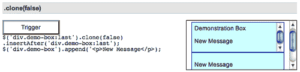

第一个框现在既有原始的**演示框**文本，也有附加的**新消息**文本，而新的克隆框只有附加文本。

# DOM 去除

## .空（）

<colgroup><col style="text-align: left"></colgroup> 
| 从 DOM 中删除匹配元素集的所有子节点。

```js
.empty()

```

 |

### 参数

没有一个

### 返回值

jQuery 对象，用于链接目的。

### 说明

此方法不仅删除子元素（和其他子元素），还删除匹配元素集中的任何文本。这是因为，根据 DOM，元素中的任何文本字符串都被视为该元素的子节点。考虑下面的 HTML：

```js
<div class="demo-container">
  <div class="demo-box">Demonstration Box
  </div> 
</div>
```

两个`<div>`带有一点 CSS，呈现在页面右侧，如下所示：


如果我们申请`$('div.demo-box').empty()`；为此，删除了**演示框**文本字符串：

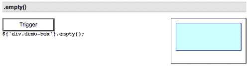

如果`<div class="demo-box">`中有任意数量的嵌套元素，它们也会被删除。

## .删除（）

<colgroup><col style="text-align: left"></colgroup> 
| 从 DOM 中删除匹配的元素集。

```js
.remove([selector])

```

 |

### 参数

*   选择器（可选）：筛选要删除的匹配元素集的选择器

### 返回值

jQuery 对象，用于链接目的。

### 说明

与.empty 类似，`.remove`方法从 DOM 中取出元素。当我们想要移除元素本身以及元素内部的所有东西时，我们使用`.remove()`。考虑下面的 HTML：

```js
<div class="demo-container">
  <div class="demo-box">Demonstration Box
  </div> 
</div>
```

两个`<div>`带有一点 CSS，呈现在页面右侧，如下所示：

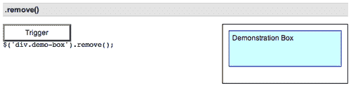

如果我们对其应用`$('div.demo-box').remove()`，则整个`<div class="demo-box>`以及其中的所有内容都将被删除：

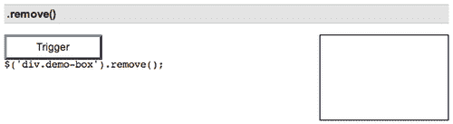

我们还可以包含一个选择器作为可选参数。例如，我们可以将前面的 DOM 删除代码重写如下：`$('div').remove('.demo-box')`。或者，如果我们有多个具有相同类名的元素，并且只想删除第一个元素，即带有`id="temporary-demo-box"`的元素，那么我们可以编写以下代码：

```js
$('div.demo‑box').remove('#temporary-demo-box ').

```