# 六、效果方法

> 它有风格，有品位
> 
> -德沃，
> 
> “无法控制的冲动”

在本章中，我们将仔细研究每种效果方法，揭示 jQuery 为用户提供视觉反馈的所有机制。

# 预包装效果

这些方法允许我们以最小的配置快速应用常用效果。

## .show（）

<colgroup><col style="text-align: left"></colgroup> 
| 显示匹配的元素。

```js
.show([speed][, callback])

```

 |

### 参数

*   速度（可选）：确定动画将运行多长时间的字符串或数字
*   回调（可选）：动画完成后调用的函数

### 返回值

jQuery 对象，用于链接目的。

### 说明

由于没有参数，`.show()`方法是显示元素的最简单方法：

```js
$('.target').show();

```

匹配的元素将立即显示，没有动画。这大致相当于调用`.css('display', 'block')`，不同的是`display`属性恢复到最初的状态。如果一个元素被赋予一个`display`值`inline`，那么它被隐藏并显示，它将再次被显示`inline`。

当提供速度时，`.show()`成为一种动画方法。`.show()`方法同时设置匹配元素的宽度、高度和不透明度的动画。

速度以动画的毫秒持续时间表示；值越高表示动画速度越慢，*而不是*速度越快。可以提供字符串`fast, normal`和`slow`分别指示`200, 400`和`600`的速度值。如果省略速度参数，则假定为`normal`。

如果已提供，则在动画完成后将触发回调。这对于按顺序将不同动画串在一起非常有用。回调没有发送任何参数，但将`this`设置为正在设置动画的 DOM 元素。每个匹配元素执行一次回调，*而不是*对整个动画执行一次回调。

我们可以设置任何元素的动画，例如包含图像的简单`<div>`：

```js
<div class="content">
  <div class="trigger button">Trigger</div>
  <div class="target"></div>
  <div class="log"></div>
</div>
```

在元素最初隐藏的情况下，我们可以缓慢地显示它：

```js
$('.trigger').click(function() {
  $('.target').show('slow', function() {
    $(this).log('Effect complete.');
  });
});
```

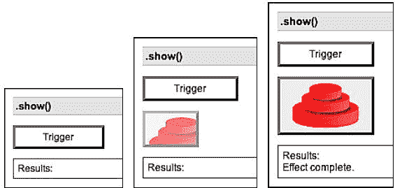

## .hide（）

<colgroup><col style="text-align: left"></colgroup> 
| 隐藏匹配的元素。

```js
.hide([speed][, callback])

```

 |

### 参数

*   速度（可选）：确定动画将运行多长时间的字符串或数字
*   回调（可选）：动画完成后调用的函数

### 返回值

jQuery 对象，用于链接目的。

### 说明

由于没有参数，`.hide()`方法是隐藏元素的最简单方法：

```js
$('.target').hide();

```

匹配的元素将立即隐藏，没有动画。这大致相当于调用`.css('display', 'none')`，只是`display`属性的值被保存为元素的另一个属性，以便`display`稍后可以恢复为其初始值。如果一个元素被赋予一个`display`值作为`inline`，则该元素被隐藏并显示，它将再次显示`inline`。

当提供速度时，`.hide()`成为一种动画方法。`.hide()`方法同时设置匹配元素的宽度、高度和不透明度的动画。

速度以动画的毫秒持续时间表示；值越高表示动画速度越慢，*而不是*速度越快。可以提供字符串`fast, normal`和`slow`分别指示`200, 400`和`600`的速度值。如果省略速度参数，则假定为`normal`。

如果已提供，则在动画完成后将触发回调。这对于按顺序将不同动画串在一起非常有用。回调没有发送任何参数，但将`this`设置为正在设置动画的 DOM 元素。对每个匹配的元素执行一次回调，而不是对整个动画执行一次回调。

我们可以设置任何元素的动画，例如包含图像的简单`<div>`：

```js
<div class="content">
  <div class="trigger button">Trigger</div>
  <div class="target"></div>
  <div class="log"></div>
</div>
```

初始显示元素后，我们可以慢慢隐藏它：

```js
$('.trigger').click(function() {
  $('.target').hide('slow', function() {
    $(this).log('Effect complete.');
  });
});
```

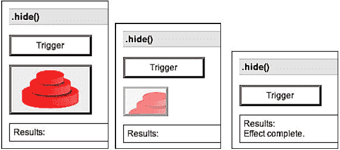

## .toggle（）

<colgroup><col style="text-align: left"></colgroup> 
| 显示或隐藏匹配的元素。

```js
.toggle([speed][, callback])

```

 |

### 参数

*   速度（可选）：确定动画将运行多长时间的字符串或数字
*   回调（可选）：动画完成后调用的函数

### 返回值

jQuery 对象，用于链接目的。

### 说明

没有参数，`.toggle()`方法只是切换元素的可见性：

```js
$('.target').toggle();

```

匹配的元素将立即显示或隐藏，没有动画。如果元素最初显示，它将被隐藏；如果隐藏，它将显示。`display`属性会根据需要进行保存和恢复。如果一个元素的`display`值为`inline`，则该元素被隐藏并显示，它将再次显示`inline`。

当提供速度时，`.toggle()`成为一种动画方法。`.toggle()`方法同时设置匹配元素的宽度、高度和不透明度的动画。

速度以动画的毫秒持续时间表示；值越高表示动画速度越慢，*而不是*速度越快。可以提供字符串`fast, normal`和`slow`分别指示`200, 400`和`600`的速度值。如果省略速度参数，则假定为`normal`。

如果已提供，则在动画完成后将触发回调。这对于按顺序将不同动画串在一起非常有用。回调没有发送任何参数，但将`this`设置为正在设置动画的 DOM 元素。对每个匹配的元素执行一次回调，而不是对整个动画执行一次回调。

我们可以设置任何元素的动画，例如包含图像的简单`<div>`：

```js
<div class="content">
  <div class="trigger button">Trigger</div>
  <div class="target"></div>
  <div class="log"></div>
</div>
```

初始显示元素后，我们可以慢慢隐藏和显示它：

```js
$('.trigger').click(function() {
  $('.target').toggle('slow', function() {
    $(this).log('Effect complete.');
  });
});
```

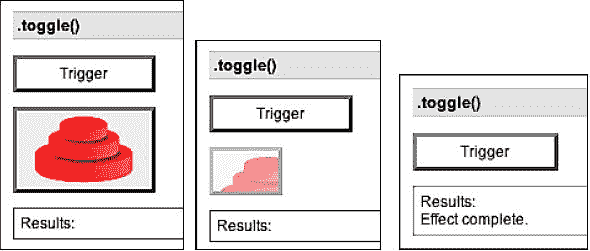

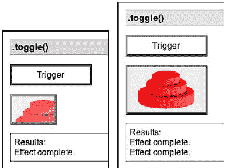

## .slideDown（）

<colgroup><col style="text-align: left"></colgroup> 
| 显示具有滑动运动的匹配图元。

```js
.slideDown([speed][, callback])

```

 |

### 参数

*   速度（可选）：确定动画将运行多长时间的字符串或数字
*   回调（可选）：动画完成后调用的函数

### 返回值

jQuery 对象，用于链接目的。

### 说明

`.slideDown()`方法为匹配元素的高度设置动画。这会导致页面下部向下滑动，为显示的项目让路。

速度以动画的毫秒持续时间表示；值越高表示动画速度越慢，*而不是*速度越快。可以提供字符串`fast, normal`和`slow`分别指示`200, 400`和`600`的速度值。如果省略速度参数，则假定为`normal`。

如果已提供，则在动画完成后将触发回调。这对于按顺序将不同动画串在一起非常有用。回调没有发送任何参数，但将`this`设置为正在设置动画的 DOM 元素。对每个匹配的元素执行一次回调，而不是对整个动画执行一次回调。

我们可以设置任何元素的动画，例如包含图像的简单`<div>`：

```js
<div class="content">
  <div class="trigger button">Trigger</div>
  <div class="target"></div>
  <div class="log"></div>
</div>
```

在元素最初隐藏的情况下，我们可以缓慢地显示它：

```js
$('.trigger').click(function() {
  $('.target').slideDown('slow', function() {
    $(this).log('Effect complete.');
  });
});
```

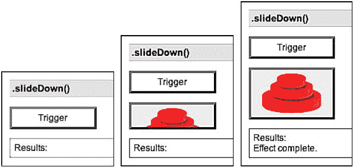

## .slideUp（）

<colgroup><col style="text-align: left"></colgroup> 
| 通过滑动运动隐藏匹配的元素。

```js
.slideUp([speed][, callback])

```

 |

### 参数

*   速度（可选）：确定动画将运行多长时间的字符串或数字
*   回调（可选）：动画完成后调用的函数

### 返回值

jQuery 对象，用于链接目的。

### 说明

`.slideUp()`方法为匹配元素的高度设置动画。这会导致页面的下部向上滑动，似乎隐藏了项目。

速度以动画的毫秒持续时间表示；值越高表示动画速度越慢，*而不是*速度越快。可以提供字符串`fast, normal`和`slow`分别指示`200, 400`和`600`的速度值。如果省略速度参数，则假定为`normal`。

如果已提供，则在动画完成后将触发回调。这对于按顺序将不同动画串在一起非常有用。回调没有发送任何参数，但将`this`设置为正在设置动画的 DOM 元素。对每个匹配的元素执行一次回调，而不是对整个动画执行一次回调。

我们可以设置任何元素的动画，例如包含图像的简单`<div>`：

```js
<div class="content">
  <div class="trigger button">Trigger</div>
  <div class="target"></div>
  <div class="log"></div>
</div>
```

元素最初可见时，我们可以慢慢隐藏它：

```js
$('.trigger').click(function() {
  $('.target').slideUp('slow', function() {
    $(this).log('Effect complete.');
  });
});
```

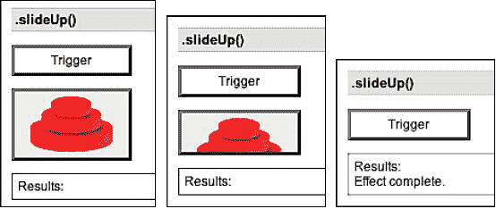

## .滑动切换（）

<colgroup><col style="text-align: left"></colgroup> 
| 显示或隐藏具有滑动运动的匹配元素。

```js
.slideToggle([speed][, callback])

```

 |

### 参数

*   速度（可选）：确定动画将运行多长时间的字符串或数字
*   回调（可选）：动画完成后调用的函数

### 返回值

jQuery 对象，用于链接目的。

### 说明

`.slideToggle()`方法为匹配元素的高度设置动画。这会导致页面下部向上或向下滑动，以隐藏或显示项目。

速度以动画的毫秒持续时间表示；值越高表示动画速度越慢，*而不是*速度越快。可以提供字符串`fast, normal`和`slow`分别指示`200, 400`和`600`的速度值。如果省略速度参数，则假定为`normal`。

如果已提供，则在动画完成后将触发回调。这对于按顺序将不同动画串在一起非常有用。回调没有发送任何参数，但将`this`设置为正在设置动画的 DOM 元素。对每个匹配的元素执行一次回调，而不是对整个动画执行一次回调。

我们可以设置任何元素的动画，例如包含图像的简单`<div>`：

```js
<div class="content">
  <div class="trigger button">Trigger</div>
  <div class="target"></div>
  <div class="log"></div>
</div>
```

初始显示元素后，我们可以慢慢隐藏和显示它：

```js
$('.trigger').click(function() {
  $('.target').slideToggle('slow', function() {
    $(this).log('Effect complete.');
  });
});
```

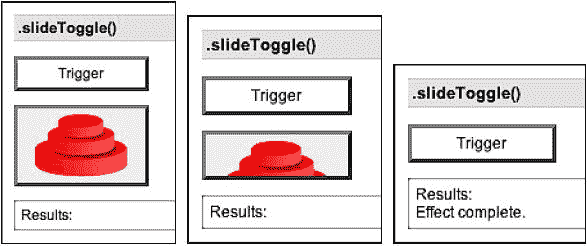

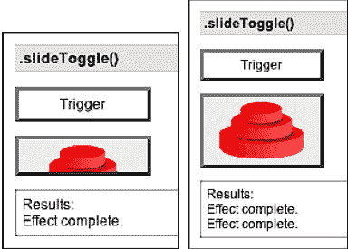

## .fadeIn（）

<colgroup><col style="text-align: left"></colgroup> 
| 通过将匹配的图元淡入不透明状态来显示这些图元。

```js
.fadeIn([speed][, callback])

```

 |

### 参数

*   速度（可选）：确定动画将运行多长时间的字符串或数字
*   回调（可选）：动画完成后调用的函数

### 返回值

jQuery 对象，用于链接目的。

### 说明

`.fadeIn()`方法为匹配元素的不透明度设置动画。

速度以动画的毫秒持续时间表示；值越高表示动画速度越慢，*而不是*速度越快。可以提供字符串`fast, normal`和`slow`分别指示`200, 400`和`600`的速度值。如果省略速度参数，则假定为`normal`。

如果已提供，则在动画完成后将触发回调。这对于按顺序将不同动画串在一起非常有用。回调没有发送任何参数，但将`this`设置为正在设置动画的 DOM 元素。每个匹配元素执行一次回调，*而不是*对整个动画执行一次回调。

我们可以设置任何元素的动画，例如包含图像的简单`<div>`：

```js
<div class="content">
  <div class="trigger button">Trigger</div>
  <div class="target"></div>
  <div class="log"></div>
</div>
```

在元素最初隐藏的情况下，我们可以缓慢地显示它：

```js
$('.trigger').click(function() {
  $('.target').fadeIn('slow', function() {
    $(this).log('Effect complete.');
  });
});
```

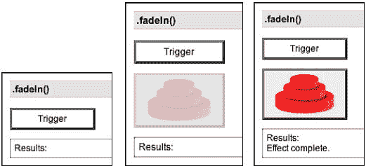

## .fadeOut（）

<colgroup><col style="text-align: left"></colgroup> 
| 通过将匹配的元素淡入透明状态来隐藏这些元素。

```js
.fadeOut([speed][, callback])
```

 |

### 参数

*   速度（可选）：确定动画将运行多长时间的字符串或数字
*   回调（可选）：动画完成后调用的函数

### 返回值

jQuery 对象，用于链接目的。

### 说明

`.fadeOut()`方法为匹配元素的不透明度设置动画。

速度以动画的毫秒持续时间表示；值越高表示动画速度越慢，*而不是*速度越快。可以提供字符串`fast, normal`和`slow`分别指示`200, 400`和`600`的速度值。如果省略速度参数，则假定为`normal`。

如果已提供，则在动画完成后将触发回调。这对于按顺序将不同动画串在一起非常有用。回调没有发送任何参数，但将`this`设置为正在设置动画的 DOM 元素。每个匹配元素执行一次回调，*而不是*对整个动画执行一次回调。

我们可以设置任何元素的动画，例如包含图像的简单`<div>`：

```js
<div class="content">
  <div class="trigger button">Trigger</div>
  <div class="target"></div>
  <div class="log"></div>
</div>
```

初始显示元素后，我们可以慢慢隐藏它：

```js
$('.trigger').click(function() {
  $('.target').fadeOut('slow', function() {
    $(this).log('Effect complete.');
  });
});
```

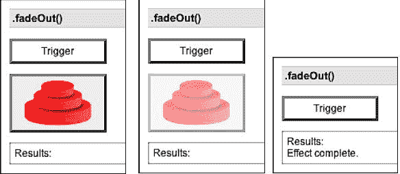

## .fadeTo（）

<colgroup><col style="text-align: left"></colgroup> 
| 调整匹配元素的不透明度。

```js
.fadeTo(speed, opacity[, callback])
```

 |

### 参数

*   速度：确定动画将运行多长时间的字符串或数字
*   不透明度：介于 0 和 1 之间的数字，表示目标不透明度
*   回调：（可选）：动画完成后调用的函数

### 返回值

jQuery 对象，用于链接目的。

### 说明

`.fadeTo()`方法为匹配元素的不透明度设置动画。

速度以动画的毫秒持续时间表示；值越高表示动画速度越慢，*而不是*速度越快。可以提供字符串`fast, normal`和`slow`分别指示`200, 400`和`600`的速度值。与其他效果方法不同，`.fadeTo()`要求明确指定速度。

如果已提供，则在动画完成后将触发回调。这对于按顺序将不同动画串在一起非常有用。回调没有发送任何参数，但将`this`设置为正在设置动画的 DOM 元素。每个匹配元素执行一次回调，*而不是*对整个动画执行一次回调。

我们可以设置任何元素的动画，例如包含图像的简单`<div>`：

```js
<div class="content">
  <div class="trigger button">Trigger</div>
  <div class="target"></div>
  <div class="log"></div>
</div>
```

初始显示该元素后，我们可以将其慢慢调暗：

```js
$('.trigger').click(function() {
  $('.target').fadeTo('slow', 0.5, function() {
    $(this).log('Effect complete.');
  });
});
```

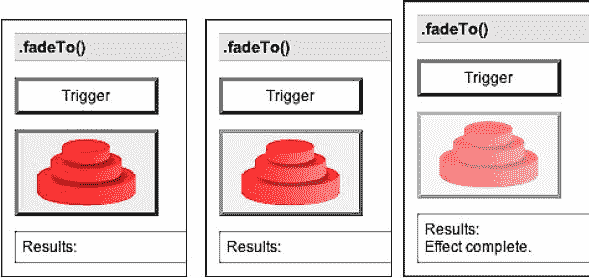

当*速度*设置为`0`时，此方法只是改变`opacity`CSS 属性，所以`.fadeTo(0, opacity)`与`.css('opacity', opacity)`相同。

### 注

在 1.1.3 之前的 jQuery 版本中，`.fadeTo()`将元素的`display`属性设置为`block`。当与非块项（如表行和内联元素）一起使用时，这可能会导致奇怪的布局渲染。从 jQuery1.1.3 开始，淡入淡出可以安全地用于这些元素。

# 定制效果

本节介绍如何创建 jQuery 未提供的即时效果。

## .动画制作（）

<colgroup><col style="text-align: left"></colgroup> 
| 执行一组 CSS 属性的自定义动画。

```js
.animate(properties[, speed][, easing][, callback])
```

 |

### 参数

*   属性：动画将移向的 CSS 属性地图
*   速度（可选）：确定动画将运行多长时间的字符串或数字
*   缓和（可选）：一个字符串，指示用于过渡的缓和函数
*   回调（可选）：动画完成后调用的函数

### 返回值

jQuery 对象，用于链接目的。

### 说明

`.animate()`方法允许我们在任何数值 CSS 属性上创建动画效果。唯一需要的参数是 CSS 属性的映射。此映射类似于可以发送到`.css()`方法的映射，只是属性的范围更严格。

所有动画特性都被视为像素数。如果属性最初是以不同的单位指定的，例如 ems 或百分比，则可能会产生奇怪的结果。

除数值外，每个属性还可以接受字符串`show, hide`和`toggle`。这些快捷方式允许根据元素的显示类型自定义隐藏和显示动画。

速度以动画的毫秒持续时间表示；值越高表示动画速度越慢，*而不是*速度越快。可以提供字符串`fast, normal`和`slow`分别指示`200, 400`和`600`的速度值。如果省略速度参数，则假定为`normal`。

如果已提供，则在动画完成后将触发回调。这对于按顺序将不同动画串在一起非常有用。回调没有发送任何参数，但将`this`设置为正在设置动画的 DOM 元素。每个匹配元素执行一次回调，*而不是*对整个动画执行一次回调。

我们可以设置任何元素的动画，例如包含图像的简单`<div>`：

```js
<div class="content">
  <div class="trigger button">Trigger</div>
  <div class="target"></div>
  <div class="log"></div>
</div>
```

我们可以同时设置多个属性的动画：

```js
$('.trigger').click(function() {
  $('.target').animate({
    'width': 300,
    'left': 100,
    'opacity': 0.25
  }, 'slow', function() {
    $(this).log('Effect complete.');
  });
});
```

如果我们希望像在示例中那样设置`left`属性的动画，那么元素的`position`属性不能是`fixed`。

### 注

在*接口*插件中可以找到`.animate()`方法的更复杂版本。它处理一些非数字样式，例如颜色，还处理类动画而不是单个属性。

`.animate()`的剩余参数是一个字符串，用于命名要使用的缓和函数。缓和函数指定动画在动画中不同点的进展速度。jQuery 库中唯一的实现是默认的`linear`。使用插件（如 Interface）可以提供更多的轻松功能。