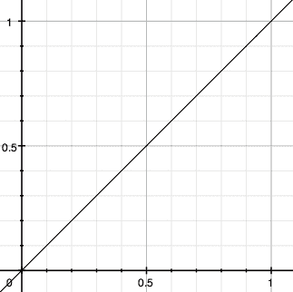
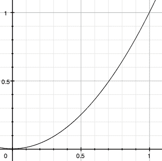

# 九、插件 API

> 我现在一次做两个
> 
> 我发明了一种技术
> 
> -德沃，
> 
> “Fräulein”

每当一项任务要执行两次或两次以上时，最好应用**干燥**原则，不要重复自己。为了促进这一点，jQuery 为开发人员提供了几个工具，这些工具超越了简单的迭代和函数创建。**插件**开发是一项屡试不爽的技术。

在本章中，我们将简要介绍使用其他开发人员插件的基础知识，然后深入研究使用我们自己定义的插件扩展 jQuery 的各种方法。

# 使用插件

利用现有 jQuery 插件非常简单。插件包含在标准 JavaScript 文件中。获取文件的方法有很多，但最简单的方法是浏览位于[的 jQuery 插件库 http://jquery.com/plugins](http://jquery.com/plugins) 。许多流行插件的最新版本可从该站点下载。

为了使插件的方法对我们可用，我们只需将其包含在文档的`<head>`中。我们必须确保它出现在 jQuery 主源文件之后的*和我们自定义 JavaScript 代码*之前的*：*

```js
<head>
  <meta http-equiv="Content-Type" content="text/html; charset=utf-8"/>
  <script src="jquery.js" type="text/javascript"></script>
 <script src="jquery.plug-in.js" type="text/javascript"></script>
  <script src="custom.js" type="text/javascript"></script>
  <title>Example</title>
</head>
```

之后，我们就可以使用插件公开的任何方法了。例如，使用*表单*插件，我们可以在自定义文件的`$(document).ready`方法中添加一行，通过 AJAX 提交表单：

```js
$(document).ready(function() {
  $('#myForm').ajaxForm();
});
```

每个插件都有独立的文档记录。在接下来的章节中，我们将详细研究两个更重要的插件，描述它们的每一种方法。要了解更多关于其他插件的信息，我们可以浏览 jQuery 插件库中链接的文档，或者阅读源代码中的解释性注释。

如果我们无法在插件库、作者的网站或插件的评论中找到所有问题的答案，我们可以随时转到 jQuery 讨论列表。许多插件作者都是列表的经常贡献者，并且总是愿意帮助新用户解决可能遇到的任何问题。订阅讨论列表的说明见[http://docs.jquery.com/Discussion](http://docs.jquery.com/Discussion) 。

# 开发插件

正如我们前面讨论的，每当我们要多次执行一项任务时，插件开发是一种有用的技术。在这里，我们将详细列出可以填充我们自己设计的插件文件的组件。我们的插件可以使用以下四种 jQuery 增强功能的任意组合：对象方法、全局函数、选择器表达式和样式。

## 对象法

<colgroup><col style="text-align: left"></colgroup> 
| 向使用`$()`工厂函数创建的所有 jQuery 对象添加新方法。

```js
jQuery.fn.methodName = methodDefinition

```

 |

### 组件

*   `methodName`：新方法的标签。
*   `methodDefinition`：在 jQuery 对象实例上调用`.methodName()`时要执行的函数对象。

### 讨论

当一个函数需要作用于一个或多个 DOM 元素时，创建一个新的 jQuery 对象方法通常是合适的。对象方法可以访问 jQuery 对象引用的匹配元素，并可以检查或操作它们。

可以通过引用关键字`this`从方法实现中检索 jQuery 对象。我们可以调用这个对象的内置 jQuery 方法，也可以提取 DOM 节点直接使用它们。正如我们在[第 8 章](08.html "Chapter 8. Miscellaneous Methods")中看到的，我们可以使用数组表示法检索引用的 DOM 节点：

```js
jQuery.fn.showAlert = function() {
  alert('You called the method on "' + this[0] + '".');
  return this;
}
```

这里，我们使用`this[0]`查找一个元素，但我们需要记住，jQuery 选择器表达式始终可以匹配零个、一个或多个元素。在设计插件方法时，我们必须为这些场景留出空间。实现这一点最简单的方法是在方法上下文上调用`.each()`；这将强制执行**隐式迭代**，这对于维护插件和内置方法之间的一致性非常重要。在`.each()`调用的函数参数中，`this`依次引用每个 DOM 元素：

```js
jQuery.fn.showAlert = function() {
  return this.each(function() {
    alert('You called the method on "' + this + '".');
  });
}
```

现在，我们可以将我们的方法应用于引用多个项的 jQuery 对象：

```js
$('.myClass').showAlert();

```

我们的方法为前面的选择器表达式匹配的每个元素生成单独的警报。

还要注意，在这些示例中，我们在完成工作时返回 jQuery 对象本身（由`this`引用）。这启用了 jQuery 用户应该能够依赖的**链接**行为。我们必须从所有插件方法返回一个 jQuery 对象，除非该方法显然是为了检索不同的信息，并且是这样记录的。

## 全局函数

<colgroup><col style="text-align: left"></colgroup> 
| 使包含在 jQuery 命名空间中的新函数可用于脚本。

```js
jQuery.pluginName = fnDefinition;
jQuery.pluginName = {
function1: fnDefinition1,
function2: fnDefinition2
};

```

 |

### 组件（第一版）

*   `pluginName`：当前插件的名称。
*   `fnDefinition`：调用`$.pluginName()`时要执行的函数对象。

### 组件（第二版）

*   `pluginName`：当前插件的名称。
*   `function1`：第一个功能的标签。
*   `fnDefinition1`：调用`$.pluginName.function1()`时要执行的函数对象。
*   `function2`：第二个功能的标签。
*   `fnDefinition2`：调用`$.pluginName.function2()`时要执行的函数对象。

### 讨论

这里我们称之为**全局函数**的是`jQuery`函数对象的技术方法。实际上，它们是 jQuery 命名空间中的函数。通过将函数放置在 jQuery 命名空间中，我们减少了与脚本中的其他函数和变量发生名称冲突的可能性。

**单功能**

相反的第一个用法说明了在插件只需要一个函数时创建全局函数。通过使用插件名作为函数名，我们可以确保我们的函数定义不会被其他插件践踏（只要其他插件遵循相同的准则！）。新函数被指定为`jQuery`函数对象的属性：

```js
jQuery.myPlugin = function() {
  alert('This is a test. This is only a test.');
};
```

现在，在使用此插件的任何代码中，我们都可以编写：

```js
jQuery.myPlugin();

```

我们也可以使用`$`别名并写入：

```js
$.myPlugin();

```

这将与任何其他函数调用一样工作，并显示警报。

**多功能**

在第二种用法中，我们将看到当同一插件需要多个全局函数时，如何定义全局函数。我们将所有插件封装在一个名称空间中，以我们的插件命名：

```js
jQuery.myPlugin = {
  foo: function() {
    alert('This is a test. This is only a test.');
  },
  bar: function(param) {
    alert('This function takes a parameter, which is "' + param + '".');
  }
};
```

为了调用这些函数，我们将它们作为以插件命名的对象的成员进行寻址，该对象本身就是全局 jQuery 函数对象的一个属性：

```js
$.myPlugin.foo();
$.myPlugin.bar('baz');

```

函数现在得到了适当的保护，不会与全局命名空间中的其他函数和变量发生冲突。

一般来说，从一开始就使用第二种用法是明智的，即使看起来只需要一个函数，因为它使将来的扩展更容易。

## 选择器表达式

<colgroup><col style="text-align: left"></colgroup> 
| 添加了一种使用 jQuery 选择器字符串查找 DOM 元素的新方法。

```js
jQuery.extend(jQuery.expr[selectorType], {
selectorName: elementTest
});

```

 |

### 组件

*   `selectorType`：选择器字符串的前缀字符，表示正在定义的选择器类型。实际上，插件的有用值是`':'`，表示伪类选择器。
*   `selectorName`：唯一标识此选择器的字符串。
*   `elementTest`：包含要计算的 JavaScript 表达式的字符串。如果表达式对元素`a`的计算结果为`true`，则该元素将包含在结果集中；否则，将排除该元素。

### 讨论

插件可以添加选择器表达式，允许脚本使用紧凑的语法查找特定的 DOM 元素集。通常，插件添加的表达式是新的伪类，由前导的`':'`字符标识。

jQuery 支持的伪类具有通用格式`:selectorName(param1(param2))`。仅需要此格式的`selectorName`部分；如果伪类允许参数使其更具体，则可以使用`param1`和`param2`。

元素测试表达式可以引用两个特殊变量，分别命名为`a`和`m`。被测试的 DOM 元素存储在`a`中，选择器表达式的组件保存在`m`中。`m`的内容是正则表达式匹配的结果，它将`:selectorName(param1(param2))`分解如下：

```js
m[0] == ':selectorName(param1(param2))'
m[1] == ':'
m[2] == 'selectorName'
m[3] == 'param1(param2)'
m[4] == '(param2)'

```

例如，我们可以构建一个测试元素子节点数的伪类，并调用这个新的选择器表达式`:num-children(n)`：

```js
jQuery.extend(jQuery.expr[':'], {
  'num-children': 'a.childNodes.length == m[3]'
});
```

例如，现在我们可以选择正好有两个子节点的所有`<ul>`元素，并将它们变成红色：

```js
$(document).ready(function() {
  $('ul:num-children(2)').css('color', 'red');
});
```

如果需要添加伪类以外的选择器表达式，则应查阅`jquery.js`中的`jQuery.parse`以查找与其他选择器类型匹配的相关正则表达式。

## 宽松风格

<colgroup><col style="text-align: left"></colgroup> 
| 定义未来动画的加速曲线。

```js
jQuery.extend(jQuery.easing, {
easingStyleName: easingFunction
});

```

 |

### 组件

*   `easingStyleName`：新宽松风格的标签。
*   `easingFunction`：在任何给定时刻确定动画值的函数对象。将以下参数传递给函数：
    *   `fraction`：动画的当前位置，以 0（动画开始）和 1（动画结束）之间的时间测量。
    *   `elapsed`：动画开始后经过的毫秒数（很少使用）。
    *   `attrStart`：正在设置动画的 CSS 属性的起始值。
    *   `attrDelta`：正在设置动画的 CSS 属性的开始值和结束值之间的差异。
    *   `duration`：动画过程中经过的总毫秒数（很少使用）。

### 讨论

大多数特效方法都会触发一个固定的**放松风格**，称为**摆动**的动画。缓和样式定义动画如何随时间加速和减速。`.animate`方法给了我们更多的灵活性；方法的参数允许指定自定义缓和样式。可以使用此插件机制创建新的放松样式。

缓和函数必须在动画中的任何时刻返回正在设置动画的特性的值。由于传递给缓和函数的参数，计算通常采用以下形式：

```js
f(fraction) * attrDelta + attrStart

```

在此计算中，`f`表示一个数学函数，其值在 0 到 1 之间变化，因为其参数在 0 到 1 之间变化。例如，导致动画以恒定速率进行的缓和样式需要线性函数（`f(x) = x`：



在插件中，此放松样式将用以下代码表示：

```js
jQuery.extend(jQuery.easing, { 
  'linear': function(fraction, elapsed, attrStart, attrDelta,
                                                       duration) {
    return fraction * attrDelta + attrStart;
  }
});
```

另一方面，如果我们希望我们的动画开始缓慢并逐渐加速，我们可以使用二次函数（`f(x)``=``x``2``)`：



在插件中，此放松样式将用以下代码表示：

```js
jQuery.extend(jQuery.easing, { 
  'quadratic': function(fraction, elapsed, attrStart, attrDelta,
                                                       duration) {
    return fraction * fraction * attrDelta + attrStart;
  }
});
```

安装了这样的放松插件后，我们可以在调用`.animate`方法的任何时候选择新的放松样式：

```js
$('.myClass').animate({
  'left': 500,
  'opacity': 0.1
}, 'slow', 'quadratic');
```

通过此调用，所有附加了类`myClass`的元素将移动并淡入指定值，缓慢开始并逐渐加速，直到它们到达目的地。

# 示例：维护多个事件日志

在前面参考章节中的各种示例中，我们需要在各种事件发生时显示日志事件。JavaScript 的`alert`函数通常用于此类演示，但不允许我们偶尔需要频繁、及时的消息。另一个更好的选择是 Firefox 和 Safari 提供的`console.log`功能，它允许将消息打印到单独的日志中，而不会中断页面上的交互流。但是，由于 Internet Explorer 无法使用此函数，因此我们使用自定义函数来实现这种类型的消息日志记录。

### 注

Firebug Lite 脚本（在[附录 B](13.html "Appendix B. Development Tools")中描述）提供了非常强大的跨平台日志记录功能。我们在这里开发的方法是专门为前面章节中的示例定制的；对于一般用途，Firebug Lite 通常是首选。

记录消息的简单方法是创建一个全局函数，将消息附加到页面上的特定元素：

```js
jQuery.log = function(message) {
  $('<div class="log-message"></div>')
    .text(message).appendTo('.log');
};
```

我们可以做得更出色一些，让新消息与动画一起出现：

```js
jQuery.log = function(message) {
  $('<div class="log-message"></div>')
    .text(message)
    .hide()
    .appendTo('.log')
    .fadeIn();
};
```

现在我们可以调用`$.log('foo')`在页面的日志框中显示`foo`。

然而，我们有时在一个页面上有多个示例，能够为每个示例保留单独的日志是很方便的。我们通过使用一种方法而不是全局函数来实现这一点：

```js
jQuery.fn.log = function(message) {
  return this.each(function() {
    $('<div class="log-message"></div>')
      .text(message)
      .hide()
      .appendTo(this)
      .fadeIn();
  });
};
```

现在调用`$('.log').log('foo')`的效果与我们之前的全局函数调用相同，但我们可以更改选择器表达式以针对不同的日志框。

然而，理想情况下，`.log`方法将足够智能，能够在没有显式选择器的情况下找到日志消息使用的最相关的框。通过利用传递给该方法的上下文，我们可以遍历 DOM 以查找距离所选元素最近的日志框：

```js
jQuery.fn.log = function(message) {
  return this.each(function() {
    $context = $(this);
    while ($context.length) {
      $log = $context.find('.log');
      if ($log.length) {
        $('<div class="log-message"></div>')
          .text(message).hide().appendTo($log).fadeIn();
        break;
      }
      $context = $context.parent();
    }
  });
};
```

这段代码在匹配的元素中查找日志消息框，如果没有找到，则在 DOM 中查找一个。

最后，有时我们需要能够显示对象的内容。打印出对象本身只会产生一些信息，比如`[object Object]`，因此我们可以检测参数类型，并在传入对象的情况下进行一些漂亮的打印：

```js
jQuery.fn.log = function(message) {
  if (typeof(message) == 'object') {
    string = '{';
    $.each(message, function(key, value) {
      string += key + ': ' + value + ', ';
    });
    string += '}';
    message = string;
  }
  return this.each(function() {
    $context = $(this);
    while ($context.length) {
      $log = $context.find('.log');
      if ($log.length) {
        $('<div class="log-message"></div>')
          .text(message).hide().appendTo($log).fadeIn();
        break;
      }
      $context = $context.parent();
    }
  });
};
```

现在我们有了一个方法，可以用来在与页面上所做工作相关的位置写出对象和字符串。

# 总结

在本章中，我们从两个角度来看待插件：使用和开发。我们已经研究了使用我们自己的插件可以对 jQuery 进行的四种类型的添加。插件可以引入新的全局方法和 jQuery 对象方法；此外，它们还可以添加选择器表达式和缓和样式。

不过，我们通常会对使用其他人创建的插件更感兴趣。虽然我们已经指出了许多插件的可用文档，但我们将在下面的章节中更详细地介绍其中两个更流行的插件。