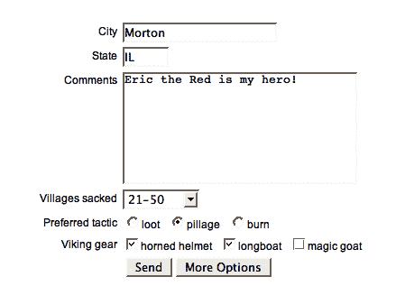
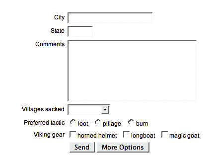
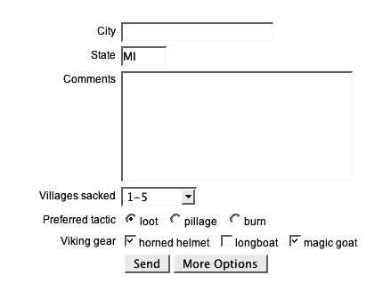

# 十一、表单插件

> 你最好弄清楚
> 
> 在你填空之前
> 
> -德沃，
> 
> “发现”

**表单**插件是一个非常好的脚本示例，它使一项困难、复杂的任务变得非常简单。它帮助我们在 AJAX 中提交表单（即使表单包含文件上传字段），以及检查和操作表单字段的内容。

# AJAX 表单提交

这些方法有助于使用 AJAX 调用向服务器提交表单内容。

## .ajaxSubmit（）

<colgroup><col style="text-align: left"></colgroup> 
| 在不刷新页面的情况下将表单内容发送到服务器。

```js
.ajaxSubmit(success)
.ajaxSubmit(options)

```

 |

### 参数（第一版）

*   `success`：服务器成功响应时执行的回调。

### 参数（第二版）

*   `options`：配置提交的选项图。可以包含以下项目：
    *   `url`（可选）：表单将提交到的 URL。默认值是表单的`action`属性值，如果找不到，则为当前页面的 URL。
    *   `type`（可选）：提交表格时使用的方式（`GET`或`POST`）。默认值为表单的`method`属性值，如果未找到，则为`GET`。
    *   `beforeSubmit`（可选）：在发送请求之前执行的回调。
    *   `dataType`（可选）：如何解释响应数据。可以是`'xml', 'script'`或`'json'`。
    *   `target`（可选）：将响应 HTML 放入的元素。可以是选择器字符串、jQuery 对象或 DOM 元素引用。仅当省略`dataType`时有效。
    *   `success`（可选）：当服务器成功响应时执行的回调。
    *   `semantic`（可选）：是否强制对字段进行严格的 HTML 排序。默认值为`false`。
    *   `resetForm`（可选）：一个布尔值，指示在成功提交后是否将表单值重置为默认值。默认值为`false`。
    *   `clearForm`（可选）：表示提交成功后是否清除表单值的布尔值。默认值为`false`。

### 返回值

jQuery 对象，用于链接目的。

### 讨论

`.ajaxSubmit`方法使用提供的`url`和`type`信息以及表单中当前存在的数据发出 AJAX 请求。表单内容使用`.formToArray`方法编码，文件上传等复杂操作在后台处理。

如果使用`beforeSubmit`选项提供回调，则在发送请求之前将触发回调。这使我们有机会在最后一分钟进行验证或清理。如果验证例程检测到用户必须纠正的错误，则该例程可以返回`false`以阻止表单提交。回调传递由`.formToArray()`返回的表单数据、引用表单的 jQuery 对象和提供给`.ajaxSubmit()`的 options 对象。有关此回调的实际示例，请参见后面讨论的`.ajaxForm()`中的示例。

当提供`dataType`时，相应地解释响应数据。所执行的处理与支持的数据类型的`$.ajax`功能相同。任何`script`响应都被解释为 JavaScript 并在全局上下文中执行，而`json`响应被解析为 JavaScript 对象或数组。指定`xml`数据类型的调用不会导致在收到响应时发生任何解析。

如果没有提供`dataType`，那么我们可以使用`target`选项。目标引用的 DOM 元素将填充对 AJAX 请求的响应，解释为普通 HTML。`dataType`和`target`选项相互排斥。

在由于`dataType`或`target`选项执行了任何相关处理后，将执行`success`回调。此函数提供了要执行操作的响应数据。有关解释和操作响应数据的方法的信息，请参见[第 7 章](07.html "Chapter 7. AJAX Methods")中的`$.ajax`功能讨论。

`semantic`标志强制执行严格的语义排序，但以牺牲执行速度为代价。有关更多信息，请参阅后面的`.formToArray()`讨论。

如果`resetForm`或`clearForm`设置为`true`，则在执行`success`回调（如果提供）之前会执行相应的操作。有关这些操作的更多信息，请参阅后面的`.clearForm`和`.resetForm`方法讨论。

如果正在提交的表单包含文件上载字段，则将使用`multipart/form-data`MIME 类型正确上载文件数据。无需采取进一步行动。

注意，`.ajaxSubmit`方法立即执行。由于在单击 submit 按钮时发出 AJAX 请求很常见，因此通常使用`.ajaxForm`方法更方便。然而，`.ajaxSubmit()`的直接作用可能是实现此插件与其他插件之间交互的最简单方式，例如流行的**验证**插件。

## .ajaxForm（）

<colgroup><col style="text-align: left"></colgroup> 
| 为自动 AJAX 提交准备表单。

```js
.ajaxForm(options)
```

 |

### 参数

*   `options`：配置提交的选项图。可包含以下项目（完整传递至`.ajaxSubmit())`：
    *   `url`（可选）：表单将提交到的 URL。默认值是表单的`action`属性值，如果找不到，则为当前页面的 URL。
    *   `type`（可选）：提交表格时使用的方式（`GET`或`POST`）。默认值为表单的`method`属性值，如果未找到，则为`GET`。
    *   `beforeSubmit`（可选）：在发送请求之前执行的回调。
    *   `dataType`（可选）：如何解释响应数据。可以是`'xml', 'script'`或`'json'`。
    *   `target`（可选）：将响应 HTML 放入的元素。可以是选择器字符串、jQuery 对象或 DOM 元素引用。仅当省略`dataType`时有效。
    *   `success`（可选）：当服务器成功响应时执行的回调。
    *   `semantic`（可选）：是否强制对字段进行严格的 HTML 排序。默认值为`false`。
    *   `resetForm`（可选）：一个布尔值，指示在成功提交后是否将表单值重置为默认值。默认值为`false`。
    *   `clearForm`（可选）：表示提交成功后是否清除表单值的布尔值。默认值为`false`。

### 返回值

jQuery 对象，用于链接目的。

### 讨论

`.ajaxForm`方法准备一个表单，供 AJAX 稍后提交。提交表单时，AJAX 请求将使用提供的`url`和`type`信息以及表单中当前存在的数据。表单内容使用`.formToArray`方法编码，文件上传等复杂操作在后台处理。

与`.ajaxSubmit`方法不同，`.ajaxForm`方法不会立即采取行动。相反，它将处理程序绑定到表单的`submit`事件和表单按钮的`click`事件，从而导致表单内容作为 AJAX 请求发送。这就省去了设置 AJAX 表单的一些工作。

此外，`.ajaxForm`方法能够模拟`.ajaxSubmit`方法无法模拟的标准表单提交的其他方面。当`.ajaxForm()`执行作业时，所单击的提交按钮的名称和值将包含在请求中。此外，当表单包含类型为`image, .ajaxForm()`的`<input>`字段时，可以捕获鼠标坐标并将其与请求一起发送。

为了获得最佳效果，在使用图像输入时，还应提供**维度**插件。表单插件将自动检测维度的存在，并在可能的情况下使用它。

`.ajaxForm`方法可用于包含任何标准字段类型的表单：

```js
<form id="test-form" name="test-form" action="submit.php" method="post">
  <div class="form-row">
    <label for="city">City</label>
    <input type="text" id="city" name="city" size="20" />
  </div>
  <div class="form-row">
    <label for="state">State</label>
    <input type="text" id="state" name="state" size="5" value="MI" />
  </div>
  <div class="form-row">
    <label for="comment">Comments</label>
    <textarea id="comment" name="comment" rows="8" cols="30">
    </textarea>
  </div>

  <div class="form-row">
    <label for="sacks">Villages sacked</label>
    <select name="villages" id="villages">
      <option value="0">none</option>
      <option value="5" selected="selected">1-5</option>
      <option value="10">6-10</option>
      <option value="20">11-20</option>
      <option value="50">21-50</option>
      <option value="100">51-100</option>
      <option value="more">over 100</option>
    </select>
  </div>
  <div class="form-row multi">
    <span class="multi-label">Preferred tactic</span>
    <input type="radio" name="tactic" value="loot" id="loot" checked="checked" /><label for="loot">loot</label>
    <input type="radio" name="tactic" value="pillage" id="pillage" /><label for="pillage">pillage</label>
    <input type="radio" name="tactic" value="burn" id="burn" /><label for="burn">burn</label>
  </div>

  <div class="form-row multi">
    <span class="multi-label">Viking gear</span>
    <input type="checkbox" name="gear[helmet]" value="yes" id="helmet" checked="checked" /><label for="helmet">horned helmet</label>
    <input type="checkbox" name="gear[longboat]" value="yes" id="longboat" /><label for="pillage">longboat</label>
    <input type="checkbox" name="gear[goat]" value="yes" id="goat" checked="checked"/><label for="goat">magic goat</label>
  </div>

  <div class="form-row buttons">
    <input type="submit" id="submit" name="submit" value="Send" />
    <input type="button" id="more" name="more" value="More Options" />
  </div>
</form>
```

为了准备提交表单，我们只需要在 DOM 就绪时调用`.ajaxForm()`一次：

```js
$(document).ready(function() {
  $('#test-form').ajaxForm({
     target: '.log'
  });
});
```

然后，用户可以填写表单字段：



稍后单击**发送**按钮时，服务器接收所有表单信息，而无需刷新浏览器。出于测试目的，我们可以使用 PHP 的`print_r`函数来显示发布的表单内容：

```js
Array
(
    [city] => Morton
    [state] => IL
    [comment] => Eric the Red is my hero!
    [villages] => 50
    [tactic] => pillage
    [gear] => Array
        (
            [helmet] => yes
            [longboat] => yes
        )

    [submit] => Send
)
```

如果使用`beforeSubmit`选项提供回调，则在发送请求之前将触发回调。回调传递由`.formToArray()`返回的表单数据、引用表单的 jQuery 对象和提供给`.ajaxForm()`的 options 对象。此回调主要用于执行表单验证：

```js
$(document).ready(function() {
  $('#test-form').ajaxForm({
     target: '.ajax-form .log',
     beforeSubmit: function(formData, $form, options) {
       if ($form.find('#city').val() == '') {
         alert('You must enter a city.');
         return false;
       }
     }
  });
});
```

如果验证例程检测到用户必须纠正的错误，则该例程可以返回`false`以阻止表单提交。在我们这里的示例中，必须在**城市**字段中输入一个值，否则将显示警报，并且不会发生提交。

当提供`dataType`时，相应地解释响应数据。对于支持的数据类型，执行的处理与`$.ajax`函数相同。任何`script`响应都被解释为 JavaScript 并在全局上下文中执行，而`json`响应被解析为 JavaScript 对象或数组。指定`xml`数据类型的调用不会导致在收到响应时发生任何解析。

如果没有提供`dataType`，那么我们可以使用`target`选项。目标引用的 DOM 元素将填充对 AJAX 请求的响应，解释为普通 HTML。`dataType`和`target`选项相互排斥。

在由于`dataType`或`target`选项执行了任何相关处理后，将执行`success`回调。此函数提供了要执行操作的响应数据。有关解释和操作响应数据的方法的信息，请参见[第 7 章](07.html "Chapter 7. AJAX Methods")中的`$.ajax`功能讨论。

`semantic`标志强制执行严格的语义排序，但以牺牲执行速度为代价。有关更多信息，请参阅后面的`.formToArray()`讨论。

如果`resetForm`或`clearForm`设置为`true`，则在执行`success`回调（如果提供）之前会执行相应的操作。有关这些操作的更多信息，请参阅后面的`.clearForm`和`.resetForm`方法讨论。

如果提交的表单包含文件上传字段，则将使用`multipart/form-data`MIME 类型正确上传文件数据。无需采取进一步行动。

## .ajaxFormUnbind（）

<colgroup><col style="text-align: left"></colgroup> 
| 将窗体恢复为非 AJAX 状态。

```js
.ajaxFormUnbind()

```

 |

### 参数

没有一个

### 返回值

jQuery 对象，用于链接目的。

### 讨论

对表单调用`.ajaxForm()`会将处理程序绑定到表单的`submit`事件以及其中任何按钮和图像输入的`click`事件。如果以后表单不再使用 AJAX 提交，我们可以在同一表单上调用`.ajaxFormUnbind()`来删除这些处理程序，而不会中断可能已绑定到表单元素的任何其他处理程序。

# 检索表单值

这些方法允许脚本读取和转换 web 表单中字段的值。

## .formToArray（）

<colgroup><col style="text-align: left"></colgroup> 
| 将表单中的值收集到对象数组中。

```js
.formToArray([semantic])
```

 |

### 参数

*   `semantic`（可选）：是否强制对字段进行严格的 HTML 排序。默认值为`false`。

### 返回值

对象数组，每个对象表示表单中的一个字段。

### 讨论

`.formToArray`方法获取表单的值，并将它们组织成适合传递给 jQuery AJAX 函数的数据结构，如`$.ajax(), $.post()`和`.load()`。它可以处理任何标准字段类型的表单。

给定`.ajaxFor()`讨论中所示的表单，`.formToArray`方法将返回表单值的 JavaScript 数组：

```js
[
  {name: city, value: Morton},
  {name: state, value: IL},
  {name: comment, value: Eric the Red is my hero!},
  {name: villages, value: 50},
  {name: tactic, value: pillage},
  {name: gear[helmet], value: yes},
  {name: gear[longboat], value: yes}
]
```

数组中的每个对象都有一个`name`和`value`属性。未选中的复选框元素不会在数组中表示。

如果将`semantic`参数设置为`true`，则数组中列出的字段将保证按 HTML 源中的顺序排列。如果表单不包含类型为`image`的`<input>`元素，则情况已经如此。除非需要，否则避免使用此选项，因为所涉及的额外处理会减慢方法的速度。

## .formSerialize（）

<colgroup><col style="text-align: left"></colgroup> 
| 将表单中的值收集到序列化字符串中。

```js
.formSerialize([semantic])
```

 |

### 参数

*   `semantic`（可选）：是否强制对字段进行严格的 HTML 排序。默认值为`false`。

### 返回值

表单字段的字符串表示形式，适合提交。

### 讨论

`.formSerialize`方法获取表单的值，并将其转换为适合作为`GET`请求的查询字符串传递的字符串。它可以处理任何标准字段类型的表单。

给定`.ajaxFor()`讨论中所示的表单，`.formSerialize`方法将返回表单值的字符串表示形式：

```js
city=Morton&state=IL&comment=Eric%20the%20Red%20is%20my%20hero!
  &villages=50&tactic=pillage&gear%5Bhelmet%5D=yes
  &gear%5Blongboat%5D=yes
```

每个字段在字符串中显示为键值对。未选中的复选框元素不会在字符串中表示。根据需要对字符串进行 URL 编码。

如果`semantic`参数设置为`true`，则字符串中列出的字段将保证按 HTML 源中的顺序排列。如果表单不包含类型为`image`的`<input>`元素，则情况已经如此。除非需要，否则避免使用此选项，因为所涉及的额外处理会减慢方法的速度。

## .fieldSerialize（）

<colgroup><col style="text-align: left"></colgroup> 
| 将一组字段的值收集到序列化字符串中。

```js
.fieldSerialize([successful])
```

 |

### 参数

*   `successful`（可选）：是否将包含的字段值修剪为成功的字段值。默认值为`true`。

### 返回值

表单字段的字符串表示形式，适合提交。

### 讨论

与前面的`.formSerialize`方法一样，`.fieldSerialize`方法获取表单的值，并将其转换为适合作为`GET`请求的查询字符串传递的字符串。但是，`.fieldSerialize()`作用于引用单个字段而不是整个表单的 jQuery 对象。

可以处理任何标准类型的字段，如`<select>`菜单：

```js
<select name="villages" id="villages">
  <option value="0">none</option>
  <option value="5" selected="selected">1-5</option>
  <option value="10">6-10</option>
  <option value="20">11-20</option>
  <option value="50">21-50</option>
  <option value="100">51-100</option>
  <option value="more">over 100</option>
</select>
```

然后，用户可以选择任何选项：


从当前选择的选项中提取该值，`.fieldSerialize`方法将返回该值的字符串表示形式：

```js
villages=50

```

每个给定字段在字符串中显示为键值对。未选中的复选框元素不会在字符串中表示。根据需要对字符串进行 URL 编码。

默认情况下，如果字段不成功，则不会在字符串中表示，如 W3C HTML 表单规范中所定义：

[http://www.w3.org/TR/html4/interact/forms.html#h-17.13.2](http://www.w3.org/TR/html4/interact/forms.html#h-17.13.2)

成功字段是在正常表单提交操作期间提交到服务器的字段。例如，当前选中的复选框成功；未经检查的不是。很少需要不成功字段的值，但如果需要，可以将`.fieldSerialize()`的`successful`参数设置为`false`。

根据`.ajaxFor()`讨论中所示的形式，`.fieldSerializer()`在`successful`设置为`true`时仅包括选中的单选按钮和复选框：

```js
tactic=loot&gear%5Bhelmet%5D=yes&gear%5Bgoat%5D=yes

```

但当成功设置为`false, fieldSerializer()`时，也包括未选择的选项：

```js
tactic=loot&tactic=pillage&tactic=burn&gear%5Bhelmet%5D=yes
  &gear%5Blongboat%5D=yes&gear%5Bgoat%5D=yes
```

## .fieldValue（）

<colgroup><col style="text-align: left"></colgroup> 
| 将一组字段的值收集到字符串数组中。

```js
.fieldValue([successful])
$.fieldValue(element[, successful])

```

 |

### 参数（第一版）

*   `successful`（可选）：是否将包含的字段值修剪为成功的字段值。默认值为`true`。

### 参数（第二版）

*   `element`：要检索其值的表单输入元素。
*   `successful`（可选）：是否将包含的字段值修剪为成功的字段值。默认值为`true`。

### 返回值

包含字段值的字符串数组。

### 讨论

`.fieldValue()`方法和`$.fieldValue()`函数都获取表单的值，并将它们作为字符串数组返回。`.fieldValue()`方法作用于引用单个字段的 jQuery 对象，而`$.fieldValue()`函数对作为其第一个参数传递的字段元素执行相同的任务。

这些操作可以处理任何标准类型的字段，如`<select>`菜单：

```js
<select name="villages" id="villages">
  <option value="0">none</option>
  <option value="5" selected="selected">1-5</option>
  <option value="10">6-10</option>
  <option value="20">11-20</option>
  <option value="50">21-50</option>
  <option value="100">51-100</option>
  <option value="more">over 100</option>
</select>
```

然后，用户可以选择任何选项：


从当前选择的选项中提取该值，`.fieldValue()`方法将返回该值的数组表示形式：

```js
[50]

```

每个给定字段在数组中显示为字符串。未选中的复选框元素不会在数组中表示。

默认情况下，如果字段不成功，则不会在数组中表示，如 W3C HTML 表单规范中所定义：

[http://www.w3.org/TR/html4/interact/forms.html#h-17.13.2](http://www.w3.org/TR/html4/interact/forms.html#h-17.13.2)

成功字段是在正常表单提交操作期间提交到服务器的字段。例如，当前选中的复选框成功；未经检查的不是。很少需要不成功字段的值，但如果需要，可以将`.fieldValue()`的`successful`参数设置为`false`。

根据`.ajaxFor()`讨论中所示的形式，`.fieldValue()`在`successful`设置为`true`时仅包括选中的单选按钮和复选框：

```js
[loot, yes, yes]

```

但是当`successful`设置为`false`时，.fieldValue（）也包括未选择的选项：

```js
[loot, pillage, burn, yes, yes, yes]

```

`.fieldValue`方法总是返回一个数组；如果在所操作的元素集中没有要报告的值，则结果数组将为空。相反，如果所讨论的字段元素不成功，`$.fieldValue`函数将返回`null`。

# 表单操作

这些方法允许脚本轻松更改页面上表单的当前内容。

## .clearForm（）

<colgroup><col style="text-align: left"></colgroup> 
| 清除表单中的所有数据。

```js
.clearForm()
```

 |

### 参数

没有一个

### 返回值

jQuery 对象，用于链接目的。

### 讨论

此方法查找匹配元素中的所有输入字段（<input>、`<select>`和`<textarea>`元素），并清除它们的值。此方法通常应用于`<form>`元素，但也可以用于字段的任何容器（例如`<fieldset>)`。

所有字段均为空，无论其默认值如何：



根据字段类型清除字段，如下所示：

*   文本字段和文本区域的值设置为空字符串。
*   选择元素设置为-1，表示没有选择。
*   复选框和单选按钮未选中。
*   其他字段（如提交按钮和图像输入）不受影响。

请注意，隐藏字段不受清除操作的影响，即使它们具有值。

## .clearFields（）

<colgroup><col style="text-align: left"></colgroup> 
| 清除输入字段中的所有数据。

```js
.clearFields()

```

 |

### 参数

没有一个

### 返回值

jQuery 对象，用于链接目的。

### 讨论

此方法清除作为输入字段的所有匹配元素的值（<input>、`<select>`和`<textarea>`元素）。

`.clearFields`方法与`.clearForm()`的不同之处在于`.clearForm()`被发送到与表单元素匹配的 jQuery 对象，而`.clearFields()`被发送到与各个字段本身匹配的 jQuery 对象：


根据字段类型清除字段，如下所示：

*   文本字段和文本区域的值设置为空字符串。
*   选择元素设置为-1，表示“无选择”
*   复选框和单选按钮未选中。
*   其他字段（如提交按钮和图像输入）不受影响。

请注意，隐藏字段不受清除操作的影响，即使它们具有值。

## .resetForm（）

<colgroup><col style="text-align: left"></colgroup> 
| 将窗体重置为其初始值。

```js
.resetForm()
```

 |

### 参数

没有一个

### 返回值

jQuery 对象，用于链接目的。

### 讨论

此方法将表单中的所有字段返回其初始值（HTML 源中定义的值）：



此操作是使用 DOM API 的本机`.reset`方法完成的。因此，`.resetForm()`只能应用于引用`<form>`元素的 jQuery 对象，而`.clearForm()`也可以应用于引用任何包含元素的 jQuery 对象。