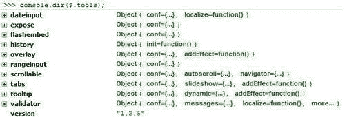
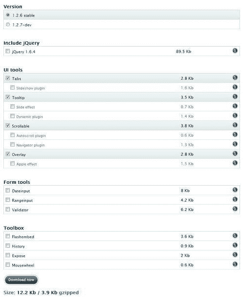
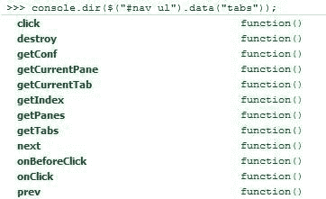

# 一、开始

如果您在过去几年中构建了网页，或者开发了使用 HTML 的网站，那么您很可能听说过 jQuery，而您可能没有听说过 jQuery 工具。

世界各地的网络专业人士一直在努力使互联网成为一个更容易访问的地方，使用 JavaScript 来克服 HTML 和 CSS 的一些缺点。jQuery 的强大性和灵活性在于其欺骗性的简单性，使导航文档、选择页面上的元素和处理事件变得简单明了，同时消除了浏览器之间的差异。Internet 上有许多 UI 库提供基于 jQuery 的功能。jQuery 工具就是其中之一，尽管许多库都是为了提供各种各样的功能而设计的，但 jQuery 工具只提供在普通网站上最有用的功能，换句话说，不是基于 JavaScript 应用的网站。它的小尺寸掩盖了它的强大性和灵活性，只需 4KB 即可提供大量功能。

在本章中，我们将学习：

*   简要介绍 jQuery 工具的历史及其一些指导原则
*   如何下载和安装库，或使用 CDN 链接
*   编写事件和使用 API 的一些最佳实践

让我们开始吧。。。

# jQuery 工具基础知识和规则：入门

> “面对现实，您的 web 应用中是否真的需要拖放、可调整大小的窗口或可排序的列表…”

如果答案是否定的，那么欢迎使用 jQuery 工具！jQuery 工具的设计目的是提供互联网上的许多 Web 2.0 产品，这些产品可以按照您的意愿进行扩展、定制和样式化。这些工具的主要目的是提供一个基本的功能框架，它只提供所需的功能，其他任何东西都不能使用 API 框架以多种方式扩展这些工具。考虑到这一点，让我们更详细地了解 jQuery 工具的精神。

## HTML 的作用

jQuery 工具库的设计具有高度的灵活性，您可以逐步增强普通网站的功能，同时仍然允许不支持 JavaScript 的浏览器。使用该工具集时，您不局限于任何特定的 HTML 结构；您可以随意使用任何合适的元素，如 `ul, ol, div`或 `dl`。了解您正在做什么，以及如何为您的特定需求选择正确的元素是至关重要的。根元素，例如 `div`也可以同样使用，尽管这不是强制性的。例如，可以使用覆盖的根元素作为覆盖信息，该元素包含 HTML、图像、表单和 Flash 对象的混合。

## JavaScript 和 jQuery 的作用

尽管 JQuery 工具库是使用 JQuery 构建的，但除了 flashmbed 之外，它不是使用这些工具的先决条件。虽然您可以在不了解 jQuery 的情况下使用这些工具，但它有助于扩展或增强库内以及站点上的功能。如果您想更深入地研究使用 jQuery 和工具，那么一个有用的起点是查看选择器和对象文本，如下面的示例：

```js
// two jQuery selectors and a configuration given as an object literal
$("#content ul.tabs").tabs("div.panes > div", {
// configuration variables
current: 'current',
effect: 'fade'
});

```

前面的代码可以分为两部分，第一部分选择类名为 `tabs`的所有 `ul`元素，包含在名为 `content`的 `div`中，方式与 CSS 类似。然后将 `tabs`功能设置为对直接位于 `div`中的所有 div 元素进行操作，CSS 样式类为 `panes`。在配置任何工具时，都可以使用类似的语法格式，不过最好注意键入正确的括号数！无论您使用哪种工具，您都需要在 `$(document).ready()`块中包含任何脚本，以便在适当的时间加载脚本。您可能会发现最好将脚本加载到网站的页脚中（某些工具需要这样做）。

## CSS 的作用

jQuery 工具的设计目的是允许网站设计者将代码从主“块”中抽象出来，并放入单独的样式表中。您会注意到，CSS 样式名称已尽可能使用。这使得代码的样式设计更加灵活，因为样式可以随意更改，而无需更改主代码，尽管不建议在 JavaScript 或 HTML 代码中混合 CSS 样式。例如，您可以在 `tabs:`中设置活动选项卡实例的样式

```js
$("ul.tabs").tabs("div.panes > div", {current: 'active'});

```

之后，您可以使用 CSS 设置当前选项卡的样式，如下所示：

```js
ul.tabs .active {
color: '#fff';
fontWeight: bold;
background-position: 0 -40px;
}

```

这允许您完全控制 `tabs`实例的外观，甚至可以更改使用的默认样式名称。如果您已经有可能发生冲突的现有样式，或者如果您需要遵循特定的 CSS 命名约定，这将非常有用。

### 提示

jquerytools 网站上有许多演示，其中包含可供您使用的 CSS 样式文件。值得查看这些文件，以了解工具样式的基本知识。所有的演示都有完整的文档记录，并使用良好的 CSS 样式实践。

### 使用工具进行平面设计和展示

作为使用 jQuery 工具的开发人员，在站点上设置工具样式时，您有很大的自由度。这意味着您可以在设计中使用纯 CSS、图像或两者的混合。

#### 基于 CSS 的设计

在设计中使用纯 CSS 意味着减少对图像的依赖，因为大多数（如果不是全部）样式都可以通过使用纯 CSS 处理。CSS3 的出现尤其如此，它可以处理背景中的渐变等样式，否则就需要图像。然而，这确实意味着，尽管页面是轻量级的，易于维护，但仅仅使用 CSS（至少在版本 2 之前）不可能实现所有功能。CSS3 的出现开始改变这一点，尽管您最新的惊人设计可能无法在较旧的浏览器中工作！

#### 基于图像的设计

如果图像更符合您的风格，那么最好的方法是使用图像精灵，这是 jQuery 工具中最受欢迎的方法。精灵可以使用 CSS 精确定位，只要使用适当的图像格式，大多数（如果不是全部）浏览器都会显示精灵。这使您能够准确地实现所追求的外观和感觉，没有任何折衷，尽管这会使页面更重，并且如果您在工具（如覆盖）中有大量内容，这可能意味着更多地使用滚动条。

#### CSS 与基于图像的设计

此方法提供了 CSS 可以用来降低页面下载时间的最佳方法，而图像可以用于 CSS 样式在您的环境中不合适的地方。jQuery 工具在其演示中同时使用这两种工具，您可以在自己的设计中同样自由地使用这两种工具，不受 CSS 编码的限制，也不需要使用框架。

# 使用工具进行开发

为了完成本书中的练习，您需要一个文本编辑器。大多数电脑都会在 Microsoft Windows 上安装一个记事本，或在 Mac OS X 上安装文本编辑。实际上，有数千台电脑是免费或低成本的，具有不同程度的功能。

如果你是一个现有的开发人员，你很可能已经有了自己选择的编辑器；对于那些刚刚接触编辑的人来说，这是一个尝试一些，看看你更喜欢哪个的问题。我建议您启用或使用以下功能：

*   **查看行号：**在验证和调试您编写的任何脚本时，此功能非常方便。当在论坛中请求帮助时，这会特别有帮助，因为其他人可以指出任何有故障的线路，并帮助提供修复或解决方法。
*   **查看语法颜色：**默认情况下，大多数编辑器都会打开此功能。此功能使用不同的颜色显示代码，这有助于您识别不同的语法、损坏的标记或 CSS 规则。
*   **文本换行：**这允许编辑器将代码行换行到下一行，从而减少了编辑时滚动长代码行的需要。它使得在一个漂亮的、正确缩进的代码块中滚动变得更容易。

您可能还需要一个编辑器，允许您使用 FTP 上载文件，或查看本地目录。这避免了在操作系统的文件资源管理器中查找文件，或使用外部 FTP 应用获取文件副本的需要，并缩短了编辑文件所需的时间。要查看实验结果和示例，您需要一个浏览器 jQuery 工具使用 CSS3 样式，因此现代浏览器将提供最丰富的功能和设计体验。这包括以下内容：

*   火狐 2.0+
*   Internet Explorer 7+
*   狩猎 3+
*   歌剧 9+
*   铬 1+

这些浏览器中的任何一个都可以从互联网上免费下载。如果您正在使用 Internet Explorer 或 Firefox，并且尚未安装它们，强烈建议您也为所选浏览器安装或激活相应的开发人员工具栏：

*   **IE 开发者工具栏：**可从[获取 http://www.microsoft.com/download/en/details.aspx?id=18359](http://www.microsoft.com/download/en/details.aspx?id=18359)
*   **Firebug:**Firefox 开发者工具，可从[下载 http://www.getfirebug.com](http://www.getfirebug.com)
*   **Chrome:**这已经内置，可以通过右键点击一个元素并选择**检查元素**来激活
*   **Safari:**您可以在 Safari**首选项**中的**高级**选项卡下激活其开发者工具栏
*   **Opera:**您可以从[下载其开发者工具栏 http://www.opera.com/dragonfly/](http://www.opera.com/dragonfly/)

在设计使用 jQuery 工具的站点时，这些都将非常有助于您调试脚本。

# 下载图书馆

我们需要做的第一件事是从官方网站（[获取 jQuery 工具库的副本 http://www.flowplayer.org/tools](http://www.flowplayer.org/tools) ）。

jQuery 工具的模块化特性意味着您可以选择要下载的组件，也可以选择下载整个库的副本。如果您想让页面尽可能轻，这一点很重要。

下载 jQuery 工具库有几个选项：您可以使用免费 CDN 链接（甚至用于生产）、下载自定义版本或从 Github 区域下载未压缩版本。

如果在代码中包含此语句：

```js
<script src= "http://cdn.jquerytools.org/1.2.6/jquery.tools.min.js">
</script>

```

您将拥有以下可用工具：

*   jQuery 1.6.4
*   标签
*   工具提示
*   可滚动
*   覆盖

无论您的用户位于全球何处，这些工具都将以最高性能加载。如果您的页面上已经包含 jQuery，您可以简单地删除它并仅使用脚本 `src`语句（因为它已经包含 jQuery），或者，如果您愿意，插入没有 jQuery 链接的工具，例如：

```js
<script src= "http://cdn.jquerytools.org/1.2.6/all/jquery.tools.min.js">
</script>

```

然后分别引用 jQuery；最佳实践是使用谷歌的 CDN 链接，即（在撰写本文时）：

```js
<script src= "http://ajax.googleapis.com/ajax/libs/jquery/1.6.4/jquery.min.js>
</script>

```

## 但我想要更多……使用 CDN 链接

如果您愿意，您可以使用为参考 jQuery 工具而提供的其他 CDN 链接之一 CDN 代表**内容交付网络**，这是一种高速网络，允许在全球范围内快速提供内容。

使用此方法有几个优点：

*   如果您已经访问过使用 jQuery 工具的站点，那么它将被缓存，这意味着您不必再次下载它。
*   内容通过世界各地的本地服务器提供，这减少了下载时间，因为您将从最近的服务器获得代码副本。

以下是一些可供您使用的链接，更多链接可在 jQuery 工具网站上获得：

```js
<!-- UI Tools: Tabs, Tooltip, Scrollable and Overlay -->
<script src=
"http://cdn.jquerytools.org/1.2.6/tiny/jquery.tools.min.js">
</script>
<!-- ALL jQuery Tools. No jQuery library -->
<script src=
"http://cdn.jquerytools.org/1.2.6/all/jquery.tools.min.js">
</script>
<!-- jQuery Library + ALL jQuery Tools -->
<script src=
"http://cdn.jquerytools.org/1.2.6/full/jquery.tools.min.js">
</script>

```

就本书而言，您应该使用 CDN 主链接，这样我们就可以确保我们都在同一页上。

# 使用下载生成器滚动您自己的工具

jQuery 工具的模块化设计允许您选择项目所需的组件。如果您的项目不需要所有组件，那么最好只下载您需要的组件，以减少页面重量并尽可能降低页面响应时间。

下载生成器（[http://flowplayer.org/tools/download/index.html](http://flowplayer.org/tools/download/index.html) ）生成所选工具的缩小版本，并将其放入一个文件中。如果需要，可以将 jQuery 包含在内。默认下载（如背页所示）包括主要工具，包括**覆盖、选项卡、可滚动的**和**工具提示**——您可以更改这些选择，以仅下载特定项目所需的组件。您还可以选择同时包含 jQuery 1.6.4，这有助于减少页面加载时间，如本章前面所述。

## 使用萤火虫

如果您正在使用诸如 Firebug 之类的调试器，则可以通过从控制台运行以下命令来测试包括哪些工具以及它们的版本：

```js
console.dir($.tools); 

```

您将看到类似于以下屏幕截图的内容：



您可以查看包含的每个工具以及版本号。如果您深入了解这些全局设置，您将看到每个工具的默认配置值（一个很好的文档来源！），这将在本章重要的*使用全局配置*部分进行更广泛的讨论。



## 包括并初始化工具

下一步是在页面上包含这些工具，您可以使用前面显示的一个 CDN 链接，也可以使用下载生成器包含自定义版本。

然后您需要初始化这些工具，它们都遵循相同的模式，首先是 jQuery 选择器，然后是初始化函数（或构造函数）及其配置对象。下面是一个使用可滚动工具的示例，其中元素包含在 ID 为 `scroll:`的元素中

```js
$("#gallery").overlay({
fixed: true,
closeOnClick: false
})

```

使用 API 格式时，构造函数将始终返回 jQuery 对象，该对象是选择器选择的元素的集合，然后您可以继续使用它，如以下代码段所示：

```js
// return elements specified in the selector as a jQuery object
var elements = $("div.scrollable").scrollable();
elements.someOtherPlugin().Click(function() {
// do something when this element is clicked
});

```

### 使用全局配置

有时，您可能会发现您希望指定一个默认配置值，这样就可以避免在代码中重复设置相同的设置。jQuery 工具有一个全局配置选项 `$.tools.[TOOL_NAME].conf`，即：

```js
// all overlays use the "apple" effect by default
$.tools.overlay.conf.effect = "apple";

```

这意味着您无需将其包含在覆盖的 JavaScript 代码中：

```js
// "apple" effect is now our default effect
$("a[rel]").overlay();

```

如果需要，您可以覆盖它：

```js
$("a[rel]").overlay({effect: 'default'});

```

如果要在全局级别更改多个配置选项，可以使用 jQuery 内置的 `$.extend`方法：

```js
$.extend($.tools.overlay.conf, {
speed: 400,
effect: 'apple'
});

```

### 注

可以在每个工具的文档页面上找到各种配置设置的列表。

通过输入以下命令 `console.dir($.tools.overlay.conf)`，您可以使用 Firebug 之类的工具获取全局配置的更多详细信息；将产生类似于此的图像：


# 事件和 API 调用的最佳实践

在本节中，我们将介绍每种工具的一些最佳实践，包括如何使用 API、编写事件以及使用 jQuery 工具功能设计插件。

## 应用编程接口（API）

随着时间的推移，您将希望扩展 jQuery 工具的技能，您可以通过使用其 API 来实现这一点，该 API 是为公开库中每个工具的方法和访问属性而构建的。API 对外部世界隐藏内部值，这是一种良好的编程实践。

首先，您需要为该工具创建 API 实例，例如：

```js
//get access to the API
Var api = $("#scroller").data("scrollable")

```

您会注意到，括号中传递给 `data`的参数是工具名称的参数，例如，它可以更改为 `overlay`。创建 API 实例后，可以通过调用其方法开始使用它：

```js
//do something upon scroll
api.onSeek(function() {
// inside callbacks the "this" variable is a reference
// to the API
console.info("current position is: " + this.getIndex())
});

```

您可以很容易地看到 jQuery 工具在 Firebug 中使用的可用 API 方法，它可以作为一个很好的信息源：



使用 API 意味着您不太可能需要 jQuery 的所有 DOM 方法，因为您需要的大多数方法都可以从工具中获得。这包括检索信息的方法，以及设置值或调用操作。

您甚至可以将方法链接到工具的 API 实例上，因为该方法将始终返回 API：

```js
// normal API coding that programmers are accustomed to
var index = $("#example").data("tabs").click(1).getIndex();

```

如果选择器返回多个实例，并且您希望访问特定的 API，则可以执行以下操作：

```js
// select the correct instance with a jQuery selector
var api = $(".scrollable:eq(2)").data("scrollable");
//or with traversing methods. it is just a matter of taste
api = $(".scrollable").eq(2).data("scrollable");

```

## jQuery 工具事件

在 API 中，每个工具都可以作为需要完成操作的特定时间点响应事件。一个很好的例子是**可滚动**——例如，每次滚动图像时，都可以触发 `onSeek`事件。每次发生这种情况时，您都可以添加自己的自定义响应（或侦听器）。如果希望扩展工具的默认行为，这一点特别有用。

### 注

事件侦听器通常被称为**回调**——这两个术语同样有效。

### 事件前后

您可以将自己的自定义功能添加到任何工具中，因为它们为此提供了事件前和事件后方法。使用 `onBefore`事件同样可以取消这些操作，例如在本例中，使用 `onBeforeClick`回调选项卡：

```js
$("#example").tabs(".panes > div", {
// here is a "normal" configuration variable
current: 'active',
// here is a callback function that is called before the // tab is clicked
onBeforeClick: function(event, tabIndex) {
// the "this" variable is a pointer to the API. You can do // a lot with it.
var tabPanes = this.getPanes();
/*
By returning false here the default behavior is cancelled. This time another tab cannot be clicked when "terms" are not accepted
*/
return $(":checkbox[name=terms]").is(":checked");$( ":checkbox[name=terms]").is(":checked");
}
});

```

### 供应事件

在工具中提供事件侦听器有三种不同的方式：

#### 在配置内

第一个也是最简单的选项是将事件侦听器直接包含在代码中：

```js
$(".tabs").tabs({
// do your own stuff here
onClick: function() {
...
var tabPanes = this.getPanes();
}
});

```

使用此选项的一个缺点是不能在代码中指定同一回调的多个实例。例如，在同一配置中包含两个不同的 `onClick`方法将导致错误。

### 注

在前面的示例中， `this`变量是对 Tabs API 的引用。

#### 使用 jQuery 的 bind 方法

第二种方法遵循 jQuery 中使用的方法，在 jQuery 中，您可以在一个链中连续分配多个侦听器：

```js
// first callback
$(".tabs").bind("onClick", function() {
// "this" is a reference to the DOM element
var ulElement = this;
...
// another one
}).bind("onClick", function() {
// another one
...
});

```

使用此方法提供了更大的灵活性，因为它允许您在代码中删除特定的事件侦听器，或者在同一调用中绑定同一事件侦听器的多个实例。在前面的示例中，CSS.tabs 选择器被设置为在任何选项卡使用该选择器触发 `onClick`事件时执行两个操作。这些工具还允许您在单个调用中将同一事件侦听器绑定到多个事件触发器类型：

```js
// the same event listener is called before and after
// a tab is clicked
$(".tabs").bind("onBeforeClick onClick", function() {
});

```

强烈建议您尝试在一定程度上熟悉此功能，如果您还不熟悉事件绑定，那么在这方面有很多很好的参考资料。

#### 从 API 提供监听器

这些工具还允许您从 API 中提供一个或多个回调：

```js
// grab the API with jQuery's data method
var api = $(".tabs").data("tabs");
// supply an event listener
api.onBeforeClick(function() {
// supply another
}).onClick(function() {
...
});

```

您可以使用内部 `this`变量作为对任何工具 API 的引用，这将允许您将多个事件侦听器链接在一起；这更适合那些还不熟悉 jQuery 的开发人员：

```js
// loop through each instances
$(".tabs").each(function() {
...
// assign the onClick listener to a single instance
$(this).data("tabs").onClick(function() {
...
});
});

```

## 事件对象

如果您正在使用回调，那么值得注意的是，当将 `event`对象作为每个回调函数的第一个参数传递时，这些工具遵循当前的 W3C 标准：

```js
// the event object is the first argument for *all* callbacks
// in jQuery Tools
api.onClick(function(event) {
/* If you have multiple callbacks of the same type this prevents
the rest of the callbacks from being executed. */
event.stopImmediatePropagation();
...
// retrieve the value returned by the previous callback function
event.result;
event.result;
...
// whether CTRL, ALT, SHIFT, or ESC was being pressed
var alt = event.altKey,
ctrl = event.ctrlKey,
shift = event.shiftMey,
esc = event.metaKey;
...
// this is how to get the original triggering element, such
// as a handle to the scrollable navigator item that was clicked
// inside an onSeek event
var element = e.originalTarget || e.srcElement;
});

```

在 jQuery 工具的范围内， `preventDefault()`与回调返回 false 相同；这被认为是取消默认事件的公认做法。

## 创建 jQuery 工具插件

这些工具被设计为与 jQuery 协同工作，jQuery 允许您创建基于 jQuery 工具的插件。使用 jQuery，您可以轻松地更改或扩展工具的默认行为，另外还可以引用工具 API 并使用任意数量的回调函数。为了给你一些想法，这里有一个简单的插件示例，它使用谷歌分析跟踪每次点击，每次选择一个标签：

```js
// create jQuery plugin called "analytics"
$.fn.analytics = function(tracker) {
// loop through each tab and enable analytics
return this.each(function() {
// get handle to tabs API.
var api = $(this).data("tabs");
// setup onClick listener for tabs
api.onClick(function(event, index) {
tracker.trackEvent("tabs", "foo", index);
});
});
};

```

### 提示

对于那些不熟悉 jQuery 插件编写的人，您可能想看看 jquery1.4。*插件开发入门指南*，朱利奥·白，Packt 出版社出版。

在页面上包含插件后，您可以按照以下方式使用插件，该方式遵循开发插件的标准格式：

```js
// initialize tabs and the analytics plugin.
$("ul.tabs").tabs("div.panes > div").analytics(tracker);

```

jQuery 工具要求在分析插件之前初始化选项卡，因此您不能写入：

```js
$("ul.tabs").analytics(tracker).tabs("div.panes > div");

```

## 使用 jQuery 工具插件和效果

jQuery 工具的设计允许您充分利用 jQuery 的链接功能，这意味着您可以创建链模式，例如：

```js
// initialize a few scrollables and add more features to them
$(".scroller").scrollable({circular: true}).navigator("#myNavi").autoscroll({interval: 4000});

```

在这里，基本的可滚动调用将把任何带有 `.scroller`类的元素变成可滚动的，工具的极简设计意味着您可以通过使用额外的代码或插件（如添加导航器或 autoscroll）自由地扩展或更改行为，同时使代码更易于阅读，文件大小更小。最终的结果是，您可以在一个页面上设置多个滚动条，这些滚动条都是使用同一行代码激活的，但它们包含自己的本地配置值（这同样可以是全局的）。这种装饰者的理念构成了 jQuery 工具（实际上是整个 jQuery）的精神的一部分。大多数工具都有许多可供下载的插件，如果需要，您也可以添加自己定制的插件。

### 效果

结合大多数工具可用的插件体系结构，您还可以设计自己的效果，以便与某些工具配合使用。这将允许您更改所使用工具的默认行为，而插件将用于扩展该行为。例如，您可以添加一个效果来控制覆盖打开或关闭的方式。这方面的一个示例是苹果效果，它与覆盖一起提供：

```js
// use the "apple" effect for the overlays
$("a[rel]").overlay({effect: 'apple'});

```

使用附加效果意味着您可以将代码分隔到单独的文件中，从而使基本覆盖代码更小、更有组织。然后，您可以更进一步，创建更多可以从单独文件引用的效果，并根据需要将其放入代码中。您还可以在全局配置中设置特定效果作为默认效果；这减少了在代码中使用的每个实例中指定的需要。也可以通过配置值实现相同的效果如果在效果中设置了许多值作为一部分，则可以将这些值设置为默认情况下在全局级别应用于使用此效果的每个实例。例如，您可能设置了一个 `explosionSpeed`值，但以下操作会将其转换为全局配置变量：

```js
$.tools.overlay.conf.explosionSpeed = 500;

```

值得一看[http://gsgd.co.uk/sandbox/jquery/easing/](http://gsgd.co.uk/sandbox/jquery/easing/) ，jQuery 插件的家；这里有许多效果，可以在 jQuery 工具中使用。

# jQuery 工具的性能

正如 Yahoo 的五条最佳实践规则所概述的那样，jQuery 工具的一个关键设计方面是，设计者应该尽量减少必须下载的图像、样式表和脚本的数量。雅虎辩称，这是提高网站速度的关键，因为浏览网站的大部分时间都是从前端开始的。雅虎创造的五条规则！，jQuery 工具所依附的是：

1.  减少 HTTP 请求的数量。
2.  使用 CDN 链接，尽可能将脚本合并到代码中。
3.  添加一个 `expires`标题。
4.  尽可能使用 GZIP 组件。
5.  通过压缩代码最小化 JavaScript。

如果在代码中包含以下脚本链接，您将能够遵守以下五条规则：

```js
<script src="http://cdn.jquerytools.org/1.2.6/jquery.tools.min.js">
</script>

```

它们有助于显著提高网站性能，并将网站性能提高约 70%至 80%！我们鼓励您使用提供的 CDN 链接，特别是用于生产的链接；如果您关心文件大小，您应该下载一个组合脚本，其中只包含您真正需要的工具，并遵循本章中提到的原则。

## 减少 HTTP 请求的数量

一个好的做法是尽量减少站点中使用的单独 JavaScript 或 CSS 文件的数量，这有助于减少从不同来源获取内容所花费的时间。这在 jQuery 工具中是允许的，它在下载库的自定义构建或使用 CDN 链接时使用一个组合 JavaScript 文件。

## jQuery 工具通过 CDN 提供

有许多 CDN 链路可供使用，与使用手动静态链路相比，使用这些链路可使效率提高 15%到 20%。

## 添加 expires 标头

JQuery 工具在所有工具上都设置了 `expires`头，这使得它们可以缓存；这将使每次访问站点的后续响应时间减少 50%。

## GZIP 组件

如果在服务器上启用了 gzip，那么这可以帮助减少多达 65%的文件大小；大多数现代浏览器声称，在服务器上启用 gzip 后，能够处理 gzip。所有通过 CDN 链接提供的 jQuery 工具下载都是 gzip 的，以帮助减少下载时间。

## 缩小 JavaScript

jQuery 工具脚本使用 googleclosurecompiler 缩小，以减小文件大小并提高性能，因为这比简单地打包相同的文件产生更高的压缩比。

# 总结

在本章中，我们了解到：

*   jQuery 工具的基础知识，以及它遵循的一些规则
*   如何下载库的副本或使用提供的 CDN 链接
*   使用 jQuery 工具时编写事件和 API 调用的一些最佳实践

我们讨论了如何利用 jQuery 工具的模块化特性，只下载项目所需的组件。我们还研究了在设计使用 jQuery 工具的页面或项目时应该使用的一些规则和最佳实践。

现在我们已经了解了 jQuery 工具的基础知识以及如何安装它，我们准备开始深入研究如何使用它，这是下一章的主题。