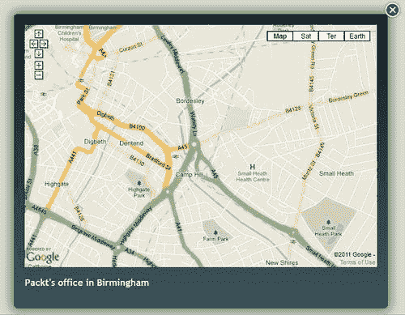
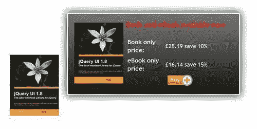
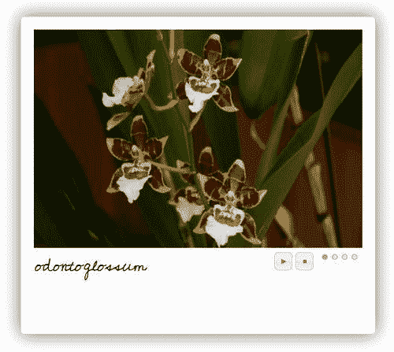

# 二、使用用户界面工具

> “行动胜于雄辩……”

16 世纪的作家 Michel de Montaigne 经常被引用发明这个短语，作者认为这个短语非常适合 jQuery 工具毕竟，学习新工具的最好方法就是尝试使用它们，对吗？

在前一章中，我们了解了一些 jQuery 工具的整体特性，重点不是放在 JavaScript 代码上，而是放在通过更改 CSS 和正在使用的工具的一些配置选项以多种不同方式对工具进行样式化的能力上。

现在是时候详细了解其中一些工具了。本章（以及下一章）包含了一些使用各种工具的项目，并展示了使用 CSS 和最小 JavaScript 可以实现的一些功能。

在本章中，我们将学习如何：

*   使用谷歌地图构建地图灯箱效果
*   建立一个简单的画廊，展示许多图像
*   构造快速链接工具提示，以允许购买书籍
*   在宝丽来风格的幻灯片中显示图像

所以，正如有人曾经说过的，“我们还在等什么…”让我们继续吧。。。

### 注

本章示例中列出的所有图像都可以在本书附带的代码下载中找到。

# 用户界面工具-模板

在我们详细查看示例之前，让我们先设置每个项目中使用的基本框架。打开您喜爱的文本编辑器，复制以下代码：

```js
<!DOCTYPE html>
<html>
<head>
<title>jQuery Tools standalone demo</title>
<!-- include the Tools -->
<script src=
"http://ajax.googleapis.com/ajax/libs/jquery/1.6.4/jquery.min.js">
</script>
<script src=
"http://cdn.jquerytools.org/1.2.6/all/jquery.tools.min.js">
</script>
</head>
<body>
</body>
</html>

```

将其另存为模板本书中的演示使用类似的格式，因此这将有助于您在以后查看 jQuery 工具 UI 库中提供的其他一些工具时节省时间。让我们从覆盖层开始。

# 什么是覆盖层？

覆盖是 JavaScript 环境的重要组成部分，如果您希望将访问者的注意力引导到站点上的特定元素上，那么此工具将非常有效地实现这一点。套印格式可以用来显示几乎任何东西，例如用于显示产品、显示信息或警告框的不同样式的套印格式，或者用于显示复杂信息—这些都可以通过 jQuery 工具的套印格式来实现。

## 覆面打造完美的眼部糖果

jQuery 工具的覆盖可以包含各种各样的信息，比如视频、图像、地图等等——所有内容都可以使用 CSS 进行样式化。它具有多种功能，例如脚本框架、事件模型（在触发事件时执行操作）以及添加自定义效果。

## 用法

设置覆盖的一般方式如下：

```js
// select one or more elements to be overlay triggers
$(".my_overlay_trigger").overlay({
// one configuration property
color: '#ccc',
// another property
top: 50
// ... the rest of the configuration properties
});

```

当您单击其中一个触发器时，它将打开一个由触发器的 `rel`属性指定的覆盖。

### 提示

值得一看[http://flowplayer.org/tools/overlay/index.html](http://flowplayer.org/tools/overlay/index.html) ，详细说明了可用于覆盖的所有可能配置选项。

让我们看看这在实践中是如何工作的。我们将使用 Google 构建一个简单的地图查看器™ 地图，以及叠加的苹果效果。

## 项目：为谷歌地图构建查看器

我们将使用这个概念来开发一个灯箱效果，它使用谷歌™ “地图”，适用于需要提供办公室所在位置地图，但不想满足于页面上的普通地图的客户！

### 创建基本 HTML 结构

本例将使用 jQuery 工具中的 Overlay 工具，但带有“Apple”主题。示例中使用的所有图像都可以从本书附带的代码下载中获得。

还记得我们在本章开头设置的代码模板吗？现在抓取一份副本，并将其保存为覆盖项目文件，这样我们就可以添加覆盖演示的内容。我们将对其进行一个小改动，将`<body>`标记改为：

```js
<body class="no-js">
...
</body>

```

随着演示的进行，原因将变得更加清楚。

### 在覆盖层中添加

接下来，让我们将覆盖触发器和覆盖的代码添加到`<body>:`

```js
<!-- trigger elements -->
<a href="#link1" rel="#link1">Location of Packt's Office</a>
<!-- overlayed element -->
<div class="apple_overlay" id="link1">
<iframe width="675" height="480" frameborder="0" scrolling="no"
marginheight="0" marginwidth="0"
src="http://maps.google.co.uk/maps?q=B3+2PB&amp;hl=en&amp; sll=52.483277,-1.900152&amp;sspn=0.003679,0.009645&amp;vpsrc=0&amp; t=m&amp;ie=UTF8&amp;hq=&amp;hnear=Birmingham,+West+Midlands+B3+2PB, +United+Kingdom&amp;ll=52.484296,-1.90115&amp; spn=0.015681,0.025749&amp;z=14&amp;iwloc=A&amp;output=embed">
</iframe>
<p>Packt's office in Birmingham</p>
</div>

```

这遵循覆盖所需的正常覆盖和触发器结构，但添加了`<iframe>`标记，以处理外部内容。这里的触发器是`<a>`标记，单击该标记后，将打开显示 Packt 办公室位置的地图，并将其显示在覆盖图中。

### 设置和配置覆盖 JavaScript

插件的下一部分是非常重要的脚本尽管调用覆盖功能的代码只有一行，但我们必须添加一块配置代码，告诉它使用 expose 隐藏页面内容，然后显示覆盖本身，最后找到覆盖 HTML 中给出的 URL，并在屏幕上显示。

在网页底部的`</body>`标记之前添加以下代码：

```js
<script>
$(function() {
$("a[rel][href!='']").overlay({
// some mask tweaks suitable for modal dialogs
mask: {
color: '#000',
loadSpeed: 200,
opacity: 0.8
},
effect: 'apple',
onBeforeLoad: function() {
var overlaid = this, overEl = this.getOverlay();
// grab wrapper element inside content
overEl.find(".contentWrap").load( this.getTrigger().attr("href"));
overEl.appendTo("body");
$(".close", this.getOverlay()).click(function(e){
overlaid.close();
});
}
});
});
</script>

```

### 增加造型和视觉效果

最后，我们需要添加一些样式，因为生成的页面看起来不太漂亮！下面的代码对于显示叠加非常重要，如果您想使用不同颜色的叠加，您可以随时更改正在使用的背景：

```js
<style>
/* body, a:active and : focus only needed for demo; these
can be removed for production use */
body { padding: 50px 80px; }
a:active { outline: none; }
:focus { -moz-outline-style: none; }
.apple_overlay {
/* initially overlay is hidden */
display: none;
/* growing background image */
background-image: url(white.png);
/* width after animation - height is auto-calculated */
width: 675px;
/* some padding to layout nested elements nicely */
padding: 25px;
margin: 20px;
}
/* default close button positioned on upper right corner */
.apple_overlay .close {
background-image: url(close.png);
position: absolute;
right: -10px;
top: -10px;
cursor: pointer;
height: 35px;
width: 35px;
}
#overlay {
height: 526px;
width: 675px;
}
div.contentWrap {
height: 526px;
width: 675px;
overflow: hidden;
}
a, body {
font-family: Arial, Tahoma, Times New Roman;
}
body.no-js a[rel] {
/* initially overlay is hidden if JavaScript is disabled */
display: none;
}
body.js .apple_overlay {
/* initially overlay is hidden if JavaScript is enabled */
display: none;
}
</style>

```

### 提示

值得注意的是，如果您想更改背景，可以从 jQuery 工具网站[获得一些其他背景 http://flowplayer.org/tools/overlay/index.html](http://flowplayer.org/tools/overlay/index.html) ，或在本书附带的代码下载中。您可以随时添加自己的，而不是查看网站上的一些演示，以了解如何做到这一点。

注意我们是如何在原始 HTML 标记中使用 `no-js`的吗？原因很简单：它保持渐进式增强，这意味着如果有人关闭了 JavaScript，覆盖仍将隐藏，直到您单击触发器链接！

覆盖现在可以工作了，您将看到类似于下图的内容：



这只会划伤覆盖层的表面。您可以添加自己的自定义效果，将其设置为显示为模式对话框，甚至可以将不同的图像显示为“覆盖”，这可以是较小图像（如书籍）的放大版本。

# 工具提示-您需要的唯一 web 基础知识

可以说，工具提示是第二重要的 UI 小部件，其用途与叠加类似，因为它可以用来突出显示与屏幕上某个元素相关的重要信息，例如如何填写表单的提示、购买物品的快速链接提示，或者强调关于正在现场讨论的概念的信息（类似于在书中添加脚注）。jQuery 工具的工具提示在操作上与其他工具没有什么不同，但它的设计使它非常强大和灵活。让我们更详细地看一看。

## 用法

工具提示非常容易设置，基本版本使用以下结构：

```js
<!-- elements with tooltips -->
<div id="demo">


</div>

```

使用工具提示需要注意的技巧是，您可以通过以下两种方式之一生成工具提示：使用 `title`属性或在工具提示触发后直接包含工具提示块。

### 提示

只需要显示普通文本的工具提示最好通过使用 `[title]`属性来实现。如果需要显示更多内容或包含 HTML 格式，请使用手动方法，并使用单个 CSS 样式类或 ID 选择器。

调用工具提示非常简单，只需使用选择器元素即可，选择器元素通常为 `[title]`属性，其中包含显示为工具提示的文本：

```js
$("[title]").tooltip();

```

如果需要显示 HTML 元素，则可以使用手动格式，该格式可以包含任意数量的 HTML，但将在触发后立即使用该元素：

```js
$(".trigger").tooltip();

```

我们可以通过添加幻灯片和动态插件等附加选项来进一步实现这一点。

### 提示

单独使用 `[title]`属性是不可取的；这将导致性能下降，因为 jQuery 工具需要迭代每个实例，以查看是否应该将其转换为工具提示。强烈建议使用样式类或 ID 来提高性能。

## 幻灯片效果和动态插件给每个人留下深刻印象

标准工具的工具提示会起到一定的作用，但至少有一个固有的限制：如果调整浏览器窗口的大小，会发生什么？默认情况下，工具提示不允许这样做，除非您添加了“动态”插件；动态插件会考虑视口边缘的位置，并相应地“动态”定位工具提示。为了获得额外的功能，还可以使工具提示从顶部、左侧、右侧或底部滑入，而不只是以相同的方向（从底部到顶部）显示。网站上有更多关于如何设置此附加功能的详细信息。

同时，让我们看看一个在书店或出版商的网站上不会不合时宜的项目，在那里你可以使用“快速链接”获取更多信息和书籍价格，以及购买一本书。

## 项目：使用工具提示构建一本书“立即购买”

你知道该怎么做，你可以浏览一个网站，在那里你可以看到你想要的书。你不想为了买它而浏览很多页面，对吧？我想是的，输入工具提示“快速链接”。我们将内置一个小的工具提示，当你将鼠标悬停在一本书上时会弹出，这样你就可以直接点击**购买**按钮。

### 提示

所有图像都可以作为本书附带的代码下载的一部分，也可以直接从 jQuery 工具网站获得。

### 设置基本 HTML

去拿一份我们在本章开头设置的 HTML 模板的副本，这样我们就可以在基本触发器和工具提示 HTML 中进行复制，以使这项工作正常进行：

```js
<!-- trigger element. a regular workable link -->
<a id="download_now"></a>
<!-- tooltip element -->
<div class="tooltip">

<p class="bookavail">Book and eBook available now</p>
<dl>
<dt class="label">Book only price:</dt>
<dt class="price">£25.19 save 10%</dt>
<dt class="label">eBook only price:</dt>
<dt class="price">£16.14 save 15%</dt>
<dt class="buynow"><a href="/store/purchase?id=12345">
</a>
</dt>
</dl>
</div>

```

值得注意的是，虽然代码没有连接到电子商务系统，但您可以轻松地对其进行调整：

```js
<tr>
<td></td>
<td><a href="/store/purchase?id=12345">
</a></td>
</tr>

```

### 添加工具提示 CSS 样式

现在，这里来了造型的关键部分。jQuery 工具遵循最小化 JavaScript 编码的原则，更愿意让大部分工作由 CSS 完成。工具提示功能没有什么不同，所以让我们将其添加到`<head>`部分下面的代码中，以查看工具提示的作用：

```js
<style>
.tooltip { display: none; background: url(black_big.png);
height: 145px; padding: 35px 30px 10px 30px;
width: 310px; font-size: 11px; color: #fff; }
.tooltip img { float: left; margin: 0 5px 10px 0; }
.bookavail { margin-top: -5px; color: #f00; font-weight: bold;
font-size: 14px; }
dt.label { float: left; font-weight: bold; width: 100px; }
dt.price { margin-left: 210px; }
dt.buynow a img { margin-top: 10px; margin-left: 110px; }
</style>

```

### 注

需要注意的是， `.tooltip`类提供了任何工具提示工作所需的基本 CSS；CSS 的其余部分特定于此演示。

#### 不过我们还需要更多的款式。。！

虽然上述风格将产生一个可行的演示，但演示并不完美；我们需要添加其他样式来调整某些元素的位置，并微调整体视图。将以下内容添加到以前的样式表中：

```js
body { margin-top: 100px; margin-left: 200px; }
#booktip img { padding: 10px; opacity: 0.8;
filter: alpha(opacity=80); -moz-opacity: 0.8; }
.bookavail { margin-top: -5px; color: #f00; font-weight: bold;
font-size: 14px; }

```

### 配置工具提示

最后但并非最不重要的一点，这里是工具提示工作所需的 JavaScript 代码。分为三部分：

*   第一部分配置屏幕上的工具提示外观
*   第二个控件控制工具提示的淡入淡出
*   最后一部分调整屏幕上工具提示的位置，以允许当前浏览器窗口尺寸（即，如果已调整大小或正在完整显示）

    ```js
    <script>
    $(document).ready(function() {
    $("#booktip").tooltip({
    effect: 'slide',
    position: 'top right',
    relative: true,
    // change trigger opacity slowly to 1.0
    onShow: function() {
    this.getTrigger().fadeTo("slow", 1.0);
    },
    // change trigger opacity slowly to 0.8
    onHide: function() {
    this.getTrigger().fadeTo("slow", 0.8);
    }
    }).dynamic({ bottom: { direction: 'down', bounce: true }});
    });
    </script>

    ```

对于一个简单的项目，效果可能非常显著，下面是它的外观：



当你使用工具提示时，你真的可以在效果上大显身手。我在使用中看到的一个这样的效果是，当鼠标悬停在图像上时， `div`会滑出；这可能看起来有点奇怪，但如果你仔细想想，它的效果和这里使用的效果是一样的。它仍然使用工具库中的工具提示功能，唯一的区别（突出了 jQuery 工具的真正功能）是使用了 CSS 样式！

# 对于其他所有内容，都可以滚动

如果您需要滚动浏览站点上的信息，那么您需要查看 jQuery 工具中的另一个组件：Scrollable。这个工具可以以许多不同的方式使用，例如视频库、产品目录和新闻摘要。整个结构基本相同，但是 jQuery 工具的灵活性允许您使用 CSS 的强大功能生成不同的设计。

## 用法

这是可滚动的基本结构：

```js
<!-- "previous page" action -->
<a class="prev browse left">next</a>
<!-- root element for scrollable -->
<div class="scrollable">
<!-- root element for the items -->
<div class="items">
<!-- 1-3 -->
<div>


</div>
<!-- 4-6 -->
<div>


</div>
<!-- 7-9 -->
<div>


</div>
</div>
</div>
<!-- "next page" action -->
<a class="next browse right">previous</a>

```

您将看到，该结构由多个图像组成，这些图像分组在一起，封装在多个 `div`标签中，并带有额外的 `div`标签，用于查看导航元素。尽管演示每个组只显示三个图像，但如果需要，您可以轻松地向每个组添加更多图像。

为了真正展示这是如何工作的，让我们看一个例子，这个例子在一个假设的客户的网站上不会不合适，比如一个摄影师的网站。

## 项目：建造迷你画廊

客户有许多需要在其网站上显示的图像，他希望能够滚动浏览每组图像，然后单击其中一个以在放大的查看器中显示。听起来很简单吧？

### 设置基本 HTML

首先，让我们把基本的 HTML 结构放在一起。打开您喜爱的文本编辑器，并粘贴以下内容：

```js
<html>
<head>
</head>
<body>
<div id="swapframe">
<div id="viewer">
<div class="loadingspin">

</div>
</div>
<div id="caption">x</div>
<div id="scrollablecontainer">
<a class="prev browse left"></a>
<div id="overscroll">
<div class="items">
<div class="item">
<div>
<a rel="odontoglossum"
href="images/odontoglossum.jpg">

</a>
</div>
<div>
<a rel="forest orchid"
href="images/forest%2520orchid.jpg">

</a>
</div>
<div>
<a rel="brassia" href="images/brassia.jpg">

</a>
</div>
<div>
<a rel="paphiopedilum"
href=" images/paphiopedilum.jpg">

</a>
</div>
<div>
<a rel="zygopetalum"
href=" images/zygopetalum.jpg">

</a>
</div>
</div>
<div class="item">
<div>
<a rel="cactus flower"
href=" images/cactus%2520flower.jpg">

</a>
</div>
<div>
<a rel="african violet"
href=" images/african%2520violet.jpg">

</a>
</div>
<div>
<a rel="pink camelia"
href=" images/pink%2520camelia.jpg ">

</a>
</div>
<div>
<a rel="red camelia"
href=" images/red%2520camelia.jpg ">

</a>
</div>
<div>
<a rel="white camelia"
href=" images/white%2520camelia.jpg ">

</a>
</div>
</div>
</div>
</div>
<a class="next browse right"></a>
</div>
</div>
</body>
</html>

```

在前面的示例中，我们使用了本章开头创建的模板文件。这一次，我提供了整个示例，因为这里包含了一些额外的 HTML。我已经包括了一个加载动画 GIF，以及一个图像标题的空间。

它看起来很复杂，但实际上并非如此——它遵循上面所示的相同结构，但有许多附加 div 包含 HTML 代码；这在很大程度上是为了允许我们在屏幕上正确定位结果，同时仍然将每个元素保持在正确的位置。

### 是时候使用 JavaScript 了

好的，现在我们已经准备好了结构，让我们添加 JavaScript 代码。将这两行内容复制到您的`<head>`区域：

```js
<script src=
"http://ajax.googleapis.com/ajax/libs/jquery/1.6.4/jquery.min.js">
</script>
<script src=
"http://cdn.jquerytools.org/1.2.6/all/jquery.tools.min.js">
</script>

```

这将启动对 jQuery 和 jQuery 工具库的调用，因此您可以开始使用这两个库。下面是本示例的关键部分，您可以将其复制到前面几行的下方：

```js
<script>
$(function(){
$.ajaxSetup({
cache: false,
dataType: "text html"
});
$(".loadingspin").bind('ajaxStart', function(){
$(this).show();
}).bind('ajaxComplete', function(){
$(this).hide();
});
$.fn.loadimage = function(src, f){
return this.each(function(){
$("").attr("src", src).appendTo(this).each(function(){
this.onload = f;
});
});
}
$(".item img:first").load(function(){
var firstpic = $(".item a:first").attr("rel");
$("#caption").text(firstpic);
$("#viewer").empty().loadimage("images/" + firstpic + ".jpg").hide().fadeIn('fast');
});
$(".item a").unbind('click.pic').bind('click.pic', function(e){
e.preventDefault();
var picindex = $(this).attr("rel");
$("#caption").text(picindex);
$("#viewer").empty().loadimage("images/" + picindex + ".jpg").hide().fadeIn('fast');
});
$("#overscroll").scrollable();
$("a.browse").click(function(){
$("#swapframe").load("ajax/" + state + ".html").hide().fadeIn('fast');
});
</script>

```

此代码提供了图库和可滚动效果，当您单击可滚动窗口中的缩略图时，它会加载到每个图像中。如果您将鼠标悬停在一个选项上，您甚至可以添加淡出图像的选项效果：

```js
<script type="text/javascript">
$(function(){
$('.item').children().hover(function() {
$(this).siblings().stop().fadeTo(500,0.5);
}, function() {
$(this).siblings().stop().fadeTo(500,1);
});
});

```

### 一些风格的时间到了

如果您尝试运行前面的代码，它将工作，但看起来很糟糕，例如，将丢失图像，并且您将无法在可滚动页面中导航。这就是 jQuery 工具真正强大的地方，大部分实际工作实际上都是在 CSS 样式中完成的：

```js
<style>
#scrollablecontainer { position: relative; top: -30px;
height: 52px; }
/* prev, next, up and down buttons */
a.browse { background:url(hori_large.png) no-repeat;
display: block; float: left; width: 30px; height: 30px;
float: left; margin: 10px; cursor: pointer; font-size: 1px;
}
/* right */
a.right { background-position: 0 -30px; clear: right;
margin-right: 0px;}
a.right:hover { background-position: -30px -30px; }
a.right:active { background-position: -60px -30px; }
/* left */
a.left { margin-left: 0; }
a.left:hover { background-position: -30px 0; }
a.left:active { background-position: -60px 0; }
/* disabled navigational button */
a.disabled { visibility: hidden !important; }
#overscroll { position: relative; float: left; width:
550px; height: 50px; border: 1px solid #ccc;
overflow: hidden; }
.items { position: absolute; clear: both; width: 20000em; }
.item { float: left; width: 550px; }
.item div { float: left; width: 100px; height: 40px;
margin: 5px; background: #ccc; }
</style>

```

这些样式对于设置基本效果至关重要，例如提供导航按钮和可滚动容器。

#### 一些额外的样式

然而，它可以使用一些额外的调整，使它真正脱颖而出。现在让我们将这些添加到：

```js
<link href=
'http://fonts.googleapis.com/css?family=Cedarville+Cursive'
rel='stylesheet' type='text/css'>
<style>
#swapframe { height: 540px; width: 640px;
padding: 25px 25px 0 20px; margin: 0 auto;
background: transparent url(slideshow-bg.gif)
no-repeat; background-size: 680px 540px;}
#viewer { height: 355px; background: #000; }
.loadingspin { float: center; margin-top: auto;
margin-bottom: auto; }
#caption { position: relative; top: -10px; width: 200px;
margin: 0 auto; color: #000; text-align: center;
font-size: 30px; font-family: 'Cedarville Cursive',
cursive; padding-bottom: 35px; }
</style>

```

代码将把画廊变成有用的东西；它甚至包括一个手写字体的标题，它使用谷歌™ 字体。如果一切顺利，您应该看到如下内容：


这只是使用 Scrollable 所能做的一小部分。您可以更进一步，甚至可以将 Scrollable 与工具的其他元素（如覆盖）结合起来，这将显示一个真正令人印象深刻的效果！

# 活动中的标签

现在我们来看一下 jQuery 工具的 UI 工具部分的第四部分，也是最后一部分，即选项卡部分。

选项卡可以被描述为互联网上最流行的用户界面之一。这是有充分理由的，因为它们易于使用，并且在有限的空间中包含大量信息，然后您可以以更加用户友好的方式组织这些信息。让我们更详细地看看它们。

## 用法

选项卡的基本结构如下：

```js
<!-- the tabs -->
<ul class="tabs">
<li><a href="#">Tab 1</a></li>
<li><a href="#">Tab 2</a></li>
<li><a href="#">Tab 3</a></li>
</ul>
<!-- tab "panes" -->
<div class="panes">
<div>pane 1 content</div>
<div>pane 2 content</div>
<div>pane 3 content</div>
</div>

```

然后，通过使用以下 JavaScript 调用将其作为选项卡激活：

```js
$("ul.tabs").tabs("div.panes > div");

```

但是，坚持住；这不是可滚动的基本代码吗？嗯，是的，有一些相似之处。但是不，这绝对是标签的代码！这两种工具之间有一些相似之处，但需要注意的是，它们是不可互换的。

这就是说，是时候开始建设我们的下一个项目了。

## 项目：搭建滚动幻灯片

我们将使用 Tab 的幻灯片插件的强大功能，构建一个可以在照片库网站上使用的演示。这是一个幻灯片样式的宝丽来，但有一些额外的功能。它将使用类似的图像滚动，但在一个不同的格式，可以很容易地放在大多数网站上。一些在互联网上有业务的知名公司也使用了类似的效果。

### 设置基本 HTML

首先，让我们拿出文本编辑器。从本章开始获取模板代码的副本，并添加以下行以创建 HTML 库：

```js
<div id="caption"></div>
<!-- container for the slides -->
<div class="images">
<div>

</div>
<div>

</div>
<div>

</div>
<div>

</div>
</div>
<div id="galprevnext">
<div class="galleft">
<a class="galprevpic hideit"></a>
</div>
<div class="galright">
<a class="galnextpic hideit"></a>
</div>
</div>
<!-- the tabs -->
<div class="slidetabs">
<a href="#">1</a>
<a href="#">2</a>
<a href="#">3</a>
<a href="#">4</a>
</div>
<div id="playcontrols">


</div>

```

这可以分解为五个不同的部分，即标题、图片容器、图库控件、选项卡，最后是播放器控件。

### 增加视觉效果

下一部分是最重要的造型，分为两部分，从宝丽来效果和幻灯片的强制性代码开始：

```js
<link href=
'http://fonts.googleapis.com/css?family=Cedarville+Cursive'
rel='stylesheet' type='text/css'>
<style type="text/css">
body { padding-left:400px; padding-top: 50px; }
/* container for slides */
.images { border: 1px solid #ccc; position: relative;
height: 450px; width: 502px; float: left; margin: 15px;
cursor: pointer;
/* CSS3 tweaks for modern browsers */
-moz-border-radius: 5px;
-webkit-border-radius: 5px;
border-radius: 5px;
-moz-box-shadow: 0 0 25px #666;
-webkit-box-shadow: 0 0 25px #666;
box-shadow: 0 0 25px #666; }
/* single slide */
.images div { display: none; position: absolute; top: 0; left: 0;
margin: 3px; padding: 15px 30px 15px 15px;
height: 256px; font-size: 12px; }
/* tabs (those little circles below slides) */
.slidetabs { position: absolute; margin: 350px 600px 0 440px;
width: 100px; }
/* single tab */
.slidetabs a { width: 8px; height: 8px; float: left; margin: 3px;
background: url(navigator.png) 0 0 no-repeat;
display: block; font-size: 1px; color: #fff; }
/* mouseover state */
.slidetabs a:hover { background-position: 0 -8px; }
/* active state (current page state) */
.slidetabs a.current { background-position: 0 -16px; }
/* prev and next buttons */
.forward, .backward { float: left; margin-top: 120px;
background: #fff url(nav.png) no-repeat;
width: 35px; height: 35px;
cursor: pointer; z-index: 2; }
/* next */
.forward { background-position: -36px 0px ; }
.forward:hover,
.forward:active { background-position: -36px -36px; }
/* prev */
.backward:hover,
.backward:active { background-position: 0 -36px; }
/* disabled navigational button. is not needed when tabs
are configured with rotate: true */
.disabled { visibility: hidden !important; }
#caption { color: black; margin-left: 35px; margin-top: 345px;
position: absolute; width: 200px;
font-family: 'Cedarville Cursive', cursive;
font-size: 26px; }
.slides { border-width: 0; height:310px; width:466px; }
</style>

```

唷，那里有很多风格代码！大部分内容涉及幻灯片的定位，以及提供导航按钮和标题。

### 注

您将在这里看到 CSS 样式的真正威力，因为宝丽来效果完全是使用 CSS3 代码生成的；正是因为这个原因，它在较旧的浏览器中看起来不会那么壮观。然而，jQuery 工具是关于使用 HTML5（和 CSS3）的，而对于较旧的浏览器则更少。如果需要，您仍然可以通过为适当的背景图像添加适当的样式来解决此问题。

#### “嗯……我想要更多！”

当我为这本书撰写项目时，我并不完全高兴——我想要更多。这需要一点重新安排和调整，但最终在 jQuery 工具的一位用户 Mudimo 的帮助下，我根据他的一个优秀演示成功地整合了一些额外的东西。

第一部分是添加一些按钮来控制幻灯片放映，这些按钮取代了可以添加的标准按钮，这些按钮可以从 jQuery 工具站点获得。在中添加以下内容作为附加样式集：

```js
<style>
#galprevnext { position: absolute; width: 640px; height: 539px; }
.galleftpic, .galrightpic { width: 270px; height: 539px;
cursor: pointer; }
.galleftpic { float: left; }
.galrightpic { float: right; }
.galprevpic, .galnextpic { display: block; position: absolute;
top: 140px; width: 30px; height: 30px;
margin: 0 10px; }
.galprevpic { float: left; background: url(prevnext.png) 0 0
no-repeat; margin-left: 9px; }
.galnextpic { float: right; background: url(prevnext.png)
-30px 0 no-repeat; margin-left: 100px; }
.hideit { visibility: hidden; cursor: arrow; }
.showit { visibility: visible; cursor: pointer; }
#galprevnext a { text-decoration: none; }
#galprevnext a:hover { color: #f00; }
#galprevnext a.current { color: #00f; }
#galprevnext .disabled { visibility: hidden; }
.galleft, .galright { height: 310px; margin-top: 35px;
position: absolute; width: 150px; }
.galleft { margin-left: 35px; }
.galright { margin-left: 360px; }
#playcontrols { clear: both; margin-left: 375px;
margin-top: 350px; padding-right: 40px;
position: absolute; }
</style>

```

您会注意到，这会尽可能遵守从主代码中提取图像的标准，这是 jQuery 工具的主要原则之一。他的代码的第二部分是添加一个额外的 jQuery，它将 CSS 样式 `hideit`更改为 `showit`并再次更改，这取决于鼠标是否悬停在任一按钮上（这两种样式控制按钮的可见性）。作为最后一个调整，我们为播放器控件添加了一些额外的样式，用样式化图标替换原始按钮，并使用一点 CSS 将这些按钮放置在图片下方的导航器“点”旁边。

### 配置制表符效果

我们进入代码的最后一部分，即添加使这一切正常工作所需的 JavaScript。在页面底部添加以下内容：

```js
$(function() {
$(".slidetabs").tabs(".images > div", {
// enable "cross-fading" effect
effect: 'fade',
fadeOutSpeed: "slow",
// start from the beginning after the last tab
rotate: true,
// here is a callback function that is called before the
// tab is clicked
onClick: function(event, tabIndex) {
var str = $("img").eq(tabIndex).attr("rel");
$("#caption").html(str);
}
// use the slideshow plugin, which has its own config
})
.slideshow({
prev: ".galleft",
next: ".galright"
});
});

```

这是代码中最重要的部分，它配置了标签效果以使用幻灯片插件，并从代码中的 `rel`标记中提取文本，该标记用作标题。请注意，由于“下一步”和“上一步”按钮使用非默认 CSS 类名，因此需要在幻灯片放映插件的配置选项中设置这些名称，以便它知道如何正确操作。

#### 设置按钮可见性

还记得我之前决定添加的两个按钮吗？接下来的两段代码实现了两个目标；第一个按钮控制这两个按钮的可见性，第二个按钮允许您停止和启动幻灯片放映。

如果我们看一下控制可见性的第一部分，jQuery 将样式从 `hideit`更改为 `showit`，这反过来又将可见性从“隐藏”更改为“可见”，并在悬停在任一按钮上时再次更改为“返回”：

```js
$(".galleft").mouseover(function(){
$(".galprevpic").removeClass('hideit').addClass('showit');
}).mouseout(function(){
$(".galprevpic").removeClass('showit').addClass('hideit');
});
$(".galright").mouseover(function(){
$(".galnextpic").removeClass('hideit').addClass('showit');
}).mouseout(function(){
$(".galnextpic").removeClass('showit').addClass('hideit');
});

```

然后我们需要能够控制幻灯片的播放。我们可以通过向两个图像按钮添加事件处理程序来实现这一点，如：

```js
$("#playbutton").click(function(){
$(".slidetabs").data("slideshow").play();
});
$("#stopbutton").click(function(){
$(".slidetabs").data("slideshow").stop();
});

```

如果一切顺利，你应该有如下截图。jQuery 工具中可用的工具都是可无限定制的，本演示只是我们在本书范围内可能实现的一个小示例：



# 总结

在本章中，我们看了一些 jQuery 工具的主要组件的示例，即可滚动、覆盖、工具提示和选项卡。所有这些都是无限可定制的，本章中讨论的示例概述了虽然每个工具的基本功能可能是最小的，但每个工具的总体架构如何允许根据需要使用 CSS 进行大量定制，希望它能为您自己的项目提供一些灵感。

现在我们已经了解了四个主要工具，现在是时候将注意力转向工具库中可用的第二组工具，即 Validator、DateInput 和 RangeInput，这将是下一章的主题。