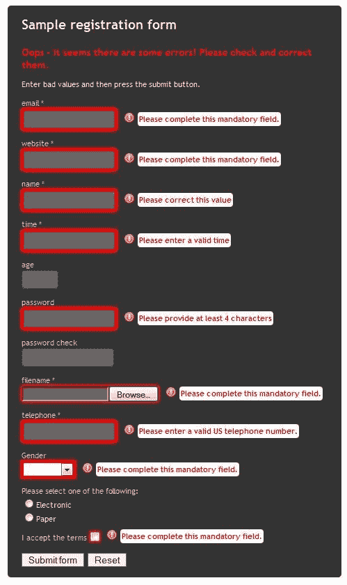
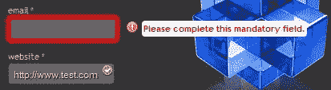
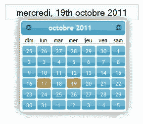
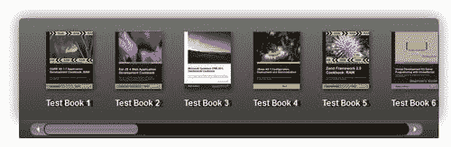

# 三、模板工具

问自己一个问题：你喜欢填写表格吗？如果，正如我所怀疑的，答案是否定的，那么加入大众，没有什么比在网上填写表格更糟糕的了，结果发现你输入了错误的内容，你必须回去更改它…

输入 jQuery 工具的表单工具！

这组 3 个有用的工具可能不像库中其他一些工具那样受欢迎，但它们仍然提供有用的功能。

在本章中，我们将了解以下内容：

*   如何使用验证器确保正确填写表单，或者在不正确的情况下显示错误
*   如何使用 jQueryUI 的主题元素更新 DateInput 的基本样式
*   如何将 RangeInput 转换为浏览器，以便您可以滚动浏览许多产品，以及如何将其与其他工具组合的一些提示

那么…你还在等什么？让我们开始看看验证器。

# 使用验证器

验证程序可用于确保表单是否正确填写。验证器也可以用来显示错误。

## 为什么使用基本验证器？

维基百科定义的填表艺术意味着你不能简单地用任何旧垃圾提交表格，或者说“放入垃圾，取出垃圾”肯定是正确的。确保您输入的内容至少符合某种形式的最低标准是至关重要的。验证器是帮助您做到这一点的工具之一。让我们更详细地了解一下工具库的这个组件。

### 注

数据验证是确保程序在干净、正确和有用的数据上运行的过程。

## 用法

Validator 的基本代码分为两部分：第一部分是 HTML 结构，第二部分是对 Validator 工具的单行调用：

```js
<form id="myform" novalidate="novalidate">
<fieldset>
<h3>Sample registration form</h3>
<p> Enter bad values and then press the submit button. </p>
<p>
<label>email *</label>
<input type="email" name="email" required="required" />
</p>
<p>
<label>website *</label>
<input type="url" name="url" required="required" />
</p>
<p>
<label>name *</label>
<input type="text" name="name" pattern="[a-zA-Z ]{5,}" maxlength="30" />
</p>
<p>
<label>age</label>
<input type="number" name="age" size="4" min="5" max="50" />
</p>
<p id="terms">
<label>I accept the terms</label>
<input type="checkbox" required="required" />
</p>
<button type="submit">Submit form</button>
<button type="reset">Reset</button>
</fieldset>
</form>

```

设置表单后，需要添加对 Validator 的调用以下是基本代码：

```js
$("#myform").validator();

```

### 注

请注意，这包括表单上的 `novalidate`属性，这是为了强制 IE 不要尝试使用在更现代的浏览器中工作的 HTML5 验证程序，而是使用 jQuery 工具中的验证程序。

考虑到这一点，让我们通过演示如何在表单中使用验证器来将其付诸实践。

## 项目：改进样式，添加自定义字段验证器

我们将使用 jQuery 工具站点提供的现有表单，并以附加验证器的形式添加一些调整，以及对配置的更改。

### 创建基本 HTML 结构

打开您选择的文本编辑器，并复制以下代码，您会注意到它遵循与本书中大多数项目类似的模式：

```js
<!DOCTYPE html>
<html>
<head>
<title>jQuery Tools standalone demo</title>
<!-- include the Tools -->
<script src="http://cdn.jquerytools.org /1.2.6/full/jquery.tools.min.js"></script>
</head>
<body>
</body>
</html>

```

### 增加表格明细

可以现在我们已经准备好了基本结构，让我们开始用一些细节来填充它。首先是表单内容，其中包含我们将要验证的字段，因此请在下面的代码中的`<body>`标记之间复制：

```js
<form id="myform">
<fieldset>
<h3>Sample registration form</h3>
<span class="errorlabel">Oops - it seems there are some errors! Please check and correct them.</span>
<p> Enter bad values and then press the submit button. </p>
<p>
<label>email *</label>
<input type="email" name="email" id="email" required="required" />
</p>
<p>
<label>website *</label>
<input type="url" name="url" required="required" />
</p>
<p>
<label>name *</label>
<input type="text" name="name" pattern="[a-zA-Z ]{5,}" maxlength="30" />
</p>
<p>
<label>time *</label>
<input type="time" name="time" required="required" data- message="Please enter a valid time"/>
</p>
<p>
<label>age</label>
<input type="number" name="age" size="4" min="5" max="50" />
</p>
<p>
<label>password</label>
<input type="password" name="password" minlength="4" />
</p>
<p>
<label>password check</label>
<input type="password" name="check" data-equals="password" />
</p>
<p>
<label>filename *</label>
<input type="file" name="uploadfile" required="required" />
</p>
<p>
<input type="phone" name="phone" data-message="Please enter a valid US telephone number." required="required" pattern="(?:1-?)?(d{3})[-.]?(d{3})[-.]?(d{4})" />
</p>
<p>
<label>Gender</label>
<select value="" required="required" name="sex">
<option></option>
<option value="male">Male</option>
<option value="female">Female</option>
</select>
</p>
<p id="terms">
<label>I accept the terms</label>
<input type="checkbox" required="required" />
</p>
<button type="submit">Submit form</button>
<button type="reset" id="clearform">Reset</button>
</fieldset>
</form>

```

### 注

请注意，代码中会弹出许多附加参数，例如电话输入字段中的 pattern 属性。验证器和/或其附加的自定义验证器使用它们作为验证访问站点的人员输入的文本的基础。

### 设计表单的样式

现在已经完成了，我们需要添加所有重要的样式说明，这确实包括一些用于此演示的附加样式，但在您的实时项目中不一定需要这些样式：

```js
<style>
/* body, a:active and : focus only needed for demo; these can be removed for production use */
body { padding: 50px 80px; }
a:active { outline: none; }
:focus { -moz-outline-style: none; }
/* form style */
#myform { background: #333 0 0; padding: 15px 20px; color:
#eee; width: 440px; margin: 0 auto; position: relative;
-moz-border-radius: 5px; -webkit-border-radius: 5px; border- radius: 5px; }
/* nested fieldset */
#myform fieldset { border: 0; margin: 0; padding: 0;
background: #333 url(logo-medium.png) no-repeat scroll
215px 40px; }
/* typography */
#myform h3 { color: #eee; margin-top: 0px; }
#myform p { font-size: 11px; }
/* input field */
#myform input { border: 1px solid #444; background-
color: #666; padding: 5px; color: #ddd; font-size: 12px;
text-shadow: 1px 1px 1px #000; -moz-border-radius: 4px;
-webkit-border-radius: 4px; border-radius: 4px; }
/* take care here: support for :focus and :active limited in some browsers!
#myform input:focus { color: #fff; background-color: #777; }
#myform input:active { background-color: #888; }
/* button */
#myform button { outline: 0; border: 1px solid #666; }
/* error message */
.error { font-size: 11px; color: #f00; display: none; }
.error p { margin:15px; margin-left: 20px; font-weight: bold; background-color: #fff; -moz-border-radius:4px;
-webkit-border-radius: 4px; padding: 2px; border-radius: 4px;}
/* field label */
label { display:block; font-size:11px; color:#ccc; }
#terms label { float: left; }
#terms input { margin: 0 5px; }
.invalid { -moz-box-shadow: 0 0 2px 2px #f00; -webkit-box-shadow: 0 0 2px 2px #f00; box-shadow: 0 0 2px 2px #f00; }
.errorlabel { display: none; font-size: 14px; font-weight: bold; color: #f00; }
.error img { position: absolute; margin: 15px 15px 15px 0;}
.errorhilite { border: 3px solid #f00; }
</style>
</head>

```

### 剧本的最后一部分

最后需要的部分是非常重要的脚本，为了使它能够正常工作，因为这是一个相当长的脚本，我们将从验证器开始将其分解为几个部分。

#### 自定义验证器

虽然验证器将使用标准的 HTML4 和 HTML5 验证器，但只有当您添加自定义验证器时，该功能才真正发挥作用，而自定义验证器不是普通库的一部分。在这个演示中，我们有五个自定义验证器的示例，因此将以下代码复制到您的站点中这应该是您页面的最后一个阶段，或者在`<head>`区域，只要相应地使用 `document.ready()`功能：

```js
<script>

```

此验证器对`<select>`下拉列表执行检查：

```js
// custom Validator for <select> dropdowns
$.tools.validator.fn("select", "Select a value", function(input, value) {
return (value == 'none') ? false : true;
});

```

如果要使用单选按钮，则需要使用以下验证程序代码：

```js
// custom Validator for radio buttons
$.tools.validator.fn("[group-required]", "At least one option needs to be selected.", function(input) {
var name = input.attr("group-required");
var group_members = $('input[name=' + name + ']');
var checked_count = group_members.filter(':checked').length;
if((checked_count == 0) && (group_members.first().attr('id') == input.attr('id'))) {
$('input[name=' + name + ']').click(function() {
validate_form.data("validator").reset($('input[name=' + name + ']'));
});
return false;
} else {
return true;
}
});

```

下面的验证程序将在有效时间内进行模式匹配：

```js
// custom Validator for "time" input type
$.tools.validator.fn("[type=time]", function(el, value) {
return /^(2[0-4]|[01]?\d):[0-6]\d$/.test(value) ? true : "Please provide a valid time, using military format";
});

```

如果未遵守最小字符长度，此验证器将标记错误：

```js
// custom alidator based on minimum required length
$.tools.validator.fn("[minlength]", function(input, value) {
var min = input.attr("minlength");
if (isNaN(min)) {
return true; // not a valid minlength, so skip validation
} else {
return value.length >= min ? true : {
en: "Please provide at least " +min+ " character" + (min > 1 ? "s" : ""),
fi: "Kentän minimipituus on " +min+ " merkkiä"
};
}
});

```

如果上载的文件类型不是预先确定的类型之一，此验证器将显示错误：

```js
// custom validator based on a required filetype
$.tools.validator.fn("[type=file]", "Please choose a file with an allowed extensions", function(input, value) {
if ($(":file").val() != "") {
return /\.jpg\png\gif\pdf\doc\txt)$/.test(value);
} else {
return true;
}
});

```

验证器脚本的真正核心如下所示，它包含对 jQuery 工具的验证器功能的调用，以及一些附加的配置选项。按照顺序，他们执行以下操作：

*   `position:`控制屏幕上文本出现的位置
*   `speed:`确定错误消息出现的速度
*   `offset:`配合位置微调屏幕上的位置
*   `errorClass`和 `errorInputEvent:`用于错误消息的 CSS 样式，以及用于输入有效性检查的触发器
*   `message:`错误消息的文本，包括任何图像（如图所示）
*   `inputEvent:`每次用户“模糊”或离开元素时，它都会重新验证文本，这尤其用于检查`<select>`标签

将此复制到脚本部分：

```js
$(document).ready(function () {
$("#myform").validator({
position: 'center right',
speed: 'slow',
offset: [0, 10],
errorClass: 'invalid',
errorInputEvent: 'keyup change',
message: '<div></div>',
inputEvent: "blur"
});
})

```

下一部分将执行两个功能：第一个功能是设置 Validator，以便在调整窗口大小时自动重新定位错误消息文本；第二个选项在按下 submit 按钮时触发“onFail”时，在未正确验证的字段上添加红色边框：

```js
// get handle to the Validator API
var myForm = $("#myform"), api = myForm.data("validator");
api.reflow();
myForm.bind("onFail", function(e, errors) {
// we are only doing stuff when the form is submitted
if (e.originalEvent.type == 'submit') {
$(".errorlabel").css({ display: 'block'});
// loop through Error objects and add the border color
$.each(errors, function() {
var input = this.input;
input.css( 'errorhilite' ).focus(function() {
input.css( 'errorhilite' );
});
});
}
});

```

此脚本的最后一部分是一个重置函数，用于清除针对任何未正确验证的字段设置的红色边框：

```js
$("#clearform").click(function() {
myForm.reset();
$(".errorlabel").css({ display: 'none' });
// loop through Error objects and add the border color
$("input, select").each(function(index) {
$(this).css({ border: '' });
});
});
})
</script>

```

如果所有操作都正常，那么您应该会看到下一个屏幕截图中所示的表单：



## “这似乎很消极，这是一次失败……”

是的，这是真的——验证器的一个潜在缺点是它确实感觉非常片面，因为它只关注输入条目失败时的情况。但是，如果验证器认为相关条目与所需模式匹配，则可以包含代码以显示确认或消息。

### 注

你应该注意到，这只是目前的一个概念；它是作为您自己开发的起点，在投入生产使用之前需要进行彻底的测试。

为此，您可以尝试以下操作：

1.  将以下内容添加到样式表中：

    ```js
    input.valid {
    background-image: url(images/accept.png);
    background-position: right top;
    background-repeat: no-repeat;
    }
    input.valid.invalid {
    background-image: none;
    }

    ```

2.  将此添加到对 jQuery 的 JavaScript 调用中：

    ```js
    // use API to assign an event listener
    api.onSuccess(function(e, els) {
    $("input[required]").addClass('valid');
    // we don't want to submit the form. just show events.
    return false;
    });

    ```

3.  将此添加到您的 `reset`方法

    ```js
    $('input').removeClass("valid");

    ```

    的底部
4.  将此行添加到为验证程序设置的配置中：

    ```js
    errorInputEvent: 'keyup change',

    ```

代码并不完美，它有一些 bug，所以应该只作为你自己想法的起点。如果您确实实现了上述代码，那么您应该会看到如下屏幕截图：



## 验证器——最后一个想法

这个演示只触及了 Validator 可以做什么的表面，Validator 将很高兴地与 jQuery 工具的覆盖功能一起工作，这样您就可以在对话框中显示错误，例如，在覆盖掩码后面。您甚至可以使用 jQuery UI 来提供对话框效果。使用 jQuery UI 的关键是首先声明对 jQuery 工具的调用，然后在工具中重新分配 Tabs 对象以使用不同的命名约定，否则它将与 UI 冲突。

在下一节中，我们将查看库 DateInput 中的另一个重要工具。

# 使用 Dateinput 让 HTML5 日期输入的外观和行为符合您的要求

HTML5 的出现带来了使用`<input type=date>`的能力，不再需要额外的功能。然而，这只能在有限的容量下使用，因为它只能在 Safari 上使用。jQuery 工具试图通过 DateInput 解决这一问题，DateInput 使 HTML5 功能现在可以在所有现代浏览器上使用。让我们来看看如何使用它。

## 用法

如果有一个例子表明需要最少的 JavaScript，那么这可以说是其中之一；DateInput 只需要两个单词就可以工作，当然除了对库的调用！下面是获取 jQuery 工具的 DateInput 工作所需的基本框架：

```js
<!-- include jQuery FORM Tools (or any other combination) -->
<script src="http://cdn.jquerytools.org/1.2.6/form/ jquery.tools.min.js">
</script>
<!-- dateinput styling -->
<link rel="stylesheet" type="text/css" href="dateinput.css"/>
<!-- HTML5 date input -->
<input type="date" />
<!-- make it happen -->
<script>
$(":date").dateinput();
</script>

```

考虑到这一点，现在是使用 DateInput 查看项目的时候了，不过这将是一个不同的项目。

## 项目：造型与本地化

在准备本书的演示时，我最初想到的是展示 DateInput 的一些功能。然而，经过反思，我想做些别的事情，那就是回答这个问题——“有可能将 jQueryUI 主题中的元素组合到 jQuery 工具中吗？”

这一点的灵感来自 jQueryUI 可用的主题主题，而这些主题是缺少 DateInput 的一个领域。在这个项目中，我们将研究使用原始皮肤设计 DateInput 的样式，但是要做一些调整，首先添加一些颜色，然后进行本地化。

### 创建基本 HTML

首先，让我们创建基本的 HTML 结构，打开文本编辑器，复制以下行作为起点：

```js
<!DOCTYPE html>
<html>
<head>
<title>jQuery Tools standalone demo</title>
<!-- include the Tools -->
<script src="http://cdn.jquerytools.org/1.2.6/full/ jquery.tools.min.js"></script>
<!-- standalone page styling (can be removed) -->
<link rel="stylesheet" type="text/css" href="http:// static.flowplayer.org/tools/css/standalone.css"/>
<link rel="stylesheet" type="text/css" href="skin1.css">
<style>
</style>
</head>
<body>
<!-- HTML5 date input -->
<input type="date" name="mydate" data-value: "Today" />
<!-- make it happen -->
<script>
</script>
</body>
</html>

```

好吧，这里没有什么复杂的事情；将此文件的副本另存为基础 HTML 文件，以便添加 CSS 和 JavaScript 代码。您将注意到与本书中其他项目的相似之处，其中构建可用结构所需的 HTML 很少，DateInput 也不例外。

### 注

请注意，这里使用的是`<input type="date">`标记，而这是有效的 HTML5，jQuery 工具的美妙之处在于让所有现代浏览器都可以使用它，而不仅仅是接受 HTML5 的浏览器。如果 JavaScript 由于任何原因不可用，那么对于那些使用 Safari 的人来说，这实际上会很好地降低性能！

### 设置 JavaScript

接下来，我们将添加用于 DateInput 的 JavaScript:

```js
// the french localization
$.tools.dateinput.localize("fr", {
months: 'janvier,f&eacute;vrier,mars,avril, mai,juin,juillet,ao&ucirc;t,' +
'septembre,octobre,novembre,d&eacute;cembre',
shortMonths: 'jan,f&eacute;v,mar,avr,mai,jun, jul,ao&ucirc;,sep,oct,nov,d&eacute;c',
days: 'dimanche,lundi,mardi,mercredi, jeudi,vendredi,samedi',
shortDays: 'dim,lun,mar,mer,jeu,ven,sam'
});
$(":date").dateinput({
format: 'dddd, ddth mmmm yyyy',
lang: 'fr',
offset: [0, 30],
yearRange: [-20, 20]
});

```

这分为两部分：第一部分是 DateInput 的本地化代码，它提供了一年中月份和日期的法语等价物。DateInput 使用它来激活它，需要使用 `lang`属性以及相应语言的正确两个字母代码。

代码的第二部分是对 DateInput 的调用，其中指定了格式和所需的语言（后者使用本地化代码中的相同代码）。

### 添加样式

这可以说是 DateInput 样式中最重要的部分。您会注意到原来的 `skin1.css`链接已经包含在本项目开始时的代码中；这是为了说明可以覆盖原始蒙皮，并且不必总是尝试重新创建轮子。您还需要从 jQueryUI 站点[下载“开始”主题 http://www.jqueryui.com](http://www.jqueryui.com) ；如果使用这种样式技术，您将需要参考它，以提取构成自定义样式的相关 CSS。将下面给出的代码复制到您网页中的样式标签中：

```js
// body, a:active and : focus only needed for demo; these can be // removed for production use
body { padding:50px 80px; }
a:active { outline:none; }
:focus { -moz-outline-style:none; }
.date { width: 260px; }
#calroot { width:210px; }
#calhead { background: url("ui-bg_gloss- wave_75_2191c0_500x100.png") repeat-x scroll 50% 50% #2191C0;
border: 1px solid #4297D7; color: #EAF5F7; font-weight:
bold; -moz-border-radius: 4px; -webkit-border-radius:
4px; border-radius: 4px; }
#caltitle { font-size:14px; float:left; text-align:center;
width: 155px; line-height: 20px; color: #EAF5F7; font-
weight: bold; }
#calnext, #calprev { display:block; width: 16px; height:
20px; float:left; cursor:pointer; margin-top: 2px; }
#calnext {
background:transparent url(ui-icons_056b93_256x240.png)
no-repeat scroll center center; background-position:
-48px -192px; float:right; margin-right: 4px; }
#calprev {
background:transparent url(ui-icons_056b93_256x240.png)
no-repeat scroll center center; background-position:
-78px -192px; margin-left: 4px; }
#caldays { margin-top: 3px; }
#caldays span { display: block; float: left; width: 30px; text-align: center; }
/* single day */
.calweek a { background: url("ui-bg_gloss- wave_75_2191c0_500x100.png") repeat-x scroll 50% 50% #0078AE;
border: 1px solid #77D5F7; -moz-border-radius: 3px;
-webkit-border-radius: 3px; border-radius: 3px;
color: #FFFFFF; display: block; float: left; font-size: 11px;
font-weight: normal; height: 18px; line-height: 20px;
margin-left: 2px; outline: medium none; text-align:
center; text-decoration: none; width: 26px; }
/* current day */
#calcurrent, #caltoday {
background: url("ui-bg_gloss-wave_50_6eac2c_500x100.png")
repeat-x scroll 50% 50% #6EAC2C; border: 1px solid #ACDD4A; color: #FFF; font-weight: normal; outline: medium none; z-index:9999; }
/* today */
#caltoday {
background: url("images/ui-bg_gloss- wave_45_e14f1c_500x100.png") repeat-x scroll 50% 50% #6EAC2C;
border: 1px solid #ACDD4A; color: #000;
}

```

如果一切顺利，您将拥有一个外观与 jQueryUI 版本相似的日历，但可能没有相同数量的代码！以下是您应该看到的屏幕截图：



## 最后一个想法

上面的代码并不完美，它是作为在 DateInput 中使用来自 jQueryUI 主题的元素时可以实现的概念而设计的。jQueryUI 有许多可用的主题，可以轻松地使用这些元素在代码中提供类似的效果。关键是要理解我没有使用 jQuery UI 的 Javascript，因为这将为您的站点添加大量额外的代码，这与 jQuery 工具的整体精神背道而驰。总而言之，没有什么能阻止你使用来自主题的元素！

在某些方面，可以从 jQuery 工具的主站点下载 `skin`文件的基本版本，您可能会发现从这个版本开始工作比调整现有主题更可取。然而，这在很大程度上取决于您想要做的更改，如果您没有做很多更改，那么更明智的做法可能是简单地覆盖现有的 `skin`文件，而不是为自己创建额外的工作。

# 使用 RangeInput 控制 HTML5 范围输入

HTML5 的出现带来了许多可与`<input>`命令一起使用的附加类型，如`<input type="range">`。虽然这对开发人员来说可能是个好消息，但对于那些仍然需要使用旧浏览器的人来说却不是那么好，因为这种效果只会在最新的浏览器中本机工作。

输入 jQuery 工具的 RangeInput，它使所有浏览器都可以使用相同的效果（IE5 和 IE6 除外，因为这些浏览器的市场份额现在非常小，因此缺少对这两种浏览器的支持不会影响大多数网站用户）。

## 为什么选择基本范围输入？

jQuery 工具旨在跨所有现代浏览器标准化`<input type="range">`的 HTML5 功能，为正式发布做好准备，大多数浏览器默认支持它。当 jQuery 工具将大量样式和固有的功能抽象到 CSS 中时，只需将其删除，即可让 HTML5 功能正常工作。

让我们再深入一点，看看它在正常环境下是如何工作的。

## 用法

所有工具都遵循相同的基本原则，即只需要最少的 JavaScript 即可操作，CSS 样式提供了真正强大的 RangeInput 也不例外。基本格式分为三部分：第一部分是指向提供 RangeInput 所需样式的 CSS 的链接，第二部分是至少一条`<input>`语句（以下代码显示两条相同的原则适用于这两条语句），然后是从工具库调用 RangeInput:

```js
<!-- styling for the range -->
<link rel="stylesheet" type="text/css" href="range.css"/>
<!-- a couple of HTML5 range inputs with standard attributes -->
<input type="range" name="range1" min="50" max="500" step="20" value="100" />
<input type="range" name="range2" min="0" max="1500" step="50" value="450" />
<!-- select all range inputs and make them ranges -->
<script>
$(":range").rangeinput();
</script>

```

现在，大多数人可能认为 RangeInput 真的应该用于从网站上显示的预设比例中获取值。这是一个非常有效的假设，但 RangeInput 只能用于一小部分。为了证明这一点，让我们看一看构建可滚动产品库的项目。这个项目将显示大量书籍，并且可以轻松地在零售网站上使用，例如 Packt's。

## 项目：建设产品展馆

我们将建立一个基本的可滚动产品库，采用个人电脑制造商苹果公司的风格™ 几年前。这个项目的灵感来自于一个在线教程[http://jqueryfordesigners.com/slider-gallery/](http://jqueryfordesigners.com/slider-gallery/) ，这就解释了如何使用 jQuery 创建类似的效果，这是展示 jQuery 工具的 RangeInput 功能的完美借口，以及如何使用它来产生相同的效果！

虽然基本框架将保持不变，但您可以在以后轻松地更改样式，这是您认为合适的。让我们从设置基本结构开始。

### 设置基本 HTML 结构

打开您选择的文本编辑器，插入以下行，然后将其保存为您的 HTML 页面：

```js
<!DOCTYPE html>
<html>
<head>
<title>jQuery Tools standalone demo</title>
<!-- include the Tools -->
<script src="http://ajax.googleapis.com/ ajax/libs/jquery/1.6.4/jquery.min.js">
</script>
<script src="https://raw.github.com/jquerytools/jquerytools/ master/src/rangeinput/rangeinput.js"></script>
</head>
<body>
<div id="wrap">
<!-- our scrollable element -->
<div id="scrollwrap">
<div id="scroll">
<ul>
</ul>
</div>
</div>
<!-- rangeinput that controls the scroll -->
<input type="range" max="2600" step="10" />
</div>
<script>
</script>
</body>
</html>

```

现在，我们有了基本框架，让我们开始添加内容。

### 注

您会注意到，在演示中，我们直接链接到了托管在 Github 中的工具源文件。这是可以接受的，但只能用于发展目的；如果您在生产环境中使用此功能，则需要更改为使用一个 CDN 链接或库的下载副本。

### 在书中添加图片

接下来是我们需要添加的书籍图像；我们总共用了 30 个。如果您想使用更少的图像，那么这是可能的，但是您需要改变滑块周围的样式，以允许更改使用的图像数量。

在代码中的`<ul> </ul>`标记之间添加以下内容：

```js
<li><span class="textfont">Test Book 1 </span></li>
<li><span>Test Book 2</span></li>
<li><span>Test Book 3</span></li>
<li><span>Test Book 4</span></li>
<li><span>Test Book 5</span></li>
<li><span>Test Book 6</span></li>
<li><span>Test Book 7</span></li>
<li><span>Test Book 8</span></li>
<li><span>Test Book 9</span></li>
<li><span>Test Book 10</span></li>
<li><span>Test Book 11</span></li>
<li><span>Test Book 12</span></li>
<li><span>Test Book 13</span></li>
<li><span>Test Book 14</span></li>
<li><span>Test Book 15</span></li>
<li><span>Test Book 16</span></li>
<li><span>Test Book 17</span></li>
<li><span>Test Book 18</span></li>
<li><span>Test Book 19</span></li>
<li><span>Test Book 20</span></li>
<li><span>Test Book 21</span></li>
<li><span>Test Book 22</span></li>
<li><span>Test Book 23</span></li>
<li><span>Test Book 24</span></li>
<li><span>Test Book 25</span></li>
<li><span>Test Book 26</span></li>
<li><span>Test Book 27</span></li>
<li><span>Test Book 28</span></li>
<li><span>Test Book 29</span></li>
<li><span>Test Book 30</span></li>

```

### 注

在本例中，我们使用的是 Packt 网站上的图像，如果您愿意，您可以自由使用其他图像，尽管您需要保持相似的大小，或者调整样式以适应。

### 添加 JavaScript 功能

让我们继续添加 JavaScript 功能：

```js
// get handle to the scrollable DIV
var scroll = $("#scroll");
// initialize rangeinput
$(":range").rangeinput({
// slide the DIV along with the range using jQuery's css() method
onSlide: function(ev, step) {
scroll.css({left: -step + "px"});
},
// display progressbar
progress: true,
// the DIV is animated when the slider is clicked: function(e, i) {
scroll.animate({left: -i + "px"}, "fast");
},
// disable drag handle animation when slider is clicked
speed: 0
});

```

上面的代码创建了一个内部“滚动” `DIV`（即 `#scroll)`）的实例，然后使用 CSS 将其向左或向右移动到适当的数量；这是通过使用 jQuery 的.animate（）函数来设置动画的，以提供更平滑的移动。

### 画廊造型

在这个阶段，如果您运行代码，您将不会看到大量工作，这是因为 jQuery 工具的真正功能实际上在于应用的 CSS 样式。

```js
<style>
// body, a:active and : focus only needed for demo; these can be // removed for production use
body { padding:50px 80px; }
a:active { outline:none; }
focus { -moz-outline-style:none; }
#wrap {
background:url("images/productbrowser.jpg") no-repeat scroll 0 0 transparent;
}
/* outermost element for the scroller (stays still) */
#scrollwrap {
position: relative;
overflow: hidden;
width: 620px;
height: 150px;
margin-bottom: 15px;
-moz-box-shadow: 0 0 20px #666;
-webkit-box-shadow: 0 0 20px #666;
border-radius: 4px 4px 0 0;
}
/* the element that moves forward/backward */
#scroll {
position:relative;
width:20000em;
overflow: hidden;
padding: 20px 100px;
height: 160px;
color: #fff;
text-shadow: 5px 1px 1px #000;
left: -100px;
}
#scroll span {
font-weight:bold;
font-family: sans-serif;
font-size: 12px;
float: left;
padding-right: 72px;
width: 30px;
}
slider {
background: transparent url("images/bkgrdhandle.png") no-repeat scroll 0 0 transparent;
position: relative;
cursor: pointer;
height: 17px;
width: 580px;
-moz-border-radius: 2px;
-webkit-border-radius: 2px;
border-radius: 2px
margin-top: -10px;
padding: 3px;
margin-left: 16px;
background-size: 581px auto;
}
handle {
-moz-border-radius: 14px;
-webkit-border-radius: 14px;
border-radius: 14px;
cursor: move;
display: block;
height: 18px;
position: absolute;
top: 0; width: 181px;
background: url("images/scroller.png") no-repeat scroll
0 0 transparent;
}
handle:active {
background-color: #00f;
}
range {
display:none;
}
#scroll ul {
list-style: none outside none;
margin: 0;
padding: 0;
position: absolute;
white-space: nowrap;
left: 40px;
}
#scroll ul li {
display: inline;
width: 80px;
}
#scroll ul li img {
padding-right: 20px;
}
</style>

```

如果一切正常，那么在添加样式后，您应该会看到类似的内容：



## 一些最后的评论

虽然这是为 30 个书籍图像构建的，但这很可能是任何产品图像。其关键是确保使用的图像大小相同，或者调整 CSS 以确保宽度均匀。jQuery 工具的美妙之处在于，尽管 JavaScript 保持在最低限度，但几乎每个元素都可以使用 CSS RangeInput 进行调整也不例外。需要注意的是，尽管本演示中使用了一些 CSS3 样式，但您可能会发现在一些较旧的浏览器中无法使用这些样式；在您的网站中使用此效果时，请记住这一点。毕竟，jQuery 工具的基本精神是推动使用越来越多的 CSS3

# 总结

在本章中，我们研究了 jQuery 工具的三个鲜为人知但仍然很重要的组件，即验证器、DateInput 和 RangeInput。尽管这些组件可能不像其他组件那样广为人知或使用，但它们仍然同样强大，特别是当您考虑到使用 CSS 提供的可定制性级别时，并且它们还可以使用 jQuery 进行扩展（其他组件也可以）。我们从理论上看了一下如何使用 jQueryUI 中的元素为 DateInput 设置样式。这里的效果可能需要一些调整；如果还使用了来自其他 jQueryUI 主题的元素，那么它仍然是展示可以做什么的有用方式。

在本书的第四章也是最后一章中，我们将深入探讨 Expose 和 flashmbed 的世界，它们本身并不一定单独使用，但仍然是 jQuery 工具库的重要组成部分。