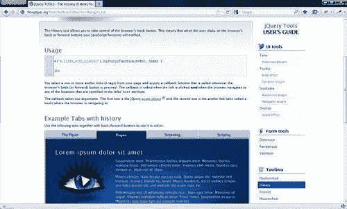
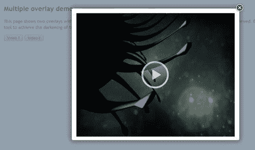
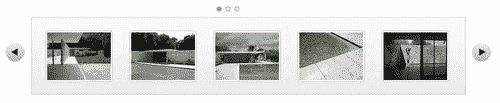

# 四、jQuery 工具箱

呸！我们在 jQuery 工具库中进行了一次真正的短暂之旅，并了解了一些可以在您自己的项目中使用的激动人心的特性。

该休息了，我想…别那么快，我的朋友！我们还有一个部分要看，工具箱。

工具箱？这是怎么回事？

它是一个小的工具集合，可以与库中的主要工具一起使用。例如，可以将其视为在套接字集上使用扩展臂。该工具箱包括允许嵌入 Flash 电影的功能，以及能够在浏览器中后退或在页面中控制鼠标滚轮的功能。

让我们从 flashmbed 开始，更详细地了解每一项。

### 注

jQuery 工具库的这一部分很可能会在未来的版本中发生重大变化，正如您将看到的，它包含的功能正迅速被 HTML5、CSS3 和 jQuery 的进步所取代。我将它包括在本书中是为了让您知道什么仍然是可能的，尽管最有可能的是，当 jQuery 工具的第 2 版在通用版本中可用时，它将不向后兼容。

# 使用 FlashMBED 包含 Flash 电影

Adobe 的 Flash™ 这项技术成为将基于 Flash 的电影嵌入网页的事实标准，自 1996 年推出以来，它已被开发用于多种平台，包括 Linux、平板电脑、黑莓，当然还有 Windows。

此功能的缺点是，并非每个浏览器都使用相同的嵌入代码输入 jquerytools 的 flashmbed，它允许您使用相同的配置选项嵌入 Flash，而库处理后端嵌入代码。

### 注

注意：JavaScript 和 HTML5 技术的进步开始使 Flash 嵌入技术的使用变得多余，因为大多数基于 CSS3 的现代浏览器能够使用`<video>`标记处理视频，而不需要额外的软件。一旦 HTML5 和 CSS3 变得越来越广泛，IE5 和 IE6 等较旧的浏览器不再使用，FlashMBed 很可能会从该库的未来版本中消失。

## 用法

嵌入 Flash 文件本身很简单；在网页中设置基本的 Flash 功能有三个部分。

### HTML 设置

首先，您需要在页面上包含 flashmbed 脚本：

```js
<script type="text/javascript" src="toolbox.flashembed.min.js">
</script>

```

为了与 jQuery 工具的基本精神保持一致，建议您使用库的缩小版本，以尽可能减少下载时间。然后，需要为对象提供一个 HTML 容器；我们在示例中使用了一个 `DIV`元素。它有一个 `id`属性，稍后在嵌入中引用此容器：

```js
<div id="clock"></div>

```

### JavaScript 设置

然后我们使用 flashmbed 将一个 Flash 对象放在前面的容器中，将其复制到您的网页中：

```js
flashembed("clock", "/swf/clock.swf");

```

调用必须放在 `DIV`元素之后，或者必须用 jQuery 将其放在 `$(document).ready()`块中。

## 演示：让我们嵌入一个 Flash 电影

与本书中的其他项目不同，我们不打算尝试为潜在的客户机构建一些有用的东西，而是来看看 flashmbed，以及如何使用它嵌入 Flash，同时仍然保持对旧浏览器的支持。

考虑到这一点，让我们使用以下代码设置一个基本的 HTML 结构：

```js
<!DOCTYPE html>
<html>
<head>
<title>jQuery Tools standalone demo</title>
<!-- include the Tools -->
<script src=
"http://cdn.jquerytools.org/1.2.6/full/jquery.tools.min.js">
</script>
<!-- standalone page styling (can be removed) -->
<link rel="stylesheet" type="text/css"
href="http://static.flowplayer.org/tools/css/standalone.css"/>
</head>
<body>
</body>
</html>

```

### 视频空间

我们需要在页面上为视频添加一个空格，因此请将以下代码复制到您的网页：

```js
<div id="flash2">

</div>

```

### 视频的造型

我们需要添加一点额外的样式，下面的代码将重置使用的字体，并在页面上的视频中心；对于 TytT0 的样式将在图片的中间添加播放按钮：

```js
<style>
#flash2 { width: 787px; height: 300px; background-
image: url(splash.jpg); text-align:center;
cursor:pointer; }
#flash2 img { margin-top: 110px; }
</style>

```

### 制作视频的脚本

jquerytools 中提供的 flashmbed 工具不需要使用 jQuery 来运行，尽管如果需要，它是受支持的；这是一个如何使用它的示例。将以下脚本复制到`<head>`部分：

```js
<script>
// use the jQuery alternative for flashembed.domReady
$(function() {
// bind an onClick event for this second Flash container
$("#flash2").click(function() {
// same as in previous example
$(this).flashembed("http://static.flowplayer.org/swf/flash10.swf");
});
});
</script>

```

如果一切正常，则应观看视频播放，如下所示：


## 一些最后的评论

虽然 Flash 仍然非常有用，但它正在迅速成为一种旧技术；早期的 iPad 和其他产品不支持它，尽管这种情况在以后的型号中有所改变。然而，HTML5 和 JavaScript 正在接管——HTML5 包括对`<canvas>`和`<video>`标记的支持，而不需要额外的支持。这允许使用简单的 HTML、CSS 和 JavaScript 构建许多类似 Flash 的行为和可视化；图像同样可以被使用，尽管在很多情况下，它们不是必需的。对这两种标签的支持仍然是混合的，在基于 WebKit 和 Mozilla 的浏览器中比在 Internet Explorer 中有更好的支持；FlashMBed 通过允许在较旧的浏览器中播放 Flash 而独树一帜，该库使用一个通用标准来处理所需的不同嵌入代码。

另一方面，您还可以使用 flashmbed 嵌入字体，使用 SIFR 技术；这应该谨慎使用，因为这项技术已经有一段时间没有更新了。浏览器包含对 `@font-face`的支持，允许在所有主要浏览器（包括 IE6-9、Firefox、Chrome 和 Safari）中显示字体，而无需额外的外部库。SIFR 只适用于嵌入小的 Flash 文件，因为它是处理器密集型的，并且会带来很大的开销，但额外的好处很小，您应该小心使用它！

接下来，让我们看看历史插件，它是 jQuery 工具的一部分。

# 历史倒退

在网络上导航的一个关键部分是控制我们旅行方向的能力。虽然这听起来有点奇怪，但有时我们需要倒退，重新审视我们已经看过的东西。这并不总是有效的，取决于环境，这是历史插件可以提供帮助的地方。

## 用法

这是一个简单的插件工具，允许您控制浏览器的历史记录。这意味着，当您在页面中来回导航时，浏览器的按钮将收到通知，以便您可以使用它们正确导航。

但应注意的是，虽然可以使用如下代码调用历史记录函数，但更可能的情况是，您将在其中一个工具（如 Tabs 或 Scrollable）中使用该函数作为配置选项：

```js
$("a.links_with_history").history(function(event, hash) {
});

```

为了说明如何将其与选项卡等一起使用，请查看以下代码：

```js
$(function() {
$("#flowtabs").tabs("#flowpanes > div", { history: true });
});

```

这将引用 jQuery 工具库中单独提供的相同历史记录功能。如果使用正确，您将能够使用浏览器按钮前后导航，例如，如果您浏览选项卡的每个选项卡，则使用**后退**按钮将按照访问顺序返回您访问过的每个选项卡：



生成的 URL 看起来类似于以下内容：

`http://flowplayer.org/tools/demos/tabs/history.html#streaming_tab`

您可以以正常方式为这些 URL 添加书签；如果您将其中一个链接添加到书签中，并稍后返回，您将能够加载该特定的“部分”。在本例中，它将加载已被请求的 URL 引用的特定选项卡。

### 注

需要注意的是，尽管这被描述为 HTML5 库，但当前版本的工具（撰写本文时为 1.2.6 版）无法处理 HTML5 标准的某些格式。例如，您可以使用 `http://flowplayer.org/tools/demos/tabs/history.html#123`，但不能使用类似于： `http://flowplayer.org/tools/demos/tabs/history.html/#/page/#SecondTab`的内容。

现在让我们看一下工具箱的另一个组件，Expose。

# 以曝光方式炫耀内容

如果你运行的网站需要突出显示信息或内容，例如显示视频，那么你很可能会发现需要减少背景干扰。这种效果在一些电视公司中得到了很好的应用，当他们通过互联网播放内容时，这类似于当你想看一部好电影时*关灯*。

Expose 是一个可以在这里提供帮助的工具。它会暴露或*突出显示*某个特定元素，并淡出其他元素，因此您只能看到网站所有者的意图。不过这个工具有一个怪癖。通常您不会单独使用它，而是作为本书前面介绍的覆盖工具的一部分。然而，开发 Expose 是为了进一步理解这一概念，并将其作为独立工具或集成到 Overlay 中。在哪种*模式*下使用它并不重要，但您可以使用它来曝光所有形式的对象，例如图像、窗体或 Flash 对象。我们将用它来展示一段视频。在这样做之前，让我们更详细地看一看。

## 用法

jquerytools 的 Expose 很容易配置，尽管它的多功能性意味着您可以通过多种方式使用它来获得巨大的效果：

```js
// place a white mask over the page
$(document).mask();
// place a custom colored mask over the page
$(document).mask("#789");
// place a non-closable mask - this effectively makes it a modal mask
$(document).mask{ closeOnEsc: false, closeOnClick: false });
// place a mask but let selected elements show through (expose)
$("div.to_be_exposed").expose();
// close the mask
$.mask.close();

```

### 注

`.mask`的默认颜色为白色，可以通过指定 HTML 颜色来覆盖，如前一个第二个示例所示，也可以在调用中使用 `color`属性来公开/屏蔽。

现在，你们中的观察者会注意到在前面的代码中有对两个不同函数的调用；这是因为公开内容实际上有两种不同的方式：使用 `mask`和 `expose`。

`mask`功能将仅对文档对象可用。它不适用于任何其他选择器。这意味着，例如，如果您想使用它来显示 `DIV`中包含的元素，那么您需要使用 `expose`函数。expose 选择器返回的所有元素都将放置在掩码的顶部。

`mask`函数（在暴露或掩码调用后立即加载）可以在每次调用中使用不同的配置；如果未指定配置，则它将自动使用上次调用中提供的最后一个配置。默认情况下，如果该工具的 ID 设置为 `exposeMask`，则该工具设置为使用任何元素，但如果您将该 ID 用于其他目的，则可以更改配置以指定自己的元素。

正如我们将在演示中看到的， `mask`和 `expose`都需要关闭，并销毁它们的配置，然后才能使用与现有 `mask`或 `expose`不同的新属性创建新的配置。

## 演示：使用 Expose 显示视频内容

jQuery 工具的一个重要特性是，它的组件可以很容易地与库中的其他组件组合，或者通过使用额外的 jQuery 进行扩展。我们将要看的一个这样的例子是使用 Expose with Overlay。本演示将带您了解如何将这两者结合起来，以获得更好的效果。这借鉴了一个很好的例子，可以从 jQuery 工具的主要网站上获得。

本演示将使用覆盖功能，类似于[第 2 章](02.html "Chapter 2. Getting along with your UI Tools")、*使用 UI 工具*，以及[提供的“Flowplayer”视频工具 http://www.flowplayer.org](http://www.flowplayer.org) 。

### 设置基本 HTML 结构

让我们从设置视频内容的基本结构开始。这与我们在本书前面看到的项目非常相似，尽管您会注意到包含了“Flowplayer”：

```js
<!DOCTYPE html>
<html>
<head>
<title>jQuery Tools standalone demo</title>
<!-- include the Tools -->
<script src="http://cdn.jquerytools.org/1.2.6/full/jquery.tools.min.js"></script>
<script src="flowplayer-3.2.6.min.js"></script>
<!-- standalone page styling (can be removed) -->
<link rel="stylesheet" type="text/css" href="http://static.flowplayer.org/tools/css/standalone.css"/>
<script>
</script>
</head>
<body>
</body>
</html>

```

### 注

Flowplayer 由 Tero Piirainen 编写，他也是 jQuery 工具的主要开发人员。您可以从[下载优秀视频工具的免费版本 http://flowplayer.org/download/index.html](http://flowplayer.org/download/index.html) 。

### 添加视频内容

现在我们已经有了一个基本的结构，我们需要开始添加一些内容。下面的代码设置触发覆盖的触发器，然后是包含要显示的视频的覆盖。请注意，您可以在同一页面上包含多个示例，而覆盖工具可以定制为使用不同的覆盖背景；曝光工具称为*单例*。这意味着无论使用多少次，每次使用都会共享一个实例和配置。

```js
<h2>Multiple overlay demo</h2>
<p>
<button rel="#overlay1">Video 1</button>
<button rel="#overlay2">Video 2</button>
</p>
<!-- overlays for both videos -->
<div class="overlay" id="overlay1">
<a class="player" href="http://pseudo01.hddn.com/vod/demo.flowplayervod/flowplayer-700.flv">
&nbsp;
</a>
</div>
<div class="overlay" id="overlay2">
<a class="player" href="http://pseudo01.hddn.com/vod/demo.flowplayervod/flowplayer-700.flv">
&nbsp;
</a>
</div>

```

### 添加样式

下一步是添加最重要的样式，不需要太多，大部分都需要覆盖才能正常工作：

```js
<style>
.overlay { background:url(white.png) no-repeat; padding:40px; width:576px; display:none; }
.close {
background: url(close.png) no-repeat;
position: absolute;
top: 2px;
display: block;
right: 5px;
width: 35px;
height: 35px;
cursor: pointer;
}
a.player { display:block; height: 450px; }
</style>

```

### 让玩家开始工作

最后一步是添加使覆盖和视频工作的脚本：

```js
$(function() {
// setup overlay actions to buttons
$("button[rel]").overlay({
// use the Apple effect for overlay
effect: 'apple',
expose: '#789',
onLoad: function(content) {
// find and load the player contained in the overlay
this.getOverlay().find("a.player").flowplayer(0).load();
},
onClose: function(content) {
$f().unload();
}
});
// install flowplayers
$("a.player").flowplayer(
"http://releases.flowplayer.org/swf/flowplayer-3.2.7.swf");
});

```

如果一切顺利，您应该看到这样的内容：



现在让我们看看库工具箱部分的最后一个组件，即 mousewheel。

# 用鼠标滚轮控制你的鼠标

工具箱组件组的最后一部分是 mousewheel，它允许您在使用 jQuery 工具浏览页面时控制鼠标滚轮。

## 用法

启用鼠标滚轮的代码非常简单。它涉及一个对 mousewheel 库的调用， `event`是被控制的 jQuery 事件对象， `delta`是 mousewheel 中的移动量。正值表示车轮向上移动，负值表示车轮向下移动：

```js
// make #myelement listen for mousewheel events
$("#myelement").mousewheel(function(event, delta) {
});

```

但是，您应该注意，当鼠标滚轮在主 UI 工具集中用作配置选项时（如 Scrollable），它确实有自己的功能。虽然它是作为一个单独的库存在的，但很可能您不会使用前面的方法引用它，而是作为另一个工具配置的一部分。

为了演示，让我们看一下启用鼠标滚轮的基本滚动的代码：



现在，从上一个屏幕截图来看，您无法立即判断它是否具有鼠标滚轮功能，对吗？是的，这是正确的，它不会给正在使用的工具的视觉外观添加任何内容。判断的唯一方法是查看代码，代码可能类似于以下内容：

```js
$("#chained").scrollable({circular: true, mousewheel: true}).navigator().autoscroll({
interval: 3000
});

```

尽管它在这里是一个配置选项，但实际上它引用的是 mousewheel 库，根据您下载的 jQuery 工具的版本，它可能包含在项目中，也可能尚未包含在项目中（例如，默认情况下，它不包括在某些 CDN 链接中，因此这可能需要更改链接，或额外调用鼠标滚轮功能，作为单独的自定义下载）。

# 总结

在本章中，我们以工具箱的形式介绍了 jQuery 工具的第三部分也是最后一部分。我们已经学习了如何使用 expose 在页面上公开对象，这实际上是作为[第 2 章](02.html "Chapter 2. Getting along with your UI Tools")*中的主要覆盖功能的基础，使用您的 UI 工具*。我们还研究了 flashmbed，尽管这项技术在较新的浏览器中被 HTML5 功能的进步所取代，但只要旧浏览器仍然存在，它仍然可以在旧浏览器中发挥重要作用。然后，我们了解了 mousewheel 和 history，以及尽管您可以在项目中单独使用它们，但更有可能将它们用作构成 jQuery 工具库的众多工具之一的配置选项。

同时，我希望你喜欢读这本书，就像我喜欢写这本书一样，并且你发现了一些有用的东西，可以用于你未来的项目。

### 注

如果我引起了你的兴趣，你想看看 jQuery 工具如何在真实环境中使用，比如 CMS，那么别忘了下载本书附带的 PDF。它包含了一些在 CMS 中使用工具的好例子，使用了流行的 WordPress 系统。享受