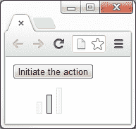

# 一、开始

*欢迎来到 jQuery 2.0 动画技术初学者指南。在本书的整个过程中，我们将了解 jQuery JavaScript 库中生成或控制动画的每一种方法。我们将看到这些方法是如何使用的，它们能够接受的参数，以及它们产生的不同行为。我们还将了解如何使用一系列附带的资源，包括选定的 jQuery 插件和 jQuery UI 库。*

在本介绍性章节中，我们将介绍以下主题：

*   网络动画的简史
*   为什么设置 UI 动画很重要
*   jQuery 提供的动画方法
*   每个示例使用的模板文件
*   一个基本的动画例子

# 网络动画

1989 年，CompuServe 发布了 GIF89a，这是一种流行的 GIF 图像格式的增强版，允许一系列帧存储为单个图像，并由支持软件播放。

GIF 格式由于其小文件大小、无损压缩和广泛支持，在当时的互联网上已经非常流行（记住，万维网直到 1991 年才出现）。增强版允许任何人都可以自己制作动画，只要他们有支持软件，很快就流行起来。

除了动画 GIF 之外，浏览器供应商还增加了对以本机方式处理动画的专有 HTML 元素的支持，例如`<blink>`和`<marquee>`元素，它们为文本添加了不同的动画效果。

这些元素都不是特别有吸引力或成功的，W3C 以及领先的行业可访问性和可用性专家建议在大多数情况下不要使用它们。当时不同的浏览器支持这些元素中的一个或另一个，但不是两个都支持。这两个元素都是由各自的供应商作为原始浏览器战争的一部分添加的。

20 世纪 90 年代末，流行浏览器增加了对一种称为**动态 HTML**（**DHTML**）的技术的支持，这种技术允许脚本语言在页面加载后修改页面内容。DHTML 不是任何单一的技术，而是一系列技术（JavaScript、CSS、DOM 等）的集合，它们共同工作以实现基本级别的交互和/或动画。

事实上，DHTML 使创建相当高级的动画成为可能，但所需技术的早期实现中的限制，以及变化巨大的浏览器支持，使得 DHTML 充其量也很棘手。

这一时代还见证了 Flash（以及 Shockwave，一种竞争性技术，最终被 Macromedia 吞并，后来在 2005 年被 Adobe 收购），一种矢量和光栅图形格式的发布和兴起，该格式允许音频和视频流、逐帧动画和一系列其他功能。Flash 迅速流行起来，在撰写本文时，它仍然是基于网络的视频、基于浏览器的游戏和广告的头号格式。

跨（大多数）浏览器的 DOM 的逐步标准化，以及 jQuery 等 JavaScript 库的兴起，这些库将浏览器之间的差异抽象出来，为更多的人提供了动画。DHTML 这个词现在不常被使用，因为它意味着浏览器之间的支持差，但驱动许多交互式和动画网站的基本原理和技术仍然相似。

今天，除了 JavaScript 库提供的看似合理和可访问的动画之外，我们还可以使用 CSS3 和原生 HTML 元素（如`<canvas>`元素）实现更新和更令人兴奋的可能性，它提供了对页面某个区域的完整像素级控制。我们将在本书的末尾详细介绍一些 CSS3 动画技术以及`<canvas>`元素。基于 Flash 的动画在本世纪首次出现衰退，新技术即将问世。

# 动画用户界面的力量

现代操作系统不断地使用动画来吸引用户，并创造更引人注目的计算体验。当以正确的方式使用时，动画为系统用户提供帮助，引导他们完成不同的任务，提供上下文或反馈，并加强积极的行动。

这方面的一个很好的例子是 Windows 7 或 OS X 中最小化应用的方式—应用似乎向下挤压到任务栏/驳接上的图标中，该图标显示用户想要返回应用时要去的地方。像这样的简单细节才是最有效的。

好的动画可以给界面增添一种圆滑的专业气息，使其看起来更先进或更现代。苹果的 iPhone（或 iPad）就是一个完美的例子，在操作系统及其应用中无缝地使用微妙的动画和过渡，使用户能够以一种非常令人满意和身临其境的方式与设备连接。任何出现或消失的内容都会平滑地淡入或淡出，菜单和内容面板会从顶部或侧面滑入或滑出。突发事件可能会让用户感到不安或分心，但一个适时的动画可以帮助他们意识到正在发生或即将发生的事情。

但要注意，执行不当、笨拙或过于毫无意义的动画可能会适得其反，使您的界面显得基本、设计拙劣或低劣。没有动画比糟糕的动画更好。即使你的应用运行得很好，多余的动画也会让你的用户感到沮丧，并导致他们放弃你的应用或网站。

台式计算机和快速增长的移动和手持设备的功能非常强大，可以轻松处理相当复杂的动画，随着集成硬件加速和更精细的 CSS3 和 HTML5 进入最新浏览器，在 Web 上实现的可能性正呈指数级增长。

## 何时使用动画

在以下情况下，动画可以给人留下深刻印象，增强用户体验：

*   显示或隐藏窗口、弹出窗口和内容面板时
*   当某物移动到窗口或页面的不同区域时
*   当用户的操作导致页面上的状态发生变化时
*   引导用户进行特定的行动呼吁或将他们的注意力吸引到重要的事情上

## 何时不使用动画

在不必要的地方过多的动画可能会造成损害。在以下情况下，尽量避免使用动画，或至少认真考虑动画：

*   当用户需要非常频繁地重复某个操作时
*   已知使用系统的设备可能无法充分显示动画
*   对时间敏感的操作或流程

### 注

请记住，这些只是指导方针，而不是必须不惜一切代价遵守的法律，它们当然不是决定性的。很少有情况下永远不应该使用动画，也很少有情况下必须始终使用动画。

使用您的判断来确定动画是否适合您的应用或页面及其目标受众。如果可能，让用户有机会根据自己的个人喜好启用或禁用动画。

## 动画检查表

在我们的页面或应用中实现一个动画之前，请考虑下面的问题清单：

*   动画是否适合您的目标用户？
*   动画实用吗？
*   动画是否增加了价值或增强了用户体验？
*   动画是否会在最有可能使用的设备上以适当的速度运行？

如果以上所有问题的答案都是肯定的，那么动画可能是一个积极的特性。如果您对这些问题中的任何一个回答都是否定的，那么您可能需要停下来思考一下，通过添加动画，您正在尝试实现什么，以及是否可以通过其他方式更好地实现它。

# 使用 jQuery 设置动画

jQuery（[http://jquery.com](http://jquery.com) 本机提供一系列动画方法，无需使用额外的效果库或插件。然而，在线社区提供了许多插件，包括 jQueryUI（[http://jqueryui.com](http://jqueryui.com) ），jQuery 的官方 UI 库，它扩展了 jQuery 的动画功能。从本质上讲，jQuery 提供了一些方法，这些方法以最小的配置添加滑动和衰减行为，并且可以跨浏览器工作。它还公开了与管理动画队列相关的方法，并提供了一种创建几乎适用于所有数字 CSS 样式的自定义动画的方法。在本书的整个过程中，我们将详细了解库中包含的每个动画方法。此处列出了这些方法，并对每种方法进行了说明：

<colgroup><col style="text-align: left"> <col style="text-align: left"></colgroup> 
| 

方法

 | 

描述

 |
| --- | --- |
| `animate()` | 它执行一组 CSS 属性的自定义动画。 |
| `clearQueue()` | 它从队列中删除所有尚未运行的项目。 |
| `delay()` | 设置定时器延迟队列中后续项目的执行。 |
| `dequeue()` | 它为匹配的元素在队列上执行下一个函数。 |
| `fadeIn()` | 它通过将匹配元素淡入不透明状态来显示。 |
| `fadeOut()` | 它通过将匹配元素淡入透明状态来隐藏。 |
| `fadeTo()` | 它调整匹配元素的不透明度。 |
| `fadeToggle()` | 它通过设置不透明度的动画来显示或隐藏匹配的元素。 |
| `finish()` | 它停止当前正在运行的动画，删除所有排队的动画，并完成匹配元素的所有动画。 |
| `hide()` | 它隐藏匹配的元素。 |
| `queue()` | 它显示要在匹配元素上执行的函数队列的状态。 |
| `show()` | 显示匹配的元素。 |
| `slideDown()` | 以滑动方式显示匹配元素。 |
| `slideToggle()` | 通过滑动运动显示或隐藏匹配元素。 |
| `slideUp()` | 它通过滑动运动隐藏匹配元素。 |
| `stop()` | 它停止匹配元素上当前正在运行的动画。 |
| `toggle()` | 显示或隐藏匹配元素。 |

需要注意的是，有两个属性可以更改全局 jQuery 对象。这些措施如下：

<colgroup><col style="text-align: left"> <col style="text-align: left"></colgroup> 
| 

所有物

 | 

描述

 |
| --- | --- |
| `jQuery.fx.interval` | 它是动画触发的速率（以毫秒为单位）。 |
| `jQuery.fx.off` | 它全局禁用所有动画。 |

总而言之，它为我们提供了一个强大而健壮的环境，可以轻松添加几乎任何类型的动画。

动画也是插件流行的主题，许多可用插件将不同类型的动画带到我们的指尖，以最小的配置即时实现。我们将在本书后面介绍几个插件。

# 创建项目文件夹

这就是我们将在本书的代码示例中引用和使用的模板文件。让我们花点时间看看示例文件使用的文件夹结构。创建一个项目文件夹，并将其命名为`jquery-animation`或任何类似名称。在该文件夹中，创建三个新文件夹，并将其命名为`css`、`img`和`js`。

我们创建的 HTML 页面将进入子文件夹旁边的`jquery-animation`文件夹。我们创建的所有 CSS 文件都将进入`css`文件夹，我们在示例中使用的所有图像都将进入`img`文件夹。jQuery 库和我们使用或创建的任何其他脚本文件都将进入`js`文件夹。如果您下载并解压包含所有示例的附带代码存档，您也会发现这是一个目录结构。

## 模板文件

在本书的整个过程中，我们将创建的每个示例文件都将依赖于一组公共元素。与其在书中的每个代码部分和示例中重复显示这些相同的元素，我们将在这里只看一次它们：

```js
<!DOCTYPE html>
<html lang="en">
  <head>
    <meta charset="utf-8">
    <title></title>
    <link rel="stylesheet" href="css/.css">
  </head>
  <body>
    <script src="js/jquery.js"></script>
    <script>
       $(function(){

      });
    </script>
  </body>
</html>
```

### 提示

**下载示例代码**

您可以下载您在[账户购买的所有 Packt 书籍的示例代码文件 http://packtpub.com](http://packtpub.com) 。如果您在其他地方购买了本书，您可以访问[http://packtpub.com/support](http://packtpub.com/support) 并注册，将文件直接通过电子邮件发送给您。

将此文件的副本保存到我们刚刚创建的`jquery-animation`文件夹中，并将其命名为`template.html`。这是我们将用于每个示例的基础文件，因此当我们开始处理示例时，我说*将以下标记添加到模板文件*的`<body>`*中，这意味着将其直接插入到开始的`<body>`标记和第一个`<script>`之间在前面代码中刚刚创建的模板文件中的标记。每当我们向模板文件添加任何 JavaScript 时，都会添加到第二个`<script>`标记中的匿名函数中。*

让我们来看看模板文件包含什么内容。我们从 HTML5 doctype 声明开始，因为我们将在示例中使用大量 HTML5 元素。我们还将`<html>`元素的`lang`属性设置为`en`，将`<meta>`标记的`charset`属性设置为`utf-8`，这两个属性都不是严格要求的，但仍然是最佳实践。

接下来是一个空的`<title>`元素，我们可以在其中添加每个示例的名称，还有一个`<link>`元素，其中包含一个不完整的`href`，我们可以添加每个示例将使用的样式表的名称。

由于**InternetExplorer9**（**IE9**之前的版本不支持任何 HTML5 元素，我们需要使用 Remy Sharp 的`html5shiv`脚本使此浏览器正确使用 HTML5。为了方便起见，我们可以使用针对所有低于版本 9 的 IE 版本的条件注释链接到此文件的在线版本。如果您打算在与 Internet 断开连接的情况下使用 IE 中的示例，请随时下载`html5.js`并将其存储在本地。

为了充分利用本书中的示例，最好升级到最常见浏览器的最新稳定版本，在撰写本文时，这些浏览器是*Firefox 24*、*Chrome 30*、*Safari 6*和*Opera 17*（尽管预计这些变化会很快）。

### 注

需要注意的是，jQuery 2.0 不支持*oldIE*，即 IE8 及以下版本。出于这个原因，我们将不涉及 IE 这些版本的任何浏览器兼容性修复。

如果您的项目需要与 IE8 或更早版本兼容，则需要使用**jQuery 1.10**或更低版本。此外，如果您的项目使用 HTML5 元素，并且需要与 IE8 或更低版本兼容，则需要使用`html5shiv`（[https://code.google.com/p/html5shiv](https://code.google.com/p/html5shiv) ）。

IE9 确实支持很多 HTML5 和 CSS3，因此，只要 IE8 保持其作为世界上最常用浏览器的最高地位，通常只需要使用`html5shiv`文件。在撰写本文时，根据 NetMarketShare（[的数据，Internet Explorer 8 在全球拥有 21%的市场份额 http://netmarketshare.com](http://netmarketshare.com) ）。IE10 以 19%的份额位居第二，Chrome 29、FireFox 23 和 IE9 紧随其后。页面的`<body>`标签为空，除了一些`<script>`标签。显然，我们将在每个示例中使用 jQuery，因此第一个标记链接到该示例。在撰写本文时，jQuery 的当前版本是 2.0（但与浏览器版本一样，这可能会很快发生变化）。

在本书中，我们将使用 jQuery 的本地版本，这样我们就不必依赖于连接到 Internet 或担心 Internet 的速度慢。但是，在大多数情况下，在生产中，建议为 jQuery 链接到 4 个 CDN（内容交付网络）之一。可在下面找到：

<colgroup><col style="text-align: left"> <col style="text-align: left"></colgroup> 
| 

CDN 由

 | 

统一资源定位地址

 |
| --- | --- |
| jQuery | [http://code.jquery.com](http://code.jquery.com) |
| 谷歌 | [https://developers.google.com/speed/libraries/devguide?csw=1#jquery](https://developers.google.com/speed/libraries/devguide?csw=1#jquery) |
| 微软 | [http://asp.net/ajaxlibrary/cdn.ashx#jQuery_Releases_on_the_CDN_0](http://asp.net/ajaxlibrary/cdn.ashx#jQuery_Releases_on_the_CDN_0) |
| CDNJS | [http://cdnjs.com/libraries/jquery](http://cdnjs.com/libraries/jquery) |

在第二个`<script>`标记中，我们有一个空函数，我们编写的所有示例 JavaScript 代码都将进入该函数。我们将 jQuery 对象传递到匿名函数中，并将其别名为`$`字符。尽管不是严格必要的（除了在我们创建 jQuery 插件的示例中），但这是另一个需要养成的好习惯。

# 一个基本的动画示例

让我们来看一个基本的动画示例，它可以帮助我们的访问者确信正在发生一些事情。如果用户执行了一个动作，而结果没有立即显示，则向用户提供反馈，告知他们的动作正在执行中，这是一种动画的有益使用。

在下一个屏幕截图中，我们可以看到位于**启动动作**按钮下方的加载指示器。它有三个独立的加载条，它们依次亮起以显示正在发生的事情。每个酒吧的风格略有不同。

# 行动时间-创建动画加载程序

在本例中，我们将创建一个简单的动画加载指示器，我们可以在启动特定流程时启动该指示器，并在流程完成后停止该指示器。

1.  打开我们刚才看到的模板文件，将以下`<button>`元素添加到`<body>`（应该在`<script>`元素之前）：

    ```js
    <button id="go">Initiate the action</button>
    ```

2.  接下来，在页面底部第二个`<script>`元素的空函数中，添加以下代码：

    ```js
    var loader = $("<div></div>", {
      id: "loader"
    }).css("display", "none");
    var bar = $("<span></span>").css("opacity", 0.2);
    var loadingInterval = null;
    for (var x = 0; x < 3; x++) {
      bar.clone().addClass("bar-" + x).appendTo(loader);
    }
    loader.insertAfter("#go");

    function runLoader() {
      var firstBar = loader.children(":first"),
      secondBar = loader.children().eq(1),
      thirdBar = loader.children(":last");

      firstBar.fadeTo("fast", 1, function () {
        firstBar.fadeTo("fast", 0.2, function () {
          secondBar.fadeTo("fast", 1, function () {
            secondBar.fadeTo("fast", 0.2, function () {
              thirdBar.fadeTo("fast", 1, function () {
                thirdBar.fadeTo("fast", 0.2);
              });
            });
          });
        });
      });
    };

    $("#go").click(function () {
    if (!$("#loader").is(":visible") ) {
      loader.show();
      loadingInterval = setInterval(function () {
        runLoader();
      }, 1200);
    } else {
      loader.hide();
      clearInterval(loadingInterval);
    }
    });
    ```

3.  在主项目文件夹（`jquery-animation`中，将文件另存为`loading.html`。最后，我们需要为示例添加一些基本样式。在文本编辑器中创建一个新文件，并向其中添加以下代码：

    ```js
    #loader { margin:10px 0 0 36px; }
    #loader span {
      display:block;
      width:6px;
      float:left;
      margin-right:6px;
      border:1px solid #336633;
      position:relative;
      background-color:#ccffcc;
    }
    #loader .bar-0 { 
      height:15px;
      bottom:-20px;
    }
    #loader .bar-1 {
      height:25px;
      bottom:-10px;
    }
    #loader .bar-2 {
      height:35px;
      margin-right:0;
    }
    ```

4.  将此文件保存在`css`文件夹中作为`loading.css`并更新 HTML 文件以调用此样式表。
5.  At this point, your code should look like the following screenshot once we click on the button:

    

## *刚才发生了什么事？*

页面上硬编码的`<button>`用于显示和隐藏加载动画。这样做纯粹是为了本例的目的。在实际实现中，我们将在加载操作开始时显示加载动画，例如，当新内容添加到页面时，，然后在操作完成后再次隐藏它。

我们在外部函数中做的第一件事是设置一些变量。我们创建了一个新的`<div>`元素作为加载器的容器，使用**对象文字**作为匿名函数中的第二个参数，使其具有`id`的`loader`。然后，我们使用 jQuery 的`css()`方法将其样式设置为`display:none`，以便它不会立即可见。

### 注

*对象*文本是由逗号分隔并用大括号括起来的成对值组成的列表。

我们还创建了一个新的`<span>`元素，该元素将用作创建三个单独加载条的模板。我们使用`css()`方法将其不透明度设置为`0.2`（20%不透明）。jQuery 为我们规范了这种样式，以便它在 InternetExplorer 中正常工作。最后一个变量`loadingInterval`将用于存储**间隔**的`id`，以便我们可以在需要时清除该间隔。我们最初将其设置为 null，因为尚未设置间隔。

### 注

*间隔*是设置用于暂停或延迟操作的数值（以毫秒为单位）。

一旦我们的变量被定义和初始化，我们就会执行一个简短的`for`循环，只需三次迭代。在这个循环中，我们克隆我们创建的 span 元素，给它一个类名（这样每个条都可以单独设置样式），然后将它附加到容器中。一旦将三个装载杆添加到容器中，我们将在`<button>`元素之后插入装载器。

接下来，我们定义一个名为`runLoader`的函数。这是间隔将重复调用的函数。单击按钮后，该函数才会运行。在这个函数中，我们缓存三个单独条中每个条的选择器，然后运行一系列嵌套函数。

我们首先使用`fadeTo()`jQuery 动画方法将第一个加载条增加到完全不透明度。此方法将指示动画速度的字符串作为其第一个参数（以毫秒为单位，或使用字符串`"fast"`或`"slow"`），元素应淡入的不透明度作为其第二个参数（值范围为 0-1，包括小数，如 0.50），回调函数作为第三个参数。一旦动画结束，就会执行回调函数。

在回调函数中，我们随后将第一个加载条淡入到其原始不透明度`0.2`。我们为这个方法调用提供了另一个回调函数，在这个回调函数中，我们将第二个加载条设置为完全不透明度，然后返回到其原始不透明度。对第三个加载杆重复相同的过程。

最后，我们使用 jQuery`click()`方法添加了两个函数，每次单击按钮时，这两个函数将交替执行。我们将使用一个`if`语句来检查我们的`#loader`元素是否在页面上可见，方法是使用`.is(":visible")`并添加一个感叹号（`!`），以便在`#loader`元素不可见时返回 true。如果不可见，我们将显示加载程序，然后设置重复调用`runLoader()`函数的时间间隔。如果元素已经可见，则隐藏加载程序并清除间隔。

## 有一个 go hero–扩展加载动画

我提到，我们可以在发出请求和等待响应时使用加载动画。尝试将其与 jQuery 的 AJAX 方法结合使用，在发出请求之前显示加载程序，并在处理响应后再次隐藏它。JSONP 示例在 jQuery 网站（[上）检索猫的图像 http://api.jquery.com/jQuery.getJSON](http://api.jquery.com/jQuery.getJSON) ），是一个很好的测试用例。根据连接速度的不同，加载程序可能长时间不可见。

## 突击测试–jQuery 基础动画

问题 1。想一想我们之前讨论过什么时候不使用动画，什么时候使用这个动画合适？

1.  发生浏览器密集型操作时
2.  从服务器请求的内容与从服务器返回的请求之间存在延迟，但浏览器所需的处理最少
3.  作为 Flash 动画的替代方案
4.  不支持动画 GIF 图像时

问题 2。jQuery 的`fadeTo()`方法使用了哪些参数？

1.  表示结束不透明度的整数
2.  包含动画配置选项的对象
3.  一个字符串或整数，表示作为第一个参数的动画的速度或持续时间、目标元素的结束不透明度，以及动画结束时要执行的回调函数（可选）
4.  不需要任何参数

# 总结

在本介绍性章节中，我们简要介绍了网络动画的发展历史，包括它的起源、早期 HTML 元素和浏览器支持、Flash 的兴起以及它在不久的将来的发展方向。

我们还研究了如何在用户界面中使用动画来增强用户体验。我们看到了一些关于动画何时应该和不应该被使用的指导原则，并在执行动画时考虑了一些我们应该考虑的事情。

我们以使用加载动画的基本示例结束本章。在本例中，我们使用`fadeTo()`jQuery 方法更改页面上元素的不透明度，并使用一个简单的间隔来播放动画。我们没有详细介绍该方法，但我们看到了一个如何使用该方法的示例。在下一章中，我们将更详细地研究这个方法，它涵盖了 jQuery 提供的所有褪色动画。

在下一章中，我们将重点讨论图像动画。我们将创建一个基本的图像旋转器，然后扩展该脚本的功能以在上面构建更多功能。我们将留下一个非常轻量级的图像旋转器，我们可以在未来的开发项目中使用。