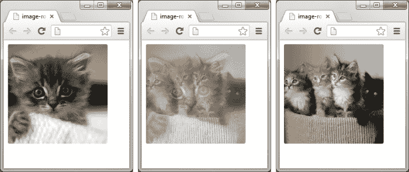
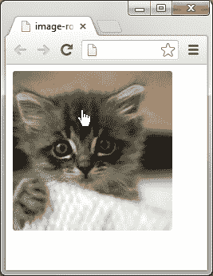
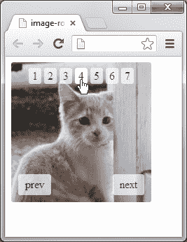

# 二、图像动画

*在本章中，我们将使用 jQuery 动画函数创建一个基本的图像旋转器（滑块）。我们还将扩展脚本的功能，以便在用户将鼠标悬停在旋转器上时暂停动画。然后，我们将在脚本中添加上一个和下一个链接，以允许用户以自己的速度滚动浏览我们的图像。最后，我们将添加一个分页链接，这样我们的用户就可以在图像旋转器中浏览图像。*

# 图像动画

在您的 jQuery 世界之旅中，您会发现某种形式的内容或图像旋转有时是必要的。图像旋转器是一种比在页面上直接显示图像更具视觉吸引力的方式。它们还可以带来更紧凑、更高效的设计，允许预加载内容或图像，还可以让我们能够控制用户看到的内容和时间。

### 注

基于不同的功能，图像旋转器通常被称为**幻灯片放映**、**滑块**、**滚动器**或**旋转木马**。

在本章中，我们将讨论以下动画方法：

*   `fadeIn()`
*   `fadeOut()`
*   `fadeToggle()`

# 淡出动画

`fadeIn()`和`fadeOut()`方法通过 jQuery 执行最简单的动画。它们只需调整所选元素的不透明度，以显示或隐藏该元素，无需额外配置即可使用。`fadeToggle()`方法几乎同样简单，但确实提供了一些基本逻辑来检查所选元素的当前状态。

在`fadeIn()`动画开始时，使用`display:none`隐藏的元素将被设置为正确的显示类型（块级元素为`display:block`或内联元素为`display:inline`。注意这一点很重要，因为 CSS 样式可能会影响正在淡入的元素的外观。元素的自然显示类型尽可能使用，因此隐藏的`<li>`元素设置为`display:list-item`，隐藏的`<td>`元素设置为`display:table-cell`。

设置为`display:block`（或设置为其他显示类型但在页面上仍然可见）的元素将在`fadeOut()`动画结束时设置为`display:none`。使用`fadeToggle()`方法时，元件将在可见和不可见状态之间切换。

使用`fadeIn()`方法显示的元素最初必须使用`display:none`隐藏，而使用`visibility:hidden`隐藏的元素（例如）将在动画结束时保持隐藏，因为淡入淡出方法专门改变`opacity`和`display`属性，而不是`visibility`属性。

在最简单的形式中，这些方法可以在没有任何额外配置的情况下使用。我们可以简单地调用任何选定元素集合上的方法，而无需使用任何参数：

*   `$(elements).fadeIn();`
*   `$(elements).fadeOut();`
*   `$(elements).fadeToggle();`

如果未提供参数，动画的默认持续时间为 400 毫秒，默认放松时间为`swing`。我们将很快讨论动画缓和。

# 使用参数配置动画

对于参数，衰减方法可以采用以下形式（方括号表示可选参数）：

```js
$(elements).fadeIn([duration] [,easing] [,callback]);
$(elements).fadeOut([duration] [,easing] [,callback]);
$(elements).fadeToggle([duration] [,easing] [,callback]);
```

我们可以使用`duration`参数来控制动画的持续时间，以毫秒为单位指定整数或字符串`"slow"`和`"fast"`。这些字符串分别是 600 毫秒和 200 毫秒的快捷键。如果未指定，则给定的默认持续时间为 400。

我们还可以提供`0`作为`duration`参数，这将有效地禁用动画。我们不太可能需要这样做，因为根本不使用动画会更有效，但知道这一点很有用。我应该指出，衰退仍然会发生；它只会在 0 毫秒的持续时间内发生。这样做与使用`.hide()`基本相同。

easing 参数可以从其默认值`swing`更改为`linear`，这会导致动画在整个动画中以相同的速度进行。默认设置为`swing`，会导致动画缓慢启动，稍微加速，然后在动画结束时减速。

### 提示

`duration`参数与动画运行的时间长度有关，而与动画的速度无关。因此，值越高，动画越慢、越长，而不是越快、越短。使用插件可以大大增加缓解类型的数量。我们将在本书的后面介绍 jQueryUI 添加的额外宽松类型。

我们可以提供一个**回调**函数（函数引用或匿名函数，后者更常见）。该回调函数将在选择中的每个元素的动画结束后执行，因此，如果正在为多个元素设置动画，则可能会多次触发该回调函数。

### 注

回调函数是作为参数在另一个函数中传递的函数。

以下回调代码示例在动画完成后触发警报（以粗体显示回调）：

```js
$(".selector").fadeOut("slow", function() { alert("callback triggered!"); });
```

为了便于阅读，您经常会看到前一行的格式与以下代码块类似：

```js
$(".selector").fadeOut("slow", function() {
  alert("callback triggered!");
});
```

# 行动时间-设置标记和样式

首先，我们需要创建将在示例中使用的元素和样式，以设置它们的视觉外观。

1.  使用我们在[第 1 章](01.html "Chapter 1. Getting Started")、*入门*中创建的模板文件创建一个新的 HTML 文档，并在`<body>`标记之间为图像滑块添加以下底层标记：

    ```js
    <div class="container">
      <div id="slider">
        
        
        
        
        
        
        
      </div>
    </div>
    ```

2.  将`jquery-animation`目录中的页面另存为`image-rotator.html`。
3.  对于这个例子，我们还需要在样式表中添加。在我们刚刚创建的 HTML 文件中，将`image-rotator`添加到占位符样式表链接中。
4.  接下来，我们应该创建刚刚链接到的样式表。在新文件中，添加以下代码：

    ```js
    .container {
      position:relative;
      width:200px;
      height:200px;
    }
    #slider img {
      position:absolute;
      display:none;
      border-radius:3px;
    }
    ```

5.  将此文件另存为我们项目文件夹中的`css`文件夹中的`image-rotator.css`。

## *刚才发生了什么事？*

在本例中，我们将在图像旋转器中使用七个图像。根据我们的需要，只需在`<div id="slider">`中添加额外的图像，就可以很容易地改变这一点。

我们将`#slider`元素包装在一个`<div>`元素中，该元素的类为`container`，这样我们可以设置图像旋转器的尺寸，以防所有图像的宽度和高度都不相同。此外，我们将`position:relative`设置为`#slider`div，这样设置为`position:absolute`的旋转器图像不会从页面流中删除。

### 注

当一个元素被设置为`position:absolute`时，该元素将不再保持其所在的开放空间，从而根据周围元素上使用的其他 CSS，允许其他元素在其后面或前面。这类似于浮动元素并将其从页面流中移除时发生的情况。

需要注意的是，在某些情况下，如果将一个元素（或一组元素）设置为`position:absolute`，而没有将父元素设置为`position:relative`，则元素可能会从其父元素中出来，这将折叠父元素。

图像被设置为`position:absolute`，因为它们需要相互堆叠，这样图像旋转器元素就不会在图像淡入淡出时四处跳跃。这是必需的，因为所有图像将占据页面上相同的相对位置。然而，我们一次只想显示一幅图像。使用`display:none`将关闭所有图像的可见性。这是必要的，这样我们就不必担心图像的**堆叠顺序**。我们希望在图片上有一个好的展示，所以我们在图片上添加了一个小的`border-radius`来软化角落。

### 注

**堆叠顺序**指元素在页面上堆叠的顺序。如果一个元素在另一个元素之前加载，它将在下一个元素之前加载。可以使用`z-index`在 CSS 中修改堆栈顺序，并将`position`添加到元素中。

## 突击测验–使用 fadeIn（）

问题 1。哪些字符串可以作为第一个参数传递到`fadeIn()`方法？

1.  字符串`"short"`或`"long"`，表示动画的持续时间。
2.  字符串`"low"`或`"high"`，表示元素淡入的不透明度。
3.  字符串`"slow"`或`"fast"`，表示动画的持续时间。
4.  一个十六进制字符串，指定元素的`background-color`

问题 2。还有什么可以传递到方法中？

1.  一个字符串，指定用于动画的缓和函数，以及动画结束后执行的回调函数。
2.  包含其他配置选项的对象。
3.  包含其他配置选项的数组。
4.  在动画开始时执行的回调函数，以及在动画结束时执行的回调函数。

## 为图像滑块编写脚本

接下来，我们将通过添加 jQuery 代码为图像旋转器添加最后的润色，该代码将为图像设置动画。

# 行动时间-编写图像旋转器脚本

现在，让我们为脚本添加代码，该脚本将为我们的图像设置动画。在`<body>`标记下方的匿名函数中添加以下代码：

```js
var image = $("#slider img");
var numSlides = image.length;
var activeSlide = 0;
var speed = 2000;
var fade = 1000;
var timer = setInterval(rotate, speed);
image.eq(activeSlide).show();

function rotate() {
  activeSlide++;

  if (activeSlide == numSlides) {
    activeSlide = 0;
  }

  image.not(activeSlide).fadeOut(fade);
  image.eq(activeSlide).fadeIn(fade);
}
```

## *刚才发生了什么事？*

我们做的第一件事是缓存对位于`#slider`元素内部的所有``元素的引用。我们将多次引用它，因此只从**文档对象模型**（**DOM**】中选择一次更有效。出于性能原因，通常最好尽量减少执行的 DOM 操作的数量。

我们使用`length()`来计算图像的数量。这计算父元素（`#slider`内的子元素（``的数量）。在我们的示例中，我们使用了七幅图像。使用`length()`函数计算``元素的数量，我们可以轻松地从图像滑块添加或删除图像，而无需更改 jQuery 代码。

我们的`activeSlide`变量被设置为`0`，以便我们从集合中的第一个图像开始。这通常是您不想更改的，除非您想从特定的图像开始。这个数字可以更改为您喜欢的任何数字，只要我们的图像集中至少有那个数量的图像。

`activeSlide`变量表示我们刚刚选择的元素组中的位置。`length()`函数返回从`0`开始的元素数。在我们的示例中，`image.length()`将返回`6`，因此`activeSlide`可以是`0`到`6`，因为有七个``元素。我们将`activeSlide`初始化为`0`，因此我们从序列中的第一个图像开始。如果我们想从另一个图像开始，请将`activeSlide`初始化到组中的该位置，记住第一个位置是`0`而不是`1`。

为了设置每次执行`rotate()`函数之间的时间，我们将`speed`变量设置为`2000`毫秒（2 秒）。对于我们的示例，2 秒是一个很好的速度，但您需要根据旋转的图像将其设置为更长的持续时间。如果您希望用户阅读图像上的文本，则应根据您认为用户阅读所有文本所需的时间设置旋转速度。如果你有高细节的图片，把速度设置为你认为是一个慷慨的时间来拍摄所有细节。如果您有一个需要“行动呼吁”的可点击元素，则需要根据用户消化信息和采取您希望他们采取的行动所需的时间来考虑这一时间。

我们的`fade`变量设置为`1000`（1 秒），因为这是淡出图像的合适速度。这可以改变，以适应您的需要，你会发现，没有标准的时间为它或速度。您需要调整这些时间，为您的用户在您的网站上提供最佳体验。

`setInterval()`（本机 JavaScript 方法）函数在脚本中创建一个计时器，该计时器执行每个间隔调用的函数。在我们的示例中，`setInterval()`将执行`rotate()`函数，但等待再次调用它，直到`speed`变量中指定的时间量过去。由于`speed`设置为`2000`，所以`rotate()`功能每 2 秒执行一次。

### 提示

对于参数，`setInterval`事件可以采取以下形式：

`setInterval(function, duration);`

然后，我们告诉脚本使用`show()`显示活动图像。由于我们最初将`activeSlide`变量设置为`0`，因此我们集中的第一个图像将首先显示。这是必要的，因为如果您还记得，在我们的 CSS 中，我们使用`display:none`关闭旋转器中所有图像的可见性。如果更改`activeSlide`变量的初始值，则该图像将是脚本启动时显示的第一个图像。

接下来，我们继续讨论脚本的内容。对于我们的素食主义读者来说，无论你在饮食中吃什么蛋白质，大豆？豆腐无论如何，`rotate()`函数是我们在代码中完成大部分繁重工作的地方。`rotate()`功能上方的代码主要是图像旋转器的设置。在我们的 beefy`rotate()`函数中，我们有一个变量（`activeSlide`，每次调用它时，我们都会递增一。每次函数循环时，需要将活动图像设置为集合中的下一个图像。

`if`语句用于在脚本到达所选组中最后一个``元素后，将`activeSlide`编号重置回`0`。

最后，我们的代码中有两行最重要的代码（可以说）。我们正在使用`fadeOut()`动画功能处理`not()`活动图像的所有图像。然后我们将`fadeIn()`用于图像，它与`activeSlide`图像相等。您会注意到我们的`fadeOut()`和`fadeIn()`动画中的变量淡入淡出。这将确定动画的执行速度。与其他一些 jQuery 动画功能一起，还可以使用`"slow"`和`"fast"`，分别为 600 毫秒和 200 毫秒。

这是我们刚才用前面的代码创建的屏幕截图。你会注意到第一张图像是如何在下一张图像淡入的同时淡出的。这种效应称为**交叉衰落**。



## 突击测验-长度（）和毫秒

问题 1。`length()`指的是什么？

1.  变量的字符计数。
2.  对象中的元素数。
3.  对象的宽度。
4.  动画应运行的时间量。

问题 2。一秒钟有多少毫秒？

1.  10
2.  100
3.  1000
4.  10000

# 行动时间–延长悬停暂停功能

当您的图像有很多细节、用户需要阅读的文本或您希望他们执行的特定操作时，暂停悬停是必要的。即使您不需要任何这些东西，添加此功能仍然是一个好主意，因为如果用户愿意，它允许用户很好地查看图像。

以下屏幕截图说明当用户将鼠标悬停在图像上时，图像旋转已停止：



为了检测何时打开和关闭图像旋转器，以便暂停图像旋转器，我们需要在`image.eq(activeSlide).show();`下面的行中添加以下代码：

```js
$("#slider").hover(function() {
  clearInterval(timer);
}, function() {
  timer = setInterval(rotate, speed);
});
```

## *刚才发生了什么事？*

我们为添加了一个悬停事件，以便能够在悬停在`#slider`元素上以及离开该元素时告知脚本。我们在`timer`变量上使用`clearInterval()`（本机 JavaScript 方法）停止旋转器上的计时器，从而有效地暂停动画。

### 注

有关悬停事件的更多信息可在此处找到：[http://api.jquery.com/hover/](http://api.jquery.com/hover/)

需要注意的是，`stop()`和`clearQueue()`是停止动画或函数运行的其他方法。但是，在本例中，我们不想使用它们，因为它们会立即停止我们的动画。这可能意味着它将在动画进行到一半时暂停动画，并将显示两个（当前活动和下一个活动）图像，其中一个部分在另一个图像的顶部褪色。或者，我们可以让间隔运行，并在`rotate()`函数中使用一个标志来确定是执行`fadeIn()`还是`fadeOut()`方法。

下一行告诉脚本我们不再在其上悬停，并继续设置图像动画。然后使用`setInterval`（本机 JavaScript 方法）将计时器重置回我们最初设置的状态。

# 行动时间–扩展上一个和下一个链接功能

为了让您的用户能够更多地控制旋转图像的速度，我们将添加下一个和上一个链接，如以下步骤所示：

1.  我们需要添加锚定标签，用于上一个和下一个链接。为此，在最后两个`</div>`标记之间添加以下代码：

    ```js
    <a id="prev">prev</a>
    <a id="next">next</a>
    ```

2.  我们的下一个和上一个链接将需要一些基本样式，因此让我们在`image-rotator.css`文件的底部添加以下 CSS 行：

    ```js
    #prev, #next {
      position:absolute;
      bottom:10px;
      padding:5px 10px;
      color:#000;
      background:#FFF;
      border-radius:3px;
      text-decoration:none;
      opacity:0.7;
    }
    #prev:hover, #next:hover {
      opacity:1;
      cursor:pointer;
    }
    #prev {left:10px;}
    #next {right:10px;}
    ```

3.  为了处理下一个和上一个链接上的点击事件，我们需要在`rotate()`函数的正上方添加以下代码：

    ```js
    $("#prev").click(function(event) {
      activeSlide--;
      rotate();
      event.preventDefault();
    });

    $("#next").click(function(event) {
      activeSlide++;
      rotate();
      event.preventDefault();
    });
    ```

4.  在`image.not(activeSlide).fadeOut(fade);`上方增加以下代码行：

    ```js
    if (activeSlide < 0) {
      activeSlide = numSlides - 1;
    }
    ```

5.  通过将`activeSlide++`替换为以下代码更新`rotate()`功能：

    ```js
    if (!pause == true) {
      activeSlide++;
    }
    ```

6.  找到`hover()`功能并替换为以下代码（新代码高亮显示）：

    ```js
    $("#slider, #prev, #next").hover(function() {
      clearInterval(timer);
      pause = true;
    }, function() {
      timer = setInterval(rotate, speed);
      pause = false;
    });
    ```

以下屏幕截图显示，单击下一个链接后，图像旋转器将移动到下一个图像：


## *刚才发生了什么事？*

在第三步中，我们为上一个和下一个链接添加了两个单击函数。我们在上一个函数中将活动图像数减少 1，在下一个函数中将活动图像数增加 1。然后我们需要再次调用旋转函数，以便旧图像淡出，新图像淡入。我们使用`preventDefault()`（本机 JavaScript 方法），这样上一个和下一个链接就不会在地址栏中的 URL 中添加标签（**）。这将防止上一个和下一个链接像传统的锚标记一样工作。**

 **第四步允许我们在图像集中向后移动。此`if`语句类似于`rotate()`函数中已有的`if`语句，如果活动变量等于旋转器中的图像数，则用于重置活动变量。

我们需要更改`rotate()`函数，以便在图像旋转器未悬停的情况下，它只增加`active`图像变量。为此，我们用一个`if`语句替换了增加`activeSlide`变量的行。使用这个`if`语句，我们告诉脚本，如果用户没有悬停在图像旋转器上，则只允许`activeSlide`变量递增。

我们需要添加下一个和上一个指向暂停悬停功能的链接，这样当您将鼠标悬停在这些链接上时，图像旋转也会暂停。这可以通过在`#slider`之后添加逗号，并添加`#next`和`#previous`ID 选择器来实现。根据是否触发了`hover`事件，我们将`pause`变量设置为`true`或`false`的布尔值。如果我们不在`activeSlide`变量上悬停，则需要告诉`rotate`函数仅递增该变量。为了告诉我们的脚本，我们将变量`pause`设置为`true`的值。然后一旦光标离开图像旋转器，我们将其设置为`false`。

## 突击测验–preventDefault（）和 setInterval（）

问题 1。`preventDefault()`是用来做什么的？

1.  防止脚本在函数中默认变量。
2.  阻止对其使用的事件执行默认操作。
3.  关闭所用函数中的所有 JavaScript 错误。
4.  关闭返回 null 值的变量的 JavaScript 错误。

问题 2。`setInterval()`方法需要使用的两个参数是什么？

1.  `speed`和`time`
2.  `function`和`duration`
3.  `duration`和`speed`
4.  `speed`和`function`

# 行动时间–扩展分页功能

为了让我们的用户能够更好地控制图像旋转器，我们将添加所谓的**分页**。分页允许您直接移动到旋转器中的特定图像，而无需单击下一个和上一个链接，直到找到要查找的图像。如果图像旋转器中有大量图像，此函数非常有用。要添加分页，请执行以下步骤：

让我们首先在`image-rotator.css`中添加以下代码：

```js
#pagination {
  position:absolute;
  top:10px;
  width:100%;
  text-align:center;
}
#pagination a {
  padding:2px 5px;
  color:#000;
  background:#FFF;
  border-radius:3px;
  text-decoration:none;
  opacity:0.7;
}
#pagination a:hover {
  opacity:1;
  cursor:pointer;
}
```

1.  在`image-rotator.html`中，直接在`var pause;`下方添加以下行：

    ```js
    var paging = "";
    ```

2.  在我们的 HTML 中，我们需要在`<a id="next" href="#">next</a>`下添加以下代码：

    ```js
    <div id="pagination"></div>
    ```

3.  将以下代码置于`image.eq(activeSlide).show();`下方：

    ```js
    for (var page = 0; page < numSlides; page++) {
      paging += "<a rel=\"" + (page + 1) + "\">" + (page + 1) + "</a>\n";
    }
    $("#pagination").html(paging);
    ```

4.  找到下面的`hover`事件，并将其替换为以下代码（新代码突出显示）：

    ```js
    $("#slider, #prev, #next, #pagination").hover(function() {
      clearInterval(timer);
      pause = true;
    }, function() {
      timer = setInterval(rotate, speed);
      pause = false;
    });
    ```

5.  在我们的`rotate()`函数正上方添加以下代码：

    ```js
    $("#pagination a").click(function(event) {
      event.preventDefault();
      activeSlide = $(this).attr("rel") - 1;
      rotate();
    });
    ```

以下屏幕截图说明了我们添加的分页功能，以及单击相应链接后显示的第四幅图像：



## *刚才发生了什么事？*

我们做的第一件事是声明并设置新的分页变量。如果没有这一点，我们的代码中将出现严重的 JavaScript 错误。

使用`for`循环，我们定义了页面变量，告诉它继续循环，直到`page`小于集合中的图像数，然后使用`++`将新定义的变量增加 1。下一行是到目前为止我们脚本中最复杂的代码，请继续听我说！一个后跟`+=`的变量告诉该变量使用已存储的内容，并继续添加到末尾。这种将值或字符串串在一起的方法称为**串联**。

然后，我们需要构建分页链接的 HTML 结构。我们正在构建一个由七个`<a>`标签组成的系列，每个标签对应于我们组中的每个图像。要在链接上打印图像编号，我们将使用`(page + 1)`。我们之所以使用`+ 1`是因为 JavaScript 在所谓的**零索引**或**基于零的编号**上对事物进行编号，这意味着在对组或项目列表进行编号时不是从 1 开始，而是从 0 开始。到目前为止，这还不是一个问题（因为我们没有打印出值），但我们现在需要告诉脚本从 1 开始，以便它正确显示分页链接。`for`循环的最后一行替换`#pagination`的内容，并使用`html()`将其替换为`paging`变量中存储的值。

### 注

`html()`方法用于获取或设置所选元素上的 HTML 内容。

同样，我们需要扩展暂停悬停功能，以便在悬停在新的`#pagination`元素上时知道暂停。如果我们不这样做，当你在`#pagination`div 上方悬停时，图像将继续旋转。

我们添加了另一个点击功能（`$("#pagination a").click`）来处理分页链接。您会注意到我们之前使用的相同`preventDefault()`，这样我们的链接在单击分页链接时不会将标签（#）添加到页面 URL。下一行将`activeSlide`变量设置为分页锚标记中的`rel`值，然后减去 1。之所以这样做是因为我们将其设置为递增 1，以抵消我们在第三步中看到的零索引问题。

最后，我们添加了包含`<div>`元素，该元素将保存所有分页链接。

## 拥有一个 Go Hero–进一步扩展图像旋转器

在本例中，我们使用`fadeIn()`和`fadeOut()`旋转图像。尝试扩展示例，以便脚本可以检测应设置动画的子元素。

扩展图像旋转器的其他想法：

*   让脚本动态设置子元素维度，允许脚本缩放以适应内容
*   建立一次显示多个元素的能力
*   为分页栏中的当前活动链接提供不同的外观，以便用户知道旋转器当前在哪个图像上
*   添加其他过渡效果（例如，幻灯片）

## 突击测验-改变变量和零指数

问题 1。在变量之后使用`++`做什么？

1.  将两个变量的值合并在一起。
2.  告诉脚本只允许向变量添加而不允许减去。
3.  将变量递增 1。
4.  将变量增加 2。

问题 2。**零指数**是什么意思？

1.  JavaScript 从零开始计数。
2.  如果未明确定义，则变量的默认值为零。
3.  将元素的索引设置为零的一种方法。
4.  使用后将变量值设置为零的方法。

# 总结

在本章中，我们介绍了 jQuery 的一些最基本的动画方法。淡入淡出方法是 jQuery 中最简单的动画方法，仅为选定元素的不透明度设置动画。

`show()`、`hide()`和`toggle()`方法也可用于执行动画，但会改变元素的尺寸及其不透明度。所有这些方法都易于使用，只需很少或不需要额外配置即可运行。

在下一章中，我们将学习如何操纵元素的背景属性来创建背景动画。**