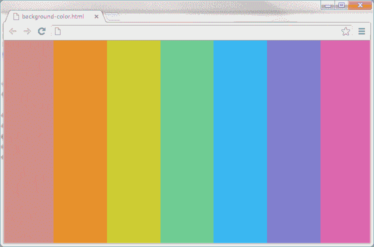
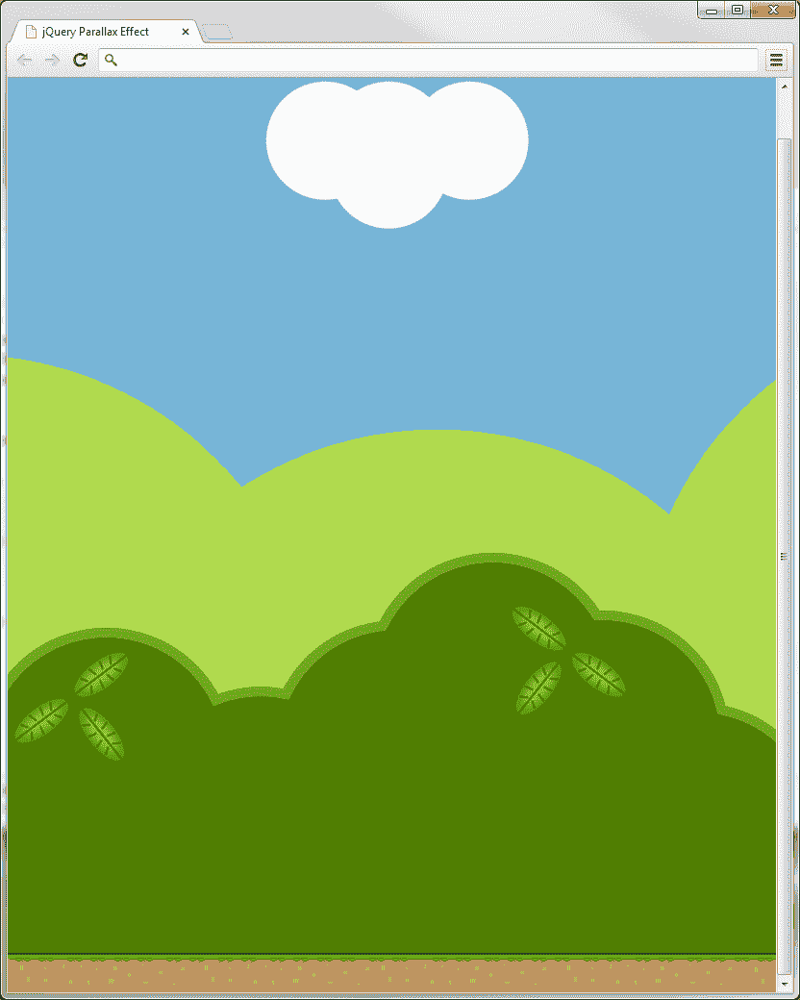
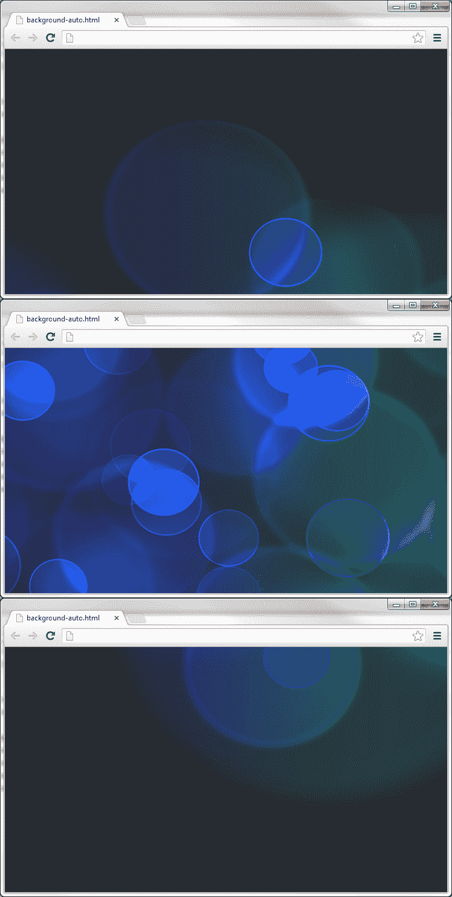
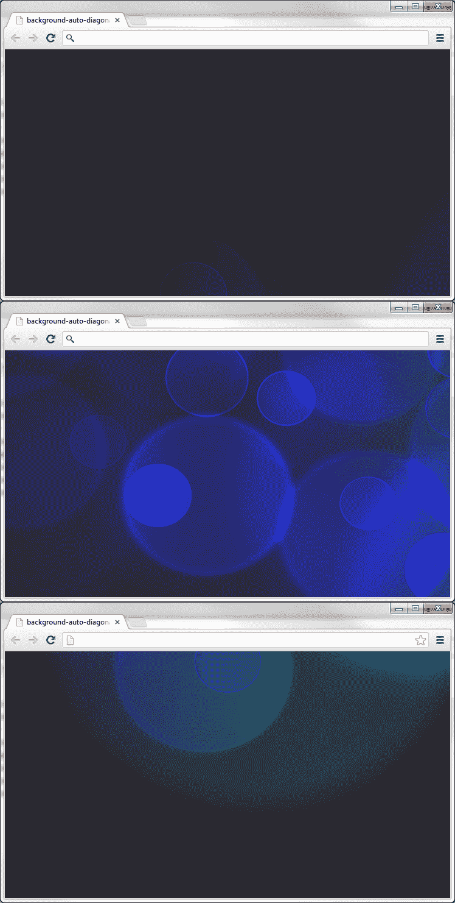
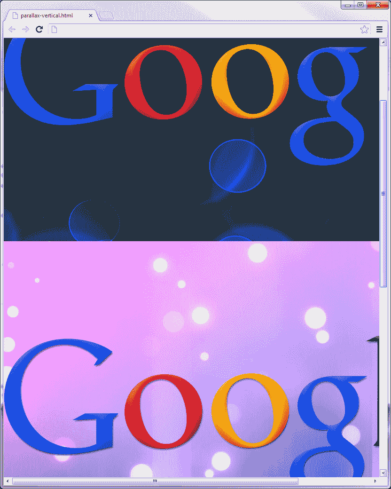

# 三、背景动画

*在上一章中，我们使用了`fadeIn()`和`fadeOut()`方法来制作图像元素的动画。在本章中，我们将使用`animate()`效果设置背景颜色的动画，并学习如何设置元素中背景图像位置的动画。在[第 7 章](07.html "Chapter 7. Custom Animations")*定制动画*中，我们将进一步深入了解`animate()`方法能够实现的一切。*

# 背景色动画

设置元素背景色的动画是将用户的眼睛吸引到我们希望他们看到的对象上的一种很好的方法。设置元素背景色动画的另一个用途是显示元素发生了什么。如果对象的状态发生变化（添加、移动、删除等），或者如果需要注意解决问题，通常会以这种方式使用它。我们将在接下来的两章中学习其中的一些内容。

### 注

由于 jQuery2.0 中缺乏对背景颜色动画的支持，我们将使用 jQueryUI 为我们提供创建这种效果所需的功能。

在[第 6 章](06.html "Chapter 6. Extended Animations with jQuery UI")*中，我们将介绍 jQueryUI 为我们提供的所有美妙功能，并用 jQueryUI*扩展动画。

## 介绍动画制作方法

`animate()`方法是 jQuery 在动画领域提供的最有用的方法之一。通过它，我们可以在页面上移动元素，或者改变颜色、背景、文本、字体、框模型、位置、显示、列表、表格、生成内容等属性并设置动画。

# 动作时间-设置身体背景色动画

按照下面的步骤，我们将首先创建一个更改`body`背景颜色的示例。

1.  首先创建一个名为`background-color.html`的新文件（使用我们的模板），并将其保存在`jquery-animation`文件夹中。
2.  Next, we'll need to include the jQuery UI library by adding this line directly under our jQuery library:

    ```js
    <script src="js/jquery-ui.min.js"></script>
    ```

    ### 注

    可从[下载 jQuery UI 的自定义或稳定版本 http://jqueryui.com](http://jqueryui.com) ，或者您可以使用下面三个**内容交付网络**（**CDN**）中的一个链接到库。要以最快的速度访问图书馆，请访问[http://jqueryui.com](http://jqueryui.com) ，滚动至最底部，查找**快速访问**部分。使用 jQueryUI 库 JS 文件可以很好地满足本章示例的需要。

    媒体模板：[http://code.jquery.com](http://code.jquery.com)

    谷歌：[http://developers.google.com/speed/libraries/devguide#jquery-ui](http://developers.google.com/speed/libraries/devguide#jquery-ui)

    微软：[http://asp.net/ajaxlibrary/cdn.ashx#jQuery_Releases_on_the_CDN_0](http://asp.net/ajaxlibrary/cdn.ashx#jQuery_Releases_on_the_CDN_0)

    CDNJS:[http://cdnjs.com/libraries/jquery](http://cdnjs.com/libraries/jquery)

3.  然后，我们将向匿名函数中添加以下 jQuery 代码：

    ```js
    var speed = 1500;
    $( "body" ).animate({ backgroundColor: "#D68A85" }, speed); 
    $( "body" ).animate({ backgroundColor: "#E7912D" }, speed);
    $( "body" ).animate({ backgroundColor: "#CECC33" }, speed);
    $( "body" ).animate({ backgroundColor: "#6FCD94" }, speed);
    $( "body" ).animate({ backgroundColor: "#3AB6F1" }, speed);
    $( "body" ).animate({ backgroundColor: "#8684D8" }, speed);
    $( "body" ).animate({ backgroundColor: "#DD67AE" }, speed);
    ```

## *刚才发生了什么事？*

首先，我们将 jQueryUI 库添加到页面中。这是必要的，因为当前版本的 jQuery 不支持背景颜色动画。接下来，我们添加了将为背景设置动画的代码。然后我们将`speed`变量设置为`1500`（毫秒），以便控制动画的持续时间。最后，使用`animate()`方法，我们设置 body 元素的背景颜色，并将持续时间设置为我们上面设置的变量`speed`。我们多次复制同一行，只改变背景色的十六进制值。

下面的屏幕截图是对整个身体背景颜色的动画颜色的说明：



## 将 jQuery 方法链接在一起

需要注意的是，jQuery 方法（`animate()`，在本例中是）可以链接在一起。如果我们将`animate()`方法链接在一起，前面提到的代码将如下所示：

```js
$("body")
  .animate({ backgroundColor: "#D68A85" }, speed)  //red
  .animate({ backgroundColor: "#E7912D" }, speed)  //orange
  .animate({ backgroundColor: "#CECC33" }, speed)  //yellow
  .animate({ backgroundColor: "#6FCD94" }, speed)  //green
  .animate({ backgroundColor: "#3AB6F1" }, speed)  //blue
  .animate({ backgroundColor: "#8684D8" }, speed)  //purple
  .animate({ backgroundColor: "#DD67AE" }, speed); //pink
```

下面是将方法链接在一起的另一个示例：

`$(selector).animate(properties).animate(properties).animate(properties);`

## 有一个围棋英雄——通过循环扩展我们的脚本

在本例中，我们使用了`animate()`方法，在 jQueryUI 的帮助下，我们能够为页面的主体背景颜色设置动画。尝试扩展脚本以使用循环，以便在脚本到达函数末尾时，颜色不停止地连续动画。

## 突击测验–使用 animate（）方法链接

问题 1。哪些代码可以使用链接正确地将我们的身体背景颜色从红色设置为蓝色？

1.  ```js
    $("body")
      .animate({ background: "red" }, "fast")
      .animate({ background: "blue" }, "fast");
    ```

2.  ```js
    $("body")
      .animate({ background-color: "red" }, "slow")
      .animate({ background-color: "blue" }, "slow");
    ```

3.  ```js
    $("body")
      .animate({ backgroundColor: "red" })
      .animate({ backgroundColor: "blue" });
    ```

4.  ```js
    $("body")
      .animate({ backgroundColor, "red" }, "slow")
      .animate({ backgroundColor, "blue" }, "slow");
    ```

# 视差深度错觉

在计算机图形学（尤其是视频游戏）中使用的术语视差指的是使用多个背景层以略微不同的速度滚动以产生深度错觉的技术。尽管在现代游戏中没有如此广泛地部署，但由于更丰富的 3D 图形引擎的出现，视差仍然在便携式游戏设备中频繁出现，并且越来越多地出现在网络上。

使用纯 CSS 可以实现视差效果，在 Silverback 网站上很好地演示了这一点（参见[http://silverbackapp.com](http://silverbackapp.com) 表示效果，[http://blog.teamtreehouse.com/how-to-recreate-silverbacks-parallax-effect](http://blog.teamtreehouse.com/how-to-recreate-silverbacks-parallax-effect) 了解如何实施的详细信息）。视差的应用只有在水平调整窗口大小时才会变得明显。当窗口调整大小时，这是一个奇妙的效果，但如果我们想让效果占据更多的中心舞台，这对没有帮助。

# 行动时间-创造舞台并添加造型

底层页面只需要四个元素（对于这个简单的示例），它们位于页面的`<body>`中。

1.  将以下结构中的元素添加到模板文件的新副本中，位于`<body>`标记和第一个`<script>`标记之间：

    ```js
    <div id="background"></div>
    <div id="midground"></div>
    <div id="foreground"></div>
    <div id="ground"></div>
    ```

2.  将此页面另存为我们的`jquery-animation`文件夹中的`parallax-horizontal.html`。
3.  本例中的 CSS 与底层 HTML 一样简单。将以下代码添加到文本编辑器中的新文件中：

    ```js
    div {
      width:100%;
      height:1000px;
      position:absolute;
      left:0;
      top:0;
    }
    #background { background:url(img/background.png) repeat-x 0 0; }
    #midground { background:url(img/midground.png) repeat-x 0 0; }
    #foreground { background:url(img/foreground.png) repeat-x 0 0; }
    #stage { background:url(img/ground.png) repeat-x 0 100%; }
    ```

4.  将此文件保存为`css`目录中的`parallax-``horizontal.css`，并更新我们刚刚创建的链接到此文件的 HTML 文件。
5.  此时，页面应如以下屏幕截图所示：



前面的区域是地面，前景层是颜色较深的灌木丛，中间层是颜色较浅的灌木丛，背景层是天空和云。

## *刚才发生了什么事？*

您还可以在本书附带的代码下载的 images 文件夹中找到本例的图片。对于我们希望成为视差效果一部分的每个元素，我们有一个单独的图像，在本例中有三个，一个用于背景，一个用于中间，一个用于前景。

底层 HTML 也非常简单。我们只需要为每一层背景设置一个单独的`<div>`。在 CSS 中，每个图像层的位置都是绝对的，以便它们相互覆盖。现在，让我们移动视差的层！

# 动作时间-设置背景位置动画

现在，对于`<script>`本身。在 HTML 文件的底部，像在空匿名函数中一样，添加以下代码：

```js
var bg = $("#background");
var mg = $("#midground");
var fg = $("#foreground");

$(document).keydown(function(e) {
  if (e.which === 39) { //right arrow key
    bg.animate({ backgroundPosition: "-=1px" }, 0, "linear" );
    mg.animate({ backgroundPosition: "-=10px" }, 0, "linear" );
    fg.animate({ backgroundPosition: "-=20px" }, 0, "linear" );
  }
});
```

如果我们现在在浏览器中运行此页面，我们会发现，当我们按住向右箭头键时，不同的背景图像切片以相对较慢的速度移动，前景几乎会快速通过，背景会缓慢移动。

## *刚才发生了什么事？*

在脚本中，我们首先缓存将要使用的选择器，这样我们就不必在每次`background-position`更改时创建新的 jQuery 对象并从 DOM 中选择元素，这将非常频繁。然后我们在 document 对象上设置一个`keydown`事件侦听器。在我们用作事件处理程序的匿名函数中，我们检查事件对象的`which`属性提供的键代码（这由 jQuery 规范化，因此可以通过跨浏览器访问）是否等于`39`，这是右箭头键返回的键代码。

然后我们在`backgroundPosition`上调用`animate()`，并提供`-=1px`、`-=10px`和`-=20px`的相对值，以逐渐加快的速度移动每一层，从而产生视差效应。同时调用这些动画，并将其持续时间设置为零（0）毫秒和`linear`秒。这是我们的`keydown`处理程序最不需要做的事情。

## 有一个英雄式的视差

在本例中，背景仅从右向左设置动画。扩展该示例，使“从左到右”和“从右到左”运动都可用。需要帮助开始吗？您需要为左箭头键创建另一个函数，并递增`backgroundPostion`值，而不是像我们在示例中那样递减。

# 自动背景动画

在本例中，我们将使背景图像自动为页面设置动画，而无需用户进行任何特殊交互。

# 行动时间-创建自动背景动画

我们将创建一个示例，它将自动设置背景图像的动画。

1.  使用名为`background-auto.html`的模板创建一个新文件，并将其保存在`jquery-animation`目录中。
2.  因为我们的示例只有一行 CSS，所以我们不打算创建样式表。我们将把它放在刚刚创建的文件（`background-auto.html`中，`<title>`标记下：

    ```js
    <style>
      body {background:url(images/background.jpg) top center fixed;}
    </style>
    ```

3.  接下来，我们将删除样式表`<link>`，因为在本例中不使用它。这将是我们刚刚添加的代码后面的一行。
4.  最后，在我们的等待匿名函数中添加以下代码：

    ```js
    var yPos = 0;
    var timer = setInterval(start, 50);

    function start() {
        yPos = yPos - 5;
        $('body').css({ backgroundPosition: '50% ' + yPos + 'px' });
    }
    ```

下面是我们刚刚创建的屏幕截图。您会注意到，在查看示例时，背景图像会从下至上设置背面的动画。



## *刚才发生了什么事？*

我们做的第一件事是将变量`yPos`声明为整数。您可能知道，这样做可以吓跑任何困扰 Internet Explorer 和类似的非现代浏览器版本的可怕 JavaScript 错误。

接下来，我们使用`setInterval()`声明了我们的`timer`变量。在上一章中，我们了解到该方法的参数为`function`和`duration`。我们的函数名是`start`，所以我们将`function`参数设置为该值。我们还将`duration`设置为`50`（毫秒），因为这是一个合适的时间框架，以便我们的函数在再次执行之前等待。

然后，我们创建了一个名为`start`的计时器可以调用的函数。每次执行函数时，我们取当前值`yPos`并减去 5。我们的最后一行功能是完成所有的繁重工作。在我们的脚本中，每当函数到达这一行时，这一行会使`<body>`背景图像的位置垂直设置五个像素的动画。

## 有一个围棋英雄——在引擎盖下玩

尝试更改`timer`持续时间和`yPos`偏移值，看看这些值如何影响背景动画的速度和帧速率。另一个挑战是尝试使背景动画水平而不是垂直，就像我们在本例中所做的那样。

# 让我们把它做成对角线！

现在，我们不是让背景图像垂直设置动画，而是将其设置为对角线。抓紧你的编程帽！

# 动作时间-对角设置背景动画

我们现在要让我们的动画沿对角线移动。

1.  让我们使用与之前相同的文件（`background-auto.html`，并用下面的代码替换匿名函数中的代码（新代码突出显示）：

    ```js
    var xPos = 0;
    var yPos = 0;
    var timer = setInterval(start, 50);

    function start() {
     xPos = xPos - 5;
        yPos = yPos - 5;
     $('body').css({ backgroundPosition: xPos +
     'px ' +  yPos + 'px' });
    }
    ```

2.  Save this file as `background-auto-diagonal.html`, and view it in your web browser.

    预览动画应如下所示：

    

## *刚才发生了什么事？*

使用相同的代码，我们对它进行了一点升级，使我们能够在背景位置的 Y 坐标之外同时设置 X 坐标的动画。增加了变量`xPos`来控制左右水平位置，也增加了`backgroundPostion`行。

## 做个英雄吧

在前面提到的示例中，我们将背景图像设置为动画。尝试使背景动画向东北、东南和西南移动。此外，尝试使用不同的偏移量值为`xPos`和`yPos`设置不同的，以查看它如何影响背景图像动画方向。

# 页面元素上的视差背景

我们的下一个示例将向您展示如何基于窗口滚动的交互设置元素背景位置的动画。根据您的浏览器中滚动的平滑程度以及鼠标滚轮的平滑程度，很难看到此动画。如果你看不到平滑的滚动效果，只需抓住浏览器上的滚动条，缓慢地上下移动，就能更清楚地看到效果。您会注意到背景位置的移动速度比页面上的元素慢。

# 行动时间-设置标记和样式

首先，我们需要将必要的 HTML 和 CSS 添加到新文档中。

1.  使用与之前相同的模板创建一个新的 HTML 页面，并在`<body>`中插入以下代码：

    ```js
    <div class="row row1">
      
    </div>

    <div class="row row2">
      
    </div>

    <div class="row row3">
      
    </div>
    ```

2.  将`jquery-animation`目录中的页面另存为`parallax-vertical.html`。
3.  接下来，我们应该创建刚刚链接到的样式表。在新文件中，添加以下代码：

    ```js
    html, body {
        margin:0;
        padding:0;
    }
    img {
        display:block;
        width:1000px;
        margin:0 auto;
        padding-top:200px;
    }
    .row { height:700px; }
    .row1 { background:url(images/background1.jpg) repeat-x top center fixed;}
    .row2 { background:url(images/background2.jpg) repeat-x top center fixed;}
    .row3 { background:url(images/background3.jpg) repeat-x top center fixed;}
    ```

4.  将此文件另存为我们的`project`文件夹中的`css`文件夹中的`parallax-vertical.css`。

## *刚才发生了什么事？*

首先，我们为示例添加了 HTML 结构。这由三行组成，每行仅包含一个图像。CSS 也非常简单。我们首先移除`html`和`body`元素周围的所有空间。然后，我们设置图像的宽度和位置。然后我们将行的高度设置为给我们一点空间，以便能够看到效果。在野外，这通常由元素的内容隔开。最后，我们在每一行上设置了一个背景图像，这样我们可以在示例中看到一些变化。

# 行动时间-编写我们的视差脚本

现在，让我们添加代码，当我们向下滚动页面时，将使背景动画化。

1.  将以下代码添加到我们的匿名函数中，这样我们就可以启动并运行此脚本：

    ```js
    $(window).scroll(function() {
        var yPos = -($(window).scrollTop() / 2);
        $(".row").css({ backgroundPosition: "50% " + yPos + "px" });
    });
    ```

以下是在浏览器中预览脚本时脚本如何工作的屏幕截图：



## *刚才发生了什么事？*

我们在这里使用了窗口滚动功能，因为我们想在用户每次使用鼠标滚轮或浏览器滚动条滚动窗口时触发代码。

我们的变量`yPos`被设置为负值，因为我们希望背景动画与正在滚动的页面元素的移动方向相同。使用`scrollTop()`可以得到`window`当前垂直滚动条的位置。然后我们把这个数字除以二。

我们使用`css()`方法设置我们的背景位置。值`50%`代表 x 轴，x 轴是我们浏览器的水平轴。这告诉我们的背景图像垂直居中。y 轴（本例中为`yPos`）设置为上述变量`yPos`，然后追加`px`以告知脚本该数字以像素为单位。`yPos`控制图像的水平放置，因此背景图像水平居中。

## 拥有一个围棋英雄——定制效果的速度和方向

尝试更改数字`yPos`除以的值，然后尝试将负数更改为正数。更改这些值会影响背景位置滚动的速度和方向。

## 突击测验–scroll（）和 scrollTop（）方法

问题 1。`scroll()`方法的作用是什么？

1.  滚动到集合中的下一个同级元素
2.  允许您平滑滚动到页面上的元素或数值（以像素为单位）
3.  允许每次滚动所选元素时运行代码
4.  当设置为`false`时，启用页面上禁用的滚动

问题 2。`scrollTop()`方法的作用是什么？

1.  跳回页面顶部
2.  输出所选元素的当前滚动位置
3.  与`click()`方法一起使用时，允许您滚动到元素的顶部
4.  设置选定元素的动画，使其像一张纸一样卷起

# 总结

在本章中，我们看了几个在元素上设置背景图像动画的示例。我们学到的一些东西是：

*   `animate()`方法和我们可以用它实现的一些伟大的事情
*   使用 jqueryui 为脚本提供彩色动画支持
*   元素上背景色之间的褪色
*   将 jQuery 方法链接在一起
*   视差动画，其中背景层以不同的速度和方向设置动画，以创建深度错觉
*   创建自动背景图像动画以及如何使其在不同方向上动画化
*   `scroll()`和`scrollTop()`方法

在下一章中，我们将介绍导航动画，以及如何为这个常见的网站功能带来活力。我们将创建一个单页滚动脚本，根据单击的链接跳转到页面中的各个部分。此外，我们还将研究如何更改元素的背景色，以引起对该站点区域的关注。