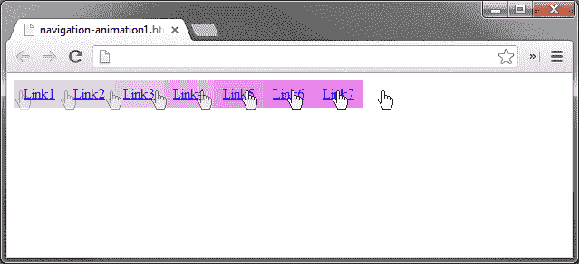
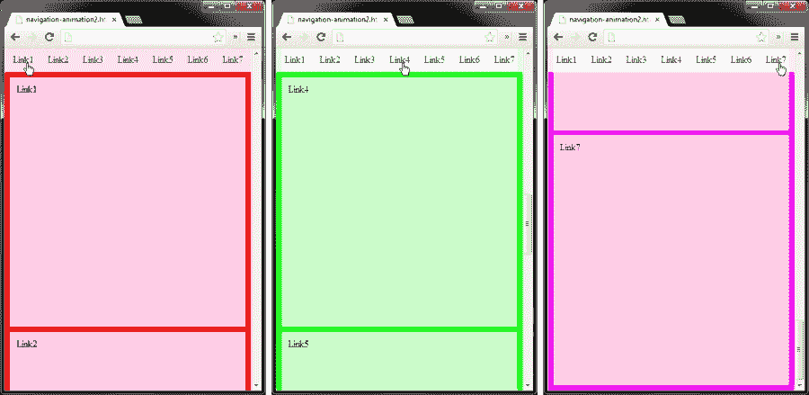

# 四、导航动画

*在本章中，我们将介绍一些导航动画方法。导航允许我们的用户移动到我们网站的不同页面。为这个常见的网站功能添加一点动画将使我们的网络项目更加有趣。辣是好的！*

以下是我们将在本章中学习的内容：

*   当鼠标指针进入和离开元素时，向元素添加和删除 CSS 类
*   使用`animate()`方法更改悬停元素的样式，并指定持续时间
*   学习如何将窗口平滑滚动到页面元素
*   我们将制作一个例子，当点击链接时，平滑地滚动并更改页面背景颜色。设想

# 创建简单的导航动画

首先，当我们将鼠标悬停在锚定标记（`<a>`上时，只需更改锚定标记上的背景颜色即可。这是最简单的导航动画形式，因此这是一个很好的起点。我们将通过向元素添加一个类来更改背景色。这将很容易让我们在需要时为类构建更多样式。

### 注

在本章中，我们将再次使用 jQueryUI 来弥补 jQuery2.0 中对彩色动画的支持不足。请参阅上一章中关于 jQueryUI 库的下载位置。

## 配置 addClass（）和 removeClass（）

`addClass()`和`removeClass()`的语法可能如下所示（方括号表示可选参数）：

```js
$(selector).addClass( className [,duration] [,easing] [,complete] );
$(selector).removeClass( className [,duration] [,easing] [,complete] );
```

### 注

需要注意的是，`duration`不是`addClass()`或`removeClass()`上的 jQuery 选项。此选项由 jQuery UI 添加，称为方法覆盖。

# 行动时间-设置我们的导航

让我们通过执行以下步骤来创建我们的导航结构和基本动画：

1.  首先，我们将根据第一章中的模板文件创建一个新文档，将其命名为`navigation-animation1.html`并保存在`jquery-animation`目录中。
2.  接下来，我们需要在 jQuery 库之后添加 jQuery UI 库，方法是添加以下行：

    ```js
    <script src="js/jquery-ui.min.js"></script>
    ```

3.  然后，我们将在新创建的文档中的`<body>`标记下添加以下 HTML 代码：

    ```js
    <nav>
      <a href="#">Link1</a>
      <a href="#">Link2</a>
      <a href="#">Link3</a>
      <a href="#">Link4</a>
      <a href="#">Link5</a>
      <a href="#">Link6</a>
      <a href="#">Link7</a>
    </nav>
    ```

4.  将以下代码保存到文件`navigation-animation1.css`并将其链接到我们的 HTML 文档：

    ```js
    nav a {
      display:block;
      float:left;
      padding:5px 10px;
      background:#DDD;
    }
    nav a.hover {background:#F0F;}
    ```

5.  将此代码添加到我们的空匿名函数中，这样我们就可以移动我们的脚本：

    ```js
    $("nav a").hover(function(){
      $(this).addClass("hover", 300);
    }, function(){
      $(this).removeClass("hover", 300);
    });
    ```

## *刚才发生了什么事？*

我们使用`hover()`处理程序告诉导航链接当鼠标光标进入和离开元素时该做什么。我们还将持续时间设置为`300`（毫秒），因此`hover()`方法动画稍微延迟，为我们提供了想要的动画效果。

以下屏幕截图说明了通过将光标从第一个链接移动到最后一个链接，动画应该如何工作：



## 有一个英雄-扩展我们的悬停风格

试一试，看看在我们的`hover`课程中添加额外的样式可以实现什么样的效果。首先，尝试更改元素的`height`和`position`。

# 使用 stop（）方法

上一个示例是允许轻松更新样式的简单方法。你会注意到，如果你很快地将鼠标悬停在所有导航链接上，来回几次，然后停止，动画将继续，直到每个动画都播放完毕。这通常不是一个非常理想的效果，因此我们需要添加`stop()`方法，在下一个动画开始之前停止上一个动画。我们需要稍微调整一下代码，因为`addClass()`和`removeClass()`不能在动画队列中停止。为此，我们将使用`animate()`方法来停止动画。

# 行动时间–添加 stop（）方法

要在下一个动画开始之前停止动画，我们需要稍微修改代码。在`animate()`效应之前添加`stop()`是我们需要做的。

使用与之前的相同的文件（`navigation-animation1.html`，我们将使用以下代码更新匿名函数中的代码（新代码突出显示）：

```js
$("nav a").hover(function(){
  $(this).stop().animate({ backgroundColor:"#F0F" }, 300);
}, function(){
  $(this).stop().animate({ backgroundColor:"#DDD" }, 300);
});
```

## *刚才发生了什么事？*

您会注意到，如果现在将指针快速移动到导航链接上（来回移动光标），则上一个动画将在下一个动画开始之前停止。这是一个比前一个更优雅的动画。就像辣味一样，我们也喜欢优雅。

# 使用 scrollTop 设置窗口动画（）

在上一章中，我们学习了如何使用`scrollTop()`使`<body>`元素的背景图像以不同的方向和速度在页面上动画化。在下一个示例中，我们将使用`scrollTop()`通过平滑滚动页面上的一个元素来设置窗口的动画。

*平滑滚动*动画方法可用于直观地向用户指示，我们的窗口位置已根据用户在页面上所做的操作而改变，通常是在鼠标单击某个元素之后。这种动画方法通常在我们将构建它时使用，被称为*单页机*。

# 行动时间-编写平滑滚动动画脚本

在以下步骤中，我们将创建平滑滚动的单页动画，该动画将在页面内容的不同部分设置动画：

1.  首先，让我们使用模板`smooth-scrolling.html`创建一个新文件，然后将其保存在`jquery-animation`文件夹中。
2.  其次，我们将再次添加 jQuery UI 库，在 jQuery 库的正下方插入以下代码（新代码已突出显示）：

    ```js
    <script src="js/jquery.js"></script>
    <script src="js/jquery-ui.min.js"></script>

    ```

3.  接下来，我们需要将以下 CSS 代码添加到一个名为`smooth-scrolling.css`的新文件中，并将其链接到`smooth-scrolling.html`：

    ```js
    body, html {
      margin:0;
      padding:0;
    }
    body {background:#CCC;}
    nav {
      width:100%;
      position:fixed;
      top:0;
      padding:10px 0;
      text-align:center;
      outline:1px dotted #FFF;
      background:#EEE;
      background-color:rgba(255, 255, 255, 0.9);
    }
    nav a {
      color:#222;
      margin:0 10px;
      text-decoration:none;
    }
    content {margin-top:50px;}
    content div {
      height:400px;
      margin:10px;
      padding:10px;
      outline:1px solid #FFF;
      background:#EEE;
      background-color:rgba(255, 255, 255, 0.8);
    }
    ```

4.  然后，我们将在`<body>`标记下添加以下 HTML 代码：

    ```js
    <nav>
      <a href="#link1">Link1</a>
      <a href="#link2">Link2</a>
      <a href="#link3">Link3</a>
      <a href="#link4">Link4</a>
      <a href="#link5">Link5</a>
      <a href="#link6">Link6</a>
      <a href="#link7">Link7</a>
    </nav>

    <div class="content">
      <div id="link1">Link1</div>
      <div id="link2">Link2</div>
      <div id="link3">Link3</div>
      <div id="link4">Link4</div>
      <div id="link5">Link5</div>
      <div id="link6">Link6</div>
      <div id="link7">Link7</div>
    </div>
    ```

5.  最后，将以下添加到我们的匿名函数中：

    ```js
    $("a[href^='#']").click(function(e){
      var pos = $(this.hash).offset().top - 50;
      $("body, html").stop().animate({ scrollTop:pos }, 1000);
      e.preventDefault();
    });
    ```

## *刚才发生了什么事？*

我们使用带有复杂选择器的`click()`处理程序。我们使用的选择器的意思是：选择所有锚定标签（`<a>`），其`href`属性以（`^`一个磅符号（`#`）开头。

我们的选择器将是本例中的`<body>`标记，我们使用`animate()`方法来处理我们的脏活。再次使用`stop()`方法，以便在下一个动画开始之前停止上一个动画。我们正在使用`offset().top`设置一个名为`pos`的新变量，以保持页面顶部点击链接（`<a>`的位置。另外，我们从`pos`变量中减去`50`作为偏移量，因为我们希望`content`元素的顶部正好落在导航栏下方。我们将动画的持续时间设置为`1000`毫秒，因为我们希望动画从页面上的当前位置跳到下一个位置需要 1 秒。

# 平滑滚动和页面背景色

现在，让我们将上面学习的两种动画方法合并为一种。本例将使用平滑滚动方法跳转到链接元素，同时更改页面背景色。

以下屏幕截图显示了在我们的导航栏中单击相应链接后的停止点：



# 行动时间-创造超级动画

要将前面的两个示例合并在一起，我们需要创建一个新文件，并将来自两个示例的 CSS 和 jQuery 代码混合在一起。当然，我们需要做一些调整，以使它们能够协同工作。

1.  使用文件模板创建一个名为`navigation-animation2.html`的新文档，并将其保存在我们的`jquery-animation`文件夹下。
2.  然后，将以下 CSS 代码放入一个名为`navigation-animation2.css`的新文件中，并将其链接到我们刚刚创建的 HTML 文档中：

    ```js
    body, html {
      margin:0;
      padding:0;
    }
    body {background:#F00;}
    nav {
      width:100%;
      position:fixed;
      top:0;
      padding:10px 0;
      text-align:center;
      outline:1px solid #FFF;
      background:#EEE;
      background-color:rgba(255, 255, 255, 0.5);
    }
    nav a {
      color:#222;
      margin:0 10px;
      text-decoration:none;
    }
    content {margin-top:50px;}
    content div {
      height:400px;
      margin:10px;
      padding:10px;
      outline:1px solid #FFF;
      background:#EEE;
      background-color:rgba(255, 255, 255, 0.8);
    }
    ```

3.  最后，我们需要在我们的匿名函数中放置以下代码：

    ```js
    $("a[href^='#']").click(function(e){
      e.preventDefault();
      var link = $(this).index() + 1;
      var background = "";    

      if (link == 1) {
        background = "#F00"        //red
      } else if (link == 2) {
        background = "#FF5000"     //orange
      } else if (link == 3) {
        background = "#FF0"        //yellow
      } else if (link == 4) {
        background = "#0F0"        //green
      } else if (link == 5) {
        background = "#0FF"        //light blue
      } else if (link == 6) {
        background = "#00F"        //dark blue
      } else if (link == 7) {
        background = "#F0F"        //fuschia
      }

      var pos = $(this.hash).offset().top - 50;
      $("body, html").stop().animate({ scrollTop:pos, backgroundColor:background }, 1000);
    });
    ```

## *刚才发生了什么事？*

我们做的第一件事是添加一个新的`link`变量。这将保存用户单击的链接的索引值。我们将指数值增加了`1`，因为`index()`方法是以零为基础的，这是一个漫长的一天，所以我们不想在计算时从零开始。

`background`变量被声明用来抵御那些肮脏的 JavaScript 错误怪物，一如往常。我们创建了一个`if`语句来处理背景色的十六进制值。`background`变量被设置为点击的链接的颜色（我们定义的颜色）。

这个神奇的技巧的选择器将再次是`<body>`标记，因为我们都在页面上滚动到另一个位置，同时也在更改页面的背景色。这与之前的代码相同，只是这次我们添加了`backgroundColor`并从上面的 if 语句中设置值（背景）。

## 有一个围棋英雄——进一步扩展脚本

试着想想我们合并的动画示例中添加的一些功能。以下是一些让你行动起来的想法：

*   动态将内容`<div>`元素的高度更改为窗口的高度（别忘了添加窗口调整功能）
*   使用窗口滚动功能更改背景颜色，以便在手动向下滚动页面时，而不仅仅是单击链接时，背景颜色也会更改
*   点击链接或手动向下滚动页面，内容`<div>`元素进入视图后淡入淡出状态
*   自动滚动内容，无需点击链接

## 突击测验–^symbol 和 stop（）方法

问题 1。在我们的`<a>`选择器中，`^`符号是什么意思？

1.  意思是“平等”
2.  它的意思是“包含”
3.  意思是“从开始”
4.  它的意思是“以结束”

问题 2。`stop()`方法的作用是什么？

1.  它会停止选定元素上的动画队列
2.  它会停止加载页面
3.  它会停止页面上的所有动画
4.  它会停止动画运行，直到重新加载页面

# 总结

在本章中，我们学习了如何使用`addClass()`和`removeClass()`基于鼠标交互更改元素的样式，以及如何在 jQuery UI 的方法覆盖的帮助下控制添加和删除这些类的速度（持续时间）。

然后，我们学习了如何将窗口平滑地滚动到页面上的指定元素。后来，我们将两个示例合并到一个示例中，该示例将平滑地滚动窗口并淡出页面的背景色。在本章中，我们还发现了一只小狗。那是什么？你没找到小狗？你一定在什么地方漏掉了分号。

现在我们已经为导航元素添加了一些香料，我们将在下一章学习如何赋予表单输入一些生命。我们将在下一章学习的一些内容是表单验证动画，直观地更改表单以提醒用户提交时出现问题，以及如果我们需要用户修复其中一个条目，如何摇晃表单。