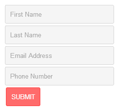

# 五、表单和输入动画

*在本章中，我们将使用 jQuery 查看表单动画的示例和概念。我们几乎可以使用任何动画类型来设置表单输入的动画（因为有一些怪癖和兼容性）。但是，请记住，很多动画都没有意义，或者会让我们的用户感到困惑，因此我们将避开这些动画。这些动画类型太“刺耳”了。例如，如果我们更改表单输入的维度，用户可能不知道这意味着什么。对于我们的第一个例子，我们将主要关注颜色变化。在本章后面，我们将使用 jQueryUI 提供更多动画支持，以真正让表单移动！*

在本章的示例中，我们将创建 HTML 表单，以便获得表单动画的视觉表示。对于这些示例，我们不会添加表单操作，因为我们不需要它们正确提交。

在本章中，我们将介绍以下主题：

*   当用户将鼠标光标移动到表单字段上时设置表单动画
*   在用户单击其中一个输入字段后更改输入字段的背景色
*   基于表单验证设置表单外观的动画

在本章中，我们将使用这些事件处理程序来移动表单元素：

*   `hover()`
*   `focus()`
*   `blur()`

# 使用简单的表单动画

表单动画可用于多种原因，尤其是当用户与表单交互时。更具体地说，当他或她的光标进入或离开表单元素（文本框）时，可以使用表单。动画对于指示表单验证错误也很有用。这些动画通常会在表单输入上有轻微的颜色变化，以便在填写表单时为用户提供更好的体验，并使流程更易于遵循。

### 注

在本章中，我们将再次使用 jQueryUI 来弥补 jQuery2.0 中对彩色动画的支持不足。请参考[第 3 章](03.html "Chapter 3. Background Animation")、*背景动画*，了解 jQuery UI 库的下载位置。

# 行动时间-创建表单

我们将使用以下步骤创建一个 HTML 表单。创建表单后，我们将添加表单验证动画。

1.  首先，使用我们的模板（来自[第 1 章](01.html "Chapter 1. Getting Started")、*入门*）创建一个名为`form-animation.html`的新文档，并将其保存在我们的`jquery-animation`文件夹中。
2.  然后我们将在`<body>`标记中放置以下代码：

    ```js
    <form id="form1">
      <input type="text" placeholder="First Name">
      <input type="text" placeholder="Last Name">
      <input type="text" placeholder="Email Address">
      <input type="text" placeholder="Phone Number">
      <input type="submit" value="Submit">
    </form>
    ```

3.  然后，我们需要在 jQuery 库之后添加 jQueryUI 库，方法是添加以下代码。（请参阅前面提到的关于从何处获取 jQuery UI 库的信息框）：

    ```js
    <script src="js/jquery-ui.min.js"></script>
    ```

4.  在我们的匿名函数中，添加以下代码：

    ```js
    $("input").hover(
      function() {
        $(this).addClass("hover", 500); 
      },
      function() {
        $(this).removeClass("hover", 500);
      }
    );

    $("input").focus(function() {
      $(this).addClass("focus", 500);
    });

    $("input").blur(function() {
      $(this).removeClass("focus", 500);
    });
    ```

5.  创建一个名为`form-animation.css`的新文件，保存在我们的`jquery-animation`文件夹下，添加以下代码：

    ```js
    form {
      float:left;
      margin:5px;
    }
    input {
      display:block;
      width:200px;
      padding:10px;
      border-radius:3px;
      background:#F5F5F5;
      border:1px solid #D5D5D5;
    }
    input[type=submit] {
      width:auto;
      border:0;
      color:#FFF;
      text-transform:uppercase;
    }
    input:focus {outline:0;}
    #form1 input[type=submit] {
      background:#FF6B6B;
      border:1px solid #FF3A3A;
    }
    ```

### 注

属性选择器（`input[type=submit]`）在传统版本的 Internet Explorer 中有点古怪。在使用选择器之前，请确保其受支持（或多填充）。

这里有一个 HTML5 跨浏览器多填充的列表：[https://github.com/Modernizr/Modernizr/wiki/HTML5-Cross-browser-Polyfills](https://github.com/Modernizr/Modernizr/wiki/HTML5-Cross-browser-Polyfills) 。

此时，我们的表单应如以下屏幕截图所示：



## *刚才发生了什么事？*

我们添加的第一部分代码是 HTML 框架结构，我们将在本章的代码示例中使用它。我们在表单上使用了一个 ID 用于一般目标。当我们添加另一个表单后，我们将在本章中更改此 ID。显然，这些表单没有动作，因为我们不需要提交它们来查看动画。

其次，我们在 jQueryUI 库中添加了支持彩色动画的内容，并为`addClass()`和`removeClass()`提供了持续时间选项，并像前面章节一样添加了彩色动画。

接下来我们添加的 jQuery 代码是通过向输入元素添加和删除 CSS 类来设置表单样式动画所需的处理程序。`hover()`处理程序有`mouseenter`和`mouseleave`事件。这有助于将代码保持在同一个函数中。JavaScript 中相当于`onFocus`和`onBlur`的 jQuery 是`focus()`和`blur()`。与`hover()`不同，这些处理程序必须分开。

# 行动时间-将我们的动画风格添加到表单中

我们已经添加了表单所需的所有代码；现在，让我们在表单中添加一些样式，以使动画样式正常工作。

1.  在我们创建的名为`form-animation.css`的样式表底部附近的`input:focus`和`#form1 input[type=submit]`：

    ```js
    #form1 input.hover {border:1px solid #FF7F7F;}#form1 input.focus {
      background:#FFD8D8;
      border:1px solid #FF7F7F;
    }
    ```

    之间添加此代码

## *刚才发生了什么事？*

现在，让我们使用新添加的样式预览表单，并对其进行一次旋转。您会注意到，当您将鼠标悬停在每个文本输入上时，当我们将鼠标光标移离文本输入时，红色边框会慢慢淡入淡出。点击文本输入后，背景颜色也会变为红色。当我们点击远离聚焦的输入时，红色背景颜色会慢慢淡出，回到原来的颜色。

### 提示

这些动画也可以通过 CSS3 转换来实现。

我们添加的 CSS 样式的顺序非常重要。第一个状态是`hover`状态，因此这些样式优先。我们希望焦点类在动画之间转换时覆盖`hover`状态，因此它处于悬停样式下。

最后，提交按钮的样式位于最后一行，因为我们不希望在您将鼠标悬停在其上时样式发生更改。如果您不熟悉这种排序样式的方法以及为什么它很重要，请阅读 CSS 专用性。交换刚才添加的样式的顺序将说明为什么顺序很重要。

# 表单验证动画

验证用户提交的表单是确保我们从用户那里获得正确信息的一个好方法。为了增强表单的可用性，我们将介绍一些处理表单验证的动画方法。我们将从基本的表单验证开始，并从那里开始构建。

# 行动时间–基本对话框表单验证

我们将通过使用警报来创建表单验证，告诉用户表单提交有什么问题。

1.  首先，我们需要在前面添加的代码之后，在匿名函数中放置以下代码：

    ```js
    $("#form1 input[type=submit]").click(function(e) {
      e.preventDefault();
      var msg_error = "";
      $("#form1 input[type=text]").each(function() {
        if ($(this).val() == "") {
          msg_error += $(this).attr("placeholder") +
            "can't be left blank.\n";
          }
      });

      if (msg_error) {
        alert(msg_error);
      } else {
        alert("Form submitted successfully!");
      }
    });
    ```

## *刚才发生了什么事？*

我们使用提交按钮上的`click()`处理程序触发表单验证检查。在本例中，我们使用了`preventDefault()`，这样当我们点击提交按钮时，URL 哈希不会改变。当您将此代码发布到 Internet 上时，请确保删除此行。

`each()`方法用于针对表单中的所有表单输入。if 语句用于将其缩小到所有输入（使用`$(this)`，因为我们已经使用了`each()`方法），其值为空。每次我们的`if`语句返回 true 时，我们都将添加到变量`msg_error`。我们使用空白输入的占位符值作为我们错误信息的第一部分。我们为验证错误消息的其余部分添加了`can't be left blank`，并以新行（`\n`结束，这样所有错误消息就不会在对话框窗口中的同一行。

最后，我们需要确定是否有错误消息要显示，因此我们检查我们的`msg_error`变量是否返回`true`。如果是，我们将使用`alert()`和内部变量`msg_error`来抛出对话框窗口。否则，我们将使用`alert()`让用户知道表单已成功提交。

## 有一个英雄-扩展我们的表单验证

在本例中，我们使用了非常基本的表单验证，以确保没有任何输入字段留空。尝试扩展脚本以检查不同类型的值。这些验证类型的一些示例包括：

*   只包含数字
*   只包含字母
*   包含一定数量的字符
*   仅包含字母且在一定范围内（例如：1-100）
*   日期在未来

# 行动时间-设置表单验证错误动画

现在，我们不再给用户一个包含所有验证错误的对话框，而是直观地指出需要修复的表单字段错误。

1.  我们将首先在页面中添加一个新表单。在我们的第一个`<form>`之后添加以下代码（突出显示新代码）：

    ```js
    <form id="form2">
        <input type="text" placeholder="First Name">
        <input type="text" placeholder="Last Name">
        <input type="text" placeholder="Email Address">
        <input type="text" placeholder="Phone Number">
        <input type="submit" value="Submit">
    </form>
    ```

2.  接下来，我们将通过在样式表底部放置以下代码来添加新的表单样式：

    ```js
    #form2 input.hover {border:1px solid #7FA1D1;}
    #form2 input.focus {
      background:#E6F0FF;
      border:1px solid #7FA1D1;
    }
    #form2 input[type=submit] {
      background:#8FACD7;
      border:1px solid #638CC7;
    }
    #form2 input.error {border:1px dashed #F00;} 
    ```

3.  然后，让我们添加用于检查表单是否正确验证的代码：

    ```js
    $("#form2 input[type=submit]").click(function(e) {
        e.preventDefault();
        $("#form2 input[type=text]").each(function() {
            if ($(this).val() == "") {
                $(this).addClass("error");
            } else {
                $(this).removeClass("error");
            }
        });
    });
    ```

## *刚才发生了什么事？*

我们使用了与上一个示例相同的代码，但是我们没有触发包含所有输入验证错误的对话框，而是将每个文本输入的边框颜色更改为红色虚线边框，这些文本输入在通过表单之前都需要注意。我们的老朋友`addClass()`和`removeClass()`通过添加或删除类`"error"`来设计有错误的输入。

## 有一个英雄——把一切都放在一起

现在试着把我们刚学过的所有表单验证动画类型放在一起。另外，尝试进一步扩展样式。以下是扩展样式和动画的一些想法：

*   在表单字段的一侧显示一条关于验证错误的错误消息。
*   在表单字段内显示背景图像，表示提交有问题。
*   自动将光标焦点设置为出现验证错误的第一个表单字段。
*   如果表单有标签（相对于占位符），请更改相应标签的颜色。
*   使具有验证错误的表单字段脉动以持续表示错误（使用边框颜色和/或背景颜色）。

尝试自己玩一些 jQueryUI 动画效果，并制作一些时髦的动画。我们将在[第 6 章](06.html "Chapter 6. Extended Animations with jQuery UI")*中学习更多关于 jQuery UI 可以做的伟大事情，*使用 jQuery UI*扩展动画，但这里有一个 jQuery UI 动画可以让你大开眼界：*

```js
$("form").effect("bounce", { direction:"left", easing:"linear" }, 500);
```

## 突击测验–表单动画和 jQuery UI

问题 1。什么时候可以使用表单动画？

1.  当我们希望将用户的注意力引导到表单的特定区域时
2.  当用户与表单交互时
3.  增强用户对我们表单的体验
4.  所有这些

问题 2。为什么我们要在本章的示例中添加 jQuery UI？

1.  让我们能够使用非 jQuery 固有的动画效果
2.  为`addClass()`和`removeClass()`添加`duration`选项，并使我们能够设置颜色动画
3.  允许我们对`scrollTop()`使用平滑滚动选项
4.  使`preventDefault()`在我们的示例中正常工作

# 总结

在本章中，我们学习了如何在与表单交互的基础上直观地更改表单的外观。为了更进一步，您可以使用其他 CSS 样式创建自定义动画，使用 jQuery 或使用 jQuery UI 效果更改元素。请记住-不要使动画太突然或突然。表单动画通常用于帮助用户完成填写表单的流程。确保完成每个表单步骤和动画，就像您是第一次填写表单的用户一样。

在下一章中，我们将看到通过在 jQuery 库上使用 jQuery UI 可以添加的出色动画效果。jqueryui 非常棒，因为它不仅添加了新的动画效果，而且还为原生 jQuery 方法添加了额外的选项。