# 六、jQuery UI 的扩展动画

*jQuery UI 是 jQuery 的官方用户界面库，添加了一套互动小部件（如标签和手风琴）、一系列互动助手（如拖放）以及一套全面的效果，扩展了 jQuery 本机提供的效果。*

在本章中，我们将看到 jQueryUI 添加的附加效果。我们将讨论的主题包括：

*   获取和设置 jqueryui
*   jQueryUI 添加的新效果
*   使用`effect()`方法
*   扩展`show()`、`hide()`和`toggle()`方法
*   在 jqueryui 中使用 easing
*   设置元素颜色的动画
*   动画类转换

jQueryUI 添加了几个新的动画方法，并修改了几个 jQuery 方法。我们将在本章中介绍的方法有：

*   `animate()`
*   `addClass()`
*   `effect()`
*   `hide()`
*   `switchClass()`
*   `show()`
*   `toggle()`

# 获取和设置 jQuery UI

jQueryUI 非常容易获取和设置。有一个在线工具可以为我们构建一个定制的下载包，其中只包含我们需要的 jqueryui 部分。由于 jQueryUI 的模块化特性，最小化我们在任何给定 web 项目上使用的代码负载是有意义的，因此只包含我们打算使用的代码模块的能力有助于我们最小化代码可能对访问者的影响。

jQuery UI 下载生成器可在[找到 http://jqueryui.com/download](http://jqueryui.com/download) 。页面分为两个部分，顶部列出库的组件，底部列出主题详细信息。下载生成器具有一定的智能性，可以确保在选择所需组件时自动选择任何依赖项。

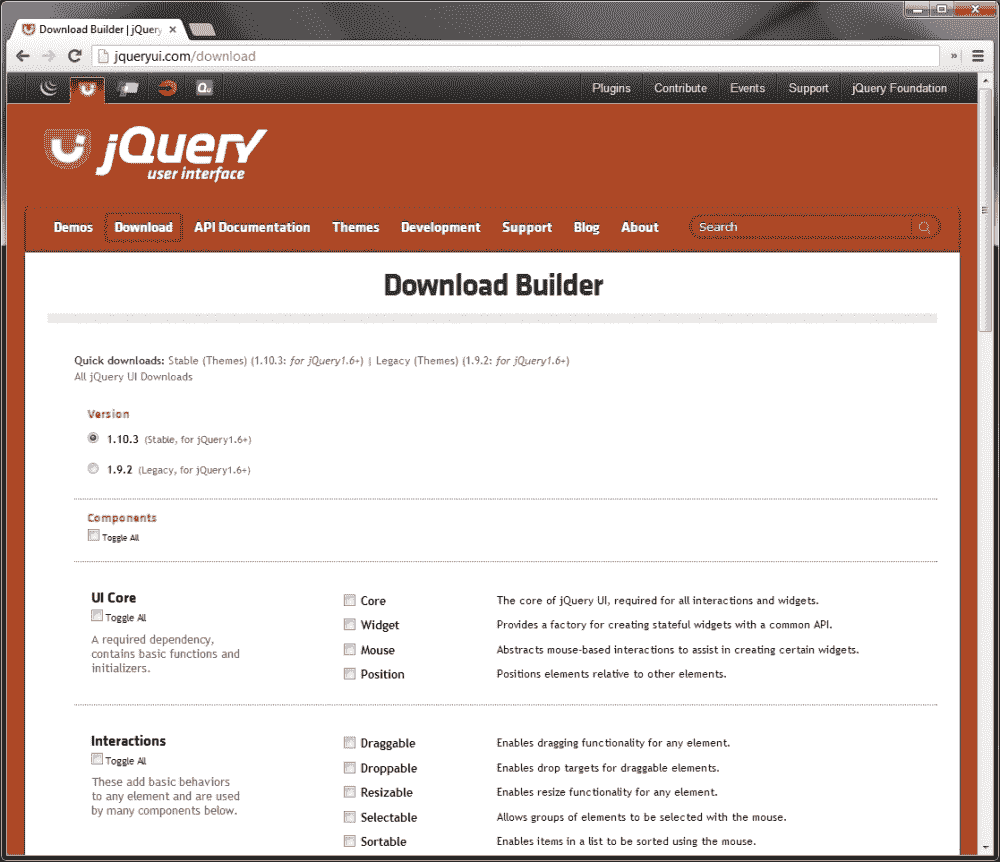

上一个屏幕截图中显示的**下载生成器**页面为我们提供了运行库组件任何子集所需的一切。

本章中我们将使用的只是特效，因此当我们下载软件包时，我们应该只选择页面底部的**特效**小节中的组件。我们不需要包含主题，甚至不需要包含库核心。效果可以完全独立于库的其他部分使用；我们需要的只是**特效核心**文件和我们需要的个人特效。确保所有这些都已选中，然后下载软件包。

下载生成器只允许您下载所需的片段，因为 jqueryui 基本上是一个附加组件。分解每个片段，允许您只选择所需的片段，这在定制插件时大大减少了插件的文件大小。

该软件包将为我们提供使用我们选择的组件所需的一切，包括 jQuery 最新稳定版本的副本，因此在使用 jQuery UI 时，jQuery 本身不需要单独下载。

下载生成器将每个选定的组件的所有 JavaScript 组合并压缩为一个文件，任何功能 CSS 或主题文件将组合为一个样式表。我们不需要任何主题文件来处理特效，但要确保下载生成器提供的归档文件中的`.js`文件进入我们的`js`文件夹。

## 新建模板文件

本章余下的中的示例将是简短的，主要是基于图像的示例，依次说明每种效果，因此使用稍微不同的模板文件是有意义的。通过在关闭`</body>`标记之前的 jQuery UI 源文件之后直接添加对 jQuery UI 源文件的引用，创建一个新模板文件。

# jQuery UI 添加的新效果

在撰写本文时，jQueryUI 为我们提供了 14 种新的预定义动画效果，供我们在页面中使用；以下列出了它们，并简要说明了它们的用法：

<colgroup><col style="text-align: left"> <col style="text-align: left"></colgroup> 
| 

动画

 | 

描述

 |
| --- | --- |
| `blind` | 目标元素通过像百叶窗一样上下滚动来显示或隐藏。 |
| `bounce` | 目标元素水平或垂直反弹指定次数。 |
| `clip` | 目标元素的显示或隐藏方式是将相对的边缘向元素中心向内移动，或向外移动至其全宽或全高。 |
| `drop` | 元素似乎落在或落在页面上，以便分别显示或隐藏它。 |
| `explode` | 爆炸效应使目标元素在消失之前分离成指定数量的碎片，或在聚集形成完整元素之前以多个碎片消失在视野中。 |
| `fold` | 元素似乎折叠关闭或打开。 |
| `highlight` | 目标元素的`background-color`属性被设置（默认为黄色，尽管这是可配置的），然后在短时间间隔后淡出。 |
| `puff` | 目标元素的大小略有增加，然后逐渐消失。 |
| `pulsate` | 目标元素的不透明度被调整了指定的次数，使元素显示为打开和关闭闪烁。 |
| `scale` | 调整目标元件的尺寸以增大或减小其尺寸。 |
| `shake` | 将目标元件摇晃指定次数。此效果类似于反弹效果，关键点的区别在于，在动画的每次迭代中，抖动的距离保持不变。 |
| `size` | 调整目标元件的尺寸以增大或减小其尺寸。此效果几乎与`scale`相同。 |
| `slide` | 目标元素可水平或垂直滑入或滑出视图。 |
| `transfer` | 指定元素的轮廓被转移到页面上的另一个元素。 |

## 使用特效 API

jQuery UI 引入了方法，可以使用触发上表中列出的任何效果。`effect()`方法的使用模式如下：

```js
$(selector).effect( effect [,options] [,duration] [,complete] );
```

我们想要使用的效果名称始终是`effect()`方法的第一个参数。它是以字符串格式提供的。

每个效果都有自定义配置选项，可以设置这些选项来控制效果的显示方式。这些选项在一个配置对象中设置，该配置对象作为第二个参数传递给`effect()`方法，该参数位于效果名称之后。

我们还可以提供效果的持续时间作为参数。与标准 jQuery 动画一样，我们可以提供一个以毫秒为单位表示效果持续时间的整数，也可以提供一个字符串`slow`或`fast`。

如果不需要配置，持续时间可以作为第二个参数传递给`effect()`方法。如果没有提供持续时间，将使用默认的持续时间`400`毫秒。

可选地，可以提供回调函数作为最终参数。当效果结束时，为每个选定元素执行一次提供的函数。

让我们看几个例子，看看如何使用`effect()`方法。

## 反弹效应

`bounce`效应与`easeOutBounce`缓解功能相似，但更可控。根据您的需求，它可以与效果 API 或显示/隐藏逻辑一起使用。

### 语法

```js
$(selector).effect( "bounce" [,configuration] [,duration] );
```

### 配置选项

以下配置选项可用于反弹效果：

<colgroup><col style="text-align: left"> <col style="text-align: left"> <col style="text-align: left"></colgroup> 
| 

选项

 | 

违约

 | 

用法

 |
| --- | --- | --- |
| `direction` | `"up"` | 反弹的方向。另一个可能的选项是字符串`down` |
| `distance` | `20` | 初始反弹距离（连续反弹的距离减小），以像素为单位 |
| `mode` | `"effect"` | 无论是正常运行效果还是使用显示/隐藏逻辑，接受的其他值可能是字符串`show`、`hide`或`toggle` |
| `times` | `5` | 反弹次数 |

# 行动时间–使用反弹效果

在本例中，我们将看到如何结合 jQuery UI 效果来创建一个在页面上移动的弹跳球：

1.  在模板文件的`<body>`中使用以下简单元素：

    ```js
    <div id="travel">
      <div id="ball"></div>
    </div>
    ```

2.  我们只需要一个简单的容器`<div>`和一个内部`<div>`。在`<body>`结尾的空函数中，添加以下脚本：

    ```js
    $("#ball").click(function() {
    $("#travel").animate({
      left: "+=300px"
      }, 1500).find("div").effect( "bounce", { times: 4,
      distance: 100 }, 1500 );
    });
    ```

3.  将文件另存为`bounce.html`。我们还需要一些简单的款式。将以下 CSS 添加到新文件：

    ```js
    #travel {
      position:absolute;
      top:100px;
    }
    #ball {
      width:150px;
      height:150px;
      cursor:pointer;
      background:url(../img/ball.jpg) no-repeat 0 0;
    }
    ```

4.  Save this as `bounce.css` in the `css` folder. When we run the page and click on the ball, we should find that it bounces along the page, gradually coming to a halt:

    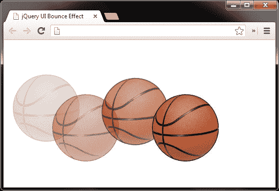

上一篇文章显示了球在页面上移动，从左到右上下弹跳。

## *刚才发生了什么事？*

单击球时，我们首先使用 jQuery 的`animate()`方法在 1.5 秒的时间内，将容器的`left`样式属性`#travel`设置 300 像素的动画。我们减慢了这个动画的速度，以改善整个动画的外观，但这并不是严格要求的。然后我们向下导航到内部的`<div>`元素并使用`effect()`方法，指定`bounce`效果。

我们需要同时使用两个元素`#travel`和`#ball`，因为如果在相同的元素上使用`animate()`和`effect()`方法，反弹效果将进入元素的动画队列，两个动画将依次执行，而不是同时运行。

## 高光效果

`highlight`效果是一种简单但有效的方式，可以吸引访问者注意页面中添加的新项目，并在当今许多领先的基于 web 的界面中使用。

### 语法

```js
$(selector).effect( "highlight" [,configuration] [,duration] );
```

### 配置选项

`highlight`效果只有两个配置选项；这些措施如下：

<colgroup><col style="text-align: left"> <col style="text-align: left"> <col style="text-align: left"></colgroup> 
| 

选择权

 | 

违约

 | 

用法

 |
| --- | --- | --- |
| `color` | `"#ffff99"` | 设置要高亮显示的元素的`background-color`属性 |
| `mode` | `"show"` | 设置与`effect()`方法一起使用时效果是隐藏还是显示，其他可能的值包括`hide`、`toggle`或`effect` |

# 行动时间-突出要素

在本例中，我们将创建一个简单的待办事项列表，其中包含一系列可以勾选的默认项。我们还可以允许将新项目添加到列表中，并在添加新项目时对其应用`highlight`效果。

1.  将以下 HTML 代码添加到模板文件的`<body>`元素：

    ```js
    <div id="todo">
      <h2>Todo List</h2>
      <ul>
        <li><label><input type="checkbox">Item 1</label></li>
        <li><label><input type="checkbox">Item 2</label></li>
        <li><label><input type="checkbox">Item 3</label></li>
      </ul>
      <input type="text" id="new">
      <button id="add">Add</button>
    </div>
    ```

2.  使用以下代码为我们的待办事项列表添加行为：

    ```js
    $("#add").click(function() {
      var newItem = $("#new"),
        text = newItem.val();

      if (text) {
        var li = $("<li>"),
          label = $("<label>").html("<input type=\"checkbox\">" +text).appendTo(li);
        li.appendTo("#todo ul").effect("highlight", 2000);
        newItem.val("");
      }
      // prevent the form from submitting
      return false;
    });
    ```

3.  将此页面另存为`highlight.html`。对于这个例子，我们还需要一些 CSS。在文本编辑器中的新文件中，添加以下代码：

    ```js
    #todo {
        width:208px;
        font:normal 13px sans-serif;
    }
    #todo ul {
        padding:0;
        margin-bottom:30px;
    }
    #todo li { list-style-type:none; }
    #todo label {
        display:block;
        border-bottom:1px dotted #000;
    }
    li input {
        position:relative;
        top:2px;
    }
    input { margin-right:10px; }
    ```

4.  将此页面另存为`highlight.css`。
5.  When we run the page in a browser, we can add a new item and it will be highlighted briefly as the new item is added to the list:

    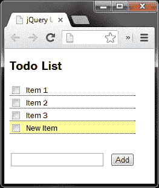

在上一个屏幕截图中，我们看到在从新添加的项目淡出之前的淡出效果。

## *刚才发生了什么事？*

我们在列表底部的`<button>`元素中添加了一个点击处理程序，它驱动其余行为的功能。当点击`<button>`元素时，我们缓存`<input>`字段的选择器，并获取输入到其中的文本。

如果保存文本的变量不是空的，则创建新的`<label>`和`<input>`元素。我们还将文本添加到`<label>`元素，然后将新项附加到列表中。最后，我们应用`highlight`效应并清空`<input>`字段。

## 脉动效应

`pulsate`效果将元素淡入和淡出视野的次数指定，使目标元素出现脉动。像我们目前看到的大多数效果一样，它很容易使用，并且只需要很少或不需要配置。

### 语法

```js
$(selector).effect( "pulsate", [,configuration] [,duration] );
```

### 配置选项

`pulsate`效果也只有两个可配置选项；如下表所示：

<colgroup><col style="text-align: left"> <col style="text-align: left"> <col style="text-align: left"></colgroup> 
| 

选项

 | 

违约

 | 

用法

 |
| --- | --- | --- |
| `mode` | `"show"` | 设置与`effect()`方法一起使用时，目标元素是显示还是隐藏，其他可能的值包括`hide`、`toggle`和`effect` |
| `times` | `5` | 设置目标元素的脉动次数 |

# 行动时间-使元素脉动

在本例中，我们将展示一个简单的时间表，其中的行可以通过单击链接删除。如果点击链接，对应的行会在被移除之前发生脉动。

1.  在模板文件中使用以下标记：

    ```js
    <table>
      <tr>
        <th>Job Number</th>
        <th>Start Time</th>
        <th>End Time</th>
        <th colspan="2">Total</th>
      </tr>
      <tr>
        <td>05432</td>
        <td>8:00</td>
        <td>8:43</td>
        <td>43 minutes</td>
        <td>
          <a class="delete" href="#" title="Delete this item">
            Delete
          </a>
        </td>
      </tr>
      <tr>
        <td>05684</td>
        <td>8:43</td>
        <td>10:21</td>
        <td>1 hour 38 minutes</td>
        <td>
          <a class="delete" href="#" title="Delete this item">
            Delete
          </a>
        </td>
      </tr>
      <tr>
        <td>05684</td>
        <td>10:21</td>
        <td>13:30</td>
        <td>3 hour 9 minutes</td>
        <td>
          <a class="delete" href="#" title="Delete this item">
            Delete
          </a>
        </td>
      </tr>
    </table>
    ```

2.  添加代码将效果应用于页面底部的闭包：

    ```js
    $(".delete").click(function(e) {
      e.preventDefault();

      var row = $(this).closest("tr");

      row.closest("tr").children().css("backgroundColor","red").effect("pulsate", function() {
      row.remove();
      });
    });
    ```

3.  将此文件另存为`pulsate.html`。本例只需要两种样式。这些应该进入一个新文件：

    ```js
    table {
        border-spacing:0;
        font:normal 13px sans-serif;
    }
    th, td {
        text-align:left;
        padding-right:20px;
    }
    ```

4.  将此文件保存在`css`文件夹中为`pulsate.css`。
5.  Clicking the delete link in any row will apply the `pulsate` effect and then remove the table row:

    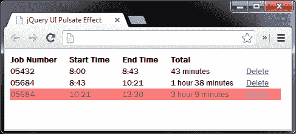

上一个屏幕截图显示一个`pulsate`动画淡出。

## *刚才发生了什么事？*

当点击**删除**链接时，我们的处理函数首先设置链接所在的`<tr>`元素的`background-color`属性。这不是强制性的效果，但它确实有助于它的生活。

然后，我们使用`effect()`方法将`pulsate`效应应用于行中的所有`<td>`元素。我们需要将该效果应用于`<td>`元素而不是`<tr>`元素，以便该效果按照 IE 中的预期工作。

当效果结束时，我们的内联回调函数将被执行，这将删除`<tr>`元素。显然，`<tr>`元素只能删除一次，元素一旦被删除，后续删除它的尝试就会悄无声息地失败。

## 震动效应

`shake`效果来回摇晃元素指定次数。

### 语法

```js
$(selector).effect( "shake", [,configuration] [,duration] );
```

### 配置选项

`shake`效果公开了三个配置选项，允许我们自定义其行为。

下表列出了配置选项：

<colgroup><col style="text-align: left"> <col style="text-align: left"> <col style="text-align: left"></colgroup> 
| 

选项

 | 

违约

 | 

用法

 |
| --- | --- | --- |
| `direction` | `"left"` | 设置元素的移动方向 |
| `distance` | `20` | 设置元素震动时移动的像素数 |
| `times` | `3` | 设置元素抖动的次数 |

# 行动时间-摇动元素

开源 CMS WordPress 在其后端管理区域的登录表单中输入错误的登录详细信息时，使用`shake`效果。在这个例子中，我们可以看到使用`shake`效果实现行为是多么容易。

1.  在模板文件中添加以下标记作为登录表单的基础：

    ```js
    <form>
      <h2>Login</h2>
      <label>Username:<input id="name" type="text"></label>
      <label>Password:<input id="pass" type="text"></label>
      <input type="submit" id="submit" value="Login">
    </form>
    ```

2.  现在将以下代码添加到模板文件底部的空闭包中：

    ```js
    $("#submit").click(function(e) {
      e.preventDefault();

      $("input").each(function(i, val) {
        if (!$(this).val()) {
          $(this).css("border", "1px solid red").effect("shake", {
            distance: 5 }, 100);
        }
      });
    });
    ```

3.  将此文件另存为`shake.html`。对于这个例子，我们还需要一个基本的样式表。将以下 CSS 添加到新文件：

    ```js
    form {
      width:145px;
      padding:20px;
      margin:auto;
      border:1px solid #000;
      font:normal 13px sans-serif;
    }
    h2 {
      font-size:14px;
      margin-top:0;
    }
    input {
      display:block;
      margin-bottom:10px;
      border:1px solid #000;
    }
    ```

4.  将此文件另存为`shake.css`。
5.  If we run the page in a browser and click the **Login** input button without completing either of the `<input>` fields, both fields will have their borders set to red and will shake from side to side:

    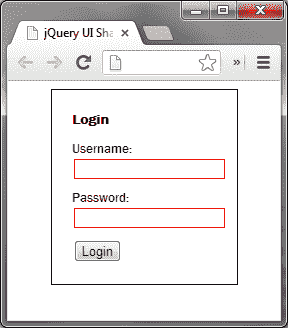

在上一个屏幕截图中，我们看到当为空并且点击**登录**按钮时文本字段被震动。

## *刚才发生了什么事？*

当点击**登录**按钮时，我们只需检查每个`<input>`是否有值，如果没有，则应用红色边框，然后调用指定`shake`的`effect()`方法作为效果。我们使用配置对象来减少元素移动的距离，以及指定相对较短的持续时间。

## 尺寸效应

`size`效果用于调整元素的大小，使其根据其配置而增长或收缩。与大多数其他效果不同，`size`效果必须经过配置才能成功使用。

`size`效果也是唯一具有基本核心文件的效果之一，以及作为依赖项的另一个效果。大多数组件仅依赖于核心文件。当我们从 jQueryUI 下载生成器下载整个效果套件时，我们不需要担心包含额外的效果。它已经存在于下载生成器在本章开头下载时创建的单个文件中。

### 语法

```js
 $(selector).effect( "size", [,configuration] [,duration] );
```

### 配置选项

`size`效果为我们提供了四个可配置选项，如下所示：

<colgroup><col style="text-align: left"> <col style="text-align: left"> <col style="text-align: left"></colgroup> 
| 

选项

 | 

违约

 | 

用法

 |
| --- | --- | --- |
| `from` | `none` | 在动画开始时设置目标元素的大小。此选项接受带有`height`和`width`键的对象，用于设置目标元素的起始大小。此选项不是强制性的 |
| `to` | `none` | 在动画结束时设置目标元素的大小。此选项接受带有`height`和`width`键的对象，用于设置目标元素的结束大小。必须提供此选项 |
| `origin` | `['middle','center']` | 设置隐藏动画的消失点，或与“显示逻辑”一起使用时动画从中增长的点 |
| `scale` | `"both"` | 此选项设置是否缩放元素的整个`box`（包括边框和填充 CSS 值），仅缩放`content`还是默认缩放`both` |

# 行动时间-调整元素大小

增长和收缩元素的一个流行用法是鱼眼菜单，当鼠标指针悬停在元素上时，元素会增长，当指针离开元素时，元素会向下收缩。苹果 OSX 中基座上的图标也使用了这种效果。

使用`size`效果，我们只需几行代码就可以实现我们自己的基本鱼眼菜单。

1.  将以下标记添加到模板文件的`<body>`中：

    ```js
    <div id="dock">
      <a href="#" class="icon" id="finder">
        </a>
      <a href="#" class="icon" id="mail">
        </a>
      <a href="#" class="icon" id="safari">
        </a>
      <a href="#" class="icon" id="firefox">
        </a>
      <a href="#" class="icon" id="itunes">
        </a>
    </div>
    ```

2.  将以下 JavaScript 添加到`<body>`元素底部的第三个`<script>`元素：

    ```js
    $(".icon", "#dock").hover(function() {
      $(this).stop().animate({
        top: -31
      }).find("img").stop().effect("size", {
      scale: "box", to: { width: 64, height: 64 }
      });
    }, function() {
      $(this).stop().animate({
        top: -15
        }).find("img").stop().effect("size", {
        scale: "box", to: { width: 48, height: 48 }
      });
    });
    ```

3.  将此文件另存为`size.html`。我们还需要一些造型。在新文件中添加以下代码：

    ```js
    #dock {
      width:380px;
      height:90px;
      position:fixed;
      bottom:0;
      background:url(../img/dock.png) no-repeat 0 0;
    }
    .icon {
      position:absolute;
      top:-15px;
      left:44px;
    }
    .icon img { border:none; }
    #mail { left:108px; }
    #safari { left:170px; }
    #firefox { left:229px; }
    #itunes { left:289px; }
    ```

4.  将此文件另存为`css`文件夹中的`size.css`。
5.  When we run the file in a browser, we should see that the individual items in the menu grow and shrink as the mouse pointer moves over them:

    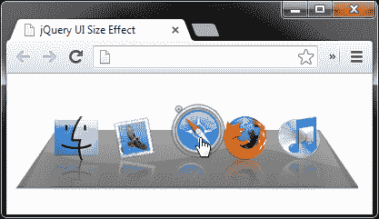

在上一个屏幕截图中，当指针悬停在菜单中的一个项上时，我们看到菜单。

## *刚才发生了什么事？*

我们使用 jQuery 的`hover()`方法将`mouseenter`和`mouseleave`事件处理程序附加到 dock 中的每个项目，该方法接受两个函数，第一个在`mouseenter`事件上执行，第二个在`mouseleave`上执行。

在第一个函数中，我们使用`stop()`方法来管理队列，然后通过更改其`top`CSS 值来设置元素位置的动画。在这里使用`stop()`可以防止屏幕上元素的位置出现难看的震动。

然后，我们向下导航链接内的图像，并在此元素上调用`stop()`方法，然后再应用和`size`效果。我们为配置对象中的`width`和`height`键提供整数值，由于这些值大于图像的尺寸，因此图像的大小将在中增加。

### 注

请注意，当我们对图像使用`stop()`方法时，它是为了防止鼠标指针在其中一个链接上反复移动时产生效果。第二个函数实际上与第一个函数相反，它只是将元素的大小调整回其原始位置和大小。

## 转移效应

`transfer`效果只是将一个元素的轮廓转移到另一个元素。就像我们刚才看到的`size`效果一样，如果不配置`transfer`效果，它将不起作用。

### 语法

```js
 $(selector).effect( "transfer", [,configuration] [,duration] );
```

### 配置选项

`transfer`效果只有两个配置选项，尽管只有其中一个选项需要设置才能使效果工作。下表列出了配置选项：

<colgroup><col style="text-align: left"> <col style="text-align: left"> <col style="text-align: left"></colgroup> 
| 

选项

 | 

违约

 | 

用法

 |
| --- | --- | --- |
| `className` | `none` | 此选项的值（如果已设置）将在效果运行时添加到传输元素 |
| `to` | `none` | 一个 jQuery 选择器，指定将传输元素发送到的目标元素 |

# 行动时间–将一个元素的轮廓转移到另一个元素

在本例中，我们将从 OSX 重新创建一个流行的应用安装对话框，并使用`transfer`效果帮助访问者显示将图标拖动到何处（该图标实际上不可拖动；我们所做的只是查看`transfer`效果）。

1.  将以下元素添加到模板文件的`<body>`元素中，以创建`install`对话框：

    ```js
    <div id="install">
      <div id="firefox"></div>
      <div id="apps"></div>
    </div>
    <p>To install the application, drag its icon over to the apps
    folder icon.</p>
    <button id="show">Show me</button>
    ```

2.  将以下脚本添加到模板文件底部的空函数：

    ```js
    $("#show").click(function() {
      $("#firefox").effect("transfer", {
        to: "#apps",
        className: "ui-effect-transfer"
      }, 1000);
    });
    ```

3.  将页面另存为`transfer.html`。对于样式表向新文件中添加以下代码：

    ```js
    body {
        font:normal 14px sans-serif;
    }
    #install {
      width:417px;
      height:339px;
      position:relative;
      background:url(../img/install.jpg) no-repeat 0 0;
    }
    #firefox {
      width:124px;
      height:121px;
      position:absolute;
      left:34px;
      top:132px;
      background:url(../img/firefox.png) no-repeat 0 0;
    }
    #apps {
      width:54px;
      height:52px;
      position:absolute;
      right:58px;
      top:172px;
      background:url(../img/apps.png) no-repeat 0 0;
    }
    .ui-effect-transfer { border:2px solid #7bee76; }
    ```

4.  将此文件另存为`css`文件夹中的`transfer.css`。
5.  When the `<button>` element is clicked on, an outline is transferred from the Firefox icon to the App folder icon to direct the visitor:

    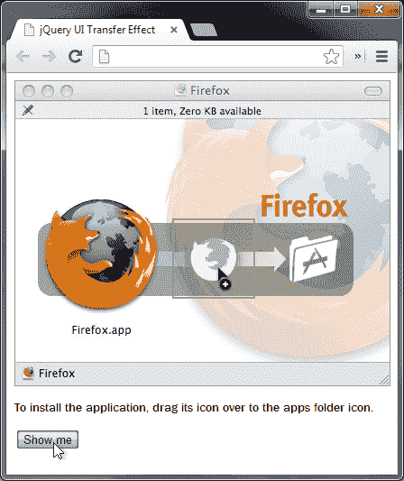

传输元件的大小调整为，它从起始元件穿过移动到目标元件。在前面的屏幕截图中，动画大约完成了 50%。

## *刚才发生了什么事？*

在底层 HTML 中，我们有一个容器`<div>`元素，它是应用安装对话框的背景图像。其中我们有一个`<div>`元素，它被赋予 Firefox 图标背景，还有一个`<div>`元素，它被赋予 App 文件夹图标。两个内部的`<div>`元素都被赋予`id`属性，以便于设计样式和使用 jQuery 进行轻松选择。

在脚本中，我们向`<button>`元素添加了一个 click handler 函数，该函数在每次单击`<button>`元素时应用该效果。handler 函数调用`#firefox`元素上的传递效果，该元素将图标设置为起始元素。

在配置对象中，我们将`to`选项设置为`apps`元素的选择器，`className`选项设置为`ui-effect-transfer`字符串。该字符串作为类名应用于元素，用于在传输元素可见时向其添加绿色边框。

每次点击`<button>`元素时，传输元素将显示，并将从起始元素（Firefox 图标）到结束元素（Apps 文件夹图标）设置动画。

## 突击测验–使用特效 API

问题 1。jQueryUI 给了我们多少新的效果？

1.  2.
2.  18
3.  9
4.  14

问题 2。我们希望使用的效果如何指定？

1.  通过将效果作为函数调用，例如，`bounce()`
2.  效果的名称以字符串格式作为第一个参数传递给`effect()`方法，例如`effect("bounce")`
3.  效果名称作为传递给`animate()`方法的对象中`effect`键的值提供，例如`animate({ effect: "bounce" })`
4.  效果的名称作为字符串传递给事件助手，例如，`click("bounce")`

# 使用带有显示和隐藏逻辑的效果

当需要显示或隐藏逻辑时，一些 jQuery UI 效果也可以与 jQuery 的`show()`、`hide()`和`toggle()`方法结合使用。事实上，有些效果更适合这种执行方法。

## 盲目效应

`blind`效果是一个完美的效果示例，与标准效果 API 相比，它通常最好与显示/隐藏逻辑一起使用。虽然`blind`效果将与标准的效果 API 一起工作，但是效果将按照其默认模式运行，但随后元素将恢复到其原始状态。这适用于具有`mode`配置选项的所有效果。

### 语法

```js
$(selector).hide|show|toggle|effect( "blind", [,configuration][,duration] );
```

### 配置选项

`blind`效果有以下配置选项：

<colgroup><col style="text-align: left"> <col style="text-align: left"> <col style="text-align: left"></colgroup> 
| 

选项

 | 

违约

 | 

用法

 |
| --- | --- | --- |
| `direction` | `"vertical"` | 设置显示或隐藏目标元素的轴 |
| `mode` | `"hide"` | 设置当与`effect()`方法一起使用时，元素是显示还是隐藏。其他可能的值包括`show`、`toggle`和`effect` |

# 行动时间-使用盲效果

我之前提到过，效应让人联想到窗帘向上或向下卷动，因此我们接下来的示例基于此：

1.  在模板文件的`<body>`元素中添加以下代码：

    ```js
    <div id="window">
        <div id="blind"></div>
    </div>
    ```

2.  使用以下脚本实现效果：

    ```js
    $("#window").click(function() {
      $("#blind").toggle("blind");
    });
    ```

3.  将此文件另存为`blind.html`。本例的样式表如下：

    ```js
    #window {
      width:464px;
      height:429px;
      position:relative;
      cursor:pointer;
      background:url(../img/window.jpg) no-repeat 0 0;
    }
    #blind {
      display:none;
      width:332px;
      height:245px;
      position:absolute;
      left:64px;
      top:113px;
      background:url(../img/blind.png) no-repeat 0 100%;
    }
    ```

4.  将此保存为`css`文件夹中的`blind.css`。
5.  When we run the page in a browser, the blind should alternately roll down and up each time the window is clicked:

    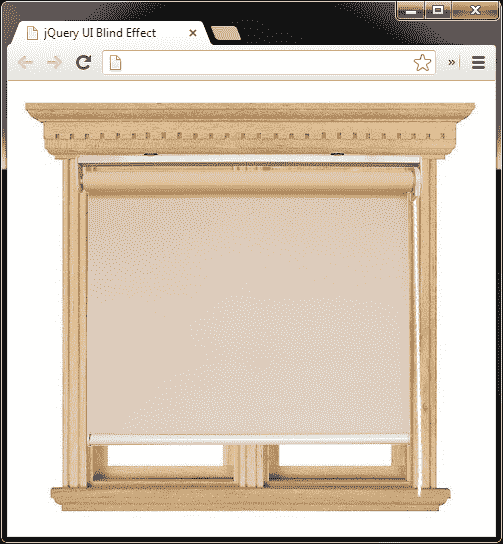

上一个屏幕截图显示了盲人处于完全打开状态。

## *刚才发生了什么事？*

我们在外部容器上设置了一个 click 处理程序，它调用内部元素上的`toggle()`方法。在 CSS 中，我们最初将内部元素设置为隐藏，因此第一次单击容器元素时，将显示内部元素。

## 剪辑效果

`clip`效应导致所调用的元素在垂直或水平方向上减小大小，直到其消失。

### 语法

```js
$(selector).hide|show|toggle|effect( "clip", [,configuration][,duration] );
```

### 配置选项

使用`clip`效果时，我们可以使用的配置选项允许我们控制动画进行的方向，以及是否显示或隐藏元素：

<colgroup><col style="text-align: left"> <col style="text-align: left"> <col style="text-align: left"></colgroup> 
| 

选项

 | 

违约

 | 

用法

 |
| --- | --- | --- |
| `direction` | `"vertical"` | 设置元素沿其设置动画的轴 |
| `mode` | `"hide"` | 配置元素是隐藏还是显示。其他可能的值为`show`、`toggle`和`effect` |

# 行动时间–将一个元素插入和移出

这种效果被称为类似于旧电视机关机时画面所发生的情况，所以让我们将其应用到我们的示例中。

1.  在模板文件的`<body>`元素中添加以下元素：

    ```js
    <div id="tv">
      <div id="bg"></div>
      <div id="static"></div>
    </div>
    ```

2.  然后，在页面底部使用以下简单脚本：

    ```js
    $("#tv").click(function() {
      $("#static").effect("clip");
    });
    ```

3.  将此文件另存为`clip.html`。本例的样式表如下：

    ```js
    #tv {
      width:300px;
      height:269px;
      position:relative;
      cursor:pointer;
      background:url(../img/tv.png) no-repeat 0 0;
    }
    #bg {
      width:220px;
      height:180px;
      position:absolute;
      left:42px;
      top:30px;
      z-index:-2;
      background-color:#000;
    }
    #static {
      width:216px;
      height:178px;
      position:absolute;
      left:44px;
      top:31px;
      z-index:-1;
      background:url(../img/static.gif) no-repeat 0 0;
    }
    ```

4.  将此文件保存在`css`文件夹中为`clip.css`。
5.  When the page is run, we should be able to click anywhere on the television and see the effect run:

    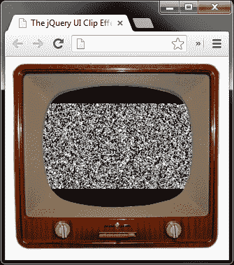

前面的屏幕截图显示了正在剪辑的静态元素。

## *刚才发生了什么事？*

底层页面上有一组元素，外部容器的样式类似于电视，还有一些内部元素，其中一个是位于静态元素后面的简单背景。两个内容器都使用 CSS`z-index`坐在外容器后面。

当点击电视的任何部分时，静态元素会对其应用效果，无需任何额外配置，并且由于效果的默认模式为`hide`，因此在效果结束时，元素会自动隐藏。为了看到效果的相反，我们可以默认隐藏静态并将模式设置为`show`，或者我们可以将`mode`设置为`toggle`并让静态交替显示和隐藏。

## 下降效应

`drop`效果用于在滑动打开时显示元素，或在滑动关闭时隐藏元素。此效果同时作用于所应用元素的`position`和`opacity`。

### 语法

```js
$(selector).hide|show|toggle|effect( "drop", [,configuration][,duration] );
```

### 配置选项

`drop`效果允许我们控制元素下落的方向以及是否显示或隐藏：

<colgroup><col style="text-align: left"> <col style="text-align: left"> <col style="text-align: left"></colgroup> 
| 

选项

 | 

违约

 | 

用法

 |
| --- | --- | --- |
| `direction` | `"left"` | 设置元素放入或移出页面的方向。另一个选项是字符串`right` |
| `mode` | `"hide"` | 设置使用`effect()`方法时显示还是隐藏元素。其他可能的值包括`show`、`toggle`和`effect` |

# 行动时间-使用效果

社交网站推特推出了一种新的效果，系统通过在页面顶部显示一条消息向访问者报告操作。我们可以利用`drop`效应很容易地复制这种行为。

1.  在模板页面的`<body>`元素中添加以下标记：

    ```js
    <div id="confirmation">
     <p>Your request has been completed!</p>
    </div>
    ```

2.  现在，在页面底部添加以下代码：

    ```js
    $("#confirmation").effect("drop", {
      mode: "show",
      direction: "up"
    }, function() {
        var timer = function() {
        $("#confirmation").effect("drop", { mode: "hide",
          direction: "up"});
         }

    setTimeout(timer, 3000);
    });
    ```

3.  将页面另存为`drop.html`。对于这个例子，我们只需要一些样式。创建以下非常基本的样式表：

    ```js
    body { background-color:#3cf; }
    #confirmation {
      display:none;
      width:100%;
      height:60px;
      position:absolute;
      top:0;
      left:0;
      z-index:999;
      background-color:#fff;
      text-align:center;
      font:normal 18px sans-serif;
    }
    #confirmation p {
      margin:0;
      position:relative;
      top:18px;
    }
    ```

4.  将 CSS 另存为`drop.css`。
5.  When the page loads, the message should initially be displayed before fading away after a short interval:

    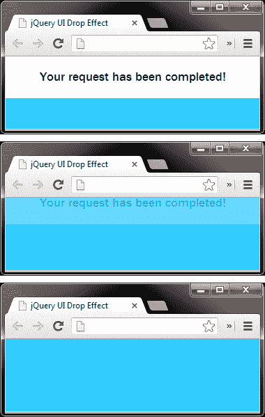

上一个屏幕截图显示消息正在慢慢隐藏。当在计时器间隔过后被隐藏时，它会同时向上滑动和淡出。

## *刚才发生了什么事？*

消息本身的底层标记非常简单；我们只需要一个容器和实际的消息。在我们的示例中，消息是硬编码到页面中的，但是我们可以根据报告的操作轻松地动态设置消息。

CSS 同样简单，为页面提供背景色以更好地突出显示消息，并为容器和消息本身提供一些基本样式。（在这个实现中）最重要的规则是容器最初是隐藏在视图中的。

我们的脚本会在页面加载后立即显示消息，但通常会在某些系统操作完成后触发。我们使用`effect()`方法来启动效果，并使用作为`effect()`方法的第二个参数传递的配置对象，将`mode`配置为`show`，将`direction`配置为`up`（元素仍然会向下显示，因为它是绝对定位的）。

在传递给`effect`方法的回调函数中，我们创建了一个存储在`timer`变量中的内联函数。在这个函数中，我们只需隐藏确认消息，使用`effect()`方法并再次将`mode`配置选项设置为`hide`，将`direction`选项设置为`up`。

在这个函数定义之后，我们使用 JavaScript 的`setTimeout`函数在 3 秒后执行`timer`函数。根据当前的最佳实践，我们使用闭包来调用`timer`函数。

## 爆炸效应

`explode`效果通过将所选元素分解为指定数量的片段，然后将其淡出，从而提供了出色的视觉效果。此效果可与效果 API 以及`show`、`hide`或`toggle`逻辑一起使用。

### 语法

```js
$(selector).hide|show|toggle|effect( "explode", [,configuration][,duration] );
```

### 配置选项

使用`explode`效果时，我们可以控制元素分解成多少块，以及元素是显示还是隐藏：

<colgroup><col style="text-align: left"> <col style="text-align: left"> <col style="text-align: left"></colgroup> 
| 

选项

 | 

违约

 | 

用法

 |
| --- | --- | --- |
| `mode` | `"hide"` | 设置当与`effect()`方法一起使用时，元素是显示还是隐藏。其他值为`show`、`effect`和`toggle` |
| `pieces` | `9` | 设置元素分解成的块数 |

# 行动时间-引爆元素

在本例中我们将使图像爆炸。

1.  只需在模板文件的`<body>`元素中添加以下简单图像：

    ```js
    
    ```

2.  然后将以下同样简单的代码添加到模板文件底部的空函数中：

    ```js
    $("img").click(function() {
      $(this).effect("explode");
    });
    ```

3.  将此页面另存为`explode.html`。
4.  This example is so simple we don't even need a stylesheet. Once we click on the grenade, it is exploded into the default number of pieces:

    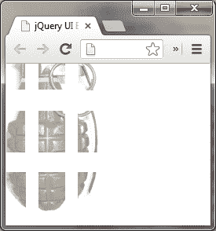

分解后的元素会随着元素的各个部分分开而逐渐消失。

## *刚才发生了什么事？*

在本例中，所需要做的就是将点击处理程序直接附加到图像上，使用`effect()`方法应用`explode`效果。本例不需要配置，因为效果的默认`mode`为`hide`。

### 注

请注意，我们也可以通过将`mode`选项设置为`show`或使用`show()`逻辑来反向运行此效果。在这个场景中，我们将看到目标元素由系列碎片构造而成，这些碎片逐渐消失，并以相反的方式一起爆炸。

## 褶皱效应

`fold`效果模拟某个东西沿一个轴对折，然后沿另一个轴对折。当然，元素实际上并不是三维意义上的折叠；首先，元素的一侧向上移动指定的量，然后移入另一侧，元素消失。

默认情况下，效果使用`hide`模式，因此它将在动画结束时自动隐藏。被折叠的元件未缩放；取而代之的是剪裁，这样在效果运行时图像和文本不会挤压。

### 语法

```js
$(selector).hide|show|toggle|effect( "fold", [,configuration][,duration] );
```

### 配置选项

`fold`效果公开了三个可配置选项，如下表所示：

<colgroup><col style="text-align: left"> <col style="text-align: left"> <col style="text-align: left"></colgroup> 
| 

选项

 | 

违约

 | 

用法

 |
| --- | --- | --- |
| `horizFirst` | `false` | 设置是否先沿水平轴剪裁元素 |
| `mode` | `"hide"` | 设置当与`effect()`方法一起使用时，元素是显示还是隐藏。其他值可能包括`show`、`effect`或`toggle` |
| `size` | `15` | 这将以像素为单位设置第一次折叠的距离，可以采用整数，也可以采用指定值（如百分比）的字符串 |

# 行动时间-折叠元素

在本例中，我们将把折叠效果应用于一张纸的简单图像。

1.  我们所需要的只是一个形象；将以下代码添加到模板文件的`<body>`元素：

    ```js
    
    ```

2.  接下来，将以下简单脚本添加到页面底部的空函数中，与前面的示例相同：

    ```js
    $("img").click(function() {
      $(this).effect("fold", { size: "50%" }, 1000);
    });
    ```

3.  将此文件另存为`fold.html`。
4.  This is another example that we don't need a stylesheet for. When the image is clicked, it should fold up and disappear:

    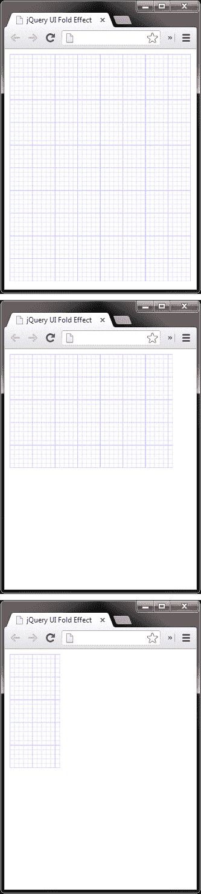

在前面的屏幕截图中，我们首先看到图像开始时，然后是效果隐藏了图像的下半部分，最后是图像的上半部分被隐藏时。请注意目标元素已剪裁且未调整大小。

## *刚才发生了什么事？*

我们只需在``元素上设置一个点击处理程序，它将应用`fold`效果。我们将`size`选项指定为`50%`，以便沿每个轴的折叠量相等，并通过指定一个长于的默认持续时间`1000`毫秒来略微降低效果。

## 喘息效应

`puff`效果将其应用到的元素扩展指定的数量，同时将其淡入为零，或者淡入淡入淡入淡入淡入淡入淡入淡入淡入淡入淡入淡入淡入淡入淡入淡入淡入淡入淡入淡入淡入淡入淡入淡入淡入淡入淡入淡入淡入淡入淡入淡入淡入淡入淡入淡入淡。

### 语法

```js
$(selector).hide|show|toggle|effect( "puff", [,configuration][,duration] );
```

### 配置选项

`puff`效果使我们可以控制元素增加到的大小，以及是否显示或隐藏：

<colgroup><col style="text-align: left"> <col style="text-align: left"> <col style="text-align: left"></colgroup> 
| 

选项

 | 

违约

 | 

用法

 |
| --- | --- | --- |
| `mode` | `"hide"` | 设置与`effect()` 方法一起使用时，元素是显示还是隐藏。其他可能的值包括`show`、`effect`和`toggle` |
| `percent` | `150` | 设置元素缩放到的大小（以百分比为单位） |

# 行动时间——让元素在喘息中消失

在本例中，我们将在浏览器窗口的中心显示一个对话框，并在单击**确定**或**取消**按钮时对其应用`puff`效果。

1.  在模板文件的`<body>`元素中，为对话框添加以下元素：

    ```js
    <div id="confirm">
      
      <p>Are you sure you want to do that?</p>
      <button>Ok</button><button>Cancel</button>
    </div>
    ```

2.  将随附脚本添加到空函数中，如下所示：

    ```js
    $("#confirm").css({
      left: $(window).width() / 2 - $("#confirm").width() / 2,
      top: $(window).height() / 2 - $("#confirm").height() / 2
    });

    $("#confirm, button").click(function() {
      $("#confirm").effect("puff");
    });
    ```

3.  将此页面另存为`puff.html`。将对话框的以下样式添加到文本编辑器中的新文件中：

    ```js
    #confirm {
      display:block;
      width:400px;
      height:120px;
      position:absolute;
      border:1px solid #ccc;
      background:#EEE;
      font:normal 13px sans-serif;
    }
    #confirm img {
      margin:20px 20px 0 20px;
      float:left;
    }
    #confirm p { margin:40px 0 0 0; }
    #confirm button {
      width:68px;
      margin:20px 10px 0 0;
      float:right;
    }
    ```

4.  将此新文件另存为`css`目录中的`puff.css`。
5.  When we run the page in a browser, we should find that the dialog is initially centered in the window, and that clicking either of the `<button>` elements closes it using the `puff` effect:

    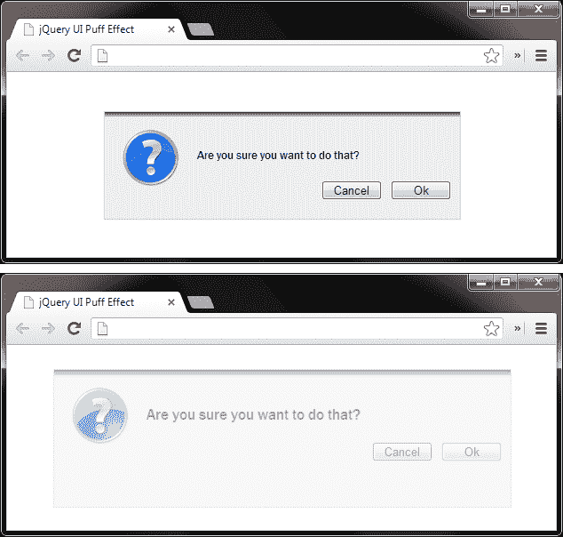

上一个屏幕截图显示对话框在逐渐消失时正在扩展。

## *刚才发生了什么事？*

我们的脚本的第一部分在垂直和水平方向上将对话框居中。需要注意的一点是，我们不能使用`margin:auto`使对话框居中，因为当应用效果时，它将丢失这些边距。

脚本的第二部分只是将单击处理程序添加到每个`<button>`元素中，这些元素在被单击时应用`puff`效果。

## 滑动效应

`slide`效应与`drop`效应非常相似。唯一的区别是，使用`slide`效果时，目标元素的不透明度根本没有调整。它也非常类似于 jQuery 本身公开的幻灯片系列效果，尽管使用 jQuery UI`slide`效果，我们不局限于垂直轴，也可以水平滑动。

### 语法

```js
$(selector).hide|show|toggle|effect( "slide", [,configuration][,duration] );
```

### 配置选项

`slide`效果有三个配置选项，让我们指定幻灯片的方向和距离，以及是否显示或隐藏：

<colgroup><col style="text-align: left"> <col style="text-align: left"> <col style="text-align: left"></colgroup> 
| 

选项

 | 

违约

 | 

用法

 |
| --- | --- | --- |
| `direction` | `"left"` | 设置动画进行的方向 |
| `distance` | 目标元素的宽度，包括填充 | 设置目标元素滑动到的距离 |
| `mode` | `"show"` | 设置与`effect()`方法一起使用时，元素是显示还是隐藏。其他可接受值为`hide`、`effect`和`toggle` |

# 动作时间-滑动元件进出视野

当访客悬停在图像上方时显示字幕是一种互动且有趣的方式，可以显示有关图像的其他信息，而不会使您的设计显得杂乱无章。通过`slide`效果，我们可以轻松地为标题的显示和隐藏设置动画，这就是我们在本例中要做的。

1.  将以下代码添加到模板文件的`<body>`元素：

    ```js
    <div id="image">
      
      <div>Praying Mantis: Mantis religiosa</div>
    </div>
    ```

2.  然后，在页面底部的空函数中，添加以下短脚本：

    ```js
    $("#image").hover(function() {
      $(this).find("div").stop(true, true).show("slide");
    }, function() {
      $(this).find("div").stop(true, true).hide("slide");
    });
    ```

3.  另存为`slide.html`。接下来，创建以下样式表：

    ```js
    #image {
      position:relative;
      float:left;
    }
    #image img { margin-bottom:-5px; }
    #image div {
      display:none;
      width:100%;
      padding:10px 0;
      position:absolute;
      left:0;
      bottom:0;
      top:auto!important;
      text-align:center;
      font-style:italic;
      background-color:#000;
      color:#fff;
    }
    ```

4.  将此文件另存为`slide.css`。
5.  When we view the page we should find that the caption is displayed as soon as we move the mouse over the image, and then removed when we move the mouse off of it:

    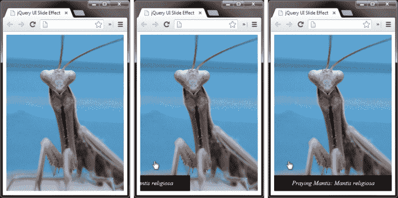

在前面的屏幕截图中，我们看到标题从容器的左边缘滑出。

## *刚才发生了什么事？*

图像和标题保存在一个容器中，以便标题可以准确定位。我们使用 jQuery 的`hover()`方法，它允许我们为`mouseover`和`mouseout`事件附加事件处理程序，通过滑入显示标题，或滑出隐藏标题。

在这个简单的例子中，我们不需要任何额外的配置，但我们确实需要有效地管理队列，以便在鼠标指针反复移动和离开图像时停止动画的积累，这是我们使用`stop()`方法处理的。

## 规模效应

`scale`效应与我们前面看到的`size`效应非常相似，正如我们所看到的，有几种效应实际上需要这种效应作为依赖。此效果与`size`效果的主要区别在于，对于`scale`，我们只能指定目标元素应缩放到的百分比，而不能提供精确的像素大小。

### 语法

```js
$(selector).hide|show|toggle|effect( "scale", [,configuration][,duration] );
```

### 配置选项

`scale`效果比 jQuery UI 添加的任何其他效果都有更多的配置选项。

下表列出了配置选项：

<colgroup><col style="text-align: left"> <col style="text-align: left"> <col style="text-align: left"></colgroup> 
| 

选项

 | 

违约

 | 

用法

 |
| --- | --- | --- |
| `direction` | `"both"` | 设置元素沿哪个轴缩放。其他选项包括`vertical`和`horizontal` |
| `from` | 没有一个 | 设置图元的起始尺寸 |
| `origin` | `['middle', 'center']` | 设置元素隐藏时的消失点，或显示时的增长点 |
| `percent` | `0` | 设置元素将增长或收缩的百分比 |
| `scale` | `"both"` | 此选项设置是否缩放元素的整个`box`（包括边框和填充 CSS 值），仅缩放`content`还是默认缩放`both` |

# 行动时间-缩放元素

在图像密集型网站上，通常会显示一组缩略图，这些缩略图链接到单击图像时显示的全尺寸图像，可以在模式弹出窗口中内联显示，也可以在单独的窗口中显示。在本例中，我们将创建一个缩略图图像，当单击时，它将缩放为全尺寸版本。

1.  将以下几个元素添加到模板文件的`<body>`元素中：

    ```js
    <div id="container">
      
    </div>
    ```

2.  我们需要的脚本稍长一些，但仍然非常简单。在页面末尾的空函数中，添加以下代码：

    ```js
    $("img").click(function() {
        var img = $(this);

        if(!img.hasClass("full")) {
          img.addClass("full").effect("scale",
            { percent: 400, scale: "box",
            origin: ['top','left'] });      
        } else {
          img.removeClass("full").effect("scale",
            { percent: 25, scale: "box",
            origin: ['top','left'] });
        }
    });
    ```

3.  将页面另存为`scale.html`。在本例的样式表中，我们需要以下代码：

    ```js
    #container {
        position:relative;
        float:left;
        cursor:pointer;
    }
    #container img {
        width:150px;
        height:150px;
    }
    ```

4.  将此文件另存为`scale.css`。
5.  When we run the page we should find that clicking on the image causes it to be scaled up to 400 percent of its initial size:

    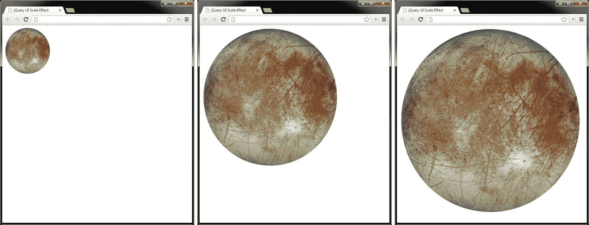

前面的屏幕截图说明了实际效果。再次单击图像会将图像缩放回其初始状态。

## *刚才发生了什么事？*

在页面上，我们的图像保存在一个简单的`<div>`容器中。使用 CSS 将图像从其原始大小缩小，因此当我们放大图像时，我们实际上会将其恢复为全尺寸，因此它看起来不会块状或模糊。

在脚本中，我们首先在图像上设置一个 click 处理程序，然后缓存对它的引用，这样我们就不必继续创建引用它的 jQuery 对象。如果图像没有类名称`full`，我们知道图像还没有放大，所以我们添加`full`类，然后使用`percent`选项将其放大 400%。

一旦图像被缩放，我们将创建一个新的锚元素，它将被附加到容器元素并用作关闭按钮。我们设置链接的内部文本和`href`属性，然后为其分配一个点击处理程序。在这个处理程序中，我们阻止浏览器跟随链接，然后再次缓存选择器，这次它指向锚。

然后，我们将图像缩小到其大小的四分之一，将其重新调整回原始尺寸。完成此操作后，我们将删除关闭链接。

## 突击测验-使用显示/隐藏逻辑

问题 1。受支持的参数如何传递到效果？

1.  以字符串格式作为第二个参数，例如，`show("blind", "vertical")`
2.  作为配置对象中的值直接传递给`animate()`方法，例如`animate({ effect: "blind", configuration: { direction: "vertical" })`
3.  作为第二个参数传递的配置对象中的值，例如，`show("blind", { direction: "vertical" })`
4.  通过设置`effect.config`全局属性，例如`$.effect.config = { direction: "vertical" })`

问题 2。还有什么可以传递给该方法？

1.  表示持续时间的整数或字符串，以及回调函数或函数引用
2.  没有什么
3.  控制动画是否应无限期重复的布尔值
4.  一个布尔值，指示是否应排队或并行执行进一步的效果

## 拥有一个围棋英雄——体验特效 API

我强烈建议您对我们在本节中看到的效果进行实验，看看哪些效果适合`effect()`方法，哪些效果最适合显示/隐藏逻辑，这样您就可以确切地看到当使用不太适合的效果时会发生什么。这将提高您快速确定每种方法何时何地适用的能力。

# 缓解功能

放松可以用于除`explode`之外的所有 jQuery UI 效果，尽管它在一些效果中看起来有点奇怪，例如`bounce`或`pulsate`。如果 jqueryui 与标准 jQuery 一起出现，也可以使用 Easing。

通过将参数传递到正在使用的动画方法中，每个淡入淡出方法都可以设置缓和类型。滑动动画相同，也可以接受缓和类型作为参数。让我们花一点时间来熟悉什么是精确的，以及如何与 jQuery 动画一起使用。

缓和是一种在动画运行时更改动画速度和/或方向的技术。放松可以使动画开始缓慢并逐渐加速，开始快速并逐渐减慢，以及一整套其他效果。

jQuery 有两种内置的放松模式：`linear`和`swing`，其中`swing`是所有类型动画的默认设置。有时，使用`linear`缓和可以帮助使连续动画运行更加平滑，但`swing`和`linear`之间的差异充其量是细微的。

### 注

通过转到以下 URL，可以查看所有放松类型的动画演示：

[http://api.jqueryui.com/easings](http://api.jqueryui.com/easings) 。

jQuery UI 插件的类型如下表所示：

<colgroup><col style="text-align: left"> <col style="text-align: left"> <col style="text-align: left"></colgroup> 
| `easeInQuad` | `easeOutQuad` | `easeInOutQuad` |
| `easeInCubic` | `easeOutCubic` | `easeInOutCubic` |
| `easeInQuart` | `easeOutQuart` | `easeInOutQuart` |
| `easeInQuint` | `easeOutQuint` | `easeInOutQuint` |
| `easeInExpo` | `easeOutExpo` | `easeInOutExpo` |
| `easeInSine` | `easeOutSine` | `easeInOutSine` |
| `easeInCirc` | `easeOutCirc` | `easeInOutCirc` |
| `easeInElastic` | `easeOutElastic` | `easeInOutElastic` |
| `easeInBack` | `easeOutBack` | `easeInOutBack` |
| `easeInBounce` | `easeOutBounce` | `easeInOutBounce` |

# 是时候采取行动了——给效果增加缓和

要使用 easing，我们需要做的就是将 easing 函数名作为配置选项。例如，为了在前面提到的`blind.html`示例中添加 easing，我们可以更改 JavaScript，使其如下所示：

```js
$("#window").click(function() {
 $("#blind").toggle("blind", { easing: "easeOutBounce" });
});
```

## *刚才发生了什么事？*

我们使用配置选项`easing`，将函数名作为字符串作为选项值提供。任何缓和功能都可以通过以这种方式引用其名称来使用。

# 使用对象文字添加

我们还可以更改传入预定义动画方法的参数的格式，以便使用 easing。在 jQuery 版本 1.4.3 中的动画方法（`fadeIn()`、`slideDown()`等）中添加之前，这是将 easing 与动画方法结合使用的实际方法。

我们不需要提供字符串或数字参数（或回调函数），而是可以提供一个对象文本，其中每个键都指向持续时间、松弛类型，还可以选择在动画完成时调用回调。用法如下所示：

```js
$(elements).toggle("blind", {
  duration: [duration],
  easing: [easing],
  complete: [callback]
});
```

## 拥有一个英雄——使用轻松

在我们前面的一些示例上尝试其他一些缓解方法。在本书的其余部分中，我们将在适当的情况下使用 easing，但除了粗略的解释之外，这些将不会被重点放在任何细节上。

## 突击测验-使用轻松

问题 1。总共有多少种宽松类型？

1.  20
2.  32
3.  17
4.  48

问题 2。在使用 easing 的替代格式中，我们可以将什么传递到`effect()`方法中？

1.  具有可选键的对象，这些可选键指定持续时间、缓和类型和要在完成时调用的函数
2.  指定缓和类型的字符串
3.  一个数组，其中第一项是持续时间，第二项是放松类型，第三项是调用 complete 的函数
4.  指定缓和持续时间的整数

# 在不同颜色之间设置动画

除了完整的放松功能外，`effects`核心文件还为我们提供了在不同颜色之间进行有吸引力的平滑动画的能力。几个 CSS 属性可以设置动画，包括`color`、`background-color`、`border-color`和`outlinecolor`。

jQuery UI 扩展了 jQuery 的`animate()`方法来实现彩色动画，所以实现它的语法与使用`animate()`相同。对于任何其他目的，我们只需要针对上述 CSS 属性之一并提供有效的颜色值（十六进制、RGB/RGBa、HSL 等）。让我们看一个基本的例子。

# 行动时间-在颜色之间设置动画

在本例中，我们将使用彩色动画显示表单字段已保留为空。

1.  在模板文件的新副本中，在页面的`<body>`中使用以下元素：

    ```js
    <input><button id="search">Search</button>
    ```

2.  要在点击`<button>`时调用颜色变化，我们可以在文档底部附近的空函数中使用以下 JavaScript:

    ```js
    $("#search").click(function (e) {
      e.preventDefault();

      var input = $(this).prev();

      if (input.val() == "") {
        input.animate({
          backgroundColor: "#f78080",
          borderColor: "#a72b2e"}, 1200);
      };
    });
    ```

3.  将此页面另存为`color-animations.html`。对于这个例子，我们实际上只需要几个样式。我们可以在页面的`<head>`元素的`<style>`块中定义它们。我们只使用以下 CSS:

    ```js
    input {
      width:200px;
      border:2px solid #27659f;
    }
    ```

4.  当我们运行页面时，我们看到如果在`<button>`元素为空时单击该元素，文本字段的颜色会发生变化。

## *刚才发生了什么事？*

CSS 虽然非常小，但在本例中是必需的，因为当颜色设置动画时，`<input>`字段将失去现代浏览器提供的任何有吸引力的样式。设置我们正在设置动画的 CSS 属性有助于防止这种丑陋的切换。

在脚本中，我们只需缓存一个指向`<input>`字段的选择器，然后测试该字段是否为空。如果是，我们调用`animate()`方法，指定我们想要设置动画的目标元素的各个方面。

# 类别转换

除了扩展 jQuery 的`animate()`方法以提供彩色动画外，jQuery UI 还扩展了 jQuery 的一些元素操作方法。扩展以下方法以提供类转换：

*   `addClass()`
*   `removeClass()`
*   `toggleClass()`

jQueryUI 还公开了一种在两个类之间转换的新方法：`switchClass()`方法，它接受当前类和新类，以及持续时间、缓和和回调参数。

# 行动时间-在类之间转换

我们可以修改前面的示例，以便它使用一些类转换方法。

1.  将类名`default`添加到`<input>`元素，然后更改 JavaScript，使其显示如下：

    ```js
    $("#search").click(function(e) {
      e.preventDefault();

      var input = $(this).prev();

      if (input.val() == "") {
        input.switchClass("default", "error", 1200);
      } else if (input.val() && input.hasClass("error")) {
        input.removeClass("error", 1200);
      }
    });
    ```

2.  将新页面另存为`class-animation.html`。我们还需要对样式表进行一些更改。创建一个新的样式表，并向其添加以下规则（或更改页面`<head>`元素中的样式）：

    ```js
    input { width:200px; }
    input, .default { border:2px solid #27659f; }
    .error {
      border:2px solid #a72b2e;
      background-color:#f78080;
    }
    ```

3.  将新文件另存为`class-animation.css`。
4.  在浏览器中运行页面，再次单击`<button>`元素，而不在文本字段中输入任何内容。`<input>`字段应转换为`error`类，并与上一个示例中的字段相同。不过，这次在`<input>`字段中输入一些文本，然后再次单击`<button>`元素。然后错误应转换回默认值。

## *刚才发生了什么事？*

这次如果`<input>`字段没有值，我们只调用`switchClass()`方法指定当前的默认类，新的`error`类，持续时间为`1.2`秒。请注意，必须同时提供当前类和新类，示例才能正常工作。

在条件的下一个分支中，我们检查`<input>`字段是否同时具有`error`的值和类名。如果是，我们调用`removeClass()`方法，只指定要删除的类和持续时间。需要持续时间才能触发转换。

在 CSS 中，我们使用类名`default`以及所有`<input>`字段提供默认样式。我们需要这样做，因为在删除`error`类的过程中，元素会丢失其样式，从而使其恢复为标准的、未设置样式的`<input>`字段。

### 注

*性能*：使用 jQuery 时，通常最好更改元素的类名，而不是直接操作元素的`style`属性。因此，我们很自然地认为使用`switchClass()`比使用`animate()`更有效。

然而，情况并非如此，Firebug 的 profile 工具将显示这一点。在上一个示例中，如果删除了条件的第二个分支，并对页面以及`color-animation.html`和`class-animation.html`进行了分析，则`color-animation.html`将以大约 20 毫秒的间隔获胜。

## 突击测验-轻松、色彩和课堂动画

问题 1。如何指定缓和功能？

1.  以字符串格式作为`effect()`方法的第三个参数，例如`effect("blind", {}, "easeOutBounce")`
2.  作为回调函数中的布尔值，例如，`effect("blind", function() { easeOutBounce = true })`
3.  不能使用宽松
4.  以字符串格式作为缓和配置选项的值，例如，`effect("blind", { easing: "easeOutBounce" })`

问题 2。哪种方法被扩展以生成彩色动画？

1.  `effect()`方法
2.  `show()`方法
3.  `animate()`方法
4.  `switchClass()`方法

# 总结

在本章中，我们查看了 jQueryUI 库添加的完整效果范围。我们研究了如何在必要时将它们与`effect()`方法或`show()`、`hide()`和`toggle()`方法结合使用。我们看到了每个效果所采用的配置参数，以及它们在开箱即用时的默认值。

我们还介绍了 jQueryUI 如何扩展`animation()`、`addClass()`和`removeClass()`方法，以及它添加的`switchClass()`方法，以增加在颜色和类之间设置动画的能力。

本章的要点包括：

*   可以使用 jQueryUIDownload builder 下载 jQueryUI 和 jQuery，它构建了一个自定义包，如果需要下载的话，还可以包含一个主题。
*   jQueryUI 向我们的动画工具包添加了总共 14 个新的预定义效果。效果易于使用，但高度可配置。
*   `effect()`方法是指定效果、配置选项、持续时间和回调函数的基本方法。
*   一些效果在使用`show()`、`hide()`或`toggle()`方法时效果更好，在 API 的这一方面也同样容易使用。
*   这些函数直接内置到 jQuery UI 中，可以通过将它们指定为`easing`配置选项的值来使用。
*   jqueryui 还通过扩展 jQuery 的一些方法并添加新的`switchClass()`方法，使我们能够转换元素的颜色或类名。

在下一章中，我们将切换回 jQuery 并查看自定义动画，包括自定义过渡、自定义幻灯片、元素尺寸动画以及如何创建 jQuery 动画插件。