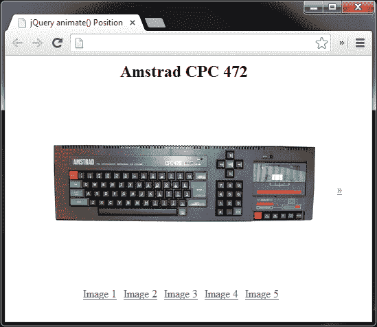
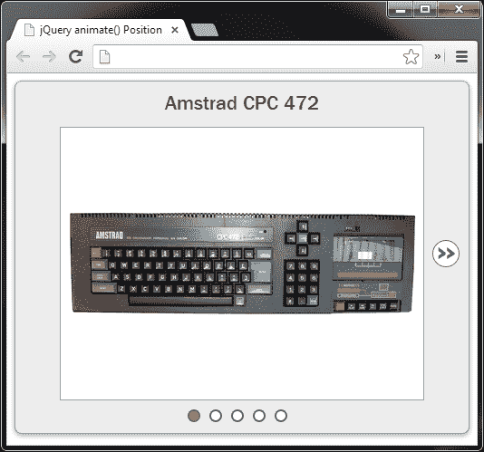
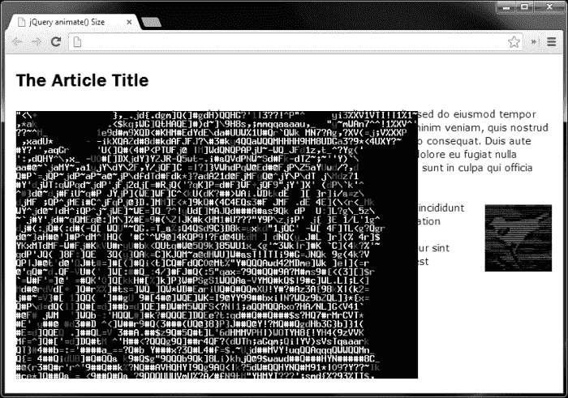
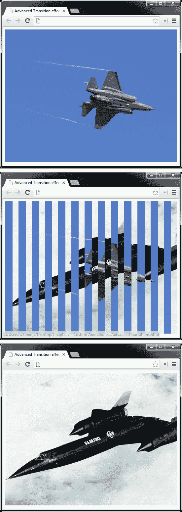
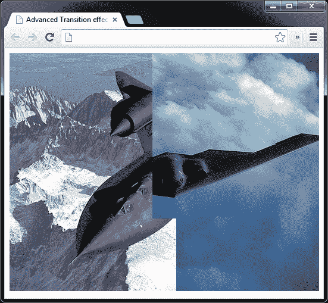

# 七、定制动画

*到目前为止，我们在整本书中看到的预定义效果非常好，但它们是为了满足非常具体的要求，当需要更复杂的动画时，它们有时是不够的。*

*在这些情况下，我们可以使用 jQuery 的`animate()`方法，该方法允许我们轻松定义自定义动画，这些动画可以根据手头的任务要求进行复杂和专门化。这就是我们将在本章中看到的内容。*

在本章的整个课程中，我们将涵盖的主题包括：

*   使用`animate()`方法创建自定义动画
*   向方法传递参数
*   设置元素尺寸的动画
*   设置元素位置的动画
*   创建 jQuery 动画插件
*   使用我们创建的 jQuery 插件

# 动画方法

使用 jQuery 的所有自定义动画都由`animate()`方法驱动。尽管可以为几乎所有具有数值的样式属性设置动画，但此方法使用简单，只需几个参数。此方法可按以下方式使用：

```js
$(elements).animate( properties [,duration] [,easing] [,complete] );
```

第一个参数应该采用对象的形式，其中对象的每个属性都是我们想要设置动画的样式，非常类似于使用 jQuery 的`css()`方法。

正如我前面提到的，这可以是任何采用纯数字参数的 CSS 样式（颜色除外，尽管使用 jQuery UI 库，我们也可以设置颜色动画。有关 jQuery UI 的更多信息，请参见[第 6 章](06.html "Chapter 6. Extended Animations with jQuery UI")、*使用 jQuery UI 扩展动画*。背景位置不能通过 jQuery 本机设置动画，但是手动设置此属性的动画非常容易；有关此技术的更多信息，请参见[第 3 章](03.html "Chapter 3. Background Animation")、*背景动画*。

持续时间、缓和和回调参数采用与我们在本书前面（[第 2 章](02.html "Chapter 2. Image Animation")、*图像动画*中使用的褪色方法相同的格式，并且使用方式完全相同。

## 每个物业

从 jQuery 版本 1.4 开始，您可以在单个`animate()`调用中设置每个属性的函数。因此，例如，如果我们同时设置元素的`width`和`height`参数的动画，我们可以对`width`动画使用`linear`缓和，对`height`动画使用`swing`缓和。这适用于 jQuery 内置的标准放松功能，或者我们在上一章（[第 6 章](06.html "Chapter 6. Extended Animations with jQuery UI")、*jQuery UI 扩展动画*中提到的任何放松功能）。

为了在每个属性的基础上为`animate()`方法提供缓和类型，我们需要提供一个数组作为我们正在设置动画的属性的值。这可以使用以下语法完成：

```js
$(elements).animate({
  property: [value, easingType]
});
```

## animate（）的另一种语法

我们可以将配置对象传递给包含以下配置选项的`animate()`方法，而不是单独使用持续时间、参数和回调参数：

*   `duration`
*   `easing`
*   `complete`
*   `step`
*   `queue`
*   `specialEasing`

前三个选项（`duration`、`easing`和`complete`与我们以标准方式将它们传递到方法中的参数相同。然而，最后三个选项（`step`、`queue`和`specialEasing`很有趣，因为我们没有任何其他方式可以访问它们。

*   `step`选项允许我们指定一个回调函数，该函数将在动画的每个步骤上执行
*   `queue`选项接受一个布尔值，该值控制动画是立即执行还是放入选定元素的队列中
*   `specialEasing`选项允许我们为正在设置动画的每个单独样式属性指定一个放松功能，使用可选语法为每个属性提供放松功能：

    ```js
    The pattern for this second method of usage is as follows:$(elements).animate(properties [,configuration]);
    ```

与大多数（但不是所有）jQuery 方法一样，`animate()`方法返回一个 jQuery 对象，以便将其他方法链接到该对象。与其他效果方法一样，在同一元素上多次调用`animate()`将导致为该元素创建动画队列。如果我们想同时设置两个不同样式属性的动画，我们可以将对象中所有必需的属性作为第一个参数传递给`animate()`方法。

# 设置元素位置的动画

`animate()`方法能够为任何具有数值的 CSS 样式属性（颜色和背景位置除外）的更改设置动画。在本例中，我们将创建一个内容查看器，通过使用`animate()`方法将内容滑入和滑出视图来显示不同的内容面板。

这种类型的小部件通常用于公文包或 showcase 站点，是一种显示大量内容而不使单个页面混乱的有吸引力的方式。在本例中，我们将设置元素位置的动画。

# 行动时间-创建动画内容查看器

我们将再次开始添加底层标记和样式：

1.  内容查看器的基础标记应使用我们的模板文件添加如下：

    ```js
    <div id="slider">
      <div id="viewer">
        
        
        
        
        
      </div>
      <ul id="ui">
        <li class="hidden" id="prev"><a href="" title="Previous">«</a></li>
        <li><a href="#image1" title="Image 1" class="active">Image 1</a></li>
        <li><a href="#image2" title="Image 2">Image 2</a></li>
        <li><a href="#image3" title="Image 3">Image 3</a></li>
        <li><a href="#image4" title="Image 4">Image 4</a></li>
        <li><a href="#image5" title="Image 5">Image 5</a></li>
        <li class="hidden" id="next"><a href="" title="Next">»</a></li>
      </ul>
    </div>
    ```

2.  将文件另存为`animate-position.html`。
3.  接下来，我们应该创建基础 CSS。我的意思是，我们应该添加 CSS，这是内容查看器按预期运行所必需的，而不是为小部件提供主题或外观的样式。在创建插件时，以这种方式分离样式是一种很好的做法，这样小部件就可以与 jQueryUI 的 ThemeRoller 主题化机制兼容。
4.  在文本编辑器的新文件中，添加以下代码：

    ```js
    #slider {
      width:500px;
      position:relative;
    }
    #viewer {
      width:400px;
      height:300px;
      margin:auto;
      position:relative;
      overflow:hidden;
    }
    #slider ul {
      width:295px;
      margin:0 auto;
      padding:0;
      list-style-type:none;
    }
    #slider ul:after {
      content:".";
      visibility:hidden;
      display:block;
      height:0;
      clear:both;
    }
    #slider li {
      margin-right:10px;
      float:left;
    }
    #prev, #next {
      position:absolute;
      top:175px;
    }
    #prev { left:20px; }
    #next {
      right:10px;
    }
    .hidden { display:none; }
    #slide {
      width:2000px;
      height:300px;
      position:absolute;
      top:0;
      left:0;
    }
    #slide img { float:left; }
    #title {
      margin:0;
      text-align:center;
    }
    ```

5.  将其保存在`css`文件夹中为`animate-position.css`，不要忘记从页面的`<head>`标签链接到新样式表。在开始编写脚本之前，现在在浏览器中运行该页面，这样您就可以在没有附带脚本的情况下查看小部件的行为。您应该发现，任何图像都可以通过单击其相应的链接来查看，仅使用 CSS，这在任何浏览器中都可以使用。我们的 CSS 隐藏了上一个和下一个箭头，因为在关闭 JS 的情况下，这些箭头不起作用，当图像标题不显示时，但是，小部件的核心功能仍然是完全可访问的。这被称为**渐进增强**，许多人认为这是 web 开发的最佳实践。

## *刚才发生了什么事？*

本例中的底层 HTML 非常简单。作为一个整体，我们为内容查看器提供了一个外部容器，在这个容器中，我们为内容面板提供了一个容器（本例中为简单图像），并提供了一个导航结构，允许查看不同的面板。

我们在 CSS 文件中为其添加样式规则的一些元素没有硬编码到底层标记中，而是在需要时根据需要创建。这样做可以确保即使访问者禁用了 JavaScript，内容查看器仍然可用。

需要注意的一点是我们创建并环绕图像的`#slide`包装元素具有一个等于单个图像的`height`参数和一个等于所有图像宽度总和的`width`参数。另一方面，`#viewer`元素具有等于单个图像的`width`和`height`参数，因此在任何时间只有一个图像可见。

禁用 JavaScript 时，图像将显示为堆叠在彼此的顶部，但一旦创建了`#slide`包装器元素，图像将设置为浮动以便水平堆叠。

在本例中，我们将使用 easing；因此，请确保在`<body>`标记末尾的 jQuery 引用之后直接链接到 jQuery UI：

```js
<script src="js/jquery-ui.js"></script>
```

# 行动时间–初始化变量并准备小部件

首先，我们需要准备底层标记并存储一些元素选择器。在新创建的 HTML 文件中的匿名函数之间添加以下代码：

```js
$("#viewer").wrapInner("<div id=\"slide\"></div>");

var container = $("#slider"),
  prev = container.find("#prev"),
  prevChild = prev.find("a"),
  next = container.find("#next").removeClass("hidden"),
  nextChild = next.find("a"),
  slide = container.find("#slide"),
  key = "image1",
  details = {
    image1: {
      position: 0, title: slide.children().eq(0).attr("alt")
    },
    image2: {
      position: -400, title: slide.children().eq(1).attr("alt")
    },
    image3: {
      position: -800, title: slide.children().eq(2).attr("alt")
    },
    image4: {
      position: -1200, title: slide.children().eq(3).attr("alt")
    },
    image5: {
      position: -1600, title: slide.children().eq(4).attr("alt")
    }
  };

$("<h2>", {
  id: "title",
  text: details[key].title
}).prependTo("#slider");
```

## *刚才发生了什么事？*

首先，我们首先将`#viewer`中的所有图像包装在一个新容器中。我们将使用此容器设置面板移动的动画。我们为这个新容器提供了一个`id`属性，以便在需要时可以方便地从**文档对象模型**（**DOM**中选择它。

这是我们稍后将在示例中设置动画的元素。

接下来，我们缓存一些需要频繁操作的元素的选择器。我们创建一个指向外部`#slider`容器的 jQuery 对象，然后使用 jQuery`find()`方法选择要缓存的所有元素，如上一个和下一个箭头。

一个`key`变量也被初始化，该变量将用于跟踪当前显示的面板。最后，我们创建一个`details`对象，其中包含内容查看器中每个图像的相关信息。我们可以以像素为单位存储`left`位置，`slide`容器必须设置动画才能显示任何给定的面板，我们还可以存储每个内容面板的标题。

每个面板的标题是从每个图像的`alt`属性读取的，但是如果我们使用其他元素，我们可以选择`title`属性，或者使用 jQuery 的数据方法设置并检索内容的标题。

标题使用的`<h2>`元素是用 JS 创建并插入到内容查看器中的，因为如果不使用 JavaScript，我们无法更改它。因此，当访问者禁用 JS 时，标题是无用的，最好不要显示。

在代码的第一段中，我们要做的最后一件事是从“下一步”按钮中删除`hidden`类名称，以便显示。

上一个链接（我的意思是允许访问者移动到序列中的上一个图像的链接）最初没有显示，因为第一个内容面板始终是页面加载时可见的面板，因此没有要移动到的上一个面板。

# 行动时间–定义动画后回调

接下来，我们需要一个函数，我们可以在每次动画结束时执行。在前面添加的代码下面添加以下代码：

```js
function postAnim(dir) {

  var keyMatch = parseInt(key.match(/\d+$/));

  (parseInt(slide.css("left")) < 0) ? prev.show() : prev.hide();

  (parseInt(slide.css("left")) === -1600) ? next.hide() : next.show();

  if (dir) {
    var titleKey = (dir === "back") ? keyMatch - 1 : keyMatch + 1;
    key = "image" + titleKey;
  }

  container.find("#title").text(details[key].title);

  container.find(".active").removeClass("active");
  container.find("a[href=#" + key + "]").addClass("active");
};
```

## *刚才发生了什么事？*

在代码的第二部分中，我们定义了一个函数，我们将在动画结束后调用该函数。这用于一些内务管理，以完成可能需要重复完成的各种事情；因此，将它们捆绑到单个函数中比在事件处理程序中单独定义它们更有效。这是`postAnim()`功能，它可以接受一个单一参数，该参数表示滑块移动的方向。

我们在这个函数中要做的第一件事是使用正则表达式`/\d+$/`和 JavaScript 的`match()`函数从保存在`key`变量中的字符串末尾解析面板号，我们在代码的第一部分初始化了该变量，该变量将始终引用当前可见的面板。

我们的`postAnim()`函数可以在使用数字链接选择面板时调用，也可以在使用上一个/下一个链接时调用。但是，当使用上一个/下一个链接时，我们需要`key`变量来知道当前正在显示哪个面板，以便移动到下一个或上一个面板。

然后，我们通过检查`#slide`元素的`left`CSS 样式属性来检查第一个面板当前是否正在显示。如果`#slide`元素位于`0`，我们知道第一个面板是可见的，所以我们隐藏上一个链接。如果`left`属性小于`0`，则显示前面的链接。我们做了一个类似的测试来检查最后一个面板是否可见，如果可见，则隐藏下一个链接。上一个和下一个链接只有在当前隐藏时才会显示。

然后检查是否已向函数提供了`dir`（方向）参数。如果有，我们必须通过读取前面创建的`keyMatch`变量来确定现在显示的面板，然后如果`dir`参数等于`back`，则从中减去`1`，如果不等于，则向其中添加`1`。

结果保存回`key`变量，然后用于更新`<h2>`标题元素。当前面板的标题文本是使用`key`变量从我们的`details`对象获得的。最后，我们将类名`active`添加到与可见面板对应的数字链接中。

虽然不是必需的，但当我们向小部件添加皮肤时，我们希望使用它。我们使用与当前链接的`href`属性匹配的属性选择器选择正确的链接。注意，我们在这个函数中没有创建任何新的 jQuery 对象；我们使用缓存的`container`对象和`find()`方法获取我们需要的元素。

# 行动时间–为 UI 元素添加事件处理程序

现在已经创建了滑块，我们可以添加驱动功能的事件处理程序。在我们刚刚添加的函数`postAnim`下插入以下代码：

```js
$("#ui li a").not(prevChild).not(nextChild).click(function(e){
  e.preventDefault();

  key = $(this).attr("href").split("#")[1];

  slide.animate({
    left: details[key].position
  }, "slow", "easeOutBack", postAnim);
});

nextChild.add(prevChild).click(function(e){
  e.preventDefault();

  var arrow = $(this).parent();

  if (!slide.is(":animated")) {
    slide.animate({
      left: (arrow.attr("id") === "prev") ? "+=400" : "-=400"
    }, "slow", "easeOutBack", function(){

      (arrow.attr("id") === "prev") ? postAnim("back") : postAnim("forward")
    });
  }
});
```

## *刚才发生了什么事？*

第一个处理程序绑定到用于显示不同面板的主链接，不包括 jQuery`not()`方法的上一个和下一个链接。我们首先使用`preventDefault()`方法停止链接后的浏览器。

然后，通过从链接的`href`属性中提取面板名称，用正在显示的面板更新`key`变量。我们使用 JavaScript 的`split()`方法只获得面板`id`而不是`#`符号。

最后，我们通过将幻灯片元素的`left`CSS 样式属性设置为从`details`对象提取的值来设置幻灯片元素的动画。我们使用`key`变量访问`position`属性的值。

作为动画的一部分，我们将持续时间配置为`slow`，放松时间配置为`easeOutBack`，并将`postAnim`函数指定为回调函数，以便在动画结束时执行。

最后，我们需要为用于导航到下一个或上一个图像的上一个/下一个链接添加一个单击处理程序。这两个链接可以共享一个单击处理程序。我们可以使用前面的`nextChild`和`prevChild`中的缓存选择器以及 jQuery 的`add()`方法选择这两个链接，将它们添加到一个 jQuery 对象中，以便将处理程序函数附加到两个链接上。

我们再次使用`preventDefault()`停止浏览器跟随链接。然后，我们使用`arrow`变量缓存对所单击链接的父链接的引用，以便稍后在函数中轻松引用它。这是必需的，因为在`animate()`方法的回调函数中，`$(this)`关键字的作用域将是被单击链接的`#slide`元素，而不是。

然后，我们检查`#slide`元素是否已使用`:animated`过滤器设置动画。此检查非常重要，因为可以防止浏览者在重复单击其中一个链接时中断。

如果尚未设置动画，则执行动画并将幻灯片元素向后或向前移动`400`像素（单个内容面板的`width`参数）。我们可以通过查看`arrow`变量引用的元素的`id`属性来检查单击了哪个箭头。

我们在动画方法中指定了与之前相同的持续时间和松弛值，但是我们没有将对`postAnim`函数的引用作为回调参数传递，而是传递了一个匿名函数。在这个匿名函数中，我们确定单击了哪个链接，然后使用适当的参数调用`postAnim`函数。记住，这对于为`details`对象获取正确的密钥是必要的，因为上一个链接和下一个链接都没有指向图像的`href`属性。

此时，在浏览器中尝试该页面，您会发现通过点击任何链接（包括上一个和下一个链接）可以查看图像。这是小部件在此阶段的显示方式：



上一个屏幕截图显示小部件处于未蒙皮状态，只有 JavaScript 才需要它来功能。

# 为小部件蒙皮

曾经有人宣称“剥猫皮的方法不止一种”，这同样适用于小部件和猫。最后，让我们为小部件添加一些自定义样式，看看让小部件既有吸引力又有功能是多么容易。可以很容易地更改这些样式，以重新对小部件进行蒙皮，使其具有完全不同的外观。

# 行动时间-添加新皮肤

在`animate-position.css`文件的底部，添加以下代码：

```js
a { outline:0 none; }
#slider {
  border:1px solid #999;
  -moz-border-radius:8px;
  -webkit-border-radius:8px;
  border-radius:8px;
  background-color:#ededed;
  -moz-box-shadow:0 2px 7px #aaa;
  -webkit-box-shadow:0 2px 7px #aaa;
  box-shadow:0 2px 7px #aaa;
}
#title, #slider ul {
  margin-top:10px;
  margin-bottom:12px;
}
#title {
  font:normal 22px "Nimbus Sans L", "Helvetica Neue",
  "Franklin Gothic Medium", Sans-serif;
  color:#444;
}
#viewer {
  border:1px solid #999;
  background-color:#fff;
}
#slider ul { width:120px; }
#slider ul li a {
  display:block;
  width:10px;
  height:10px;
  text-indent:-5000px;
  text-decoration:none;
  border:2px solid #666;
  -moz-border-radius:17px;
  -webkit-border-radius:17px;
  border-radius:17px;
  background-color:#fff;
  text-align:center;
}
#slider #prev, #slider #next {
  margin:0;
  text-align:center;
}
#slider #prev { left:10px; }
#slider #prev a, #slider #next a {
  display:block;
  height:28px;
  width:28px;
  line-height:22px;
  text-indent:0;
  border:1px solid #666;
  -moz-border-radius:17px;
  -webkit-border-radius:17px;
  border-radius:17px;
  background-color:#fff;
}
#prev a, #next a {
  font:bold 40px "Trebuchet MS", sans-serif;
  color:#666;
}
#slider ul li a.active { background-color:#F93; }
```

## *刚才发生了什么事？*

有了这段代码，我们对小部件的所有视觉方面都进行了样式化，而不干扰控制其工作的任何东西。我们给它一些漂亮的圆角，并在小部件上添加阴影，将数字链接变成可点击的小图标，并设置上一个和下一个链接的样式。颜色和字体也在本节中设置，因为它们显然也高度依赖于主题。

这些样式为小部件添加了一个基本的中性主题，如以下屏幕截图所示：



我们用来创建主题的样式完全是任意的，只是为了示例的目的。它们可以在任何给定的实现中更改为我们需要的任何内容，以适应页面上的其他元素、或网站的总体主题。

## 突击测验–创建动画内容查看器

问题 1。`animate()`方法可以传递哪些参数？

1.  一个数组，其中数组项是要设置动画的元素、持续时间、缓和时间和回调函数
2.  第一个参数是一个对象，其中包含要设置动画的样式属性，可以选择后跟持续时间、缓和类型和回调函数
3.  一个对象，其中每个属性都引用要设置动画的样式属性、持续时间、缓和和回调函数
4.  必须返回要设置动画的样式属性、持续时间、缓和和回调函数的函数

问题 2。`animate()`方法返回什么？

1.  包含已设置动画的样式特性的数组
2.  包含已设置动画的元素的数组
3.  用于链接的 jQuery 对象
4.  指示动画是否成功完成的布尔值

## 拥有一个英雄——让图像查看器更具可伸缩性

在我们的动画内容查看器中，我们有固定数量的图像和硬编码的导航结构来访问它们。扩展内容查看器，使其能够处理数量不确定的图像。为此，您需要完成以下任务：

*   在运行时确定 content viewer 中的图像数量，并根据图像数量设置`#slide`包装器元素的`width`参数
*   根据图像数量动态构建导航链接
*   根据图像数量动态创建`details`对象，并设置正确的`left`属性来显示每个图像

# 设置元素大小的动画

如本章开头所述，几乎所有包含纯数值的样式属性都可以使用`animate()`方法设置动画。

我们通过操纵元素的`left`样式属性来设置元素位置的动画，接下来我们通过操纵其`height`和`width`样式属性来设置元素大小的动画。

在本例中，我们将创建图像包装器，可以通过操纵元素的大小来显示页面上任何图像的更大版本。

# 行动时间-创建基础页面和基本样式

首先，我们将创建基础页面，示例将在该页面上运行。

1.  将以下 HTML 添加到我们模板文件的`<body>`标记中：

    ```js
    <article>
      <h1>The Article Title</h1>
      <p>Lorem 
        ipsum dolor...</p>
      <p>Lorem
      ipsum dolor...</p>
    </article>
    ```

2.  将示例页面另存为`animate-size.html`。在本例中，我们将保持样式灯；在文本编辑器中的新文件中，添加以下代码：

    ```js
    article {
      display:block;
      width:800px;
      margin:auto;
      z-index:0;
      font:normal 18px "Nimbus Sans L", "Helvetica Neue",
        "Franklin Gothic Medium", sans-serif;
    }
    article p {
      margin:0 0 20px;
      width:800px;
      font:15px Verdana, sans-serif;
      line-height:20px;
    }
    article p #image2-thumb {
      float:right;
      margin:6px 0 0 30px;
    }
    img.expander {
      margin:6px 30px 1px 0;
      float:left;
    }
    .expander-wrapper {
      position:absolute;
      z-index:999;
    }
    .expander-wrapper img {
      cursor:pointer;
      margin:0;
      position:absolute;
    }
    .expander-wrapper .expanded { z-index:9999; }
    ```

3.  将文件另存为`css`文件夹中的`animate-size.css`。

## *刚才发生了什么事？*

HTML 可以是由一些文本和一些图像组成的任何简单的博客文章。需要注意的是，每个图像都被赋予了一个`id`属性，以便于参考，并且每个图像实际上是图像的全尺寸版本，使用`width`和`height`属性进行缩小。

使用的样式纯粹是为了展示示例；使示例工作实际上只需要很少的代码。需要`expander-wrapper`样式来正确定位重叠图像，但除此之外，样式完全是任意的。

我们将第二个图像浮动到右侧。同样，这不是严格必要的；这只是为了让这个例子更有趣一点。

# 行动时间–定义图像的大小

首先，我们需要指定每个图像的全尺寸和小尺寸。将下面的代码放入我们刚刚创建的 HTML 文件中的匿名函数中：

```js
var dims = {
  image1: {
    small: { width: 150, height: 100 },
    big: { width: 600, height: 400 }
  },
  image2: {
    small: { width: 100, height: 100 },
    big: { width: 400, height: 400 }
  }
},
webkit = ($("body").css("-webkit-appearance") !== "" && $("body").css("-webkit-appearance") !== undefined) ? true : false;
```

## *刚才发生了什么事？*

我们创建了一个对象，其中包含与每个图像的文件名匹配的属性。每个属性包含另一个嵌套对象，该对象具有`small`和`big`属性以及作为值的相关整数。这是一种方便的存储结构化信息的方法，可以在脚本的不同位置轻松访问这些信息。

我们还创建了一个名为`webkit`的变量。在基于 WebKit 的浏览器中，如何处理浮动到右侧的图像存在一个小错误。此变量将包含一个布尔值，用于指示 WebKit 是否正在使用。

执行一个测试，尝试读取`-webkit-appearance`CSS 属性。在 WebKit 浏览器中，由于未设置属性，测试将返回`none`，但其他浏览器将返回空字符串或值`undefined`。

# 行动时间-创建覆盖图像

接下来，我们应该为页面上的每个图像创建一个几乎完全相同的副本，用作覆盖层。在我们刚刚添加到 HTML 文件的代码下面添加以下代码：

```js
$(".expander").each(function(i) {

  var expander = $(this),
    coords = expander.offset(),
    copy = $("", {
      id: expander.attr("id").split("-")[0],
      src: expander.attr("src"),
      width: expander.width(),
      height: expander.height()
    });
```

## *刚才发生了什么事？*

在`<script>`标记的这一部分中，我们选择了页面上的每个图像，并使用 jQuery 的`each()`方法对它们进行处理。我们设置了一些变量，缓存了对当前图像的引用，并使用 jQuery`offset()`方法将其坐标存储在相对于文档的页面上。

然后，我们为页面上的每个现有图像创建一个新图像，赋予它一个`id`属性，将其与覆盖的图像、原始图像的`src`变量以及原始图像的`width`和`height`参数配对。当我们设置新图像的`id`属性时，我们使用 JavaScript 的`split()`函数删除字符串中显示`thumb`的部分。

### 注

请注意，前面的代码并不代表完整功能代码的整个片段。传递给`each()`方法的外部函数尚未关闭，因为我们需要在这些变量之后添加一些额外的代码。

# 行动时间-创建覆盖包装

我们现在需要为每个覆盖图像创建包装器（注意，此代码仍在`each()`方法中，因此将为每个具有`expanded`类名的图像执行）。在我们刚刚添加的`each`函数的最后一行正下方添加以下代码：

```js
  $("<div></div>", {
    "class": "expander-wrapper",
    css: {
      top: coords.top,
      left: (webkit === true && expander.css("float") === "right") ? (coords.left + expander.width()) : coords.left,direction: (expander.css("float") === "right") ? "rtl" : "ltr"
    },
    html: copy,
    width: expander.width(),
    height: expander.height(),
    click: function() {

      var img = $(this).find("img"),
        id = img.attr("id");

      if (!img.hasClass("expanded")) {
        img.addClass("expanded").animate({
          width: dims[id].big.width,
          height: dims[id].big.height
        }, {
          queue: false
        });
      } else {
        img.animate({
          width: dims[id].small.width,
          height: dims[id].small.height
        }, {
          queue: false,
          complete: function() {
            $(this).removeClass("expanded");
          }
        });
      }
    }
  }).appendTo("body");
```

## *刚才发生了什么事？*

在这段代码中，我们为新图像创建包装器元素。我们给它一个新的类名，以便它可以正确定位。

### 提示

**引用类别属性**

我们需要在属性名`class`周围使用引号，因为它是 JavaScript 中的保留字，如果不这样做，可能会抛出脚本错误。

我们使用`css`属性以及我们从前面的`offset()`方法获得的坐标来设置包装器元素的位置。

在设置 wrapper 元素的`left`位置时，我们需要检查`webkit`变量以查看是否正在使用 Safari 或 Chrome。如果该变量设置为`true`，且图像向右浮动，则除了原始图像的`width`参数外，我们根据`cords.left`值定位覆盖。如果`webkit`变量为`false`，或者原始图像浮动`left`，我们只需将包装的`left`位置设置为`coords.left`中存储的值即可。

我们还需要设置浮动图像的`direction`属性。我们检查`float`样式属性，如果图像浮动正确，则将`direction`设置为`rtl`，否则将`ltr`设置为`ltr`。这是使用 JavaScript 完成的，JavaScript 是一个三元条件。

完成此检查后，当图像浮动`right`时，包装从右向左展开。如果我们没有设置，包装器将从左到右打开，这可能使全尺寸图像溢出视口，或者内容容器导致滚动条。

我们通过将对新图像的引用传递到 jQuery`html()`方法中，将新图像添加到包装器中，并将包装器的`width`参数设置为原始（和新）图像的`width`参数。这对于覆盖正确定位在任何向右浮动的图像上是必要的。

接下来，我们向包装器添加一个单击处理程序。在作为`click()`方法的值传递的匿名函数中，我们首先在单击的包装器中缓存一个对图像的引用，并为方便起见获取图像的`id`属性。请记住，覆盖图像的`id`属性将与其覆盖的原始图像相同，减去文本字符串`-thumb`。

然后检查图像是否有类名`expanded`。如果没有，我们添加类名，然后使用`animate()`方法的第二种格式将图像设置为全尺寸。我们将两个对象作为参数传递到方法中；第一个包含我们希望设置动画的 CSS 属性，在本例中是图像的`width`和`height`参数。

使用单击的图像的`id`属性作为键，从`dims`对象检索用于增加图像的正确`width`和`height`参数。在传递给`animate()`方法的第二个对象中，我们将`queue`属性设置为`false`。这与直接在`animate()`方法之前使用`stop()`方法具有相同的效果，并确保在重复单击覆盖包装器时不会发生任何错误。

如果图像已经有了类名`expanded`，我们会将图像设置回小尺寸。同样，我们使用`animate()`方法的双对象格式，提供`false`作为`queue`属性的值，并在传递给`complete`属性的匿名回调函数中删除类名`expanded`。创建包装后，我们将其附加到页面的`<body>`标记。

在这一点上，我们编写的代码将按预期工作，单击图像将导致扩展版本被设置为全尺寸动画。但是，如果页面完全调整大小，覆盖层将不再覆盖其图像。

# 行动时间-保持覆盖位置

因为覆盖层是绝对定位的，所以如果调整窗口大小，我们需要防止发生错位：

```js
$(window).resize(function() {

  $("div.expander-wrapper").each(function(i) {

    var newCoords = $("#image" + (i + 1) + "-thumb").offset();

    $(this).css({
      top: newCoords.top,
      left: newCoords.left
    });
  });
});
```

## *刚才发生了什么事？*

我们需要做的就是确保页面调整大小时覆盖图像直接位于原始图像之上，这可以通过将调整大小事件的处理程序绑定到`window`对象来实现。在 handler 函数中，我们只需获得底层图像的新坐标，并相应地设置包装的`top`和`left`属性。请注意，我们不会为覆盖的重新定位设置动画。

保存文件并在浏览器中预览。我们应该发现，我们可以单击任一图像，它将展开以显示图像的全尺寸版本，第一个图像向右展开，第二个图像向左展开：



在上一个屏幕截图中，我们看到了第一张图像，它扩展到了最大尺寸。

## 突击测验–创建扩展图像

问题 1。在本例中，我们对传递给`animate()`方法的参数使用了不同的格式。这些论点采取了什么形式？

1.  两个数组，其中第一个数组包含要设置动画的元素的选择器，第二个数组包含持续时间、缓和时间、`specialEasing`字符串和回调函数
2.  一个对象，包含要设置动画的样式属性、持续时间、缓和和`specialEasing`字符串，以及`step`和`complete`回调函数
3.  一个必须返回要设置动画的样式属性、持续时间和字符串以及回调函数的函数
4.  两个对象，其中第一个对象包含要设置动画的样式属性，第二个对象包含持续时间、缓和时间和`specialEasing`字符串、指示是否将重复`animate()`调用排队的布尔值以及步骤和完整回调函数

问题 2。在动画的回调函数中，关键字`this`的作用域是什么？

1.  已设置动画的元素
2.  当前窗口
3.  已设置动画的元素的容器
4.  事件对象

## 拥有一个英雄——清除硬编码的 dims 对象

在上一个示例中，我们将一个图像硬编码到脚本的顶部，该脚本用于告诉`animate()`方法图像应设置动画的大小。虽然这对于本例来说很好，但它并不是一个真正的长期解决方案，因为我们必须记住每次使用脚本时都要设置它（或者确保图像始终具有固定大小）。

问题是，我们无法通过编程从单个图像获得完整大小和拇指大小。好消息是，可以存储在 JavaScript 对象中的任何数据也可以通过网络作为 JSON 对象传递。扩展此示例，以便当页面加载时，它将页面上图像的`src`属性传递给服务器，服务器返回一个包含大小图像的 JSON 对象。一个用于 PHP、ImageResizer 或.NET 中的`System.Drawing.Image`类型的图像处理库，如 GD 或 ImageMagick，将是您的朋友。

# 创建 jQuery 动画插件

插件是一种很好的方式，可以将功能打包到一个易于部署和共享的代码模块中，用于特定用途。jQuery 提供的`fn.extend()`方法正是为了实现这一目的，使得创建功能强大、高效、易于分发和使用的插件变得容易。

在创建 jQuery 插件时，应该遵循一些准则。详情如下:

*   像其他 jQuery 方法一样调用的新方法，例如`$(elements).newMethod()`、应该附加到`fn`对象，插件使用的新函数，例如`$.myFunction()`、应该附加到`jQuery`对象
*   新的方法和函数应始终以分号（`;`结尾），以便在压缩插件时保留功能
*   在方法内部，`this`关键字总是指当前选择的元素，方法应该总是返回`this`以保留链接
*   始终将新方法和函数附加到`jQuery`对象而不是`$`别名，除非使用匿名函数和别名`$`对象

在本节中，我们将创建一个插件，用于在显示一系列图像时创建高级过渡效果。完成的小部件在某些方面与我们之前创建的图像查看器类似，但不会为图像本身设置动画。相反，它将在显示它们之间应用过渡效果。

# 是时候采取行动了——创建一个测试页面并添加一些样式

再次，我们将首先创建示例页面和基本样式，最后添加脚本。

1.  这个示例的底层 HTML 非常简单。在模板文件的`<body>`标记中，我们只需要以下元素：

    ```js
    <div id="frame">
        
        
        
        
        
    </div>
    ```

2.  将此页面另存为`advanced-transitions.html`。
3.  与标记一样，插件所依赖的 CSS 也应该尽可能少。幸运的是，我们的小元素集合不需要太多 CSS。
4.  在您的文本编辑器中将以下代码添加到新文件中：

    ```js
    #frame {
      position:relative;
      width:520px;
      height:400px;
      z-index:0;
    }
    #frame img {
      position:absolute;
      top:0;
      left:0;
      z-index:1;
    }
    #frame img.visible { z-index:2; }
    #frame a {
      display:block;
      width:50%;
      height:100%;
      position:absolute;
      top:0;
      z-index:10;
      color:transparent;
      background-image:url(transparent.gif);
      filter:alpha(opacity = 0);
      text-align:center;
      text-decoration:none;
      font:90px "Palatino Linotype", "Book Antiqua",
        Palatino, serif;
      line-height:400%;
    }
    #frame a:hover {
      color:#fff;
      text-shadow:0 0 5px #000;
      filter:alpha(opacity=100);
      filter:Shadow(Color=#000, Direction=0);
    }
    #frame a:focus { outline:none; }
    #prev { left:0; }
    #next { right:0; }
    #overlay {
      width:100%;
      height:100%;
      position:absolute;
      left:0;
      top:0;
      z-index:3;
    }
    #overlay div { position:absolute; }
    ```

5.  将其保存在`css`文件夹中为`advanced-transitions.css`。

## *刚才发生了什么事？*

我们在底层页面上的所有内容都是我们希望在容器中进行转换的图像。最好保持插件的标记要求尽可能简单，以便其他人易于使用，并且不会对他们想要使用的元素或结构施加不适当的限制。

使用 CSS 将图像绝对放置在容器中，这样它们就可以堆叠在一起，我们在第一个元素上设置了我们的`visible`类，以确保一个图像高于堆栈中的其他图像。

大多数样式都指向上一个和下一个锚点，我们将使用插件创建这些锚点。这些设置使得每个容器正好占据容器的一半，并且放置在并排出现的位置。我们设置了这些链接的`z-index`属性，以便它们出现在所有图像之上。`font-size`属性大幅提升，过多的`line-height`意味着我们不需要将文本与`padding`中间对齐。

在大多数浏览器中，我们只需将锚定的`color`属性设置为`transparent`，这将隐藏锚定。然后，我们在`hover`状态下将`color`属性设置为白色。但是，这在 IE 中不太适用，因此我们先用微软的`opacity``filter`将链接设置为透明，然后在`hover`状态下将链接设置为完全不透明，这也是同样的目的。

### 注

**另一个 IE 特定修复**

IE 也给我们带来了另一个问题：由于链接的绝对位置，链接的可点击区域只会扩大其中文本的高度。我们可以通过设置对背景图像的引用来克服这个问题。

最好的一点是，图像甚至不需要存在，修复程序就可以工作（因此，在本书的配套代码包中，您将找不到相应的`transparent.gif`文件）。修复对普通浏览器没有有害影响。

# 创建插件

现在，让我们创建插件本身。与我们所看到的大多数其他示例代码不同，我们插件的代码将进入它自己的单独文件中。

# 行动时间–添加许可证并定义可配置选项

在一个新文件中，为插件创建以下外部结构，并将其保存在我们的`js`文件夹中，名称为`jquery.tranzify.js`：

```js
/*
  Plugin name jQuery plugin version 1.0

  Copyright (c) date copyright holder

  License(s)

*/

;(function($) {

  $.tranzify = {

    defaults: {
      transitionWidth: 40,
      transitionHeight: "100%",
      containerID: "overlay",
      transitionType: "venetian",
      prevID: "prev",
      nextID: "next",
      visibleClass: "visible"
    }
  };

})(jQuery);
```

## *刚才发生了什么事？*

所有插件都应该包含关于插件名称、版本号、版权所有者（通常是代码的作者）以及它发布的一个或多个许可证的条款或条款链接的信息。

插件被封装在一个匿名函数中，这样它的变量就不会受到其他代码的影响，这些代码可能会在它部署的页面上使用。它的前面还有一个分号，以确保它在潜在的缩减后仍然是一个离散的代码块，以防它与其他比我们自己编写的代码更不严谨的代码一起使用。

为了在我们的函数中安全地使用，我们还为`$`字符添加了别名，以确保它不会被页面上运行的任何其他库劫持，并保留 jQuery 的`noConflict()`方法的功能。

将插件尽可能地配置成可配置的插件，以便最终用户可以调整它们以满足自己的需求，这是一个很好的实践。为了方便这一点，我们应该为任何可配置选项提供一组默认值。当决定什么是可配置的时，一个很好的经验法则是将纯逻辑硬编码到插件中。因此，ID、类名和任何类似的内容都应该是可配置的。

我们为插件设置的默认值存储在一个对象中，该对象本身存储为传递到函数中的`jQuery`对象的属性。添加到`jQuery`对象的属性称为`tranzify`，是我们插件的名称，将用于存储我们创建的属性、函数和方法，以便我们所有的代码都位于一个名称空间中。

我们的默认属性包含在一个单独的对象中，称为`defaults`，在`tranzify`对象中。我们设置转换元素的`width`和`height`参数、创建的容器的`id`属性、默认转换、上一个和下一个链接的`id`属性，以及我们为当前显示的图像指定的类名。

正如我提到的，如果可能的话，最好不要将任何`id`值或类名硬编码到插件中。实现插件的人可能已经在页面上有一个`id`属性为`overlay`的元素，例如，所以我们应该给他们的选项，如果需要的话可以进行更改。

# 是时候采取行动了——将我们的插件方法添加到 jQuery 名称空间中

接下来，我们可以添加将插入我们的插件到 jQuery 名称空间的代码，以便可以像其他 jQuery 方法一样调用它。在我们刚刚添加的代码的最后一行的正上方添加以下代码：

```js
$.fn.extend({
  tranzify: function(userConfig) {

    var config = (userConfig) ? $.extend({}, $.tranzify.defaults, userConfig) : $.tranzify.defaults;

    config.selector = "#" + this.attr("id");
    config.multi = parseInt(this.width()) / config.transitionWidth;

    $.tranzify.createUI(config);

    return this;
  }
});
```

## *刚才发生了什么事？*

jQuery 提供了`fn.extend()`方法专门用于添加可以链接到`jQuery()`函数的新方法，这就是大多数插件的创建方式。我们将函数定义为传递给`extend()`方法的对象的唯一属性值。我们还指定该方法可以使用一个参数，该参数可能是使用插件更改我们设置的默认属性的人传递到该方法中的配置对象。

我们的方法所做的第一件事是检查配置对象是否已传递到该方法中。如果有，我们使用`extend()`方法（而不是`fn.extend()`方法）将用户的配置对象与我们自己的`defaults`对象合并。

通过合并这两个对象创建的结果对象存储在变量`config`中，以便于我们的函数访问。`userConfig`对象中的任何属性都将覆盖存储在`defaults`对象中的属性。将保留在`defaults`对象中找到的属性，但不保留`userConfig`对象中找到的属性。如果没有`userConfig`对象传入方法，我们只需将`defaults`对象赋给`config`变量即可。

接下来，我们构建了一个`id`选择器，该选择器与调用的方法元素相匹配，并将其作为一个额外属性添加到`config`对象中，以便于在整个插件中使用。我们不能将其存储为默认属性，因为它在插件使用的每个页面上都可能不同，我们也不能期望插件用户每次使用插件时都必须在配置对象中定义它。

我们需要创建的过渡元素的数量取决于图像的大小和过渡元素的宽度（定义为可配置属性），因此我们根据图像的宽度计算了一个快速乘数，然后配置了过渡宽度以供以后使用。

接下来，我们调用了将创建上一个/下一个链接的函数（我们将很快定义它），并传递了函数`config`对象，以便它可以读取用户配置的任何属性。

最后，我们返回 jQuery 对象（该对象在我们的插件方法中自动分配给`this`关键字的值）。这是为了保留链接，以便用户可以在调用我们的插件后调用其他 jQuery 方法。

# 行动时间-创建 UI

接下来，我们需要创建覆盖在图像上方的上一个和下一个链接，并允许访问者循环浏览图像。在我们刚刚添加的`$.fn.extend()`部分下面添加以下代码块：

```js
$.tranzify.createUI = function(config) {
  var imgLength = $(config.selector).find("img").length,
    prevA = $("<a></a>", {
    id: config.prevID,
    href: "#",
    html: "«",
    click: function(e) {
      e.preventDefault();

      $(config.selector).find("a").css("display", "none");

      $.tranzify.createOverlay(config);

      var currImg = $("." + config.visibleClass, $(config.selector));
      if(currImg.prev().filter("img").length > 0) {
        currImg.removeClass(config.visibleClass).prev().addClass(config.visibleClass);
      } else {
        currImg.removeClass(config.visibleClass);
        $(config.selector).find("img").eq(imgLength - 1).addClass(config.visibleClass);
      }

      $.tranzify.runTransition(config);

    }
  }).appendTo(config.selector),

  nextA = $("<a></a>", {
    id: config.nextID,
    href: "#",
    html: "»",
    click: function(e) {
      e.preventDefault();
      $(config.selector).find("a").css("display", "none");

      $.tranzify.createOverlay(config);

      var currImg = $("." + config.visibleClass, $(config.selector));

      if(currImg.next().filter("img").length > 0) {
        currImg.removeClass(config.visibleClass).next().addClass(config.visibleClass);
      } else {
        currImg.removeClass(config.visibleClass);
        $(config.selector).find("img").eq(0).addClass(config.visibleClass);
      }

      $.tranzify.runTransition(config);
    }
  }).appendTo(config.selector);
};
```

## *刚才发生了什么事？*

这是迄今为止我们最大的函数，用于创建上一个和下一个链接，以及在创建过程中使用 jQuery 语法定义它们的单击处理程序。我们要做的第一件事是获取容器中的图像数量，因为我们添加的单击处理程序需要知道这一点。

我们为上一个链接创建锚，在作为第二个参数传递的对象中，我们定义`id`属性（使用`config`对象的值）、一个伪`href`、一个 HTML 实体作为其`innerHTML`和一个点击处理程序。

在点击处理程序中，我们使用`preventDefault()`方法停止链接后的浏览器，然后隐藏上一个和下一个链接，以防止小部件多次点击，因为这将中断转换。

接下来，我们调用`createOverlay()`函数，将`config`对象传递给它，以创建覆盖容器和过渡元素。我们还使用存储在`config`对象中的类名缓存对当前选定图像的引用。

然后，我们测试在可见图像之前是否存在另一个图像元素。如果有，我们将从当前拥有该类的元素中删除该类，并将其交给上一个映像，以便将其放在堆栈的顶部。如果在当前图像之前没有任何图像，我们将从当前图像中删除`visible`类，并移动到容器中的最后一个图像以显示该类。

一旦我们定义了所需的一切，我们就可以将新的锚点附加到指定的容器中。我们还将在当前函数中创建下一个链接，并为其提供一组非常相似的属性和一个单击处理程序。这个单击处理程序的所有不同之处在于，我们在当前图像之后测试一个图像，如果没有图像，则移动到容器中的第一个图像。

# 行动时间-创建过渡覆盖

我们的下一个功能将处理创建覆盖和过渡元素：

```js
$.tranzify.createOverlay = function(config) {

  var posLeftMarker = 0,
    bgHorizMarker = 0

  overlay = $("<div></div>", {
    id: config.containerID
  });

  for (var x = 0; x < config.multi; x++) {

    $("<div></div>", {
      width: config.transitionWidth,
      height: config.transitionHeight,
      css: {
        backgroundImage: "url(" + $("." + config.visibleClass, $(config.selector)).attr("src") + ")",
        backgroundPosition: bgHorizMarker + "px 0",
        left: posLeftMarker,
        top: 0
      }
    }).appendTo(overlay);
      bgHorizMarker -=config.transitionWidth;
    posLeftMarker +=config.transitionWidth; 

  }
  overlay.insertBefore("#" + config.prevID);
};
```

## *刚才发生了什么事？*

我们前面的函数处理了创建覆盖容器和提供过渡动画的过渡元素。插件需要对每个过渡元素的`position`和`background-position`属性进行不同的设置，以便水平堆叠元素。我们需要几个计数器变量来完成这项工作，所以我们在函数开始时初始化它们。

然后，我们创建覆盖容器`<div>`并只给它一个`id`属性，这样我们可以在运行转换时轻松地选择它。

接下来，我们创建过渡元素。为此，我们使用了一个标准的 JavaScript`for`循环，根据我们在脚本前面设置的乘数，它会被执行多次。在循环的每次迭代中，我们都会创建一个新的`<div>`，它根据存储在配置对象中的属性设置其`width`和`height`参数。

我们使用`css()`方法将叠加的`backgroundImage`属性设置为当前可见图像，并根据`bgHorizMarker`计数器变量的当前值设置`backgroundPosition`属性。我们还根据`posLeftMarker`变量设置`left`属性以正确定位新元素，并将`top`属性设置为`0`以确保正确定位。

创建之后，我们将新元素附加到容器中并增加计数器变量。一旦循环退出并且我们已经创建了所有的转换元素并将其附加到容器中，我们就可以将容器附加到调用该方法的页面上的元素中。

# 行动时间–定义过渡

最终功能将执行实际转换：

```js
$.tranzify.runTransition = function(config) {
  var transOverlay = $("#" + config.containerID),
    transEls = transOverlay.children(),
    len = transEls.length - 1;

    switch(config.transitionType) {
      case "venetian": 
      transEls.each(function(i) {
        transEls.eq(i).animate({
          width: 0
        }, "slow", function() {

          if (i === len) {
            transOverlay.remove();
            $(config.selector).find("a").css("display", "block");
          }
        });
      });
      break;
      case "strip":
      var counter = 0;

    function strip() {
      transEls.eq(counter).animate({
        height: 0
      }, 150, function() {

        if (counter === len) {
          transOverlay.remove();
          $(config.selector).find("a").css("display", "block");
        } else {
          counter++;
          strip();
        }
      });
    }
    strip();
  }
};
```

## *刚才发生了什么事？*

我们的最后一个函数处理实际运行的转换。在本例中，只有两种不同类型的过渡，但我们可以轻松地扩展它以添加更多过渡效果。

这个函数还需要一些变量，所以我们在函数开始时设置这些变量，以供以后使用。我们缓存对覆盖容器的引用，因为我们将多次引用它。我们还存储转换元素的集合和转换元素的数量。我们从子项的数量中减去`1`，因为这个数字将与 jQuery 的`eq()`方法一起使用，该方法是基于零的。

为了确定要运行哪些转换，我们使用 JavaScript 的`switch`语句并检查`config.transitionType`属性的值。第一个转变是一种**威尼斯盲**效应。要运行此转换，我们只需使用 jQuery 的`each()`方法将每个元素的`width`参数设置为`0`。我们指定为该方法参数的函数自动接收当前元素的索引，我们使用`i`访问该索引。

在每个动画的回调函数中，我们检查`i`是否等于过渡元素集合的`length`，如果等于，则移除覆盖并再次显示上一个和下一个链接。

第二次转换一次删除一条旧图像。为此，我们使用一个简单的`counter`变量和一个标准 JavaScript 函数。这次我们不能使用`each()`方法，否则所有的过渡元素都会一起向下滑动，但我们希望每个元素都能自己向下滑动。

在函数中，我们将当前过渡元素的高度设置为`0`，并设置一个较低的持续时间，以便它相当快地发生。如果动画太慢，则会破坏效果。在回调函数中，我们检查`counter`变量是否等于转换元素的数量，如果是，则移除覆盖并再次显示链接。如果此时`counter`变量还没有到达最后一个元素，我们将增加`counter`变量并再次调用函数。

将此文件另存为`js`文件夹中的`jquery.tranzify.js`。这是 jQuery 插件的标准命名约定，应该遵守。

# 使用插件

要使用插件，我们只需在 ready 函数或匿名函数中调用它，就像调用任何其他 jQuery 方法一样，如下所示：

```js
<script>
  $(function() {   
    $("#frame").tranzify();
  });
</script>
```

在此表单中，将使用默认属性。如果要更改其中一个属性，只需提供一个配置对象，例如：

```js
$("#frame").tranzify({
  transitionType: "strip"
});
```

默认动画应运行如下内容：



在上一张截图中，我们看到过渡元素同时收缩到`0``width`，产生了一种像打开百叶窗以展示新图像的效果。

使用插件很简单；只有一点需要记住。所有图像的大小都应该相同，并且每个图像的`width`参数应该完全可以被`transitionWidth`属性整除。由于已经将`transitionWidth`属性公开为可配置属性，我们应该能够使用任意大小的图像，并相应地进行设置。

作为参考，第二个过渡效果是这样运行的，旧图像的条带滑开以显示新图像：



在前面的屏幕截图中，我们可以看到第二种过渡类型的效果，旧图像被剥离以显示新图像。

## 突击测验–创建插件

问题 1。插件方法和函数之间有什么区别？

1.  在概念上和实践上没有区别，它们是相同的
2.  方法能够接受参数，而函数不能
3.  方法执行得更快
4.  方法附加到`fn`对象，并像现有 jQuery 方法一样使用，而函数直接附加到 jQuery 对象，并像任何普通函数一样调用

问题 2。每个新方法必须返回什么？

1.  包含所选元素的`id`属性的字符串
2.  包含所选元素的`id`属性的数组
3.  `this`对象，指向当前选定的元素
4.  任何东西都不应归还

## 拥有一个 go hero–扩展插件

我们的插件目前只包含两个过渡效果（威尼斯人和条纹）。扩展插件以包含更多您自己设计的过渡效果。该插件当前创建了许多过渡元素，这些元素是每个图像的完整高度。

通过将我们现有的`for`循环包装在另一个`for`循环中，并为`top`位置和垂直`background-position`添加一些新的计数器变量，以棋盘形式添加方形过渡元素相对容易，从而打开了更复杂和更吸引人的过渡效果的可能性。这样做。

# 总结

在本章中，我们介绍了`animate()`方法的一些常见用法，这是当内置效果不足以满足我们的需求时，我们在 jQuery 中创建自定义动画的方法。该方法健壮，易于使用，并且使复杂的动画变得简单。

当简单的滑动或褪色不符合我们的要求时，我们可以使用`animate()`方法来制作我们自己的高质量定制动画。关于`animate()`方法，我们了解了以下几点：

*   `animate()`方法可用于设置任何数值 CSS 属性的动画（颜色除外，需要 jQuery UI）。
*   传递到方法中的参数可以采用两种格式之一。第一个允许我们传递一个包含 CSS 属性的对象来设置动画，以及单独的持续时间、缓和和回调参数。第二种格式允许我们传入两个对象，第一种格式允许我们指定要像以前一样设置动画的 CSS 属性，第二种格式允许我们指定其他选项，例如持续时间、缓和和回调。第二个选项使我们能够访问第一种格式中无法访问的一些特殊参数，例如`specialEasing`和`step`回调。
*   第一个对象中指定的所有 CSS 属性将同时执行。
*   如何实现涉及元素位置或其尺寸的动画

我们还研究了如何以插件的形式使用全新的函数和方法扩展 jQuery 库。插件是一种很好的包装代码的方式，便于部署和共享。

现在我们已经了解了 jQuery 的所有动画方法，在下一章中，我们将了解其他流行的动画，例如添加鼠标和键盘事件以及设置帖子链接的动画。