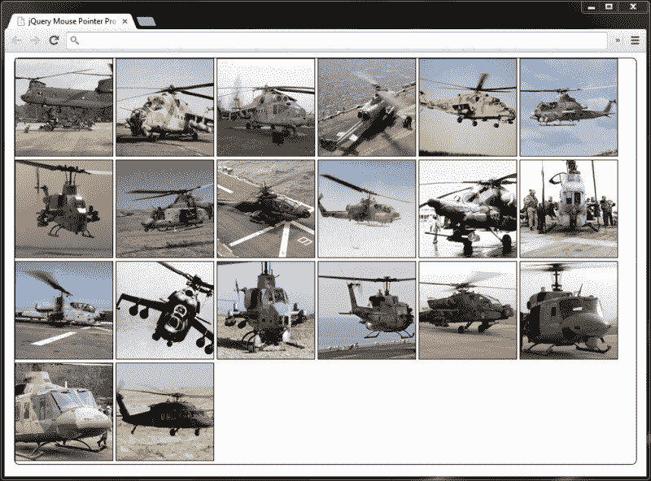
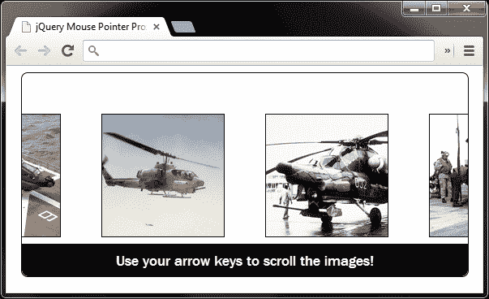
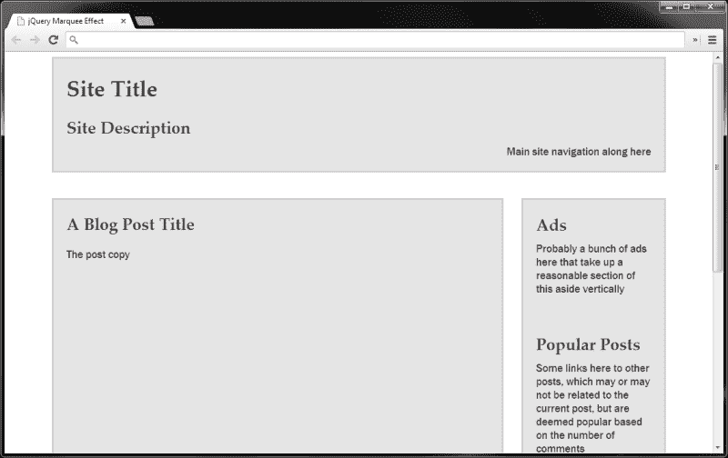
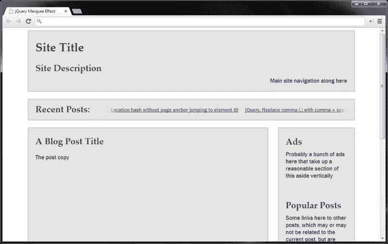

# 八、其他流行动画

*本章将遵循与前一章类似的格式，并将包含一系列配方风格的示例，展示动画的实际实现。我们不会约束自己任何事情都会发生！*

我们将在本章中查看以下示例：

*   邻近动画，其中动画是鼠标指针接近页面的目标元素或区域的反应
*   动画标题元素
*   文本滚动选框小部件

# 理解接近动画

接近动画通常由鼠标指针相对于页面上的一个或一系列元素的位置来驱动，效果非常好。虽然它不适用于所有网站和所有环境，但在某些情况下使用它可以增加真正的天赋。

这种效果通常不是很容易获得，对非鼠标用户来说几乎是闭门造车，但它可以作为一种额外的奖励（通常称为渐进增强）来实现，使访问者能够利用它，同时提供其他更容易获得的交互形式。

在本例中，我们将创建一个当鼠标指针进入其容器时触发的图像滚动条。图像滚动的速度将由鼠标指针与容器中心的距离决定。移动指针将相应地减慢或加快动画。

# 行动时间-创建页面并设置页面样式

在示例的这一部分中，我们将创建动画将在其上运行的底层页面，并添加样式。

1.  首先，我们将创建默认页面，并为示例添加 CSS。将以下元素添加到模板文件的`<body>`元素中：

    ```js
    <div id="proximity">
      
      
      
      
      
      
      
      
      
      
      
      
      
      
      
      
      
      
      
      
    </div>
    ```

2.  将此文件另存为`proximity.html`。接下来，我们将添加一些 CSS。在新文件中，添加以下代码：

    ```js
    /* base classes (scripting disabled) */
    #proximity {
      width:960px;
      margin:auto;
      border:1px solid #000;
      -moz-border-radius:8px;
      -webkit-border-radius:8px;
      border-radius:8px;
    }
    #proximity img { border:1px solid #000; }
    /* scripting enabled classes */
    #proximity.slider {
      width:550px;
      height:250px;
      position:relative;
      overflow:hidden;
    }
    .slider #scroller {
      position:absolute;
      left:0;
      top:0;
    }
    .slider #scroller img {
      display:block;
      width:150px;
      height:150px;
      margin:50px 0 0 50px;
      float:left;
      color:#fff;
      background-color:#000;
    }
    .slider #scroller img:first-child { margin-left:0; }
    #message {
      width:100%;
      height:30px;
      padding-top:10px;
      margin:0;
      -moz-border-radius:0 0 8px 8px;
      -webkit-border-bottom-radius:8px;
      -webkit-border-bottom-right-radius:8px;
      border-radius:0 0 8px 8px;
      position:absolute;
      bottom:0;
      left:0;
      background-color:#000;
      color:#fff;
      text-align:center;
      font:18px "Nimbus Sans L", "Helvetica Neue",  
        "Franklin Gothic Medium", Sans-serif;
    }
    ```

3.  将保存在`css`文件夹中为`proximity.css`，不要忘记从 HTML 页面的`<head>`链接到。

## *刚才发生了什么事？*

保持 HTML 尽可能简单和轻巧，我们只需将要显示的图像添加到容器元素中。我们需要的任何额外元素都可以在渐进增强的本质中动态添加。

CSS 文件中有两个部分。第一部分是基本样式的集合，当页面由禁用 JavaScript 的访问者加载时，将使用这些基本样式。这样可以确保所有图像都可见，因此可以访问，并且不会隐藏或以其他方式遮挡任何图像。

第二部分更改容器元素的外观，并为动态添加的元素或类添加样式，从而在启用 JavaScript 的情况下改变滑块的外观。

我们将容器的`height`和`width`设置为一次只能看到三个图像，并将其`overflow`样式属性设置为`hidden`以便隐藏所有其他图像，准备将滚动到视图中。

我们还为`id`为`scroller`的元素添加了定位。这个元素还不存在，将由脚本添加，稍后我们将介绍它。这个元素也需要一个`width`，但是我们可以根据容器中的图像数量动态地分配它。

我们还更改了图像本身的样式，将其设置为块级元素，并将其向左浮动，以便它们水平堆叠成一条长线，而不会缠绕到两条线上，因为这会破坏滚动条的功能。这是浮动图像和设置容器的`width`以容纳所有图像的组合，允许图像按要求水平堆叠。我们将添加一条消息，告诉访问者如何使用滚动条，因此我们还将为此添加一些样式。

以下屏幕截图显示了禁用脚本时页面的显示方式：



在前面的图像中，我们可以看到所有图像都是可见的。它不太漂亮，但是它的可访问性很高，并且当客户端上禁用脚本时，不会隐藏内容。

# 行动时间-为滑动功能准备页面

启用脚本后，我们可以增强页面以添加接近滑块所需的其他元素。在 HTML 页面底部的空函数中添加以下代码：

```js
var prox = $("#proximity"),
  scroller = $("<div></div>", { 
    id: "scroller"
  }),

  pointerText = "Use your pointer to scroll, moving to "+
    "the edge scrolls faster!",
  keyboardMessage = "Use your arrow keys to scroll the images!",
  message = $("<p></p>", {
    id: "message",
    text: keyboardMessage
  });

prox.addClass("slider").wrapInner(scroller).append(message);

var middle = prox.width() / 2;

scroller = $("#scroller");

scroller.width(function() {
  var total = 0;
  scroller.children().each(function(i, val) {
    var el = $(this);
    total = total + (el.outerWidth() + parseInt(el.css("marginLeft")));
});
return total;

}).css("left", "-" + (scroller.width() / 2 - middle) + "px");
```

## *刚才发生了什么事？*

首先，我们缓存邻近容器的选择器，我们将在这段代码中使用它几次，稍后在脚本中使用它几次。接下来，我们创建一个新的`<div>`元素，并给它一个`id`属性，以便在必要时可以轻松地再次选择它。我们还将此`id`用于造型目的。

接下来，为了方便起见，我们在变量中存储了两个文本字符串。这些将被用作在不同点向访客显示的信息。我们还创建一个新的段落元素作为消息文本的容器，为该元素提供一个 ID（同样用于选择），并使用 jQuery`text()`方法将其`innerText`设置为一个文本字符串。然后，我们使用传递的对象上的属性`text`作为元素创建 jQuery 方法格式的第二个参数，该格式自动映射到`text()`方法。

接下来，我们向外部邻近容器添加一个类名。请记住，此类名用于区分禁用和启用的脚本，以便我们可以添加所需的样式。我们还将邻近容器（20``标记）的内容包装在我们新创建的 scroller 元素中，并将消息附加到邻近容器中。

接下来，我们设置一个变量，该变量等于邻近容器的`width`除以 2。这为我们提供了元素的水平中间位置，我们需要在一些计算中使用它来定位 scroller 元素，并计算出鼠标指针相对于邻近容器的位置。

我们可以很容易地设置`middle`变量需要包含的数字，而不是以这种方式计算。邻近容器的`width`是在我们的 CSS 文件中设置的（启用脚本），对于这个特定示例来说是非常任意的。但是，如果我们更改了它的`width`，如果我们直接在变量中设置图形，而不是以编程方式进行计算，脚本就会中断。尽可能避免将“神奇”数字硬编码到脚本中。

此时，我们还需要缓存对 scroller 元素的引用，因为它已附加到页面中。我们无法使用我们在脚本开始时创建的`scroller`变量的内容，因此我们通过再次从页面中选择该元素，使用对该元素的新引用来覆盖它。

我们现在需要设置`scroller`元素的`width`，以便它足够宽，可以容纳一行中的所有图像。为此，我们将一个函数传递给 jQuery 的`width()`方法，该方法返回要设置的`width`。

该函数通过迭代每个图像并将其`width`和水平`margin`添加到`total`变量来计算该图形。这意味着可以在不更改脚本的情况下使用不确定数量的图像，并且可以使用具有不同宽度和间距的图像。

一旦我们设置了`scroller`元素的`width`，我们就需要定位它，使滚动条的中心位于接近容器的中心。这样，当页面加载时，访问者可以将其向左或向右移动，这取决于他们移动指针的位置或按下的箭头键。

如果此时在浏览器中加载页面，我们会发现页面上元素的外观已更改。



在上一个屏幕截图中，我们可以看到邻近容器的大小被调整，`scroller`元素在其中居中。我们还可以在邻近容器的底部看到默认的消息。

# 行动时间-设置滚动条动画

代码的下一部分将根据鼠标指针相对于外部邻近容器的位置来实际设置`scroller`元素的动画。在`}).css("left", "-" + (scroller.width()`行下方添加以下代码：

```js
function goAnim(e) {

  var offset = prox.offset(),
    resetOffset = e.pageX - offset.left - middle,

    normalizedDuration = (resetOffset > 0) ? resetOffset :  -resetOffset,

    duration = (middle - normalizedDuration) * 50;

    scroller.stop().animate({
      left: (resetOffset < 0) ? 0 : "-" + (parseInt(scroller.width()) - parseInt(prox.width()))
    }, duration, "linear");
  }
```

## *刚才发生了什么事？*

在`goAnim()`函数中，我们首先获取邻近容器的`offset`值，以便我们知道其相对于文档的位置。然后我们计算出鼠标指针相对于邻近容器中间的位置。这意味着在数值上，当指针位于中心时，指针偏移量将为`0`。

如果鼠标指针位于接近容器的左半部分，`resetOffset`变量中的数字将为负数。这将导致我们稍后在函数中的计算不正确，因此我们需要检查`resetOffset`变量是否大于`0`，如果大于，则使用其负值反转数字。

最终，我们要做的是，当指针移向邻近容器的两端时，滚动条的速度增加，当指针移到中心时，滚动条的速度减慢。换句话说，动画的速度需要与指针到邻近容器中间的距离成反比。

我们在这一点上遇到的问题是，表示指针与邻近容器中间距离的图形在向边缘移动时变大，因此如果我们使用此图形作为动画的持续时间，动画将减慢而不是加快。

为了反转存储在`normalizedDuration`变量中的值，我们从表示接近容器中间的值中减去该值，然后将所得数字乘以`50`。duration 参数是以毫秒为单位的，因此如果我们不使用乘数（`50`是通过反复试验得出的）来增加值，动画就会发生得太快。

我们现在可以启动动画了。我们使用 JavaScript 三元语句来测试`resetOffset`数字是否小于`0`，如果小于，我们知道要使滚动条向右滑动，只需将滚动条元素的`left`样式属性设置为`0`。

如果变量大于`0`，我们必须将滚动条元素反向移动（向左），以显示隐藏在右侧的图像。为了将滚动条`<div>`元素的右边缘与邻近容器的右边缘对齐，我们将动画的终点设置为滚动条`<div>`元素的`width`减去邻近容器的`width`。

# 行动时间-添加鼠标事件

现在，我们需要添加触发动画的鼠标事件。以下代码将添加到我们之前添加的这两行下面：

```js
}, duration, "linear");
}

```

在前几行下面，添加以下代码行：

```js
prox.mouseenter(function(e) {

  message.text(pointerText).delay(1000).fadeOut("slow");

  goAnim(e);

  prox.mousemove(function(ev) {
    goAnim(ev);
  });
});

prox.mouseleave(function() {
  scroller.stop();
  prox.unbind("mousemove");
});
```

## *刚才发生了什么事？*

首先，我们设置了一个`mouseeenter`事件处理程序，以便能够检测指针最初何时进入邻近容器。当出现这种情况时，我们更改消息文本，以便它显示如何使用鼠标指针，然后在延迟一秒钟后慢慢淡出消息。

然后我们调用`goAnim()`函数来启动动画。在这一点上，我们设置了一个`mousemove`事件，这样我们就可以随着指针在邻近容器中的移动而提高或降低动画的速度。每次指针移动时，我们再次调用`goAnim()`函数。每次调用此函数时，我们都会传入事件对象。

我们还在邻近容器上设置了一个`mouseleave`事件处理程序，这样我们就可以检测指针何时离开这个元素。当这种情况发生时，我们停止当前正在运行的动画并解除`mousemove`事件处理程序的绑定。

在这一点上，我们应该有一个完全工作的接近滑块。前面，我们讨论了接近效应如何仅对鼠标用户有用，因此，让我们在脚本中添加一个键盘事件处理程序，让键盘用户也可以导航滚动条。

# 行动时间-添加键盘事件

现在，我们将启用键盘驱动的动画。我们将特别为键盘上的左右箭头键添加触发器。

在前面我们刚刚添加的`prox.mouseleave`函数下面添加以下代码：

```js
$(document).keydown(function(e) {

  //37 = left arrow | 39 = right arrow
  if (e.keyCode === 37 || e.keyCode === 39) {

    message.fadeOut("slow");

    if (!scroller.is(":animated")) {
      scroller.stop().animate({
        left: (e.keyCode === 37) ? 0 : -(scroller.width() - prox.width())
      }, 6000, "linear");
    }
  }
}).keyup(function() {
  scroller.stop();
});
```

## *刚才发生了什么事？*

我们将`keydown`事件处理程序附加到`document`对象，以便访问者不必以某种方式聚焦邻近容器。在匿名函数中，我们首先检查是否按下了左箭头键或右箭头键。

键代码`37`表示左箭头键，代码`39`表示右箭头键。`keyCode`属性由 jQuery 规范化，因此所有浏览器都可以访问它，它将包含按下哪个键的代码，但我们只想对按下哪个指定键做出反应。

当按下其中一个键时，我们首先淡出消息，然后使用 jQuery 的`is()`方法和`:animated`过滤器检查滚动条是否已经设置动画。

只要`scroller`元素尚未设置动画（由条件开始处的`!`符号表示），我们就可以设置它的动画。我们使用 JavaScript 三元条件再次检查`keyCode`属性，以便根据按下的键将滚动条移动到正确的方向。

最后，我们添加一个`keyup`事件处理程序，该处理程序在释放关键点后停止滚动动画。这提高了动画的交互性，因为它允许访问者随时直观地停止滚动。

## 有一个围棋英雄-扩展接近动画

扩展我们的示例的明显方法是在垂直轴上触发动画。我们可以有一个网格的图像，而不是一个单一的行和动画网格上下以及左右。

要扩展该示例，需要做的一件事是添加额外的键盘功能。检查是否有其他键，例如 home 键和 end 键，它们可以相应地导航到`scroller`元素的开始或结束。

## 突击测验–实施近距离动画

问题 1。在前面的示例中，我们通过添加键盘导航功能提供了附加功能；为什么？

1.  为了好玩
2.  好看
3.  为不使用鼠标的用户浏览内容提供另一种方式
4.  每当使用鼠标事件时，必须绑定键盘事件

问题 2。我们为什么要避免在脚本中硬编码“神奇”数字？

1.  使我们的代码更具可读性
2.  因此，我们的脚本不太依赖于它们所作用的内容
3.  硬编码整数的处理时间较长
4.  因为 jQuery 更喜欢使用字符串

# 设置页眉动画

另一种相当流行的技术是在加载主页时在页面的标题中运行动画。有时候动画会在网站的每个页面上持续运行；其他只在主页上运行一次。

这项技术是一种简单而有效的方法，可以让你的网站脱颖而出，而且它们不必是复杂的或非常明显的动画；一个简短、微妙的动画就足以让人惊叹！因素

在本书前面，我们研究了如何将**cssHooks**与使用 cssHooks 的预写文件结合使用，该文件扩展了 jQuery 的`css()`方法，允许对元素的`background-position`样式属性进行动画处理。在本例中，我们将了解如何在不使用插件的情况下手动执行此操作。

编写良好的插件可能是一个有效且简单的解决方案，但有时插件添加的功能远远超过我们实际需要的，因此会增加页面的脚本开销。通常情况下，没有必要或建议重新设计轮子，但有时编写只执行我们需要的自定义脚本是有益的。

# 行动时间-创建动画标题

本例的底层页面相对简单，只有一个`<header>`元素，我们将手动设置其`background-position`的动画：

1.  示例页面的页眉将只包含一个空的`<header>`元素，该元素位于`<body>`标记

    ```js
    <header>
    </header>
    ```

    内
2.  另存为`animated-header.html`。CSS 更简单，只有一个选择器和一些规则：

    ```js
    header {
      display:block;
      width:960px;
      height:200px;
      margin:auto;
      background:url(../img/header.jpg) repeat 0 0;
    }
    ```

3.  另存为`animated-header.css`。我们需要从刚刚创建的页面的`<head>`链接到该文件。
4.  脚本本身也非常简单。在`<body>`元素末尾的函数中添加以下代码：

    ```js
    var header = $("header");

    header.css("backgroundPosition", "0 0");

    var bgscroll = function() {

    var current = parseInt(header.css(
        "backgroundPosition").split(" ")[1]),
        newBgPos = "0 " + (current - 1) + "px";

      header.css("backgroundPosition", newBgPos);
    };

    setInterval(function() { bgscroll() }, 75);
    ```

5.  当我们在浏览器中运行文件时，我们会发现用于`<header>`的背景图像会缓慢滚动。

## *刚才发生了什么事？*

在脚本中，为了提高效率，我们将`header`选择器缓存在主函数之外，这样我们就不会在每次执行函数时都创建新的 jQuery 对象。即使`<header>`元素缓存在函数外部的变量中，函数仍然可以访问该变量。

在函数中，我们首先获取`header`元素的当前垂直`background-position`，使用 JavaScript`split()`函数提取我们需要的返回字符串的一部分。我们还使用`parseInt`将字符串转换为整数。

然后我们将整数递减 1。这意味着背景图像将向上滚动。这并不重要。没有理由不能向下滚动图像，我个人只是出于某种原因而更喜欢向上的运动。最后，我们使用 jQuery 的`css()`方法设置了新的`background-position`。

函数定义后，使用 JavaScript`setInterval()`方法每隔 75 毫秒重复调用一次函数。这是相对较快的，但相当平滑，远高于此值，动画开始变得有点急促。但是，没有理由认为不同的背景图像可能不需要运行得那么快。

## 有一个围棋英雄–扩展动画标题

因为这个例子很小，所以可以做很多事情来建立它。根据使用中的背景图像，它可以扩展为沿水平轴移动，甚至可以同时沿水平轴和水平轴移动，可能是沿西北方向对角移动。

# 使用选框效果设置文本动画

`<marquee>`元素的使用在很多年前就消失了，但用 JavaScript 创建的类似效果在最近年再次出现，这要归功于它在高知名度网站上的使用，比如新闻网站标题的自动标记器，以及旧推特主页上的动态趋势主题。

这是一种有效且有吸引力的方式，可以在不占用太多内容空间的情况下向访问者呈现潜在的相关内容。当然，它不适合所有的网站，但使用时要谨慎，并且尽可能的非侵入性，它可以产生巨大的效果。

# 行动时间-创建基础页面并设置其样式

在本例中，我们可以看到抓取一系列文本字符串并以平滑滚动的字幕样式显示它们是多么容易。我们将使用 jQuery 内置的 AJAX 功能从我的博客上的最新帖子中获取 JSON 文件。让我们开始吧。

1.  将以下标记添加到模板文件的`<body>`元素：

    ```js
    <div id="outer">
      <header>
        <hgroup>
          <h1>Site Title</h1>
          <h2>Site Description</h2>
        </hgroup>
        <nav>Main site navigation along here</nav>
      </header>
      <article>
        <h1>A Blog Post Title</h1>
        <p>The post copy</p>
      </article>
      <aside>
        <div>
        <h2>Ads</h2>
          <p>Probably a bunch of ads here that take up a reasonable section of this aside vertically</p>
        </div>
        <div>
        <h2>Popular Posts</h2>
          <p>Some links here to other posts, which may or may not be related to the current post, but are deemed popular based on the number of comments</p>
        </div>
        <div>
        <h2>Related Posts</h2>
          <p>Some links here to other posts that are definitely related to this post, based on post tags</p>
        </div>
        <div>
        <h2>Twitter Feed</h2>
          <p>Maybe a twitter feed here that displays recent tweetsor something. Aside could be quite long by now</p>
        </div>
      </aside>
    </div>
    ```

2.  将新页面另存为`marquee.html`。
3.  在这一点上，我们还可以添加一些基本的 CSS，以一种可接受的、通用的方式来布局示例。在文本编辑器的新文件中添加以下代码：

    ```js
    #outer {
      width:960px;
      margin:auto;
      color:#3c3c3c;
      font:normal 17px "Palatino Linotype", "Book Antiqua",  
        Palatino, serif;
    }
    header {
      display:block;
      padding:0 20px 0;
      margin-bottom:40px;
      border:3px solid #d3d1d1;
      background-color:#e5e5e5;
    }
    hgroup { float:left; }
    h1,
    h2 { margin-bottom:10px; }
    nav {
      display:block;
      width:100%;
      height:40px;
      clear:both;
      text-align:right;
    }
    article {
      width:700px;
      height:900px;
      border:3px solid #d3d1d1;
      background-color:#e5e5e5;
      float:left;
    }
    article h1,
    article p { margin:20px; }
    p, nav{
      font:normal 17px "Nimbus Sans L", "Helvetica Neue",  
        "Franklin Gothic Medium", Sans-serif;
    }
    p { margin-top:0; }
    aside {
      width:220px;
      height:900px;
      border:3px solid #d3d1d1;
      background-color:#e5e5e5;
      float:right;
    }
    aside div { padding:0 20px 20px; }
    ```

4.  将此文件另存为`css`目录中的`marquee.css`。从我们刚刚创建的页面的`<head>`元素链接到此样式表。

## *刚才发生了什么事？*

底层 HTML 表示一个典型的博客。我们添加了一系列元素有两个原因，主要是为了让我们有地方插入字幕，但也为了让我们明白为什么这种方法是必要的。

让最新的帖子在网站顶部附近的页面上滚动可以确保直接看到这些内容，而且动画也有助于吸引访问者的注意力。

到目前为止使用的 CSS 纯粹是以一种精确而温和的美学方式布局示例元素，为我们提供了一种通用布局和轻蒙皮。稍后，我们将在示例中为动态创建的字幕添加更多 CSS。此时，页面应显示如下所示：



请记住，上一个屏幕截图中的所有元素都是用来插入字幕的。它们不是特别需要的，在这个例子中有。

# 行动时间-检索和处理帖子列表

现在，我们已经准备好检索最新帖子的列表并对其进行处理，使它们可以作为项目显示在字幕中。为了从另一个域通过互联网访问这些数据，我们需要使用**JSONP**，它代表**JSON，带有填充**，涉及动态创建`<script>`元素并将其注入页面，尽管 jQuery 实际上为我们处理这方面的内容。

### 注

关于 JSONP 的更多信息可以在这些伟大的文章中找到：[http://remysharp.com/2007/10/08/what-is-jsonp](http://remysharp.com/2007/10/08/what-is-jsonp) 和[http://jquery4u.com/json/jsonp-examples](http://jquery4u.com/json/jsonp-examples)

1.  jQuery 为 JSONP 提供了本机支持，并允许我们绕过浏览器的同源安全策略。为了以正确的格式输出 JSON，我使用 JSON API（[http://wordpress.org/plugins/json-api WordPress 支持的博客上的插件，该插件以以下格式输出 JSON:

    ```js
    {
      "status": "ok",
      "count": 1,
      "count_total": 1,
      "pages": 1,
      "posts": [
        {
          "id": 1,
          etc...
        },
        {
           "id": 2,
           Etc...
        }
        ]
    }
    ```](http://wordpress.org/plugins/json-api) 
2.  在前面的代码块中显示的`posts`数组中有更多的属性，以及外部对象中的其他数组和属性，但是前面的代码片段应该让您了解我们将处理的数据的结构。
3.  将以下代码添加到我们 HTML 页面的匿名函数中：

    ```js
    $.getJSON("http://adamculpepper.net/blog?json=1&count=10&callback=?", function(data) {

      var marquee = $("<div></div>", {
        id: "marquee"
      }),
      h2 = $("<h2></h2>", {
        text: "Recent Posts:"
      }),
      fadeLeft = $("<div></div>", {
        id: "fadeLeft"
      }),
      fadeRight = $("<div></div>", {
        id: "fadeRight"
      });
      for(var x = 0, y = data.count; x < y; x++) {
          $("<a></a>", {
            href: data.posts[x].url,
            title: data.posts[x].title,
            html: data.posts[x].title
          }).appendTo(marquee);
        }

      marquee.wrapInner("<div></div>").prepend(h2).append(fadeLeft).append(fadeRight).insertAfter("header").slideDown("slow");

      $("#marquee").find("div").eq(0).width(function() {

        var width = 0;

        $(this).children().each(function() {
          var el = $(this);
          width += el.width() + parseInt(el.css("marginRight"));
        });

        return width;
      });

      marquee.trigger("marquee-ready");
    });
    ```

4.  我们还可以为新创建的元素添加更多的 CSS。在`marquee.css`的底部添加以下代码：

    ```js
    #marquee {
      display:none;
      height:58px;
      margin:-20px 0 20px;
      border:3px solid #d3d1d1;
      position:relative;
      overflow:hidden;
      background-color:#e5e5e5;
    }
    #marquee h2 {
      margin:0;
      position:absolute;
      top:10px;
      left:20px;
    }
    #marquee a {
      display:block;
      margin-right:20px;
      float:left;
      font:normal 15px "Nimbus Sans L", "Helvetica Neue",  
        "Franklin Gothic Medium", Sans-serif;
    }
    #marquee div {
      margin:20px 0 0 210px;
      overflow:hidden;
    }
    #marquee div:after {
      content:"";
      display:block;
      height:0;
      visibility:hidden;
      clear:both;
    }
    #fadeLeft,
    #fadeRight {
      width:48px;
      height:21px;
      margin:0;
      position:absolute;
      top:17px;
      left:210px;
      background:url(../img/fadeLeft.png) no-repeat;
    }
    #fadeRight {
      left:906px;
      background:url(../img/fadeRight.png) no-repeat;
    }
    ```

5.  When we run the page now, we should see that the new marquee element, along with its links, is inserted into the page.

    

上一个屏幕截图显示了新选框部分的元素，包括标题、链接本身和淡入淡出元素，这些元素纯粹是为了美观而添加的。

## *刚才发生了什么事？*

我们所有的 JavaScript 都封装在 jQuery 的`getJSON()`方法中，该方法使用 jQuery 的 AJAX 功能向指定为该方法第一个参数的 URL 发出请求。第二个参数是在请求成功时执行的匿名函数。返回的 JSON 数据将自动传递到此函数。

在该功能中，我们首先创建了一些构成字幕的元素，包括外部容器、标题和两个纯粹的美学`<div>`元素，用于在链接行的开始和结束处添加左右淡入效果。所有这些元素都存储在变量中，以便我们可以在需要时轻松访问。

接下来，我们处理传递到函数中的 JSON 对象。记住，这个对象包含一系列属性，其中一些属性的值是数组，比如`posts`数组，它包含每个返回的帖子，作为每个数组项中的对象。

我们使用一个`for`循环来迭代与 JSON 对象一起返回的`posts`数组中的每个对象。该对象包含一个名为`count`的属性，其中返回的帖子数存储为整数，因此我们可以使用该属性告诉`for`循环执行多少次，这比计算`posts`数组中的对象稍微容易一些。

对于返回的每个帖子，我们创建一个新的`<a>`元素，将其`href`设置为指向当前对象的`url`属性，将元素的`title`和`text`设置为当前对象的`title`属性，然后将新的`<a>`元素追加到`marquee`中我们一分钟前创建的元素。

一旦我们为每个帖子创建并附加了一个链接，我们就将字幕元素（链接）的内容包装在一个新的`<div>`元素中，将`<h2>`元素前置到字幕的开头，并将淡入淡出的`<div>`元素追加到`marquee`元素的结尾。然后，在使用`slideDown()`方法将其滑入视图之前，我们将字幕添加到页面中。

此时，我们需要在容器的`<div>`元素上设置一个`width`，我们刚才在中包装了链接。这样，链接就可以全部排列在一行中。我们需要考虑每个链接的`width`值，加上它的任何`margin`（我们在 CSS 中设置）。

我们使用一个函数作为 jQuery 的`width()`方法的值来迭代每个链接，并将其`width`和`margin`添加到运行总数中。在字幕添加到页面之前，我们不能这样做，因为直到这一点每个元素实际上都有一个`width`或`margin`我们才能检索到。

我们在`getJSON()`方法的回调函数中做的最后一件事是使用`trigger()`jQuery 方法触发一个自定义事件。自定义事件称为`marquee-ready`，用于告知脚本`marquee`何时添加到页面中。我们将很快使用此自定义事件来设置帖子链接的动画。

我们还在样式表中添加了一些新的 CSS。这段代码的一部分是为了给我们的`marquee`元素提供与页面其余部分相同的浅色外观。但它的其他部分，如浮动链接，以及将字幕的`overflow`属性设置为`hidden`是为了使链接在一行中排列，从而使大多数链接隐藏起来，随时可以滚动到视图中。我们还将淡入淡出的图像添加到`marquee`元素中的最后两个`<div>`元素中。

# 行动时间-设置帖子链接的动画

我们现在准备开始滚动字幕中的帖子链接。我们可以使用自定义事件来完成此操作。

1.  在`getJSON()`方法之后，在页面中添加以下代码：

    ```js
    $("body").on("marquee-ready", "#marquee", function() {

      var marquee = $(this),
        postLink = marquee.find("a").eq(0);
        width = postLink.width() + parseInt(postLink.css("marginRight")),
        time = 15 * width;

      postLink.animate({
        marginLeft: "-=" + width	
      }, time, "linear", function() {
        $(this).css({
          marginLeft: 0
        }).appendTo(marquee.find("div").eq(0));
        marquee.trigger("marquee-ready");
      });
    });
    ```

2.  我们的例子现在已经完成了。当我们在此时运行页面时，文章应该开始从左向右滚动。

## *刚才发生了什么事？*

我们使用 jQuery`on()`方法将事件处理程序绑定到我们的自定义`marquee-ready`事件。我们需要使用`on()`事件来实现这一点，因为当执行这部分代码时，JSON 响应不太可能返回，因此`marquee`元素甚至不存在。将事件处理程序附加到页面的`<body>`元素是在`marquee`元素确实存在时准备页面的一种简单方法。

在匿名事件处理函数中，我们首先使用`this`对象缓存对 marquee 元素的引用，该对象的作用域为`marquee`元素。然后，我们选择字幕中的第一个链接，并确定其总数`width`，包括`margin`。

我们还计算出什么是有效的动画速度。jQuery 动画使用持续时间来确定动画应该运行的速度，但这给我们带来的问题是，标题越长的帖子移动得越快，因为它们在相同的时间内有更大的距离来制作动画。

为了解决这个问题，我们根据任意速度`15`乘以当前`<a>`元素的`width`，计算出传递到动画方法的持续时间。这确保了无论帖子有多长，每个帖子都会以相同的速度滚动。

一旦我们获得了总的`width`和`duration`，我们就可以在`marquee`中的第一个链接上运行动画，使用我们的`width`和`time`变量来配置动画。我们通过设置第一个链接的负`margin`来设置 post 链接的动画，这将拖动所有其他链接。

动画完成后，我们从链接中删除`margin-left`，将其重新附加到`marquee`元素中`<div>`的末尾，并再次触发`marquee-ready`事件以重复该过程。这会反复发生，创建正在进行的动画，并将我们带到示例的末尾。

## 拥有一个围棋英雄——扩展字幕滚动条

当鼠标指针悬停在帖子标题上方时，如果帖子标题不再被设置动画，这对我们的用户肯定是有益的。当指针再次离开标题时，可以重新启动动画。亲自尝试在中添加此功能。它不应该太复杂，应该包括添加`mouseenter`和`mouseleave`事件处理程序。

您需要计算出任何给定链接中有多少已经超出了字幕的可见区域，以确保动画以其停止时的相同速度重新启动，但这应该与我们在本版本示例中计算持续时间的方式非常类似。看看你进展如何。

## 突击测验–创建字幕滚动条

问题 1。为什么我们要创建一个动态持续时间变量（time），而不是使用 jQuery 预定义的持续时间？

1.  因为使用整数比使用一个持续时间字符串更快，即使必须计算该整数
2.  因为它更有趣
3.  确保链接在设置动画后附加到正确的元素
4.  确保所有链接都以相同的速度设置动画，而不管它们有多长

# 总结

在本章中，我们的第二章是基于大量示例的，而不是基于理论的章节，我们研究了一些越来越多地在 web 上发现的更常见的动画。具体而言，我们研究了以下类型的动画：

*   一种接近驱动的图像滚动器，根据鼠标指针的移动，图像以特定的方向和速度滚动
*   背景位置动画，其中我们仅用几行代码手动创建了一个连续的标题动画
*   一个文本字幕，其中一系列的标题被从一个实时的互联网提要抓取，并显示在滚动字幕风格的横幅中

在下一章中，我们将学习 CSS3 中引入的一些纯 CSS 动画，以及如何使用 jQuery 来增强它们，并使使用它们更容易。