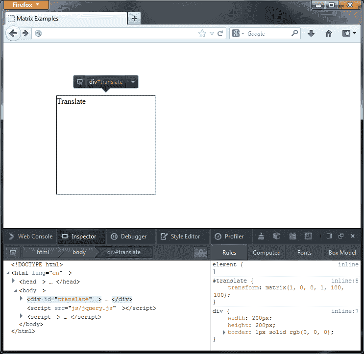
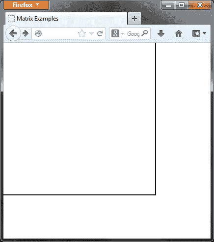
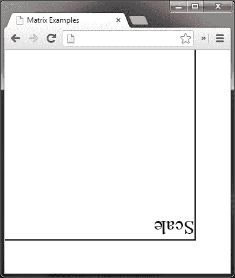
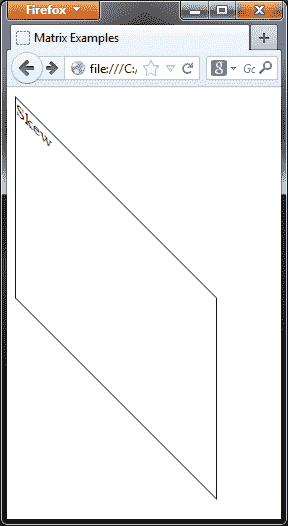
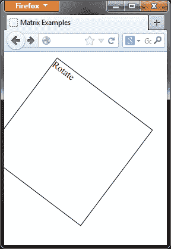
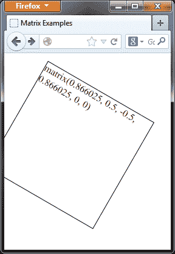
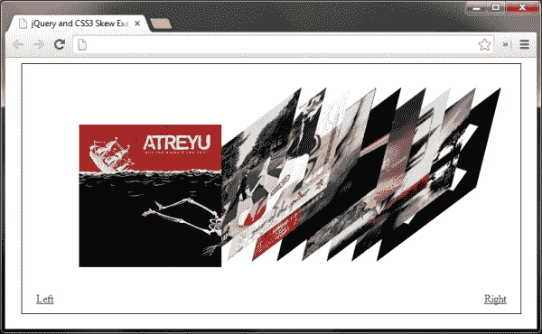

# 九、CSS3 动画

*CSS3 为 web 开发领域带来了许多令人印象深刻的新风格，尽管规范还远未完成，但它的许多方面都在最新的浏览器中使用。纯 CSS 动画甚至可能在某个时候成为规范。在撰写本文时，几乎所有现代浏览器都完全支持这一点。不过，在 jQuery 的帮助下，我们可以创建自己的 CSS3 动画，在所有常见浏览器（新浏览器和旧浏览器）中都能获得不同程度的成功。*

在本章中，我们将介绍以下主题：

*   不同的 CSS3 转换可用
*   设置元素旋转的动画
*   使用 CSS3 转换矩阵
*   使用 jQuery 设置元素倾斜的动画

### 注

有关 CSS3 2D 转换的更多信息，请参阅 W3C 工作草案规范[http://www.w3.org/TR/css3-transforms/](http://www.w3.org/TR/css3-transforms/) 。

# CSS3 2D 变换

CSS3 定义了一个名为`transform`的样式属性，它允许我们在二维空间中沿 x 轴和 y 轴变换目标元素。可以提供一系列转换函数作为`transform`属性的值，该属性指示如何应用转换。定义了以下 2D 变换函数：

<colgroup><col style="text-align: left"> <col style="text-align: left"> <col style="text-align: left"></colgroup> 
| 

作用

 | 

示例用法

 | 

变换的描述

 |
| --- | --- | --- |
| `matrix` | `matrix(a, b, c, d, tx, ty)` | 它根据提供的参数组合旋转、缩放、倾斜或平移元素。 |
| `rotate` | `rotate(x)` | 它以指定的度围绕变换原点旋转元素。默认情况下，原点应为图元的中心。 |
| `scale` | `scale(x, y)` | 它沿 x 轴和 y 轴以指定的单位数缩放元素。如果未提供 y，则假定其与 x 相同。 |
| `scaleX` | `scale(x)` | 它使用指定数量的单位沿 x 轴缩放元素。 |
| `scaleY` | `scale(y)` | 它沿 y 轴以指定的单位数缩放元素。 |
| `skew` | `skew(x, y)` | 它沿 x 轴和 y 轴以指定的度倾斜元素。如果未提供 y，则假定为 0。 |
| `skewX` | `skew(x)` | 它沿 x 轴以指定的度数倾斜元素。 |
| `skewY` | `skew(y)` | 它沿 y 轴以指定的度数倾斜元素。 |
| `translate` | `translate(x, y)` | 它沿 x 轴和 y 轴以指定数量的像素重新定位元素。如果未提供 y，则假定为 0。 |
| `translateX` | `translate(x)` | 它沿 x 轴以指定的像素数重新定位元素。 |
| `translateY` | `translate(y)` | 它沿 y 轴重新定位具有指定数量的像素的元素。 |

## 了解矩阵

所有单独的变换函数（`rotate()`、`skew()`等）都可以看作是特定矩阵变换的捷径。事实上，即使提供了转换函数，大多数浏览器也会在后台应用矩阵。

`matrix`函数有六个参数，上表中提到的每个变换都可以通过为这些参数提供不同的值组合来执行。有时我们可以使用`matrix`函数同时应用多个变换。让我们看一些快速的例子来说明如何使用矩阵。

### 翻译

翻译一个元素会导致它从原来的位置移动。正值将元素向右或向下移动页面（取决于轴），负值将元素向左或向上移动页面。例如，可以使用以下变换矩阵沿 x 轴向右移动 100 像素，沿 y 轴向下移动 100 像素：

```js
transform: matrix(1, 0, 0, 1, 100, 100);
```

此`matrix`函数相当于使用转换函数`translate(100px, 100px)`会导致目标元素出现如下截图：



正如我们在上一个屏幕截图中所看到的，元素已经从其原始位置（屏幕左上角）移动，尽管我们没有使用 CSS 来定位元素，我们可以在 DOM 检查器中看到这种情况。

本例中矩阵的第五个参数对应于 x 轴，第六个参数对应于 y 轴。不要太担心前四个参数，因为我们将在不久的将来更详细地介绍这些参数。

### 注

需要注意的是，一些浏览器（如 Firefox）希望这些值具有指定的单位（如前一个屏幕截图中所示），而其他浏览器（如 Opera 或基于 WebKit 渲染引擎的浏览器）则希望这些值不带单位。

为了翻译元素，不需要对其进行定位，并且转换不会影响文档或其周围其他元素的流。相邻图元将根据图元的原始位置而不是平移后的新位置来定位自身。翻译后的元素的内容也被翻译成了。

### 刻度

您可能想知道为什么我们在第一个矩阵代码片段中提供了值 1 作为第一个和第四个参数，而 0 作为第二个和第三个参数的值，而不是提供所有的零。

原因是，参数（第一个和第四个）对应于`scale`变换函数，因此为了保持变换后元素的原始大小，`scale`参数设置为 1。要使元素的大小加倍（不转换其位置），我们可以使用以下转换矩阵：

```js
transform: matrix(2, 0, 0, 2, 0, 0);
```

此代码段相当于使用`transform: scale(2, 2)`，并将导致目标元素如下所示：



在前面的屏幕截图中，我们可以看到元素现在是其原始大小的两倍。

前面的代码沿 x 轴和 y 轴对称缩放目标元素。这些值在所有支持的浏览器中都是无单位的，并且不能指定值 0。可以提供整数或浮点数，必要时缩放可能是不对称的。

缩放的一个有趣效果是，提供负值会导致元素反转，而不是收缩，正如我们直观地推测的那样。因此，如果我们在前面的代码片段中提供`-2`和`-2`作为第一个和第四个值，那么元素将在垂直和水平方向上都得到反映，并且是其原始大小的两倍。我们甚至可以为这种类型的转换提供正负值的组合。

反射元素将显示如下：



该元素沿其 x 轴和 y 轴反转，就像在镜子中倒置一样。例如，如果我们实现纯 CSS 反射，这将非常有用。

### 歪斜

与矩阵中第二个和第三个参数相对应的两个零值可以用作歪斜值，x 轴使用第二个参数，y 轴使用第三个参数。我们可以使用以下矩阵变换函数扭曲元素（不修改其比例或位置）：

```js
transform: matrix(1, 1, 0, 1, 0, 0);
```

以下屏幕截图显示了一个扭曲的元素：



上一个屏幕截图显示了沿 x 轴倾斜的元素。与其他矩阵函数一样，这些参数的正值会导致沿右或向下方向的变换，负值会导致沿左或向上方向的变换。

在前面的代码段中，只有 x 轴发生了倾斜。倾斜的结果是元素的大小增加了。转换元素的边界框的大小已从 200 px（元素的原始大小）增加到 400 px。

然而，不管大小有多大，文档的流都不会受到转换的影响，就像其他转换一样，转换元素中的任何内容也会被转换。

### 注

在不同的浏览器中，转换对元素中包含的任何文本都有不同的影响，在某些浏览器中，转换后的文本保持清晰可读，而在其他浏览器中则会降级。

### 旋转

要使用矩阵旋转元素，我们需要使用三角函数正弦和余弦来计算前四个参数的值。第一个和第四个参数取旋转角度的余弦函数，第二个和第三个参数分别为旋转角度的正弦函数和负正弦函数。

### 注

正弦和余弦函数是相对高级的数学结构，用于表示三角形边和三角形角度之间的不同关系。

虽然理解它们的确切性质并不是使用它们的必要条件（JavaScript 具有自动计算它们的内置函数），但深入理解它们的性质和用法只有在专门处理旋转时才有帮助。

有关基本介绍，请参见维基百科关于三角函数的文章[http://en.wikipedia.org/wiki/Trigonometric_functions](http://en.wikipedia.org/wiki/Trigonometric_functions) 。

例如，要将元素旋转 37 度，我们将使用以下变换：

```js
transform: matrix(0.7986355, 0.6018150, -0.6018150, 0.7986355, 0, 0);
```

我们的旋转元素应如下所示：



如我们所见，旋转元素的边显示在视口外部。应注意正确定位要旋转的元件，以确保必要时有足够的空间显示整个元件。

计算旋转角度的正弦和余弦函数可以很容易地使用科学计算器完成，当然也可以使用 JavaScript 本身编程完成。

## 使用变换

使用`rotate()`或`skew()`等快捷变换函数比使用矩阵更容易、更方便。然而，这种易用性是有代价的，我们仅限于在单个元素上一次使用其中一个。如果我们试图在一个 CSS 语句中使用多个，那么只会应用最后定义的一个。

如果我们需要对一个元素应用几个不同的变换，我们可以使用矩阵函数，这取决于我们需要应用哪些变换。例如，我们可以倾斜一个元素，同时也可以使用以下方法对其进行平移和缩放：

```js
transform: matrix(2, -1, 0, 2, 300px, 0);
```

在本例中，元素将沿 x 轴倾斜，大小加倍，并向右移动 300 px。我们无法在执行这些操作的同时旋转上一个代码段中的目标元素。

即使我们提供两个矩阵函数，一个用于倾斜、缩放和平移，另一个用于旋转，那么只应用旋转。但是，我们可以使用单个矩阵函数同时旋转和平移，或旋转和缩放元素。

## 使用 jQuery 和 transforms

我们可以在 setter 模式下使用 jQuery 的`css()`方法来设置选定元素上的 CSS3 转换，我们可以在 getter 模式下使用它来检索元素上设置的任何转换函数。我们只需要确保使用正确的供应商前缀，例如 Firefox 使用的是`–moz-transform`，基于 WebKit/Blink 的浏览器使用的是`-webkit-transform`。Opera 也有自己的供应商前缀（对于旧版本），IE 的新版本也是如此。

需要注意的一点是，虽然我们可以在所选元素上设置特定的变换函数，例如`rotate()`，但我们只能以矩阵格式获取`style`属性的值。请查看以下代码：

```js
$("#get").css("-moz-transform", "rotate(30deg)");
$("#get").text($("#get").css("-moz-transform"));
```

这将导致以下情况：



在上一个屏幕截图中，我们看到我们使用`rotate()`变换函数在第一行代码中应用的旋转与第二行代码作为矩阵函数返回。

### 提示

**cssHooks**

需要注意的是，`cssHooks`的使用有助于对所有供应商前缀的代码进行浏览器兼容性测试。更多关于`cssHooks`的信息，请点击这里：[http://api.jquery.com/jQuery.cssHooks/](http://api.jquery.com/jQuery.cssHooks/) 。

此外，在这里还可以找到一个很棒的 jQuery 插件`cssHooks`：[https://github.com/brandonaaron/jquery-cssHooks](https://github.com/brandonaaron/jquery-cssHooks) 。它包含一些 CSS32D 转换行为。虽然从学习的角度来看，手动创建这些效果是有益的，就像我们在本章其余部分所做的那样，但请记住使用此文件可以节省您将来的时间和精力。

# CSS3 3D 变换

到目前为止，我们看到的所有变换函数都是二维的，只在 x 轴和 y 轴上运行。还提出了沿 x、y 和 z 轴进行三维操作的变换。

所有变换函数的 3D 等价物都存在，通常只需要一个额外的参数，对应于每个维度的向量和角度。例如，可以使用以下代码添加三维旋转：

```js
transform: rotate3d(0, 1, 0, 30deg);
```

与 2D 变换一样，有一个包罗万象的矩阵函数，它允许我们实现任何其他变换，并允许我们将其中一些变换组合在一个元素上。

如果，像我一样，你认为 2D 变换矩阵，有六个参数，是复杂的，也许有点难以理解，等到你开始使用 3D 矩阵，它总共有 16 个参数！

目前，基于 WebKit 的浏览器和 Firefox（部分支持 IE10）支持 3D 转换，因此我们将不再详细讨论这些。

### 注

可在此处找到对 CSS3 3D 变换的浏览器支持：[http://caniuse.com/transforms3d](http://caniuse.com/transforms3d) 。

# 使用 jQuery 和 CSS3 进行动画旋转

在本例中，我们将使用`rotate()`变换函数设置旋转图像的动画。由于大多数常见的浏览器都支持，因此它实际上很容易实现，并且可以起到很大的作用，增强所使用页面的外观和行为。

# 动作时间–设置元素旋转动画

在本例中，我们将旋转一个简单的图像，因此这是我们在页面的`<body>`元素中需要的唯一可见元素。

1.  Add the following `` tag to a fresh copy of the template file:

    ```js
    
    ```

    在这一点上，我们甚至不需要任何样式，因为我们需要设置的所有内容都可以在 JavaScript 中完成，我们将在下面添加 JavaScript。

2.  在 HTML 页面底部的匿名函数中，添加以下代码：

    ```js
    var img = $("#colorWheel"),
      offset = img.offset(),
      origWidth = img.width(),
      origHeight = img.height(),
      rotateStrings = [
        "rotate(",
        0,
        "deg)"
      ],

      getVendor = function() {

      var prefix = null,
        vendorStrings = {
        pure: "transform",
        moz: "-moz-transform",
        webkit: "-webkit-transform",
        op: "-o-transform"
      };

      for (props in vendorStrings) {
        if(img.css(vendorStrings[props]) === "none") {
          prefix = vendorStrings[props];
        }
      }
      if (prefix === null) {
        prefix = "filter";

        img.css({
          position: "absolute",
          filter: "progid:DXImageTransform.Microsoft.Matrix(sizingMethod='auto expand');"
        });
      }

      return prefix;
    },
    vendor = getVendor();

    function doRotate() {

      rotateStrings[1]++;

      if (vendor === "filter") {
        var rad = rotateStrings[1] * (Math.PI * 2 / 360),
          cos = Math.cos(rad),
          sin = Math.sin(rad),
          driftX = (img.width() - origWidth) / 2,
          driftY = (img.height() - origHeight) / 2,
          el = img.get(0);

        img.css({
          left: offset.left - driftX,
          top: offset.top - driftY
        });
          el.filters.item("DXImageTransform.Microsoft.Matrix").M11 = cos;
          el.filters.item("DXImageTransform.Microsoft.Matrix").M12 = -sin;
          el.filters.item("DXImageTransform.Microsoft.Matrix").M21 = sin;
          el.filters.item("DXImageTransform.Microsoft.Matrix").M22 = cos;

      } else {
        img.css(vendor, rotateStrings.join(""));
      }
    }

    setInterval(function() { doRotate() }, 100);
    ```

3.  将页面另存为`rotate.html`。如果我们现在在浏览器中运行页面，我们会看到色轮围绕其中心缓慢旋转。

## *刚才发生了什么事？*

我们做的第一件事是缓存图像的选择器，因为在整个代码中我们将多次引用它。请注意，这是我们在整个脚本中创建的唯一 jQuery 对象，正如我们在本书前面所讨论的，它对于提高性能非常有用。

在这一点上，我们还设置了一些其他变量，包括图像的偏移量（其在页面上的`absolute`位置）、其原始宽度和高度，以及包含 CSS 属性不同部分的数组，我们将以字符串和整数格式设置该数组。

我们还设置了一个内联函数（`getVendor()`）作为变量的值，我们可以使用该变量来确定使用哪个供应商前缀。此函数首先设置一些变量，这些变量将用于存储确定的供应商前缀和包含我们要测试的所有不同前缀的对象文本。我们还包括本地`transform`财产。虽然现在还没有任何浏览器支持这一点，但总有一天会支持的，所以这有助于我们的代码的未来验证。

`doRotate()`函数使用`for...in`循环迭代对象文本中的每个属性。在循环中，我们尝试使用每个供应商前缀读取`transform`属性的值。一个有趣的事实是，每个浏览器都会报告其支持的前缀值为`none`，而不支持的前缀值为虚假值，如`false`、`null`或`undefined`。我们可以使用它可靠地确定正在使用哪个浏览器，因此我们需要使用哪个供应商前缀。无论使用哪种浏览器，正确的供应商前缀都会保存到`vendor`变量中，以便返回。

### 注

如果这些测试都没有识别供应商前缀，那么使用的浏览器很可能是旧版本的 Internet Explorer。请记住，jQuery2.0 不支持 IE8 及以下版本。

如果此时供应商变量仍然设置为空，我们将变量设置为`filter`。为了以编程方式处理 IE 中的`filter`属性的值，`filter`必须已经应用于元素，因此我们还使用 jQuery 的`css()`方法在这部分代码中的元素上设置了一个过滤器，以便稍后在代码中进行操作。我们还将`sizing mode`设置为`auto expand`，以防止在旋转时夹住元件。

在函数末尾，返回包含当前使用的浏览器的供应商前缀字符串的`prefix`变量。在函数之后，我们直接设置了一个名为`vendor`的变量，该变量将包含函数返回的值，以便于参考。

接下来，我们定义一个规则函数`doRotate()`，它将用于执行实际旋转。我们在这个函数中要做的第一件事是将`rotateStrings`数组的第二个属性增加 1。

然后检查`vendor`变量是否等于`filter`。如果是这样，我们知道使用的浏览器是 IE，可以继续确定专有`filter`需要的值。IE 允许以两种不同的方式实现旋转。我们可以使用`BasicImage`过滤器属性旋转图像，尽管这只允许我们设置四个旋转值中的一个：`0`、`1`、`2`或`3`，对应于 0、90、180 或 270 度。在本例中，这对于我们的需求来说是不够灵活的。

因此，我们使用`Matrix`过滤器，它可以让我们更好地控制旋转度。这与 CSS3 矩阵变换非常相似，有六个参数值组合在一起以生成不同的变换（本例中为旋转）。

我们在本例中使用的参数是`M11`、`M12`、`M21`和`M22`，它们大致对应于 CSS3 版本中的前四个值，但第二个和第三个值在 Microsoft 的供应商前缀版本中是相反的。

必须使用 JavaScript 三角函数`Math.cos`和`Math.sin`计算这些属性的值。我们设置了一些变量来计算这些值。第一个变量`rad`将旋转角度数转换为弧度，因为这些是`Matrix`过滤器所需的单位。弧度的计算方法是将当前旋转度（存储为`rotateStrings`数组中的第二项）乘以π乘以 2，再除以 360。

当旋转元素时，在 IE 中出现的一个不幸问题是，旋转的元素在旋转页面时会在页面周围漂移。这是由于图元的边界框的大小随着图元的旋转而增大。旋转确实发生在元素的中心周围，但由于 IE 认为元素已增长，因此每次旋转时旋转元素的中心都会移动。

我们设置的`drifX`和`driftY`变量允许我们确定元素移动了多远，以便我们可以纠正它。通过将旋转前图元的原始宽度和高度与旋转后的新宽度和高度进行比较来计算偏移。

我们还使用 jQuery 的`get()`方法存储来自 jQuery 对象的原始`img`元素，该方法的参数为`0`，返回实际的 DOM 节点，而不是 jQuery 对象。`filter`必须应用于适当的 DOM 元素。

一旦我们设置了变量，我们就可以使用 jQuery 的`css()`方法纠正上一次旋转造成的漂移，然后将计算出的三角值插入`Matrix`过滤器。

最后，如果`vendor`变量等于`filter`以外的任何值，我们可以简单地为`rotateStrings`数组中的项目设置相关的供应商前缀。我们通过在数组上调用 JavaScript 的`join()`方法来实现这一点。这比使用连接来创建 CSS 属性所需的字符串要高效得多，而且由于此函数将重复执行，因此我们确实需要确保它尽可能高效。

我们在代码中做的最后一件事是通过设置一个间隔来启动旋转动画，该间隔每 100 毫秒调用一次`doRotate()`函数。我们使用匿名函数作为`setInterval()`函数的第一个参数，避免了将要执行的函数附加到`window`对象。

## IE 的问题

除了 IE 让我们比其他浏览器更努力地设置元素的旋转外，它还给我们带来了另一个问题：它完全破坏了我们正在旋转的 PNG 的 alpha 层。突然，我们漂亮的抗锯齿圆边缘变得参差不齐且难看（在 IE 中查看此示例以了解问题）。

IE 中的动画也有点不稳定，这一点以及无法使用带有 alpha 层的 PNG 很容易成为 IE 的一个障碍。如果是这样，当`getVendor()`函数返回`filter`属性时，我们可以简单地通过不做任何事情来禁用 IE 中的动画。然而，我们可以做一些事情来消除 IE 中的问题。

例如，我们可以简单地使用没有透明度的 PNG，这将在 IE 中保留圆的边界（在本例中）。或者，我们可以在旋转图像的顶部放置另一个图像，以隐藏锯齿状边缘。

## 突击测验–实施 CSS3 轮换

问题 1。在本例中，我们使用数组和 JavaScript`join()`方法来创建字符串。为什么？

1.  因为它更有趣。
2.  因为它使我们的代码看起来更好。
3.  因为在性能方面，它比字符串串联快得多。
4.  因为否则元素将无法正确旋转。

问题 2。为了使动画在 Internet Explorer 中正确运行，我们必须不断调整旋转元素的`top`和`left`样式属性，以保持其位置。为什么 IE 中会出现漂移？

1.  因为旋转元素的边界框的大小在整个动画中都会更改。当旋转的图元位于其边界框的中心时，其位置会随着框大小的增减而改变。
2.  因为 PNG 的 alpha 层被移除了。
3.  因为使用了矩阵过滤器属性。
4.  因为 IE 对 CSS3 rotate 属性的实现存在缺陷。

## 有一个英雄-延长 CSS3 轮换

旋转效果可以在许多地方使用，无论是否设置动画。但是，当设置动画时，如本例中所示，它会作为更大元素组合的一部分，形成非常好的背景。例如，将用作半透明徽标的背景，可产生惊人的效果。

尝试将效果合并到页面中，并将其用作另一图像的背景。您还将亲眼看到这可以在多大程度上改善 IE 中效果的外观。

# 动画倾斜

就像使用`rotate()`功能一样，我们可以设置`skew()`变换的动画，以创建吸引人的特效。在本例中，我们将对所有浏览器使用`matrix()`函数，而不仅仅是 IE，以便一次对一个元素应用多个转换。

本例的上下文将是一个封面流样式的小部件，它通过设置图像倾斜的动画一个接一个地显示图像。用户将能够使用以下链接在图像之间来回循环：



前面的屏幕截图显示了完成的小部件将如何显示。

# 是时候采取行动了——创建底层标记和基本样式

首先，我们将查看示例中使用的 HTML，然后我们将查看在被扭曲之前添加到元素中的初始样式。

1.  将下面的代码添加到模板文件的`<body>`元素中：

    ```js
    <div id="viewer">
      <div id="flow">
        
        
        
        
        
        
        
        
        
        
      </div>
      <ul>
        <li id="left"><a href="#" title="Move Left">Left</a></li>
        <li id="right"><a href="#" title="Move Right">Right</a></li>
      </ul>
    </div>
    ```

2.  将页面另存为`skew.html`。接下来，在新文件中添加以下代码：

    ```js
    #viewer {
      width:700px;
      height:220px;
      padding:100px 0 30px;
      margin:auto;
      border:1px solid #000;
      position:relative;
    }
    #flow:after {
      content:"";
      display:block;
      height:0;
      clear:both;
      visibility:hidden;
    }
    #flow img {
      display:block;
      margin-left:-165px;
      position:relative;
      top:-15px;
      left:245px;
      float:left;
      background-color:#fff;
    }
    #viewer li {
      list-style-type:none;
      position:absolute;
      bottom:10px;
    }
    #left { left:20px; }
    #right { right:20px; }
    ```

3.  将此文件保存在`css`目录中为`skew.css`。

## *刚才发生了什么事？*

我们在这个例子中使用了一个简单的元素集合。我们使用了一个外部容器，主要用于定位目的，这样我们就可以在视口中居中放置小部件，并在其中定位其他元素。

``元素是我们将应用倾斜动画的对象，因此这些元素被隔离在它们自己的容器中，以便稍后在脚本中更容易地选择它们。我们还有一个包含两个链接的列表元素。这些将用于触发动画。

CSS 和 HTML 一样轻。我们只需按照示例的要求定位容器、图像和控件。所有有趣的 CSS3 我们将使用脚本进行设置和操作。您应该注意，这个示例并没有逐步增强，因为它与已经相当大的示例相差太远，我们将在添加 JavaScript 时看到这一点。

# 行动时间-初始化小部件

我们需要做的第一件事是设置图像，以便对其进行倾斜操作。我们还可以添加函数，该函数将为上一个示例中使用的转换样式属性返回正确的特定于供应商的前缀。在 HTML 页面底部的空函数中，添加以下代码：

```js
var viewer = $("#viewer"),
  flow = viewer.find("#flow"),
  order = flow.children().length,
  oneRad = 1 * (Math.PI / 180),
  matrix = ["matrix(", 1, ",", 0, ",", 0, ",", 1, ",","0px,", "0px)"],
  msMatrix = "progid:DXImageTransform.Microsoft.Matrix(sizingMethod='auto expand')",
  getVendor = function() {
    var prefix = null,
      vendorStrings = {
        pure: "transform",
        moz: "-moz-transform",
        webkit: "-webkit-transform",
        op: "-o-transform"
      };

    for (props in vendorStrings) {
      if(flow.css(vendorStrings[props]) === "none") {
        prefix = vendorStrings[props];
      }
    }
    if (prefix === null) {
      prefix = "filter";
    }

    return prefix;
  },
  vendor = getVendor(),
  property = (vendor !== "filter") ? matrix.join("") : msMatrix;

flow.children().eq(0).addClass("flat").css(vendor, property).css("zIndex", order + 1);

flow.children().not(":first").each(function(i) {

  el = flow.children().eq(i + 1);

  matrix[1] = 0.7;
  matrix[3] = -30 * oneRad;
  matrix[5] = -10 * oneRad;
  matrix[7] = 0.7;
  matrix[9] = (vendor === "-moz-transform") ? "90px," : "90,";
  matrix[10] = (vendor === "-moz-transform") ? "-30px)" : "-30)";

  if (vendor !== "filter") {
    el.addClass("skew-right").css(vendor, matrix.join("")).css("zIndex", order);
  } else {
    el.addClass("skew-right").css(vendor, msMatrix).css({
      zIndex: order,
      top: -30,
      left: 270,
      width: 140,
      height: 140,
      marginLeft: -100
    });
    el.get(0).filters.item("DXImageTransform.Microsoft.Matrix").M11 = 1;
    el.get(0).filters.item("DXImageTransform.Microsoft.Matrix").M12 = matrix[5];
    el.get(0).filters.item("DXImageTransform.Microsoft.Matrix").M21 = matrix[3];
    el.get(0).filters.item("DXImageTransform.Microsoft.Matrix").M22 = 1;
  }
  order--;

});

matrix[3] = 0;
matrix[5] = 0;
```

## *刚才发生了什么事？*

在脚本的第一部分中，我们初始化变量。如果您想知道为什么我们总是在函数顶部初始化变量，那么原因是一种称为的现象。这是函数中初始化的变量被“提升”到函数顶部的地方，可以包含我们不期望的结果。

### 注

您可以在以下网址了解有关 JavaScript 的更多信息：[http://thecomputersarewinning.com/post/a-dangerous-example-of-javascript-hoisting/](http://thecomputersarewinning.com/post/a-dangerous-example-of-javascript-hoisting/) 。

我们创建的第一个变量是小部件外部容器的缓存选择器。这是我们在整个示例中创建的唯一 jQuery 对象。我们将要添加的一些代码在某些地方非常密集，因此将我们创建的 jQuery 对象的数量保持在最低限度对于性能来说是至关重要的。

接下来，我们使用原始 jQuery 对象和`find()`jQuery 方法缓存`flow`元素（将被扭曲的图像元素的直接父元素）的选择器，因为我们还需要多次访问或操作该元素。

然后，我们使用包含流元素的子元素的 jQuery 对象的`length`属性将图像元素的数量存储在小部件中。我们还存储将一个度数转换为一个弧度的结果，以便在整个脚本中可以轻松地从一个单位转换为另一个单位，而无需重复执行相同的计算。CSS3 变换`matrix`和 IE 的`matrix`过滤器都可以接受弧度，因此它们是一个方便的单元。

然后，我们将矩阵数组和 Microsoft 的`matrix`属性创建为字符串。该数组包含所有作为数组项的单个属性，包括必需的逗号字符串。我们在数组中包含逗号的原因是，我们可以稍后在数组中调用`join()`JavaScript 函数，而无需指定分隔符，也无需担心删除不必要的逗号会导致错误插入。

接下来我们添加上一个示例中使用的`getVendor()`函数。这是一种方便的方法，可以确保在应用倾斜样式时使用正确的前缀。我们不会详细介绍这个函数，因为我们在本章前面已经看过了（在*动作时间–设置元素旋转的动画*部分）。同样，我们在定义函数后立即调用它，并将结果存储在一个变量中供以后使用。

我们创建的最后一个变量将包含一个字符串，该字符串包含 CSS3 矩阵函数和所有必需的参数，或者它将包含 IE 最基本形式的`matrix`属性，其中仅定义了`sizingMethod`参数。如果您还记得上一个示例，IE 只能在初始设置矩阵属性后对其进行操作。

此时，我们可以继续准备第一张图像。我们使用 jQuery 的`eq()`方法选择第一幅图像，传入`0`作为我们感兴趣的元素的索引。我们在第一幅图像上设置了一个类名`flat`，这样我们以后可以很容易地选择它，并且给它一个比其他图像更高的`z-index`，这样它的整体就可以看到。接下来，我们使用 jQuery 的`each()`方法循环浏览剩余的图像。

我们传递给方法的匿名函数接受参数`i`，它是当前迭代的索引。这反过来将允许我们在循环的每次迭代中逐个选择每个元素。我们在函数中做的第一件事是缓存对当前``元素的引用，使用索引作为`eq()`方法的参数。我们在索引值中添加 1 以避免选择第一个图像。

在下一段代码中，我们设置了`matrix`数组中的项。我们将比例参数（数组中的项目 1 和项目 7）设置为 0.7，以便略微减小倾斜图像的大小，并将倾斜参数（数组中的项目 3 和项目 5）分别设置为-30 和-10 度的弧度。这将使图像稍微向上和向右倾斜。

我们还设置了 translate 参数（数组中的项目 9 和项目 10），以正确定位倾斜元素，使其水平堆叠。如果使用的浏览器是 Firefox，我们必须在 translate 属性的值中使用`px`，但是对于其他浏览器，这些值应该是无单位的。我们使用三元条件检查`vendor`变量（这将包含当前浏览器的供应商前缀），并相应地设置值。

一旦我们设置了数组项，我们就会检查正在使用的浏览器是否不是 IE，如果不是 IE，我们就会将倾斜应用到当前元素。我们还使用`order`变量设置当前元素的`z-index`，该变量设置为图像数量的长度。这样做会使当前元素成为最上面的图像。

如果使用的浏览器是 IE，我们将应用 Microsoft`matrix`并在图像上设置一些不同的 CSS。translate 参数在 IE 中不起作用，因此我们使用 jQuery 定位图像。IE 中的元素倾斜也会导致元素的大小增加，因此我们必须大幅降低它们的维度，这也是使用 jQuery 时所做的。

在循环的每次迭代中，我们将该变量的值减少一。因此，当我们处理每个图像时，每个元素的`z-index`将逐渐降低。

一旦我们设置了所需的 CSS 样式，我们就可以通过操作专有的 Microsoft`matrix`过滤器来扭曲元素。记住，这些属性只能在实际的 DOM 元素上操作，而不能在 jQuery 对象上操作，因此我们使用 jQuery 的`get()`方法检索原始元素，索引为 0。

`each()`循环完成后，我们重置`matrix`数组中的第三个和第五个参数。这是因为我们会多次使用数组，所以每次我们都应该使用参数的默认值。

# 动作时间–设置元素倾斜的动画

现在我们将添加一个函数，使元素向左倾斜。该函数必须应用于两个元素：平坦或非倾斜元素，以及之前的元素（在本例中为右侧）。从右向左设置倾斜动画的功能如下所示，并应置于`matrix[5] = 0;`线下方：

```js
function skewRTL() {

  var flat = flow.find(".flat").css("zIndex", order + 1),
    preFlat = flat.next(),
    flatMatrix = matrix.slice(0),
    preMatrix = matrix.slice(0),
    flatDims = 200,
    preDims = 170,

    skew = function() {

      if (preFlat.length) {

        if (flatMatrix[3] <= 30 * oneRad && flatMatrix[5] <= 10 * oneRad) {

          var flatTranslateX = parseInt(flatMatrix[9].split("p")[0], 10),
            flatTranslateY = parseInt(flatMatrix[10].split("p")[0], 10),
            preTranslateX = parseInt(preMatrix[9].split("p")[0], 10),
            preTranslateY = parseInt(preMatrix[10].split("p")[0], 10);
          flatMatrix[1] = flatMatrix[1] - 0.001;
          flatMatrix[3] = flatMatrix[3] + oneRad;
          flatMatrix[5] = flatMatrix[5] + (oneRad / 3);
          flatMatrix[7] = flatMatrix[7] - 0.001;
          preMatrix[1] = preMatrix[1] + 0.01;
          preMatrix[3] = preMatrix[3] + oneRad;
          preMatrix[5] = preMatrix[5] + (oneRad / 3);
          preMatrix[7] = preMatrix[7] + 0.01;
          flatMatrix[9] = (vendor === "-moz-transform") ? flatTranslateX - 6 + "px," : flatTranslateX - 6 + ",";
          preMatrix[9] = (vendor === "-moz-transform") ? preTranslateX - 3 + "px," : preTranslateX - 3 + ",";
          preMatrix[10] = (vendor === "-moz-transform") ? preTranslateY + 1 + "px)" : preTranslateY + 1 + ")";

          if (vendor !== "filter") {
            flat.css(vendor, flatMatrix.join(""));
            preFlat.css(vendor, preMatrix.join(""));
          } else {
          flat.get(0).filters.item("DXImageTransform.Microsoft.Matrix").M12 = flatMatrix[5];
          flat.get(0).filters.item("DXImageTransform.Microsoft.Matrix").M21 = flatMatrix[3];
          preFlat.get(0).filters.item("DXImageTransform.Microsoft.Matrix").M12 = preMatrix[5];
          preFlat.get(0).filters.item("DXImageTransform.Microsoft.Matrix").M21 = preMatrix[3];
            flatDims = flatDims - 2;
            preDims = preDims + 0.5;

            flat.css({
              width: flatDims,
              height: flatDims
            });
            preFlat.css({
              width: preDims,
              height: preDims
            });
          }

        } else {
          clearInterval(flatInterval);

          if (vendor !== "filter") {
            preMatrix[3] = 0;
            preMatrix[5] = 0;
            preFlat.css(vendor, preMatrix.join(""));
          } else {
            flat.css({
            top: -30,
            left: 260
          });
        }

        flat.prev().css("zIndex", "");
        flat.removeClass("flat").css("zIndex", "");
        preFlat.addClass("flat");
      }
    } else {

      clearInterval(flatInterval);
      flat.css("zIndex", order + 1);
    }
  };

  preMatrix[3] = -30 * oneRad;
  preMatrix[5] = -10 * oneRad;

  if(!flatInterval) {
    var flatInterval = setInterval(function() { skew() }, 1);
  }
};
```

## *刚才发生了什么事？*

我们在函数中做的第一件事是设置函数使用的变量。我们缓存了对当前元素的引用，该元素具有`flat`类，并且还将该元素的`z-index`设置为比任何其他图像高一个，以确保它始终位于其他图像之上。

我们还缓存了对`flat`图像之后的下一个图像的引用。在此函数中，这将是未倾斜图像右侧的图像。然后，我们制作了两个原始的`matrix`数组副本，一个用于`flat`元素，另一个用于`preFlat`元素。为了复制数组，我们所做的只是使用 JavaScript 的索引为零的`slice()`方法。

接下来我们创建的两个变量是`flat`和`preFlat`图像的初始尺寸。这些变量仅由 IE 使用，但由于提升的原因，我们需要在此处定义它们，而不是在函数后面的特定于 IE 的代码块中定义它们。

接下来，我们定义了一个名为`skew()`的内联函数，我们将重复调用该函数以生成实际动画。在这个函数中，我们首先通过检查`preFlat`对象是否有长度来检查`flat`元素之后是否有元素。如果长度等于零（即它没有长度），我们只需清除可能存在的任何间隔，并确保`flat`元素位于 z 索引堆栈的顶部。但是，如果`preFlat`对象确实有长度，则检查当前`skewX`属性是否小于或等于 30 度的弧度当量，以及`skewY`属性是否小于或等于 10 度的弧度当量（我们可以通过将存储的数字乘以 30 或 10 分别计算出 1 弧度。）`flat`图像的当前倾斜属性当前存储在`flatMatrix`数组的第三项和第五项中。

如果这两个条件都为真，我们可以继续动画。动画的一部分涉及到转换`flat`和`preFlat`图像，这样随着倾斜，图像也会移动（我们也会调整它们的大小，但稍后我们会讨论）。

为了正确地翻译图像，我们需要得到它们的当前翻译，我们首先定义四个新变量，并用两个矩阵数组中的当前翻译值填充它们。这些数字需要是数字，因此我们使用 JavaScript 的`parseInt`和`split()`函数将字符串分开，并将数字转换为整数。

接下来，我们需要用新值更新两个矩阵数组。从右向左函数将递增地更新`flatMatrix`和`preMatrix`数组中的值，然后将数组应用于元素。因此，动画将包括对每个变换参数的快速更新。

`flat`图像在平移时也需要倾斜，因此我们将`skewX`和`skewY`参数分别增加 1 弧度和 1 弧度的三分之一。记住，为了使元素向左和向上倾斜，倾斜参数应该是正的，因此我们在函数的每个过程中增加`flatMatrix`数组的第 3 项和第 5 项的值。

`flat`图像开始时比倾斜图像大，因此我们需要稍微减少数组项 1 和 7，每次函数运行时。`skew()`函数将被调用 30 次；因此，为了减小平面图像的比例，使其达到正确的大小，我们在函数的每个过程中将比例参数减少`0.001`。

我们想要的值是 x 轴上 30 度的倾斜，y 轴上 10 度的倾斜。10 是 30 的三分之一，这就是为什么我们将`skewY`参数增加 1 弧度除以 3。

我之前提到过，在 Firefox 中，translate 参数需要一个单位，比如`px`，但是其他浏览器对于这些值是无单位的。我们使用一个 JavaScript 三元条件来检查`vendor`字符串，如果它等于 Firefox 供应商前缀（`-moz-transform`），我们将`px`添加到值中。平面图像只需要在 x 轴上平移，并且需要向左移动 6 个像素，因此我们使用比其当前值小 6 的值更新数组项 9。

我们还必须更新`preFlat`图像，使其从向右倾斜变为平坦。我们还必须增加`preFlat`图像的大小，因为它们开始变小。类似地，我们更新了`preMatrix`中的相关数组项，以便在`skew()`函数的 30 次迭代过程中，它们最终得到正确的值。`preFlat`图像也需要平移，但这次沿`x`和 y 轴平移。

接下来，我们再次检查供应商字符串，只要它不是`filter`（即），我们通过加入数组将变换应用于`flat`和`preFlat`图像。如果是 IE，我们需要做更多的工作来应用转换。

我们在`flat`和`preFlat`图像上应用了`Matrix`相关属性`M12`和`M21,`。我们使用 jQuery 的索引为`0`的`get()`方法再次获得实际的 DOM 元素。我们还减小了`flat`图像的大小，并使用我们之前初始化的`flatDims`和`preDims`变量增加了`preFlat`图像的大小，然后使用 jQuery 的`css()`方法应用新的大小。

IE 的`Matrix`属性在`sizingMethod`设置为`auto``expand`时会忽略缩放参数，但必须设置此属性以防止图像被剪裁。这就是为什么我们回到 jQuery 的`css()`方法。

不同寻常的是，我们能够在使用 IE 时设置分数像素大小，这是幸运的，因为它允许我们以正确的顺序设置图像的大小，以便在动画结束时以正确的大小结束。

然后，在开始动画之前，我们进入`skewRTL()`函数的最后一部分。当我们的`flatMatrix`数组中的第三项和第五项分别大于 30 和 10 时，此代码块在动画结束时执行一次。

首先，我们清除了间隔，以便不进一步设置倾斜动画。然后，我们再次检查供应商字符串，只要它不是`filter`，我们就将扁平元素上的倾斜重置为`0`（在 x 轴和 y 轴上）。

这是必要的，因为出于某种原因，`preFlat`图像并没有完全回到精确的零位。我认为这是因为 JavaScript 的`Math`函数不允许数字有足够的小数位来完全准确。然而，图像只是略微关闭，因此在动画结束时突然切换到`0`是不明显的。

不幸的是，在 IE 中，在倾斜的同时平移元素似乎是不可能的。发生的情况是 IE 应用了新的倾斜，但在倾斜动画完成之前无法应用新的位置，因此元素倾斜，然后分两个单独的步骤移动。它看起来不太好，因此，在倾斜动画完成后，我们只需重新定位平面元素，而不设置动画。

在纠正了倾斜或位置后，我们从平面元素（现在已经向左倾斜）中移除`z-index`并从中移除类名`flat`，然后将类名`flat`添加到`preFlat`元素中。

此时，平面图像已向左倾斜、调整大小并平移，`preFlat`图像已倾斜回零、调整大小并平移。`flat`和`preFlat`图像同时变换在一起，这就是为什么函数如此之大。

就在`skewRTL()`函数的末尾，在`setInterval()`函数将重复调用的`skew()`函数之后定义，我们初始化`preMatrix`数组中的第三个和第五个值，以便该数组将包含元素初始状态的正确倾斜。当我们通过复制小部件初始化时使用的原始`matrix`数组来创建数组时，这些项都将设置为`0`。

在对要倾斜的两个图像调用`setInterval()`函数之前，我们首先检查间隔是否已经存在。如果访问者重复点击链接，则此操作将阻止小部件断开。如果连续快速点击链接数次，元素将多次倾斜，但小部件将继续运行，页面不会抛出错误。

# 行动时间–将元素从左向右倾斜

现在我们可以添加一个函数，该函数将元素从左到平，从平到右倾斜。这个函数与我们刚才看到的函数非常相似。代码中的更改已在以下代码中突出显示：

```js
function skewLTR() {

  var flat = flow.find(".flat"),
    preFlat = flat.prev(),
    flatMatrix = matrix.slice(0),
    preMatrix = matrix.slice(0),
    flatDims = 200,
    preDims = 170,

    skew = function() {
      if (preFlat.length) {

        if (flatMatrix[3] >= -30 * oneRad && flatMatrix[5] >=-10 * oneRad) {

          var preTranslateX = parseInt(preMatrix[9].split("p")[0], 10),
          preTranslateY = parseInt(preMatrix[10].split("p")[0], 10);
          flatMatrix[1] = flatMatrix[1] - 0.001;
          flatMatrix[3] = flatMatrix[3] - oneRad;
          flatMatrix[5] = flatMatrix[5] - (oneRad / 3);
          flatMatrix[7] = flatMatrix[7] - 0.001;
          preMatrix[1] = preMatrix[1] + 0.01;
          preMatrix[3] = preMatrix[3] - oneRad;
          preMatrix[5] = preMatrix[5] - (oneRad / 3);
          preMatrix[7] = preMatrix[7] + 0.01;
          preMatrix[9] = (vendor === "-moz-transform") ? preTranslateX + 3 + "px," : preTranslateX + 3 + ",";
          preMatrix[10] = (vendor === "-moz-transform") ? preTranslateY + 1 + "px)" : preTranslateY + 1 + ")";
          if (vendor !== "filter") {
            flat.css(vendor, flatMatrix.join(""));
            preFlat.css(vendor, preMatrix.join(""));
          } else {
            flat.get(0).filters.item("DXImageTransform.Microsoft.Matrix").M12 = flatMatrix[5];
            flat.get(0).filters.item("DXImageTransform.Microsoft.Matrix").M21 = flatMatrix[3];
            preFlat.get(0).filters.item("DXImageTransform.Microsoft.Matrix").M12 = preMatrix[5];
            preFlat.get(0).filters.item("DXImageTransform.Microsoft.Matrix").M21 = preMatrix[3];

            flatDims = flatDims - 1.5;
            preDims = preDims + 1.5;

            flat.css({
              width: flatDims,
              height: flatDims
            });
            preFlat.css({
              width: preDims,
              height: preDims
            });
          }

        } else {

          clearInterval(flatInterval);
          clearInterval(preInterval);

          if (vendor !== "filter") {
            preMatrix[3] = 0;
            preMatrix[5] = 0;
            preFlat.css(vendor, preMatrix.join(""));
          }

          flat.removeClass("flat").css("zIndex", parseInt(flat.next().css("zIndex")) + 1);
          preFlat.addClass("flat").css("zIndex", order + 1);

        }
      } else {
        clearInterval(flatInterval);
        clearInterval(preInterval);
        flat.css("zIndex", order + 1);
      }
    };

    order = flow.children().length;
    preMatrix[3] = 30 * oneRad;
    preMatrix[5] = 10 * oneRad;
    preMatrix[9] = (vendor === "-moz-transform") ? "-90px," : "-90,";
    preMatrix[10] = (vendor === "-moz-transform") ? "-30px," :"-30,";

    if(!flatInterval) {
      var flatInterval = setInterval(function() { skew() }, 1),
      preInterval = setInterval(function() { skew() }, 1);
    }
};
```

## *刚才发生了什么事？*

我们将不完全覆盖整个函数，因为它与我们之前讨论过的非常相似，但是让我们花一点时间看看这个函数的不同。首先，我们不选择`flat`元素右侧的下一个图像，而是使用 jQuery 的`prev()`方法而不是`next()`选择其左侧的图像。

当更新`flat`和`preFlat`元素上的倾斜时，我们以相反的方式倾斜元素。为了向右倾斜一个元素，我们需要使用负数，所以我们不是从`0`到`30`或从`-30`到`0`，而是从`30`到`0`或`0`到`-30`，所以我们减去 1 度的弧度，而不是将其相加。

我们也在向右平移，而不是向左平移，因此不是每次删除 3 个像素以向左移动图像，而是添加 3 个像素以向右移动图像。我们还为 IE 使用的维度变量提供了不同的值。

这一次，当我们设置之前平坦的元素的`z-index`时，我们将`1`添加到下一个元素（右侧）的 z 索引中，以确保它高于此元素。但是，我们不能使用前面的长度变量（`order`，否则它将与`flat`元素位于同一个`z-index`，但会出现在它上面，因为它位于 DOM 中的元素之后。

最后一个区别是，当我们初始化数组中的第三个和第五个项目时，我们指定的是向左而不是向右的当前倾斜，因此这些项目被设置为 30 和 10 度的弧度，而不是-30 和-10。

# 行动时间-连接控制装置

剩下要做的就是在小部件底部的左右链接中添加事件处理程序，以便查看不同的图像。在两个斜交函数之后，添加以下代码：

```js
viewer.find("#left a").click(function(e) {
  e.preventDefault();
  skewRTL();
});

viewer.find("#right a").click(function(e) {
  e.preventDefault();
  skewLTR();
});
```

## *刚才发生了什么事？*

我们所要做的就是为每个链接添加一个 click 处理程序，以防止链接后面跟着`preventDefault`，然后调用相关的 skew 函数。该示例现在应该可以在所有常见浏览器中完全运行，尽管 IE 通常会处理得相当糟糕，因为它的动画速度较慢、速度较慢、倾斜精度较低、抖动和无法控制的移动。

需要注意的一点是，jQuery 源文件的完整版本和缩小版本之间存在差异，这会导致旧版本的 IE 在使用缩小版本时抛出错误，而在使用未缩小版本时则不会。

## 有一个围棋英雄-扩展矩阵动画

构建这个示例，使其包含渐进增强，这肯定是有益的。在禁用脚本的情况下使用可访问的替代布局，然后将小部件转换为本例中使用的格式。

你也可以为 IE 设计一个更合适的后备方案，在这个例子中使用了一个更简单的图像查看器，可能是本书前面提到的那种。

## 突击测验-使用矩阵

问题 1。CSS3 矩阵变换函数在哪种情况下有用？

1.  当我们想要以弧度而不是度工作时。
2.  当我们需要设置变换函数的动画时。
3.  当我们想对一个元素应用多个变换函数时。
4.  为 Internet Explorer 编码时。

问题 2。在转换函数`matrix(a, b, c, d, e, f)`中，哪些参数表示元素的转换？

1.  `a`和`b`
2.  `a`和`d`
3.  `b`和`c`
4.  `e`和`f`

# 总结

在本章中，我们详细介绍了 CSS3 变换样式属性，涵盖了一些不同的变换函数，包括：

*   `matrix`
*   `rotate`
*   `scale`
*   `scaleX`
*   `scaleY`
*   `skew`
*   `skewX`
*   `skewY`
*   `translate`
*   `translateX`
*   `translateY`

在本章中，我们学习了很多关于 CSS3`matrix`属性的知识，以及如何在 jQuery 中使用它。具体来说，我们学到了以下几点：

我们首先看到了这些函数所采用的不同值以及它们对应用到的元素的影响。我们还看到，为了使这些样式具有动画效果，我们可以使用简单的本机 JavaScript 间隔或超时来连续调整函数参数，或者以快速的顺序应用它们。我们了解到，在大多数情况下，这些变换函数只能单独应用于元素，我们还看到，只有最后定义的变换函数才能应用于元素。然而，矩阵函数允许我们将几个函数应用于单个元素。

我们了解到我们不能旋转和倾斜单个元素，但我们可以旋转、缩放和平移元素，或者倾斜、缩放和平移它（如果我们愿意）。对 CSS3 转换的浏览器支持非常好，大多数浏览器之间只有很小的差异。

我们观察到，尽管我们不能在 jQuery 的`animate()`方法中使用转换函数，但我们可以轻松地手动创建自己的动画，并且我们可以将它们与其他方法一起使用，例如`css()`方法。不要忘了使用`cssHooks`（参见前面的技巧）也可以实现这种功能。

在本书的下一章也是最后一章中，我们将看到一个新的 HTML5 元素，它允许我们对页面上的一个区域进行像素级的完美控制`<canvas>`元素，以及如何使用它来创建交互式动画。