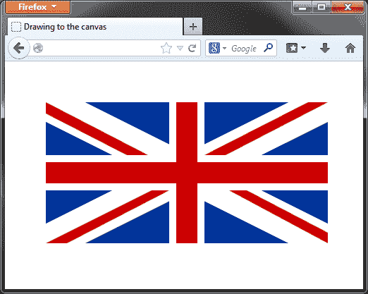
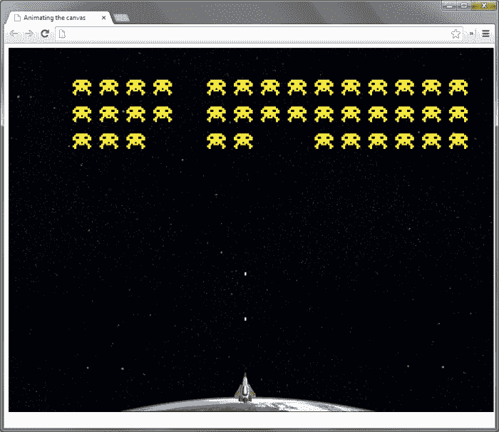

# 十、画布动画

*在上一章中，我们研究了 CSS3 的最新功能之一，`transform`属性，它使我们能够创建动画旋转、倾斜、缩放和平移。在本章中，我们将看到 HTML5 新增的一个元素`<canvas>`元素。*

*思考`<canvas>`元素的最佳方式是将其视为艺术家可以在其上绘画的画布。我们可以使用 JavaScript API 方法绘制简单的线条或复杂的形状，并且还支持图像和文本。此时画布是二维的，但将来可能会扩展到包括 3D 支持。*

*最早由苹果提出并使用的`<canvas>`元素已经被大多数现代浏览器实现，被认为是 HTML5 规范中最稳定的元素之一。*

*我所看到的`<canvas>`元素的最佳描述是：“*画布是页面中的一个矩形，您可以使用 JavaScript 从[diveintohtml5.info](http://diveintohtml5.info)中绘制任何您想要的*”，我觉得这很好地概括了它。*

我们将在本章中讨论的主题包括：

*   HtmlCanvaElement 接口
*   `<canvas>`元素的图纸
*   为`<canvas>`元素设置动画
*   将`<canvas>`与 jQuery 一起使用
*   创建基于`<canvas>`的游戏

# 学习 HTMLCanvasElement 接口

HTMLCanvasElement 接口公开了允许我们定义和控制画布上绘制的形状的方法和属性。HTMLCanvasElement 接口可以根据方法的作用分解为不同的部分。

## 使用 canvas 元素

`<canvas>`元素本身有方法可以调用，包括：

<colgroup><col style="text-align: left"> <col style="text-align: left"></colgroup> 
| 

方法

 | 

用法

 |
| --- | --- |
| `getContext(a)` | 返回一个对象（准确地说是`CanvasRenderingContext2D`对象，然后可以调用 API 中的其他方法来操作`<canvas>`元素。参数指定要检索的上下文类型。目前只有二维上下文可用。 |
| `toDataURL()` | 返回表示`<canvas>`元素上图像的数据 URL。可选参数包括由数据 URL 表示的图像类型（默认值为 image/PNG），以及特定于该类型的任何参数，例如 image/JPG 数据 URL 的质量。 |

`<canvas>`元素可以被认为类似于``元素，它没有`src`属性。允许的属性包括元素的`width`和`height`参数，以及`id`和`class`属性等。没有与`<canvas>`元素相关联的特殊属性，尽管它可以包含其他元素。当浏览器无法显示`<canvas>`元素时，它可以将该元素的内容显示为回退。我们可以访问的`<canvas>`元素的唯一属性是`width`和`height`参数。设置这些属性中的任何一个都会导致`<canvas>`元素将其内容重置为空，这在我们想要清除它时非常有用。

## 理解语境方法

有两种方法与`getContext()`方法返回的上下文对象直接相关。这些是：

<colgroup><col style="text-align: left"> <col style="text-align: left"></colgroup> 
| 

方法

 | 

用法

 |
| --- | --- |
| `save()` | 保存画布的当前状态；仅保存变换，而不保存形状或路径。 |
| `restore()` | 恢复已保存的状态。 |

我们还可以设置几个全局属性，这些属性应用于`<canvas>`元素上的所有形状。这些属性是：

<colgroup><col style="text-align: left"> <col style="text-align: left"></colgroup> 
| 

所有物

 | 

用法

 |
| --- | --- |
| `globalAlpha` | 设置形状的 alpha 透明度。采用介于 0.0 和 1.0 之间的十进制值。 |
| `globalCompositeOperation` | 设置形状彼此重叠的方式。可用于创建遮罩和清除形状区域。 |

## 自然形态

`<canvas>`元素只定义了一个本机形状：矩形。这里需要注意的一点是，`<canvas>`元素没有内部的 DOM 树，我们在`<canvas>`元素上绘制的形状或路径不是作为`<canvas>`元素的子元素创建的，不能通过标准 DOM 操作方法访问。它们不是单独的对象，它们只是像素。在使用矩形时，专门使用脚本 API 中的方法包括以下内容：

<colgroup><col style="text-align: left"> <col style="text-align: left"></colgroup> 
| 

方法

 | 

用法

 |
| --- | --- |
| `clearRect(a,``b,``c,``d)` | 从画布区域删除所有形状和路径。参数`a`和`b`指定开始清除的坐标，参数`c`和`d`指定要清除的区域的宽度和高度。 |
| `fillRect(a,``b,``c,``d)` | 绘制一个矩形。参数`a`和`b`指定开始绘制的坐标，参数`c`和`d`指定其侧面的宽度和高度。 |
| `strokeRect(a,``b,``c,``d)` | 绘制矩形的轮廓。参数`a`和`b`表示形状的起始坐标，参数`c`和`d`表示其侧面的宽度和高度。 |

我们可以使用以下属性设置笔划（轮廓）或填充的颜色，以及放置阴影：

<colgroup><col style="text-align: left"> <col style="text-align: left"></colgroup> 
| 

所有物

 | 

用法

 |
| --- | --- |
| `fillStyle` | 设置填充的颜色。可以设置为 CSS 颜色或渐变对象。 |
| `shadowBlur` | 设置阴影上的模糊量。 |
| `shadowColor` | 设置阴影的颜色。可以设置为 CSS 颜色或渐变对象。 |
| `shadowOffsetX` | 设置阴影沿 x 轴的相对位置。 |
| `shadowOffsetY` | 设置阴影沿 y 轴的相对位置。 |
| `strokeStyle` | 设置笔划的颜色。可以设置为 CSS 颜色或渐变对象。 |

这些属性也可以在路径和文本上设置。它们并没有严格限制为原始形状。

## 使用路径绘制

除矩形以外的任何形状都必须使用路径绘制。这为我们提供了一种灵活的方式来绘制自定义和复杂形状。用于创建路径的一些方法包括：

<colgroup><col style="text-align: left"> <col style="text-align: left"></colgroup> 
| 

方法

 | 

用法

 |
| --- | --- |
| `arc(a, b, c, d, e, f)` | 绘制一个圆形子路径。参数`a`和`b`是子路径的起始坐标，`c`是半径，`d`是以弧度表示的起始角，和`e`是以弧度表示的终止角。最后一个参数`f`接受一个布尔值，指示是否应逆时针绘制子路径。 |
| `arcTo(a, b, c, d, e)` | 将圆形子路径绘制到指定点。参数`a`和`b`是起始坐标，`c`和`d`是结束坐标。参数`e`是半径。 |
| `beginPath()` | 启动一条新的路径。 |
| `bezierCurveTo(a, b, c, d, e, f)` | 沿贝塞尔曲线绘制子路径，贝塞尔曲线是一条具有两个控制点的曲线。参数`a`、`b`、`c`和`d`表示两个控制点的坐标，参数`e`和`f`表示子路径的结束坐标。 |
| `closePath()` | 通过从当前位置到当前路径列表中第一个子路径的起始位置绘制一条线来关闭路径。 |
| `fill()` | 将当前路径创建的形状上色。 |
| `lineTo(a, b)` | 创建从当前位置到指定为参数的坐标的新子路径。 |
| `moveTo(a, b)` | 将移动到参数指定的坐标，而不绘制新的子路径。 |
| `quadraticCurveTo(a, b, c, d)` | 沿二次曲线绘制子路径，二次曲线是具有单个控制点的曲线。参数`a`和`b`表示控制点的坐标，参数`c`和`d`表示子路径的结束坐标。 |
| `stroke()` | 将当前路径列表的轮廓上色。 |

路径有几个可以设置的属性，包括样式、线条、或 cap，或者路径的连接方式：

<colgroup><col style="text-align: left"> <col style="text-align: left"></colgroup> 
| 

所有物

 | 

用法

 |
| --- | --- |
| `lineCap` | 可将设置为对接（默认）、圆形或方形。 |
| `lineJoin` | 可将设置为斜接（默认）、圆形或斜面。 |
| `lineWidth` | 指定路径宽度的十进制。 |
| `miterLimit` | 确定两条路径连接的内点和斜接连接前的外点之间的长度。 |

## 绘制图像和图案

画布允许我们以相同的方式将背景图像分配给另一个元素，在画布上绘制图像。我们还可以根据图像或渐变绘制图案。这类方法包括：

<colgroup><col style="text-align: left"> <col style="text-align: left"></colgroup> 
| 

方法

 | 

用法

 |
| --- | --- |
| `drawImage(a,``b,``c)` | 在`<canvas>`元素上绘制图像。参数`a`是要绘制的图像，参数`b`和`c`是放置图像左上角点的坐标。请注意，此方法的其他变体允许不同的参数组合，从而允许缩放和切片图像。 |
| `createPattern(a,``b)` | 在`<canvas>`元素上绘制重复图案。参数`a`是用作模式的图像，`b`是重复类型。 |
| `createLinearGradient(a,``b,``c,``d)` | 在两点之间创建线性渐变。参数`a`和`b`是渐变的开始坐标，`c`和`d`是结束坐标。 |
| `createRadialGradient(a,``b,``c,``d,``e,``f)` | 在两个圆之间创建径向渐变。参数`a`和`b`是起始坐标，`c`是第一个圆的半径。参数`d`和`e`是第二个圆的起始坐标，`f`是其半径。 |
| `addColorStop(a,``b)` | 向渐变添加颜色。第一个参数是介于 0.0 和 1.0 之间的十进制数，是渐变中添加颜色的相对位置。第二个参数是要使用的颜色。 |

`drawImage()`和`createPattern()`方法非常相似；因为它们都用于在`<canvas>`元素上绘制图像。不同之处在于模式是重复的。渐变方法返回渐变对象，然后可以将其用作形状的填充或笔划样式。

## 文本字符串

文本字符串可以写入画布，但的样式很少，因为没有与文本关联的框模型；这意味着，没有填充、边距或边框。但是，我们可以使用其他属性设置字体和对齐方式，以及填充颜色或笔划颜色。这些方法包括：

<colgroup><col style="text-align: left"> <col style="text-align: left"></colgroup> 
| 

方法

 | 

用法

 |
| --- | --- |
| `fillText(a,``b,``c)` | 在`<canvas>`元素上创建纯文本字符串。第一个参数`a`是要写入的文本，参数`b`和`c`是文本的起始坐标。 |
| `measureText(a)` | 测量指定的文本字符串，并返回具有宽度属性的度量对象。 |
| `stroketext(a,``b,``c)` | 在`<canvas>`元素上创建大纲文本字符串。第一个参数是要编写的文本，参数`b`和`c`是文本的起始坐标。 |

我们可以在文本上设置的属性包括：

<colgroup><col style="text-align: left"> <col style="text-align: left"></colgroup> 
| 

所有物

 | 

用法

 |
| --- | --- |
| `font` | 设置文本的大小和字体系列。 |
| `textAlign` | 设置文本的对齐方式。可以是`start`（默认）、`end`、`left`、`right`或`center`。 |
| `textBaseline` | 设置文本的基线。可以是`alphabetic`（默认）、`top`、`hanging`、`middle`、`ideographic`或`bottom`。 |

## 运用转化方法

`<canvas>`元素可以应用我们在上一章中看到的相同的变换，可以使用以下方法应用：

<colgroup><col style="text-align: left"> <col style="text-align: left"></colgroup> 
| 

方法

 | 

用法

 |
| --- | --- |
| `rotate(a)` | 按指定的弧度数旋转形状。 |
| `scale(a,``b)` | 按规定量沿每个轴缩放形状，其中`a`为 x 轴，`b`为 y 轴。 |
| `translate(a,``b)` | 将形状沿各轴平移指定量，`a`为 x 轴，`b`为 y 轴。 |
| `transform(a,``b,``c,``d,``e,``f)` | `transform()`方法等效于矩阵变换形式函数，并可以相同方式用于缩放、平移和/或扭曲形状。 |
| `setTransform(a, b, c, d, e, f)` | 将当前转换重置为标识矩阵，然后使用相同的参数调用`transform()`方法。这实际上撤消了当前的转换，然后在一个步骤中设置指定的转换。 |

## 像素操作

`<canvas>`元素甚至允许我们直接处理画布中的像素，并可以将形状检索为`imageData`对象，或者通过在像素级操纵`<canvas>`元素直接创建形状。我们有以下操作像素的方法：

<colgroup><col style="text-align: left"> <col style="text-align: left"></colgroup> 
| 

方法

 | 

用法

 |
| --- | --- |
| `createImageData(a,``b)` | 使用提供的参数作为宽度和高度属性，创建一个新的空白`imageData`对象。此方法也可以传递给另一个`imageData`对象，这将导致该方法返回一个（空）`imageData`对象，该对象的宽度和高度与原始对象相同。 |
| `getImageData(a,``b,``c,``d)` | 返回包含`<canvas>`元素指定区域的像素数据的`imageData`对象。参数`a`和`b`是区域的起始坐标，参数`c`和`d`是宽度和高度。 |
| `putImageData(a,``b,``c)` | 将像素数据绘制到`<canvas>`元素。第一个参数是要使用的`imageData`对象，第二个和第三个参数是结果形状的起始坐标。 |

所有的`imageData`对象，无论是我们从`<canvas>`元素获得的对象，还是我们用`createImageDate()`方法创建的对象，都有几个我们可以利用的属性，包括：

<colgroup><col style="text-align: left"> <col style="text-align: left"></colgroup> 
| 

所有物

 | 

用法

 |
| --- | --- |
| `data` | 此属性是一个`CanvasPixelArray`，当我们从`<canvas>`元素获取`imageData`对象时，它是只读的。我们还可以使用它来设置我们创建的`imageData`对象中的像素数据。该阵列每像素包含四个项目：像素的`r`、`g`和`b`值，以及 alpha。 |
| `height` | 图像的高度由`imageData`对象表示。此属性是只读的。 |
| `width` | 图像的宽度由`imageData`对象表示。此属性为只读。 |

# 画到画布上

从理论上讲，以编程方式绘制`<canvas>`元素非常简单。这些方法和属性易于使用，并且在支持的浏览器之间非常一致。直接像素操作是 API 中最难掌握的部分，但除此之外，没有什么真正复杂的东西。

我们确实发现，我们的代码可以非常快速地安装起来。一旦我们绘制了多个复杂的形状，并设置了各种属性，我们的代码就可以轻松地运行到几百行或更多行，甚至对于相对简单的图形也是如此。当设置`<canvas>`元素内容的动画时尤其如此。

# 行动时间-画到画布上

让我们来看一个快速绘制非动画形状的例子。我们甚至不需要 jQuery。

1.  将`<canvas>`元素添加到模板文件

    ```js
    <canvas id="c" width="500" height="300">
      <p>Your browser doesn't support the canvas element!</p>
    </canvas>
    ```

    的`<body>`标记中
2.  接下来，我们可以添加将绘制到`<canvas>`元素的 JavaScript。我们要画一面国旗。函数在模板文件底部的`<script>`元素中，并在其位置添加以下代码：

    ```js
    var canvas = document.getElementById("c"),
      context = canvas.getContext("2d");
      context.fillStyle = "#039";
      context.fillRect(50, 50, 400, 200);

      context.beginPath();
      context.strokeStyle = "#fff";
      context.lineWidth = 50;
      context.moveTo(250, 50);
      context.lineTo(250, 250);
      context.moveTo(50, 150);
      context.lineTo(450, 150);
      context.moveTo(50, 50);
      context.lineTo(450, 250);
      context.moveTo(50, 250);
      context.lineTo(450, 50);
      context.stroke();
      context.closePath();

      context.strokeStyle = "#C00";
      context.lineWidth = 30;
      context.beginPath();
      context.moveTo(250, 50);
      context.lineTo(250, 250);
      context.moveTo(50, 150);
      context.lineTo(450, 150);
      context.stroke();
      context.closePath();

      context.lineWidth = 1;
      context.fillStyle = "#C00";

      context.beginPath();
      context.moveTo(50, 50);
      context.lineTo(195, 125);
      context.lineTo(165, 125);
      context.lineTo(50, 66);
      context.fill();
      context.closePath();
      context.beginPath();
      context.moveTo(450, 50);
      context.lineTo(305, 125);
      context.lineTo(275, 125);
      context.lineTo(422, 50);
      context.lineTo(450, 50);
      context.fill();
      context.closePath();

      context.beginPath();
      context.moveTo(450, 250);
      context.lineTo(310, 175);
      context.lineTo(335, 175);
      context.lineTo(450, 235);
      context.lineTo(450, 250);
      context.fill();
      context.closePath();

      context.beginPath();
      context.moveTo(50, 250);
      context.lineTo(200, 175);
      context.lineTo(225, 175);
      context.lineTo(80, 250);
      context.lineTo(50, 250);
      context.fill();
      context.closePath();
    ```

3.  将文件另存为`canvas.html`。
4.  If we run the page now in any modern browser, we should see something like the following screenshot:

    

5.  在前面的屏幕截图中，我们可以看到组成英国国旗的几何形状的简单排列（请注意，国旗并非完全按比例排列）。像这样的图像很容易使用`<canvas>`元素生成，但即使是简单的形状也需要大量代码。

## *刚才发生了什么事？*

我们首先使用 JavaScript 的`getElementById()`方法获取`<canvas>`元素，然后使用`getContext()`方法从`<canvas>`元素获取二维上下文对象。我们现在可以通过上下文对象与`<canvas>`元素交互。

我们使用`fillStyle`属性为上下文设置一些颜色，然后使用`fillRect()`方法绘制一个实心矩形。指定的参数是矩形的起始 x 和 y 位置以及宽度和高度。

填充矩形拾取我们刚刚设置的填充样式，它是深蓝色的，将形成标志的背景。我们现在需要在蓝色背景的顶部创建一个白色的水平和对角交叉。我们可以在国旗中间画两条粗线，一条垂直，一条水平。我们将为此使用路径，因此我们使用`beginPath()`方法启动一个新路径。

接下来，我们使用`strokeStyle`属性将笔划的颜色设置为白色，使用`lineWidth`属性将路径的宽度设置为白色。要绘制路径，我们必须告诉`<canvas>`元素（或者实际上是上下文对象）路径的起始位置，我们使用`moveTo()`方法来完成，指定要移动到的坐标作为参数（矩形的中上部）。

为了创建路径，我们使用`lineTo()`方法并指定路径结束位置的坐标（矩形的底部中间）。这给了我们垂直线。要创建水平路径，我们重复相同的过程，移动到矩形的左中间，然后绘制到右中间。

使用`moveTo()`方法指定的坐标始终相对于画布本身，`0,``0`表示画布的左上角。这同样适用于`lineTo()`方法，即使绘制的线从`moveTo()`最后一次调用指定的点开始。

接下来，我们需要在背景矩形和垂直交叉点上画一个对角白色交叉点，我们将以与前面相同的方式使用`moveTo()`和`lineTo()`方法的组合绘制路径。

到目前为止，我们添加的所有路径都是同一路径的一部分，它们是子路径，在这一点上，它们实际上不可见。为了使它们可见，我们需要填充或笔划它们，因此我们使用`stroke()`方法笔划它们，然后使用方法`closePath()`关闭路径。

对于国旗的下一部分，我们需要在白色的十字架上画一个稍微薄一点的红十字。我们将为此使用另一条路径。我们设置了新的颜色样式和宽度，并再次在垂直和水平方向上绘制一条穿过矩形中心的新路径。

为了完成这面旗帜，我们需要再添加四个形状来制作红十字的对角线部分。我们不能对这些路径使用直线路径，因为它们不相交，并且它们的位置略有不同。这意味着我们必须手动将它们绘制为自定义形状并填充它们。

这四种形状实际上构成了代码的大部分，但我们基本上和以前做的事情非常相似。每个形状都是通过绘制子路径并填充它们而形成的。我们为每个形状使用一个新路径，以保持线的抗锯齿。如果我们对所有四个形状使用一条大路径，那么这些形状的边缘将是锯齿状的。

## 突击测验-画到画布上

问题 1。`fillRect()`方法需要哪些参数？

1.  矩形的 x 和 y 位置
2.  矩形的宽度和高度
3.  矩形的 x 和 y 位置、宽度和高度以及颜色
4.  矩形的 x 和 y 位置及其宽度和高度

问题 2。需要什么方法使路径可见？

1.  `strokeStyle`和`lineWidth`
2.  `moveTo()`和`lineTo()`
3.  `stroke()`或`fill()`
4.  `closePath()`

## 做一个英雄——创造你们国家的国旗

如果你不是英国人，试着在画布上画出你自己国家的国旗。我们可以使用用于循环的标准 JavaScript 创建重复形状的组合，因此可以利用这一点尽可能减少标记所需的代码。如果您来自英国，请尝试重新创建一个喜爱的徽标或图标。

如果您的旗帜（或徽标）的一部分非常复杂，请记住，我们可以为`<canvas>`元素以及线条和形状绘制图像，因此可以使用`<canvas>`元素绘制方法绘制旗帜的基本部分，然后为复杂部分使用图像。

# 画布动画制作

到目前为止，我们研究的`<canvas>`方法很容易使用，即使不是一点点，也没有重复性。在`<canvas>`元素上设置对象动画是事情开始变得有趣的地方。制作动画比简单地在`<canvas>`上画画要困难得多，因为除了反复试验，我们没有真正的调试方法，所以解决 bug 很快就会出现问题，而且有些费时。

在我们的 flag 示例中，使用`<canvas>`元素没有任何实际好处。只要在我们的页面上包含一幅旗帜的图像，我们就可以得到完全相同的效果，只需更少的代码和处理。然而，为`<canvas>`元素制作动画才是其真正的好处所在。这是我们可以做的比任何我们可以通过一个简单的图像实现的事情都多的事情。为`<canvas>`元素设置动画所带来的额外复杂性完全值得。

# 行动时间-在画布上创建动画

在本例中，我们将绘制与之前相同的标志，只是这次我们将设置不同形状的动画。本例中使用的底层 HTML 与前面的示例中完全相同。所有改变的是`<body>`元素末尾的`<script>`元素的内容。

1.  要制作本例的工作文件，只需删除`canvas-explorer.html`底部`<script>`元素中的所有内容，并将文件重新保存为`canvas-animated.html`。
2.  我们要做的第一件事是将蓝色矩形从画布的侧面带到`<canvas>`元素的中心。将以下代码添加到页面底部现在为空的`<script>`元素：

    ```js
    (function() {

      var canvas = document.getElementById("c"),

      init = function(context) {

        var width = 0,
          pos = 0,
          rectMotion = function() {
            if (width < 400) {
              width = width + 2;
              context.fillStyle = "#039";
              context.fillRect(0, 50, width, 200);
            } else if (pos < 50) {
              pos = pos + 2;
              canvas.width = 500;
              context.fillStyle = "#039";
              context.fillRect(pos, 50, 400, 200);
            } else {
              clearInterval(rectInt);	
              whiteLines(context);
            }
          },
          rectInt = setInterval(function() { rectMotion() }, 1);
      };
      if (window.ActiveXObject) {
        window.onload = function() {
          var context = canvas.getContext("2d");
            init(context);
        }
      } else {
        var context = canvas.getContext("2d");
        init(context);
      }
    })();
    ```

## *刚才发生了什么事？*

在本章前面的示例中，我们所有的变量都是全局变量，这在为真实世界编码时通常是不好的做法。在本例中，我们的代码在匿名函数的作用域内，因此变量只能在该函数内访问，因此不被视为全局变量。

在`init()`函数中，我们声明`width`和`pos`变量，然后定义另一个名为`rectMotion()`的内联函数，该函数将以一个间隔重复调用。在`<canvas>`元素边界之外绘制的任何形状都不存在，因此我们不能在视图之外绘制矩形，然后在视图中设置动画。相反，我们从左边缘开始逐渐构建矩形，并逐渐加宽矩形，直到其达到正确的宽度。

这是使用`if`语句的第一个分支完成的，当`width`变量小于 400 时，将执行该分支。为了加快动画的速度，我们实际上一次将矩形的宽度增加两个像素（尽管不同浏览器的动画速度也有很大差异），方法是增加`width`变量，然后在`fillRect()`方法中将该变量用作`width`参数。

一旦`width`变量达到 400，我们就转而使用`pos`变量。在条件的这一部分中，我们将`pos`变量增加了两个（矩形看起来一次移动两个像素，同样是为了速度），通过设置`<canvas>`元素的宽度重置`<canvas>`元素，并设置`fillStyle`属性。然后，我们使用`pos`变量作为 x 轴位置的参数，绘制新的矩形。

看起来好像矩形正在向右移动，但事实并非如此。我们实际上是在破坏矩形，然后画一个全新的矩形，在原始矩形的右边有两个像素。

一旦矩形位于正确的位置，我们清除间隔，然后调用传递上下文对象的下一个函数（我们将很快添加此函数）。在`rectMotion()`函数之后，我们添加了一个包含区间 ID 的最终变量，该区间调用函数为矩形设置动画。动画完成后，我们使用此变量清除间隔。

如果在这一点运行浏览器，则在停止中间之前，蓝色矩形会从左侧移动到 AutoT0EY 元素中。接下来，我们需要在蓝色矩形上设置水平和对角白色十字的动画。

# 行动时间-设置白色十字架的动画

在动画的这一部分，我们将从中间画一条白线，穿过矩形的中心，然后使对角线从中心延伸到各个角。到目前为止，应在代码中的`canvas`和`init`变量之间添加以下代码：

```js
whiteLines = function(context) {

  context.fillStyle = "#fff";
  context.strokeStyle = "#fff";
  context.lineWidth = 50;

  var width = 0,
    height = 0,
    pos = {
      ne: { x: 250, y: 150 },
      se: { x: 250, y: 150 },
      nw: { x: 250, y: 150 },
      sw: { x: 250, y: 150 }
    },
    growDiagonal = function() {
      if (pos.ne.x >= 50) {
      context.beginPath();
      context.moveTo(pos.ne.x, pos.ne.y);
      context.lineTo(pos.ne.x - 4, pos.ne.y - 2);
      context.moveTo(pos.se.x, pos.se.y);
      context.lineTo(pos.se.x - 4, pos.se.y + 2);
      context.moveTo(pos.nw.x, pos.nw.y);
      context.lineTo(pos.nw.x + 4, pos.nw.y + 2);
      context.moveTo(pos.sw.x, pos.sw.y);
      context.lineTo(pos.sw.x + 4, pos.sw.y - 2);
      context.stroke();
      context.closePath();

      pos.ne.x = pos.ne.x - 2;
      pos.ne.y = pos.ne.y - 1;
      pos.se.x = pos.se.x - 2;
      pos.se.y = pos.se.y + 1;
      pos.nw.x = pos.nw.x + 2;
      pos.nw.y = pos.nw.y + 1;
      pos.sw.x = pos.sw.x + 2;
      pos.sw.y = pos.sw.y - 1;
    } else {
      clearInterval(crossInt);
      redCross(context);
    }
  },
  growVertical = function() {

    if (height < 200 || width < 400) {
      if (height < 200) {
        height = height + 2;
        context.fillRect(225, 50, 50, height);
      }
      if (width < 400) {
        width = width + 4;
        context.fillRect(50, 125, width, 50);
      }
    } else {
      clearInterval(rectInt);
      crossInt = setInterval(function() { growDiagonal() }, 1);
    }
  },
  rectInt = setInterval(function() { growVertical() }, 1);
},
```

## *刚才发生了什么事？*

本质上，我们有另一个内联函数，它包含另一个函数，该函数通过另一个间隔被重复调用。当我们这次画白色十字时，我们需要设置一些样式属性（我们将在这个函数中画直线和矩形，因此设置`fillStyle`和`strokeStyle`以及`lineWidth`属性）。

我们初始化`width`和`height`控制变量，这将用于控制间隔运行的次数，我们还将垂直交叉和对角交叉的起始位置存储在一个名为`pos`的对象中。

然后我们定义两个内联函数，一个用于创建垂直十字，另一个用于创建对角十字。首先使用一个间隔调用`growVertical()`函数，我们只需从上到下绘制一个白色矩形，并使用`width`和`height`变量在背景中心从左到右绘制一个矩形，以根据需要重复多次间隔。一旦矩形大小正确，间隔被清除，然后用另一个间隔调用`growDiagonal()`函数。

在这个函数中，我们需要画四条线，每个线在垂直交叉的中间开始。我们使用`pos`对象中的不同属性来实现这一点。每次执行函数时，我们都会移动到为对象中的每条线指定的 x 和 y 位置，然后向相关的角点绘制。然后，我们更新对象中的属性，为函数的下一次迭代做好准备。

每个属性都需要按不同的量进行更新，例如，从矩形中心移动到左上角的直线需要沿 x 轴和 y 轴负向移动，而要移动到右上角的直线需要沿 x 轴正向移动，但沿 y 轴负向移动。我们在函数的每次迭代中使用一个新的路径来保持线的抗锯齿。

画好线后，我们清除间隔并调用下一个函数。现在我们来定义这个函数。它应该放在`canvas`变量之后，但是直接放在我们刚才添加的`whiteLines()`函数之前。

# 行动时间-设置红色十字架的动画

我们现在需要做的就是画垂直的红十字和四个自定义的红色形状。在`<script>`元素顶部附近的`rectInt`变量声明和前面定义的`whiteLines`函数之间的中添加以下代码：

```js
redCross = function(context) {
  context.fillStyle = "#C00";
  context.strokeStyle = "#C00";
  context.lineWidth = 30;
  var width = 0,
    height = 0,
    pos = { 
      up : { x: 250, y: 150 },
      down : { x: 250, y: 150 },
      left: { x: 250, y: 150 },
      right: { x: 250, y: 150 }
    },

    addStripes = function() {
      context.lineWidth = 1;

      function makeStripe(props) {
        context.beginPath();
        context.moveTo(props.startX, props.startY);
        context.lineTo(props.line1X, props.line1Y);
        context.lineTo(props.line2X, props.line2Y);
        context.lineTo(props.line3X, props.line3Y);
        context.fill();
        context.closePath();
      }

      setTimeout(function() { makeStripe({ 
        startX: 50, startY: 50,
        line1X: 195, line1Y: 125,
        line2X: 165, line2Y: 125,
        line3X: 50, line3Y: 66
      })}, 1);
      setTimeout(function() { makeStripe({ 
        startX: 450, startY: 50,
        line1X: 305, line1Y: 125,
        line2X: 275, line2Y: 125,
        line3X: 422, line3Y: 50
      })}, 50);
      setTimeout(function() { makeStripe({ 
        startX: 450, startY: 250,
        line1X: 310, line1Y: 175,
        line2X: 335, line2Y: 175,
        line3X: 450, line3Y: 235
      })}, 100);
      setTimeout(function() { makeStripe({ 
        startX: 50, startY: 250,
        line1X: 200, line1Y: 175,
        line2X: 225, line2Y: 175,
        line3X: 80, line3Y: 250
      })}, 150);
    },
    growVertical = function() {

      if (height < 100 || width < 200) {
        if (height < 100) {
          context.beginPath();
          context.moveTo(pos.up.x, pos.up.y);
          context.lineTo(pos.up.x, pos.up.y - 2);
          context.moveTo(pos.down.x, pos.down.y);
          context.lineTo(pos.down.x, pos.down.y + 2);
          context.stroke();
          context.closePath();

          height = height + 2;
          pos.up.y = pos.up.y - 2;
          pos.down.y = pos.down.y + 2;
        }
        if (width < 200) {
          context.beginPath();
          context.moveTo(pos.left.x, pos.left.y);
          context.lineTo(pos.left.x - 2, pos.left.y);
          context.moveTo(pos.right.x, pos.right.y);
          context.lineTo(pos.right.x + 2, pos.right.y);
          context.stroke();
          context.closePath();

          width = width + 2
          pos.left.x = pos.left.x - 2;
          pos.right.x = pos.right.x + 2;
        }
      } else {
        clearInterval(crossInt);
        addStripes();
      }

    },
    crossInt = setInterval( function() { growVertical() }, 1);
},
```

## *刚才发生了什么事？*

同样，我们有一个外部内联函数（称为`redCross()`），其中包含一些设置颜色和线条样式的属性，以及一些用于绘制红十字和四个自定义形状的嵌套函数。与前面的函数一样，我们声明了`width`和`height`控制变量，以及一个名为`pos`的对象，其中包含组成十字线的起始位置。首先使用`growVertical()`功能绘制十字。

此函数与代码最后一节中的函数非常相似。我们绘制四条线开始在矩形的中部，辐射到顶部和底部中心，以及右和左中心。

四个自定义形状是使用一个主函数绘制的，该主函数接受一个指定起点（传递给`moveTo()`方法）的配置对象，以及组成每个子路径的点（传递给`lineTo()`方法）。然后，我们使用`setTimeout`JavaScript 函数一个接一个地创建每个形状，使用传递给主函数的对象指定画布上的相关点来绘制每个形状。

这就是我们需要的全部代码；所以现在当我们运行页面时，我们应该看到正在绘制的标志的动画。该代码适用于所有浏览器，每个浏览器的性能水平各不相同。为`<canvas>`元素设置动画是关于条件`if`语句、间隔和超时的。正如我们所看到的，代码本身非常简单。我们只需要相当多的动画就可以制作出简单的动画。

## 突击测验-画布动画

问题 1。为什么我们要将对`setInterval()`的每个调用存储在一个变量中？

1.  出于性能原因
2.  以便在适当时清除间隔
3.  因为使用匿名函数作为函数的第一个参数创建了闭包
4.  这样我们就可以将参数传递给区间调用的函数

问题 2。在第一个函数中，我们绘制了蓝色矩形，每次间隔调用`rectMotion()`函数时，我们都设置`<canvas>`元素的宽度。为什么？

1.  以确保`<canvas>`元素足够大，可以在其增长时包含矩形
2.  更正 Internet Explorer 中的错误
3.  重置`<canvas>`元素的状态，确保动画中每个点只有一个矩形
4.  作为设置`fillStyle`属性的要求

## 有一个围棋英雄-创建画布动画

回到你画的本国国旗的静态版本（或你选择的标志或图像），并对其进行转换，以使国旗的不同部分具有动画效果并得以存在。

# 创建画布游戏

最好的动画是那些互动的、吸引用户的动画，而这正是游戏作为一个连续的、用户驱动的动画的表现方式。当`<canvas>`元素被用于创建游戏时，它的力量得到了最好的展示，我们将在本节中看到这一点。

我们将创建一个非常基本的 arcade classic*太空入侵者*的克隆，其中一系列外星飞船在屏幕上缓慢前进，底部有一艘用户控制的太空飞船，可以射杀来袭的外星人：



# 行动时间–创建初始页面

我们将用于此示例的初始页面与前面示例中使用的页面类似：

1.  在文本编辑器中创建包含以下标记的新页面：

    ```js
    <!DOCTYPE html>
    <html lang="en">
      <head>
        <meta charset="utf-8">
        <title>A canvas and jQuery Game</title>
        <link rel="stylesheet" href="css/canvas-game.css">
      </head>
      <body>
        <canvas tabindex="1" id="c" width="900" height="675">
          <p>Your browser doesn't support the canvas element!</p>
        </canvas>
        <script src="js/jquery.js"></script>
        <script>
          $(function() {

          });
        </script>
      </body>
    </html>
    ```

2.  将文件另存为`canvas-game.html`。我们还需要一个非常基本的样式表为我们的游戏。我们设计的只是`<canvas>`元素本身。创建包含以下样式规则的新样式表：

    ```js
    canvas {
      border:1px solid #000;
      margin:auto;
      display:block;
      outline:none;
      background:url(../img/bg.gif) no-repeat;
    }
    ```

3.  将此文件保存在`css`目录中为`canvas-game.css`。

## *刚才发生了什么事？*

页面上的主要元素当然是`<canvas>`元素。这与前面示例中使用的元素之间的唯一区别是，我们在其上设置了`tabindex`属性，以便它可以接收键盘事件，这是检测和响应用户输入所必需的。在本例中，我们还使用 jQuery，并使用标准匿名函数和我们在本书中使用的`$`别名结构。

我们使用的样式只是将`<canvas>`元素放置在页面中心，给它一个边框，并删除一些浏览器中聚焦元素周围的虚线轮廓。我们还在元素上设置了一个背景图像。

应用于`<canvas>`元素的背景图像有助于为我们的游戏设置场景，使用 CSS 在`<canvas>`元素上设置背景图像要比在其中绘制图像容易得多。

# 行动时间-创建初始脚本

游戏的脚本相当长，所以我们将从脚本的初始结构开始，在不同的部分中查看它。以下代码应进入页面底部的匿名函数：

```js
var canvas = document.getElementById("c"),
  context = canvas.getContext("2d"),
  motionInt = null,
  dirCounter = 0,
  alienSpeed = 1000,
  aliens = [],
  alienMotion = function(dir) {

  },

    addAliens = function() {

    },

    ship = new Image(),
    shipPos = [430, 600];

    ship.src = "img/ship.png";
    ship.onload = function() {

    context.drawImage(ship, shipPos[0], shipPos[1]);

    addAliens();

  };
```

## *刚才发生了什么事？*

本质上，我们在这里所做的就是定义一系列变量和一个`onload`事件处理程序。与前面的示例一样，首先定义了`canvas`和`context`变量，以便访问和操作画布。

我们还设置了一个名为`motionInt`、的变量，用于稍后保存`setInterval()`函数的 ID；一个名为`dirCounter`的变量，用于确定外星人移动的方向；一个`alienSpeed`变量用于设置外星人移动的速度；以及一个空的`aliens`数组，我们将使用它跟踪页面上的每个外星人。

接下来，我们定义了两个内联函数，一个用于移动外星人，另一个用于将外星人添加到页面。目前这些是空的，但我们将在下一步填充它们。我们还创建了一个新的图像，这将是用户控制的太空船，以及一个`shipPosition`阵列，用于跟踪飞船在页面上的位置。

一旦我们定义了所有的变量，我们就设置我们创建的新图像对象的`src`来表示宇宙飞船。然后，我们将一个`onload`事件处理程序附加到 ship 对象，一旦图像完成加载，就会执行该处理程序。在这个函数中，我们使用存储在`imagePosition`数组中的值在画布上绘制船舶。然后我们调用`addAliens()`函数，将外星人添加到画布中。接下来我们可以将代码添加到`addAliens()`函数中。

# 行动时间-将外星人添加到页面

将前一代码块中的`addAliens()`内联函数替换为以下代码：

```js
addAliens = function() {

  var alienPos = [13, 0],
  alien = new Image();

  alien.src = "img/alien.gif";
  alien.onload = function () {
    for (var x = 0; x < 15; x++) {
      for (var y = 0; y < 3; y++) {

        context.drawImage(alien, alienPos[0], alienPos[1]);

        var data = {
          img: alien, posX: alienPos[0], posY: alienPos[1] 
        };
        aliens.push(data);
        if (alienPos[1] < 100) {
          alienPos[1] = alienPos[1] + 50;
        } else {
          alienPos[0] = alienPos[0] + 50;
          alienPos[1] = 0;
        }
      };
    }
  };

  motionInt = setInterval(function () { alienMotion("right"); }, alienSpeed);
},
```

## *刚才发生了什么事？*

我们首先定义一个新的数组，当外星人最初被绘制到画布上时，我们将使用该数组递增地设置每个外星人飞船的位置。我们为将被所有外星飞船使用的图像定义了一个新的`Image`对象，并设置其`src`属性。然后，我们为新的外来图像设置一个`onload`处理程序，以便在图像加载完成后可以对其进行操作。

我们希望创建三行 15 个外星人，因此在`onload`处理程序中，我们从两个嵌套的`for`循环开始，其中外部循环运行 15 次，而在每个循环上，内部`for`循环执行三次。在嵌套循环中，我们首先使用存储在`alienPos`数组中的值将新的外星人绘制到画布上。然后，我们创建一个新的`data`对象，它存储对图像对象的引用，以及图像在画布上的 x 和 y 位置。然后将新的`data`对象推送到`aliens`数组中，我们在脚本开头定义了该数组。

然后更新`alienPos`数组中的值。如果数组中的第二个项（索引为`1`的项）小于 100，我们将向数组项的值添加 50。数组中的第二项对应于画布 y 轴上的位置。这将给我们一列三个外星人。请注意，我们将前三个外星人的 x 位置从`13`开始，而不是`0`，因此画布边缘和外星人的第一列之间有一个沟槽。

如果第二个数组项大于`100`，则将`50`添加到数组中的第一个项，该项对应于画布上的 x 轴，并将第二个数组项重置为零。这将给我们 15 列的三个外星人。

在画布上绘制完所有外星人后，我们根据`alienSpeed`变量中包含的毫秒数设置一个间隔，该间隔将重复执行下一个函数`alienMotion()`，该变量最初在脚本开始时设置为`1000`。间隔 ID 存储在我们在脚本开始时创建的`motionInt`变量中。接下来我们可以将代码添加到`alienMotion()`函数中。

# 行动时间-移动外星人

我们的下一段代码将给外星人提供他们的运动，使他们先沿画布向右移动，然后向下移动一行，然后向左移动，依此类推。将我们之前定义的`alienMotion()`功能替换为以下代码：

```js
alienMotion = function (dir) {

  var alienLength = aliens.length;

  if (dirCounter < 4) {

    for (var x = 0; x < alienLength; x++) {
      context.clearRect(aliens[x].posX, aliens[x].posY, aliens[x].img.width, aliens[x].img.height);
    }

    for (var y = 0; y < alienLength; y++) {
      aliens[y].posX = (dir === "right") ?  aliens[y].posX + 35 : aliens[y].posX - 35;

    context.drawImage(aliens[y].img, aliens[y].posX, aliens[y].posY);
    }

    dirCounter++;
  } else {
    clearInterval(motionInt);
    dirCounter = 0;

    for (var z = 0; z < alienLength; z++) {
      context.clearRect(aliens[z].posX, aliens[z].posY, aliens[z].img.width, aliens[z].img.height);
    }

    if (aliens[alienLength - 1].posY > 530) {
      canvas.width = 900;
      context.fillStyle = "#fff";
      context.textAlign = "center";
      context.font = "bold 36px Tahoma";
      context.fillText("GAME OVER!", 450, 350);
      $(canvas).blur().unbind("keydown");
    } else {

      for (var a = 0; a < alienLength; a++) {
        aliens[a].posY = aliens[a].posY + 29;

        context.drawImage(aliens[a].img, aliens[a].posX, aliens[a].posY);
      }

      motionInt = (dir === "right") ? setInterval(function () { alienMotion("left"); }, alienSpeed) : setInterval(function () { alienMotion("right"); }, alienSpeed);
    }
  }
},
```

## *刚才发生了什么事？*

我们要做的第一件事是将数组的长度存储在局部变量中。我们将在该函数中使用几个`for`循环，因此只检索一次该值并将`for`循环的计数器变量与该变量进行比较是有意义的，而不是检查各个循环每次迭代的长度。

然后我们使用一个`if`语句来检查`dirCounter`变量是否小于`4`。记住，这是我们在脚本开始时设置的变量之一。如果变量小于`4`，我们首先使用`for`循环遍历`aliens`数组中的每个项目，并使用`clearRect()`函数从画布中移除外星人。

然后，我们使用第二个`for`循环，再次在`aliens`数组中循环，这一次通过在数组中当前项中存储的当前 x 位置中添加或删除 35 来更新每个外星人的 x 位置。

是否添加或删除 35 由传递到函数中的参数决定。第一次调用`alienMotion()`函数时，它将收到参数`right`，因此外星人最初会移动到右侧的画布上。然后我们把每个外星人画在新的位置上。一旦`for`循环完成，所有外星人都被画到新的位置，我们将更新`dirCounter`变量。

如果`dirCounter`变量等于`4`，外星人已经在画布上水平移动了，所以这次我们需要将外星人沿着画布线向下移动，而不是穿过画布线。在此条件分支中，我们清除控制水平移动的间隔，然后将`dirCounter`变量重置回`0`。然后清除每个外星人覆盖的矩形，将外星人从画布上移除。

在将外星人下线之前，我们首先检查数组中最后一个外星人的 y 位置是否大于`530`，因为这是外星人应该到达的距离画布顶部的最大距离。如果大于这个数字，至少有一个外星人已经到达画布的底部，玩家的游戏结束了。

在这种情况下，我们清除整个画布，移除太空船和任何幸存的外星人，并打印文本**游戏****结束！**在画布中央。我们还使用 jQuery 取消绑定控制太空船的键盘事件（我们将很快添加这些绑定）。

如果外星人尚未到达画布底部，我们将使用另一个`for`循环迭代数组中的每个外星人，并将其 y 位置向下移动一行，然后将每个外星人绘制到其新位置。

然后，我们设置一个新的间隔，将字符串以与前面使用的`alienMotion()`函数相反的方向传递。这些由四个步骤组成的循环，向右，向下，向左，等等，将持续到外星人到达画布底部，游戏结束。接下来，我们需要添加使玩家能够控制太空船的处理程序。

# 行动时间-增加操纵员控制船舶

以下代码块应替换 ship image 对象的`onload`事件处理程序：

```js
ship.onload = function () {

  context.drawImage(ship, shipPos[0], shipPos[1]);

  addAliens();
  $(canvas).focus().bind("keydown", function (e) {

    if (e.which === 37 || e.which === 39) {

      context.clearRect(shipPos[0], shipPos[1], ship.width, ship.height);

      if (e.which === 37 && shipPos[0] > 4) {
        shipPos[0] = shipPos[0] - 4;
      } else if (e.which === 39 && shipPos[0] < 896 - ship.width) {
        shipPos[0] = shipPos[0] + 4;
      }

      context.drawImage(ship, shipPos[0], shipPos[1]);
    } else if (e.which === 32) {
      context.fillStyle = "#fff";
      var bulletPos = shipPos[0] + 20,
        newBulletPos = [bulletPos, 596],
        alienLength = aliens.length,
        fire = function () {
          if (newBulletPos[1] > 0) {
            context.clearRect(newBulletPos[0], newBulletPos[1], 3, 6);
            newBulletPos[1] = newBulletPos[1] - 2;
            context.fillRect(newBulletPos[0], newBulletPos[1], 3, 6);

            for (var x = 0; x < alienLength; x++) {
              if (newBulletPos[1] === aliens[x].posY || newBulletPos[1] === aliens[x].posY + aliens[x].img.height) {
              if (newBulletPos[0] > aliens[x].posX && newBulletPos[0] - aliens[x].posX < aliens[x].img.width + 13) {
                context.clearRect(aliens[x].posX, aliens[x].posY, aliens[x].img.width, aliens[x].img.height);
                aliens.splice(x, 1);
                clearInterval(bulletInt);
                context.clearRect(newBulletPos[0], newBulletPos[1], 3, 6);
                if (!aliens.length) {
                  clearInterval(motionInt);
                  dirCounter = 0;
                  alienSpeed = alienSpeed - 100;
                  addAliens();
                }
              }
            }
          }
        } else {
          context.clearRect(newBulletPos[0], newBulletPos[1], 3, 6);
          clearInterval(bulletInt);
        }
      },
      bulletInt = setInterval(function () { fire(); }, 1);
    }
  });
};
```

## *刚才发生了什么事？*

我们使用 jQuery 将事件处理程序附加到侦听`keydown`事件的`<canvas>`元素。虽然我们不支持 IE，因此在附加事件时不需要 jQuery 进行跨浏览器规范化，但它仍然使事件处理过程更加容易。

在检测到`keydown`事件时执行的函数中，我们检查是否存在左箭头键或右箭头键（在`37`和`39`的事件对象中具有`which`属性），或空格键（代码为`32`。

如果检测到代码`37`或`39`，我们将使用嵌套的`if`语句来确定两个键之间的位置。我们还检查了船没有到达画布的左边缘或右边缘。

然后，我们使用`clearRect()`功能移除飞船，并根据按下的键，在左边或右边绘制一个新的飞船，左边为 4 像素，右边为 4 像素。这使船舶沿画布底部左右移动。

外部条件的第二个分支处理被按下的空格键，这会导致子弹离开飞船并沿直线移动到画布顶部。子弹将是白色的，因此我们将画布的`fillStyle`属性设置为`#fff`。

我们在这里还声明了一些局部变量，包括`bulletPos`，它是子弹的当前位置加上船的一半宽度，以及保存子弹的 x 和 y 坐标的数组。该数组的值在 x 位置设置为`bulletPos`变量，在 y 位置设置为船头正上方。我们还将外星人数组的长度存储为局部变量，以便再次在`for`循环中使用。

我们定义了一个内联函数以及名为`fire()`的变量。此功能与间隔一起使用，以创建子弹的运动。在此函数中，我们检查项目符号是否未到达画布顶部，如果没有，即如果其 y 位置大于`0`，我们使用`clearRect()`函数移除项目符号，然后更新`bulletPos`中的值数组并使用数组中的更新值在其新位置绘制项目符号。

一旦更新了子弹的位置，我们就需要检查子弹在新位置是否与外星人发生碰撞，因此我们使用`for`循环迭代外星人数组中的每个外星人。

在每次迭代中，我们首先检查子弹是否落在外星人的 y 轴内，即其位置是否小于外星人的下边缘，但大于其上边缘。外星人是根据他们的左上角来定位的，所以为了确定子弹是否已经通过了它的底边，我们只需将外星人的高度加到它的 y 位置。

如果子弹确实落在 y 轴上的外星人内，那么我们将检查它是否落在外星人沿 x 轴占据的空间内。如果有，我们使用`clearRect()`函数从画布上移除外星人，并将外星人从数组中拼接出来，使其保持移除状态。

然后，我们再次使用`clearRect()`功能从画布上移除子弹，并清除`bulletInt`间隔。如果没有剩余的外星人，我们清除产生外星人运动的间隔，重置`dirCounter`变量，将`alienSpeed`变量减少`100`，然后调用`addAliens()`函数在画布顶部重新绘制外星人。

这就是玩家提升到下一个级别的有效方式，每次外星人被重绘时，他们移动得更快，创造了游戏的基本进展。现在我们到了代码的末尾。如果我们现在在标准兼容浏览器（如 Firefox 或 Chrome）中运行游戏，我们会发现我们有一个完全可以玩的游戏，完全使用 JavaScript 和`<canvas>`元素实现。

## 突击测验–创建基于画布的游戏

问题 1。在本例中，许多与玩家的太空船相关的特性被放入`onload`事件处理程序中。为什么？

1.  因为在图像完全加载之前，我们无法与图像交互
2.  使代码在 Internet Explorer 中正常工作
3.  因为一旦图像完成加载，代码运行得更快
4.  使我们的代码更加模块化

问题 2。为什么我们在编写**游戏****时将画布的`textAlign`属性设置为居中！**消息？

1.  设置对齐方式是将文本写入画布的先决条件
2.  因为这比计算文本的宽度然后设置其在 x 轴上的位置以便将文本定位在画布的中心更容易
3.  要消除文本的别名，请执行以下操作：
4.  因为它比使用填充更有效

## 有一个英雄——扩展太空入侵者克隆

我们的游戏是一个更简单的版本，原来的太空入侵者。最初的街机游戏还有许多其他功能，包括向玩家的飞船开火的外星人，隐藏在后面的基地，以及在整个游戏中随机出现的一次性特殊外星人，命中后会掉落奖金。

当然，游戏需要的一件事是得分机制；否则，根本就没有玩的动机。实施一个计分系统，在整个游戏中跟踪玩家的分数，并将最高分数保存到玩家的机器上。使用 jQuery 和 cookie 插件，或者使用 LocalStorage，可以很容易地做到这一点。

我还敦促你，因为这是本书的最后一个例子，实现一些其他缺失的功能，比如让外星人能够还击，并添加基地或盾牌，玩家可以在困难时隐藏在下面。

# 总结

在本章中，我们研究了 HTML5`<canvas>`元素，并了解了它如何用于创建简单和静态图像、基本动画，甚至复杂的交互式游戏。它提供了一个丰富的 API，允许我们以编程方式与之交互，并为我们提供对页面某个区域的完整像素级控制。

在本章中，我们介绍了`HTMLCanvasElement`界面，绘制`<canvas>`元素，在`<canvas>`元素上创建动画，并使用`<canvas>`元素创建了一个互动游戏。与上一章中的 CSS3 示例一样，jQuery 中没有专门用于`<canvas>`的方法或属性，尽管有许多插件将`<canvas>`的功能与 jQuery 的易用性结合在一起，还有一些项目扩展了 jQuery 的`animate()`方法，以允许它处理绘制到画布上的对象。关于这方面的更多信息，史蒂文·维滕斯的博客[是一个很好的起点 http://acko.net/blog/abusing-jquery-animate-for-fun-and-profit-and-bacon](http://acko.net/blog/abusing-jquery-animate-for-fun-and-profit-and-bacon) 。

我们现在已经到了书的结尾。我希望在这 10 章中，我给你提供了一个坚实的基础，用 jQuery 来制作动画，这是你把你的网络 UI 导入生活的一个坚实的起点。