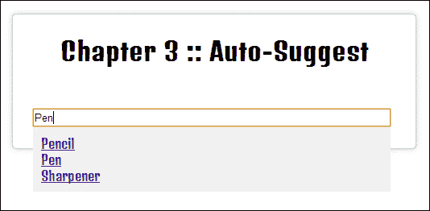

# 三、使用 AJAX 和 JSON 加载和操作动态内容

在本章中，我们将介绍：

*   将 HTML 从 web 服务器加载到页面
*   使用 AJAX 和处理服务器错误
*   处理 JSON 数据
*   搜索 JavaScript 对象
*   排序 JavaScript 对象
*   缓存 JSON 和 AJAX 请求
*   创建搜索功能
*   创建自动建议功能
*   等待 AJAX 响应

# 导言

jQuery 允许开发人员进行 AJAX 调用，以更新网站内容，而无需刷新完整的网页。jQuery 的 AJAX 功能为网站增加了一个额外的维度，使其更像一个 web 应用。本章介绍开发人员如何发出这些 AJAX 请求、接收数据和处理数据。除了处理和利用从 AJAX 请求接收的数据外，本章还将介绍 AJAX 的其他一些主要功能，包括搜索和建议。

对于本章中的大多数配方，您要么需要在本地计算机上运行 web 服务器，要么需要访问联机 web 服务器。PHP 和 MySQL 的一些基础知识将非常有用，因为所需的 web 服务器将使用这些技术。要了解有关这些技术的更多信息，您可以参考以下资源：

*   欲了解更多关于 PHP 的信息，请参阅[http://www.php.net](http://www.php.net)
*   有关 MySQL 的更多信息，请参阅[http://www.mysql.com](http://www.mysql.com)

# 将 HTML 从 web 服务器加载到页面中

在最基本的层面上，AJAX 允许我们使用来自 web 服务器的新内容更新单个页面元素。本食谱着眼于我们如何使用 PHP 设置从 web 服务器接收的一些数据，以及我们如何接收这些数据并将其应用到我们的网页。

## 准备好了吗

确保您有一个正在运行的 web 服务器，并且可以访问其 web 根目录。

## 怎么做…

执行以下步骤创建所需的 PHP、MySQL 和 HTML，以了解如何将 jQuery 与 AJAX 结合使用：

1.  在我们可以从 web 服务器请求在我们的网页中显示任何数据之前，我们需要能够从 web 服务器提供这些数据。创建一个名为`request-1.php`的 PHP 文件。添加以下 PHP 代码并将其保存在 web 服务器的 web 根目录中：

    ```js
    <?php
      $num = rand(1, 5);
      switch ($num) {
        case 1:
          $quote = "Learn from yesterday, live for today, hope for tomorrow. The important thing is not to stop questioning.";
          break;
        case 2:
          $quote = "Only two things are infinite, the universe and human stupidity, and I'm not sure about the former.";
          break;
        case 3:
          $quote = "The difference between stupidity and genius is that genius has its limits.";
          break;
        case 4:
          $quote = "Try not to become a man of success, but rather try to become a man of value.";
          break;
        case 5:
          $quote = "Any man who can drive safely while kissing a pretty girl is simply not giving the kiss the attention it deserves.";
          break;
      }
      echo $quote;
    ```

2.  第二步是创建一个 jQuery 支持的 HTML 页面，该页面可以从 PHP 脚本请求数据。在您的 web 服务器的 web 根目录中，创建一个名为`recipe-1.html`的 HTML 文件，并向其添加以下 HTML 代码：

    ```js
    <!DOCTYPE html>
    <html>
    <head>
      <title>Chapter 3 :: AJAX & JSON</title>
      <script src="jquery.min.js"></script>
      <style type="text/css">

      </style>
      <script>

      </script>
    </head>
    <body>
      <div class="left">
        Famous <br />Einstein Quotes
      </div>
      <div class="right">
        <p class="quote"></p>
        <button class="refresh">Get Quote</button>
      </div>
    </body>
    </html>
    ```

3.  我们现在将使用 CSS 向 HTML 页面添加样式。在`recipe-1.html`文件的`<style type="text/css"></style>`标记中添加以下 CSS 代码：

    ```js
    .left {
      width: 200px;
      background-color: #CCC;
      float: left;
      height: 100px;
      text-align: center;
      font-size: 25px;
      padding: 40px 10px 10px 10px;
    }
    .right {
      width: 300px;
      float: left;
      margin-left: 10px;
      background-color: #333;
      color: #FFF;
      height: 120px;
      font-size: 20px;
      position: relative;
      padding: 20px 10px 10px 10px;
    }
    .refresh {
      position: absolute;
      right: 5px;
      top: 5px;

    }
    ```

4.  最后一步是添加一些 jQuery 代码，以便从 PHP 脚本请求数据并将其加载到我们的网页中。在`recipe-1.html`文件头中的脚本标记中，添加以下 jQuery 代码：

    ```js
    $(function() {
      $('.refresh').click(function() {
        $.ajax({
          url: '/request-1.php',
          type: 'GET'
        }).done(function(data){
          $('.quote').html(data);
        });
      });
    });
    ```

## 它是如何工作的…

现在，让我们详细了解前面执行的步骤。

### PHP

使用 PHP 脚本的目的是将 Albert Einstein 的随机引用作为字符串提供。为了能够随机地进行，我们首先需要生成一个随机数。这是使用 PHP`rand()`函数完成的，如下所示：

```js
$num = rand(1, 5);
```

这将创建一个在`1`到`5`之间具有随机整数值的变量。然后，我们可以使用这个随机数来确定输出哪个报价。我们使用一个基于`$num`变量的 switch 语句创建一个带有随机引号的`$quote`变量：

```js
switch ($num) {
    case 1:
      $quote = "Learn from yesterday, live for today, hope for tomorrow. The important thing is not to stop questioning.";
      break;
    case 2:
      $quote = "Only two things are infinite, the universe and human stupidity, and I'm not sure about the former.";
      break;
    case 3:
      $quote = "The difference between stupidity and genius is that genius has its limits.";
      break;
    case 4:
      $quote = "Try not to become a man of success, but rather try to become a man of value.";
      break;
    case 5:
      $quote = "Any man who can drive safely while kissing a pretty girl is simply not giving the kiss the attention it deserves.";
      break;
  }
```

最后，我们响应`$quote`的值：

```js
echo $quote;
```

如果您要访问浏览器中的 web 服务器（即`http://localhost/request.php`）提供的此文件，则每次刷新页面时都会显示一个随机引用，如以下屏幕截图所示：


### HTML

我们需要一个 HTML 页面来加载 PHP 生成的报价。在 HTML 中，我们定义了一个简单的 HTML 布局。我们用类`left`创建了一个除法元素。此框仅包含标题**爱因斯坦名言**。我们用类`right`定义了一个第二个 div 元素和两个子元素，一个段落和一个按钮。


在前面的屏幕截图中，右侧的框由带有`quote`类的段落元素组成，我们将在这里使用 jQuery 加载动态内容。我们将使用该按钮允许用户触发报价的动态加载。请注意，您也可以在页面加载时加载报价，而无需用户交互。

### CSS

为了使网页包含我们的动态引号，我们使用一些非常基本的 CSS 对我们在 HTML 中创建的各种元素进行样式设置和对齐，如下所示：

```js
.left {
  width: 200px;
  background-color: #CCC;
  float: left;
  height: 100px;
  text-align: center;
  font-size: 25px;
  padding: 10px;
  padding-top: 40px;
}
```

我们使具有`left`类的 div 元素具有静态宽度和高度，然后强制它浮动在浏览器窗口的左侧。设置静态高度以确保左侧和右侧 div 元素的高度相等。我们还添加了一些基本的文本格式，包括`line-height`、`text-align`和`font-size`，这些格式都是不言自明的。我们还更改了 div 元素的背景色，并为进一步的文本对齐添加了一些填充。

```js
.right {
  width: 300px;
  float: left;
  margin-left: 10px;
  background-color: #333;
  color: #FFF;
  height: 120px;
  font-size: 20px;
  position: relative;
  padding: 10px;
  padding-top: 20px;
}
```

我们在右侧的 division 元素中添加了非常相似的样式，并添加了`position: relative;`，这使得我们可以防止具有绝对位置的兄弟元素浮动在此 div 元素之外。

```js
.refresh {
  position: absolute;
  right: 5px;
  top: 5px;
}
```

由于父`.right`分割元素具有相对位置，我们可以将`.refresh`按钮的位置设置为绝对位置，并将顶部和右侧的位置值设置为静态，迫使按钮浮动到`.right`分割框的右上角。

### jQuery

使用 jQuery，我们可以向我们之前创建的`request.php`页面发出请求，该页面位于我们的 web 服务器上。首先，我们创建一个事件处理程序并将其附加到“刷新”按钮，以便在用户单击该按钮时发出请求。

```js
$('.refresh').click(function() {

});
```

当用户点击`.refresh`按钮时，`function(){}`内的任何代码都将被执行。在这个回调函数中，我们可以使用 jQuery 提供的`$ajax`进行 AJAX 请求：

```js
$.ajax({
  url: '/request.php',
  type: 'GET'
}).done(function(data){
  $('.quote').html(data);
});
```

我们为`$.ajax()`提供了一个对象，它允许我们指定进行 AJAX 调用所需的一组参数。在本例中，我们提供了`url`和`type`参数，告诉 jQuery 在哪里发出请求以及它应该是什么类型的请求。

### 注

阅读`$.ajax()`上的文档，了解更多有关可提供的其他参数的信息。API 文档可在[中找到 http://api.jquery.com/jQuery.ajax/](http://api.jquery.com/jQuery.ajax/) 。

此外，我们在 AJAX 请求方法之后附加了一个`.done()`函数，并为其提供了一个接受参数`data`的回调函数。此`data`参数将保存来自服务器的响应。在回调函数中，我们使用`$('.quote').html(data);`将`.quote`段中的 HTML 替换为 PHP 脚本的响应。如果用户访问此 HTML 页面并单击**获取报价**按钮，将显示如下屏幕截图所示的结果：


## 另见

*   *创建搜索功能*
*   *创建自动建议功能*
*   *等待 AJAX 响应*

# 使用 AJAX 和处理服务器错误

在理想情况下，web 应用永远不会出错。不幸的是，情况并非如此，web 开发人员需要优雅地处理错误并向用户提供有用的反馈。

例如，无法访问服务器或缺少文件/网页时会发生系统错误。系统错误通常是不可避免的，用户无法控制。它们不同于应用错误，例如用户可以纠正的无效数据输入。

## 准备好了吗

由于此配方处理 AJAX 错误，并且我们将调用一个不存在的 PHP 脚本，因此此配方只需要 HTML 和 JavaScript。创建一个名为`recipe-2.html`的空白 HTML 文档，并确保已下载并准备好使用最新版本的 jQuery。

## 怎么做…

通过仔细执行以下步骤，了解如何处理 AJAX 错误：

1.  添加以下 HTML 代码，创建一个简单的网页，其中只有一个按钮将触发 AJAX 请求：

    ```js
    <!DOCTYPE html>
    <html>
    <head>
      <title>Chapter 3 :: AJAX & JSON</title>
      <script src="jquery.min.js"></script>
      <script>

      </script>
    </head>
    <body>
      <button id="makeRequest">Make AJAX request</button>
    </body>
    </html>
    ```

2.  在脚本标记中，添加以下 jQuery 代码，当点击`#makeRequest`按钮时，该代码将向不存在的文件发出 AJAX 请求：

    ```js
    $(function() {
      $('#makeRequest').click(function() {
      $.ajax({	
        url: 'i-do-not-exist.html',
        type: 'GET'
      }).done(function(data){
        //Will not succeed as no file exists
      });
      });
    });
    ```

3.  在 AJAX 请求下（但仍在`$(function(){});`内），添加以下代码，将创建一个全局 AJAX 错误事件处理程序，每次 AJAX 请求失败时都会触发该处理程序：

    ```js
    $(document).ajaxError(function(event, request, settings) {
      alert("Error trying to reach '" + settings.url + "'. ERROR CODE: " + request.status + " ERROR MESSAGE: " + request.statusText);
    });
    ```

## 它是如何工作的…

我们创建的 HTML 页面是不言自明的。我们创建了一个可以触发 AJAX 请求的按钮。这显然是说明错误处理概念的最简单示例，然后可以使用 jQuery 将其应用于任何 AJAX 请求情况。

我们为`#makeRequest`按钮创建了一个事件处理程序，并提供了一个在点击时执行的回调函数，如下所示：

```js
$('#makeRequest').click(function() {
  $.ajax({
    url: 'i-do-not-exist.html',
    type: 'GET'
  }).done(function(data){
  //Will not succeed as no file exists
  });
});
```

我们使用 jQuery 提供的`$.ajax()`函数在回调函数中添加 AJAX 请求。然后我们将一个 JavaScript 对象传递给这个方法，在这里我们指定不存在的文件的 URL 和请求的类型；在本例中，`GET`。请注意，如果 AJAX 请求失败，链接到`$.ajax()`函数的`.done()`函数将永远不会执行。

我们创建一个全局 AJAX 错误处理程序，并将其附加到文档中，以便它捕获页面中的所有 AJAX 错误：

```js
$(document).ajaxError(function(event, request, settings) {
  alert("Error trying to reach '" + settings.url + "'. ERROR CODE: " + request.status + " ERROR MESSAGE: " + request.statusText);
});
```

`.ajaxError`方法的回调函数提供了三个参数，我们可以使用它们来了解有关错误的更多信息。在本例中，我们从`settings`变量提取目标 URL，从`request`对象提取状态信息。

如果您在 web 浏览器中打开此 HTML 文件并单击`#makeRequest`按钮，您将看到一个 JavaScript 警报框，向您提供有关错误的信息，如以下屏幕截图所示：


## 还有更多…

在本例中，我们创建了一个全局 AJAX 错误处理程序来捕获页面中的所有 AJAX 请求错误。全局 AJAX 错误处理程序非常适合处理文件丢失或主机无法访问等请求错误。在这些情况下，对于所有 AJAX 请求，可以用相同的方式处理错误，并且不需要关于单个请求的更具体的信息。

应用中可能存在需要以不同方式处理一个或多个 AJAX 请求错误的实例。为此，您可以使用`.fail()`功能，其使用方式与`.done()`相同。以下 jQuery 代码提供了一个使用`.fail()`的示例，以实现与我们的全局错误处理程序相同的简单 AJAX 请求结果：

```js
$.ajax({
  url: 'i-do-not-exist.html',
  type: 'GET'
}).done(function(data){
  //Will not succeed as now file exists
}).fail(function(event){
  alert("An error occurred. Error Code: " + event.status);
});
```

请注意，有关错误的直接可用信息较少。

# 处理 JSON 数据

**JavaScript 对象表示法**（**JSON**）为 web 开发人员提供了一种干净高效的数据编码方式。JSON 是一种广泛采用的格式。它简化了数据处理和操作。要了解更多关于为什么要使用 JSON 的信息，请访问[http://www.revillweb.com/why-use-json/](http://www.revillweb.com/why-use-json/) 。

## 准备好了吗

确保您的 web 服务器正在运行，并且您有权访问 web 根目录，在那里您可以保存/上载作为此配方的一部分创建的文件。

## 怎么做…

通过执行以下步骤，了解如何将 JSON 格式的数据与 JavaScript 一起使用：

1.  创建一个名为`request-3.php`的 PHP 文件，并将其保存到 web 服务器的 web 根目录中。使用以下 PHP 代码创建并输出名称列表作为 JSON 数据：

    ```js
    <?php
      //Create an array of people
      $people = array(
        1 => array(
          "firstname" => "Luke",
          "lastname" => "Skywalker"
        ),
        2 => array(
          "firstname" => "Darth",
          "lastname" => "Vader"
        ),
        3 => array(
          "firstname" => "Mace",
          "lastname" => "Windu"
        )
      );
      //Ensure the browser is expecting the correct content
      //type format and charset
      header("Content-Type: application/json; charset=UTF-8");
      //Encode the array of people into JSON data
      echo json_encode($people);
    ?>
    ```

2.  在 web 服务器的 web 根目录中创建一个名为`recipe-3.html`的 HTML 页面。将以下 HTML 添加到此页面，这将创建一个无序列表元素，一旦处理完，就可以用 JSON 数据填充该元素：

    ```js
    <!DOCTYPE html>
    <html>
    <head>
      <title>Chapter 3 :: AJAX & JSON</title>
      <script src="jquery.min.js"></script>
      <script>
      </script>
    </head>
    <body>
      <ul id="peopleList"></ul>
    </body>
    </html>
    ```

3.  在 HTML 页面的 head 标记中的 script 标记中，添加以下 jQuery 代码，以对前面创建的`request-3.php`页面执行 AJAX 请求：

    ```js
    $(function(){
      $.ajax({
        url: '/request-3.php',
        type: 'GET'
      }).done(function(data){

      });
    });
    ```

4.  在`.done()`回调函数中，使用 jQuery`$.each()`函数处理从 PHP 页面返回的 JSON 数据，并为每个人在 HTML 页面的列表中添加一个新的列表项：

    ```js
    $.each(data, function(key, value) {
      $('#peopleList').append("<li>#" + key + " " + value.firstname + " " + value.lastname + "</li>");
    });
    ```

## 它是如何工作的…

现在，让我们详细了解前面执行的步骤。

### PHP

在实际应用中，您通常会从数据库检索数据。在这个配方中，我们创建了一个简单的二维名称数组，它将充当我们的数据库，使我们能够专注于 jQuery 代码。

```js
$people = array(
  1 => array(
    "firstname" => "Luke",
    "lastname" => "Skywalker"
  ),
  2 => array(
    "firstname" => "Darth",
    "lastname" => "Vader"
  ),
  3 => array(
    "firstname" => "Mace",
    "lastname" => "Windu"
  )
);
```

接下来，我们手动指定响应内容类型和字符集。应该指定响应的内容类型和字符集，以便 web 浏览器和 jQuery 代码知道预期数据的格式。大多数 web 浏览器都可以解决这个问题。但是，Internet Explorer 9 和更低版本在这方面尤其存在问题，使用 PHP 的`header()`函数手动指定内容类型和字符集始终是一种良好的做法：

```js
header("Content-Type: application/json; charset=UTF-8");
```

请注意，我们已将字符集设置为`UTF-8`，而不是`utf8`或`utf-8`。同样，大多数浏览器都可以使用这两种浏览器，但如果字符集格式不正确，一些早期的 Internet Explorer 版本将产生不希望的效果。

### 注

本配方中提到的与浏览器相关的问题不太可能出现在具有如此简单数据的示例中。这是一种最佳实践，将为使用 AJAX 和 JSON 的更大、更复杂的 web 应用提供更大的好处。

最后，我们使用 PHP 提供的`json_encode()`函数将我们的 PHP 数组编码为 JSON 格式，并使用`echo`输出结果，如下所示：

```js
echo json_encode($people);
```

如果您直接访问`request-3.php`页面，您将在浏览器窗口中看到`people`数组的输出，格式如下：

```js
{"1":{"firstname":"Luke","lastname":"Skywalker"},"2":{"firstname":"Darth","lastname":"Vader"},"3":{"firstname":"Mace","lastname":"Windu"}}
```

或者，使用浏览器开发人员工具并选择“网络”选项卡，您可以以更可读的方式查看响应。

### HTML

我们的 HTML 页面只包含 jQuery 库并创建一个 HTML 无序列表元素，一旦 jQuery 处理后，我们就可以用 JSON 数据填充该元素。

### jQuery

将我们的代码放入`$(function(){});`将导致其在页面加载时执行。我们使用 jQuery 的`$.ajax()`功能对之前创建的 PHP 文件发出 AJAX 请求，如下所示：

```js
$.ajax({
  url: '/request.php',
  type: 'GET'
}).done(function(data){
});
```

通过向该方法提供对象中的`url`和`type`参数，我们告诉一个方法向 web 服务器的 web 根目录中的`request-3.php`文件发出`GET`请求。然后，我们在`$.ajax();`方法上附加一个`.done()`函数，该函数将在成功发出请求后执行。`.done()`方法将回调函数作为参数，其中包含`data`变量，该变量包含来自请求的所有响应数据以及来自 PHP 文件的 JSON 数据。

既然`data`变量中有了可用的响应数据，我们就可以处理 JSON 数据并使用以下代码填充 HTML 列表元素：

```js
$.each(data, function(key, value) {
  $('#peopleList').append("<li>#" + key + " " + value.firstname + " " + value.lastname + "</li>");
});
```

`$.each();`是 jQuery 提供的另一个函数，它允许我们循环遍历一组数据，该数据在本例中被指定为第一个参数（即`data`。第二个参数是为`data`变量中的每个项执行的回调函数。此回调函数还接受两个参数，`key`和`value`。使用这些变量，我们可以从 JSON 数据中获取所有信息，包括数组键（例如，1、2、3 等）和值；每个对象的名字和姓氏。

最后，我们选择`#peopleList`元素，并使用`append()`函数向无序列表添加一个 HTML 列表项，其中包含来自`people`JSON 对象的数据。

## 另见

*   *搜索 JavaScript 对象*
*   *排序 JavaScript 对象*

# 搜索 JavaScript 对象

由于对象是应用中保存数据的主要方法，因此能够找到符合特定条件的对象非常有用。jQuery 没有为我们提供直接的方法来搜索对象和对象数组；但是，我们可以轻松创建此功能。

## 准备好了吗

使用您最喜欢的文本编辑器，创建一个名为`recipe-4.html`的空白 HTML 文档，并确保已安装最新版本的 jQuery。将以下 HTML 代码添加到此 HTML 文件：

```js
<!DOCTYPE html>
<html>
<head>
  <title>Chapter 3 :: AJAX & JSON</title>
  <script src="jquery.min.js"></script>
  <script>

  </script>
</head>
<body></body>
</html>
```

确保更新对 jQuery 库的引用，以指出它保存在计算机上的位置。这个 HTML 页面为我们提供了一个网页，我们可以在其中为这个配方执行 JavaScript。

## 怎么做…

创建一个 JavaScript 函数，通过执行以下步骤可以轻松搜索对象：

1.  在新创建的`recipe-4.html`页面的脚本标签中，在上创建一个对象数组，我们可以执行搜索：

    ```js
    var people = [
    {
      title: "Mr",
      firstname: "John",
      lastname: "Doe"
    },
    {
      title: "Mrs",
      firstname: "Jane",
      lastname: "Doe"
    },
    {
      title: "Sir",
      firstname: "Johnathan",
      lastname: "Williams"
    },
    {
      title: "Sir",
      firstname: "Edward",
      lastname: "Tailor"
    }
    ];
    ```

2.  在这个对象数组下面，添加下面的递归函数，我们可以使用它迭代前面的对象，并根据提供的参数查找匹配项：

    ```js
    function findObjects(parameter, value, object) {
      var matches = [];
      for (var i in object) {
        if (typeof object[i] == 'object') {
          matches = matches.concat(findObjects(parameter, value, object[i]));
        } else if (i == parameter && object[parameter] == value) {
          matches.push(object);
        }
      }
    return matches;
    }
    ```

3.  通过指定要查找的参数、要匹配的值，然后指定要搜索的对象来调用函数：

    ```js
    var results = findObjects("title", "Sir", people);
    console.log(results);
    ```

4.  在浏览器中打开`recipe-4.html`，然后打开 JavaScript 控制台（Chrome 中的*Ctrl*+*Shift*+*J*）；您将看到搜索结果。

## 它是如何工作的…

首先，创建一个表示人的对象数组。这不需要是一组静态数据，可以从 AJAX 请求加载，如前面的方法所示。

我们的`findObjects()`功能将允许我们搜索一个对象或一组对象。此函数接受三个参数。第一个参数是`parameter`，这是我们想要在其中搜索的对象；在本例中，`title`。第二个参数是我们想要找到匹配项的实际值；上述示例使用了`Sir`。最后一个参数是我们创建的对象数组。

我们首先在函数中创建一个空数组，该数组将保存符合指定条件的每个对象：

```js
var matches = [];
```

使用本机 JavaScript`for`循环，我们可以迭代对象。

```js
for (var i in object) {
}
```

如果我们提供一个对象数组，`object[i]`将在每次迭代中表示数组中的不同对象。如果我们提供了单个对象，那么在每次迭代中，`i`将是所提供对象中的不同属性。

由于 JavaScript 对象也可以包含其他对象或数组，因此我们需要允许递归，以便可以搜索无限深度的对象。为此，我们首先检查`object[i]`（当前迭代的对象或属性值）是否为对象。如果是，我们从自身内部调用`findObjects()`函数，并提供当前对象作为最后一个参数：

```js
if (typeof object[i] == 'object') {
  matches = matches.concat(findObjects(parameter, value, object[i]));
}
```

由于`findObjects()`函数将返回一个匹配数组，我们使用`matches = matches.concat()`将返回的结果数组添加到当前匹配数组中。我们添加了一个`else if`语句来过滤值不是对象的实例。

```js
if (typeof object[i] == 'object') {
  matches = matches.concat(findObjects(parameter, value, object[i]));
} else if (i == parameter && object[parameter] == value) {
  matches.push(object);
}
```

在`else if`语句中，我们检查当前属性（由`i`表示）是否与我们作为参数提供的参数匹配。如果这是真的，我们将检查此属性的值是否与作为参数提供的值匹配。如果这也是真的，我们使用`matches.push(object)`将当前对象添加到`matches`数组中。最后，在遍历所有对象和属性后，返回`matches`数组。

在前面的示例中，我们只需使用`console.log();`将匹配对象的数组输出到浏览器的 JavaScript 控制台。此数组可以以任何方式使用，例如填充 HTML 列表元素。

## 还有更多…

搜索 JavaScript 对象通常会成为应用的常见部分。确保像这样的函数尽可能通用，不要为单个操作编写代码。然后，您将能够使此功能在应用中全局可用，并在整个过程中重复使用。另外，在编写递归函数时要小心，因为很容易创建无限循环和复杂的、不可读的代码。

## 另见

*   *处理 JSON 数据*
*   *排序 JavaScript 对象*

# 对 JavaScript 对象进行排序

除了能够高效地找到符合条件的对象外，您通常还需要将对象按的特定顺序进行输出。

## 准备好了吗

与前面的配方一样，创建一个名为`recipe-5.html`的 HTML 页面，我们可以使用以下代码为该配方添加并执行 JavaScript 代码：

```js
<!DOCTYPE html>
<html>
<head>
  <title>Chapter 3 :: AJAX & JSON</title>
  <script src="jquery.min.js"></script>
  <script >

  </script>
</head>
<body></body>
</html>
```

更新对 jQuery 库的引用，以确保它在您的计算机上包含正确的文件。

## 怎么做…

通过执行以下分步说明，创建一个可重用函数来对 JavaScript 对象进行排序：

1.  在您刚刚创建的`recipe-5.html`文件中的脚本标记中，添加以下 JavaScript 代码：

    ```js
    var people = [
      {
        title: "Mrs",
        firstname: "Jane",
        lastname: "Doe"
      },
      {
        title: "Sir",
        firstname: "Johnathan",
        lastname: "Williams"
      },
      {
        title: "Mr",
        firstname: "John",
        lastname: "Andrews"
      },
      {
        title: "Sir",

        firstname: "Edward",
        lastname: "Tailor"
      }
    ];
    ```

2.  在此数组下方，添加以下函数，可用于对数组中的 JavaScript 对象进行排序：

    ```js
    function sortObjectsByParam(param) {
      return function(a, b) {
        if (a[param] == b[param]) { return 0; }
        if (a[param] > b[param]) { return 1; }
        else { return -1; }
      }
    }
    ```

3.  将此函数与本机 JavaScript`.sort()`函数一起使用，如下所示：

    ```js
    people.sort(sortObjectsByParam("lastname"));
    console.log(people);
    ```

4.  在浏览器中打开此网页并查看 JavaScript 控制台将为您提供我们在步骤 1 的 JavaScript 数组中创建的对象列表。不同之处在于，它们将按姓氏排序，而不是按原始顺序排序。

## 它是如何工作的…

我们必须拥有一个对象数组，才能成功地使用`.sort()`函数对它们进行重新排序。这个对象数组可以是静态的，如示例中所示，也可以通过 AJAX 请求从服务器加载。

JavaScript 提供了一个`.sort()`函数，该函数将一个函数作为参数，并为该回调函数提供两个参数。`.sort()`的典型用法如下：

```js
people.sort(function(a, b){
  //Compare objects here
});
```

`a`和`b`参数是数组中的两个对象。我们可以比较这两个对象并确定哪个对象需要放在另一个对象之前。

在我们的示例中，我们需要一些附加功能；我们需要能够指定要对对象进行排序的参数。由于我们无法为`.sort()`回调函数提供额外的参数，因此我们将回调封装在另一个函数中，如下所示：

```js
function sortObjectsByParam(param) {
  return function(a, b) {

  }
}
```

然后，我们可以指定一个属性对对象进行排序，然后可以在回调函数中使用该属性。回调函数必须返回`0`或正数或负数。在我们的示例中，`0`表示不需要排序，并且两个对象相等。`1`表示`a`应该放在`b`之前，`-1`表示`b`应该放在`a`之前。我们可以在回调函数中执行此计算，如下所示：

```js
function sortObjectsByParam(param) {
  return function(a, b) {
    if (a[param] == b[param]) { return 0; }
    if (a[param] > b[param]) { return 1; }
    else { return -1; }
  }
}
```

我们使用`a[param]`和`b[param]`只检查对象的指定参数。我们现在可以将此函数与本机 JavaScript`.sort()`函数结合使用，根据指定的参数对对象重新排序，如下所示：

```js
$(function(){
  people.sort(sortObjectsByParam("lastname"));
  console.log(people);
});
```

这将按字母顺序对我们先前创建的对象数组按姓氏进行重新排序。因此，对象`Mr John Andrews`将是数组中的第一个，以此类推。

## 还有更多…

与用于搜索对象的函数类似，此函数不应针对单个操作进行编码，以便可以在整个应用中使用。可重用代码将使应用更易于管理和调试。

## 另见

*   *处理 JSON 数据*
*   *搜索 JavaScript 对象*

# 缓存 JSON 和 AJAX 请求

web 开发人员提高其 web 应用速度的一种方法是限制向 web 服务器发出的请求数量。确保仅在需要时进行数据调用非常重要。我们可以使用缓存来确保只有在需要一组新数据时才发出请求。

## 准备好了吗

确保您的 web 服务器已启动并正在运行，并且您有权将文件添加到服务器的 web 根目录。

## 怎么做…

通过执行以下说明，了解如何使用简单的缓存方法加速 JavaScript 应用：

1.  在 web 服务器的 web 根目录中创建一个名为`request-6.php`的 PHP 文件。使用以下 PHP 代码创建并输出名称列表作为 JSON 数据：

    ```js
    <?php
      //Create an array of people
      $people = array(
        1 => array(
          "firstname" => "Luke",
          "lastname" => "Skywalker"
        ),
        2 => array(
          "firstname" => "Darth",
          "lastname" => "Vader"
        ),
        3 => array(
          "firstname" => "Mace",
          "lastname" => "Windu"
        )
      );
      //Ensure the browser is expecting the correct content
      //type format and charset
      header("Content-Type: application/json; charset=UTF-8");
      //Encode the array of people into JSON data
      echo json_encode($people);
    ```

2.  使用以下 HTML 代码在 web 服务器的 web 根目录中创建一个名为`recipe-6.html`的页面，以便可以对 PHP 文件发出 AJAX 请求：

    ```js
    <!DOCTYPE html>
    <html>
    <head>
      <title>Chapter 3 :: AJAX & JSON</title>
      <script src="jquery.min.js"></script>
      <script>

      </script>
    </head>
    <body>
      <ul id="peopleList"></ul>
      <button class="getPeople">Get People</button>
    </body>
    </html>
    ```

3.  在 HTML 页面的 head 标记中的 script 标记中，添加以下 jQuery 代码，以发出 AJAX 请求，检索 PHP 文件中创建的`people`数组，然后缓存结果：

    ```js
    var cache = [];
    $(function(){
      $('.getPeople').click(function(){
        if (cache.length == 0) {
          $.ajax({
              url: '/request-6.php',
              type: 'GET',
              async: false
          }).done(function(data){
              cache = data;
          });
        }
        $('#peopleList').empty();
        $.each(cache, function(key, value){
          $('#peopleList').append("<li>#" + key + " " + value.firstname + " " + value.lastname  + "</li>");
        });
      });
    });
    ```

## 它是如何工作的…

现在，让我们详细了解前面执行的步骤。

### PHP

请参考本章前面的配方*处理 JSON 数据*，详细了解 PHP 代码的工作原理。

### HTML

我们创建的 HTML 页面非常基本，不需要太多解释。我们只需创建一个无序列表元素，我们可以用 jQuery 填充该元素，并创建一个按钮，用户可以单击该按钮触发 AJAX 请求，从 PHP 文件加载 JSON 数据。

### jQuery

首先，我们创建一个空的 JavaScript 数组，用于缓存从 AJAX 请求接收的数据，如下所示：

```js
var cache = [];
```

然后，在页面加载时执行的`$(function(){});`内，我们将一个点击事件处理程序附加到`.getPeople`按钮。

```js
$(function(){
  $('.getPeople').click(function(){

  });
});
```

在该事件处理程序的回调函数中，我们通过评估`cache`数组的长度来检查该数组中当前是否存在任何内容：

```js
if  (cache.length == 0) {

}
```

如果`cache`数组中没有任何内容，则我们没有任何缓存数据。我们需要向 PHP 文件发出 AJAX 请求，以获取 JSON 数据，如下面的代码片段所示。这将确保仅在需要数据时发出 AJAX 请求，而不会在每次单击按钮时发出请求。

```js
if  (cache.length == 0) {
  $.ajax({
    url: '/request.php',
    type: 'GET',
    async: false
  }).success(function(data){
    cache = data;
  });
}
```

AJAX 请求成功后，我们将结果存储在`cache`数组中。请注意，我们已经将`async`属性设置为`false`，这意味着 AJAX 请求下的任何 JavaScript 代码都不会执行，直到有响应为止。这是为了防止在`cache`数组填充数据之前填充 HTML 列表。这不是大型应用的理想解决方案，因为如果 AJAX 请求需要很长时间才能响应，这可能会导致浏览器挂起或崩溃。阅读本章的*等待 AJAX 响应*配方，了解等待 AJAX 请求完成的首选方法。

填充了`cache`数组后，我们可以使用它将项目添加到 HTML 无序列表中。我们使用 jQuery`$.each()`函数，它允许我们迭代`cache`数组中的每个对象。对于这些对象中的每一个，我们使用`.append()`将一个列表项以及来自对象的数据添加到`#peopleList`列表中。

```js
$('#peopleList').empty();
$.each(cache, function(key, value){
  $('#peopleList').append("<li>#" + key + " " + value.firstname + " " + value.lastname  + "</li>");
});
```

在填充列表之前，我们首先使用`$('#peopleList').empty();`清空 DOM 中的列表。这是为了防止额外的按钮点击添加重复的项目。

## 还有更多…

这种缓存数据的方法可以加快 web 应用的速度。但是，此方法不适用于请求的数据频繁更改的情况，因为用户只有在刷新或重新访问页面时才能获得更新的数据。

jQuery 中的 AJAX 请求有自己的缓存形式，这与浏览器缓存基本相同。通过`$.ajax()`功能提供的设置，您可以控制此类缓存的工作方式。尽管这个缓存可能很有用，但它并没有提供与我们在本配方中实现的手动缓存方法相同的控制级别。

# 创建搜索功能

允许用户搜索 web 应用中的数据是一项基本原则。这个方法将向您展示如何创建一个快速高效的搜索特性，该特性使用 jQuery 和 AJAX 以及 PHP 和 MySQL 后端。

## 准备好了吗

这个方法不仅要求您有一个运行的具有 PHP5 的 web 服务器，而且还需要一个准备好接受来自 PHP 脚本的连接的 MySQL 服务器。

## 怎么做…

通过执行以下步骤，了解如何从头创建一个搜索功能，它将向您展示有价值的 jQuery 原则：

1.  我们需要创建一个数据库和一个表来存储用户能够搜索的数据。在数据库服务器上创建一个名为`jquerycookbook`的数据库，并使用以下 SQL 代码创建一个表，并用一些数据填充该表：

    ```js
    USE `jquerycookbook`;

    CREATE TABLE IF NOT EXISTS `stationary` (
      `id` bigint(20) unsigned NOT NULL AUTO_INCREMENT,
      `title` varchar(128) NOT NULL,
      PRIMARY KEY (`id`)
    ) ENGINE=InnoDB  DEFAULT CHARSET=latin1 AUTO_INCREMENT=6 ;

    INSERT INTO `stationary` (`id`, `title`) VALUES
    (1, 'Ruler'),
    (2, 'Pencil'),
    (3, 'Pen'),
    (4, 'Rubber'),
    (5, 'Sharpener');
    ```

2.  为了允许用户从浏览器（客户端）中搜索数据库中的数据，我们需要能够根据他们的搜索从数据库中提取信息。我们可以使用 PHP 来查询 MySQL 数据库中基于搜索词的数据，这将由用户通过客户端提供。在执行此操作之前，我们需要能够连接到刚刚创建的数据库。在 web 服务器的 web 根目录中创建一个名为`db.inc.php`的 PHP 文件，并添加以下代码：

    ```js
    <?php
      $dbhost = 'localhost'; //hostname
      $dbuser = 'root'; //database username
      $dbpass = ''; //database password
      $dbname = 'jquerycookbook'; //database name

      $db = new mysqli($dbhost, $dbuser, $dbpass);

      $db->select_db($dbname);
      if($db->connect_errno > 0){
        die('ERROR! - COULD NOT CONNECT TO mySQL DATABASE: ' . $db->connect_error);
      }
    ```

3.  确保更改`$dbhost`、`$dbuser`和`$dbpass`值以匹配您的配置。
4.  在 web 服务器的 web 根目录中创建一个名为`search.php`的 PHP 文件，并添加以下代码：

    ```js
    <?php
      //Prepare an object to hold data we are going to send
      //back to the jQuery
      $data = new stdClass;
      $data->success = false;
      $data->results = array();
      $data->error = NULL;
      //Has the text been posted?
      if (isset($_POST['text'])) {
        //Connect to the database
        require_once('db.inc.php');
        //Escape the text to prevent SQL injection
        $text = $db->real_escape_string($_POST['text']);
        //Run a LIKE query to search for titles that are like
        //the entered text
        $q = "SELECT * FROM `stationary` WHERE `title` LIKE '%{$text}%'";
        $result = $db->query($q);
        //Did the query complete successfully?
        if (!$result) {
          //If not add an error to the data array
          $data->error = "Could not query database for search results, MYSQL ERROR: " . $db->error;
        } else {
          //Loop through the results and add to the results
          //array
          while ($row = $result->fetch_assoc()) {
            $data->results[] = array(
              'id' => $row['id'],
              'title' => $row['title']
            );
          }
          //Everything went to plan so set success to true
          $data->success = true;
        }
      }
      //Set the content type for a json object and ensure
      //charset is UTF-8\. Not utf8 otherwise it will not work in IE
      header("Content-Type: application/json; charset=UTF-8");
      //json encode the data
      echo json_encode($data);
    ```

5.  在 web 服务器的 web 根目录中使用以下 HTML 代码创建一个名为`recipe-7.html`的 HTML 文件：

    ```js
    <!DOCTYPE html>
    <html>
    <head>
      <title>Chapter 3 :: AJAX & JSON</title>
      <script src="jquery.min.js"></script>
      <script src='script-7.js'></script>
      <link href='style-7.css' rel="stylesheet" />
    </head>
    <body>
      <div id='frame'>
        <div class='search'>
          <div class='header'>
            <h1>Chapter 3 :: Search Feature</h1>
            <input type='text' id='text' /> <button id='search'>Search</button>
          </div>
          <div id='results-holder'>
            <div class="loading-holder">
              <div class="loading">Loading...</div>
            </div>
            <ul id='results-list'></ul>
          </div>
        </div>
      </div>
    </body>
    </html>
    ```

6.  为了使我们的搜索功能更具吸引力，我们可以使用 CSS 来设计我们刚刚创建的 HTML 页面。您可能已经注意到，在 HTML 页面标题中，我们包含了一个名为`style-7.css`的 CSS 文件。创建`style-7.css`文件，将其保存到您的 web 服务器的 web 根目录中，并添加以下 CSS 代码：

    ```js
    /* Include a web font from Google  */
    @import url(http://fonts.googleapis.com/css?family=Denk+One);
    /* Basic CSS for positioning etc */
    body {
      font-family: 'Denk One', sans-serif;
    }
    #frame {
      width: 500px;
      margin: 125px auto auto auto;
      border: solid 1px #CCC;
      /* SOME CSS3 DIV SHADOW */
      -webkit-box-shadow: 0 0 10px #CCC;
      -moz-box-shadow: 0 0 10px #CCC;
      box-shadow: 0 0 10px #CCC;
      /* CSS3 ROUNDED CORNERS */
      -moz-border-radius: 5px;
      -webkit-border-radius: 5px;
      -khtml-border-radius: 5px;
      border-radius: 5px;
      background-color: #FFF;
    }
    .search .header {
      margin: 25px;
    }
    .search .header {
      text-align: center;
    }
    .search .header input {
      width: 350px;
    }
    #results-holder {
      min-height: 200px;
    }
    .loading {
      text-align: center;
      line-height: 30px;
      display: none; /* DONT DISPLAY BY DEFAULT */
    }
    .loading-holder {
      height: 30px;
    }
    /* Styling for the results list */
    #results-list {
      margin: 0;
      padding: 0;
      list-style: none; /* REMOVE THE BULLET POINTS */
    }
    #results-list li {
      line-height: 30px;
      border-bottom: solid 1px #CCC;
      padding: 5px 5px 5px 10px;
        color: #333;
    }
    /* REMOVE THE BORDER FROM THE LAST LIST ELEMENT SO IT DOESN'T CLASS WITH THE FRAME BORDER */
    #results-list li:last-child {
    	border: none;
    }

    /* STYLE THE NO RESULTS LIST ITEM */
    #results-list .no-results {
      text-align: center;
      font-weight: bold;
      font-size: 14px;
    }
    ```

7.  使用 jQuery，我们将能够接受用户的搜索查询，并将请求发送到我们的 PHP 脚本。在 web 服务器的 web 根目录中创建一个名为`script-7.js` 的 JavaScript 文件。注意，这也包含在 HTML 文件的头中。将以下 jQuery 代码添加到此文件：

    ```js
    $(function(){
      //Hide the result list on load
      $('#results-list').hide();
      //Click event when search button is pressed
      $('#search').click(function(){
        doSearch();
      });
        //Keypress event to see if enter was pressed in text
        //input
      $('#text').keydown(function(e){
      if(e.keyCode == 13){
        doSearch();
      }
      });
    });

    function doSearch() {
      var searchText = $('#text').val();
      //Rehide the search results
      $('#results-list').hide();
      $.ajax({
        url: '/search.php',
        type: 'POST',
        data: {
          'text': searchText
        },
        beforeSend: function(){
          $('.loading').fadeIn();
        },
        success: function(data) {
          $('.loading').fadeOut();
          //Was everything successful, no errors in the PHP
          //script
          if (data.success) {
            $('#results-list').empty();
            if(data.results.length > 0) {
              $.each(data.results, function(){
                $('#results-list').append("<li>" + this.title + "</li>");
              });
            } else {
              $('#results-list').append("<li class='no-results'>Your search did not return any results</li>");
            }
            //Show the results list
            $('#results-list').fadeIn();
          } else {
            //Display the error message
            alert(data.error);
          }
        }
      });
    }
    ```

8.  Visiting the `recipe-7.html` file on your web server will present you with a simply-styled search input, allowing you to perform a search on the stationary items we added to our MySQL database. The following screenshot is similar to the one you will see after a search is completed:

    

## 它是如何工作的…

现在，让我们详细了解前面执行的步骤。

### SQL

使用 SQL 代码，我们只需告诉 SQL 脚本使用我们创建的`jquerycookbook`数据库；我们创建一个名为`stationary`的表，然后在表中插入五个固定项。

### PHP

我们创建的第一个 PHP 脚本`db.inc.php`只是连接到我们创建的数据库，然后我们就可以查询其中的数据。我们创建了四个变量来保存数据库服务器的主机名（通常是 localhost）、用户名、密码，最后是希望连接到的数据库的名称。

```js
$dbhost = 'localhost'; //hostname
$dbuser = 'root'; //database username
$dbpass = ''; //database password
$dbname = 'jquerycookbook'; //database name
```

在 PHP 脚本中提供了这些信息之后，我们创建一个新的`mysqli`连接并选择`jquerycookbook`数据库以供使用。

```js
$db = new mysqli($dbhost, $dbuser, $dbpass);
$db->select_db($dbname);
```

最后，我们添加了一些基本的错误处理代码，如果与数据库服务器的连接失败，这些代码将停止任何进一步的执行。我们还提供了一些有关错误的信息，以便进行调试。

```js
if ($db->connect_errno > 0){
  die('ERROR! - COULD NOT CONNECT TO mySQL DATABASE: ' . $db->connect_error);
}
```

现在我们有了一个脚本，可以调用它来连接数据库，我们可以编写 PHP 脚本，从客户端获取信息并对数据库执行查询。

首先，我们创建一个名为`$data`的对象来保存脚本中的结果和任何错误。我们使用 PHP 的`stdClass`创建此对象，如下所示：

```js
$data = new stdClass;
$data->success = false;
$data->results = array();
$data->error = NULL;
```

接下来，我们检查来自客户端的请求是否包含一些以`text`为键的`POST`信息。这可以防止脚本在没有查询文本的情况下不必要地运行。

```js
if (isset($_POST['text'])) {
```

PHP 的`isset()`函数只是检查所提供的参数是否已设置并可供使用。如果已经有一些数据通过键`text`发布到脚本中，我们可以通过使用`require_once();`包含我们的数据库连接脚本来继续连接到数据库。有多种方法可以包含其他 PHP 文件。我们使用`require_once()`是因为没有数据库连接我们无法继续执行。如果在使用`require_once()`时未找到指定的文件，脚本将提供致命错误并停止执行。

```js
if (isset($_POST['text'])) {
  //Connect to the database
  require_once('db.inc.php');
  //Escape the text to prevent SQL injection
  $text = $db->real_escape_string($_POST['text']);
}
```

在包含数据库连接文件并连接到数据库之后，我们可以引用该文件中实例化的`$db`连接变量。然后，我们使用`real_escape_string()`函数，该函数将从提供的`text`字符串中删除任何有害字符，目的是防止安全漏洞，例如 MySQL 注入（请在[阅读更多相关内容）http://dev.mysql.com/tech-resources/articles/guide-to-php-security-ch3.pdf](http://dev.mysql.com/tech-resources/articles/guide-to-php-security-ch3.pdf) 。我们将`$_POST['text']`放入这个函数，并将结果存储在`$text`变量中，现在我们可以在 MySQL 查询中安全地使用该变量。

```js
$q = "SELECT * FROM `stationary` WHERE `title` LIKE '%{$text}%'";
$result = $db->query($q);
if (!$result) {
  $data->error = "Could not query database for search results, MYSQL ERROR: " . $db->error;
} else {

}
```

我们使用`$text`字符串构造一个 MySQL`LIKE`查询，然后使用`$result = $db->query($q);`在数据库上执行查询。我们首先评估`$result`变量的`false`值，以确定查询是否成功执行。如果查询没有成功执行，我们会在`$data`对象中存储一个错误。

如果查询成功执行，我们可以按如下方式准备要发送回客户端的结果：

```js
if (!$result) {
  $data->error = "Could not query database for search results,MYSQL ERROR: " . $db->error;
} else {
  while ($row = $result->fetch_assoc()) {
    $data->results[] = array(
      'id' => $row['id'],
      'title' => $row['title']
    );
  }
  $data->success = true;
}
```

通过使用带有`$result->fetch_assoc()`的`while`循环，我们能够迭代从数据库查询返回的每个结果。然后，我们可以提取所需的信息，并将每个项目存储在`$data`对象的结果数组中。完成后，我们将`$data`对象的`success`变量设置为`true`，这将告诉客户端内的 jQuery 一切都按照计划进行。

最后，我们设置了头，以强制 jQuery 期望 JSON 数据，将我们的`$data`对象编码为 JSON，并输出编码数据，如下所示：

```js
header("Content-Type: application/json; charset=UTF-8");
echo json_encode($data);
```

### HTML

我们创建的 HTML 页面为用户提供了一个输入，用户可以在其中键入搜索查询和一个按钮来提交搜索。它为我们提供了一个无序列表元素，用于向用户显示结果。我们还创建了一个 div 元素，在 jQuery 的帮助下显示一条**加载…**消息，在发出 AJAX 请求时将显示该消息。

### CSS

我们创建的 CSS 将 HTML 元素定位在页面上，并为每个项目设置样式，以提供更好的用户体验。请注意，我们使用谷歌字体为我们的搜索功能增添了额外的美感；您可以在[上阅读更多关于此的信息 http://www.google.com/fonts/](http://www.google.com/fonts/) 。

### jQuery

在`script-7.js`文件中，我们对页面加载执行三个操作，如下代码片段所示：

```js
$(function(){
  $('#results-list').hide();
  $('#search').click(function(){
    doSearch();
  });
  $('#text').keydown(function(e){
    if(e.keyCode == 13){
      doSearch();
    }
  });
});
```

首先，我们使用`$('#results-list').hide();`隐藏结果列表，以便默认情况下将其隐藏。然后，我们将 click 事件处理程序附加到 search 按钮，当单击此按钮时，该按钮将执行搜索。在该事件处理程序的回调函数中，我们调用`doSearch();`函数，该函数稍后在 JavaScript 文件中声明。我们在页面加载上执行的最后一个操作是向搜索输入添加一个`keydown`事件处理程序，它允许我们检测是否按下了*Enter*键。如果有，我们可以调用`doSearch();`函数来触发搜索。

`doSearch()`函数执行 AJAX 请求，将搜索查询文本发送到 PHP 脚本。它还处理响应并适当地更新 HTML 页面。该函数使用`$('#text').val();`从搜索输入中获取输入的文本，并将其存储在`searchText`变量中以供使用。它还隐藏了`#results-list`，以确保在发出 AJAX 请求之前始终隐藏它，从而提供显示加载文本的空间。

```js
function doSearch() {
  var searchText = $('#text').val();
  $('#results-list').hide();
}
```

此函数使用 jQuery 提供的`$.ajax()`方法设置并向我们的`search.php`脚本发出 AJAX 请求：

```js
$.ajax({
  url: '/search.php',
  type: 'POST',
  data: {
    'text': searchText
  },
  beforeSend: function(){
    $('.loading').fadeIn();
  },
  success: function(data) {
    $('.loading').fadeOut();
  }
});
```

我们向 AJAX 函数提供的初始参数是我们希望发出请求的 URL、我们希望发出的请求类型以及我们希望随请求一起发送的数据。我们将请求目标指定为`search.php`文件，请求类型指定为`POST`，因此我们可以将数据发送到 PHP 文件，而不需要它位于 URL 中。在数据对象中，我们将带有键`text`的`searchText`变量放在前面创建的 PHP 脚本中，允许它使用用户输入的文本。

我们在这些初始参数之后包括了`beforeSend`，这允许我们在发出 AJAX 请求之前指定要执行的回调函数。我们可以添加一些动画，并使用`$('.loading').fadeIn();`显示此函数中的`.loading`div 元素。这将显示**加载…**文本，通知用户请求正在进行中。在`success`回调函数中，我们可以使用`$('.loading').fadeOut();`隐藏**加载…**div 元素和一些附加动画，该函数在请求成功并收到响应后执行。

`success`回调函数具有数据参数，该参数将保存 PHP 文件中的所有响应数据。回顾 PHP 脚本，您会记得我们创建的用于存储响应信息的`$data`对象。我们检查该对象的`success`属性是否设置为为`true`，表示查询成功。

```js
success: function(data) {
  $('.loading').fadeOut();
  if (data.success) {

} else {
  alert(data.error);
  }
}
```

如果`success`属性没有设置为`true`并且确实出现了问题，那么我们将使用`alert(data.error);`使用`search.php`脚本创建的错误消息提醒用户。

如果`data.success`设置为`true`，我们可以按如下方式处理搜索结果并更新 HTML 页面：

```js
success: function(data) {
  $('.loading').fadeOut();
  if (data.success) {
    $('#results-list').empty();
    if(data.results.length > 0) {
      $.each(data.results, function(){
        $('#results-list').append("<li>" + this.title + "</li>");
      });
    } else {
      $('#results-list').append("<li class='no-results'>Your search did not return any results</li>");
    }
    $('#results-list').fadeIn();
  } else {
    alert(data.error);
  }
}
```

在`if`语句中，我们清空所有数据的结果列表，以防止多次搜索重复结果。我们使用`$('#results-list').empty();`来实现这一点。然后，我们检查`results`的长度。如果有结果，我们需要处理它们；否则，我们会向用户显示一条消息，通知他们他们的搜索没有返回任何结果。这是通过以下代码完成的：

```js
$('#results-list').append("<li class='no-results'>Your search did not return any results</li>");
```

如果`data.results.length > 0`条件被评估为`true`，则表示有结果要显示，因此我们使用 jQuery`$.each()`函数迭代响应中的每个结果，将其追加到结果列表中，如下所示：

```js
$.each(data.results, function(){
  $('#results-list').append("<li>" + this.title + "</li>");
});
```

现在，用户的搜索结果将在列表中可见。

## 另见

*   *创建自动建议功能*

# 创建自动建议功能

互联网上有大量的自动建议功能。jQuery 和 jQueryUI 有许多插件可供使用，这将允许您快速轻松地将自动建议功能添加到站点。本食谱将向您展示如何从头开始创建一个，您可以自定义并添加自己的独特功能。

## 准备好了吗

此配方的服务器端代码与上一个配方的服务器端代码相同。确保 web 服务器和 MySQL 数据库服务器正在运行并准备好使用。

## 怎么做…

以下是创建自动建议功能的步骤：

1.  请参考本章前面的配方*创建搜索功能*，创建并设置固定数据库和`search.php`脚本。我们将为 autosuggest 功能使用完全相同的代码。
2.  在 web 服务器的 web 根目录中，创建一个名为`recipe-8.html`的 HTML 文件。添加以下 HTML 代码以创建 autosuggest 用户界面的基础：

    ```js
    <!DOCTYPE html>
    <html>
    <head>
      <title>Chapter 3 :: AJAX & JSON</title>
      <script src="jquery.min.js"></script>
      <script src='script-8.js'></script>
      <link href='style-8.css' rel="stylesheet" />
    </head>
    <body>
      <div id='frame'>
        <div class='search'>
          <div class='header'>
            <h1>Chapter 3 :: Auto-Suggest</h1>
          </div>
          <div class="suggest-input">
            <input type='text' id='text' />
            <ul class="suggest-list"></ul>
          </div>
        </div>
      </div>
    </body>
    </html>
    ```

3.  您可能已经注意到，在我们的`recipe-8.html`文件头中，包含了一个名为`style-8.css`的级联样式表。创建此文件并将其保存在 web 服务器的 web 根目录中。添加以下 CSS 代码，这将在`recipe-8.html`中设置 HTML 元素的样式和位置：

    ```js
    /* Include a web font from Google  */
    @import url(http://fonts.googleapis.com/css?family=Denk+One);
    /* Basic CSS for positioning etc */
    body {
      font-family: 'Denk One', sans-serif;
    }
    #frame {
      width: 500px;
      margin: 125px auto auto auto;
      border: solid 1px #CCC;
      /* SOME CSS3 DIV SHADOW */
      -webkit-box-shadow: 0 0 10px #CCC;
      -moz-box-shadow: 0 0 10px #CCC;
      box-shadow: 0 0 10px #CCC;
      /* CSS3 ROUNDED CORNERS */
      -moz-border-radius: 5px;
      -webkit-border-radius: 5px;
      -khtml-border-radius: 5px;
      border-radius: 5px;
      background-color: #FFF;
    }
    .search .header {
      margin: 25px;
    }
    .search .header {
      text-align: center;
    }
    .suggest-input input {
      width: 440px;
    }
    .suggest-input {
      position: relative;
      padding: 25px;
    }
    /* SUGGESTION LIST STYLES */
    .suggest-list {
      position: absolute;
      width: 424px;
      background-color: #f1f1f1;
      margin: 0;
      left: 25px;
      top: 50px;
      z-index: 100;
      display: none;
      list-style: none;
      padding: 10px;
    }
    ```

4.  除了 CSS 文件外，我们还在 HTML 页面中加入了`script-8.js`。创建此 JavaScript 文件并添加以下代码：

    ```js
    $(function(){
      $('#text').keyup(function(e){
        if ($('#text').val().length > 2) {
          $('.suggest-list').show();
          makeSuggestion();
        } else {
          $('.suggest-list').hide();
        }
      });
      $('.search').on("click", ".suggestion", function(){
        $('#text').val($(this).html());
      });
    });

    function makeSuggestion() {
      var searchText = $('#text').val();
      $('.suggest-list').empty();
      $.ajax({
        url: '/search.php',
        type: 'POST',
        data: {
          'text': searchText
        },
        beforeSend: function(){
          $('.suggest-list').append("<li class='loading'>Loading...</li>");
        },
        success: function(data) {
          if (data.success) {
            $('.suggest-list').empty();
            if(data.results.length > 0) {
              $.each(data.results, function(){
                $('.suggest-list').append("<li><a href='#' class='suggestion'>" + this.title + "</a></li>");
              });
            } else {
              $('.suggest-list').append("<li class='no-results'>Nothing to suggest...</li>");
            }
          } else {
            alert(data.error);
          }
        }
      });
    }
    ```

5.  Visiting `recipe-8.html` served by a web server will present you with the autosuggest feature. It will suggest items based on the text inputted into the textbox as you type. There will be no suggestions until the user inputs more than two characters. This is shown in the following screenshot:

    

## 它是如何工作的…

现在，让我们详细了解前面执行的步骤。

### SQL 与 PHP

请参考本章前面的配方*创建搜索功能*，它将详细解释如何创建 SQL 和 PHP 代码。

### HTML

我们创建的 HTML 文件非常简单。我们创建了一个允许用户输入文本的输入框，并且我们创建了一个无序列表元素，我们可以使用 jQuery 填充建议。

### CSS

我们创建的 CSS 代码为我们的功能添加了基本样式，包括主文本输入区域的定位。

此 CSS 代码的主要任务是定位建议列表，以便直接在输入框下方显示建议。为此，我们首先需要将`.suggest-input`div 元素的位置设置为`relative`。这将允许我们拥有绝对定位的兄弟元素，而不会将它们浮动到页面的其他区域。

```js
.suggest-input {
  position: relative;
  padding: 25px;
}
```

有了这个定位集，我们可以继续向`.suggest-list`元素添加所需的样式，这将包含建议。我们需要将元素直接放置在输入框下方。这意味着我们需要使`.suggest-list`元素与输入框的宽度相同。考虑到输入文本框的大小和填充，我们还需要确保指定了`.suggest-list`元素的左侧和顶部位置。

```js
.suggest-list {
  position: absolute;
  width: 424px;
  background-color: #f1f1f1;
  margin: 0px;
  padding: 0px;
  left: 25px;
  top: 50px;
  z-index: 100;
  display: none;
  list-style: none;
  padding: 10px;
}
```

在 CSS 的这一部分中，我们从 list 元素中删除任何默认的填充和边距，并将其位置设置为绝对。任何具有绝对位置的元素都不会受到页面上其他元素的影响，除非它们的父元素具有相对位置。这使我们能够设置其左位置值和顶部位置值，以精确控制其相对于文本输入的位置。我们还将该元素的`z-index`值设置为`100`，以确保它始终浮动在页面上其他元素的上方。最后，我们使用`display: none;`，这将使该元素在默认情况下隐藏，因为我们希望使用 jQuery 动态显示该元素。

### jQuery

在我们的`script-8.js`文件中，加载页面时，我们执行两个操作，如下所示：

```js
$(function(){
  $('#text').keyup(function(e){
    if ($('#text').val().length > 2) {
      $('.suggest-list').show();
      makeSuggestion();
    } else {
      $('.suggest-list').hide();
    }
  });
  $('.search').on("click", ".suggestion", function(){
    $('#text').val($(this).html());
  });
});
```

前一个操作是将`keyup`事件处理程序附加到文本输入。当用户在输入框中输入字符并释放密钥时，将执行此事件处理程序。在回调函数中，我们使用`$('#text').val();`检查文本输入的当前长度。如果该值大于`2`，我们需要寻找一些建议；因此，我们调用`makeSuggestion()`函数，该函数在 JavaScript 文件中进一步声明。我们还使用`$('.suggest-list').show();`显示`.suggest-list`元素，以便用户可以看到它。如果输入的文本长度少于两个字符，我们所做的就是确保用`$('.suggest-list').hide();`隐藏`.suggest-list`。

我们在页面加载时执行的后一个操作是附加另一个事件处理程序。此事件处理程序将侦听对具有`.suggestion`类的任何元素的单击。我们使用 jQuery 提供的`.on()`函数，这样我们就可以监听动态添加到 DOM 中的元素上的点击事件，而使用`.click()`函数是不可能的。请参考[第二章](02.html "Chapter 2. Interacting with the User by Making Use of jQuery Events")中的*检测按钮点击*配方*使用 jQuery 事件*与用户交互，了解这些事件处理函数的更多信息。在这个事件处理程序的回调函数中，我们使用`$(this).html()`获取单击元素的 HTML 代码。将其提供给`$('#text').val();`功能，该功能将更新文本输入的值。这将用于允许用户单击建议并使用其值更新文本输入。

我们的`makeSuggestion()`函数从输入元素获取文本，并向我们的`search.php`文件发送一个 AJAX 请求，以查询数据库并查找与用户输入内容类似的内容。然后，该函数获取结果并填充`.suggest-list`列表，供用户选择。

函数的第一部分获取文本输入的当前值并清空`.suggest-list`无序列表元素。

```js
var searchText = $('#text').val();
$('.suggest-list').empty();
```

接下来，我们使用`$.ajax()`函数来设置 AJAX 请求。我们将`search.php`文件指定为目标，使用`url`参数，请求类型为`POST`，并提供输入的文本作为数据发送到 PHP 文件。请参考*创建搜索功能*配方了解更多详细信息。

```js
$.ajax({
  url: 'search.php',
  type: 'POST',
  data: {
    'text': searchText
  },
  beforeSend: function(){
    $('.suggest-list').append("<li class='loading'>Loading...</li>");
  },
  success: function(data) {

  }
});
```

我们使用了`beforeSend`参数并提供了一个回调函数，该函数将`.suggest-list`元素与文本**加载…**一起追加到列表项中。此回调函数将在发出 AJAX 请求之前执行，允许我们通知用户请求正在加载，如以下屏幕截图所示：


`success`回调函数是在请求成功时执行的，用于检查数据库查询是否返回所需结果的函数；如果有任何建议，请填写列表。

```js
success: function(data) {
  if (data.success) {
    $('.suggest-list').empty();
    if(data.results.length > 0) {
      $.each(data.results, function(){
        $('.suggest-list').append("<li><a href='#' class='suggestion'>" + this.title + "</a></li>");
      });
    } else {
      $('.suggest-list').append("<li class='no-results'>Nothing to suggest...</li>");
    }
  } else {
    alert(data.error);
  }
}
```

`success`回调函数中的`data`参数保存从 PHP 文件发送的所有数据。我们在 PHP 中创建发送回客户端的对象有一个`success`参数，我们可以用它来检查一切是否按照计划进行。

```js
if (data.success) {

} else {
  alert(data.error);
}
```

如果出现错误，我们将错误消息显示为警报，由 PHP 在`error`参数中提供。

如果查询执行成功，我们首先再次清空建议列表，删除`beforeSend()`回调函数中添加的加载项。然后，我们使用`data.results.length`检查结果的长度，以查看是否有任何可以填充列表元素的建议。如果有，我们使用 jQuery`$.each()`函数迭代每个项，并将其附加到`.suggest-list` 元素中。我们还将建议包装在带有`.suggestion`类的`<a></a>`标签中。单击这些建议将触发我们之前创建的事件处理程序，然后用建议的文本更新文本输入。

## 还有更多…

由于 autosuggest 功能是现代网站和 web 应用上的常见实现，因此有许多 jQuery 插件可用于帮助您将此功能添加到应用中。jqueryui 是 jQuery 自己的用户界面框架，它有一个随时可用的自动建议模块。您应该进一步研究这一点，看看您的应用是否可以从这个现成的解决方案中获益。[第 9 章](09.html "Chapter 9. jQuery UI")、*jQuery UI*，顾名思义，是专门针对 jQuery UI 的，您还可以找到实现自动完成功能的完整秘诀。

## 另见

*   *创建搜索功能*

# 等待 AJAX 响应

jQuery AJAX 请求的默认行为是异步运行，这意味着您可以同时运行多个 AJAX 请求或其他 JavaScript 进程。如果使用默认设置调用`$.ajax()`函数，则此 AJAX 请求之后的任何 JavaScript 代码都将在不等待响应的情况下执行。在大多数情况下，这是所需的行为，但在某些情况下，您可能希望在 AJAX 调用得到响应之前阻止进一步执行。这可能是因为您需要来自第一个 AJAX 调用的一些信息来进行第二次调用，或者您的应用需要来自第一次调用的数据才能运行第二次调用。有几种方法可以实现这一点；请参阅本章的*缓存 JSON 和 AJAX 请求*配方，了解一个非常基本的实现，在该实现中，您只需关闭异步行为。不过，首选的实现使用 jQuery 的`.when()`和`.done()`函数。

## 准备好了吗

确保您的 web 服务器已启动并正在运行，并且您有权将文件添加到 web 根目录。

## 怎么做…

通过执行以下步骤，了解使用 jQuery 等待 AJAX 响应的正确方法：

1.  在 web 服务器的 web 根目录中创建一个名为`recipe-9.html`的 HTML 文件。添加以下代码，其中有一个按钮可以触发一系列 AJAX 请求，还有一个元素可以用响应信息更新：

    ```js
    <!DOCTYPE html>
    <html>
    <head>
      <title>Chapter 3 :: AJAX & JSON</title>
      <script src="jquery.min.js"></script>
       <script src="script-9.js"></script>
    </head>
    <body>
      <button class="load">Load</button>
      <div class="info"></div>
    </body>
    </html>
    ```

2.  为了能够等待一组 AJAX 请求，我们需要能够成功地调用 web 服务器。在 web 服务器的 web 根目录中创建一个名为`loading1.php`的 PHP 文件，并添加以下代码来模拟一个工作的 PHP 脚本。在应用中，这可以是任何 PHP 脚本。

    ```js
    <?php
    for ($i = 1; $i <= 2; $i++) {
      sleep(1);
    }
    echo "Call 1 complete.";
    ```

3.  在 web 服务器的 web 根目录中创建另一个名为`loading2.php`的 PHP 文件，并添加以下代码：

    ```js
    <?php
    for ($i = 1; $i <= 5; $i++) {
      sleep(1);
    }
    echo "Call 2 complete.";
    ```

4.  您可能已经注意到，在 HTML 页面的标题中，我们包含了`script-9.js`。创建此文件并将其保存在 web 服务器的 web 根目录中，添加以下代码：

    ```js
    $(function(){
      $('.load').click(function(){
        $.when(call1(), call2()).done(function(c1, c2){
          $('.info').append("Both AJAX requests complete!");
        });
      });
    });
    function call1() {
      return $.ajax({
        url: '/loading1.php',
        type: 'GET'
      }).success(function(data){
        $('.info').append(data);
      });
    }
    function call2() {
      return $.ajax({
        url: '/loading2.php',
        type: 'GET'
      }).success(function(data){
        $('.info').append(data);
      });
    }
    ```

5.  在 web 浏览器中打开`recipe-9.html`并单击**加载**按钮，将获得每个 AJAX 调用的输出。最后，您将看到`.done()`函数的输出，该函数仅在两个 AJAX 请求完成后执行。

## 它是如何工作的…

现在，让我们详细了解前面执行的步骤。

### HTML

我们非常基本的 HTML 页面只创建一个按钮，该按钮将触发 AJAX 请求，并提供一个 HTML 元素供我们使用响应中的数据进行更新。

### PHP

我们创建的两个 PHP 脚本只是为了模拟 AJAX 调用的端点。两个脚本几乎相同，但有两个细微的区别。`loading1.php`脚本循环两次，调用 PHP`sleep()`方法，并提供`1`作为参数。这将在`for`循环的每次迭代中暂停脚本 1 秒。

```js
<?php
  for ($i = 1; $i <= 2; $i++) {
    sleep(1);
  }
  echo "Call 1 complete.";
?>
```

执行`for`循环后，脚本输出`Call 1 complete`消息，然后可以使用 jQuery 在 web 浏览器中显示该消息。第二个脚本`loading2.php`是相同的，只是它的`for`循环重复了五次，我们提供了不同的输出来区分这两个脚本。

这两个脚本循环不同的次数，以确保前一个脚本将首先完成，这使我们能够证明我们可以在 jQuery 代码中等待两个脚本完成。

### jQuery

在我们的 JavaScript 文件中，我们将点击事件处理程序附加到`.load`按钮，该按钮将在页面加载时创建。在该事件的回调函数中，我们使用 jQuery`$.when()`函数，并提供`call1()`和`call2()`函数的结果作为参数。然后，我们在`$.when()`函数的末尾链接`.done()`，这将在`when()`函数完成后执行。在`.done()`函数中，我们提供了一个回调，它允许我们为`$.when()`提供的每个函数提供一个参数。由于我们提供给`$.when()`的函数是 AJAX 请求，`.done()`函数回调中提供的参数都将包含每个 AJAX 请求的响应、状态和`jqXHR`对象。

`jqXHR`对象是 jQuery`$.ajax()`函数的返回值，它保存了大量关于 AJAX 请求的信息。在`call1()`和`call2()`收到各自 AJAX 请求的完整响应并完成执行之前，`.done()`函数不会执行。

```js
$(function(){
  $('.load').click(function(){
    $.when(call1(), call2()).done(function(c1, c2){
      $('.info').append("Both AJAX requests complete!");
    });
  });
});
```

在`.done()`函数的回调中，我们向`.info`HTML 元素添加了一些文本，表明`$.when()`中的两个 AJAX 调用都已完成。

我们创建的两个调用函数只返回`$.ajax()`，这两个函数都向我们创建的 PHP 文件发出`GET`请求。对于这些 AJAX 请求中的每一个，我们都附加了`.success()`函数，一旦相应的 AJAX 调用成功，将被执行。在`.success()`的回调函数中，我们使用`$('.info').append();`将调用的响应附加到`.info`HTML 元素。

如果您使用浏览器访问 web 服务器的根目录并选择 load 按钮，您将首先看到添加到`.info`div 元素的`loading1.php`脚本的响应。不久之后，您将看到来自`loading2.php`脚本的响应和添加的`.done()`回调的文本。

## 另见

*   *缓存 JSON 和 AJAX 请求*