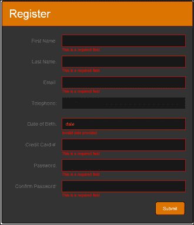

# 五、表单处理

在本章中，我们将介绍如何通过动画、验证和用户反馈创建健壮且有吸引力的 web 表单。我们将包括：

*   实现基本表单验证
*   添加数字验证
*   添加信用卡号验证
*   添加日期验证
*   添加电子邮件地址验证
*   实现实时表单验证
*   添加密码强度指示器
*   增加反垃圾邮件措施
*   实现输入字符限制

# 导言

收集用户数据是许多网站和 web 应用的基本功能，从简单的数据收集技术（如注册或登录信息）到更复杂的场景（如支付或账单信息）。重要的是，仅从用户处收集相关且完整的信息。为了确保这一点，web 开发人员必须对所有数据输入执行验证。在加强数据完整性的同时，提供良好的用户体验也很重要。这可以通过向用户提供有关其数据可能导致的任何验证错误的有用反馈来实现。本章将向您展示如何创建一个有吸引力的 web 表单，在保持高质量用户体验的同时加强数据完整性。

需要注意的一个非常重要的点是，任何 JavaScript 或 jQuery 验证都可以由用户进行操作。JavaScript 和 jQuery 驻留在 web 浏览器中，因此不太了解的用户可以轻松修改代码以绕过任何客户端验证技术。这意味着不能完全依靠客户端验证来防止用户提交无效数据。在客户端内完成的任何验证都必须在服务器上复制，而服务器不开放供用户操作。

我们使用客户端验证来改善用户体验。因此，用户不需要等待服务器响应。

# 实施基本表单验证

在表单验证的最基本级别，您需要能够防止用户提交空值。此配方将提供用于本章配方 1 至 8 的 web 表单的 HTML 和 CSS 代码。

## 准备好了吗

使用您喜爱的文本编辑器或 IDE，在易于访问的位置创建一个空白 HTML 页面，并将此文件另存为`recipe-1.html`。确保已将 jQuery 的最新版本下载到与此 HTML 文件相同的位置。

此 HTML 页面将构成本章大部分内容的基础，因此请记住在完成此食谱后保留此页面。

## 怎么做…

通过执行以下步骤，了解如何使用 jQuery 实现基本表单验证：

1.  将以下 HTML 代码添加到`index.html`。确保更改 jQuery 库中包含的 JavaScript 的源位置，将其指向计算机上下载最新版本 jQuery 的位置。

    ```js
    <!DOCTYPE html>
    <html >
    <head>
       <title>Chapter 5 :: Recipe 1</title>
       <link type="text/css" media="screen" rel="stylesheet" href="styles.css" />
       <script src="jquery.min.js"></script>
       <script src="validation.js"></script>
    </head>
    <body>
       <form id="webForm" method="POST">
          <div class="header">
             <h1>Register</h1>
          </div>
          <div class="input-frame">
             <label for="firstName">First Name:</label>
             <input name="firstName" id="firstName" type="text" class="required" />
          </div>
          <div class="input-frame">
             <label for="lastName">Last Name:</label>
             <input name="lastName" id="lastName" type="text" class="required" />
          </div>
          <div class="input-frame">
             <label for="email">Email:</label>
             <input name="email" id="email" type="text" class="required email" />
          </div>
          <div class="input-frame">
             <label for="number">Telephone:</label>
             <input name="number" id="number" type="text" class="number" />
          </div>
          <div class="input-frame">
             <label for="dob">Date of Birth:</label>
             <input name="dob" id="dob" type="text" class="required date" placeholder="DD/MM/YYYY"/>
          </div>
          <div class="input-frame">
             <label for="creditCard">Credit Card #:</label>
             <input name="creditCard" id="creditCard" type="text" class="required credit-card" />
          </div>
          <div class="input-frame">
             <label for="password">Password:</label>
             <input name="password" id="password" type="password" class="required" />
          </div>
          <div class="input-frame">
             <label for="confirmPassword">Confirm Password:</label>
                <input name="confirmPassword" id="confirmPassword" type="password" class="required" />
          </div>
          <div class="actions">
             <button class="submit-btn">Submit</button>
          </div>
       </form>
    </body>
    </html>
    ```

2.  在同一目录中创建一个名为`styles.css`的 CSS 文件，并添加以下 CSS 代码，以将样式添加到我们的 HTML 页面和表单中：

    ```js
    @import url(http://fonts.googleapis.com/css?family=Ubuntu);
    body {
       background-color: #FFF;
       font-family: 'Ubuntu', sans-serif;
    }
    form {
       width: 500px;
       padding: 20px;
       background-color: #333;
       border-radius: 5px;
       margin: 10px auto auto auto;
       color: #747474;
       border: solid 2px #000;
    }
    form label {
       font-size: 14px;
       line-height: 30px;
       width: 27%;
       display: inline-block;
       text-align: right;
    }
    .input-frame {
       clear: both;
       margin-bottom: 25px;
       position: relative;
    }
    form input {
       height: 30px;
       width: 330px;
       margin-left: 10px;
       background-color: #191919;
       border: solid 1px #404040;
       padding-left: 10px;
       color: #DB7400;
    }
    form input:hover {
       background-color: #262626;
    }
    form input:focus {
       border-color: #DB7400;
    }
    form .header {
       margin: -20px -20px 25px -20px;
       padding: 10px 10px 10px 20px;
       position: relative;
       background-color: #DB7400;
       border-top-left-radius: 4px;
       border-top-right-radius: 4px;
    }
    form .header h1 {
       line-height: 50px;
       margin: 0px;
       padding: 0px;
       color: #FFF;
       font-weight: normal;
    }
    .actions {
       text-align: right;
    }
    .submit-btn {
       background-color: #DB7400;
       border: solid 1px #000;
       border-radius: 5px;
       color: #FFF;
       padding: 10px 20px 10px 20px;
       text-decoration: none;
       cursor: pointer;
    }
    .error input {
       border-color: red;
    }
    .error-data {
       color: red;
       font-size: 11px;
       position: absolute;
       bottom: -15px;
       left: 30%;
    }
    ```

3.  除了 jQuery 库之外，上一个 HTML 页面还使用另一个 JavaScript 文件。在保存`index.html`文件的目录中创建一个空白 JavaScript 文件。将此文件另存为`validation.js`并添加以下 JavaScript 代码：

    ```js
    $(function(){
       $('.submit-btn').click(function(event){
          //Prevent form submission
          event.preventDefault();
          var inputs = $('input');
          var isError = false;
          //Remove old errors
          $('.input-frame').removeClass('error');
          $('.error-data').remove();
          for (var i = 0; i < inputs.length; i++) {
             var input = inputs[i];
             if ($(input).hasClass('required') && !validateRequired($(input).val())) {
                addErrorData($(input), "This is a required field");
                isError = true;
             }

          }
          if (isError === false) {
             //No errors, submit the form
             $('#webForm').submit();
          }
       });
    });

    function validateRequired(value) {
       if (value == "") return false;
       return true;
    }

    function addErrorData(element, error) {
       element.parent().addClass("error");
       element.after("<div class='error-data'>" + error + "</div>");
    }
    ```

4.  Open `index.html` in a web browser and you should see a form similar to the following screenshot:

    

5.  如果您点击按钮**提交**按钮提交空表单，您将在必填字段下看到错误消息。

## 它是如何工作的…

现在，让我们详细了解前面执行的步骤。

### HTML

HTML 创建了一个包含各种字段的 web 表单，这些字段将接受一系列数据输入，包括文本、出生日期和信用卡号。本页构成本章大部分内容的基础。每个输入元素都被赋予了不同的类，这取决于它们需要什么类型的验证。对于这个配方，我们的 JavaScript 将只查看`required`类，它表示一个必填字段，因此不能为空。其他类已添加到输入字段中，如`date`和`number`，将在本章后面的食谱中使用。

### CSS

添加了基本 CSS 以创建有吸引力的 web 表单。CSS 代码为输入字段设置样式，使其与表单本身融合，并添加悬停效果。谷歌网页字体 Ubuntu 也被用来改善表单的外观。

### jQuery

jQuery 代码的第一个部分被包装在`$(function(){});`中，这将确保代码在页面加载时执行。在这个包装器中，我们将一个点击事件处理程序附加到表单提交按钮，如下所示：

```js
$(function(){
    $('.submit-btn').click(function(event){
        //Prevent form submission
        event.preventDefault();

    });
});
```

由于我们希望根据是否提供了有效数据来处理表单提交，因此我们使用`event.preventDefault();`首先停止表单提交，允许我们先进行验证，如下所示：

```js
var inputs = $('input');
var isError = false;
```

在`preventDefault`代码之后，声明一个`inputs`变量来保存页面中的所有输入元素，使用`$('input')`来选择它们。此外，我们还创建了一个`isError`变量，将其设置为`false`。这将是一个标志，用于确定验证代码是否在表单中发现错误。这些变量声明如前所示。使用`inputs`变量的长度，我们可以循环页面上的所有输入。我们为迭代的每个输入创建一个输入变量，可以使用 jQuery 对当前输入元素执行操作。这是通过以下代码完成的：

```js
for (var i = 0; i < inputs.length; i++) {
var input = inputs[i];
}
```

声明输入变量并为其分配当前输入后，将使用以下代码从元素中删除以前的任何错误类或数据：

```js
$(input).parent().removeClass('error');
$(input).next('.error-data').remove();
```

第一行从输入的父元素（`.input-frame`中删除`error`类，将红色边框添加到输入元素中。如果验证检查确定此输入包含无效数据，则第二行将删除输入下显示的错误信息。

接下来，jQuery 的`hasClass()`函数用于确定当前输入元素是否具有`required`类。如果当前元素确实具有此类，则需要执行所需的验证以确保此字段包含数据。我们在`if`语句中调用`validateRequired()`函数并传递当前输入的值，如下所示：

```js
if ($(input).hasClass('required') && !validateRequired($(input).val())) {
addErrorData($(input), "This is a required field");
   isError = true;
}
```

我们调用前面有感叹号的`validateRequired()`函数，检查该函数的结果是否等于`false`；因此，如果当前输入具有`required`类且`validateRequired()`返回`false`，则当前输入的值无效。如果是这种情况，我们使用当前输入和错误消息调用`if`语句中的`addErrorData()`函数，该函数将显示在输入下。我们还将`isError`变量设置为`true`，以便稍后在代码中，我们将知道发生了验证错误。

JavaScript 的`for`循环将对页面上的每个选定输入元素重复这些步骤。`for`循环完成后，我们检查`isError`标志是否仍然设置为`false`。如果是，我们使用 jQuery 手动提交表单，如下所示：

```js
if (isError === false) {
   //No errors, submit the form
   $('#webForm').submit();
}
```

请注意，运算符`===`用于比较`isError`（即`Boolean`的变量类型）及其值。在 JavaScript 文件的底部，我们声明了在脚本前面调用的两个函数。第一个函数`validateRequired()`只需获取输入值并检查其是否为空。如果为空，则函数返回`false`，表示验证失败；否则，函数返回`true`。可按如下方式对其进行编码：

```js
function validateRequired(value) {
    if (value == "") return false;
    return true;
}
```

使用的第二个功能是`addErrorData()`功能，它接受当前输入和错误消息。它使用 jQuery 的`addClass()`函数将错误类添加到输入的父元素中，将使用 CSS 在输入元素上显示红色边框。然后使用 jQuery 的`after()`函数将除法元素插入 DOM，在当前输入字段下显示指定的错误消息，如下图：

```js
function validateRequired(value) {
   if (value == "") return false;
   return true;
}
function addErrorData(element, error) {
   element.parent().addClass("error");
   element.after("<div class='error-data'>" + error + "</div>");
}
```

## 还有更多。。。

此结构允许我们轻松地向 web 表单添加附加验证。因为 JavaScript 正在迭代表单中的所有输入字段，所以我们可以轻松地检查其他类，例如`date`、`number`和`credit-card`，并调用额外的函数来提供替代验证。本章中的其他配方将详细介绍其他验证类型，并将这些函数添加到当前的`validation.js`文件中。

## 另见

*   *实现输入字符限制*

# 增加编号验证

当从用户收集数据时，有许多情况下您只希望在表单字段中允许数字。例如电话号码、PIN 码或邮政编码等。此配方将向您展示如何验证我们在上一配方中创建的表单中的电话号码字段。

## 准备好了吗

确保您已完成上一个配方，并且具有相同的可用文件。在您选择的文本编辑器或 IDE 中打开`validation.js`。

## 怎么做…

通过执行以下步骤，将编号验证添加到您在上一配方中创建的表单中：

1.  将`validation.js`更新如下，在`for`循环中增加`valdiateNumber()`功能并增加`hasClass('number')`检查：

    ```js
    $(function(){
       $('.submit-btn').click(function(event){
          //Prevent form submission
          event.preventDefault();
          var inputs = $('input');
          var isError = false;
          //Remove old errors
          $('.input-frame').removeClass('error');
          $('.error-data').remove();
          for (var i = 0; i < inputs.length; i++) {
             var input = inputs[i];

             if ($(input).hasClass('required') && !validateRequired($(input).val())) {
                   addErrorData($(input), "This is a required field");
                   isError = true;
                }
    /* Code for this recipe */
             if ($(input).hasClass('number') && !validateNumber($(input).val())) {
                   addErrorData($(input), "This field can only contain numbers");
                   isError = true;
                }
    /* --- */

          }
          if (isError === false) {
             //No errors, submit the form
             $('#webForm').submit();
          }
       });
    });

    function validateRequired(value) {
       if (value == "") return false;
       return true;
    }

    /* Code for this recipe */
    function validateNumber(value) {
       if (value != "") {
          return !isNaN(parseInt(value, 10)) && isFinite(value);
          //isFinite, in case letter is on the end
       }
       return true;
    }
    /* --- */
    function addErrorData(element, error) {
       element.parent().addClass("error");
       element.after("<div class='error-data'>" + error + "</div>");
    } 
    ```

2.  Open `index.html` in a web browser, input something other than a valid integer into the telephone number field, and click on the **Submit** button. You will be presented with a form similar to the following screenshot:

    

## 它是如何工作的…

首先，我们在`validation.js`的`for`主循环中增加一条附加`if`语句，检查当前输入字段是否有`number`类，如下所示：

```js
if ($(input).hasClass('number') && !validateNumber($(input).val())) {
   addErrorData($(input), "This field can only contain numbers");
   isError = true;
}
```

如果是，则需要验证该输入值的数字。为此，我们在`if`语句中调用`validateNumber`函数内联：

```js
function validateNumber(value) {
   if (value != "") {
      return !isNaN(parseInt(value, 10)) && isFinite(value);
      //isFinite, in case letter is on the end
   }
   return true;
}
```

此函数将当前输入字段的值作为参数。它首先检查该值是否为空。如果是，我们不需要在这里执行任何验证，因为这是由本章第一个配方中的`validateRequired()`函数处理的。

如果有一个值要验证，则对`return`语句执行一系列操作。首先，该值被解析为一个整数，并传递给`isNaN()`函数。JavaScript`isNaN()`函数只是检查提供的值是否为**NaN**（**不是数字**。在 JavaScript 中，如果您试图将一个值解析为整数，而该值实际上不是整数，那么您将得到`NaN`值。`return`语句的第一部分是确保提供的值是有效的整数。但是，这并不阻止用户输入无效字符。如果用户要输入`12345ABCD`，则`parseInt`功能会忽略`ABCD`而只是解析`12345`，因此验证会通过。为了避免这种情况，我们还使用了`isFinite`函数，如果提供了`12345ABCD`，则返回`false`。

## 另见

*   *新增信用卡号验证*

# 增加信用卡号验证

号码验证对信用卡号的验证就足够了；但是，使用正则表达式，可以检查数字组合以匹配来自 Visa、MasterCard、American Express 等的信用卡号码。

## 准备好了吗

确保本章前两个食谱中的`validation.js`已打开并准备好修改。

## 怎么做…

通过执行以下分步说明，使用 jQuery 为信用卡号提供表单输入验证：

1.  更新`validation.js`以在输入字段

    ```js
    $(function(){
       $('.submit-btn').click(function(event){
          //Prevent form submission
          event.preventDefault();
          var inputs = $('input');
          var isError = false;
          for (var i = 0; i < inputs.length; i++) {

    // -- JavaScript from previous two recipes hidden            

             if ($(input).hasClass('credit-card') && !validateCreditCard($(input).val())) {
                addErrorData($(input), "Invalid credit card number");
                isError = true;
             }

          }
    // -- JavaScript from previous two recipes hidden
       });
    });

    // -- JavaScript from previous two recipes hidden

    function validateCreditCard(value) {
       if (value != "") {
          return /^(?:4[0-9]{12}(?:[0-9]{3})?|5[1-5][0-9]{14}|6(?:011|5[0-9][0-9])[0-9]{12}|3[47][0-9]{13}|3(?:0[0-5]|[68][0-9])[0-9]{11}|(?:2131|1800|35\d{3})\d{11})$/.test(value);
       }
       return true;
    }
    // -- JavaScript from previous two recipes hidden
    } 
    ```

    上添加信用卡验证功能和额外的类别检查
2.  Open `index.html` and input an invalid credit card number. You will be presented with the following error information in the form:

    

## 它是如何工作的…

为了添加信用卡验证，与前两个配方一样，我们在主`for`循环中添加了一个额外的检查，以查找输入元素上的`credit-card`类，如下所示：

```js
if ($(input).hasClass('credit-card') && !validateCreditCard($(input).val())) {
   addErrorData($(input), "Invalid credit card number");
   isError = true;
}
```

还增加了`validateCreditCard`函数，该函数使用正则表达式验证输入值，如下所示：

```js
function validateCreditCard(value) {
   if (value != "") {
      return /^(?:4[0-9]{12}(?:[0-9]{3})?|5[1-5][0-9]{14}|6(?:011|5[0-9][0-9])[0-9]{12}|3[47][0-9]{13}|3(?:0[0-5]|[68][0-9])[0-9]{11}|(?:2131|1800|35\d{3})\d{11})$/.test(value);
   }
   return true;
}
```

此函数的第一部分确定提供的值是否为空。如果不是，函数将执行进一步的验证；否则返回`true`。大多数信用卡号都以前缀开头，这允许我们在数字验证的基础上对输入值添加额外的验证。此函数中使用的正则表达式将允许使用 Visa 卡、万事达卡、美国运通卡、Diners Club 卡、Discover 卡和 JCB 卡。

## 另见

*   *增加编号验证*

# 添加日期验证

日期是常见的数据项，用户能够轻松地在 web 表单中输入日期非常重要。通常，您会使用包含日期验证的日期选择器来提供简单的输入方法。此配方向您展示了如何手动验证英国格式（即`DD/MM/YYYY`格式）的日期。使用流行的 jQuery UI 框架，[第 9 章](09.html "Chapter 9. jQuery UI")、*jQuery UI、*中介绍了日期选择器。有关更多信息，请参阅本配方的*部分。*

## 准备好了吗

继续本章前面配方的趋势，确保您已经`validation.js`打开并准备好修改，并且您已经完成前面三个配方。

## 怎么做…

通过执行以下简单步骤，将日期验证添加到 web 表单中：

1.  更新`validation.js`在`for`主循环中增加额外的日期验证功能和类检查，如下图：

    ```js
    $(function(){
       $('.submit-btn').click(function(event){

    // -- JavaScript from previous three recipes hidden

          for (var i = 0; i < inputs.length; i++) {

    // -- JavaScript from previous three recipes hidden

             if ($(input).hasClass('date') && !validateDate($(input).val())) {
                addErrorData($(input), "Invalid date provided");
                isError = true;
             }

             // -- JavaScript from previous three recipes hidden

          }
          // -- JavaScript from previous three recipes hidden    });
    });

    // -- JavaScript from previous three recipes hidden

    function validateDate(value) {
       if (value != "") {
          if (/^\d{2}([.\/-])\d{2}\1\d{4}$/.test(value)) {
             // Remove leading zeros
             value = value.replace(/0*(\d*)/gi,"$1");
             var dateValues = value.split(/[\.|\/|-]/);
             // Correct the month value as month index starts at 0 now 1 (e.g. 0 = Jan, 1 = Feb)
             dateValues[1]--;
             var date = new Date(dateValues[2], dateValues[1], dateValues[0]);
             if (
                date.getDate() == dateValues[0] && date.getMonth() == dateValues[1] &&
                date.getFullYear() == dateValues[2]
                ) {
                return true;
             }
          }
          return false;
       } else {
          return true;
       }
    }
    // -- JavaScript from previous three recipes hidden
    ```

2.  Open `index.html` in a web browser, input an invalid date, and click on **Submit** to generate the invalid date error, shown in the following screenshot:

    

## 它是如何工作的…

再次，我们向主`for`循环添加了一个额外的类检查，以查看当前输入是否需要应用日期验证。如果是，则调用`validateDate()`函数。

与其他验证函数一样，我们首先检查值是否为空。如果不为空，则可以验证该值。正则表达式用于确定提供的字符串值是否为有效的日期格式，如下所示：

```js
if (/^\d{2}([.\/-])\d{2}\1\d{4}$/.test(value)) {
```

如果提供的值用斜杠、连字符或句号分隔，且前两部分由两个数字组成，最后一部分由四个数字组成，则此测试将通过。此将根据需要确保提供的值为`DD/MM/YYYY`。

如果该测试通过，下一步是删除所有前导零，以便使用 JavaScript 将提供的日期字符串转换为日期对象（例如，`08-08-1989`将变为`8-8-1989`。其代码如下所示：

```js
value = value.replace(/0*(\d*)/gi,"$1");
```

在此之后，按如下方式创建一个数组，将日期字符串拆分为`-`、`/`或：

```js
var dateValues = value.split(/[\.|\/|-]/);
```

现在，可以使用这些日期值创建 JavaScript 日期对象并测试其有效性。在此之前，我们必须转换月份值。JavaScript 月份从`0`开始，而我们的用户将从`1`开始。例如，用户将使用`1`表示一月，`2`表示二月，等等，而 JavaScript 使用`0`表示一月，`1`表示二月，等等。为此，我们只需从提供的日期值中减去`1`，如下所示：

```js
dateValues[1]--;
```

完成此操作后，可以创建 JavaScript 日期对象并检查结果是否与输入日期匹配，以证明其有效性：

```js
var date = new Date(dateValues[2], dateValues[1], dateValues[0]);
if (
   date.getDate() == dateValues[0] &&
   date.getMonth() == dateValues[1] &&
   date.getFullYear() == dateValues[2]
) {
   return true;
}
```

## 另见

*   *添加日期选取器接口快速进入[第 9 章](09.html "Chapter 9. jQuery UI")*jQuery 界面*中的*配方输入框

# 添加电子邮件地址验证

电子邮件地址验证是 Web 上最常见的验证类型之一。大多数人会认为，一个有效的电子邮件地址只包含字母数字字符，除了`@`符号和句号之外的字符。虽然大多数电子邮件地址通常采用这种格式，但有效的电子邮件地址实际上可以包含多种其他字符。此配方将向您展示如何将电子邮件验证添加到我们在过去四个配方中使用的 web 表单中。

## 怎么做…

通过执行以下说明，创建可反复使用的电子邮件验证：

1.  在`validation.js`的`for`主循环中增加`hasClass`检查和`if`语句如下：

    ```js
    if ($(input).hasClass('email') && !validateEmail($($(input)).val())) {
       addErrorData($(input), "Invalid email address provided");
       isError = true;
    }
    ```

2.  在`validation.js`末尾增加以下`validateEmail()`功能：

    ```js
    function validateEmail(value) {
       if (value != "") {
          return /[a-z0-9!#$%&'*+/=?^_`{|}~-]+(?:\.[a-z0-9!#$%&'*+/=?^_`{|}~-]+)*@(?:[a-z0-9](?:[a-z0-9-]*[a-z0-9])?\.)+[a-z0-9](?:[a-z0-9-]*[a-z0-9])?/i.test(value);
       }
       return true;
    }
    ```

3.  在 web 浏览器中打开`index.html`，输入无效的电子邮件地址，然后提交表单。将以与其他类型的验证错误相同的方式向您显示适当的错误。

## 它是如何工作的…

电子邮件验证功能尽管简单，但包含一个复杂的正则表达式，用于验证电子邮件地址是否符合 RFC 5322 标准的实际版本，该标准由[提供 http://www.regular-expressions.info/email.html](http://www.regular-expressions.info/email.html) 。

`validateEmail()`函数的第一部分检查是否有要验证的值。如果是，则使用复杂正则表达式测试字符串值的有效性，并相应地返回`true`或`false`。

最后，与其他验证函数一样，主`for`循环中有类检查，它确定哪些输入需要验证电子邮件地址。如果这些输入字段未通过验证，它将在屏幕上提供相应的错误输出。

## 还有更多…

必须了解，这种电子邮件验证方法只验证语法，以减少用户提供的垃圾数据量。要真正验证电子邮件地址，您必须实际发送一封电子邮件，以验证它是否存在并准备好接收电子邮件。

# 实现实时表单验证

当用户在 web 表单中键入验证错误时，获取有关验证错误的实时反馈非常有用。如果您使用 JavaScript 执行客户端验证以及服务器端验证，那么这很容易实现，因为您不需要每次用户键入输入时都向服务器发送请求，您可以在客户端内完成所有操作。同样，在服务器端对相同的数据进行额外的验证是非常重要的。用户提交表单后，服务器端验证可以反馈到 web 表单。

## 准备好了吗

此配方将调整作为最后五个配方的一部分创建的客户端验证。确保您事先已完成这些食谱。

## 怎么做…

通过执行以下步骤向用户提供实时验证：

1.  首先，我们需要将所有类检查从`for`循环移动到它们自己的函数中，以便它们可以重用。将对`required`、`email`、`number`、`date`和`credit-card`执行`hasClass`检查的所有`if`语句移动到名为`doValidation()`的函数中，如下所示：

    ```js
    // --- Hidden JavaScript from previous recipes

    function doValidation(input) {
       //Remove old errors
       $(input).parent().removeClass('error');
       $(input).next('.error-data').remove();
       if ($(input).hasClass('required') && !validateRequired($(input).val())) {
          addErrorData($(input), "This is a required field");
       }
       if ($(input).hasClass('email') && !validateEmail($($(input)).val())) {
          addErrorData($(input), "Invalid email address provided");
       }
       if ($(input).hasClass('number') && !validateNumber($(input).val())) {
          addErrorData($(input), "This field can only contain numbers");
       }
       if ($(input).hasClass('date') && !validateDate($(input).val())) {
          addErrorData($(input), "Invalid date provided");
       }
       if ($(input).hasClass('credit-card') && !validateCreditCard($(input).val())) {
          addErrorData($(input), "Invalid credit card number");
       }
    }

    // --- Hidden JavaScript
    ```

2.  现在，我们需要更新主`for`循环以使用此功能，这样当用户点击提交按钮时，表单验证仍然是，如下所示：

    ```js
    for (var i = 0; i < inputs.length; i++) {
       var input = inputs[i];
       doValidation(input);
    }
    ```

3.  更新`for`循环后的`isError`检查，使用另一种方法确定是否有错误，以便表单仍然可以提交，如下所示：

    ```js
    if ($('.error-data').length == 0) {
       //No errors, submit the form
       $('#webForm').submit();
    }
    ```

4.  要对用户输入的字段执行验证，我们需要对`keyup`事件调用`doValidation()`函数。在`$(function(){});`块中添加以下代码，将`keyup`事件处理程序附加到每个表单输入：

    ```js
    $('input').on("keyup", function(){
       doValidation($(this));
    });
    ```

5.  在 web 浏览器中打开`index.html`，开始在“电子邮件”字段中键入，您键入时将收到相应的错误消息，直到您输入了有效的电子邮件地址。

## 它是如何工作的…

很容易修改以前的验证代码，为用户提供实时验证。将主验证触发器移动到另一个函数意味着代码可以重用，而无需重复。保存这些触发器的函数接受一个参数，该参数是它执行验证检查所需的输入。`for`回路仍用于提供此输入，如下所示：

```js
for (var i = 0; i < inputs.length; i++) {
   var input = inputs[i];
   doValidation(input);
}
```

我们不依赖`doValidation`函数来返回`isError`值，而是直接通过查找`error-data`类中的任何元素来查看 DOM 屏幕上是否显示了任何错误，如下所示：

```js
if ($('.error-data').length == 0) {
   //No errors, submit the form
   $('#webForm').submit();
}
```

如果没有错误，将像以前一样手动提交表单。

为了提供实时验证，使用以下 jQuery 代码将`keyup`事件处理程序附加到每个表单输入：

```js
$('input').on("keyup", function(){
   doValidation($(this));
});
```

每次用户按下并释放其中一个输入字段内的键时，将执行`on()`方法的回调函数。然后可以使用`$(this)`，它是指触发事件的输入，从而为`doValidation()`函数提供执行验证检查所需的输入对象。

# 增加密码强度指标

用户喜欢创建一个简单易记的密码，比如 cat、john 甚至 password。然而，大多数人，尤其是 web 开发人员，都知道这些类型的密码太不安全了，而且很容易使用字典攻击等技术从加密数据库中解密。密码强度指示器有助于推动用户正确使用更复杂的密码。

## 准备好了吗

为了能够验证密码强度，我们需要创建一些代码将使用的规则。关于这一点没有硬性规定，但网上可以找到大量关于什么类型的密码最好的信息。我们将给密码打 5 分，以下规则各得 1 分：

*   长度大于六个字符
*   它大于八个字符
*   它有大小写字符
*   它至少有一个数字
*   它有以下符号之一：`@`、`$`、`!`、`&`和`^`

此配方将向我们在过去六个配方中创建的 web 表单添加密码强度指示器。在开始此配方之前，请确保这些配方中的代码可用。

## 怎么做…

通过执行以下每个步骤，为 web 表单创建有效的密码强度指示器：

1.  更新`index.html`，在密码表单元素中添加一些额外的类，以及一些额外的 HTML，这将创建密码强度指示器，如下所示：

    ```js
    // --- ADDITIONAL HTML HIDDEN
    <div class="input-frame">
    <label for="password">Password:</label>
    <input name="password" id="password" type="password" class="required password" />
    <div class="password-strength">
       <div class="inner"></div>
       <div class="text"></div>
    </div>
    </div>
    <div class="input-frame">
    <label for="confirmPassword">Confirm Password:</label>
    <input name="confirmPassword" id="confirmPassword" type="password" class="confirm-password" />
    </div>
    // --- ADDITIONAL HTML HIDDEN
    ```

2.  在`styles.css`的末尾添加以下样式，将强度指示器定位在密码字段下。这些样式还允许强度指示器作为负载条，显示密码强度的百分比。

    ```js
    .password-strength {
       position: absolute;
       width: 150px;
       height: 20px;
       left: 69%;
       top: 35px;
       line-height: 20px;
       border: solid 1px #191919;
    }
    .password-strength .inner {
       position: absolute;
       left: 0;
       top: 0;
    }
    .password-strength .text {
       font-size: 11px;
       color: #FFF;
       text-align: center;
       position: relative;
       z-index: 10;
    }
    ```

3.  将`validatePasswords()`功能添加到`validation.js`的末尾，用于确保输入两个密码并且密码匹配，如下所示：

    ```js
    // --- HIDDEN JAVASCRIPT
    function validatePasswords(value) {
       var password = $('.password').val();
       if (value == "") {
          return "Both passwords are required";
       } else if (value != password) {
          return "Passwords do not match";
       }
       return true;
    }
    ```

4.  在`doValidation()`功能的末尾添加以下代码，在`confirm-password`输入端运行`validatePasswords()`功能：

    ```js
    function doValidation(input) {
    // --- HIDDEN JAVASCRIPT
    if ($(input).hasClass('confirm-password')) {
       var result = validatePasswords($(input).val());
          if (result != true) {
             addErrorData($(input), result);
          }
       }
    }
    ```

5.  在`validation.js`中的`$(function(){});`块中添加下面的`keyup`事件处理程序，对用户在第一个密码字段中输入时的密码强度进行评分：

    ```js
    $('.password').on("keyup", function(){
       var score = 0;
       var password = $('.password');
       var passwordAgain = $('.confirm-password');
       //Remove any old errors for the password fields
       password.parent().removeClass('error');
       password.next('.error-data').remove();
       passwordAgain.parent().removeClass('error');
       passwordAgain.next('.error-data').remove();
       //Password is greater than 6 characters
       if (password.val().length > 6) {
          score++;
       }
       //Password is greater than 8 characters
       if (password.val().length > 8) {
          score++;
       }
       //Password has both uppercase and lowercase characters
       if (/(?=.*[A-Z])(?=.*[a-z])/.test(password.val())) {
          score++;
       }
       //Password has at least one number
       if (/(?=.*[0-9])/.test(password.val())) {
          score++;
       }
       //Password has at least one symbol (@$!&^) character
       if (/@|\$|\!|&|\^/.test(password.val())) {
          score++;
       }
       var fill = (100 - ((score * 2) * 10));
       var percent = (100 - fill);
       var level,
       colour;
       switch (score) {
       case 0:
       case 1:
       level = "Weak";
       colour = "green";
       break;
       case 2:
       case 3:
       level = "Medium";
       colour = "orange";
       break;
       case 4:
       level = "Strong";
       colour = "red";
       break;
       case 5:
       level = "Excellent";
       colour = "purple";
       break;
       }
       $('.password-strength .inner').css('right', fill + "%").css('background-color', colour);
       $('.password-strength .text').html(level + " (" + percent + "%)");
       });
    ```

6.  Open `index.html` in a web browser and you will see an additional black box under the first password field. Start typing in a password and this field will provide information on the password strength as you type. This is illustrated in the following screenshot:

    

## 它是如何工作的…

指示器本身的 HTML 有一个`inner`元素和一个`text`元素。jQuery 使用`text`元素根据输入密码的计算分数显示密码强度和百分比。`inner`元素用于形成彩色条。根据计算出的分数，jQuery 用于更改内部元素的颜色和位置，创建加载条印象，如前一个屏幕截图所示。

使用的 CSS 几乎不需要解释，因为它提供了基本的样式和定位。`inner`元素具有绝对位置，因此它可以以不同的百分比填充`password-strength`元素。`text`部分设置了`z-index`参数，以确保文本始终显示在`inner`元素上方。

`validatePasswords`函数是作为此配方的一部分创建的，它只是将基本密码验证添加到我们的应用中。它检查以确保`confirm-password`字段已填充，并且该值与第一个`password`字段匹配。`doValdiation`功能中添加了一个附加检查，以确保该验证与早期配方中创建的其他验证方法一起应用。

要在用户在密码字段中键入密码时更新密码强度指示器，使用与*实现实时表单验证*配方中使用的方法相同的方法，即使用`keyup`事件。使用 jQuery`on()`函数将事件处理程序附加到`password`字段，如下所示：

```js
$('.password').on("keyup", function(){
});
```

然后，用于计算分数和更新`password-strength`HTML 元素的代码被放置在此事件处理程序的回调函数中。此代码的第一部分是删除密码字段中显示的所有当前错误。

在此之后，有一系列的`if`语句根据本配方开头定义的规则验证密码。第一个基本验证是密码长度，如下所示：

```js
//Password is greater than 6 characters
if (password.val().length > 6) {
   score++;
}
//Password is greater than 8 characters
if (password.val().length > 8) {
   score++;
}
```

每次满足验证条件时，使用`score++`将分数变量增加`1`。

更复杂的规则使用正则表达式来确定密码值是否满足对额外分数的要求，如下所示：

```js
//Password has both uppercase and lowercase characters
if (/(?=.*[A-Z])(?=.*[a-z])/.test(password.val())) {
   score++;
}
//Password has at least one number
if (/(?=.*[0-9])/.test(password.val())) {
   score++;
}
//Password has at least one symbol (@$!&^) character
if (/@|\$|\!|&|\^/.test(password.val())) {
   score++;
}
```

在考虑了所有五条规则后，最终分数用于计算填充值。填充值是需要从强度指示器右侧填充的`inner`元素的百分比。这允许我们创建加载条效果。除填充值外，还将计算正常百分比，以便与强度级别文本一起显示，如下所示：

```js
var fill = (100 - ((score * 2) * 10));
var percent = (100 - fill);
```

之后，再次使用分数值确定`inner`元素的背景色和强度级别文本，如下所示：

```js
var level,
colour;
switch (score) {
case 0:
case 1:
   level = "Weak";
   colour = "green";
break;
case 2:
case 3:
   level = "Medium";
   colour = "orange";
   break;
case 4:
   level = "Strong";
   colour = "red";
break;
case 5:
   level = "Excellent";
   colour = "purple";
break;
}
```

最后，使用 jQuery`password-strength`将 HTML 代码更新为获取的信息，以向用户显示结果，如下所示：

```js
$('.password-strength .inner').css('right', fill + "%").css('background-color', colour);
$('.password-strength .text').html(level + " (" + percent + "%)");
```

## 还有更多…

此代码应易于修改，以便您可以添加自己的密码强度规则。在线上有很多讨论和资源可以告诉您强密码应该是什么样子。

## 另见

*   *实施实时表单验证*

# 增加反垃圾邮件措施

大多数 web 开发人员都知道，如果您的网站上有一个联系人表单或任何一种公开的 web 表单，就会有 web bot 提交和大量垃圾邮件。大多数网络机器人都会被我们在过去七个配方中创建的纯 JavaScript 网络表单所阻碍，但随着浏览器自动化和网络机器人变得越来越聪明，在网络表单中添加反垃圾邮件措施仍然很重要。

## 准备好了吗

确保您已经完成了最后七个食谱，并且代码随时可用。请记住，如果您只是想在不完全理解代码工作原理的情况下使用代码，请跳到本章末尾，跳到*代码工作原理。。。*部分，抓住它。

## 怎么做…

通过执行以下每个步骤，将简单的反垃圾邮件措施添加到您的 web 表单中：

1.  更新`index.html`以在标记为`Confirm Password`的输入下添加一个表单输入，如下所示：

    ```js
    <!-- HIDDEN HTML CODE -->
    <div class="input-frame">
       <label>Confirm Password:</label>
       <input type="password" class="confirm-password" />
    </div>
    <div class="input-frame">
       <label>Enter the number <span class="anti-spam-number"></span>:</label>
       <input type="text" class="required anti-spam-input" />
    </div>
    <!-- HIDDEN HTML CODE -->
    ```

2.  使用 JavaScript，使用以下代码在`validation.js`顶部生成一个介于`1`和`100`之间的随机数：

    ```js
    var spamNumber = Math.floor(Math.random() * (100 - 1 + 1)) + 1;
    $(function(){
    // --- HIDDEN JAVASCRIPT CODE
    ```

3.  在`$(function(){});`jQuery 块的最后，添加以下代码，用随机数更新 HTML`anti-spam-number`span 元素：

    ```js
    // --- HIDDEN JAVASCRIPT CODE
    $('.anti-spam-number').html(spamNumber);
    });
    ```

4.  在 `doValidation()`功能的末尾添加以下附加验证检查：

    ```js
    if ($(input).hasClass('anti-spam-input') && !validateAntiSpam($(input).val())) {
       addErrorData($(input), "Incorrect Anti-Spam answer");
    }
    ```

5.  最后，在`validation.js`的末尾添加`validateAntiSpam()`函数，该函数由前面的代码

    ```js
    // --- HIDDEN JAVASCRIPT CODE
    function validateAntiSpam(value) {
       if (value != "") {
          if (parseInt(value)!= spamNumber) return false;
       }
       return true;
    }
    ```

    调用
6.  在 web 浏览器中打开`index.html`，您将看到附加的反垃圾邮件表单输入字段。每次刷新页面时，它都会要求您输入不同的数字。

## 它是如何工作的…

通过在任何函数之外声明`spamNumber`全局变量，整个 JavaScript 文件都可以使用它。每次页面加载时都会生成一个介于`1`和`100`之间的新数字，因此 web 机器人无法存储答案并提交表单。在 HTML 代码中，有一个类为`anti-spam-number`的`span`元素，该元素在页面加载时使用以下代码以随机数进行更新：

```js
$('.anti-spam-number').html(spamNumber);
```

这将确保用户被告知输入正确的号码。我们创建了一个名为`validateAntiSpam`的附加验证函数，并从`doValidation()`函数中为所有具有`anti-spam-input`类的输入调用它。这将使用全局可用的`spamNumber`变量验证用户输入的编号，如下所示：

```js
function validateAntiSpam(value) {
   if (value != "") {
      if (parseInt(value)!= spamNumber) return false;
   }
   return true;
}
```

请注意，输入被解析为整数，以确保数字对数字的比较。如果值不匹配，此函数将返回`false`，以便`doValidation()`函数可以在屏幕上为用户创建相应的错误消息。

## 还有更多…

这种类型的客户端垃圾邮件验证不能完全依赖。它对不直接针对您的网站的一般网络机器人非常有效。如果有人想要编写特定于您的站点的 bot 脚本，那么绕过此 JavaScript 将不是一个困难的过程。如果您认为这是可能的，那么必须使用更极端的服务器端垃圾邮件预防。

互联网上有许多有效的垃圾邮件预防方法可以免费使用。最流行的是 CAPTCHA。最受欢迎的验证码之一可由谷歌在[免费获取 http://www.google.com/recaptcha](http://www.google.com/recaptcha) 。

## 另见

*   *增加密码强度指标*

# 实现输入字符限制

到目前为止，本章中的所有方法都集中于输入验证和向用户提供适当的反馈。在某些情况下，最好首先防止用户输入无效字符。这种方法通常不会被使用，因为它会让一些用户感到困惑；例如，如果没有人告诉他们为什么不能输入*%*。这样做的一种情况是登录表单。如果您知道您的注册系统不允许在用户名中输入*%*，则您知道用户将错误地输入*%*，因此阻止输入是可以接受的。此配方提供了一种方法来防止用户将非字母数字字符输入到输入字段中。

## 准备好了吗

此配方不使用最后八个配方中的任何代码；然而，CSS 代码中有相似之处。要完成此配方，您需要三个文件。在存储最新版本 jQuery 的同一目录中创建`recipe-9.html`、`recipe-9.js`和`recipe-9.css`。

## 怎么做…

通过执行以下步骤，使用 jQuery 防止用户将无效章节输入到文本输入中：

1.  将以下 HTML 代码添加到`recipe-9.html`。这将创建一个基本的登录表单，并包括另外两个文件以及 jQuery 库：

    ```js
    <!DOCTYPE html>
    <html >
    <head>
       <title>Chapter 5 :: Recipe 7</title>
       <link type="text/css" media="screen" rel="stylesheet" href="recipe-9.css" />
       <script src="jquery.min.js"></script>
       <script src="recipe-9.js"></script>
    </head>
    <body>
    <form id="webForm" method="POST">
       <div class="header">
          <h1>Register</h1>
       </div>
       <div class="input-frame">
          <label for="username">Username:</label>
          <input name="username" id="username" type="text" class="username" />
       </div>
       <div class="input-frame">
          <label for="password">Password:</label>
          <input name="password" id="password" type="text" class="required" />
       </div>
       <div class="actions">
          <button class="submit-btn">Submit</button>
       </div>
    </form>
    </body>
    </html>
    ```

2.  在`recipe-9.css`中添加以下 CSS 代码，为登录表单添加样式：

    ```js
    @import url(http://fonts.googleapis.com/css?family=Ubuntu);
    body {
       background-color: #FFF;
       font-family: 'Ubuntu', sans-serif;
    }
    form {
       width: 500px;
       margin: 10px auto auto auto;
       padding: 20px;
       background-color: #333;
       border-radius: 5px;
       color: #747474;
       border: solid 2px #000;
    }
    form label {
       font-size: 14px;
       line-height: 30px;
       padding-bottom: 8px;
       width: 140px;
       display: inline-block;
       text-align: right;
    }
    .input-frame {
       clear: both;
       margin-bottom: 25px;
       position: relative;
    }
    form input {
       height: 30px;
       width: 330px;
       margin-left: 10px;
       background-color: #191919;
       border: solid 1px #404040;
       padding-left: 10px;
       color: #DB7400;
    }
    form input:hover {
       background-color: #262626;
    }
    form input:focus {
       border-color: #DB7400;
    }
    form .header {
       margin: -20px -20px 25px -20px;
       padding: 10px 10px 10px 20px;
       position: relative;
       background-color: #DB7400;
       border-top-left-radius: 4px;
       border-top-right-radius: 4px;
    }
    form .header h1 {
       line-height: 50px;
       margin: 0;
       padding: 0;
       color: #FFF;
       font-weight: normal;
    }
    .actions {
       text-align: right;
    }
    .submit-btn {
       background-color: #DB7400;
       border: solid 1px #000;
       border-radius: 5px;
       color: #FFF;
       padding: 10px 20px 10px 20px;
       text-decoration: none;
       cursor: pointer;
    }
    ```

3.  将以下 JavaScript 代码添加到`recipe-9.js`中，以监视用户在`username`字段上的输入，并确保未输入非字母数字字符：

    ```js
    $(function(){
        $('.username').on("keypress", function(event){
            //Get key press character code
            var key = String.fromCharCode(event.which);
            if (/[^a-zA-Z\d\s:]/.test(key)) {
                event.preventDefault();
                return false;
            }
        });
    });
    ```

4.  在 web 浏览器中打开`recipe-9.html`并尝试在`username`字段中输入非字母数字字符（例如`$`。您将看到它不会被放置在字段内。

## 它是如何工作的…

一个按键事件处理程序附加到页面加载的`username`字段。此事件处理程序的回调函数只有一个参数，即`event`对象。此`event`对象提供对用户正在按下的键的键代码的访问。当`username`字段有焦点且用户按键时，执行回调函数。

首先，`String.fromCharCode(event.which);`用于获取按键的字符串值；例如，`D`、`H`和`4`。然后使用正则表达式确定此字符是否为字母数字。否则，将使用以下代码阻止将字符输入表单字段：

```js
if (/[^a-zA-Z\d\s:]/.test(key)) {
   event.preventDefault();
   return false;
}
```

## 还有更多…

确保此配方中使用的事件为`keypress`事件。如果使用替代事件，如`keydown`，则可能无法达到预期结果。如果使用了`keydown`事件，当用户按*Shift*+*4*输入`$`符号时，`keydown`事件将提供其事件处理程序作为`4`而不是`$`，因此通过验证。