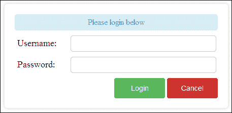
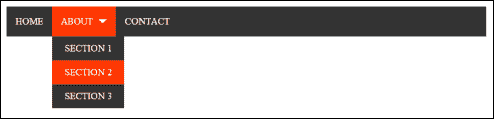

# 七、用户界面动画

在本章中，我们将介绍以下主题：

*   创建动画登录表单
*   添加照片缩放
*   创建动画内容滑块
*   设置背景图像动画
*   创建动画导航菜单

# 导言

使用 jQuery，可以通过有吸引力的动画增强常见的用户界面元素。这些动画可以提供交互动作，以增强任何网站或 web 应用的用户体验。本章介绍如何使用现代动画创建一些流行的用户界面，您可以在新项目或当前网站中使用这些动画。

# 创建动画登录表单

登录表单是许多网站和 web 应用的主要入口，第一印象就是一切。使用 jQuery 动画，我们可以创建一个登录表单，当它被打开、关闭并且出现错误时，该表单会被设置动画，从而创建一个通过动画增强的高质量用户体验。

此配方需要支持 PHP 的 web 服务器。此服务器可以托管在云中或简单的本地开发服务器中。在开始使用此配方之前，请确保已进行此设置。

## 准备好了吗

在与 jQuery 库最新版本相同的目录中创建`recipe-1.html`、`recipe-1.js`和`recipe.css`。在创建登录表单时，我们还需要一个 PHP 脚本，用于发布登录数据。在 web 服务器的 web 根目录中创建一个名为`index.php`的 PHP 文件，并添加以下代码：

```js
$response = new stdClass;
$response->success = false;
$response->error = "Username and password must be provided";
if (isset($_POST['username']) && isset($_POST['password'])) {
   $username = $_POST['username'];
   $password = $_POST['password'];
   if ($username == "MyUsername" && $password == "MyPassword") {
      $response->success = true;
   } else {
      $response->error = "Incorrect login credentials";
   }
}
header("Content-type: application/json; charset=UTF-8");
echo json_encode($response);
```

在实际实现中，PHP 脚本将根据数据库记录验证用户的凭据。为了保持这个方法的简单性并关注 jQuery 代码，我们的 PHP 代码只需对用户提交的用户名和密码进行字符串比较，即`MyUsername`和`MyPassword`。

## 怎么做…

要创建使用前面的 PHP 脚本的动画登录表单，请执行以下分步说明：

1.  在`recipe-1.html`中添加以下 HTML 代码，创建登录表单并打开按钮：

    ```js
    <!DOCTYPE html>
    <html>
    <head>
       <title>Chapter 7 :: Recipe 1</title>
       <link href="recipe-1.css" rel="stylesheet" type="text/css" />
       <script src="jquery.min.js"></script>
       <script src="recipe-1.js"></script>
    </head>
    <body>
       <button class="open-login">Open Login Box</button>
       <div class="login-frame">
          <div class="login-box">
             <div class="login-msg">Please login below</div>
             <div class="form-group">
                <label class="form-label">Username:</label>
                <input type="text" class="form-control" id="username" />
             </div>
             <div class="form-group">
                <label class="form-label">Password:</label>
                <input type="text" class="form-control" id="password" />
             </div>
             <div class="login-actions">
                <button class="btn login-btn">Login</button>
                <button class="btn close-login">Cancel</button>
             </div>
          </div>
       </div>
    </body>
    </html>
    ```

2.  在`recipe-1.css`中添加以下 CSS 代码，为网页添加基本样式：

    ```js
    .login-frame {
       position: absolute;
       top: 0;
       bottom: 0;
       left: 0;
       right: 0;
       display: none;
    }
    .login-box {
       width: 400px;
       height: 165px;
       padding: 20px;
       margin: auto;
       top: -165px;
       box-shadow: 0 0 10px #CCC;
       border-radius: 5px;
       position: relative;
    }
    .form-group {
       margin-bottom: 10px;
    }
    .form-group .form-control {
       margin-left: 55px;
       width: 275px;
       height: 30px;
       padding: 0 5px 0 5px;
       font-size: 16px;
       border-radius: 5px;
       border: solid 1px #CCCCCC;
       color: #999;
    }
    .form-group .form-label {
       width: 50px;
       font-size: 18px;
       display: block;
       float: left;
       line-height: 30px;
       padding-left: 5px;
       color: #333;
    }
    .login-msg {
       border: solid 1px #bce8f1;
       text-align: center;
       line-height: 30px;
       margin-bottom: 10px;
       border-radius: 5px;
       color: rgba(58, 135, 173, 0.90);
       background-color: rgba(217, 237, 247, 0.99);
    }
    .login-msg.success {
       color: rgba(70, 136, 71, 0.96);
       background-color: rgba(223, 240, 216, 0.97);
       border-color: rgba(214, 233, 198, 0.98);
    }
    .login-msg.error {
       color: rgba(185, 74, 72, 0.98);
       background-color: rgba(242, 222, 222, 0.98);
       border-color: rgba(238, 211, 215, 0.98);
    }
    .login-actions {
       text-align: right;
    }
    .btn {
       height: 40px;
       width: 100px;
       display: inline-block;
       padding: 6px 12px;
       margin-bottom: 0;
       font-size: 14px;
       text-align: center;
       white-space: nowrap;
       vertical-align: middle;
       cursor: pointer;
       border: 1px solid transparent;
       border-radius: 4px;
    }

    .login-btn {
       color: #ffffff;
       background-color: #5cb85c;
       border-color: #4cae4c;
    }
    .login-btn:hover {
       background-color: #458a45;
    }
    .close-login {
       color: #ffffff;
       background-color: #d2322d;
       border-color: #ac2925;
    }
    .close-login:hover {
       background-color: #ac2c2c;
    }
    ```

3.  在`recipe-1.js`中添加以下 jQuery 代码，允许用户打开并使用登录表单：

    ```js
    $(function(){
       $(document).on('click', '.open-login', function(){
          $('.login-frame').fadeIn(500);
          $('.login-box').animate({'top' : '50px'}, 500);
       });
       $(document).on('click', '.close-login', function(){
          $('.login-box').animate({'top' : '-165px'}, 500);
          $('.login-frame').fadeOut(500);
       });
       $(document).on('click', '.login-btn', function(){
          var username = $('#username').val();
          var password = $('#password').val();
          $.ajax({
             url: '/index.php',
             type: 'POST',
             data: {
                'username': username,
                'password': password
             },
             success: function(response) {
                var _loginMsg = $('.login-msg');
                if (response.success) {
                   _loginMsg.addClass("success").removeClass("error");
                   _loginMsg.html("Login was successful!");
                } else {
                   _loginMsg.addClass("error").removeClass("success");
                   _loginMsg.html(response.error);
                   $('.login-box')
                   .animate({ left: -25 }, 20)
                   .animate({ left: 0 }, 60)
                   .animate({ left: 25 }, 20)
                   .animate({ left: 0 }, 60);
                }
             }
          });
       });
    });
    ```

4.  Open `recipe-1.html` in a web browser, click on the **Open Login Box** button, and you will be presented with the interface shown in the following screenshot:

    

## 它是如何工作的…

允许用户拥有帐户并登录的网站通常会在主导航中的某个位置提供一个登录按钮。此配方中的 HTML 代码创建了一个非常基本的网页，其中有一个按钮，表示用户可以访问登录表单的位置。HTML 代码还提供了基本的登录表单，默认情况下使用 CSS 隐藏该表单。CSS 代码提供了登录表单的定位以及登录错误和表单按钮的样式。除了最初隐藏登录表单的 CSS 之外，它还将登录表单顶部位置的值设置为负数，从而强制登录表单离开页面。这允许我们创建滑入动画，将登录框带入用户视图。

jQuery 代码的第一部分创建了一个 click 事件处理程序，用于侦听登录按钮上的单击，如下所示：

```js
$(document).on('click', '.open-login', function(){
   $('.login-frame').fadeIn(500);
   $('.login-box').animate({'top' : '50px'}, 500);
});
```

当用户点击带有`open-login`类的按钮时，jQuery 的 `fadeIn()`功能用于在隐藏的登录表单中淡出，`animate()`功能用于将登录表单移动到屏幕上，从而产生幻灯片效果。

创建一个 click 事件处理程序来侦听被单击的`close-login`按钮，然后触发反向动画以淡出登录框并将其移出屏幕，如下所示：

```js
$(document).on('click', '.close-login', function(){
   $('.login-box').animate({'top' : '-165px'}, 500);
   $('.login-frame').fadeOut(500);
});
```

### 注

这两个动画功能的持续时间都设置为 500 毫秒，允许淡入淡出和定位动画同时开始和结束。

此配方的主要功能放在登录按钮的点击事件处理程序的回调函数中；具体情况如下：

```js
$(document).on('click', '.login-btn', function(){
   // -- HIDDEN CODE --
});
```

这个点击事件处理程序监听登录按钮的点击，获取输入数据并将其提交到我们在本配方开头创建的 PHP 脚本。首先，从表单中收集用户名和密码并存储在`username`和`password`变量中，如下所示：

```js
var username = $('#username').val();
var password = $('#password').val();
```

然后使用 jQuery 的内置 AJAX 功能将这些数据发送到 PHP 脚本：

```js
$.ajax({
   url: 'http://localhost:8003/index.php',
   type: 'POST',
   data: {
      'username': username,
      'password': password
   },
   success: function(response) {
   // --- HIDDEN CODE
   }
});
```

前面的代码通过指定 PHP 文件的 URL 并将`type`参数设置为`POST`来创建 AJAX`POST`请求。还提供了一个数据对象，用于保存表单中的信息。

`success`参数指定了回调函数；在 PHP 脚本成功响应时调用此函数，如下所示：

```js
success: function(response) {
   var _loginMsg = $('.login-msg');
   if (response.success) {
      // -- HIDDEN CODE
   } else {                         
      // -- HIDDEN CODE
   }
```

通过创建 PHP 代码，我们知道响应的成功值为`true`或`false`。如果成功值为`false`，则会出现一条错误消息。还有另外一种方式，AJAX 请求可能会失败；这是由服务器错误引起的，例如，`500 file not found`。为了处理这些错误，应该使用 jQuery AJAX`.fail()`函数。请在[上阅读更多相关信息 http://api.jquery.com/jquery.ajax/](http://api.jquery.com/jquery.ajax/) 。

在 success 回调函数中，我们选择`login-msg`元素，它将用于在屏幕上打印任何消息。对 PHP 脚本提供的成功值进行评估，以确定登录是否成功。

如果登录成功，`login-msg`元素将更新为一条消息，通知用户登录成功，并添加`success`类将消息元素变为绿色，如下所示：

```js
_loginMsg.addClass("success").removeClass("error");
_loginMsg.html("Login was successful!");
```

`removeClass()`函数用于确保`error`类不会作为任何先前登录尝试的剩余内容出现。在现实世界中，您可能希望将用户重定向到网站的成员区域。此代码可以被替换以实现此目的；参见*这一配方还有更多的……*部分。

如果登录尝试不成功，`error`类将使用 PHP 脚本中的消息添加到`login-msg`元素中。我们使用`response.error`检索此数据。还使用一系列动画功能将登录框从左向右移动，以创建抖动效果，向用户强调错误；具体情况如下：

```js
_loginMsg.addClass("error").removeClass("success");
_loginMsg.html(response.error);
$('.login-box')
   .animate({ left: -25 }, 20)
   .animate({ left: 0 }, 60)
   .animate({ left: 25 }, 20)
   .animate({ left: 0 }, 60);
}
```

## 还有更多…

如果需要，可以轻松替换 jQuery 回调的 successful login 部分来重定向用户。本机 JavaScript 代码可用于使用以下代码将用户发送到所需页面，将`/memebers.php`替换为适当的 URL，如下所示：

```js
window.location.href = "/members.php";
```

## 另见

*   [第五章](05.html "Chapter 5. Form Handling")、*表单处理*

# 增加照片变焦

照片缩放是一种非常好的效果，可以在许多界面中使用，为照片库或产品页面添加额外的用户交互，以便用户可以清晰地看到较小的图像。此配方将向您展示如何将照片缩放效果添加到列表中的四幅图像。

## 准备好了吗

在这个食谱中，你需要四张图片。确保它们的宽度小于 800 像素，高度小于 600 像素。收集完此配方中使用的四个图像后，在与这些图像和 jQuery 库相同的目录中创建`recipe-2.html`、`recipe-2.css`和`recipe-2.js`。

## 怎么做…

执行以下说明将缩放效果添加到所选图像：

1.  在`recipe-2.html`中添加以下 HTML 代码；确保更新与所选图像相对应的图像引用：

    ```js
    <!DOCTYPE html>
    <html>
    <head>
       <title>Chapter 7 :: Recipe 2</title>
       <link href="recipe-2.css" rel="stylesheet" type="text/css" />
       <script src="jquery.min.js"></script>
       <script src="recipe-2.js"></script>
    </head>
    <body>
       <div class="container">
          <ul class="photos">
             <li></li>
             <li></li>
             <li></li>
             <li></li>
          </ul>
       </div>
    </body>
    </html>
    ```

2.  将下面的 CSS 代码添加到`recipe-2.css`以设置图像的样式和位置：

    ```js
    body {
       background-color: #333;
    }
    .container {
       width: 600px;
       height: 600px;
       margin: 50px auto auto auto;
    }
    .photos {
       list-style: none;
       margin: 0;
       padding: 0;
    }
    .photos li {
       display: inline-block;
       width: 290px;
       height: 250px;
       background-color: #E1E1E1;
       margin: 0 5px 5px 0;
       overflow: hidden;
       position: relative;
          cursor: pointer;
    }
    .photos li img {
       top: -50%;
       left: -50%;
       position: absolute;
       opacity: 0.5;
    }
    ```

3.  将以下 jQuery 代码添加到`recipe-2.js`以在用户悬停在图像上时将照片缩放动画添加到图像：

    ```js
    var images = [];
    $(function(){
       $(document).on("mouseover", ".photos li", function(){
          var _image = $(this).find('img');
          _image.finish();
          images[$(this).index()] = {
             width: _image.width(),
             height: _image.height()
          };
          _image.animate({
             width: '290px',
             height: '250px',
             top: 0,
             left: 0,
             opacity: 1.0
          });
       }).on("mouseout", ".photos li", function(){
          var _image = $(this).find('img');
          _image.finish();
          _image.animate({
             width: images[$(this).index()].width + "px",
             height: images[$(this).index()].height + "px",
             top: '-50%',
             left: '-50%',
             opacity: 0.5
          });
       });
    });
    ```

4.  Open `recipe-2.html` in a web browser, and hover over one of the four images to see the zoom animation, shown as follows:

    

## 它是如何工作的…

此配方中的 HTML 代码非常基本，只需创建一个带有类名`container`的 division 元素，该元素使用 CSS 集中在页面上。在 frame 分区中，有一个无序列表元素，它有四个子元素，每个子元素包含一个图像。

CSS 代码从无序列表中删除任何边距和填充，将其子元素设置为内联显示，并将每个子元素的溢出属性设置为`hidden`。这是为了允许我们最初加载比 list 元素大的图像，而不显示任何溢出，以提供放大效果。

CSS 代码还将图像的顶部和左侧位置设置为`-50%`，以便它们位于列表元素的中心。图像的不透明度也设置为`0.5`，以防止图像最初突出。

在 jQuery 代码的开头，声明了一个`images`变量，该变量用于存储图像数据，这些数据可以在代码中稍后重用。在 jQuery on load 块中，文档附加了两个事件处理程序，用于侦听照片列表元素上的`mouseover`和`mouseout`事件，如下代码所示：

```js
$(document).on("mouseover", ".photos li", function(){
   // --  HIDDEN CODE
}).on("mouseout", ".photos li", function(){
   // -- HIDDEN CODE
});
```

在`mouseover`事件处理程序中，`$(this).find('img')`用于查找悬停列表元素中的图像。选择此图像后，使用`$(this).index()`将其大小存储在`images`变量中，以获取列表元素的索引，如下所示：

```js
images[$(this).index()] = {
   width: _image.width(),
   height: _image.height()
};
```

然后，使用 jQuery 的`animate()`函数，将图像的宽度和高度设置为与列表元素的大小匹配，以创建缩小效果。其顶部和左侧位置也设置为`0`，覆盖 CSS 中设置的`-50%`位置，以确保图像填充列表元素的 100%。图像的不透明度设置为`1`（即 100%），以便悬停和放大的图像在其他图像中脱颖而出。其代码如下所示：

```js
_image.animate({
   width: '290px',
   height: '250px',
   top: 0,
   left: 0,
   opacity: 1.0
});
```

在`mouseout`事件处理程序中，使用存储的图像信息有效地反转前面讨论的动画，并将图像重置回鼠标悬停前的位置，执行如下：

```js
var _image = $(this).find('img');
_image.finish();
_image.animate({
   width: images[$(this).index()].width + "px",
   height: images[$(this).index()].height + "px",
   top: '-50%',
   left: '-50%',
   opacity: 0.5
});
```

在前面的代码中，您可以看到使用`$(this).index()`引用`images`数组以获取图像的原始高度和宽度。其顶部和左侧位置再次设置为`-50%`，将其置于列表元素的中心。

### 注

在两个事件处理程序回调中使用`_image.finish();`来完成任何当前动画。这可以防止用户从一个图像快速切换到另一个图像时出现奇怪的结果。

## 另见

*   *创建动画导航菜单*

# 创建动画内容滑块

您可能知道，jQuery 内容滑块插件、教程和可在线下载的脚本有很多，这些都可以使用，而且大部分内容都是免费的。内容滑块非常受欢迎，因为它们是向用户显示重要内容（如图像、新闻和促销）的一种非常吸引人和引人注目的方式。此配方将向您展示使用 jQuery 创建内容滑块是多么容易。此配方中使用的滑块将允许您使用 CSS 轻松定制其外观和感觉，以便您可以自己制作。

## 准备好了吗

在 jQuery 库所在的目录中创建常用的配方文件：`recipe-3.html`、`recipe-3.css`和`recipe-3.js`。

## 怎么做…

执行以下逐步说明，创建吸引人的内容滑块：

1.  在`recipe-3.html`中添加以下 HTML 代码，创建基本网页和内容滑块的结构：

    ```js
    <!DOCTYPE html>
    <html>
    <head>
       <title>Chapter 7 :: Recipe 3</title>
       <link href="recipe-3.css" rel="stylesheet" type="text/css" />
       <script src="jquery.min.js"></script>
       <script src="recipe-3.js"></script>
    </head>
    <body>
       <div class="slider-frame">
          <ul class="slider-content">
             <li>
                <h1>Section 1</h1>
                <p>Some content for section one.</p>
             </li>
             <li>
                <h1>Section 2</h1>
                <p>Some content for section two.</p>
             </li>
             <li>
                <h1>Section 3</h1>
                <p>Some content for section three.</p>
             </li>
             <li>
                <h1>Section 4</h1>
                <p>Some content for section four.</p>
             </li>
          </ul>
          <ul class="slider-nav"></ul>
       </div>
    </body>
    </html>
    ```

2.  将以下 CSS 代码添加到`recipe-3.css`以添加基本样式并定位内容滑块：

    ```js
    .slider-frame {
       width: 600px;
       height: 250px;
       margin: 50px auto auto auto;
       overflow: hidden;
       position: relative;
    }
    .slider-content {
       margin: 0;
       padding: 0;
       list-style: none;
       position: relative;
    }
    .slider-content li {
       float: left;
       width: 600px;
       height: 250px;
       background-color: #E1E1E1;
    }
    .slider-content li h1 {
       margin: 10px;
    }
    .slider-content li p {
       margin: 10px;
    }
    .slider-nav {
       list-style: none;
       padding: 0;
       margin: 0;
       height: 35px;
       position: absolute;
       bottom: 0;
       left: 0;
       right: 0;
       text-align: center;
    }
    .slider-nav li {
       display: inline-block;
       margin-right: 5px;
    }
    .slider-nav li a {
       display: block;
       color: #FFF;
       text-decoration: none;
       border-radius: 30px;
       background-color: #333;
       width: 25px;
       height: 25px;
       text-align: center;
       line-height: 25px;
    }
    .slider-nav li a:hover {
       background-color: #000;
    }
    .slider-nav li a.active {
       background-color: #FFF;
       color: #333;
    }
    ```

3.  在`recipe-3.js`中添加以下 jQuery 代码，允许用户在内容幻灯片之间切换：

    ```js
    $(function(){
       var _sliderContent = $('.slider-content li');
       for (var i = 0; i < _sliderContent.length; i++) {
          $('.slider-nav').append("<li><a href='#" + i + "' " + ((i == 0) ? "class='active'" : "") + ">" + (i + 1) + "</a></li>");    
       }
       $('.slider-content').width((600 * _sliderContent.length) + "px");
       $(document).on("click", ".slider-nav li a", function(){
          var index = this.hash.replace("#", "");
          $(".slider-nav li a").removeClass("active");
          $(this).addClass("active");
          $('.slider-content').animate({
             left: -(index * 600) + "px"
          });
       });
    });
    ```

## 它是如何工作的…

滑块内容是一个无序列表，其子项包含要在每个幻灯片中显示的内容。内容列表下面是另一个无序列表元素，jQuery 将动态填充该元素，以创建每张幻灯片之间的导航。

此配方中的 CSS 代码用于定位滑块框架并设置其静态宽度和高度。滑块帧的溢出值设置为`hidden`，以便一次只能看到一个滑块。滑块内容列表项元素被设置为`float left`以便内联显示，从而可以使用 jQuery 动画将其切换到视图中。

jQuery 代码的第一部分选择所有滑块内容子项，并将它们存储在局部变量中。对于每个滑块内容列表元素，创建一个导航列表项并将其附加到`slider-nav`无序列表中，该列表链接到滑块内容的索引，如以下代码所示；`active`类也添加到第一个导航锚点：

```js
var _sliderContent = $('.slider-content li');
for (var i = 0; i < _sliderContent.length; i++) {
   $('.slider-nav').append("<li><a href='#" + i + "' " + ((i == 0) ? "class='active'" : "") + ">" + (i + 1) + "</a></li>");
}
```

为了使滑块内容项彼此对齐浮动，`slider-content`无序列表元素需要足够宽以允许其浮动。由于 CSS 代码无法知道滑块有多少张幻灯片，因此使用 jQuery 计算内容项的数量，然后将此值乘以滑块的宽度，使用 jQuery`width()`函数将此结果应用于`slider-content`元素，如下所示：

```js
$('.slider-content').width((600 * _sliderContent.length) + "px");
```

执行前面的代码将确保`slider-content`无序列表元素足够宽，以允许每个列表元素的内联定位。

jQuery 代码的最后一部分将 click 事件处理程序附加到文档中，以侦听滑块导航上的单击。当用户单击其中一个导航元素时，将按如下方式调用此处理程序的回调函数：

```js
$(document).on("click", ".slider-nav li a", function(){
   var index = this.hash.replace("#", "");
   $(".slider-nav li a").removeClass("active");
   $(this).addClass("active");
   $('.slider-content').animate({
      left: -(index * 600) + "px"
   });
});
```

在回调函数中，使用`var index = this.hash.replace("#", "");`检索单击链接的哈希值，这将导致幻灯片的索引整数。使用这个值，jQuery`animate()`函数可以在`slider-content`无序列表元素上设置一个负左位置；这将设置滑块内容的动画，以显示选定的幻灯片。`removeClass()`函数用于从导航列表中的所有锚元素中删除`active`类。然后，`addClass`用于将活动类添加到单击的元素中。这将向用户指示已选择导航中的哪个幻灯片，因为该幻灯片的颜色将比其他导航项目浅。

## 还有更多…

许多流行的 jQuery 内容幻灯片都有一种`auto`模式，在这种模式下，每个内容幻灯片都会自动循环，而无需任何用户交互。这可以通过向配方中添加多一点 jQuery 代码轻松实现。如果需要此功能，请将以下 jQuery 代码添加到`$(function(){});`块底部的`recipe-3.js`：

```js
var count = 0;
setInterval(function(){
   if (count >= _sliderContent.length) count = 0;
   $('.slider-content').animate({
      left: -(count * 600) + "px"
   });
   $(".slider-nav li a").removeClass("active");
   $(".slider-nav li").find("a[href='#" + count + "']").addClass("active");
   count++;
}, 3000);
```

使用本机 JavaScript 函数`setInterval()`，可以在指定的时间间隔内连续执行函数。在前面的示例中，指定的函数将在每 3000 毫秒后执行一次。

在前面的代码中，声明了一个`count`变量来跟踪当前幻灯片。在提供给`setInterval`的功能中，如果`count`值已达到可用幻灯片的最大数量，则将其设置为`0`。然后，jQuery 动画函数的使用方式与单击事件处理程序相同，用于为视图中的下一张内容幻灯片制作动画。再次使用`$(".slider-nav li a").removeClass("active");`从所有导航锚中删除`active`类，然后使用`$(".slider-nav li").find("a[href='#" + count + "']").addClass("active");`仅将该类添加到链接到下一内容幻灯片的元素中。最后，增加计数，以便下一次迭代为视图中的下一张内容幻灯片设置动画。

还值得一提的是，每次调用 jQuery 的`append()`函数时，DOM 都会被重新绘制。如果使用`append()`函数添加了许多项，这可能会导致应用速度减慢，如本配方中所示。避免这种情况的一种简单方法是创建一个包含所有要添加的列表元素的字符串，并在循环后包含一个`append()`函数。

## 另见

*   *设置背景图像动画*

# 设置背景图像动画

全屏图像背景可以为任何网站提供非常吸引人的初始屏幕。本食谱将向您展示如何使用 jQuery 动态更改网站的背景图像。

## 准备好了吗

在与 jQuery 库相同的目录中创建`recipe-4.html`、`recipe-4.css`和`recipe-4.js`。对于这个配方，您还需要一组用作背景图像的图像。找到三个或四个大图像（大小不超过 1280 X 1024 px），并将它们保存在与刚才创建的三个文件相同的目录中。

## 怎么做…

打开您刚刚创建的三个文件，准备进行编辑。

1.  将以下 HTML 代码添加到`recipe-4.html`以创建基本网页和元素来保存背景图像和文本：

    ```js
    <!DOCTYPE html>
    <html>
    <head>
       <title>Chapter 7 :: Recipe 4</title>
       <link href="recipe-4.css" rel="stylesheet" type="text/css" />
       <script src="jquery.min.js"></script>
       <script src="recipe-4.js"></script>
    </head>
    <body>
       <div class="background"></div>
       <div class="text-frame">
          <div class="text-inner">
             <h1>BACKGROUND IMAGE ANIMATION</h1>
             <p>This recipe shows you how to alternate the background image of an element using jQuery animations.</p>
          </div>
       </div>
    </body>
    </html>
    ```

2.  在`recipe-4.css`中添加以下 CSS 代码，将基本样式应用于新创建的网页；确保更新图像引用以与所选图像之一对应：

    ```js
    body {
       background-color: #333;
    }
    .background {
       background: url(recipe-4-1.jpg)  no-repeat center center fixed;
       -webkit-background-size: cover;
       -moz-background-size: cover;
       -o-background-size: cover;
       background-size: cover;
       position: absolute;
       top: 0;
       bottom: 0;
       left: 0;
       right: 0;
    }
    .text-frame {
       position: absolute;
       top: 0;
       bottom: 0;
       left: 0;
       right: 0;
    }
    .text-inner {
       width: 600px;
       margin: 15% auto auto auto;
       background-color: rgba(0, 0, 0, 0.78);
       padding: 20px;
       color: #E1E1E1;
       border-radius: 5px;
    }
    .text-inner h1 {
       margin: 0;
       padding: 0;
    }
    .text-inner p {
       font-size: 22px;
       line-height: 30px;
       margin: 5px 0 5px 0;
       color: #CCC;
    }
    ```

3.  在`recipe-4.js`中添加以下 jQuery 代码，激活您刚刚添加到`recipe-4.html`的`background`分割元素中的背景动画：

    ```js
    var _images = ['recipe-4-1.jpg', 'recipe-4-2.jpg', 'recipe-4-3.jpg'];
    var index = 1;
    $(function(){
       setInterval(function(){
          if (index >= _images.length) index = 0;
          $('.background').animate({
             opacity: 0
          }, 1500, function(){
             $(this).css({
                'background-image': "url('" + _images[index] + "')"
             }).animate({
                opacity: 1
             }, 1500);
             index++;
          });
       }, 6000);
    });
    ```

4.  更新`recipe-4.js`开头的`images`数组中的文件名，以匹配您为此配方选择的图像的文件名。

## 它是如何工作的…

在这个配方中创建的基本 web 页面有两个主要部分。首先，有一个带有`background`类的分割元素，用于填充整个屏幕，并使用所选图像作为背景。第二，有一个`text-frame`分割元素，它只是将一些文本漂浮在屏幕中央。

`recipe-4.css`中的 CSS 代码将背景元素的位置设置为`absolute`，并将其左、右、下、顶位置设置为`0`，迫使其填充整个屏幕。然后使用以下代码设置其背景属性：

```js
background: url(recipe-4-1.jpg)  no-repeat center center fixed;
-webkit-background-size: cover;
-moz-background-size: cover;
-o-background-size: cover;
background-size: cover;
```

“背景”选项将所选图像之一设置为其初始背景，并确保其居中且固定。`background-size`属性用于确保背景图像始终填充`background`分割元素的 100%。

类似的 CSS 用于确保`text-frame`元素填充屏幕，使用百分比和自动边距，保存文本的`text-inner`元素垂直和水平居中。

`recipe-4.js`开头的`_images`数组保存对所选背景图像的引用。`index`变量用于跟踪当前显示的背景图像。在 jQuery on load 函数中，`setInterval`被声明为每六秒钟执行一组动画来更改背景图像。这类似于上一个食谱的*还有更多。。。*节。

因为 jQuery 的`animate()`函数不支持直接设置背景图像的动画，所以我们必须提供一种解决方法。在`setInterval()`函数中，`animate()`函数用于背景元素的不透明度，以淡出元素。然后，通过为 jQuery 的`animate()`函数指定回调，一旦动画完成，就使用 jQuery 的`css()`函数修改背景元素的`background-image`属性。使用`css()`更改背景图像，再次使用`animate()`功能将不透明度更改回`1`，在元素中淡出。使用索引值引用`_images`数组，可以为`setInterval()`函数的每次迭代选择不同的背景图像，如下所示：

```js
$(this).css({
   'background-image': "url('" + _images[index] + "')"
}).animate({
   opacity: 1
}, 1500);
index++;
```

完成最后一个动画后，索引值将增加 1，以确保下一次迭代显示不同的图像。

## 另见

*   *创建动画内容滑块*

# 创建动画导航菜单

您的网站导航允许访问者轻松找到网站上托管的内容。为用户提供一个有趣且易于使用的交互式导航菜单可以给他们留下持久的印象。此配方向您展示了如何创建现代动画导航菜单。

## 准备好了吗

在与 jQuery 库最新版本相同的目录中创建`recipe-5.html`、`recipe-5.css`和`recipe-5.js`。

## 怎么做…

执行以下所有步骤，为任何站点创建独特且现代的动画导航菜单：

1.  将以下 HTML 添加到`recipe-5.html`以创建基本网页，并包括新创建的文件以及 jQuery 库：

    ```js
    <!DOCTYPE html>
    <html>
    <head>
       <title>Chapter 7 :: Recipe 5</title>
       <link href="recipe-5.css" rel="stylesheet" type="text/css" />
       <script src="jquery.min.js"></script>
       <script src="recipe-5.js"></script>
    </head>
    <body>
    </body>
    </html>
    ```

2.  在您刚刚添加到`recipe-5.html`的 HTML 代码的主体标记中，添加以下代码以创建导航菜单的结构：

    ```js
    <div class="container">
       <ul class="navigation">
          <li>
             <a href="#" class="link-base">
                <div class="link-content">
                   <div class="nav-item">HOME</div>
                   <div class="nav-item hover">HOME</div>
                </div>
             </a>
          </li>
          <li>
             <a href="#" class="link-base">
                <div class="link-content">
                   <div class="nav-item">ABOUT <div class="down-arrow"></div></div>
                   <div class="nav-item hover">ABOUT <div class="down-arrow"></div></div>
                </div>
             </a>
             <ul class="sub-nav">
                <li>
                   <a href="#">
                      <div class="sub-link-content">
                         <div class="sub-nav-item">SECTION 1</div>
                         <div class="sub-nav-item hover">SECTION 1</div>
                        </div>
                     </a>
                  </li>
               <li>
                   <a href="#">
                      <div class="sub-link-content">
                         <div class="sub-nav-item">SECTION 2</div>
                         <div class="sub-nav-item hover">SECTION 2</div>
                      </div>
                   </a>
                </li>
                <li>
                   <a href="#">
                      <div class="sub-link-content">
                         <div class="sub-nav-item">SECTION 3</div>
                         <div class="sub-nav-item hover">SECTION 3</div>
                      </div>
                   </a>
                </li>
             </ul></li>
          <li>
             <a href="#" class="link-base">
                <div class="link-content">
                   <div class="nav-item">CONTACT</div>
                   <div class="nav-item hover">CONTACT</div>
                </div>
             </a>
          </li>
       </ul>
    </div>
    ```

3.  在`recipe-5.css`中添加以下 CSS 代码，为导航菜单和网页提供基本样式：

    ```js
    .container {
       width: 800px;
       margin: 100px auto auto auto;
    }
    .navigation {
       margin: 0;
       padding: 0;
       list-style: none;
       background-color: #333;
       height: 50px;
    }
    .navigation li {
       float: left;
       position: relative;
    }
    .navigation li a {
       display: block;
       text-align: center;
       color: #FFF;
       text-decoration: none;
       overflow: hidden;
       height: 50px;
    }
    .navigation li a .nav-item {
       line-height: 50px;
       padding: 0 15px 0 15px;
       height: 50px;
    }
    .navigation li a .nav-item.hover {
       background-color: #ff3600;
    }
    .sub-nav {
       list-style: none;
       margin: 0;
       padding: 50px 0 0 0;
       opacity: 0;
       position: absolute;
       top: 0;
       left: -10000px;
       opacity: 0;
    }
    .sub-nav li {
       display: block;
       height: 40px;
    }
    .sub-nav li a {
       display: block;
       width: 120px;
       height: 40px;
       line-height: 40px;
       text-align: center;
       color: #FFF;
       background-color: #333333;
    }
    .sub-nav li a .sub-link-content {
       width: 240px;
    }
    .sub-nav li a .sub-nav-item {
       float: left;
       width: 120px;
    }
    .sub-nav li a .sub-nav-item.hover {
       background-color: #ff3600;
    }
    .down-arrow {
       width: 0;
       border-left: 7px solid transparent;
       border-right: 7px solid transparent;
       border-top: 7px solid white;
       display: inline-block;
       vertical-align: middle;
       margin: -5px 0 0 5px;
    }
    ```

4.  要基于用户交互将动画添加到导航菜单中，请在`recipe-5.js`中添加以下 jQuery 代码：

    ```js
    $(function(){
       //Base navigation
       $(document).on("mouseenter", "ul.navigation li a.link-base", function(){
          $(this).find(".link-content").stop().animate({
             marginTop: -50
          }, 200, function(){
             $(this).parent().parent().find('.sub-nav').css({
               left: 0
            }).animate({
               opacity: 1
            });
          });
       }).on("mouseleave", "ul.navigation li a", function(){
          //Only reverse the animation if this link doesn't have a sub menu
          if ($(this).parent().find('.sub-nav').length == 0) {
             $(this).find(".link-content").stop().animate({
                marginTop: 0
            }, 200);
          }
       }).on("mouseleave", "ul.navigation li .sub-nav", function(){
          $(this).animate({
             opacity: 0
          }, 200, function(){
             $(this).css({
                left: -10000
           });
             //When the mouse leaves the sub menu, also reverse the base link animation
             $(this).parent().find('.link-content').stop().animate({
                marginTop: 0
             }, 200);
          });
       }).on("mouseenter", "ul.sub-nav li a", function(){
          $(this).find(".sub-link-content").stop().animate({
             marginLeft: -120
          }, 200);
       }).on("mouseleave", "ul.navigation li a", function(){
          $(this).find(".sub-link-content").stop().animate({
             marginLeft: 0
          }, 200);
       });
    });
    ```

5.  Open `recipe-5.html` in a web browser, and you will be presented with a simplistic navigation menu. Hovering over the **About** item will activate an animation and present you with the associated submenu as shown in the following screenshot:

    

## 它是如何工作的…

当我们一块一块地分解它时，这个配方的代码将很容易理解。用于创建导航菜单的 HTML 代码有一个带有类`frame`的 division 元素，它充当菜单容器来控制宽度和位置。

菜单本身由带有导航类的无序列表元素组成。在此列表中，有多个一级列表元素，其锚定作为菜单页面链接。

每个一级链接都有一个`link-content`容器元素，其中包含两个`nav-item`分区元素。使用 CSS 对其中两个`nav-item`元素进行不同的样式设计，可以创建插入式动画，因为我们一次只显示其中一个。

`about`一级导航项也有一个子菜单。为了实现这一点，列表项包含另一个带有`sub-nav`类的无序列表。使用 CSS，此子导航元素在可见时放置在原始的第一级页面链接上，以便光标不会从该区域移动。这允许我们将原始链接保持在悬停状态，并打开子菜单，直到用户的鼠标完全离开子菜单。

子菜单页面链接遵循与第一级链接相同的结构，其中有两个具有相同文本的项元素。这是为了让我们创建一个类似的悬停动画。

在`recipe-5.js`中，第一部分将`mouseenter`事件处理程序附加到文档中，以查找进入其中一个导航一级链接的鼠标指针，如下所示：

```js
$(document).on("mouseenter", "ul.navigation li a.link-base", function(){
   $(this).find(".link-content").stop().animate({
      marginTop: -50
   }, 200, function(){
      $(this).parent().parent().find('.sub-nav').css({
      left: 0
   }).animate({
      opacity: 1
      });
   });
})
```

当这种情况发生时，`animate()`函数用于链接的`link-content`子级，将其上边距设置为`-50`。这将把第二个`nav-item`类移动到一个背景样式为橙色并带有 CSS 的视图中。200 毫秒后，当动画完成时，将调用一个附加的回调函数。

这将执行代码以打开当前悬停项目包含的任何子导航菜单。使用`css()`功能先将亚导航的左侧位置设置为`0`，将其带到屏幕上，然后使用`animate()`功能将元素的不透明度设置为`1`，将使图像淡入视野。子导航元素最初使用`-10000`的左侧位置定位在屏幕之外，以便它们不会妨碍用户在页面上执行的任何单击。

第二个事件处理程序用于`mouseleave`事件。此事件处理程序检查刚刚设置为`left`的顶级链接是否具有使用`if ($(this).parent().find('.sub-nav').length == 0)`的子导航菜单。否则，悬停动画将反转，将`link-content`元素的上边距设置回`0`。这允许我们在用户浏览子菜单时保持悬停状态处于活动状态。

下一个事件处理程序是另一个`mouseleave`事件，它处理离开子菜单的用户，如下所示：

```js
.on("mouseleave", "ul.navigation li .sub-nav", function(){
   $(this).animate({
      opacity: 0
   }, 200, function(){
      $(this).css({
      left: -10000
   });
   //When the mouse leaves the sub menu, also reverse the base link animation
   $(this).parent().find('.link-content').stop().animate({
      marginTop: 0
      }, 200);
   });
})
```

用户鼠标离开子菜单后，使用`animate()`功能将子菜单的不透明度设置为`0`，使其淡出。然后，在 200 毫秒动画完成后，使用`css()`功能将子菜单-10000 像素移出屏幕。最后，使用`find()`选择第一级`link-content`元素，原始悬停动画反转，将菜单恢复到休眠状态。

文档中附加了两个额外的事件处理程序。附加的`mouseenter`和`mouseleave`事件用于为子菜单项创建悬停动画。第一级导航菜单使用相同的代码和技术，不同的是，不改变上边距，而是改变左边距，使`sub-link-content`元素从左到右（而不是从上到下）设置动画。

## 另见

*   *创建动画内容滑块*
*   *设置背景图像动画*