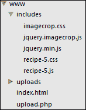

# 八、理解插件开发

在本章中，我们将介绍以下主题：

*   创建插件模板
*   创建工具提示插件
*   构建内容和图像滑块插件
*   创建 RSS 提要阅读器插件
*   从头开始编写图像裁剪器插件

# 导言

jQuery 插件允许开发人员编写可移植代码，这些代码可以在任何 jQuery 项目中快速重用。作为本书的一部分，我们创建了许多功能，您可能希望在多个项目中使用这些功能。通过创建具有所需功能的 jQuery 插件，您可以抽象出该功能的复杂性，并使其易于包含在您需要的任何地方。

在开始本章之前，请创建一个名为`chapter8`的易于访问的目录。在此文件夹中，添加 jQuery 库的最新版本，这将在本章中使用。

# 创建插件模板

多年来，创建 jQuery 插件变得非常流行，网上有很多关于插件创建最佳实践的文章和讨论。其中许多文章深入讨论了如何创建一个插件模板，该模板可以用作任何 jQuery 插件的起点。本食谱将向您展示如何创建您自己的 jQuery 插件模板，该模板将在本章中使用。

## 准备好了吗

在前面创建的`chapter8`文件夹中，创建一个名为`jquery.plugin-template.js`的 JavaScript 文件。

## 怎么做…

要创建一个基本插件模板，该模板将构成本章中使用的所有插件的基础，请在`jquery.plugin-template.js`中添加以下代码：

```js
;(function ($) {

    var name = 'pluginName';
    Plugin.prototype = {
        defaults: {

        }
    };

    // The actual plugin constructor
    function Plugin(element, options) {
        var $scope = this;
        $scope.$element = $(element);
        $scope.element = element;
        $scope.options = $.extend({}, this.defaults, options);
        $scope.init = function () {

        }
    }

    $.fn[name] = function (options) {
        return this.each(function () {
            new Plugin(this, options).init();
        });
    }
})(jQuery);
```

## 它是如何工作的…

阅读 jQuery 网站（[上的插件文档 http://learn.jquery.com/plugins/basic-plugin-creation/](http://learn.jquery.com/plugins/basic-plugin-creation/) 查看一套需要遵守的指导方针和最佳实践。

此配方中创建的插件使用简单的概念和最佳实践创建轻量级插件模板。有一篇热门文章（[http://coding.smashingmagazine.com/2011/10/11/essential-jquery-plugin-patterns/](http://coding.smashingmagazine.com/2011/10/11/essential-jquery-plugin-patterns/) ）由 Addy Osmani 提供，在遵循这些推荐的最佳实践的同时，对插件创作提供了深刻的见解。

看看我们的插件模板，首先要注意的是文档开头的分号。这是为了确保任何以前包含的插件或脚本都已正确关闭。

为了符合 jQuery 编写建议，整个插件被包装在一个**立即调用的函数表达式**（**IIFE**中，为插件提供作用域。jQuery 作为局部变量`$`提供给 IIFE，以使开发人员能够以正常方式引用 jQuery 库，而不会产生冲突。

在插件构造函数中，声明了一个`$scope`变量，以便明确表示插件作用域的内容。然后，插件初始化所使用的元素将与任何提供的插件选项一起分配给插件的作用域。jQuery`extend()`函数用于将`defaults`对象与`options`对象合并，覆盖`options`中可能提供的任何默认值。最后，将`init()`函数添加到插件的作用域中，您将在其中放置插件的初始化代码，如下所示：

```js
$.fn[name] = function (options) {
   return this.each(function () {
      new Plugin(this, options).init();
   });
}
```

前面的代码使用指定的插件名称`($('.element').pluginName();`，使该插件与任何其他 jQuery 对象方法一样可用。使用`this.each()`，它将为启动插件的每个元素创建一个新的插件实例，并将调用插件的`init()`函数。

# 创建工具提示插件

工具提示是一种流行的方式，用于向用户显示有关他们正在使用的 UI 的其他信息。本食谱将向您展示如何创建自己的基本工具提示插件，您可以轻松地在所有项目中使用该插件。

## 准备好了吗

复制`jquery.plugin-template.js`文件并创建`jquery.tooltip.js`，该文件将成为此配方的插件文件。在与插件文件和 jQuery 库相同的目录中创建`recipe-2.html`和`recipe-2.js`。

## 怎么做…

要创建简单的工具提示插件和示例网页，请执行以下步骤：

1.  将以下 HTML 添加到`recipe-2.html`以创建一个非常简单的网页，其中的元素可以有工具提示：

    ```js
    <!DOCTYPE html>
    <html>
    <head>
        <title>Chapter 8 :: Recipe 2</title>
        <script src="jquery.min.js"></script>
        <script src="jquery.tooltip.js"></script>
        <script src="recipe-2.js"></script>
    </head>
    <body>
    <p><input type="text" class="hasTooltip" data-title="This is a tooltip on an input box" /></p>
    <p><a href="http://www.google.com/" target="_blank" class="hasTooltip" title="External link to http://www.google.com/">Google.com</a></p>
    <button class="hasTooltip" data-title="A button with a tooltip">Button</button>
    </body>
    </html>
    ```

2.  在`jquery.tooltip.js`顶部，更新`name`变量，并将插件默认设置为如下：

    ```js
    var name = 'tooltip';
    Plugin.prototype = {
    defaults: {
                'height': 30,
                'fadeInDelay': 200
    }
    };
    ```

3.  用以下代码更新`$scope.init()`功能：

    ```js
    $scope.init = function() {
    $scope._text = (typeof $scope.$element.data('title') != "undefined") ? $scope.$element.data('title') : $scope.$element.prop("title");
                //Only display the tooltip if a title has been specified
                if (typeof $scope._text != "undefined") {
                    var $html = $("<div class='tooltip-frame'>"
                        +   "<div class='tooltip-arrow'></div>"
                        +   "<div class='tooltip-text'>" + $scope._text + "</div>"
                        + "</div>");

                    $html.css({
                        'position': 'absolute',
                        'text-align': 'center',
                        'height': $scope.options.height,
                        'line-height': $scope.options.height + "px",
                        'left': $scope.$element.offset().left + $scope.$element.outerWidth() + 15,
                        'top': $scope.$element.offset().top + ($scope.$element.outerHeight() / 2) - ($scope.options.height / 2),
                        'background-color': 'rgba(0, 0, 0, 0.81)',
                        'color': '#FFF',
                        'padding': '0 10px 0 10px',
                        'border-radius': '5px',
                        'opact': 'none'
                    }).find('.tooltip-arrow').css({
                            'width': 0,
                            'height': 0,
                            'border-top': '10px solid transparent',
                            'border-bottom': '10px solid transparent',
                            'border-right': '10px solid rgba(0, 0, 0, 0.81)',
                            'position': 'absolute',
                            'left': '-10px',
                            'top': (($scope.options.height / 2) - 10)
                        });

                    $scope.$element.on("mouseover", function(){
                        $html.fadeIn($scope.options.fadeInDelay);
                        $scope.$element.after($html);
                    }).on("mouseout", function(){
                        $html.remove();
                    });
                }
            }
    ```

4.  将以下 jQuery 代码添加到`recipe-2.js`中，以使用`hasTooltip`类初始化所有 HTML 元素的工具提示插件：

    ```js
    $(function(){
        $('.hasTooltip').tooltip();
    });
    ```

5.  在 web 浏览器中打开`recipe-2.html`并将鼠标悬停在屏幕上的一个元素上，以查看出现的工具提示。

## 它是如何工作的…

作为本配方一部分创建的 HTML 页面仅用于提供一些可以附加工具提示的元素。

插件模板的第一个更改是设置默认设置。在本例中，我们设置了工具提示高度和淡入动画持续时间。通过将这些功能添加到此处的默认设置，您可以引入自己的其他功能。

当为每个选定元素初始化插件时，将调用`init()`函数，该函数包含该插件的大部分逻辑。

插件模板通过`$scope.$element`提供元素的“jQueryfied”版本。我们可以使用`prop()`和`data()`函数检查元素上指定的标题，并将其存储在`$scope._text`中，该标题将用作工具提示文本。

然后检查此变量以确保有一些文本可供显示。如果没有文本，则不显示工具提示。

如果定义了`$scope._text`，我们将使用以下代码创建工具提示 HTML：

```js
var $html = $("<div class='tooltip-frame'>"
       +   "<div class='tooltip-arrow'></div>"
       +   "<div class='tooltip-text'>" + $scope._text + "</div>"
       + "</div>");
```

`var`语句对于确保为每个选定元素创建新的工具提示元素非常重要。通过将 HTML 代码包装在`$()`中，我们可以在将该元素插入 DOM 之前在此元素上使用 jQuery 函数。工具提示的 HTML 代码添加标题文本并创建一个显示左箭头的元素。

使用 jQuery`css()`函数，将一系列 CSS 样式应用于新创建的 HTML 代码，以定位和设置工具提示的样式。工具提示的左侧和顶部位置是使用将显示工具提示的选定图元的偏移、宽度和高度来计算的。请注意，`outerWidth()`和`outerHeight()`函数与`width()`/`height()`函数相反，用于包括填充和边框以及返回的尺寸。

jQuery`find()`函数还与`css()`函数一起用于向左箭头添加样式。

最后，将两个事件侦听器附加到选定的元素，以便当用户的鼠标移到元素上时显示工具提示，当用户的鼠标移出时删除工具提示。`fadeIn()`函数从`defaults`对象获取`duration`参数，当工具提示插件初始化时可以覆盖该参数。

要为所有具有`hasTooltip`类的元素初始化工具提示插件，将以下 jQuery 代码添加到`recipe-2.js`：

```js
$(function(){
    $('.hasTooltip').tooltip();
});
```

这是您可以覆盖默认值的地方，例如，使用以下代码：

```js
$(function(){
    $('.hasTooltip').tooltip({
       'height': 50,
          'fadeInDelay': 500              
    });
});
```

## 还有更多…

这个配方提供了一个非常基本的工具提示插件。您可以在此配方上进行扩展，添加许多附加功能，例如定位，并允许插件用户指定工具提示打开的事件。

# 构建内容和图像滑块插件

在[第 7 章](07.html "Chapter 7. User Interface Animation")*用户界面动画*中，我们向您展示了如何使用 jQuery 创建简单的内容滑块。此配方将向您展示如何将该配方转换为可重用的 jQuery 插件，并向滑块添加图像。您不需要阅读前面的配方就可以完成这一步，但建议您这样做，以便更好地理解代码的工作原理。

## 准备好了吗

复制`jquery.plugin-template.js`文件并将其重命名为`jquery.slider.js`，该文件将成为此配方的插件。您还需要找到一个 600 像素宽、250 像素高的图像，该图像将在滑块中使用。最后，在与`jquery.slider.js`文件和 jQuery 库相同的目录中创建`recipe-3.html`、`slider.css`和`recipe-3.js`。

## 怎么做…

执行以下步骤创建图像和内容滑块插件：

1.  将以下 HTML 添加到`recipe-3.html`：

    ```js
    <!DOCTYPE html>
    <html>
    <head>
        <title>Chapter 8 :: Recipe 3</title>
        <link href="slider.css" rel="stylesheet" type="text/css" />
        <script src="jquery.min.js"></script>
        <script src="jquery.slider.js"></script>
        <script src="recipe-3.js"></script>
    </head>
    <body>
    <div class="mySlider">
        <div>Slider Content 1</div>
        
        <div>Slider Content 3</div>
        <div>Slider Content 4</div>
    </div>
    </body>
    </html>
    ```

2.  在`jquery.slider.js`顶部，将插件名称更新为`slider`，并设置默认值如下：

    ```js
    var name = 'slider';
    Plugin.prototype = {
       defaults: {
          width: 600,
          height: 250
    }
    };
    ```

3.  将插件的`$scope.init()`功能更新为以下内容：

    ```js
    $scope.init = function () {
    $scope.$element.addClass("slider-frame").css({
       width: $scope.options.width,
       height: $scope.options.height
    });
    $scope.$element.append('<ul class="slider-nav"></ul>');
    var _sliderItems = $scope.$element.find('div, img');
    _sliderItems.wrapAll("<div class='slider-content'></div>");
    $scope.$element.find('.slider-content').css({
       width: $scope.options.width * _sliderItems.length,
       position: 'relative'
    });
    _sliderItems.css({
       float: 'left',
       width: $scope.options.width,
       height: $scope.options.height
    });
    var _sliderNav = $scope.$element.find('.slider-nav');
    for (var i = 0; i < _sliderItems.length; i++) {
       _sliderNav.append("<li><a href='#" + i + "' " + ((i == 0) ? "class='active'" : "") + ">" + (i + 1) + "</a></li>");
    }
    _sliderNav.on("click", "li a", function(){
       var index = this.hash.replace("#", "");
       _sliderNav.find('li a').removeClass("active");
       $(this).addClass("active");
       $scope.$element.find('.slider-content').animate({
          left: -(index * $scope.options.width) + "px"
       });
    });
    }
    ```

4.  在`recipe-3.js`中添加以下 jQuery 代码来初始化滑块插件：

    ```js
    $(function(){
        $('.mySlider').slider();
    });
    ```

5.  在`slider.css`中添加以下 CSS 代码：

    ```js
    .slider-frame {
        overflow: hidden;
        position: relative;
        margin: auto;
        border: solid 1px #CCC;
    }
    .slider-nav {
        list-style: none;
        padding: 0;
        margin: 0;
        height: 35px;
        position: absolute;
        bottom: 0;
        left: 0;
        right: 0;
        text-align: center;
    }
    .slider-nav li {
        display: inline-block;
        margin-right: 5px;
    }
    .slider-nav li a {
        display: block;
        color: #FFF;
        text-decoration: none;
        border-radius: 30px;
        background-color: #333;
        width: 25px;
        height: 25px;
        text-align: center;
        line-height: 25px;
    }
    .slider-nav li a:hover {
        background-color: #000;
    }
    .slider-nav li a.active {
        background-color: #FFF;
        color: #333;
    }
    ```

6.  在网络浏览器中打开`recipe-3.html`，您将看到一个动态创建的图像和内容滑块。

## 它是如何工作的…

HTML 页面为滑块插件设置所需的 HTML。有一个包含子对象的容器分区，slider 插件将使用它作为幻灯片。子元素可以是分割元素或图像。

`recipe-3.js`中的 jQuery 代码选择`mySlider`除法元素并初始化滑块插件。

我们前面创建的插件模板负责 jQuery 插件设置。滑块插件的功能包含在`init()`函数中。在该函数开始时，`slider-frame`类被添加到所选元素（`.mySlider`，以便它从`slider.css`样式表继承一些基本样式。使用来自`options`对象的值，使用 jQuery`css()`函数设置元素的宽度和高度，如下所示：

```js
$scope.$element.addClass("slider-frame").css({
width: this.options.width,
height: this.options.height
});
```

在此之后，`$scope.$element.append('<ul class="slider-nav"></ul>');`用于在滑块中插入一个空的无序列表，以便创建幻灯片导航。

代码的下一部分为动画设置滑块。如[第 7 章](07.html "Chapter 7. User Interface Animation")*用户界面动画*中*创建动画内容滑块*配方中所述，滑块需要将其容器的宽度作为其幻灯片的组合宽度，以便幻灯片可以相邻浮动，并使用动画将其移动到视图中，如以下代码所示：

```js
var _sliderItems = $scope.$element.find('div, img');
_sliderItems.wrapAll("<div class='slider-content'></div>");
$scope.$element.find('.slider-content').css({
width: $scope.options.width * _sliderItems.length,
position: 'relative'
});
```

为此，选择滑块的子项（幻灯片），然后使用 jQuery`wrapAll()`函数将其包装到分割元素中。此元素的宽度设置为单个幻灯片的宽度乘以滑块中的幻灯片数。要浮动每个幻灯片，`css()`函数用于设置`float`属性，如下代码所示：

```js
_sliderItems.css({
   float: 'left',
   width: $scope.options.width,
   height: $scope.options.height
});
```

配置好每张幻灯片后，代码中的下一步是将每张幻灯片的列表项添加到`slider-nav`无序列表元素中，以形成导航：

```js
var _sliderNav = $scope.$element.find('.slider-nav');
for (var i = 0; i < _sliderItems.length; i++) {
   _sliderNav.append("<li><a href='#" + i + "' " + ((i == 0) ? "class='active'" : "") + ">" + (i + 1) + "</a></li>");
 }
```

插件的最后一个阶段是监听导航列表中锚元素的点击，其编码如下，以允许用户使用此导航更改可见幻灯片：

```js
_sliderNav.on("click", "li a", function(){
   var index = this.hash.replace("#", "");
   _sliderNav.find('li a').removeClass("active");
   $(this).addClass("active");
   $scope.$element.find('.slider-content').animate({
      left: -(index * $scope.options.width) + "px"
});
});
```

当用户点击链接时，`animate()`功能用于根据所选链接更改`slider-content`分割元素的左侧位置。请在[第 7 章](07.html "Chapter 7. User Interface Animation")*用户界面动画*中的*创建动画内容滑块*配方中了解更多相关信息。

## 还有更多…

要为该插件添加流行的自动滑块效果，请回顾[第 7 章](07.html "Chapter 7. User Interface Animation")*用户界面动画*中的*创建动画内容滑块*配方。

## 另见

*   [第 7 章](07.html "Chapter 7. User Interface Animation")*用户界面动画*中的*创建动画内容滑块*配方

# 创建 RSS 提要阅读器插件

RSS 提要阅读器是许多网站中非常流行的附加内容。本食谱将向您展示如何利用 GoogleFeedAPI 创建一个可配置的提要阅读器插件，允许您在任何网站上轻松重用该插件。

## 准备好了吗

再次复制`jquery.plugin-template.js`文件并将其重命名为`jquery.rssreader.js`，为该配方的插件提供基础。在同一目录中，创建`recipe-4.js`、`rssreader.css`和`recipe-4.html`。

## 怎么做…

要创建 RSS 阅读器插件，请执行以下步骤：

1.  将以下 HTML 代码添加到`recipe-4.html`以创建一个基本网页，并使 Google Feed API 可在该网页中使用：

    ```js
    <!DOCTYPE html>
    <html>
    <head>
        <title>Chapter 8 :: Recipe 4</title>
        <link href="rssreader.css" rel="stylesheet" type="text/css" />
        <script src="jquery.min.js"></script>
        <script src="https://www.google.com/jsapi"></script>
        <script type="text/javascript">
            google.load("feeds", "1");
        </script>
        <script src="jquery.rssreader.js"></script>
        <script src="recipe-4.js"></script>
    </head>
    <body>
    <div class="myRSSContent"></div>
    </body>
    </html>
    ```

2.  将以下 CSS 代码添加到`rssreader.css`以创建 RSS 阅读器的样式：

    ```js
    @import url(http://fonts.googleapis.com/css?family=Source+Sans+Pro:200,300,400);
    .rssreader-frame {
        background-color: #333;
        border-radius: 5px;
        border: solid 1px #1f1f1f;
        padding: 0 10px 10px 10px;
        font-family: 'Source Sans Pro', sans-serif !important;
    }
    .rssreader-frame h1 {
        margin: 5px 0 5px 0;
        padding: 0;
        font-size: 22px;
        color: #FFF;
        line-height: 30px;
        font-weight: 200;
    }
    .rssreader-frame ul {
        margin: 0;
        padding: 0;
        list-style: none;
    }
    .rssreader-frame ul h4 {
        margin: 0;
        position: relative;
        font-weight: 200;
        color: #E1E1E1;
    }
    .rssreader-frame p.description {
        margin: 0 -10px 10px -10px;
        padding: 0 10px 10px 10px;
        color: #CCC;
        font-size: 12px;
        border-bottom: solid 1px #494949;
    }
    .rssreader-frame ul h4 a {
        line-height: 25px;
        margin-right: 110px;
        display: block;
        text-decoration: none;
        color: #8bd;
    }
    .rssreader-frame ul h4 .entry-date {
        width: 100px;
        position: absolute;
        right: 0;
        top: 0;
        height: 25px;
        line-height: 25px;
        text-align: right;
    }
    .rssreader-frame ul li p {
        color: #666;
        margin: 0 0 10px 0;
        padding: 0 0 10px 0;
        border-bottom: dotted 1px #494949;
    }
    ```

3.  在`jquery.rssreader.js`顶部，更新对象和`name`变量如下：

    ```js
    var name = 'rssreader';
    Plugin.prototype = {
    defaults: {
        url: 'http://feeds.bbci.co.uk/news/technology/rss.xml',
        amount: 5,
        width: null,
        height: null
       }
    };
    ```

4.  更新插件`init()`功能，包括以下代码：

    ```js
            $scope.init = function () {
                $scope.$element.addClass("rssreader-frame");
                if ($scope.options.width != null) {
                   $scope.$element.width($scope.options.width);
                }
                var feed = new google.feeds.Feed($scope.options.url);
                feed.setNumEntries($scope.options.amount);
                feed.load(function(result) {
                    if (!result.error) {
                        var _title = $("<h1>" + result.feed.title + "</h1>");
                        var _description = $("<p class='description'>" + result.feed.description + "</p>");
                        var _feedList = $("<ul class='feed-list'></ul>");
                        for (var i = 0; i < result.feed.entries.length; i++) {
                            var entry = result.feed.entries[i];
                            var date = new Date(entry.publishedDate);
                            var dateString = date.getDate() + "/" + (date.getMonth() + 1) + "/" + date.getFullYear();
                            var _listElement = $("<li></li>");
                            _listElement.append("<h4><a href='" + entry.link + "'>" + entry.title + "</a><div class='entry-date'>" + dateString + "</div></h4>");
                            _listElement.append("<p>" + entry.content + "</p>");
                            _feedList.append(_listElement);
                        }
                        $scope.$element.append(_title);
                        $scope.$element.append(_description);
                        $scope.$element.append(_feedList);
                        if ($scope.options.height != null && (_feedList.outerHeight() + _title.outerHeight()) > $scope.options.height) {
                            _feedList.css({
                                'height': ($scope.options.height - _title.outerHeight()),
                                'overflow-y': 'scroll',
                                'padding-right': 10
                            });
                        }
                    }
                });
            }
    ```

5.  在`recipe-4.js`中添加以下几行 jQuery 的来初始化`myRSSContent`元素的插件：

    ```js
    $(function(){
        $('.myRSSContent').rssreader({
            width: 400,
            height: 300
        });
    });
    ```

6.  Open `recipe-4.html` in a web browser and you will be presented with the following RSS reader:

    

## 它是如何工作的…

为该配方创建网页的 HTML 代码有一个`division`元素，用于初始化 RSS 阅读器插件，并充当 RSS 内容的容器。此外，使用了 Google Feed API，并包含在`jquery.rssreader.js`文件上方的页面中。使用 GoogleFeedAPI 意味着我们可以轻松创建插件，而不需要任何服务器端工作。这也使得插件很容易移植到任何网站。请在[上阅读有关此 API 的更多信息 https://developers.google.com/feed/v1/devguide#hiworld](https://developers.google.com/feed/v1/devguide#hiworld) 。

CSS 代码为在插件本身中创建的 RSS 阅读器元素设置样式。无需进一步解释此代码。

与本章中的其他插件一样，模板负责插件设置，我们的插件功能进入`init()`函数，该函数在插件初始化后执行。

此函数的第一部分将`rssreader-frame`类添加到所选元素，CSS 代码使用该元素应用各种样式。然后，查看`options`变量，如果已提供宽度，则在所选元素上设置宽度。

使用 Google Feed API，使用`options`对象的`URL`和`amount`值配置 Feed 请求，如下所示。这将告诉 API 在哪里收集 RSS 内容以及返回多少项。

```js
var feed = new google.feeds.Feed($scope.options.url);
feed.setNumEntries($scope.options.amount);
```

在此之后，使用`load()`函数通过指定的回调函数发出请求，如下代码所示：

```js
feed.load(function(result) {
if (!result.error) {
// -- HIDDEN CODE
}
}
```

如果未发生错误，将创建标题、说明和无序列表元素，并将其存储在局部变量中，如以下代码所指定：

```js
var _title = $("<h1>" + result.feed.title + "</h1>");
var _description = $("<p class='description'>" + result.feed.description + "</p>");
var _feedList = $("<ul class='feed-list'></ul>");
```

使用`result.feed`对象，可以提取要放在这些元素中的提要标题和描述。这些元素被创建并包装在所选的 jQuery（`$()`中，以便 jQuery 的函数可以在这些元素上使用，供以后使用。

然后，我们循环遍历每个条目，并为每个条目创建一个列表项。在每个列表项中，我们添加提要内容、日期、标题和链接。使用 JavaScript`Date()`函数，创建一个更可读的日期以插入 DOM。要将每个元素添加到先前创建的无序列表元素中，请使用`_feedList.append(_listElement);`。

可以使用以下代码将标题、说明和列表（现在已完全填充 RSS 内容）插入 DOM：

```js
$scope.$element.append(_title);
$scope.$element.append(_description);
$scope.$element.append(_feedList);
```

最后，以下代码用于将任何指定高度应用于 RSS 提要阅读器，并在内容太大而无法容纳在指定高度内时添加滚动条：

```js
if ($scope.options.height != null && (_feedList.outerHeight() + _title.outerHeight()) > $scope.options.height) {
   _feedList.css({
   'height': ($scope.options.height - _title.outerHeight()),
   'overflow-y': 'scroll',
   'padding-right': 10
});
}
```

## 另见

*   [第 6 章](06.html "Chapter 6. User Interface")*用户界面*中的*创建新闻报价器*配方

# 从头开始编写图像裁剪器插件

当允许用户上传自己的图像时，无论是用于个人资料图片还是其他用途，让他们能够在浏览器中对图像进行裁剪，这将为用户带来巨大的好处。这是因为大多数用户不知道如何使用第三方应用（如 Photoshop）更改图像。互联网上有许多免费的图像裁剪器插件和许多帮助您使用它们的教程，但很少有示例为您提供完整的解决方案。此食谱将向您展示如何从头开始创建自己的图像裁剪器插件，如何将图像上载到 web 服务器，以及如何从图像裁剪器获取数据，以调整图像大小并将图像保存到用户规范。

## 准备好了吗

这个方法非常复杂，因为它包括客户端和服务器端代码，所以请确保仔细遵循每个步骤。开始此配方之前，请在 web 服务器的 web 根目录中设置以下目录结构：



按照前面的结构，您需要在 web 根目录中创建`includes`和`uploads`文件夹（上图中的**www**。在`includes`文件夹中，保存 jQuery 库并创建以下四个文件：

*   `imagecrop.css`
*   `jquery.imagecrop.js`（复制之前的`jquery.plugin-template.js`文件，创建此插件的基础）
*   `recipe-5.css`
*   `recipe-5.js`

在 web 根目录本身中，您需要创建`index.html`和`upload.php`文件。

### 注

由于较旧的浏览器不支持`XMLHttpRequest`、`FormData`和`FileReader`API，因此此方法在 IE9 或更低版本中*不起作用。*

## 怎么做…

仔细遵循以下步骤，然后阅读*的工作原理…*部分，以全面了解插件及其相关代码：

1.  将以下 HTML 代码添加到`index.html`以创建带有图像上传表单的网页：

    ```js
    <!DOCTYPE html>
    <html>
    <head>
        <title>Chapter 8 :: Recipe 5 - Image Crop Plugin</title>
        <link href="includes/imagecrop.css" rel="stylesheet" type="text/css" />
        <link href="includes/recipe-5.css" rel="stylesheet" type="text/css" />
        <script src="includes/jquery.min.js"></script>
        <script src="includes/jquery.imagecrop.js"></script>
        <script src="includes/recipe-5.js"></script>
    </head>
    <body>
        <div class="container">
            <h3>#1: Select Image</h3>
            <input type="file" id="selectedImage" />
            <h3>#2: Crop Image</h3>
            <div class="image-preview">
                <div class="preview-msg">Select and image to upload</div>
                
            </div>
            <h3>#3: Upload</h3>
            <div class="progress-bar"><div class="inner"></div></div>
            <div class="actions">
                <button class="upload-button">Upload</button>
            </div>
        </div>
    </body>
    </html>
    ```

2.  将以下 CSS 代码放入`recipe-5.css`中，对您刚刚创建的 HTML 页面和表单进行样式设置：

    ```js
    @import url(http://fonts.googleapis.com/css?family=Source+Sans+Pro:200,300,400);
    body {
        background-color: #F1F1F1;
        font-family: 'Source Sans Pro', sans-serif !important;
    }
    h1, h2, h3 {
        font-weight: 300;
        margin: 0;
    }
    .container {
        width: 800px;
        margin: 50px auto auto auto;
        background-color: #FFFFFF;
        padding: 20px;
        border: solid 1px #E1E1E1;
    }
    .container h3 {
        line-height: 40px;
    }
    .container .image-preview {
        border: solid 1px #E1E1E1;
        width: 800px;
        height: 600px;
        overflow: hidden;
        margin: auto;
        position: relative;
    }
    .container .image-preview .preview-msg {
        position: absolute;
        top: 0;
        left: 0;
        right: 0;
        bottom: 0;
        background-color: #F1F1F1;
        text-align: center;
        font-size: 22px;
        line-height: 600px;
        font-weight: 300;
        z-index: 1;
    }
    #croppable-image {
        position: relative;
        z-index: 2;
    }
    .container .progress-bar {
        height: 30px;
        border: solid 1px #E1E1E1;
    }
    .container .progress-bar .inner {
        height: 30px;
        width: 0;
        background-color: #54ee86;
    }
    .container .actions {
        text-align: right;
        margin-top: 10px;
    }
    .container .actions .upload-button {
        height: 30px;
        width: 60px;
    }
    ```

3.  在`recipe-5.js`中添加以下 jQuery 代码，这将允许用户从本地文件系统中选择并预览图像，然后启动图像裁剪插件：

    ```js
    $(function(){
        var _selectedFile;
        $(document).on("change", "#selectedImage", function(){
            var reader = new FileReader();
            var files = $(this).prop("files");
            if (files.length > 0) {
                _selectedFile = files[0];
                reader.onload = function() {
                    var image = new Image;
                    image.src = this.result;
                    if (image.width > 800 || image.height > 600) {
                        alert("Image cannot be larger that 800x600");
                    } else {
                        $('.preview-msg').hide();
                        $('#croppable-image').prop("src", this.result).fadeIn().imagecrop();
                    }
                };
                reader.readAsDataURL(_selectedFile);
            }
        });
        $(document).on("click", ".upload-button", function(){
            var _selectedImage = $('#croppable-image');
            if (_selectedImage.data("selection-width") > 0 && _selectedImage.data("selection-height") > 0) {
                var data = new FormData();
                data.append("image", _selectedFile);
                data.append("selection-width", _selectedImage.data("selection-width"));
                data.append("selection-height", _selectedImage.data("selection-height"));
                data.append("selection-left", _selectedImage.data("selection-x"));
                data.append("selection-top", _selectedImage.data("selection-y"));
                var xhr = new XMLHttpRequest();
                xhr.open("POST", "/upload.php");
                xhr.onprogress = function(event) {
                    var percent = (event.loaded / event.total * 100);
                    $('.progress-bar .inner').width(percent + "%");
                }
                xhr.onload = function() {
                    var response = JSON.parse(this.response);
                    if (response.success == false) {
                        alert(response.error);
                    }
                }
                xhr.send(data);
            } else {
                alert("Please crop the image before upload");
            }
        });
    });
    ```

4.  在`jquery.imagecrop.js`中，更新插件名称和默认值，如下代码段所示：

    ```js
    var name = 'imagecrop';
        Plugin.prototype = {
            defaults: {
                minWidth: 100,
                minHeight: 100
       }
    };
    ```

5.  在插件模板文件创建的插件构造函数中，在`$scope.options`声明后直接添加以下声明，如下代码段所示：

    ```js
    $scope.options = $.extend({}, this.defaults, options);
    $scope.imageSelection = {
       start: {
          x: 0,
          y: 0
       },
       end: {
          x: 0,
          y: 0
       },
       top: 0,
       left: 0
    };
    var _frame;
    var _overlayLayer;
    var _selectionLayer;
    var _selectionOutline;
    ```

6.  更新插件`$scope.init()`功能，包括以下代码：

    ```js
    //Has this element already been initialised?
    if (typeof $scope.$element.data("selection-x") != "undefined") {
       //Yes, so reuse the DOM elements...
       _frame = $(document).find('.crop-frame').css({
          width: $scope.$element.width(),
          height: $scope.$element.height()
       });
          _overlayLayer = $(document).find('.overlay-layer');
          _selectionLayer = $(document).find('.selection-layer');
          _selectionOutline = $(document).find('.selection-outline');
    } else {
       //No, let's initialise then...
       _frame = $("<div class='crop-frame'></div>").css({
          width: $scope.$element.width(),
          height: $scope.$element.height()
       });
       _overlayLayer = $("<div class='overlay-layer'></div>");
       _selectionLayer = $("<div class='selection-layer'></div>");
       _selectionOutline = $("<div class='selection-outline'></div>");
       //Wrap the image with the frame
       $scope.$element.wrap(_frame);
       _overlayLayer.insertAfter($scope.$element);
       _selectionLayer.insertAfter($scope.$element);
       _selectionOutline.insertAfter($scope.$element);
       /** EVENTS **/
       _selectionLayer.on("mousedown", $scope.onSelectionStart);
       _selectionLayer.on("mouseup", $scope.onSelectionEnd);
       _selectionOutline.on("mouseup", $scope.onSelectionEnd); 
       _selectionOutline.on("mousedown", $scope.onSelectionMove);
    }
    $scope.updateElementData();
    /** UPDATE THE OUTLINE BACKGROUND **/
    _selectionOutline.css({
       'background': 'url(' + $scope.$element.prop("src") + ')',
       'display': 'none'
    });
    ```

7.  在`$scope.init()`功能之后直接添加以下附加功能：

    ```js
    /**
    * MAKING THE SELECTION
    */
    $scope.onSelectionStart = function(event) {
       $scope.imageSelection.start = $scope.getMousePosition(event);
       _selectionLayer.bind({
         mousemove: function(event) {
       $scope.imageSelection.end = $scope.getMousePosition(event);
       $scope.drawSelection();
        }
      });
    };
    $scope.onSelectionEnd = function() {
       _selectionLayer.unbind("mousemove");
       //Hide the element if it doesn't not meet the minimum specified dimensions
       if (
          $scope.getSelectionDimentions().width < $scope.options.minWidth || $scope.getSelectionDimentions().height < $scope.options.minHeight
    ) {
          _selectionOutline.hide();
       }
       _selectionOutline.css({
          'z-index': 1001
       });
    };
    $scope.drawSelection = function() {
       _selectionOutline.show();
       //The smallest top value and the smallest left value are used to set the position of the element
       $scope.imageSelection.top = ($scope.imageSelection.end.y < $scope.imageSelection.start.y) ? $scope.imageSelection.end.y : $scope.imageSelection.start.y;
    $scope.imageSelection.left = ($scope.imageSelection.end.x < $scope.imageSelection.start.x) ? $scope.imageSelection.end.x : $scope.imageSelection.start.x;
    _selectionOutline.css({
       position: 'absolute',
       top: $scope.imageSelection.top,
       left: $scope.imageSelection.left,
       width: $scope.getSelectionDimentions().width,
       height: $scope.getSelectionDimentions().height,
       'background-position': '-' + $scope.imageSelection.left + 'px -' + $scope.imageSelection.top + 'px'
    });
    $scope.updateElementData();
    };
       /**
    * MOVING THE SELECTION
    */
    $scope.onSelectionMove = function() {
       //Prevent trigger the selection events
       _selectionOutline.addClass('dragging');
       _selectionOutline.on("mousemove mouseout", function(event){
          if ($(this).hasClass("dragging")) {
             var left = ($scope.getMousePosition(event).x - ($(this).width() / 2));
            //Don't allow the draggable element to over the parent's left and right
            if (left < 0) left = 0;
            if ((left + $(this).width()) > _selectionLayer.width()) left = (_selectionLayer.width() - $(this).outerWidth());
            var top = ($scope.getMousePosition(event).y - ($(this).height() / 2));
            //Don't allow the draggable element to go over the parent's top and bottom
            if (top < 0) top = 0;
            if ((top + $(this).height()) > _selectionLayer.height()) top = (_selectionLayer.height() - $(this).outerHeight());
            $scope.imageSelection.left = left;
            $scope.imageSelection.top = top;
            //Set new position
            $(this).css({
               top: $scope.imageSelection.top,
               left: $scope.imageSelection.left,
               'background-position': '-' + $scope.imageSelection.left + 'px -' + $scope.imageSelection.top + 'px'
            });
       }
       }).on("mouseup", function(){
       $(this).removeClass('dragging');                $scope.updateElementData();
       });
    }
    ```

8.  在您添加的函数下插入以下帮助函数：

    ```js
    /**
    * HELPER FUNCTIONS
    */
    $scope.getMousePosition = function(event) {
       return {
          y: (event.pageY - _selectionLayer.offset().top),
          x: (event.pageX - _selectionLayer.offset().left)
       };
    };
    $scope.getSelectionDimentions = function() {
       //Work out the width and height based on the start and end positions
       var width = ($scope.imageSelection.end.x - $scope.imageSelection.start.x);
       var height = ($scope.imageSelection.end.y - $scope.imageSelection.start.y);
       //If any negatives turn them into positives
       if (height < 0) height = (height * -1);
       if (width < 0) width = (width * -1);
       return {
          width: width,
          height: height,
          x: $scope.imageSelection.start.x,
          y: $scope.imageSelection.start.y
       };
    }
    $scope.updateElementData = function() {
        $scope.$element.data({
          "selection-x": $scope.imageSelection.left,
          "selection-y": $scope.imageSelection.top,
          "selection-width": $scope.getSelectionDimentions().width,
          "selection-height": $scope.getSelectionDimentions().height
       });
    }
    ```

9.  将以下 CSS 代码添加到`imagecrop.css`以将样式添加到由图像裁剪插件创建的元素中：

    ```js
    .crop-frame {
        position: relative;
        margin: auto;
    }
    .selection-layer {
        position: absolute;
        top: 0;
        left: 0;
        right: 0;
        bottom: 0;
        z-index: 1000;
    }
    .selection-outline {
        border: dotted 1px #000000;
        z-index: 999;
    }
    .selection-outline:hover, .selection-outline:active {
        cursor: move;
    }
    .overlay-layer {
        background-color: rgba(255, 255, 255, 0.60);
        position: absolute;
        top: 0;
        left: 0;
        right: 0;
        bottom: 0;
        z-index: 998;
    }
    ```

10.  最后，在`upload.php`中添加以下 PHP 代码，它将从您刚刚创建的 web 表单中获取数据，然后裁剪图像并将其保存到`uploads`目录中：

    ```js
    <?php
    if (isset($_FILES['image'])) {
        $response = array(
            "success" => false,
            "error" => ""
        );
        //GET SELECTION DATA
        $selectionWidth = (isset($_POST['selection-width'])) ? $_POST['selection-width'] : 0;
        $selectionHeight = (isset($_POST['selection-height'])) ? $_POST['selection-height'] : 0;
        $selectionTop = (isset($_POST['selection-top'])) ? $_POST['selection-top'] : 0;
        $selectionLeft = (isset($_POST['selection-left'])) ? $_POST['selection-left'] : 0;
        //GET IMAGE DATA
        $fileName = $_FILES['image']['name'];
        $ext = pathinfo($fileName, PATHINFO_EXTENSION);
        if ($selectionWidth > 800 || $selectionHeight > 600) {
            $response["error"] = "Image cannot be larger than 800 x 600";
        } else if (!in_array($ext, array("png", "jpg"))) {
            $response["error"] = "Invalid file type";
        } else {
    if ($ext == "png") {
    $source = imagecreatefrompng($_FILES['image']['tmp_name']);
            } else {
    $source = imagecreatefromjpeg($_FILES['image']['tmp_name']);
            }        $dest = imagecreatetruecolor($selectionWidth, $selectionHeight);
    imagecopyresampled($dest, $source, 0, 0, $selectionLeft, $selectionTop, $selectionWidth, $selectionHeight, $selectionWidth, $selectionHeight);
            $path = "/uploads/";
            if (!imagejpeg($dest, getcwd() . $path . $fileName, 100)) {
                $response["error"] = "Could not save uploaded file";
            } else {
                $response["success"] = true;
            }
        }
        header("Content-Type: application/json; charset=UTF-8");
        echo json_encode($response);
    }
    ```

11.  在 web 浏览器中导航到`index.html`文件，您将看到一个简单的 web 表单，其中包含三个步骤。通过选择**选择文件**按钮并从计算机中选择图像，您将看到预览框中显示的图像。在预览框中，您将能够在图像上单击并拖动所选内容。完成此操作后，单击**上传**将图像上传到 web 服务器（由进度条指示），图像将被裁剪并保存在您之前创建的`uploads`文件夹中。

## 它是如何工作的…

了解本食谱的不同部分很重要。这个方法的第一个元素是上传表单本身，它提供了在上传之前在浏览器中查看用户选择的图像的能力。这个配方的第二个元素是图像裁剪插件本身，这是我们最关注的。最后，为了提供完整的解决方案，还有这个配方的 upload 元素，它获取 image crop 插件提供的数据并将其发布到 PHP 脚本。然后，这个 PHP 脚本将这些数据进行裁剪，并将图像保存到用户的规范中。

### 图像选择和预览

`index.html`中的 HTML 代码创建了一个带有文件输入元素的基本接口。当用户点击**选择文件**按钮时，将打开一个浏览窗口，允许用户从计算机中选择文件。使用 JavaScript 的`FileReader`类，我们可以读取此文件并在浏览器中显示。查看`recipe-5.js`，您将看到一个`change`事件处理程序，其代码用于执行此操作。

此时在代码中，有一个基本的验证检查，以确保所选图像不大于 800 x 600 像素。如果是，则会向用户显示警报，并且不会加载图像。

最终加载图像后，`#cropableImage`元素的源属性将更新为所选图像，并显示在屏幕上。最后，图像裁剪插件在图像元素上初始化，如下所示：

```js
$('#croppable-image').prop("src", this.result).fadeIn().imagecrop();
```

### 图像裁剪插件

图像裁剪插件动态创建一系列元素，作为层和容器，允许用户进行选择。为了使更容易理解每一层试图实现的目标，下图对它们进行了说明：


**覆盖层**层淡出大部分图像，背景为白色，不透明度为 0.6。**选择**层是层，用于侦听指示用户正在进行选择的鼠标事件。这样做的主要原因是，如果将鼠标事件附加到图像本身，我们将难以使用某些浏览器，这些浏览器允许您通过图像的视觉表示来拖动图像，这将妨碍我们的功能。**选择大纲**层是用户进行选择时插件绘制的。其背景为所选图像，但位置已调整，因此其仅显示所选图像中已选定的部分，从而提供对原始图像的聚焦，该原始图像的覆盖使其模糊。

当插件初始化时，有一组局部变量和默认值声明插件将在整个操作过程中使用；以下代码段中显示了这些内容：

```js
$scope.imageSelection = {
start: {
   x: 0,
   y: 0
},
end: {
   x: 0,
   y: 0
},
top: 0,
left: 0
};
var _frame;
var _overlayLayer;
var _selectionLayer;
var _selectionOutline;
```

以`var`开头的变量将存储表示层的不同 DOM 元素。`imageSelection`对象存储用户的初始点击坐标，然后存储用户完成选择时的坐标。然后，我们可以使用这些坐标来计算选择的宽度和位置。一旦计算出宽度和高度，`top`和`left`参数存储选择的最终坐标。

在插件的`init()`功能中，有一个初始检查，以确定图像之前是否已初始化。如果是，则已创建并插入图层 DOM 元素，如以下代码段所示：

```js
if (typeof $scope.$element.data("selection-x") != "undefined") {
   // -- HIDDEN CODE
} else {
   // -- HIDDEN CODE
}
```

如果 DOM 元素可用，则使用 jQuery`find()`函数选择元素并将其存储在相关变量中。如果没有，则创建并存储它们。当用户决定更改所选图像时，可能已经为图像初始化了插件。图像源会发生变化，但 DOM 元素可以保持不变，并以不同的维度重复使用。

首次创建图层元素时，将创建一个具有`crop-frame`类的容器分割元素，其尺寸与所选图像相同，如以下代码段所示：

```js
_frame = $("<div class='crop-frame'></div>").css({
    width: $scope.$element.width(),
    height: $scope.$element.height()
});
```

用户选择与实际图像像素尺寸精确匹配非常重要；否则，裁剪计算将不正确。然后使用 jQuery`wrap()`函数将所选图像元素包装在这个框架内，如下所示：

```js
$scope.$element.wrap(_frame);
_overlayLayer.insertAfter($scope.$element);
_selectionLayer.insertAfter($scope.$element);
_selectionOutline.insertAfter($scope.$element); 
```

其他创建的层插入在`crop-frame`分区内选定的图像元素之后，如前一代码所示。

层创建的最后一部分附加了各种事件处理程序函数，这些函数将处理选择过程的不同部分：

```js
_selectionLayer.on("mousedown", $scope.onSelectionStart);
_selectionLayer.on("mouseup", $scope.onSelectionEnd);
_selectionOutline.on("mouseup", $scope.onSelectionEnd);
_selectionOutline.on("mousedown", $scope.onSelectionMove);
```

此处指定的每个函数稍后在`plugin`类中声明。在`init()`函数的末尾，调用`updateElementData()`函数，在所选图像元素（例如`selection-x`上设置初始选择尺寸，并在选择轮廓层上设置背景图像。

当用户第一次单击选择层时，鼠标位置存储为起始坐标。然后，当用户拖动鼠标进行选择时，新的鼠标坐标存储为结束坐标，并调用`drawSelection()`函数。`drawSelection()`功能使用开始和结束坐标来计算选择的宽度和高度，并更新选择轮廓层的 CSS 以显示此内容，如下所示：

```js
$scope.drawSelection = function() {
   _selectionOutline.show();
   //The smallest top value and the smallest left value are used to set the position of the element
$scope.imageSelection.top = ($scope.imageSelection.end.y < $scope.imageSelection.start.y) ? $scope.imageSelection.end.y : $scope.imageSelection.start.y;
$scope.imageSelection.left = ($scope.imageSelection.end.x < $scope.imageSelection.start.x) ? $scope.imageSelection.end.x : $scope.imageSelection.start.x;
_selectionOutline.css({
   position: 'absolute',
   top: $scope.imageSelection.top,
   left: $scope.imageSelection.left,
   width: $scope.getSelectionDimentions().width,
   height: $scope.getSelectionDimentions().height,
   'background-position': '-' + $scope.imageSelection.left + 'px -' + $scope.imageSelection.top + 'px'
});
$scope.updateElementData();
};
```

作为此函数的一部分，更新选择轮廓层的背景位置以显示实际选择，并调用`updateElementData()`函数将新的选择数据应用于所选图像。

当用户完成选择并释放鼠标按钮时，调用`onSelectionEnd()`功能。此功能决定选择是否小于允许的最小值；如果是，则选择将隐藏。鼠标移动事件与选择层解除绑定，以避免与后续功能发生任何冲突，并更新选择轮廓层的`z-index`属性，以便选择轮廓层在选择层上方移动，从而允许拖动功能。在[第 6 章](06.html "Chapter 6. User Interface")*用户界面*中的*创建基本拖放功能*配方中详细介绍了拖动功能。有关详细说明，请参阅该配方。

### 图像上传

在`recipe-5.js`中，**上传**按钮的点击事件附加了一个事件处理程序。在事件的回调函数中，首先确定用户是否进行了选择。否则，将显示一条警报，要求用户选择作物。

如果进行了有效选择，将创建一个新的`FormData`对象来存储要上传到 PHP 脚本的数据，如下所示：

```js
var data = new FormData();
data.append("image", _selectedFile);
data.append("selection-width", _selectedImage.data("selection-width"));
data.append("selection-height", _selectedImage.data("selection-height"));
data.append("selection-left", _selectedImage.data("selection-x"));
data.append("selection-top", _selectedImage.data("selection-y"));
```

`_selectedFile`变量包含对所选文件的引用，该引用在文件输入的更改事件中可用。

将所需数据存储在`FormData`对象中，创建一个新的`XMLHttpRequest`对象，将数据发送到 PHP 上传脚本，如下代码段所示：

```js
var xhr = new XMLHttpRequest();
xhr.open("POST", "/upload.php");
xhr.onprogress = function(event) {
   var percent = (event.loaded / event.total * 100);
   $('.progress-bar .inner').width(percent + "%");
}
xhr.onload = function() {
   var response = JSON.parse(this.response);
   if (response.success == false) {
      alert(response.error);
}
}
xhr.send(data);
```

这段代码是不言自明的，只允许我们直接从 JavaScript 发布，而不需要 HTML 表单。上传图像时，XHR 请求调用`onprogress()`函数，并允许我们更新 HTML 页面上的进度条，以反映上传的进度。操作完成后调用`onload()`函数，允许我们显示发生的任何错误。

### 使用 PHP 裁剪并保存图像

PHP 脚本相对简单。它接受并存储通过 JavaScript 的 POST 请求提供的信息，并对图像宽度和扩展进行一些基本的验证，只允许 JPG 和 PNG 图像。

如果图像通过验证，则使用`imagecreatefrompng()`或`imagecreatefromjpeg()`根据提供的图像在 PHP 中创建图像资源。然后，创建具有指定裁剪尺寸的空白图像，如以下代码行所示：

```js
$dest = imagecreatetruecolor($selectionWidth, $selectionHeight);
```

您可以将此空白图像视为一个画布，PHP 将使用该画布绘制修改后的图像。然后，将所提供的图像裁剪，并将新图像存储在空白画布上，使用的是：

```js
imagecopyresampled($dest, $source, 0, 0, $selectionLeft, $selectionTop, $selectionWidth, $selectionHeight, $selectionWidth, $selectionHeight);
```

最后，新映像保存到本配方开始时创建的`uploads`目录中的磁盘中，如下所示：

```js
imagejpeg($dest, getcwd() . $path . $fileName, 100)
```

当您打开`uploads`目录时，您应该会看到新的图像。

## 还有更多…

这个方法为预览、裁剪、上传和保存图像提供了一个基本的完整解决方案，但是还有很多改进可以做。客户端和服务器端的验证都可以得到显著的改进，以允许使用其他图像类型，并检查文件大小和尺寸。

当`FileReader`将本地文件读入浏览器时，也可以添加一个加载程序或进度条，其方式与上传部分实现进度条的方式相同。

最后，可以改进拖动功能，使选择区域的中间不会“捕捉”到鼠标指针，因为这可能会让用户感到困惑。

## 另见

*   [第 6 章](06.html "Chapter 6. User Interface")*用户界面*中的*创建基本拖放功能*配方