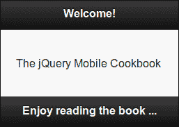
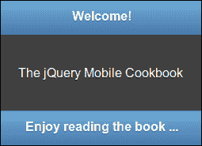
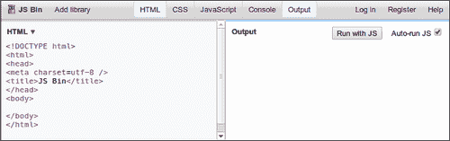
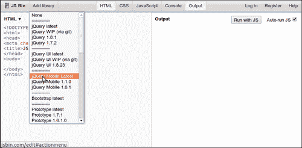
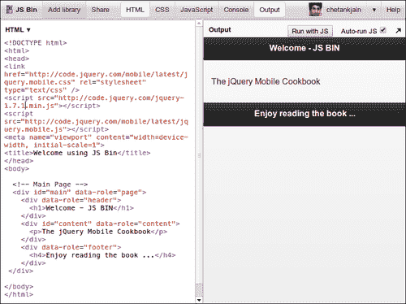

# 一、开始

在本章中，我们将介绍以下配方：

*   编写第一个 jQueryMobile 应用
*   使用 JS-Bin 创建一个简单的应用

# 导言

**jQueryMobile 框架**是一个开源的跨平台 UI 框架。它使用 HTML5、CSS3 和非常流行的 jQueryJavaScript 库构建，并且遵循开放式 Web 标准。它提供了专为移动设备设计的触摸友好的 UI 小部件。它有一个功能强大的主题框架来设计应用。它支持 AJAX 执行各种任务，例如页面导航和转换。

由于 jquerymobile 遵循开放式 web 标准，您可以确保您的应用能够获得最大程度的支持，并与各种浏览器和平台兼容。您只需编写一次应用，就可以在 iPhone、iPad、Android 手机和平板电脑、黑莓、Bada、Windows、Symbian、Meego，甚至是即将推出的基于 HTML5 的平台（如 Boot2Gecko 和 Tizen）上无缝运行。同样的代码将在 Chrome、Firefox、Opera、IE、Safari 和桌面上的其他浏览器上运行。此外，它甚至可以在您的智能电视或任何其他具有符合开放式 web 标准的兼容浏览器的小工具上工作。市场潜力巨大。

当前认证的受支持浏览器、平台和支持级别列表可在 jQueryMobile 网站[上获得 http://www.jquerymobile.com/gbs](http://www.jquerymobile.com/gbs) 。请注意，某些旧平台和遗留平台可能不支持某些功能，例如 CSS 3D 动画和 AJAX。在此，框架采用**渐进增强**。这意味着最初支持基本功能。稍后，当一个功能更强大的未来浏览器或平台可用时，您的应用会自动利用其功能并提供升级的功能。在大多数情况下，您不必编写代码或以任何方式进行干预。当您将移动 web 应用与移动本机应用进行比较时，这是一个很大的优势。

在编写本机应用时，您必须根据平台使用不同的语言编写代码。然后，您必须为每个平台编译代码，并构建可以在设备上运行的二进制软件包。升级应用以支持下一个版本意味着您必须返回并重做检查/修复代码、重建和重新打包的整个练习。当您添加对更多平台的支持时，这一开销会增加。整个事情在一点之后就变得难以管理了。您最好只支持应用的前一两个平台。

当然，使用本机应用有很多优点。应用的性能可能是一个非常关键的因素。在某些应用中，您必须使用本机，特别是当您需要实时响应时。此外，使用本机应用，您可以访问核心操作系统和设备功能，如摄像头、加速计、联系人和日历。这在今天的 HTML5 中是不容易做到的。

**HTML5**是一个相对较新的移动应用进入者。但差距正在日益缩小。已经有一些库可以使用简单的 JavaScript API 公开本机功能，这些 API 可以直接用于 HTML5 应用。PhoneGap 就是这样一个流行的图书馆。Firefox 的 Boot2Gecko 和 Intel/Samsung 的 Tizen 完全基于 HTML5，您应该能够直接从这里的浏览器访问核心设备功能。对未来来说，情况确实很有希望。

jquerymobile 框架有一系列插件和工具，可以帮助您构建应用。它有一个非常活跃和充满活力的开发人员社区，并且不断添加新功能。它得到了许多公司的大力支持，如 Filame Group、Mozilla、诺基亚、Palm、Adobe、Rhomobile 等。在其第一年（2011 年），该框架已经获得了多项奖项，如 Packt 开源奖和.NET 创新奖。

基于 Web 的移动应用已经发展。在早期，他们使用纯本地代码作为用户界面，随后出现了 flash 和其他基于插件的用户界面（如 Silverlight）。但即使是 Adobe 和微软（拥有 Windows8 平台）也在全力开发 HTML5。因此，基于开源 web 标准的跨平台框架（如 jQuery Mobile）的爆炸性增长已经成熟。

jQueryMobile 框架要求您对大多数基本任务和构建 UI 使用声明性语法（HTML 标记）。您必须退回到仅使用 JavaScript 编写脚本的方式，在这种情况下，声明性语法没有任何帮助，当然还需要添加应用逻辑。这与当今市场上的许多其他 UI 框架不同。其他框架要求您编写更多的 JavaScript，并且有更陡峭的学习曲线。

如果您熟悉 HTML、CSS 和 jQuery/JavaScript，那么您会发现学习 jQuery Mobile 非常容易。有许多流行的 IDE 和 UI 构建器，您可以使用它们直观地拖放 UI 控件，并在 jQuery Mobile 中进行开发。但要开始编写代码，您只需使用最喜爱的文本编辑器即可。您还需要一个浏览器（在桌面或手机上运行）来测试应用。现在，您已经准备好编写第一个 jQueryMobile 跨平台应用。

# 编写您的第一个 jQueryMobile 应用

一个简单的 jQueryMobile 应用由一个页面组成，该页面构成应用的基本构建块。页面遵循三个主要部分的基本结构，**页眉**、**页面内容**、**页脚**。您可以使用多个页面构建具有工作流的功能丰富的应用，每个页面都有自己的功能、逻辑和导航流程。这个食谱展示了如何创建页面和编写第一个 jQueryMobile 应用。

## 准备好了吗

从`code/01/welcome`文件夹复制此配方的完整代码。您可以使用 URL:`http://localhost:8080/01/welcome/main.html`启动此代码。

## 怎么做。。。

执行以下步骤：

1.  使用您喜爱的文本编辑器创建以下`main.html`文件：

    ```js
    <!DOCTYPE html>
    <html>
      <head>
        <title>Welcome</title>
        <meta name='viewport' content='width=device-width, 
          initial-scale=1'>
    ```

2.  包括 jQuery 和 jQueryMobile JavaScript 文件：

    ```js
     <link rel='stylesheet' href='http://code.jquery.com
     /mobile/1.1.1/jquery.mobile-1.1.1.min.css' />
     <script src='http://code.jquery.com/jquery-
     1.7.1.min.js'></script>
     <script src='http://code.jquery.com/mobile
     /1.1.1/jquery.mobile-1.1.1.min.js'></script>
      </head>
      <body>
    ```

3.  创建 jQueryMobile 页面：

    ```js
        <!-- Main Page -->
     <div id='main' data-role='page'>
          <div data-role='header'>
            <h1>Welcome!</h1>
          </div>
     <div id='content' data-role='content'>
            <p>The jQuery Mobile Cookbook</p>
          </div>
     <div data-role='footer'>
            <h4>Enjoy reading the book ...</h4>
          </div>
        </div>
      </body>
    </html>
    ```

## 它是如何工作的。。。

以`<!DOCTYPE html>`声明开始，将`main.html`创建为 HTML5 文档。在文件的`<head>`标签中，添加`<meta>`标签，并使用`content='width=device-width'`属性指定视口应占据整个设备宽度。使用指向 jQueryMobile 内容交付网络（CDN）站点上 CSS 文件位置的`<link>`标记，包括 jQueryMobile 样式表。

接下来，包括 JavaScript 库；首先是 jQuery，然后是 jQueryMobile JavaScript 文件。使用`<script>`标签并将`src`指向 CDN 位置，如代码所示。现在，您可以创建页面了。

页面、页眉、页脚和内容都是`<div>`容器，使用`data-role`属性设置样式。在`<body>`标签上添加一个带有`data-role='page'`的`<div>`标签。在页面中添加三个带有`data-role='header'`、`'content'`的`div`标记，最后添加`'footer'`作为子元素。这将分别创建页眉、内容和页脚。您可以在这些`<div>`标记中添加任何文本、表单、列表或其他 HTML 控件。该框架将以触摸友好的移动支持风格增强和呈现控件。

现在，在您喜爱的浏览器中打开`main.html`文件，您将看到类似以下屏幕截图的输出：



在不同的浏览器、移动设备和平板电脑中打开并比较此文件的输出。您将看到，在所有兼容和认证的浏览器/设备上，页面打开后看起来几乎相同。

祝贺您刚刚创建了第一个跨平台 jQueryMobile web 应用。

## 还有更多。。。

在编写本食谱时，jquerymobilev1.1.1 是稳定的版本，并在本书的所有食谱中使用。推荐的受支持 jQuery 库是 jQueryV1.7.1。

您可以直接从 jQuery Mobile CDN 使用这些库，如本配方所示。您也可以在[下载库文件（可在单个存档中获得）http://www.jquerymobile.com/download](http://www.jquerymobile.com/download) ，并在您的网络中本地托管文件。在本地托管时，您只需更新代码中的链接，以指向网络上文件的正确位置（或硬盘上的路径），如以下代码段所示：

```js
<link rel="stylesheet" href='[local path]/jquery.mobile-
  1.1.1.min.css' />
<script src='[local path]/jquery-1.7.1.min.js'></script>
<script src='[local path]/mobile/1.1.1/jquery.mobile-
  1.1.1.min.js'></script>
```

### 页面主题

默认情况下，框架提供五种基本配色方案或组合，称为**色样**。它们被命名为`a`、`b`、`c`、`d`和`e`。默认情况下，创建页面时使用样例`d`。这为页面提供了明亮的黑白组合，如前一个屏幕截图所示。您可以使用`data-theme`属性更改页面和页眉/页脚的色样，如以下代码段所示：

```js
<div data-role='page' data-theme='a'>
  <div data-role='header' data-theme='b'>
….
  <div data-role='footer' data-theme='b'>
```

现在，输出将类似于以下屏幕截图：



## 另见

*   *使用 JS Bin 创建简单应用*配方
*   [第 2 章](02.html "Chapter 2. Pages and Dialogs")*页面和对话框*中*编写单页模板应用*和*编写多页模板应用*配方

# 使用 JS Bin 创建一个简单的应用

**JS Bin**是*雷米夏普*构建的开源 web 应用，可在[下载 http://www.jsbin.com](http://www.jsbin.com) 。JS Bin 允许您在线直接输入您的 HTML、CSS 和 JavaScript 代码，还允许您包含所需的 jQuery 和 jQueryMobile 库。您可以添加并直接运行 JavaScript 代码，并在浏览器上预览输出。您还可以共享您的代码，并与其他人协作进行检查或故障排除。一旦一切正常，您最终可以下载代码。它是许多 jQueryMobile 开发人员使用的非常流行的工具。这个配方向您展示了如何使用 JS-Bin 创建一个简单的 jQueryMobile 应用。

## 准备好了吗

此配方中的代码是使用[上提供的 JS Bin web 应用创建的 http://www.jsbin.com](http://www.jsbin.com) 。该代码位于`code/01/jsbin`源文件夹中。您可以使用 URL`http://localhost:8080/01/jsbin/main.html`启动代码。

## 怎么做。。。

1.  在 URL[处启动 JS Bin web 应用工具 http://www.jsbin.com](http://www.jsbin.com) ，您将看到一个基本的 HTML 模板。
2.  选择左上面板上的**添加库**链接，并包含最新的 jQueryMobile 库文件。接下来，编辑`<head>`部分，如下面的代码片段所示：

    ```js
    <html>
      <head>
        <link href="http://code.jquery.com/mobile/latest
          /jquery.mobile.css" rel="stylesheet" type="text/css" />
     <script src="http://code.jquery.com
     /jquery-1.7.1.min.js"></script>
        <script src="http://code.jquery.com
          /mobile/latest/jquery.mobile.js"></script>
     <meta name="viewport" content="width=device-width, 
     initial-scale=1">
     <title>Welcome using JS Bin</title>
      </head>
    ```

3.  在`<body>`部分添加代码，创建一个简单的 jQueryMobile 页面：

    ```js
      <body>
        <!-- Main Page -->
        <div id="main" data-role="page">
          <div data-role="header">
            <h1>Welcome - JS BIN</h1>
          </div>
          <div id="content" data-role="content">
            <p>The jQuery Mobile Cookbook</p>
          </div>
          <div data-role="footer">
            <h4>Enjoy reading the book ...</h4>
          </div>
        </div>
      </body>
    </html>
    ```

4.  预览或输出现在在屏幕右侧的**输出**窗格中可见。
5.  您现在可以下载源文件（或复制并粘贴到本地文件）以拥有一个简单的工作 jQueryMobile 应用。

## 它是如何工作的。。。

在浏览器中启动 JS Bin web 应用。您将在浏览器中看到以下屏幕，左侧有一个基本 HTML 模板（您可以编辑）。顶部有一个菜单栏，右侧有一个**输出**窗格，可以立即预览代码的输出：



您可以单击各种菜单选项，查看如何使**CSS**或**JavaScript**窗格可见或隐藏。选择**自动运行 JS**选项将允许您自动运行 JS 代码；你可以让它开着。您也可以通过点击**RunwithJS**按钮手动运行脚本。

点击**添加库**菜单选项，选择**jQuery Mobile Latest**选项，如下图所示：



这将包括 HTML 的`<head>`部分中 jQuery Mobile 和 jQuery 库的链接和引用。

### 注

当您使用 JS-Bin 将 jQueryMobile 库添加到代码中时，请确保编辑并设置了要与应用一起使用的 jQueryMobile 库和 jQuery 库的正确版本。编写此配方时，jQuery v1.6.4 正在 JS Bin 中使用，而 jQuery v1.7.1 建议与 jQuery Mobile v1.1.1 一起使用。

接下来，编辑`<meta>`标签以设置正确的视口`width`和`scale`，如代码所示。然后，使用带有`data-role="page"`的`div`标记向`<body>`标记添加页面。创建页眉（`data-role="header"`）、页面内容（`data-role="content"`）和页脚（`data-role="footer"`），如图所示。添加这些部分时，您会注意到屏幕右侧的**输出**窗格得到更新，并显示代码的输出预览。



您还可以添加 CSS 样式和 JavaScript，并检查其工作方式。最后，您的代码已经准备好，您可以在本地复制并粘贴到编辑器中。您也可以点击左上方的**JS Bin**菜单选项下载文件。现在，在浏览器中启动本地文件，您将看到输出与 JS Bin 的**输出**窗格中显示的内容相匹配。

## 还有更多。。。

这个配方向您展示了使用 JS-Bin 创建基本 jQueryMobile 应用所需的简单步骤。JS-Bin 提供了许多易于使用的特性，例如创建和使用现成模板、使用 GitHub 保存和分叉代码以及克隆代码。此工具最适合于在线存储文件并在源文件上进行协作的情况。有关使用 JS-Bin 的更多信息和教程，请参阅[http://jsbin.tumblr.com/](http://jsbin.tumblr.com/) 。

### 注

您可以免费注册并使用您的用户帐户登录 JS Bin，以使用保存、下载或克隆功能。无需用户登录即可使用基本功能。

## 另见

*   *编写您的第一个 jQueryMobile 应用*配方