# 二、页面和对话框

在本章中，我们将介绍：

*   编写单页模板应用
*   编写多页模板应用
*   预取页面以实现更快的导航
*   使用 DOM 缓存提高性能
*   自定义对话框样式
*   使用 CSS 创建跳转页面转换
*   使用 JS 创建幻灯片和淡入淡出页面过渡
*   使用`data-url`处理登录页面导航
*   使用历史 API 创建自定义错误弹出窗口

# 导言

**页面**是写在`<div data-role="page">`容器中的基本 jQueryMobile 对象，显示在屏幕上。它可以包含页眉、页面内容和页脚。您可以在页面中嵌入各种 HTML5 控件和小部件。jQueryMobile 框架自动增强并显示所有这些控件，使它们对点击友好（手指友好）。您的应用可以有一系列单独的 HTML 文件，每个文件代表一个页面，也可以有一个包含多个页面`div`容器的 HTML 文件。您可以提供链接来打开页面中的其他页面，当用户单击链接时，新页面将使用 Ajax 和 CSS3 动画打开。然后，当前页面将从视图中隐藏。

**对话框**是具有`data-role="dialog"`属性的页面。您还可以通过向页面链接添加`data-rel="dialog"`属性，将页面作为对话框加载。对话框的样式与页面不同，它出现在页面上方的屏幕中间。对话框的标题中还提供了一个关闭按钮。

# 编写单页模板应用

在**单页模板**应用中，应用的每个页面都有自己的 HTML 文件。页面作为`<div data-role="page">`包装在页面容器中。当您启动应用时，jQuery Mobile framework 会将应用的第一页（或主页）加载到 DOM 中，DOM 的引用在整个应用周期中一直保持。当用户导航到另一个页面（现在标记为活动页面）时，主页就会隐藏。除了主页之外，当用户离开 DOM 时，所有其他页面都会从 DOM 中删除。使用锚链接指定页面之间的导航。锚定链接使用`data-role="button"`属性装饰为按钮。单击任何链接，都会出现一些很酷的 CSS3 转换，新页面通过 Ajax 拉入。

此配方向您展示了如何创建单页模板应用，以及如何在应用的页面之间导航。

## 准备好了吗

从`code/02/single-page`源文件夹复制此配方的完整代码。您可以使用 URL`http://localhost:8080/02/single-page/main.html`启动此代码。

## 怎么做。。。

执行以下步骤：

1.  创建`main.html`，并添加包含页眉、页脚和页面内容的页面容器。添加链接打开`page2.html`：

    ```js
    <div id="main" data-role="page">
      <div data-role="header">
        <h1>Header of main.html</h1>
      </div>
      <div data-role="content">
     <a href="page2.html" data-role="button">
     Go to Page 2</a>
       </div>
     <div data-role="footer">
       <h4>Footer of main.html</h4>
     </div>
    </div>
    ```

2.  由于是一个单页模板应用，请将每个页面添加到自己的 HTML 文件中。接下来，创建`page2.html`并将应用的第二页添加到其中。添加链接返回到`main.html`：

    ```js
    <div id="page2" data-role="page">
      <div data-role="header">
        <h1>Header of page2.html</h1>
      </div>
      <div data-role="content">
     <a href="#" data-role="button" data-rel="back" 
     data-theme="b">Go Back</a>
      </div>
      <div data-role="footer">
        <h4>Footer of page2.html</h4>
      </div>
    </div>
    ```

## 它是如何工作的。。。

创建`main.html`，并使用指定了`data-role="page"`属性的`<div>`页面容器向其添加页面。添加页眉、页脚和页面内容，如代码所示。现在，在页面内容中添加锚链接，打开第二页`page2.html`。您可以使用`data-role="button"`属性将此链接设置为按钮样式。

接下来，创建`page2.html`并使用指定了`data-role="page"`属性的`<div>`页面容器向其添加页面。向其中添加页眉、页脚和页面内容，如代码清单所示。在这里，在页面内容中，添加一个锚链接返回到`main.html`。另外，将`data-role="button"`属性设置为将此链接设置为按钮样式。

现在，当您启动应用时，`main.html`页面首先加载到 DOM 中。在应用的整个生命周期中，此页面始终保持在 DOM 中。将显示以下屏幕截图：

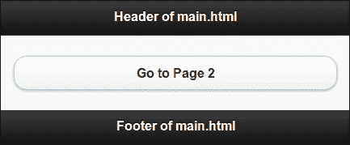

当您点击按钮打开`page2.html`时，主页面被隐藏，显示`page2.html`并激活，如下图所示：

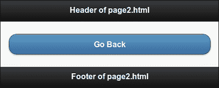

现在，点击链接返回`main.html`。浏览器再次打开`main.html`页面并隐藏`page2.html`。

在`page2.html`中，锚定按钮具有`data-rel="back"`属性。这表示应加载浏览器历史记录中的上一页。`href`链接被忽略，因此您可以将其设置为`#`。

### 提示

**设置单页模板 app**的标题

使用`<title>`标记为单个页面应用中的每个页面设置页面标题。这样可以确保在应用中浏览各个页面时显示相关标题。

## 还有更多。。。

出于以下原因，建议大多数应用使用单页模板：

*   页面更轻、更干净、更模块化，因此更易于维护。
*   DOM 大小相对较小。
*   页面可以在多种平台和环境下正常工作。即使在不支持 JavaScript 的地方，它们也可以工作。您可以通过这种方式瞄准更多设备。

另一方面：

*   当每次页面访问生成新请求时，它会消耗更多带宽。
*   再次打开以前加载的页面将生成新的请求。
*   第一次加载速度更快，但随后的每个页面都必须抓取。

总之，单页模板应用更适合于大型应用，也更适合于您希望针对尽可能多的平台的情况。

### 关闭 Ajax 导航

在此配方中，`#page2`中的将 h`r`ef 值设置为`#`。如果您将`href`值设置为页面的绝对或相对 URL，即`href="main.html"`，那么 Ajax 导航仍然可以工作。要防止通过 Ajax 加载页面，请在链接中添加`data-ajax="false"`属性。当 Ajax 关闭时，框架将不使用自定义 CSS3 转换。

```js
<a href="page2.html" data-role="button" data-ajax="false">text</a>
```

### 提示

**使用 URL 代替数据 rel=“back”**

在单页应用中导航时，最好使用锚定链接`href`中的 URL。这样，Ajax 导航就可以在支持 Ajax 的地方工作。在不支持 Ajax 的 C 级浏览器中，应用仍然可以继续工作，因为它使用`href`进行导航。在这种浏览器中，如果你的应用只依赖于`data-rel="back"`属性，而不使用`href`，那么页面导航就会崩溃。

### 使用数据 rel 和数据方向

当您将`href`和`data-rel="back"`属性添加到锚链接时，`href`属性被框架忽略。页面将只考虑 AUTT3 属性并导航“返回”；也就是说，它将导航到作为浏览器历史堆栈中的上一个条目显示的页面。如果指定了`data-direction="reverse"`属性，框架将反转最近使用的页面转换的方向。`data-direction`属性不依赖于`data-rel`属性，可以在任何转换中独立使用。

```js
<a href="page2.html" data-role="button" 
    data-direction="reverse">text</a>
```

### 页面容器是可选的

在单页模板应用中，指定`<div data-role="page">`页面容器是可选的。jQueryMobile 框架会自动使用页面容器包装页面内容。

### 注

始终使用`div`页面容器包装页面。更容易阅读和维护代码。它还允许您向页面添加页面特定的数据属性，如`data-theme`。

## 另见

*   *编写多页面模板应用*、*预取页面以实现更快的导航*、*使用 DOM 缓存提高性能*配方
*   *在[第一章](01.html "Chapter 1. Get Rolling")*简介*中编写您的第一个 jQueryMobile 应用*配方

# 编写多页模板应用

在多页模板应用中，HTML 文件将包含多页。每一页都包装在一个页面容器中，如`<div data-role="page">`。页面 ID 用于标识页面，以便链接或调用页面上的任何操作。页面 ID 在应用中必须是唯一的。启动应用时，jQueryMobile 框架将所有可用页面加载到 DOM 中，并显示它在 HTML 中找到的第一个页面。页面之间的导航是通过使用锚链接来指定的，您可以使用`data-role="button"`属性将这些链接装饰为按钮。单击任何链接，都会出现一些很酷的 CSS3 转换，新页面通过 Ajax 拉入。此配方向您展示了如何创建多页模板应用，以及如何在其包含的多个页面之间导航。

## 准备好了吗

从`code/02/multi-page`源文件夹复制此配方的完整代码。您可以使用 URL`http://localhost:8080/02/multi-page/main.html`启动此代码。

## 怎么做。。。

执行以下步骤：

1.  创建`main.html`，并将`#main`页面添加到其中。定义页眉、页面内容和页脚，如以下代码段所示。在页面内容

    ```js
    <div id="main" data-role="page">
      <div data-role="header">
        <h1>Header of #main</h1>
      </div>
      <div data-role="content">
     <a href="#page2" data-role="button">Go to Page 2</a>
      </div>
      <div data-role="footer">
        <h4>Footer of #main Page</h4>
      </div>
    </div>
    ```

    中添加链接打开`#page2`页面
2.  Next, in `main.html`, add the second `#page2` page in its own page `div` container, as shown in the following code snippet. Add the header, page content, and footer to this page. Finally, add a link to go back to the `#main` page in its page content:

    ```js
    <div id="page2" data-role="page" data-title="Multi-Page Template">
      <div data-role="header">
        <h1>Header of #page2</h1>
      </div>
      <div data-role="content">
     <a href="#" data-role="button" data-rel="back" data-theme="b">Go Back</a>
      </div>
      <div data-role="footer">
        <h4>Footer of #page2</h4>
      </div>
    </div>
    ```

    ### 提示

    **下载示例代码**

    您可以下载您在[账户购买的所有 Packt 书籍的示例代码文件 http://www.PacktPub.com](http://www.PacktPub.com) 。如果您在其他地方购买了本书，您可以访问[http://www.PacktPub.com/support](http://www.PacktPub.com/support) 并注册，将文件直接通过电子邮件发送给您。

## 它是如何工作的。。。

创建`main.html`，并在其中添加两个页面`#main`和`#page2`。首先，使用指定了`data-role="page"`属性的`<div>`页面容器添加`#main`页面。添加页眉、页脚和页面内容，如代码所示。现在，在页面内容中添加锚定链接，打开第二页`#page2`。您可以使用`data-role="button"`属性将此链接设置为按钮样式。

接下来，使用指定了`data-role="page"`属性的`<div>`页面容器添加`#page2`页面。如代码清单所示，向其中添加页眉、页脚和页面内容。在这里，在页面内容中，添加锚链接以返回到`#main`页面。将`data-role="button"`属性设置为按钮样式。另外，添加`data-rel="back"`属性。这向 jQuery Mobile 框架表明，此链接应打开浏览器历史记录中可用的上一页。

现在，当您启动应用时，所有页面都会加载到 DOM 中，并且在应用的整个生命周期中都会保留在 DOM 中。框架打开它找到的第一个页面。因此，`#main`显示，并有一个按钮打开`#page2`，如下所示：

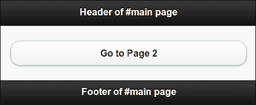

当您点击按钮上的打开第二页时，`#main`页被隐藏，并且`#page2`页被显示并激活，如下所示：

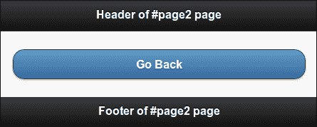

最后，点击链接返回`#main`页面。由于使用了`data-rel="back"`，浏览器再次打开`#main`页面并隐藏`#page2`。

### 提示

**设置多页模板 app**的标题

使用`<title>`标记为多页模板应用的第一页或主页设置页面标题。使用`data-title`属性设置所有其他页面的标题。这将确保每页显示正确的标题。

## 还有更多。。。

建议在使用多页模板构建应用之前，考虑以下因素：

*   多页模板应用由于 DOM 较大而较重。
*   DOM 的大小相对更大、更重，因为所有页面都是预先加载到 DOM 中的。
*   应用需要 JavaScript 支持。这限制了您对目标平台的选择，您可能不得不忽略许多流行的遗留平台。但随着老式手机/平台的逐步淘汰，这一排除名单正日益减少。

好的一面是：

*   只有第一个页面加载速度较慢，但后续页面导航速度较快。
*   所有页面都预加载到 DOM 中，因此后续页面导航不需要新的请求（到服务器）。这意味着更少的带宽。

总之，多页面模板应用更适合于相对较小的应用和您了解目标平台功能（包括 JavaScript 支持）的情况。

### 注

jQuery Mobile 支持的浏览器和平台的更新列表可在[上获得 http://www.jquerymobile.com/gbs](http://www.jquerymobile.com/gbs) 。它还详细说明了在这些平台上提供的支持级别。

### 使用转换

`data-transition`属性可用于指定 jQuery Mobile 默认可用的各种转换。以下代码使用翻转转换打开`#page2`：

```js
<a href="#page2" data-transition="flip" data-role="button">text</a>
```

### 关闭 Ajax 导航

如果在多模板应用中加载页面时传递了属性`data-ajax="false"`，则不会完全停止 Ajax 导航。无论`data-transition`属性中指定的转换如何，默认淡入淡出转换都将用于加载页面。

```js
<a href="#page2" data-ajax="false" data-role="button">text</a>
```

### 页面容器是必需的

对于多页面模板应用中的所有页面，必须指定`<div data-role="page">`页面容器。对所有应用和所有页面使用页面容器，无论它们使用的是单页模板还是多页模板。

## 另见

*   *编写单页模板应用*、*预取页面以实现更快的导航*、*使用 DOM 缓存提高性能*配方
*   *在[第一章](01.html "Chapter 1. Get Rolling")*简介*中编写您的第一个 jQueryMobile 应用*配方

# 预取页面以实现更快的导航

为您的移动应用使用单页模板可以使您的移动应用更快、更轻。但在导航过程中，您必须获取每个页面。每次加载页面时，您都可以看到`ui-loader`旋转图标。多页面模板应用不会出现此问题，因为所有页面都已预加载到 DOM 中。通过使用**预取**功能，可以制作单页模板应用来模拟多页模板应用。

标记为预取的页面在后台加载，当用户试图打开它时，该页面立即可用。您可以通过两种方式预取页面。第一种方法是将`data-prefetch`属性添加到锚链中。第二种方法是使用 JavaScript 调用`loadPage()`方法。这个配方向您展示了如何通过在 jQueryMobile 应用中预取页面来提高页面加载速度。

## 准备好了吗

从`code/02/prefetch`源文件夹复制此配方的完整代码。您可以使用 URL`http://localhost:8080/02/prefetch/main.html`启动此代码。

## 怎么做。。。

应遵循的步骤如下：

1.  创建`main.html`并向其添加两个链接。第一个链接指向`prefetch.html`，第二个链接指向`prefetch-JS.html`。加载`main.html`文件后，可以使用第一个链接上的`data-prefetch`属性在后台预取其中的链接页面，如下面的代码片段所示：

    ```js
    <div id="main" data-role="page">
      <div data-role="header">
        <h1>Header of Main Page</h1>
      </div>
      <div data-role="content">
     <a href="prefetch.html" data-role="button" 
     data-prefetch>Prefetch Page</a> 
        <a href="prefetch-JS.html" data-role="button">
            Prefetch Page using JS</a>
      </div>
      <div data-role="footer">
        <h4>Footer of Main Page</h4>
      </div>
    </div>
    ```

2.  接下来，将下面代码片段中给出的 JavaScript 添加到`main.html`的`<head>`部分。在这里，使用`loadPage()`方法在后台将`prefetch-JS.html`文件加载到 DOM:

    ```js
      $("#main").live("pageshow", function(event, data) {
     $.mobile.loadPage( "prefetch-JS.html", 
     { showLoadMsg: false } );
      });
    </script>
    ```

3.  现在，创建`prefetch.html`文件，如下面的代码片段所示。这是一个常规页面，使用`data-prefetch`属性在`main.html`页面（步骤 1）中预取。同时添加导航回`main.html`：

    ```js
    <div id="prefetch" data-role="page">
      <div data-role="header">
        <h1>Header of Prefetched Page</h1>
      </div>
      <div data-role="content">
        <a href="#" data-role="button" data-rel="back" 
            data-theme="b">Go Back</a>
      </div>
      <div data-role="footer">
        <h4>Footer of Prefetched Page</h4>
      </div>
    </div>
    ```

    的链接
4.  您将看到在步骤 2 中，`prefetchJS.html`是使用 JavaScript 预取的。现在，创建`prefetchJS.html`，如下面的代码片段所示，并添加一个链接导航回`main.html`：

    ```js
    <div id="jsprefetch" data-role="page">
      <div data-role="header">
        <h1>Header of JS Prefetched Page</h1>
      </div>
      <div data-role="content">
        <a href="#" data-role="button" data-rel="back" 
            data-theme="b">Go Back</a>
      </div>
      <div data-role="footer">
        <h4>Footer of JS Prefetched Page</h4>
      </div>
    </div>
    ```

## 它是如何工作的。。。

创建`main.html`，并向其添加两个链接。将第一个链接指向`prefetch.html`并将`data-prefetch`属性设置为此链接。此页面现在在后台自动获取，并在加载`main.html`时立即打开。

将第二个链接指向`prefetch-JS.html`文件。要使用 JavaScript 预取此页面，请为`#main`的`pageshow`事件添加事件处理程序。在此回调函数中，调用`loadPage()`方法获取`prefetch-JS.html`文件。同时将`showLoadMsg`选项设置为`false`，以防止显示旋转`page ui-loader`消息。接下来，创建两个 HTML 文件，如代码所示。在两个页面中添加导航回`main.html`的链接。

现在，当你启动应用时，两个 HTML 文件都会被预取。您可以使用浏览器的代码检查器观察此预取行为，如以下屏幕截图所示：

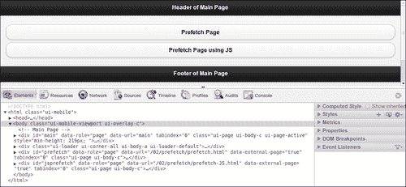

此屏幕截图显示加载`main.html`页面后 Google Chrome 浏览器中的代码检查器。我们可以看到，`#prefetch`和`#jsprefetch`页面都已经预取并在 DOM 中可用。现在，导航到这些预取页面几乎是即时的，旋转的`ui-loader`图标动画不会出现。这将使你的应用更快，并为用户提供更好的用户体验。如果未使用预回迁，则仅当您导航到该页面时才会加载该页面。

使用`data-prefetch`属性是预取页面的更简单方法，因为您不必用它编写任何进一步的代码。但是使用`loadPage()`使用 JavaScript 预取页面可以为`loadPage()`方法提供更多选项，并更好地控制页面加载行为。您还可以使用这种方法内置条件预取。

## 还有更多。。。

避免对过多的页面使用预取，因为所有页面都必须被提取并存储在 DOM 中。这意味着更多的内存利用率，而内存在移动设备上是一种稀缺资源。这将减慢你的应用。预取的页面越多，带宽利用率也就越高。所以明智地使用它。

### 预取未完成时

如果一个页面尚未完全预取，而您尝试导航到该页面，则会出现`ui-loader`微调器，只有在完全获取该页面后才会显示该页面。这可能发生在较慢的连接上。

### 预取页面不会永久缓存

预取页面时，它在 DOM 中可用。如果导航到此页面，然后再导航到别处，则该页面将自动从 DOM 中删除。因此，如果它是一个经常访问的页面，则必须将其添加到 DOM 缓存中。

## 另见

*   *使用 DOM 缓存提高性能*配方
*   *使用 loadPage（）加载[第 9 章](09.html "Chapter 9. Methods and Utilities")、*方法和实用程序*中的*配方页面

# 使用 DOM 缓存提高性能

在单页面模板应用中的页面导航期间，将获取每个新页面并将其存储在 DOM 中。该页面保留在 DOM 中，一旦您离开该页面，该页面将被删除。只有应用的主页面或第一页始终保留在 DOM 中。如前一个配方中所示，预取常用页面在一定程度上有助于提高性能。但是，当您访问预取页面并离开它时，该页面将从缓存中删除。因此，频繁访问页面的多次抓取问题并没有完全解决。

使用 DOM 缓存，特定页面被标记为缓存在 DOM 中。这些页面一旦加载，在应用的整个生命周期中都会保留在 DOM 中。可以通过两种方式使用 DOM 缓存。第一种是将`data-dom-cache`属性添加到要缓存的页面的页面容器中。第二种方法是使用 JavaScript。这个方法向您展示了如何通过使用 DOM 缓存来提高应用的性能。

## 准备好了吗

从`code/02/dom-cache`源文件夹复制此配方的完整代码。您可以使用 URL`http://localhost:8080/02/dom-cache/main.html`启动此代码。

## 怎么做。。。

应遵循的步骤如下：

1.  创建带有链接的`main.html`文件，以导航到两个页面`cached.html`和`cachedJS.html`。这两个页面依次指定它们应该缓存在 DOM:

    ```js
    <div id="main" data-role="page">
      <div data-role="header">
        <h1>Header of Main Page</h1>
      </div>
      <div data-role="content">
        <a href="cached.html" data-role="button">
          Cached Page
        </a>
        <a href="cached-JS.html" data-role="button">
          JS Cached Page
        </a>
      </div>
      <div data-role="footer">
        <h4>Footer of Main Page</h4>
      </div>
    </div>
    ```

    中
2.  创建`cached.html`页面并设置其页面容器的`data-dom-cache`属性。同时添加一个按钮返回`main.html`页面：

    ```js
    <div id="cached" data-role="page" data-dom-cache="true">
      <div data-role="header">
        <h1>Header of Cached Page</h1>
      </div>
      <div data-role="content">
        <a href="#" data-role="button" data-rel="back">
          Go Back
        </a>
      </div>
      <div data-role="footer">
        <h4>Footer of Cached Page</h4>
      </div
    </div>
    ```

3.  最后，创建这个`cached-JS.html`文件，并使用添加到页面`div`容器中的 JavaScript 对其进行缓存，如下代码片段所示。添加按钮导航回`main.html`：

    ```js
    <div id="jscached" data-role="page">
      <script>
     $("#jscached").page({ domCache: true });
      </script>

      <div data-role="header">
        <h1>Header of JS Cached Page</h1>
      </div>
      <div data-role="content">
        <a href="#" data-role="button" data-rel="back">
          Go Back
        </a>
      </div>
      <div data-role="footer">
        <h4>Footer of JS Cached Page</h4>
      </div
    </div>
    ```

## 它是如何工作的。。。

创建`main.html`和添加两个链接打开`cached.html`和`cached-JS.html`文件。接下来，创建带有返回到`main.html`链接的`cached.html`文件。在这里，将`data-dom-cache="true"`属性设置为页面容器。这表示页面加载后必须缓存在 DOM 中。

现在创建带有返回到`main.html`链接的`cached-JS.html`文件。在这里，将给定的脚本添加到页面`div`容器中。在脚本中，将页面上的`domCache`选项设置为`true`。现在，当加载此页面时，它将缓存在 DOM 中。

启动应用并在页面之间导航。在页面导航期间，将获取每个新页面并将其存储在 DOM 中。可以使用浏览器的代码检查器观察 DOM 缓存行为。下图显示了访问这两个页面并将其缓存到 DOM 中后的 Chrome 代码检查器快照。当前活动页面显示为`#main`；这由添加到页面的`div`容器中的`ui-page-active`类表示。其他两个页面被缓存，也可以在 DOM 中看到。

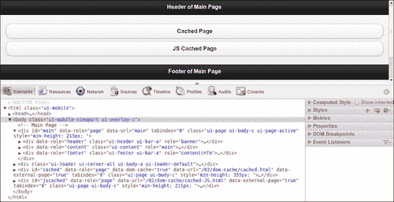

### 提示

**将脚本添加到页面 div 而不是<头>元素**

使用 Ajax 导航时，`<head>`部分仅在应用的第一页或主页上处理。忽略剩余页面中每个页面的`<head>`元素，只处理其页面的`div`容器。因此，为了确保脚本在这些页面中执行，您必须在页面的`div`容器中包含`<script>`标记。

## 还有更多。。。

如果您想缓存应用中曾经访问过的所有页面，那么在每个页面中添加缓存选项会变得很麻烦。有一种方法可以使用 JavaScript 全局实现这一点。将以下脚本添加到主页的`<head>`部分。现在，访问的每个页面都会自动缓存在 DOM 中。

```js
<script>
 $.mobile.page.prototype.options.domCache = true;
</script>
```

### DOM 缓存会降低应用的速度

在 DOM 中缓存大量页面可能会使您的应用非常沉重，并使其速度减慢。在这种情况下，您必须编写额外的代码来管理 DOM 中的缓存页面，并执行所需的任何清理。因此，仅在选定的频繁访问页面上使用 DOM 缓存。

## 另见

*   *预取页面以实现更快的导航*配方

# 自定义对话框样式

您可以使用页面容器上的`data-role="dialog"`属性将页面样式设置为对话框。您还可以在用于打开页面的锚链接中指定`data-rel="dialog"`属性。该页面现在被设置为对话框样式，并以 pop 转换打开。将标题添加到对话框时，默认情况下会在标题左侧的标题上创建一个关闭图标。在某些应用/平台中，您可能希望将此关闭按钮放置在标题的右侧。没有可用于更改此图标位置的就绪选项。此配方向您展示了如何使用自定义样式的标题构建一个对话框，以将关闭按钮放置在标题右侧。

## 准备好了吗

从`code/02/custom-dialog`源文件夹复制此配方的完整代码。您可以使用 URL`http://localhost:8080/02/custom-dialog/main.html`启动此代码。

## 怎么做。。。

应遵循的步骤如下：

1.  使用`#main`页面创建`main.html`。在此处添加链接，使用`data-rel="dialog"`属性

    ```js
    <div id="main" data-role="page">
      <div data-role="header">
        <h1>Header of Main Page</h1>
      </div>
      <div data-role="content">
     <a href="#customdialog" data-role="button" 
     data-rel="dialog">Open Custom Dialog</a>
      </div>
      <div data-role="footer">
        <h4>Footer of Main Page</h4>
      </div>
    </div>
    ```

    以对话框形式打开`#customdialog`页面
2.  在`main.html`中创建页面`#customdialog`并将自定义标题添加到对话框中，该对话框将关闭按钮定位在标题右侧。此代码中阻止了默认标头增强：

    ```js
    <div id="customdialog" data-role="page">  
     <div class="ui-corner-top ui-overlay-shadow ui-header ui-bar-a" 
     role="banner">
     <a href="#main" data-icon="delete" data-iconpos="notext" 
     class="ui-btn-right ui-btn ui-btn-icon-notext ui-btn-corner-
     all ui-shadow ui-btn-up-a" title="Close" data-theme="a" data-
     transition="pop" data-direction="reverse">
          <span class="ui-btn-inner ui-btn-corner-all">
            <span class="ui-btn-text">Close</span>
     <span class="ui-icon ui-icon-delete ui-icon-shadow"></span>
          </span>
        </a>
        <h1 class="ui-title" tabindex="0" role="heading" 
            aria-level="1">Custom Dialog</h1>
      </div>
    ```

3.  最后，添加带有链接的页面内容，返回`#main`页面：

    ```js
      <div data-role="content">
        <a href="#" data-role="button" data-rel="back" 
            data-theme="b">Go Back</a>
      </div>
      <div data-role="footer">
        <h4>Footer of Dialog</h4>
      </div>
    </div>
    ```

## 它是如何工作的。。。

创建包含两个页面的`main.html`，分别为`#main`和`#customdialog`。通过设置`data-rel="dialog"`属性，在`#main`页面添加链接，以对话框形式打开`#customdialog`页面。接下来，创建`#customdialog`页面并添加按钮返回`#main`页面。现在，在`#customdialog`的标题中，不要使用`data-role="header"`属性。这将防止使用默认样式增强对话框标题。关闭图标现在将不会放置在标题的左侧。您现在可以添加自定义标题并为其设置自定义样式，如前面的代码清单所示。启动应用并打开对话框，您将看到对话框弹出。此对话框现在有一个自定义样式的标题，标题右侧有关闭图标，如以下屏幕截图所示：

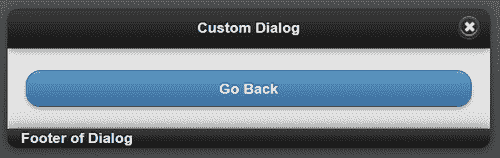

要了解自定义样式是如何形成的，首先创建一个打开常规对话框的页面。使用浏览器的代码检查器，观察 jQuery Mobile 框架对对话框标题所做的代码增强。将生成的代码“原样”复制到自定义对话框代码中。然后，您必须进行以下部分中提到的更改。

第一个更改是固定关闭图标的位置。您将看到关闭操作是在添加到标题代码中的锚定链接的帮助下执行的。在这里，将`ui-btn-left`类替换为`ui-btn-right`类。这将使图标位于标题的右侧。`jquery.mobile.css`文件中已经有这些类定义。

通过此更改，关闭图标现在显示在标题的左侧和右侧位置。这是因为标题仍然具有`data-role="header"`属性。这使得框架增强了整个标题，并自动在左侧添加关闭图标。但是，由于您已经手动添加了所有这些生成的类，现在可以安全地从代码中删除`data-role="header"`属性。保留已添加的所有其他代码和类。现在，当您启动代码时，您将只看到位于标题右侧的单个关闭图标。

## 还有更多。。。

这是一项非常重要的技术。它可以用来定制 jQueryMobile 应用的外观和感觉。该框架提供了许多基本选项、元素和属性，您可以将它们添加到应用中。然后，框架通过在内部添加更多标记代码和样式来增强这些功能，使其在浏览器中看起来更美观。此增强代码在浏览器的**查看源代码**选项中不可见。但是，使用代码检查器或调试工具，您可以查看增强的代码，将其复制到 HTML 文件中，对其进行调整，并获得所需的结果。以下屏幕截图显示了使用此配方创建的自定义对话框标题的代码检查器视图：

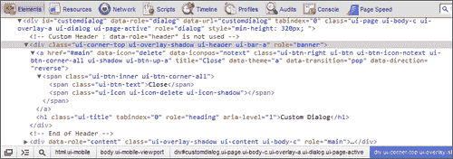

### 定制 CSS

通过在自定义 CSS 文件中引入您自己的样式，可以进一步增强对话框页面。检查在`jquery.mobile.css`文件中有`ui-dialog`的所有类。将要调整的样式复制到自定义 CSS 中，并设置适当的新值。以下代码行显示了一个示例更改，其中对话框的上边距设置为`-12px`，而不是默认的`-15px`：

```js
.ui-dialog { margin-top: -12px; };
```

## 另见

*   *在[第三章](03.html "Chapter 3. Toolbars")中*工具栏*的标题*配方中添加自定义圆形按钮

# 使用 CSS 创建跳跃页面转换

当你在应用页面之间导航时，jQueryMobile 框架使用 CSS3 动画来显示一些很酷的过渡效果。页面默认使用**淡入**过渡，对话框默认使用**弹出**过渡。您可以导航到具有特定转换的页面，当您导航出页面时，您可以反转转换的方向。从 v1.1.1 开始，jQuery Mobile 附带了一组默认的 10 个转换。jQueryMobile 在线文档有一个很好的在线演示，显示了所有可用的转换。但这还不是全部；您可以使用 CSS 创建自己的自定义转换，并在应用中使用它们。这个食谱向您展示了如何在页面转换期间使用 CSS 并创建一个跳跃页面效果。

## 准备好了吗

从`code/02/custom-css-transition`源文件夹复制此配方的完整代码。您可以使用 URL`http://localhost:8080/02/custom-css-transition/main.html`启动此代码。

## 怎么做。。。

应遵循的步骤如下：

1.  创建`customtransition.css`文件，并定义`bounceup`自定义转换，如下面的代码段所示。在 CSS 中设置页面的`Y`位置属性动画：

    ```js
    .bounceup.in, .bounceup.in.reverse {
      -webkit-transform: translateY(0) ;
     -webkit-animation-name: bounceupin;
      -webkit-animation-duration: 1s;
      -webkit-animation-timing: cubic-bezier(0.1, 0.2, 0.8, 0.9);	    
    }
    @-webkit-keyframes bounceupin {
      0% { -webkit-transform: translateY(100%); }
      90% { -webkit-transform: translateY(-10%); }
      100% {-webkit-transform: translateY(0); }
    }
    ```

2.  定义下一步的反向动画：

    ```js
    .bounceup.out, .bounceup.out.reverse {
      -webkit-transform: translateY(100%);
     -webkit-animation-name: bounceupout;
      -webkit-animation-duration: 1s;
      -webkit-animation-timing: cubic-bezier(0.1, 0.2, 0.8, 0.9);
    }
    @-webkit-keyframes bounceupout {
      0% { -webkit-transform: translateY(0); }
      90% { -webkit-transform: translateY(110%); }
      100% {-webkit-transform: translateY(100%); }
    }
    ```

3.  创建`main.html`并在其`<head>`部分包含对`customtransition.css`样式表的引用，如下所示：

    ```js
    <meta name="viewport" content="width=device-width, 
      initial-scale=1">
    <link rel="stylesheet" href="http://code.jquery.com
      /mobile/1.1.1/jquery.mobile-1.1.1.min.css" /> 
    <link rel="stylesheet" href="customtransition.css" />
    <script src="http://code.jquery.com/jquery-1.7.1.min.js">
    </script>
    <script src="http://code.jquery.com/mobile
      /1.1.1/jquery.mobile-1.1.1.min.js"></script>
    ```

4.  创建带有打开`#page2`链接的`#main`页面。将前面定义的`bounceup`自定义转换设置为`data-transition`属性：

    ```js
    <div id="main" data-role="page">
      <div data-role="header">
        <h1>Header of Main Page</h1>
      </div>
      <div data-role="content">
     <a href="#page2" data-role="button" 
     data-transition="bounceup">Go to Page 2</a>
      </div>
      <div data-role="footer">
        <h4>Footer of Main Page</h4>
      </div>
    </div>
    ```

5.  最后，创建带有返回到`#main`页面的链接的`#page2`页面：

    ```js
    <div id="page2" data-role="page" data-title="Custom 
      Transition using CSS">
      <div data-role="header">
        <h1>Header of Page 2</h1>
      </div>
      <div data-role="content">
        <a href="#" data-role="button" data-rel="back" 
            data-theme="b">Go Back</a>
      </div>
      <div data-role="footer">
        <h4>Footer of Page 2</h4>
      </div>
    </div>
    ```

## 它是如何工作的。。。

创建文件`customtransition.css`并定义自定义`bounceup`转换。首先定义`.bounceup.in`类和`.bounceup.in.reverse`类，两者的值相同。这将使进入新页面和离开新页面（反向）的转换看起来相似。在类中，使用`translateY`属性在屏幕上设置新页面的`Y`坐标或垂直位置。使用立方贝塞尔动画曲线在给定的 1 秒持续时间内设置此属性的动画。接下来，定义`Y`坐标动画的关键帧（使用`bounceupin`动画名称指定）。关键帧定义动画中不同时间的`Y`值。

可以使用简单的技巧获得此动画中使用的反弹效果。将`Y`的值设置为 90%持续时间时超出屏幕，然后将其设置为 100%持续时间时的屏幕边缘或动画完成时。当新页面动画进入屏幕、在短时间内延伸出屏幕并返回到正确位置时，这会给它一个整洁的反弹效果。同样，在当前页面导航出屏幕时，为其定义`.bounceup.out`和`.bounceup.out.reverse`动画，如代码所示。

现在，在包含`jquery.mobile.css`文件之后，创建`main.html`和并将 CSS 文件包含在其`<head>`部分中。创建`#main`页面，并添加一个链接，使用`data-transition="bounceup"`属性打开带有自定义转换的`#page2`页面。最后，创建带有返回到`#main`页面的链接的`#page2`页面。现在，当您启动应用并单击按钮时，页面导航将出现，使用一个漂亮的自定义反弹动画。

在页面转换期间，有一个从到**的页面和一个从**到**的页面。jQuery Mobile 在 from 页面（当前页面）上应用`out`类样式，在**到**页面（新页面）上应用`in`类样式。如果要支持反向转换，则在`in`和`out`类中加上后缀`reverse`，如 CSS 文件所示。使用这些样式，jQuery Mobile 将在页面上应用正确的转换效果。您可以进一步调整此配方中的代码，并进一步探索 CSS 动画以创建更多页面动画。你可以随心所欲地创造！**

## 还有更多。。。

CSS 样式在此配方中列出，仅支持 web 工具包浏览器（Chrome 和 Safari）。您可以进一步探索这一点，并尝试将其应用于其他浏览器，如 IE、Firefox 或 Opera。您必须向 CSS 属性添加特定于供应商的前缀。此外，浏览器应该能够支持所使用的 CSS 属性。流行浏览器需要的厂商前缀如下：

*   **铬与狩猎**：`–webkit`
*   **歌剧**：`–o`
*   **火狐**：`–moz`
*   **IE**：`–ms`

### 向 customtransition.css 文件添加供应商前缀

为了整合对其他浏览器的支持，您必须扩展此配方中提供的`customtransition.css`文件。可以通过为属性添加供应商前缀来完成此操作，如下所示：

```js
.bounceup.in, .bounceup.in.reverse {
  -webkit-transform: translateY(0);
  -moz-transform: translateY(0);
  -ms-transform: translate(0)
  -o-transform: translate(0)
  transform: translate(0)

  -webkit-animation-name: bounceupin;
  -moz-animation-name: bounceupin;
  -ms-animation-name: bounceupin;
  -o-animation-name: bounceupin;
  animation-name: bounceupin;
}
```

必须对本配方中列出的代码中具有`–webkit`前缀的所有指定 CSS 属性执行此操作。

### 提示

**各种浏览器支持 CSS3 动画**

支持 CSS3 动画所需的最低浏览器版本是桌面上的 Chrome、Firefox 5.0、IE 10、Safari 4.0 和移动设备上的 Android browser 4、Firefox Mobile 5.0 和 Safari Mobile（iOS 2）。

### 当 CSS3 属性成为标准时

前面 CSS 中显示的每个属性的最后一行是该属性成为标准后的名称。此时，浏览器将不再支持该特定属性的供应商前缀。但是您不必修改 CSS 中的一行代码，因为标准属性已经在您的文件中可用。浏览器将跳过它不理解的所有特性，并选择标准特性。所以一切都会好起来的。

### 渐进增强

您会注意到，此配方中的过渡动画无法在所有浏览器上正常工作。但是页面导航的基本功能在任何地方都可以正常工作。在编写本食谱时，web 工具包浏览器提供了对 CSS3 动画的最佳支持。但 CSS3 的美妙之处在于，随着浏览器的不断改进和用户设备的升级，用户将自动获得更好的应用体验。您不必修改任何代码或进行任何升级版本。这被称为**渐进增强**。使用 jQuery Mobile 意味着您的代码已经在使用渐进增强。如果你的应用是本机编写的，那么这就不那么容易了。

## 另见

*   *使用 JS 创建幻灯片和淡入淡出页面过渡*配方
*   [第 7 章](07.html "Chapter 7. Configurations")*配置*中的*配置您的默认转换*配方

# 使用 JS 创建幻灯片和淡入淡出页面过渡

在前面的配方中，您学习了使用 CSS 向 jQueryMobile 应用添加自定义转换。您还可以使用 JavaScript 创建自定义转换。本食谱向您展示了如何使用 JavaScript 在应用的页面转换过程中创建的“幻灯片效果”（幻灯片和淡入淡出）。

## 准备好了吗

从`code/02/custom-js-transition`源文件夹复制此配方的完整代码。您可以使用 URL`http://localhost:8080/02/custom-js-transition/main.html`启动此代码。

## 怎么做。。。

执行以下步骤：

1.  创建`customtransition.js`JavaScript 文件，并通过添加`mycustomTransition()`方法定义自定义转换，如以下代码段所示。在这里，定义`from`和`to`页面在转换期间应如何设置动画：

    ```js
    function mycustomTransition( name, reverse, $to, $from ) {
        var deferred = new $.Deferred();
        // Define your custom animation here
        $to.width("0");
        $to.height("0");
        $to.show();
        $from.animate(
            { width: "0", height: "0", opacity: "0" },
            { duration: 750 },
            { easing: 'easein' }
        );
        $to.animate(
            { width: "100%", height: "100%", opacity: "1" },
            { duration: 750 },
            { easing: 'easein' }
        );
    ```

2.  接下来，使用直接从`the jquery.mobile.js`文件复制的标准模板完成过渡函数定义：

    ```js
    // Standard template from jQuery Mobile JS file
    reverseClass = reverse ? " reverse" : "";
    viewportClass 
      = "ui-mobile-viewport-transitioning viewport-" + name;
    $to.add( $from ).removeClass( "out in reverse " + name );
    if ( $from && $from[ 0 ] !== $to[ 0 ] ) {
      $from.removeClass( $.mobile.activePageClass );
    }
    $to.parent().removeClass( viewportClass );
    deferred.resolve( name, reverse, $to, $from );
    $to.parent().addClass( viewportClass );
    if ( $from ) {
      $from.addClass( name + " out" + reverseClass );
    }
    $to.addClass( $.mobile.activePageClass + " " + name 
      + " in" + reverseClass );

    return deferred.promise();
    }
    ```

3.  最后，在 jQueryMobile 框架

    ```js
    // Register the custom transition
    $.mobile.transitionHandlers["slidefade"] = mycustomTransition;

    ```

    中注册名为`slidefade`的自定义转换
4.  接下来创建`main.html`文件，并将`customtransition.js`文件包含在`<head>`部分：

    ```js
    <meta name="viewport" content="width=device-width, 
      initial-scale=1">
    <link rel="stylesheet" href="http://code.jquery.com
      /mobile/1.1.1/jquery.mobile-1.1.1.min.css" />
    <script src="http://code.jquery.com/jquery-1.7.1.min.js">
    </script>
    <script src="http://code.jquery.com/mobile/1.1.1
      /jquery.mobile-1.1.1.min.js"></script>
    <script src="customtransition.js"></script>

    ```

5.  定义`#main page`，并且包含打开`#page2`的链接。使用具有`data-transition`属性的自定义`slidefade`转换：

    ```js
    <div id="main" data-role="page">
      <div data-role="header">
        <h1>Header of Main Page</h1>
      </div>
      <div data-role="content">
     <a href="#page2" data-role="button" 
     data-transition="slidefade" data-theme="b">Go to Page 2</a>
      </div>
      <div data-role="footer">
        <h4>Footer of Main Page</h4>
      </div>
    </div>
    ```

6.  最后，定义带有返回到`#main`页面的链接的`#page2`页面：

    ```js
    <div id="page2" data-role="page" data-title="Custom Transition using JS">
      <div data-role="header">
        <h1>Header of Page 2</h1>
      </div>
      <div data-role="content">
        <a href="#" data-role="button" data-rel="back" 
            data-theme="b">Go Back</a>
      </div>
      <div data-role="footer">
        <h4>Footer of Page 2</h4>
      </div>
    </div>
    ```

## 它是如何工作的。。。

创建`customtransition.js`文件，定义`mycustomTransition`功能。这里，首先创建一个 jQuery`$.Deferred`对象。然后，编写自定义转换代码。将`to`页面（或目标页面）的初始宽度和高度设置为零。通过调用`show()`函数使其可见。接下来，为`to`和`from`页面定义动画（from 页面是当前页面）。

### 注

jQuery`$.Deferred`对象可用于注册和调用多个同步或异步回调，然后返回结果。您可以在[上阅读有关此功能及其提供的方法的更多信息 http://api.jquery.com/category/deferred-object/](http://api.jquery.com/category/deferred-object/) 。

调用`animate()`函数并设置宽度、高度、不透明度、动画持续时间和动画曲线等选项，如代码清单所示。设置这些值，以便“发件人”页面的动画设置方式使其宽度和不透明度在指定的持续时间内变为零。这将慢慢隐藏页面，同时向左滑动页面。类似地，设置到页面的动画，以便在给定的持续时间内，宽度、高度和不透明度从 0 达到 100%。“收件人”页面从左侧淡入以占据整个屏幕。现在，这两个动画一起发生，为过渡提供了一个很好的最终结果。

转换完成后，代码必须确保将正确的页面设置为活动页面。您可以直接从标准模板复制此代码段和框架所需的其他默认操作，标准模板已在`jquery.mobile.js`文件中定义。现在，一旦转换完成，调用`deferred.resolve()`函数。还从转换处理程序返回延迟对象的承诺。

最后，您应该使用`slidefade`名称向框架注册自定义转换处理程序。这将确保当您在`data-transition`属性中指定`slidefade`转换名称时，从`$.mobile.transitionHandlers`目录中选择并使用正确的转换。

创建`main.html`并将`customtransition.js`文件包含在`<head>`部分。定义带有链接的`#main`页面，使用`data-transition="slidefade"`属性打开`#page2`，如代码所示。还可以使用返回`#main`页面的链接定义`#page2`。您不必在`#page2`中设置转换，因为 JavaScript 已经处理了反向动画。启动你的应用，当你在页面之间导航时，你将看到新页面滑入，而当前页面淡出，从而为你提供自定义的幻灯片和淡入过渡。再想想，“滑动和收缩”可能是这个过渡的更好名称。

## 还有更多。。。

如果您在应用中定义了自定义转换，并将其用于大多数页面导航，则可以直接将此自定义转换设置为所有页面使用的默认转换。这样，不需要为每个链接指定`data-transition`属性。这在`customtransition.js`文件中指定。注册自定义转换处理程序后（在文件末尾）添加该行，如下所示：

```js
$.mobile.defaultTransitionHandler = myCustomTransition;
```

在前面的代码片段中，`myCustomTransition`是新定义的转换处理程序。现在，所有页面都将使用`slidefade`转换。但这并不影响`Dialog`转换，默认情况下使用 pop 转换。

### JavaScript 转换与 CSS3 转换的比较

在 JS 转换上使用 CSS3 转换，尽管您可能会遇到供应商前缀和不兼容的浏览器。使用 CSS3 转换，所需的代码更少，开发和维护也更容易。此外，您不必从头开始编程动画的整个逻辑。对于 jquerymobile 的未来版本，页面转换框架或逻辑可能会改变，这将打破您的自定义 JS 转换。

然而，使用 CSS3 的好处在于，您的应用得到了逐步增强，并在缺乏 CSS3 支持的情况下回归到基本功能。随着浏览器的改进和升级，供应商的前缀将确保您的代码工作得更好，而无需修改一行代码。当供应商前缀消失时，标准属性将被选中，一切都将继续正常工作。所以，只有当你想做更复杂的事情，并且 CSS3 转换不能完全支持你的需求时，才使用 JS 转换。

## 另见

*   *使用 CSS 创建跳跃页面转换*配方
*   [第 7 章](07.html "Chapter 7. Configurations")*配置*中的*配置您的默认转换*配方

# 使用数据 url 处理登录页面导航

当您在应用中写入登录页面时，一旦用户输入有效凭据，您将希望在成功后将用户重定向到其他页面或其他文件夹。这个方法向您展示了如何在登录页面导航场景中使用`data-url`属性将用户重定向到不同的页面。

## 准备好了吗

从`code/02/data-url`源文件夹复制此配方的完整代码。您可以使用 URL`http://localhost:8080/02/data-url/login/main.html`启动此代码。

## 怎么做。。。

应遵循的步骤如下：

1.  创建两个名为`login`和`records`的文件夹。`login`文件夹将包含`main.html`，而`records`文件夹将包含`index.html`和`data.html`文件。
2.  在`login`文件夹中，将`main.html`创建为多页文档。在这里，首先添加`#main`页面，如下面的代码片段所示。同时添加一个链接以打开`#login`页面。

    ```js
    <div data-role="page" id="main">
      <div data-role="header">
        <h1>Header of Main Page</h1>
      </div>
      <div data-role="content">
        <p>Page: login/main.html #main</p>
        <p><a href="#login" data-role="button">
          Login to Records folder</a></p>
      </div>
    </div>
    ```

3.  接下来，在`main.html`中创建`#login`页面，并通过链接打开`index.html`文件。指定指向`records`文件夹的`data-url`属性（用于页面重定向），如下代码段所示：

    ```js
    <div data-role="page" id="login" 
     data-url="http://localhost:8080/02/data-url/records/"
        data-title="data-url main# Login Page">
      <div data-role="header">
        <h1>Header of Login Page</h1>
      </div>
      <div data-role="content">
        <p>Page: login/main.html #login</p>
        <p><a href="index.html" data-role="button">
          Go to Index Page</a></p>
      </div>
    </div>
    ```

4.  现在，在`records`文件夹中创建`index.html`文件，如下面的代码片段所示。在此处添加链接以打开`data.html`文件。页面也设置了`data-url`，如下代码所示：

    ```js
    <div data-role="page" 
     data-url="http://localhost:8080/02/data-url/records/"
      <div data-role="header">
        <h1>Header of Index Page</h1>
      </div>
      <div data-role="content">
        <p>Page: records/index.html</p>
        <p><a href="data.html" data-role="button">
            Go to Data Page</a></p>
      </div>
    </div>
    ```

5.  最后，在`records`文件夹中创建`data.html`文件。在此处添加指向`index.html`文件的链接。此处未设置`data-url`属性，且导航仍将工作，因为之前完成的页面重定向成功：

    ```js
    <div data-role="page">
      <div data-role="header">
        <h1>Header of Data Page</h1>
      </div>
      <div data-role="content">
        <p>Page: records/data.html</p>
        <p><a href="index.html" data-role="button" 
            data-theme="b">Go to Index Page</a></p>
      </div>
    </div>
    ```

## 它是如何工作的。。。

前面列出的代码中的页面也会在页眉下方显示当前页面的页面 URL。注意此文本，并在浏览此配方中的页面时，将其与浏览器地址栏中显示的地址进行比较。

首先，创建`login`和`records`文件夹。在`login`文件夹中，创建`main.html`文件，这是一个多页文档。添加`#main`和`#login`页面。在`#main`页面中，添加**登录记录文件夹**按钮，打开`#login`页面。接下来，创建`#login`页面，并将其`data-url`属性指定为`http://localhost:8080/02/data-url/records`。在此页面添加**打开索引页**按钮，打开`records`文件夹中的`index.html`文件。现在，当您启动应用并单击`login`按钮时，将显示`#login`页面。但浏览器地址栏将显示 URL 为`http://localhost:8080/02/data-url/records/`，如以下屏幕截图所示。而**转到索引页面**按钮上方的文本仍然表示当前页面位置为`login/main.html #login`。

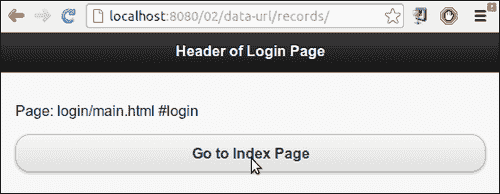

发生此重定向是因为在`#login`页面`div`容器中使用了`data-url`属性。jQueryMobile 框架使用此属性的值而不是用于获取页面的实际 URL 更新地址栏。

这是一个非常方便的功能，允许您在应用中执行重定向。此配方不显示服务器正在验证的用户名或密码。但在现实生活中，用户会在`#main`页面中输入用户名/密码凭据，在服务器成功响应后，您可以将用户重定向到受限文件夹和网页。请勿重定向任何未经身份验证的用户，否则他们将无法访问`records`文件夹中的任何页面。

接下来，添加代码中给出的`index.html`和`records.html`文件。添加指向这些页面的链接以启用它们之间的导航。现在，在`#login`页面中，当您点击**打开索引页面**按钮时，`href`属性在代码中只指定了`index.html`。但由于此时已发生重定向，因此打开了`records`文件夹中的`index.html`文件。`index.html`文件现在是此处的登录页，允许您访问其他页面，例如`data.html`，这些页面都位于`records`文件夹中。使用`data-url`的另一种方法是，您也可以使用`changePage()`方法在成功登录时将用户重定向到`index.html`页面。

在`index.html`中，设置`data-url="http://localhost:8080/02/data-url/records"`属性，当用户点击浏览器的后退或前进按钮时，支持正确的导航，如果不这样做，点击`index.html`中的后退按钮，导航将中断。`data-url`帮助您在历史堆栈上设置正确的值。

您可以使用浏览器的后退和前进按钮查看在浏览应用时，当与标题下方显示的文本相比较时，地址栏如何更新。

### 提示

**对数据 url**使用合适的值

您可以为`data-url`属性指定任何值，地址栏中将显示相同的值。但是您应该注意查看它是否是有效的引用，并且浏览器应该能够呈现页面。在刷新浏览器或单击后退/前进按钮时，指定不正确或不存在的 URL 将中断导航。

## 还有更多。。。

jQuery Mobile 为应用中的所有页面设置并维护`data-url`属性。只有应用的第一页不需要`data-url`，因为它在 DOM 中始终可用，并且可以通过其 ID 或 URL 引用。对于所有其他页面，如果未指定`data-url`属性，则默认情况下会添加页面 ID 的值。对于同一域中的外部页面，页面的相对路径用作`data-url`的值。对于来自不同域的页面，使用绝对路径。

### 使用数据 url 作为 href 链接

如果页面`div`标记同时包含页面 ID 和`data-url`，您可以在`href`属性值中使用`data-url`或页面 ID，并导航到该页面。

### 使用子哈希 URL

一些插件动态地将一个页面拆分为单独的页面。这些页面必须通过深度链接访问。这些页面应按以下方式指定其`data-url`属性：

```js
data-url="page.html&ui-page=subpage"
```

## 另见

*   使用[第 6 章](06.html "Chapter 6. List Views")中的*提交表单*配方

# 使用历史 API 创建自定义错误弹出窗口

jQueryMobile 框架不跟踪历史上的对话框。因此，当您单击浏览器的“后退”按钮时，对话框将不会重新出现。对某些功能使用对话框，例如显示错误弹出窗口或警报，有一个非常明显的小问题。当从页面打开对话框时，地址栏将显示带有`#&ui-state=dialog`文本后缀的页面 URL。这可能不是所有人都想要的。本食谱向您展示了如何使用**历史 API**并定制一个常规对话框，以便在不更改 URL 的情况下使用历史 API 显示。

## 准备好了吗

从`code/02/history`源文件夹复制此配方的完整代码。您可以使用 URL`http://localhost:8080/02/history/main.html`启动此代码。

## 怎么做。。。

应遵循的步骤如下：

1.  创建`main.html`，并添加链接以对话框形式打开`errordialog.html`文件。同时添加一个`input`按钮，如下面的代码片段所示：

    ```js
    <div id="main" data-role="page">
      <div data-role="header">
        <h1>Header of Main</h1>
      </div>
      <div data-role="content">
        <a href="errordialog.html" data-theme="b" 
          data-role="button" data-rel="dialog">
          Dialog
        </a>
     <input type="submit" value="Popup" id="linkButton"
     data-theme="b"/>
      </div>
      <div data-role="footer">
        <h4>Footer of Main</h4>
      </div>
    </div>
    ```

2.  在`main.html`的`<head>`部分添加以下脚本，打开`errorpopup.html`作为`input`按钮`click`事件的对话框：

    ```js
      $("#main").live("pageinit", function(event) {
          $("#linkButton").bind( "click", function(event, ui) {
     $.mobile.changePage( "errorpopup.html", {
     changeHash: false,
     role: "dialog"
     });
        });
      });
    ```

3.  创建`errordialog.html`文件以显示自定义错误消息。还添加了一个按钮返回到`main.html`，如下面的代码片段所示：

    ```js
    <div id="errordialog" data-role="page">
      <div data-role="header">
        <h1>Error !</h1>
      </div>
      <div data-role="content">
        <p>Please correct and resubmit<p>
        <a href="main.html" data-role="button" 
            data-theme="b">Close</a>
      </div>
    </div>
    ```

4.  创建`errorpopup.html`，并在页面容器中添加以下脚本。这是一个常规对话框，但它有一个自定义样式的标题。单击锚定链接时，从历史堆栈中删除其条目：

    ```js
    <div id="errorpopup" data-role="page">
      <script>
        $("#errorpopup").live("pageinit", function(event) {
          $("a").click(function(event) {
     history.back();
          });
        });
      </script>
    ```

5.  然后，在页面中添加自定义标题，并添加返回`main.html`：

    ```js
     <div class="ui-corner-top ui-overlay-shadow ui-header ui-bar-a" 
     role="banner">
        <h1 class="ui-title" tabindex="0" role="heading" 
          aria-level="1">
          Error !
        </h1>
      </div>
      <div data-role="content">
        <p>Please correct and resubmit<p>
        <a href="main.html" data-role="button" data-
          theme="b">
          Close
        </a>
      </div>
    </div>
    ```

    的链接

## 它是如何工作的。。。

使用`#main`页面创建`main.html`，该页面具有打开`errordialog.html`页面的链接。添加一个输入提交按钮（`id="linkButton"`），如图所示。接下来，创建带有按钮的`errordialog.html`页面，返回代码中给出的`main.html`。当您启动应用并单击第一个按钮（**对话框**时，`errordialog.html`页面将作为一个常规对话框打开，带有弹出转换。您将看到地址栏发生变化，并在 URL 末尾显示`#&ui-state=dialog`文本，如以下屏幕截图所示。关闭并打开此对话框几次，然后如果按住“后退”按钮，将显示浏览器的历史记录，您将在历史记录堆栈列表中看到**错误对话框**的条目：

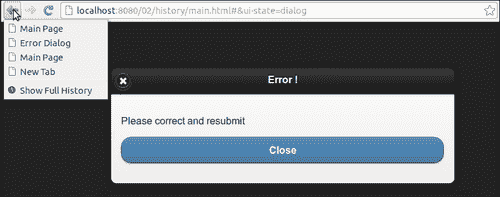

现在，在`main.html`中，将给定脚本添加到`pageinit`事件处理程序中，该事件处理程序在应用启动时被调用。在这里，处理`#linkButton`输入按钮的`click`事件，并使用以下部分描述的选项调用回调中的`changePage()`方法，打开`errorpopup.html`页面。将`role`选项设置为`dialog`以对话框形式打开页面。另外，将`changeHash`选项设置为`false`，以指示打开页面时地址栏中的 URL 哈希不得更改。

接下来，创建`errorpopup.html`并将给定脚本添加到页面容器中。在此脚本中，绑定页面初始化时调用的`pageinit`事件。在这里，为锚按钮的`click`事件添加一个事件处理程序。在此回调中，调用`history.back()`方法删除历史堆栈上的历史条目。您应该将此脚本添加到页面容器中，以便每次在 DOM 中加载和初始化页面时都会调用它。

接下来，将自定义标题添加到错误弹出页面容器中。此自定义标题与本章前面的*自定义样式对话框*配方中使用的标题相同。此对话框标题是自定义的，以使其看起来更像一个弹出窗口，并避免出现关闭按钮，默认情况下，关闭按钮出现在对话框标题中。最后，在页面内容中，添加一个按钮返回到`main.html`。

现在，再次启动应用并点击第二个按钮（**弹出**。创建的自定义对话框显示为弹出窗口，如以下屏幕截图所示：

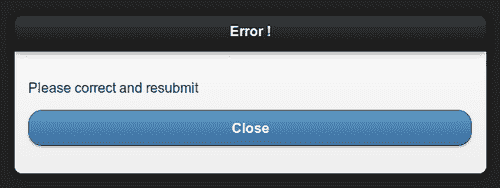

此弹出窗口的行为与默认对话框不同。**关闭**图标不存在。您会注意到浏览器的地址栏没有更改。当您点击并按住浏览器的后退按钮时，您还会看到**错误弹出**页面标题未显示在历史记录列表中。关闭弹出窗口，返回`main.html`。您可以单击并按住浏览器的“后退”或“前进”按钮，以查看弹出窗口从未显示在“历史记录”列表中，而对话框已列出，如以下屏幕截图所示：

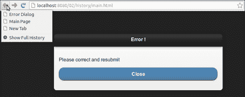

## 还有更多。。。

历史 API 非常易于使用，并提供了其他方法，您可以使用这些方法在浏览器中处理和操作历史堆栈。您可以使用`pushState()`方法在历史记录中添加新条目。使用`replaceState()`，您可以替换堆栈中现有条目的历史记录条目和 URL。这是一种非常方便的方法，可以让您根据应用的需要操纵历史记录。如本配方中列出的代码所示，`history.back()`让您在历史上后退一步，而`history.forward()`让您前进一步。要转到历史堆栈中的特定条目，还可以使用`history.go()`方法，将要跳转的条目的数值传递给它。所以，`history.go(-3)`将带您返回三个条目，加上一个值将带您前进三个条目。

### 对话框上的 popstate 事件

无论何时单击后退或前进按钮，都会引发`popstate`事件。此事件由框架使用`onpopstate`处理程序处理，框架根据需要导航到下一页或上一页。如果`popstate`导致目标页面是一个对话框，框架将处理该事件，并且不会导航回该对话框。因此，当您单击浏览器中的“前进”或“后退”按钮时，该对话框不会再次显示。

### 弹出窗口小部件

在编写此配方时，使用了 jQuery Mobile v1.1.1。因此，在此配方中创建的错误弹出对话框不是真正的弹出窗口，因为它仍然显示在单独的页面中，并且不会悬停在原始页面上。jQuery Mobile v1.2.0 将提供**弹出式**小部件。然后，您可以使用`data-rel="popup"`属性添加一个简单、真实的弹出窗口，如以下代码段所示：

```js
<a href="#myPopup" data-rel="popup">Open Popup</a>
<div data-role="popup" id="myPopup">
  <p>A simple true popup!<p>
</div>
```

您可以选择使用`data-history="false"`属性将弹出窗口设置为不在历史记录中跟踪。您可以在[上阅读有关使用弹出窗口的更多信息 http://jquerymobile.com/demos/1.2.0/docs/pages/popup/index.html](http://jquerymobile.com/demos/1.2.0/docs/pages/popup/index.html) 。

## 另见

*   *自定义样式对话框*配方
*   [第 8 章](08.html "Chapter 8. Events")*事件*中*使用页面初始化事件*配方
*   *使用 changePage（）更改页面*配方[第 9 章](09.html "Chapter 9. Methods and Utilities")*方法和实用程序*