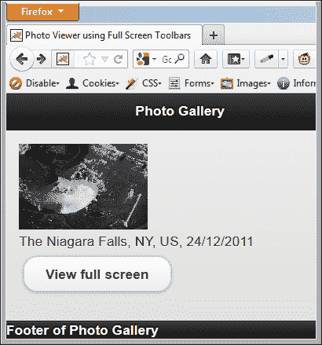
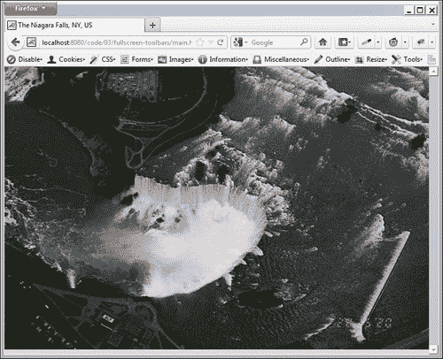
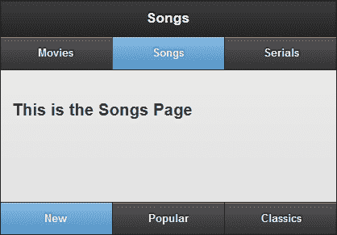
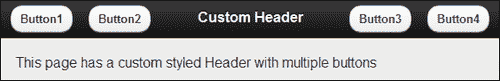
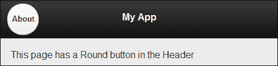
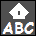
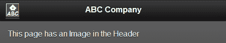
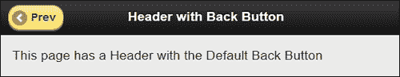
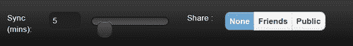

# 三、工具栏

在本章中，我们将介绍：

*   使用全屏固定工具栏
*   在工具栏中使用永久导航栏
*   使用多个按钮自定义标题
*   向标题添加自定义的圆形按钮
*   将图像添加到标题
*   添加自定义的后退按钮
*   将布局网格添加到页脚

# 导言

jQueryMobile 框架提供了两个工具栏，**页眉**和**页脚**。页眉是页面中的第一个容器，页脚是最后一个容器。标题用于指定应用或页面的标题，可以包括用于导航的标准**导航栏**。页脚用于多种用途。它可以包括标准按钮和表单控件，并且可以根据您的需要进行定制。它还可以包含用于页面导航的导航栏。页脚通常也用于显示版权和许可证信息。

# 使用全屏固定工具栏

**滚动页面时，固定工具栏**在屏幕上保持在同一位置。当应用的页面内容占据整个视口时，固定工具栏将与页面内容重叠。无法在此处切换固定工具栏的可见性。要切换工具栏可见性，您可以在**全屏模式**下使用固定工具栏。这个方法向您展示了如何创建一个使用全屏工具栏的简单的**照片查看器**应用。

## 准备好了吗

从`code/03/fullscreen-toolbars`源文件夹复制此配方的完整代码。此代码可以使用 URL`http://localhost:8080/03/fullscreen-toolbars/main.html`启动。

## 怎么做。。。

1.  在`main.html`中创建`#main`页面和``标签，显示**尼亚加拉大瀑布**的缩小图像，如下代码所示：

    ```js
    <div id="main" data-role="page">
      <div data-role="header">
        <h1>Photo Gallery</h1>
      </div>
      <div data-role="content">
        
        <br>The Niagara Falls, NY, US, 24/12/2011
        <br><a href="#photo" data-role="button" data-inline="true">View full screen</a>
      </div>
      <div data-role="footer" data-position="fixed">
        Footer of Photo Gallery
      </div>
    </div>
    ```

2.  创建`#photo`页面，全屏显示图像：

    ```js
    <div id="photo" data-role="page" data-fullscreen="true" data-add-back-btn="true">
     <div data-role="header" data-position="fixed" >
        <h1>The Niagara Falls, NY, US</h1>
      </div>
      <div data-role="content">
        
      </div>
     <div data-role="footer" data-position="fixed">
        Date taken: 24/12/2011
      </div>
    </div>
    ```

## 它是如何工作的。。。

在`main.html`中，创建`#main`页面，使用带有小`width`和`height`的``标签显示**尼亚加拉瀑布**的缩略图。添加链接以打开`#photo`页面。首次启动应用时，将显示以下屏幕，其中显示较小尺寸的快照图像：



接下来创建`#photo`页面，使用`data-fixed="true"`属性创建固定工具栏。使用`data-fullscreen="true"`属性将页面容器设置为占据全屏。使用带有`100% width`和`height`的``标签添加图像。

现在，当您点击`#main`中的**查看全屏**按钮时，`#photo`页面将打开**尼亚加拉大瀑布**的全屏图像。也可以看到固定工具栏。现在点击屏幕时，工具栏的可见性将切换。全屏显示如以下屏幕截图所示：



## 还有更多。。。

默认情况下，全屏工具栏将与页面内容重叠。您将无法访问工具栏下方显示的任何内容。您必须点击屏幕，切换工具栏可见性，然后访问页面内容。这可能会成为应用用户的可用性问题。因此，明智地使用此功能。

### 注

全屏工具栏非常适合于需要显示全屏内容（如照片、预览、幻灯片或视频）的页面。

### 位置固定 CSS 属性

浏览器必须支持 CSS 属性，才能正确动态定位固定工具栏。大多数现代浏览器都支持此属性。对于较旧的浏览器，这种支持可能不存在，框架会优雅地降级，并退回到使用常规静态工具栏。在这些较旧的平台中，您可以使用**Polyfills**来支持固定工具栏，详细说明见[http://jquerymobile.com//test/docs/toolbars/bars-fixed.html](http://jquerymobile.com//test/docs/toolbars/bars-fixed.html) 。

### 切换固定工具栏可见性

正如本配方中已经提到的，您可以点击屏幕切换固定工具栏的可见性。点击行为的这种变化可以通过使用**fixedtoolbar 插件**的`tapToggle`属性（默认为`true`来控制。要启用或禁用点击，请使用以下代码段，该代码段使用 jQuery 选择器查找工具栏：

```js
// to disable tap to toggle toolbars use
$("[data-position='fixed']").fixedtoolbar({ tapToggle: false });

// to enable tap to toggle toolbars use
$("[data-position='fixed']").fixedtoolbar({ tapToggle: true });
```

### 使用 JavaScript 切换固定工具栏可见性

您还可以使用 JavaScript 通过调用`fixedtoolbar`插件上的`show`或`hide`方法来切换固定工具栏的可见性，如下代码所示。代码段使用 jQuery 选择器查找工具栏。

```js
$("[data-position='fixed']").fixedtoolbar('show');
// or
$("[data-position='fixed']").fixedtoolbar('hide');
```

## 另见

*   *在工具栏*中使用持久导航条的方法

# 在工具栏中使用持久导航栏

**导航栏小部件**可用于在应用中提供导航链接。当您在页面之间导航时，**持久导航栏**在应用中保持固定的位置，就像固定的选项卡栏一样。本食谱向您展示了如何使用工具栏中的持久导航栏创建一个简单的**电视菜单界面**。

## 准备好了吗

从`code/03/persistent-navbar`源文件夹复制此配方的完整代码。此代码可以使用 URL`http://localhost:8080/03/persistent-navbar/main.html`启动。

## 怎么做。。。

1.  在`main.html`中创建一个简单的**电视菜单界面**，其中包含三个页面，`#movies`、`#songs`和`#serials`。添加`#movies`页面，其页眉和页脚具有导航栏，如下代码所示：

    ```js
    <div id="movies" data-role="page" >
     <div data-role="header" data-id="persistheader" data-position="fixed">
        <h1>Movies</h1>
        <div data-role="navbar">
          <ul>
            <li><a href="#" data-role="button" 
     class="ui-btn-active ui-state-persist">
                Movies</a></li>
            <li><a href="#songs" data-role="button">Songs</a></li>
            <li><a href="#serials" data-role="button">Serials</a></li>
          </ul>
        </div>
      </div>
      <div data-role="content">
        <h3>This is the Movies Page</h3>
      </div>
     <div data-role="footer" data-id="persistfooter" data-position="fixed" >
        <div data-role="navbar">
          <ul>
            <li><a href="#" data-role="button">New</a></li>
            <li><a href="#" data-role="button">Popular</a></li>
            <li><a href="#" data-role="button">Classics</a></li>
          </ul>
        </div>
      </div>
    </div>
    ```

2.  接下来添加内容类似的`#songs`页面，如下代码所示：

    ```js
    <div id="songs" data-role="page" >
     <div data-role="header" data-id="persistheader" data-position="fixed">
        <h1>Songs</h1>
        <div data-role="navbar">
          <ul>
            <li><a href="#movies" data-role="button">Movies</a></li>
            <li><a href="#" data-role="button"
     class="ui-btn-active ui-state-persist">
                Songs</a></li>
            <li><a href="#serials" data-role="button">Serials</a></li>
          </ul>
        </div>
      </div>
      <div data-role="content">
        <h3>This is the Songs Page</h3>
      </div>
     <div data-role="header" data-id="persistheader" data-position="fixed">
        <div data-role="navbar">
          <ul>
            <li><a href="#" data-role="button">New</a></li>
            <li><a href="#" data-role="button">Popular</a></li>
            <li><a href="#" data-role="button">Classics</a></li>
          </ul>
        </div>
      </div>
    </div>
    ```

3.  最后，在`#serials`页面添加，代码如下：

    ```js
    <div id="serials" data-role="page" >
     <div data-role="header" data-id="persistheader" data-position="fixed">
        <h1>Serials</h1>
        <div data-role="navbar">
          <ul>
            <li><a href="#movies" data-role="button">Movies</a></li>
            <li><a href="#songs" data-role="button">Songs</a></li>
            <li><a href="# " data-role="button"
     class="ui-btn-active ui-state-persist">
                Serials</a></li>
          </ul>
        </div>
      </div>
      <div data-role="content">
        <h3>This is the Serials Page</h3>
      </div>
     <div data-role="header" data-id="persistheader" data-position="fixed">
        <div data-role="navbar">
          <ul>
            <li><a href="#" data-role="button">New</a></li>
            <li><a href="#" data-role="button">Popular</a></li>
            <li><a href="#" data-role="button">Classics</a></li>
          </ul>
        </div>
      </div>
    </div>
    ```

## 它是如何工作的。。。

创建`main.html`并添加三个页面：`#movies`、`#songs`和`#serials`。在`#main`页面中，通过指定`data-position="fixed"`添加固定标题。要在所有页面上保留此标题，请设置属性`data-id="persistheader"`。现在添加一个带有三个链接的`navbar`，如前一代码所示。第一个链接指向同一页面，因此使用`#`作为`href`标记。还添加属性`class="ui-btn-active ui-state-persist`以指示当您导航到此页面时，此按钮应处于活动状态。接下来向页面添加一个页脚，导航栏有三个链接，**新**、**流行**和**经典**，如前一代码所示。添加属性`data-id="persistfooter"`和`data-position="fixed"`以指示这是一个固定页脚，它将在所有页面中持久化。您应该对所有三个页面的标题使用相同的`data-id`值。同样地，三页的页脚也应使用相同的`data-id`。使用相同的值将创建一个粘性的`navbar`，当页面转换发生时，它将保持不变，而不是转换。

接下来添加内容与**电影**页面类似的`#songs`页面。如前所述，为页眉和页脚设置相同的`data-id`值。现在通过设置属性`class="ui-btn-active ui-state-persist"`将标题`navbar`中的第二个按钮设置为活动状态。最后，像前面的页面一样，添加带有固定持久页眉和页脚的`"#serials"`页面。此处将标题`navbar`中的第三个按钮设置为激活状态。启动应用时，可以使用标题导航栏导航到这三个页面。这三个页面都有相同的页眉和页脚。

您可以在页脚中为这三个页面随机选择不同的按钮。当您在页面之间来回导航时，您将看到页脚按钮状态被保留并为页面记住。屏幕显示如下屏幕截图所示：



### 注

持久导航栏在菜单驱动的应用中非常方便，通常用于提供页面之间的导航。

## 还有更多。。。

通过添加`data-icon`属性，您可以为导航栏按钮设置图标。可以使用`data-iconpos`属性将图标位置设置为`top`、`bottom`、`right`或`left`，如下代码所示：

```js
<a href="#" data-role="button" data-icon="home" data-iconpos="right">Home</a>
```

### 具有永久固定工具栏的 3D 页面转换

如果使用永久固定工具栏处理具有 3D 页面转换的页面，可能会遇到定位问题。性能也可能很慢。因此，最好将这些页面转换为使用二维动画，例如`slide`、`slidup`、`slidedown`、`fade`或`none`。

## 另见

*   *使用全屏固定工具栏*配方

# 多按钮定制表头

将按钮添加到页眉时，它们与页眉左侧的对齐，默认情况下，只有一个按钮可以定位到右侧。本食谱向您展示了如何在页眉上添加四个按钮，其中两个按钮位于右侧。

## 准备好了吗

从`code/03/multiple-header-buttons`源文件夹复制此配方的完整代码。此代码可以使用 URL`http://localhost:8080/03/multiple-header-buttons/main.html`启动。

## 怎么做。。。

1.  创建一个名为`jqm.css`的新样式表，并定义两个新的自定义样式，如下代码所示：

    ```js
    .ui-btn-nexttoleft {
      position: absolute; 
      left: 80px; 
      top: .4em; 
    }
    .ui-btn-nexttoright {
      position: absolute; 
      right: 80px; 
      top: .4em; 
    }
    ```

2.  在`main.html`的`<head>`标签中包含上一个样式表，如下代码所示：

    ```js
    <link rel="stylesheet" href="http://code.jquery.com/mobile/1.1.1/jquery.mobile-1.1.1.min.css" /> 
    <link rel="stylesheet" href="jqm.css" />
    <script src="http://code.jquery.com/jquery-1.7.1.min.js"></script>
    <script src="http://code.jquery.com/mobile/1.1.1/jquery.mobile-1.1.1.min.js"></script>
    ```

3.  现在，使用 jQuery Mobile 框架提供的默认样式向页面标题添加四个按钮，并使用您的自定义样式，如以下代码所示：

    ```js
    <div id="main" data-role="page">
      <div data-role="header">
        <a href="#" data-role="button" data-theme="c" 
     class="ui-btn-left">
            Button1</a>
        <a href="#" data-role="button" data-theme="c" 
     class="ui-btn-nexttoleft">
            Button2</a>
        <h1>Custom Header</h1>
        <a href="#" data-role="button" data-theme="c" 
     class="ui-btn-nexttoright">
            Button3</a>
        <a href="#" data-role="button" data-theme="c" 
     class="ui-btn-right">
            Button4</a>
      </div>
      <div data-role="content">
       This page has a custom styled Header with multiple buttons
      </div>
    </div>
    ```

## 它是如何工作的。。。

创建样式表并定义两个新类`.ui-btn-nexttoleft`和`.ui-btn-nexttoright`，以指定按钮将使用的绝对位置。创建`main.html`并在包含`jquery.mobile.css`文件的链接后包含上一个样式表的链接，如前面的代码所示。

接下来，在头的中间添加一个带有 AutoT0}文本的标题，并在其两侧添加两个锚按钮。将属性`class="ui-btn-left"`添加到第一个按钮，使其显示在左角。将属性`class="ui-btn-nexttoleft"`添加到第二个按钮。同样，将属性`class="ui-btn-nexttoright"`添加到第三个按钮，最后将`class="ui-btn-right"`添加到第四个按钮，该按钮将显示在右角。第二个和第三个按钮使用您定义的自定义类。现在，当您启动页面时，按钮位于标题中，如以下屏幕截图所示：



### 注

在样式表中使用绝对值时要小心；如果文本大小或布局发生更改，您可能必须修改绝对位置。

## 还有更多。。。

对头`div`容器使用属性`data-role="header"`会导致 jQuery Mobile 框架以标准方式增强头。您可以跳过此属性，通过使用`div`容器中的类`"ui-bar"`以自己的方式自定义标题。您还可以在标题中包含按钮以外的小部件。

```js
<div class="ui-bar">

```

## 另见

*   [第 2 章](02.html "Chapter 2. Pages and Dialogs")*页面和对话框*中的*自定义样式对话框*配方
*   *将自定义圆形按钮添加到标题*配方中
*   *向标题*添加图像

# 在表头添加自定义圆形按钮

jQueryMobile 框架允许您将自定义控件添加到页面的标题中。此配方向您展示了如何将自定义圆形按钮添加到应用的标题中。

## 准备好了吗

从`code/03/round-button-header`源文件夹复制此配方的完整代码。此代码可以使用 URL`http://localhost:8080/03/round-button-header/main.html`启动。

## 怎么做。。。

1.  创建一个名为`jqm.css`的新样式表，并在其中定义一个自定义`roundbtn`类：

    ```js
    .roundbtn  {
      width: 40px;
      height: 40px;
      margin-top: 20px;
      -webkit-border-radius: 20px; 
      -moz-border-radius: 20px; 
      -ms-border-radius: 20px;
      -o-border-radius: 20px;
      border-radius: 20px;
    }
    ```

2.  创建`main.html`并将上一个样式表包含在`<head>`标记中：

    ```js
    <link rel="stylesheet" href="http://code.jquery.com/mobile/1.1.1/jquery.mobile-1.1.1.min.css" /> 
    <link rel="stylesheet" href="jqm.css" />
    <script src="http://code.jquery.com/jquery-1.7.1.min.js"></script>
    <script src="http://code.jquery.com/mobile/1.1.1/jquery.mobile-1.1.1.min.js"></script>
    ```

3.  使用新定义的`roundbtn`样式，在`#main`页面的页眉添加一个`About`按钮，如下代码所示：

    ```js
    <div id="main" data-role="page" >
     <div data-role="header" style="height: 50px" >
        <h1 style="margin: 15px">Custom Round Button</h1>
        <a href="#about" data-rel="dialog" data-role="button"
     class="roundbtn ui-btn ui-shadow ui-btn-up-c ui-btn-left">
          <br>About</a>
      </div>
      <div data-role="content">
        This page has a Round button in the Header
      </div>
    </div>
    ```

4.  添加`#about`对话框，如下代码：

    ```js
    <div id="about" data-role="page" >
      <div data-role="header" >
        <h1>About</h1>
      </div>
      <div data-role="content">
        Round Button Demo
      </div>
    </div>
    ```

## 它是如何工作的。。。

创建`jqm.css`样式表，并使用`width`、`height`和`border-radius`属性定义一个新类`roundbtn`，如前面的代码所示。要创建圆形按钮，请将`border-radius`属性值设置为`width`属性值的一半。最后，为`border-radius`添加特定于供应商的属性，以确保边界半径在各种浏览器上都能正常工作。

创建`main.html`和在包含`jquery.mobile.css`文件的链接后，包括到上述样式表的链接，如前面的代码所示。接下来创建`#main`页面并添加一个带有`<h1>`文本的标题。使用 style 属性将标题的`height`设置为`50px`，以确保带有`40px``height`（如 CSS 中所指定）的圆形按钮与标题正确匹配。接下来在标题中添加一个锚定链接，属性为`data-role="button"`和`data-rel="dialog"`，以对话框的形式打开`"#about"`页面。使用`class`属性将`roundbtn`样式添加到此按钮。还可以添加框架添加的其他类，同时增强按钮的锚定链接。您可以通过使用浏览器的开发人员工具检查锚元素来获取此类列表。您必须手动添加这些类，以确保圆形按钮在定制时具有正确的样式。

最后，定义前面代码中给出的`#about`页面。启动应用时，标题中将显示一个圆形按钮，如下面的屏幕截图所示。点击圆形按钮将打开`#about`对话框。



## 还有更多。。。

您的浏览器应支持 CSS 中的`border-radius`或相应的供应商特定前缀`border-radius`属性。如果没有，您将看到一个矩形按钮而不是圆形按钮。

## 另见

*   *在[第 2 章](02.html "Chapter 2. Pages and Dialogs")、*页面和对话框*中使用 CSS 创建跳转页面转换*配方，用于说明供应商前缀
*   [第 2 章](02.html "Chapter 2. Pages and Dialogs")*页面和对话框*中的*自定义样式对话框*配方
*   *多按钮定制表头*配方
*   *向标题*添加图像

# 向标题添加图像

jQueryMobile 页面的页眉通常包含将用作页面页眉的文本。还可以将其他内容和标记添加到标题中。此配方向您展示了如何将图像添加到应用的标题中。

## 准备好了吗

从`code/03/header-image`源文件夹复制此配方的完整代码。此代码可以使用 URL`http://localhost:8080/03/header-image/main.html`启动。

## 怎么做。。。

在此配方中，图像`ABC.png`用作虚构公司 ABC Inc.的徽标图像。



1.  创建`main.html`并将上述图像添加到其标题中。图像链接到一个对话框，如以下代码所示：

    ```js
    <div id="main" data-role="page" data-theme="a">
      <div data-role="header" data-theme="a">
        <h1>ABC Company</h1>
     <a href="#about" data-rel="dialog" data-theme="a" class="ui-btn ui-shadow ui-btn-up-a">
     </a>
      </div>
      <div data-role="content">
        This page has an Image in the Header
      </div>
    </div>
    ```

2.  添加`#about`对话框，如下代码所示：

    ```js
    <div id="about" data-role="page" >
      <div data-role="header" >
        <h1>About ABC</h1>
      </div>
      <div data-role="content">
        ABC Company Inc.
      </div>
    </div>
    ```

## 它是如何工作的。。。

在`main.html`中，创建一个`#main`页面并添加一个带有`<h1>`文本的标题。现在在标题中添加一个锚定链接，使用属性`data-rel="dialog"`打开`#about`页面作为对话框。使用属性`class="ui-btn ui-shadow ui-btn-up-a"`为锚定链接指定自定义样式。不要添加`data-role="button"`，因为框架会将此链接作为按钮进行增强。接下来添加一个指向`ABC.png`图像的``元素，如前一代码所示。使用`width`和`height`属性将此图像缩放到合适的大小。最后，定义代码中给出的`#about`页面。启动应用时，`#main`页面的标题在左角显示`ABC.png`图像，如下图所示。点击此图像打开`#about`对话框页面。



## 还有更多。。。

还可以对图像使用本机样式，并避免在锚元素上设置任何自定义样式以仅显示图像。通过使用属性`data-role="none"`完成，如下代码所示：

```js
<a href="#about" data-role="none" data-rel="dialog" data-theme="a">
  
</a>
```

## 另见

*   *多按钮定制表头*配方
*   *将自定义圆形按钮添加到标题*配方中

# 新增自定义后退按钮

当在应用中打开新页面时，jQueryMobile 框架提供了一个选项，可以在页面的标题中添加**后退**按钮，以帮助您导航回上一页。**后退**按钮默认不可见。此配方向您展示了如何使用 JavaScript 在应用中动态添加和自定义**后退**按钮。

## 准备好了吗

从`code/03/custom-back-button`源文件夹复制此配方的完整代码。此代码可以使用 URL`http://localhost:8080/03/custom-back-button/main.html`启动。

## 怎么做。。。

1.  创建`main.html`并在其中添加两个锚定链接。第一个链接打开一个页眉中有**后退**按钮的页面，第二个链接打开一个没有**后退**按钮的页面。
2.  同时在页面中添加一个提交按钮，如下代码所示：

    ```js
    <div id="main" data-role="page">
      <div data-role="header">
        <h1>Header of Main Page</h1>
      </div>
      <div data-role="content">
        <a href="page1.html" data-role="button">Page with Header Back Button</a>
        <a href="page2.html" data-role="button">Page without Header Back Button</a>
        <input type="submit" id="addbackbtns" value="Click to Add and Customize the Back Button" data-inline="true" data-role="button">
      </div>
    </div>
    ```

3.  将下面的脚本添加到页面的`<head>`部分，并将其绑定到提交按钮的`click`事件：

    ```js
    $("#main").live("pageinit", function(event) {
      $("#addbackbtns").bind("click", function(event, ui) {
        $.mobile.page.prototype.options.addBackBtn = true;
        $.mobile.page.prototype.options.backBtnText = "Prev";
        $.mobile.page.prototype.options.backBtnTheme = "e";
      });});
    ```

4.  在`page1.html`页面的页眉中添加**后退**按钮，创建`page1.html`，如下代码所示：

    ```js
    <div id="page1" data-role="page" data-add-back-btn="true">
      <div data-role="header">
        <h1>Header with Back Button</h1>
      </div>
      <div data-role="content">
        This page has a Header with the Default Back Button
      </div>
    </div>
    ```

5.  创建`page2.html`，默认无**后退**按钮：

    ```js
    <div id="page2" data-role="page">
      <div data-role="header">
        <h1>Header without Back Button</h1>
      </div>
      <div data-role="content">
        This page has a Header without any buttons
        <a href="main.html" data-rel="back" data-direction="reverse" data-role="button">Back</a>
      </div>
    </div>
    ```

## 它是如何工作的。。。

创建`main.html`并添加两个锚链接，分别打开`page1.html`和`page2.html`。创建`page1.html`并将属性`data-add-back-btn="true"`添加到页面`div`容器中，如前面代码所示。现在，当您点击`main.html`中的第一个按钮时，它会打开`page1.html`，您可以看到页面标题中显示的**后退**按钮。点击它返回`main.html`。

创建`page2.html`并且不要向其添加`data-add-back-btn`属性。现在，当您点击`main.html`中的第二个按钮时，它会打开`page2.html`，标题中没有**返回**按钮。您可以向页面内容添加锚定链接以导航回`main.html`。

现在在`main.html`中，添加一个带有`id="addbackbtns"`和文本**的提交按钮，点击添加和自定义后退按钮**。在`pageinit`事件处理程序中，将提交按钮的`click`事件绑定到回调函数，该事件处理程序在页面启动时初始化后被调用。这里将`$.mobile.page.prototype`对象的`addBackBtn`选项设置为`true`，如前面的代码所示。这将自动启用应用中所有页面上的**后退**按钮。您还可以通过使用前面代码中所示的`backBtnText`和`backBtnTheme`选项设置**后退**按钮的文本和主题，进一步自定义**后退**按钮。

现在您可以从`main.html`访问这两个页面，并看到后退按钮现在可用，并且具有相同的样式。均为黄色，文本设置为**Prev**，如下图所示：



## 还有更多。。。

正如配方中提到的，您可以设置以下属性，并全局启用应用中所有页面的**后退**按钮：

```js
$.mobile.page.prototype.options.addBackBtn = true;
```

当所有页面默认启用**后退**按钮时，您可以通过在页面`div`容器中添加属性`data-add-back-btn="false"`来为特定页面设置该按钮：

```js
<div id="page3" data-role="page" data-add-back-btn="false">
```

## 另见

*   *多按钮定制表头*配方
*   *将自定义圆形按钮添加到标题*配方中

# 将布局网格添加到页脚

**布局网格**允许将控件放置在相邻的列中。此配方演示如何使用布局网格将多个表单控件添加到页脚。

## 准备好了吗

从`code/03/footer-layoutgrid`源文件夹复制此配方的完整代码。此代码可以使用 URL`http://localhost:8080/03/footer-layoutgrid/main.html`启动。

## 怎么做。。。

1.  创建`main.html`并向其页面添加页脚。将布局网格添加到页脚，并将表单控件添加到此布局网格，如以下代码所示：

    ```js
    <div data-role="footer" data-position="fixed" class="ui-bar">
     <fieldset class="ui-grid-a">
        <div class="ui-block-a" data-role="fieldcontain">
          <label for="syncslider">Sync (mins):</label>
          <input type="range" name="syncslider" id="syncslider" value="5" min="1" max="60"/>
        </div>
        <div class="ui-block-b">
          <div data-role="fieldcontain">
            <fieldset data-role="controlgroup" data-type="horizontal">
              <legend>Share :</legend>
              <input type="radio" name="sharefile" id="shareFileNone" value="sharefile-1" checked="checked" data-theme="c"/>
              <label for="shareFileNone">None</label>
              <input type="radio" name="sharefile" id="shareFileFriends" value="sharefile-2" data-theme="c"/>
              <label for="shareFileFriends">Friends</label>
              <input type="radio" name="sharefile" id="shareFilePublic" value="sharefile-3" data-theme="c"/>
              <label for="shareFilePublic">Public</label>
            </fieldset>
          </div>
        </div>
      </fieldset>
    </div>
    ```

## 它是如何工作的。。。

创建`main.html`并向其添加页脚。通过指定属性`class="ui-bar"`来设置页脚样式。这将创建一个水平条，您可以在其中添加自定义控件。现在，通过创建一个具有属性`class="ui-grid-a"`的`fieldset`元素，将一个两列布局网格添加到页脚。

将属性为`data-role="fieldcontain"`的`div`容器添加到布局网格的第一列。您必须添加属性`class="ui-block-a"`，以指示此`div`容器放置在网格的第一列中。现在，通过添加带有`type="range"`的`input`元素，向本专栏添加一个滑块小部件。

同样添加一个属性为`data-role="fieldcontain"`和`class="ui-block-b"`的`div`容器，表示该`div`容器应放置在布局网格的第二列。通过添加属性`data-role="controlgroup"`在单个组中将三个单选按钮添加到此列。还添加属性`data-type="horizontal"`以将收音机控件放置在水平行中（默认情况下，它们彼此垂直放置）。

页脚现在看起来如下图所示：



## 还有更多。。。

通过使用相应的类设置网格样式，可以在布局网格中指定多达五列，如下代码所示：

*   双柱网-使用`ui-grid-a`类
*   三柱网格–使用`ui-grid-b`类
*   四柱网格–使用`ui-grid-c`类
*   Five column grid – use the `ui-grid-d` class

    ### 注

    考虑到移动设备中缺少不动产，有选择地使用四列或五列布局网格。UI 可能看起来很狭窄，并且可能没有足够的空间来填充表单控件。

### 布局网格中控件的大小

向布局网格列添加表单控件或小部件将导致该控件占据该列的整个宽度。如果不希望出现这种行为，则必须修改控件的样式。

### 注

按钮和选择表单控件支持`data-inline="true"`属性。您可以将此属性设置为控件，它们将保留实际的紧凑大小，并且不会调整大小以占据整个列的宽度。

### 在布局网格中中断到下一行

如果您的布局网格有多行，您必须在它们自己的 div 容器中添加各种控件，从第一列的`class="ui-block-a"`开始，移动到第五列的`class="ui-block-e"`。添加第六个`ui-block`或在两个时间点之间的任何时间点使用带有`class="ui-block-a"`的`div`容器将导致列被包装，新添加的`div`容器现在移动到下一行。

### 注

以`ui-block-a`类开始一行，按正确的顺序向`ui-block-e`移动。

不要在同一行中重复相同的 ui 块。

## 另见

*   *在工具栏*中使用持久导航条的方法
*   [第 4 章](04.html "Chapter 4. Buttons and Content Formatting")中的*创建自定义布局网格*配方、*按钮和内容格式化*