# 四、按钮和内容格式

在本章中，我们将介绍：

*   为动态添加的按钮编写脚本
*   在按钮中使用自定义图标
*   添加自定义图标精灵
*   替换默认图标精灵
*   在可折叠视图中使用备用图标
*   创建嵌套手风琴
*   创建自定义布置格线
*   使用 XML 内容
*   使用 JSON 内容

# 导言

在 jQueryMobile 应用中，您可以添加按钮、表单控件和列表作为应用的页面内容。页面内容是一个属性为`data-role="content"`的`div`容器。您可以使用框架提供的现成样式和布局来显示数据和格式化数据。您可以在**折叠块**和**折叠套**或**手风琴**中分组显示数据。您可以使用**布局网格**显示多列数据。您还可以在应用中使用表单和其他 HTML 元素。

# 为动态添加的按钮编写脚本

按钮是标准 HTML 表单元素，通过 jQueryMobile 框架中的**按钮插件**进行了增强，使其对手指友好，并且在各种移动设备中都很好看。您可以使用`<button>`标签或`<input>`标签向应用添加按钮。您还可以通过向锚元素添加`data-role="button"`属性，将其样式设置为按钮。这个食谱向您展示了如何使用 JavaScript 向页面动态添加按钮，并将操作绑定到这个新添加的按钮。

## 准备好了吗

从`code/04/dynamic-button`源文件夹复制此配方的完整代码。您可以使用 URL`http://localhost:8080/04/dynamic-button/main.html`启动此代码。

## 怎么做。。。

在`main.html`中，创建`#main`页面并添加按钮。单击此按钮时，请使用 JavaScript 创建第二个按钮，并为其指定操作：

1.  在`main.html`中创建`#main`页面，并添加以下代码内容：

    ```js
    <div data-role="content">
     <input type="submit" id="addContentBtn" data-inline="true"
     value="Click to add new button"><br>
     <div id="newcontent"></div>
    </div>
    ```

2.  添加以下脚本来处理按钮的`click`事件。在回调函数中，创建新按钮并为其分配操作。

    ```js
    $("#main").live("pageinit", function(event) {
      $("#addContentBtn").bind("click", function(event, ui) {
        var str="<a href='#page2' data-role='button' data-inline='true'>"
               +"Disable 1st button and Go to Page 2</a>";
     $("#newcontent").html(str).trigger("create")
     .bind("click", function(event, ui) {
          $("#addContentBtn").button("disable");
        });
      });
    });
    ```

3.  添加`#page2`如下代码所示。这是一个多页文档。单击“动态添加”按钮时，将打开此页面。

    ```js
    <div id="page2" data-role="page" data-add-back-btn="true">
      <div data-role="header">
        <h1>Page2 Header</h1>
      </div>
      <div data-role="content">
        <h3>This is Page 2</h3>
      </div>
    </div>
    ```

## 它是如何工作的。。。

创建带有页面`#main`的`main.html`，并在页面内容中添加带有`id="addContentBtn"`的按钮。同时在页面中添加一个空的`div`容器`id="newcontent"`。当您加载此页面时，您将只看到一个按钮，屏幕上显示文本**点击添加新按钮**。

接下来添加给定的脚本。添加一个在页面初始化后被调用的`pageinit`事件处理程序。这里，将按钮的`click`事件绑定到回调函数。在回调函数中，在空的`"#newcontent"`div 中添加一个带有`data-role="button"`的锚链接。由于页面已经初始化，您必须显式调用`create`方法来触发框架重新访问此链接，并将其增强为一个按钮。现在，当您单击第一个按钮时，您将看到第二个按钮**禁用第一个按钮并转到第 2 页**已创建并显示。在脚本中，还添加了将新按钮的`click`事件绑定到回调函数的代码。在这里，调用第一个按钮上的`disable`方法。

最后，使用`id="page2"`创建一个新页面，当您单击“新建”按钮时，该页面将被打开。将`data-add-back-btn="true"`添加到`#page2`以提供**后退**按钮，帮助导航回`#main`页面。现在，当您单击第二个按钮时，将调用动态添加的脚本，并禁用第一个按钮，页面将导航到打开`page2`。您可以点击`page2`中的**后退**按钮，返回`#main`页面。您将看到，您添加的动态脚本现在禁用了第一个按钮。

## 还有更多。。。

按钮插件还提供了`enable`、`disable`和`refresh`按钮的方法：

```js
$(buttonselector).button("enable");
$(buttonselector).button("disable");
$(buttonselector).button("refresh");

```

### 按钮选项

按钮使用`data-`属性提供大量标记选项。它们是**角**`data-corners`、**图标**`data-icon`、**iconpos**`data-iconpos`、**阴影**`data-shadow`、**iconshadow`data-iconshadow`、【T25 内联】**、、、【T67】**主题**`data-theme`。

您可以在锚链接上调用`buttonMarkup`方法，将其增强为按钮。下面的代码行采用本机锚链接，并将按钮角色添加到其中，还设置了`data-icon="alert"`和`data-inline="true"`属性：

```js
$("a").buttonMarkup({ icon: "alert", inline: "true"});

```

# 在按钮中使用自定义图标

按钮可以包含文本、图标或两者。图标可以定位在按钮的四个方向之一。jQueryMobile 框架提供了一组标准图标，您可以在应用中使用这些图标。此配方向您展示了如何将自定义图标与框架提供的标准图标一起添加到按钮。

## 准备好了吗

从`code/04/custom-icon`源文件夹复制此配方的完整代码。您可以使用 URL`http://localhost:8080/04/custom-icon/main.html`启动此代码。

## 怎么做。。。

在此配方中，以下图像`square.png`用于自定义图标图像：

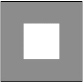

1.  创建新的样式表`jqm-icon.css`并定义自定义图标样式，如下代码所示：

    ```js
    .ui-icon-square {
      background: #fff;
      background: rgba(0,0,0,.4);
     background-image: url("../../resourcimg/square.png");
    }
    @media only screen and (-webkit-min-device-pixel-ratio: 1.5),
        only screen and (min--moz-device-pixel-ratio: 1.5), 
        only screen and (min-resolution: 240dpi) {
     .ui-icon-square {
     background-image: url("../../resourcimg/square-HD.png");
        background-size: 18px 18px;
      }
    }
    ```

2.  将 CSS 包含在`main.html`的`<head>`部分，如下代码所示：

    ```js
    <link rel="stylesheet" href="http://code.jquery.com/mobile/1.1.1/jquery.mobile-1.1.1.min.css" /> 
    <link rel="stylesheet" href="jqm-icon.css" />

    ```

3.  使用带有提交按钮的自定义图标和以下不同主题。同时添加默认的`"home"`图标，以进行比较。

    ```js
    <div data-role="content">
      <h3>Default Icon with text</h3>	
      <input type="submit" data-inline="true" value="Home" data-icon="home" data-theme="a"/>
      <h3>Custom Icon with text</h3>
     <input type="submit" data-inline="true" value="Square" data-icon="square" data-theme="a"/>
      <h3>Default Icon without text</h3>	
      <input type="submit" data-inline="true" data-iconpos="notext" data-icon="home" data-theme="a"/>
      <h3>Custom Icon without text</h3>
     <input type="submit" data-inline="true" data-iconpos="notext" data-icon="square" data-theme="a"/>
    </div>
    ```

## 它是如何工作的。。。

创建一个`jqm-icon.css`样式表，并在其中添加一个新的图标类`ui-icon-square`。指定`background-image`属性并将其指向要使用的图像文件。指定图标的`background`颜色，并指定不透明度的**图标盘**的背景色，如图所示。这里，前缀文本**ui 图标**向按钮插件指示这是一个自定义图标，这将生成一个`square`类。现在可以在按钮中使用`data-icon="square"`属性，框架将获取并显示按钮上的`square`图标。

创建`main.html`，使用输入标签添加提交按钮，并使用`data-icon`属性为这些按钮设置图标。首先使用默认的`home`图标和图标，然后使用新添加的自定义`square`图标，带文本和不带文本。要进行详细比较，您可以使用不同的主题样例（“T4”）到“T5”）添加多个按钮。最终结果如下图所示。自定义图标看起来与默认图标一样好。

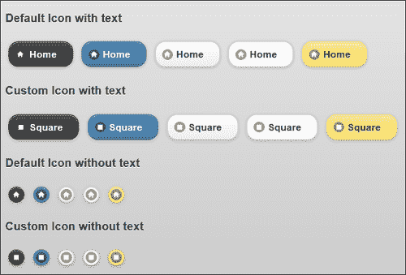

## 还有更多。。。

CSS 中定义的图标`.ui-icon-square`具有标准分辨率。如今，大多数新设备都支持高清分辨率。因此，要使其在高清分辨率下工作，您可以创建一个新的高分辨率图像，`square-HD.png`的 36 x 36 像素大小。在 CSS 中所示的`@media`查询中使用此图像，并指定此高分辨率图标应使用的目标设备分辨率。有关`@media`查询的更多详细信息，请参见[http://jquerymobile.com/demos/1.1.1/docs/buttons/buttons-icons.html](http://jquerymobile.com/demos/1.1.1/docs/buttons/buttons-icons.html) 。

对于标准的分辨率自定义图标，请使用以**PNG-8**格式保存并具有 alpha 透明度的 18 x 18 像素大小的图像。将其 alpha 值设置为`0.4`，背景色设置为`#666`。现在，您的图标将与框架提供的默认图标相似。

### 使用数据内联

默认情况下，按钮被拉伸以适合其容器的宽度。您可以指定属性`data-inline="true"`以紧凑模式显示按钮。您还可以在同一行中相邻添加多个内联按钮。

### 使用数据 iconpos

按钮可以使用`data-icon="home"`属性与图标图像关联。这里，`"home"`是正在使用的图标的名称。`data-iconpos`属性可用于指定按钮中图标的显示位置。可能的值为`top`、`bottom`、`left`和`right`。使用`data-iconpos="notext"`属性完全隐藏文本，并调整按钮大小以仅显示图标。

### 通过按钮使用阴影和角落

默认情况下，按钮使用圆角，可使用布尔属性`data-corners`进行控制。默认情况下，按钮及其图标也会启用阴影。这可以通过使用属性`data-shadow`和`data-iconshadow`来控制。`data-corners`、`data-shadow`和`data-iconshadow`属性都是布尔值，并采用`true`或`false`值。

## 另见

*   *添加自定义图标精灵*配方
*   *替换默认图标精灵*配方

# 添加自定义图标精灵

jQueryMobile 框架使用默认的**图标精灵**，并从中派生所有图标。本食谱向您展示了如何向默认标准图标集添加一个自定义图标精灵，**除**和**等于**图标，一起构成计算器的键。标准图标集已经有了**加**、**减**和**删除**（**乘**的图标。

## 准备好了吗

从`code/04/add-icon-sprite`源文件夹复制此配方的完整代码。您可以使用 URL`http://localhost:8080/04/add-icon-sprite/main.html`启动此代码。

## 怎么做。。。

在此配方中，下图`calc-sprite.png`提供了除法和等于图标：

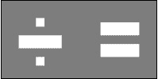

1.  创建一个新的`jqm-sprite.css`样式表，并为从自定义图标精灵派生的新图标定义类`.ui-icon-divide`和`.ui-icon-equals`：

    ```js
    .ui-icon-divide, .ui-icon-equals {
      background: #fff;
      background: rgba(0,0,0,.4);
     background-image: url("../../resourcimg/calc-sprite.png");
      background-repeat: no-repeat;
      -moz-border-radius: 9px;
      -webkit-border-radius: 9px;
      -o-border-radius: 9px;
      border-radius: 9px;
    }
    @media only screen and (-webkit-min-device-pixel-ratio: 1.5), 
        only screen and (min--moz-device-pixel-ratio: 1.5), 
        only screen and (min-resolution: 240dpi) {
     .ui-icon-divide, .ui-icon-equals {
     background-image: url("../../resourcimg/calc-sprite- 
     HD.png");
          -moz-background-size: 36px 18px;
          -o-background-size: 36px 18px;
          -webkit-background-size: 36px 18px;
          background-size: 36px 18px;
      }
    }
    .ui-icon-divide { background-position: -0px 50%; }
    .ui-icon-equals { background-position: -18px 50%; }

    ```

2.  将 CSS 包含在`main.html`的`<head>`部分，如下代码所示：

    ```js
    <link rel="stylesheet" href="http://code.jquery.com/mobile/1.1.1/jquery.mobile-1.1.1.min.css" /> 
    <link rel="stylesheet" href="jqm-sprite.css" />

    ```

3.  使用来自自定义图标精灵的新图标以及默认图标，如以下代码所示。先显示带文本的按钮：

    ```js
    <div data-role="content">
      <h3>Default and Custom Icons with Text</h3>
      <input type="submit" data-inline="true" value="plus" data-icon="plus" />
      <input type="submit" data-inline="true" value="minus" data-icon="minus" />
      <input type="submit" data-inline="true" value="delete" data-icon="delete" />
     <input type="submit" data-inline="true" value="divide" data-icon="divide" />
     <input type="submit" data-inline="true" value="equals" data-icon="equals" />

    ```

4.  然后显示无文本按钮进行比较：

    ```js
    <h3>Default and Custom Icons without Text</h3>
      <input type="submit" data-inline="true" data-iconpos="notext" data-icon="plus" />
      <input type="submit" data-inline="true" data-iconpos="notext" data-icon="minus" />
      <input type="submit" data-inline="true" data-iconpos="notext" data-icon="delete" />
     <input type="submit" data-inline="true" data-iconpos="notext" data-icon="divide" />
     <input type="submit" data-inline="true" data-iconpos="notext" data-icon="equals" />
    </div>
    ```

## 它是如何工作的。。。

创建一个样式表`jqm-sprite.css`并在其中添加新的图标类`.ui-icon-divide`和`.ui-icon-equals`。指定`background-image`属性并将其指向要用作图标精灵的图像文件。接下来指定图标的`background`颜色和**图标光盘**的不透明度，如图所示。同时为图标指定`border-radius`或`9px`。添加了供应商前缀，以确保在各种浏览器平台上都能正常工作。最后，定义图标精灵中每个新图标的位置，如 CSS 文件的最后两行所示。添加`@media`查询，指定图标应使用的目标设备分辨率；这在本章前面的*中已经解释过，在*按钮配方中使用自定义图标。

这里，前缀文本**ui 图标**向按钮插件指示这些是自定义图标，这将生成没有前缀文本的相应类。您现在可以使用属性`data-icon="divide"`或`data-icon="equals"`在按钮上使用新图标，框架将获取并显示正确的自定义图标。

在`main.html`中，通过使用输入标签添加提交按钮，创建简单计算器的按钮。使用`data-icon`属性为这些按钮设置图标，如图所示。显示带文本和不带文本的按钮以进行比较。这里，**加**、**减**和**删除**图标来自默认图标精灵。自定义图标精灵贡献**除**和**等于**图标。屏幕显示如下图所示：

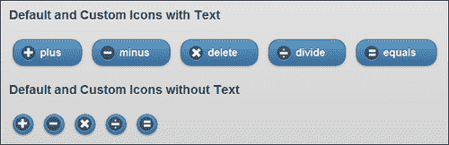

## 还有更多。。。

要创建图标精灵，请使用高度为`18px`的 PNG 图像。总宽度是`18px`乘以精灵中图标数量的倍数。默认图标精灵使用阿尔法值`0.4`和背景色`#666`。在自定义精灵中使用相同的图标可以与默认图标保持一致的外观。将图像保存为具有 alpha 透明度的**PNG-8**格式。

### 指定无效的图标名称

在代码中，如果您指定了一个无效的图标名，比如`data-icon="random"`，框架会在其前面加上文本`.ui-icon-`，并尝试在样式表中查找该类。如果未解析为有效图标，框架现在将从默认图标精灵中拾取第一个图标，并显示相同的图标。默认精灵中的第一个图标是`plus`图标，用于无法解析图标名称的所有位置。

## 另见

*   *替换默认图标精灵*配方
*   *使用按钮*配方中的自定义图标

# 替换默认图标精灵

本食谱向展示了如何替换 jQuery Mobile 提供的默认图标精灵，并使用自己的图标精灵。这里使用的自定义图标精灵包含形成骰子六个面的图标。

## 准备好了吗

从`code/04/replace-icon-sprite`源文件夹复制此配方的完整代码。您可以使用 URL`http://localhost:8080/04/replace-icon-sprite/main.html`启动此代码。

## 怎么做。。。

在这个配方中，下图`dice.png`是一个图标精灵，骰子的六个面有六个图标。此图标精灵用于替换默认图标精灵。


1.  创建一个新的样式表`jqm-sprite.css`并重新定义 jQuery Mobile framework 可用的默认`.ui-icon`类。将默认图标类替换为从自定义图标精灵派生的图标的新类，如以下代码所示：

    ```js
    .ui-icon {
      background: #fff;
      background: rgba(0,0,0,.4);
     background-image: url("../../resourcimg/dice.png");
      background-repeat: no-repeat;
      -moz-border-radius: 9px;
      -webkit-border-radius: 9px;
      -o-border-radius: 9px;
      border-radius: 9px;
    }
    @media only screen and (-webkit-min-device-pixel-ratio: 1.5), 
      only screen and (min--moz-device-pixel-ratio: 1.5), 
      only screen and (min-resolution: 240dpi) {
     .ui-icon-one, .ui-icon-two, .ui-icon-three, .ui-icon-four, .ui-icon-five, .ui-icon-six {
     background-image: url("../../resourcimg/dice-HD.png");
          -moz-background-size: 108px 18px;
          -o-background-size: 108px 18px;
          -webkit-background-size: 108px 18px;
          background-size: 108px 18px;
      }
    }
    .ui-icon-one { background-position: -0px 50%; }
    .ui-icon-two { background-position: -18px 50%; }
    .ui-icon-three { background-position: -36px 50%; }
    .ui-icon-four { background-position: -54px 50%; }
    .ui-icon-five{ background-position: -72px 50%; }
    .ui-icon-six{ background-position: -90px 50%; }

    ```

2.  将 CSS 包含在`main.html`的`<head>`部分，如下代码所示：

    ```js
    <link rel="stylesheet" href="http://code.jquery.com/mobile/1.1.1/jquery.mobile-1.1.1.min.css" /> 
    <link rel="stylesheet" href="jqm-sprite.css" />

    ```

3.  使用从替换的图标精灵派生的新图标显示骰子的六个面，如以下代码所示。显示带文本的按钮：

    ```js
    <div data-role="content">
      <input type="submit" data-inline="true" value="one" data-icon="one" />
      <input type="submit" data-inline="true" value="two" data-icon="two" />
      <input type="submit" data-inline="true" value="three" data-icon="three" />
      <input type="submit" data-inline="true" value="four" data-icon="four" />
      <input type="submit" data-inline="true" value="five" data-icon="five" />
      <input type="submit" data-inline="true" value="six" data-icon="six" />
    ```

4.  然后显示无文本按钮进行比较：

    ```js
    <h3>This is how they look without Text</h3>
      <input type="submit" data-inline="true" data-iconpos="notext" data-icon="one" />
      <input type="submit" data-inline="true" data-iconpos="notext" data-icon="two" />
      <input type="submit" data-inline="true" data-iconpos="notext" data-icon="three" />
      <input type="submit" data-inline="true" data-iconpos="notext" data-icon="four" />
      <input type="submit" data-inline="true" data-iconpos="notext" data-icon="five" />
      <input type="submit" data-inline="true" data-iconpos="notext" data-icon="six" />
    </div>
    ```

## 它是如何工作的。。。

创建一个样式表`jqm-sprite.css`并从`jquery.mobile.css`文件中复制`.ui-icon`类的代码片段。将图标精灵的`background-image`URL 更改为指向自定义图标精灵`dice.png`图像。将名称为`.ui-icon-one`的单个图标类添加到`.ui-icon-six`。指定这些图标在图标精灵中的位置。类`.ui-icon`已经为图标指定了`background`颜色。它还为带有所需供应商前缀的图标指定了边界半径`9px`。修改`@media`查询并更新新图标的名称，而不是默认图标，如图所示。

这里，前缀文本**ui 图标**向按钮插件指示这些是自定义图标，这将生成没有前缀文本的相应类。现在，您可以使用属性`data-icon="one"`到`data-icon="six"`在按钮上使用替换的图标，框架将获取并显示正确的自定义图标。

在`main.html`中，通过使用输入标签添加提交按钮，为骰子的六个面创建按钮。使用`data-icon`属性为这些按钮设置图标，如图所示。显示带文本和不带文本的按钮以进行比较。骰子六个面上的按钮现在显示如下屏幕截图所示，先有文本，然后没有文本：

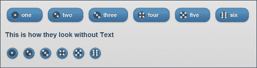

## 还有更多。。。

此配方向您展示了如何用自己的自定义图标精灵替换默认图标精灵。您将无法再使用应用中的默认图标。因此，只有当你有足够的理由这样做，并且你的应用需要自定义所有图标时，才能替换默认图标集。更好的方法是添加自定义精灵和默认精灵，如前一个配方所示。

## 另见

*   *使用按钮*配方中的自定义图标
*   *添加自定义图标精灵*配方

# 在可折叠视图中使用备用图标

**可折叠**是具有`data-role="collapsible"`属性的容器。您可以在可折叠内容中添加标题和其他控件，可折叠块折叠时仅显示标题。您可以单击可折叠文件旁边的**+**图标进行展开。本食谱向您展示了如何使用可折叠图标的替代图标。

## 准备好了吗

从`code/04/collapsible`源文件夹复制此配方的完整代码。您可以使用 URL`http://localhost:8080/04/collapsible/main.html`启动此代码。

## 怎么做。。。

1.  在`main.html`中，使用`data-role="collapsible"`添加两个可折叠块，如下代码所示。默认情况下，第一个可折叠图标使用标准图标（**加**和**减**。

    ```js
    <div data-role="content">
     <div data-role="collapsible" data-collapsed="false"
          data-theme="c" data-content-theme="c">
        <h3>Header of the collapsible element</h3>
        The header uses the default plus/minus icons
      </div>
     <div id="collapser" data-role="collapsible" 
    data-collapsed="false" data-theme="d" data-content-theme="d">
        <h3>Header of the collapsible element</h3>
        The header uses the alternate expand/collapse icons
      </div>
    </div>
    ```

2.  将以下脚本添加到页面的`<head>`部分，以将备用箭头图标设置为第二个可折叠图标：

    ```js
    //on initial load
    $("#main").live("pagebeforeshow", function(event, data) {      
      $("#collapser").find( ".ui-icon-plus" )
        .toggleClass("ui-icon-arrow-r");
      $("#collapser").find( ".ui-icon-minus")
        .toggleClass("ui-icon-arrow-d");
    });
    // handle expand and collapse events below
    $("#main").live("pageshow", function(event, data) {      
     $("#collapser").bind("expand collapse", function(event) {
        var isCollapse = (event.type === "collapse");
        $(this).find( ".ui-icon" )
          .toggleClass( "ui-icon-arrow-d", !isCollapse )
          .toggleClass( "ui-icon-arrow-r", isCollapse );
      });
    });
    ```

## 它是如何工作的。。。

在`main.html`中增加两个可折叠块；加载时，它们有默认的**加**和**减**图标。添加脚本并为`pagebeforeshow`事件创建事件处理程序，以更改第二个可折叠事件的图标（使用`id="collapser"`。使用 jQuery`find()`方法查找类`.ui-icon-plus`（**加**图标），并使用`toggleClass()`方法将其替换为类`.ui-icon-arrow-r`（**右箭头**。同样，将类`.ui-icon-minus`（**减去**图标）替换为类`.ui-icon-arrow-d`（**向下箭头**。将可折叠块上的`data-collapsed="false"`属性设置为以展开模式显示。显示页面时，第二个可折叠图标现在具有箭头图标，而不是默认图标：

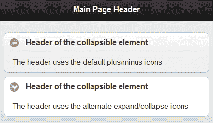

展开或折叠可折叠文件时，框架使用标准图标切换图标。您可以通过为`pageshow`事件添加事件处理程序来覆盖此行为。根据可折叠块上的事件（`expand`或`collapse`），找到`.ui-icon`类并替换为`.ui-icon-arrow-d`或`.ui-icon-arrow-r`类，以显示**下**或**右**箭头。折叠的块现在看起来如下图所示：

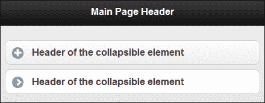

## 还有更多。。。

您可以使用`data-content-theme`属性设置可折叠内容的主题。收割台不受影响。以下代码使用样例`e`设置可折叠内容的主题：

```js
<div data-role="collapsible" data-content-theme="e">
```

### 为可折叠标题设置主题

使用`data-theme`属性和将主题设置为包括标题在内的整个可折叠块。现在，您可以使用`data-content-theme`属性为可折叠内容设置不同的主题。现在看起来好像您单独设置了标题样式。以下代码段将标题主题设置为 swatch`a`，将正文设置为 swatch`e`：

```js
<div data-role="collapsible" 
  data-theme="a" data-content-theme="e" >
```

## 另见

*   *创建嵌套手风琴*配方

# 创建嵌套手风琴

**手风琴**或**可折叠套装**是一组可折叠块，位于带有`data-role="collapsible-set"`的容器中。一次只能展开一个可折叠对象，其他可折叠对象将返回其折叠状态。不能直接嵌套手风琴。本食谱向您展示了如何在一个简单的应用中创建一个**嵌套的手风琴**，该应用显示了可供购买的各种房地产。

## 准备好了吗

从`code/04/nested-accordion`源文件夹复制此配方的完整代码。您可以使用 URL`http://localhost:8080/04/nested-accordion/main.html`启动此代码。

## 怎么做。。。

1.  使用`data-role="collapsible-set"`向`main.html`添加一个嵌套的手风琴，如下代码所示：

    ```js
    <div data-role="content">
      <h4>Our current housing projects</h4>
     <div data-role="collapsible-set" data-theme="d" data-content-
     theme="d"> 
        <div data-role="collapsible" data-collapsed="false">
          <h3>Villas and Row Houses</h3>
     <div data-role="collapsible-set" data-theme="e" data-
     content-theme="e">
            <div data-role="collapsible">
              <h3>ABC Lake View</h3>
              Premium Villas with each villa having its own private 
              beach
            </div>
            <div data-role="collapsible">
              <h3>ABC Nest</h3>
              Serene row houses amidst acres of trees
            </div>
          </div>
        </div>
        <div data-role="collapsible">
          <h3>Apartments</h3>
          <div data-role="collapsible" data-theme="e" data-content-
          theme="e">
            <h3>ABC Sky Rise</h3>
            Luxury 3 bedroom apartments 2 blocks away from ABC Mall
          </div>
        </div>
      </div>
    </div>
    ```

## 它是如何工作的。。。

在`main.html`中，创建一个包含两个可折叠块的可折叠集合。第一个可折叠展示**别墅和排房**，第二个展示**公寓**。您现在可以在**别墅和排屋**可折叠下嵌套另一个可折叠集，如前面的代码片段所示。

添加两个可折叠块，将其嵌套在第一个可折叠块中以列出两个特性。使用`data-theme`和`data-content-theme`属性对嵌套内容设置不同于其父可折叠内容的主题。将显示嵌套的可折叠文件，如以下屏幕截图所示：

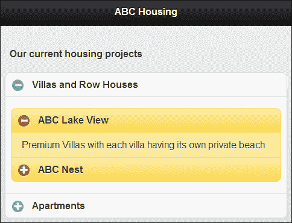

现在要完成代码，请将内容添加到第二个可折叠的**公寓**。在任何时间点，只有一个可折叠的在这个嵌套的手风琴中展开，如下面的屏幕截图所示：

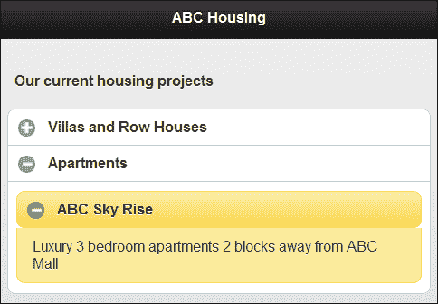

## 还有更多。。。

在可折叠集合中的两个可折叠块之间引入任何其他元素或内容会破坏集合。可折叠块不再同步，当您展开或折叠它们时，它们彼此独立。

### 注

顾名思义，可折叠集只能包含可折叠块。

## 另见

*   在可折叠的配方中使用备用图标的

 *# 创建自定义布局网格

您可以使用**布局网格**在应用中将控件彼此相邻放置。默认情况下，布置格线将创建宽度相等的列单元。此配方向您展示了如何自定义此选项并创建具有不同高度和宽度的单元格。

## 准备好了吗

从`code/04/layoutgrid`源文件夹复制此配方的完整代码。您可以使用 URL`http://localhost:8080/04/layoutgrid/main.html`启动此代码。

## 怎么做。。。

1.  使用`ui-grid`和`ui-block`类向`main.html`添加布局网格，如下代码所示：

    ```js
    <div data-role="content">
     <fieldset class="ui-grid-a">
     <div class="ui-block-a" style="width: 25%">
          <div class="ui-bar ui-bar-e">Col A</div>
        </div>
        <div class="ui-block-b" style="width: 50%">
          <div class="ui-bar ui-bar-e">Col B</div>
        </div>
        <div class="ui-block-c" style="width: 25%">
          <div class="ui-bar ui-bar-e">Col C</div>
        </div>
     <div class="ui-grid-solo">
          <div style="height: 40px" class="ui-bar ui-bar-e">A    Single Cell</div>
        </div>
      </fieldset>
    </div>
    ```

## 它是如何工作的。。。

创建`main.html`并通过添加属性为`class="ui-grid-a"`的`fieldset`元素向其页面添加布局网格。默认情况下，这将创建两个宽度相等的列。但您可以通过添加`ui-block-a`、`ui-block-b`和`ui-block-c`div 来添加三个单元格，如代码所示。每个 div 都有不同的宽度，其中**列 B**具有`50%`宽度，其他两列`25%`宽度各不相同。总宽度总计为 100%，框架会自动将它们排成一行。如果总和超过 100%，那么多余的单元格将移到下一行。

现在在第二行中添加一个类为`ui-grid-solo`的`div`，这将使单元格具有 100%的宽度。您可以使用`style="height:"`属性更改此单元格的高度，如代码所示。`ui-bar`和`ui-bar-e`类使用边框和渐变色为单元格设置样式，并使用样例`e`为其设置主题。网格布局现在如以下屏幕截图所示：

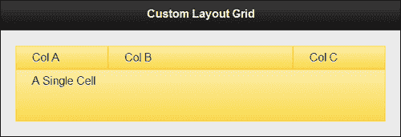

## 还有更多。。。

通过向单个单元格添加`data-theme`属性，可以将其主题设置为`ui-block`与其他单元格不同。要使整行的主题不同于网格中的其他行，必须向该行的所有单元格添加相同的`data-theme`属性。

### 向布局网格单元添加内容

您可以在布局网格的`ui-block`单元中添加任何种类的元素。甚至可以在此单元内添加布局网格。你必须明智地选择你想要的屏幕外观，记住移动设备有限的屏幕大小。

### 向任何容器添加网格布局

您可以通过向任何容器添加`ui-grid`类来向其添加网格。以下代码段将整个页面样式设置为两列网格：

```js
<div id="main" data-role="page" class="ui-grid-a">
```

## 另见

*   *在[第三章](03.html "Chapter 3. Toolbars")*工具栏*中的*配方页脚添加布局网格

# 使用 XML 内容

您可以在应用中显示从各种格式和来源获得的数据。此配方向您展示了如何显示从 XML 文件获取的**学生记录**样本集。

## 准备好了吗

从`code/04/xml-content`源文件夹复制此配方的完整代码。您可以使用 URL`http://localhost:8080/04/xml-content/main.html`启动此代码。

## 怎么做。。。

1.  创建学生节点具有`name`和`age`属性的`student.xml`文件。每个`student`节点都有多个子`course`元素。每个`course`元素都有一个`name`属性和一个子`marks`元素，如下代码所示：

    ```js
    <?xml version="1.0" encoding="utf-8" ?>
    <students>
     <student name="Alex" age="22">
        <course name="HTML5">
          <marks>89</marks>
        </course>
        <course name="CSS3">
          <marks>88</marks>      
        </course>
        <course name="JavaScript">
          <marks>80</marks>      
        </course>
      </student>
      . . . . 
    </students>
    ```

2.  创建`main.html`文件并添加一个隐藏的`div`容器。您可以将 XML 数据读入此`div`，然后格式化并显示：

    ```js
    <div id="content" data-role="content" data-theme="b">
      <div id="hiddendiv" hidden="true">hi</div>
    </div>
    ```

3.  在`main.html`的`<head>`部分包含以下 JavaScript 代码，加载 XML 文件，格式化数据，然后显示：

    ```js
    $("#main").live("pageinit", function(event) {
      var str="";
     $("#hiddendiv").load("student.xml", function() {
        $("#hiddendiv").find("student").each(function() {
          str += "<div data-role='collapsible' data-theme='d'
            data-content-theme='d'>";
          str += "<h3>" + $(this).attr("name") + ", "
              + $(this).attr("age") +" years</h3>";
          str += "<ul data-role='listview'>";
          var i=0;
          $(this).find("course").each(function() {
            str += "<li>" + $(this).attr("name") + " : " 
                + $(this).children("marks").html() + "</li>";
          });
          str += "</ul></div>";
        });
     $("#content").html(str).trigger("create");
      });
    });
    ```

## 它是如何工作的。。。

在`main.html`中，添加一个带有`id="hiddendiv"`的`div`容器，并通过设置属性`hidden="true"`将其隐藏。为`pageinit`事件创建事件处理程序，以便在页面初始化并在内存中可用时处理 XML 数据的加载。使用 jQuery Ajax`load()`方法将 XML 数据加载到`hiddendiv`中。成功加载后，使用 jQuery`find()`方法查找每个`student`节点。对于每个`student`，通过创建一个可折叠文件（使用`data-role="collapsible"`）生成 HTML 代码。将可折叠标题设置为学生的`name`和`age`。您可以使用 jQuery`attr()`方法从`student`节点的属性中获取这些值。接下来，在`student`节点中找到每一个课程，获得`course``name`和`marks`。使用`children()`调用读取`marks`值，该调用提取`course`节点的第一个子元素。`course`元素被添加到无序列表中（使用`data-role="listview"`）。

构建 HTML 内容后，将其设置为`"#content"`页面内容 div，然后触发`"create"`方法，让 jQueryMobile 框架发挥其魔力并生成增强控件，如以下屏幕截图所示：

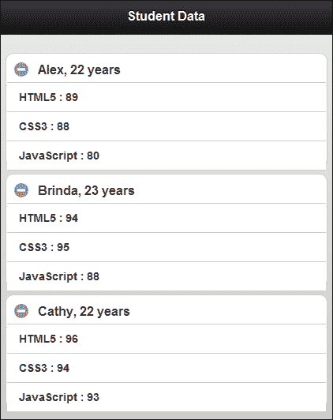

## 还有更多。。。

这个方法向您展示了如何使用 Ajax 从位于同一文件夹中的 XML 文件中读取内容。您还可以向服务器发送 Ajax 请求，并获取此 XML 作为响应。jQuery 库有一整套选择器和操纵器，您可以使用它们来读写 XML 数据。访问[http://docs.jquery.com](http://docs.jquery.com) 阅读更多。

### 注

XML 结构需要结束标记，这使得它非常庞大。尽可能多地使用属性，而不是子节点，从而使 XML 尽可能轻。您还可以使用诸如*gzip*之类的算法来压缩 XML。

### 使用本机浏览器呈现 XML

几乎所有的浏览器都知道如何直接呈现和显示 XML 数据。如果 XML 内容具有关联的样式表，则还可以对其进行格式化和样式设置。在 jQueryMobile 应用中，当您可以使用锚链接上的`target`属性打开另一个页面中的内容时，您可以利用此功能，如下代码所示：

```js
<a href="student.xml" target="student" data-role="button">Open Student details</a>
```

## 另见

*   使用 JSON 内容的*配方*

# 使用 JSON 内容

**JSON**代表**JavaScript 对象表示法**。它是一种轻量级数据交换格式，非常易于使用。此配方向您展示如何从 JSON 文件显示**贵金属**的价格。

## 准备好了吗

从`code/04/json-content`源文件夹复制此配方的完整代码。您可以使用 URL`http://localhost:8080/04/json-content/main.html`启动此代码。

## 怎么做。。。

1.  创建包含五种贵金属数组的`precious.json`文件。名称、符号、日内`open`、`close`、`high`、`low`价格也可提供，如下代码所示：

    ```js
    [
      {
        "name": "Gold",
        "symbol": "Au",
        "price": { "open": 1642.46, "close": 1682.42, "high": 1699.66, "low": 1638.51 }
      },
      {
        "name": "Silver",
        "symbol": "Ag",
        "price": { "open": 31.24, "close": 33.11, "high": 33.65, "low": 31.21 }
      },
      {
        "name": "Platinum",
        "symbol": "Pt",
        "price": { "open": 1621.15, "close": 1623.87, "high": 1624.45, "low": 1620.98 }
      },
      {
        "name": "Paladium",
        "symbol": "Pd",
        "price": { "open": 656.05, "close": 657.35, "high": 657.75, "low": 655.25 }
      },
      {
        "name": "Rhodium",
        "symbol": "Rh",
        "price": { "open": 1434.38, "close": 1434.68, "high": 1434.98, "low": 1434.12 }
      }
    ]
    ```

2.  创建`main.html`并添加一个带`id="preciousdata"`的空`div`。您可以在此处读取 JSON 文件、格式并显示数据：

    ```js
    <div id="content" data-role="content" data-theme="b">
      <div id="preciousdata"></div>
    </div>
    ```

3.  在`main.html`的`<head>`部分包含以下 JavaScript 代码，以获取并加载 JSON 文件，格式化数据，并在布局网格中显示贵金属价格表：

    ```js
    $("#main").live("pageinit", function(event) {
     $.getJSON("precious.json", function(metal) { 

    ```

4.  接下来，将用于创建布局网格的 HTML 字符串存储在局部变量中：

    ```js
        var blocka = "<div class='ui-block-a' style='width: 40%'>";
        var blockb = "<div class='ui-block-b' style='width: 15%'>";
        var blockc = "<div class='ui-block-c' style='width: 15%'>";
        var blockd = "<div class='ui-block-d' style='width: 15%'>";
        var blocke = "<div class='ui-block-e' style='width: 15%'>";
        var title = "<div class='ui-bar ui-bar-a' style='text-align: right'>";
        var uibarc = "<div class='ui-bar ui-bar-c' style='text-align: right'>";
        var uibare = "<div class='ui-bar ui-bar-e' style='text-align: right'>";
    ```

5.  使用上面定义的局部变量，构建布局网格标题的 HTML 内容：

    ```js
        var str="<div class='ui-grid-d'>";
        str += blocka + title + "Precious Metal (USD)</div></div>";
        str += blockb + title + "Open</div></div>";
        str += blockc + title + "High</div></div>";
        str += blockd + title + "Low</div></div>";
        str += blocke + title + "Close</div></div>";
    ```

6.  现在为每种金属创建 HTML 内容，包括它们的价格详细信息：

    ```js
        for (var i in metal) {
          str += blocka + uibare + metal[i].name 
              + " (" + metal[i].symbol + ")</div></div>";
          str += blockb + uibarc + metal[i].price.open 
              + "</div></div>";
          str += blockc + uibare + metal[i].price.high 
              + "</div></div>";
          str += blockd + uibarc + metal[i].price.low 
              + "</div></div>";
          str += blocke + uibare + metal[i].price.close 
              + "</div></div>";
        }
        str += "</div>";
    ```

7.  最后，将此数据添加到`#preciousdata`div 中，并触发`"create"`方法显示格式化的 JSON 数据：

    ```js
     $("#preciousdata").html(str).trigger("create");
      });
    });
    ```

## 它是如何工作的。。。

在`main.html`中，添加一个带有`id="preciousdata"`的空`div`容器。稍后您可以使用它来显示格式化的 JSON 数据。为`pageinit`事件创建一个事件处理程序，以便在页面初始化并在内存中可用时处理 JSON 数据的加载。使用`$.getJSON()`jQuery 调用使用 GET 请求从服务器获取 JSON 编码的数据。JSON 数据现在在`metal`对象中可用。

在`getJSON`方法的回调函数中，使用`ui-grid-d`类为五列布局网格创建 HTML 内容。五列分别为**贵金属（美元）**、**开盘**、**高盘**、**低盘**和**收盘**。使用`ui-block`类为每个列单元格创建标题行。接下来，循环通过`metal`中的对象，构建列单元格，如图所示。

使用样例`e`和样例`c`交替设置专栏主题。您可以使用 swatch`a`以不同的方式设置标题主题。最后，将生成的 HTML 内容设置为`#preciousdata`div 并触发`create`方法，让 jQuery Mobile 增强布局网格。包含贵金属价格数据的 JSON 现在显示如下屏幕截图所示：

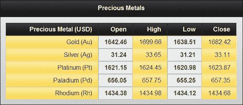

## 还有更多。。。

这个方法向您展示了如何使用`jQuery.getJSON()`方法从服务器获取 JSON 数据。jQuery 库还提供了一个`jQuery.parseJSON()`方法，您可以使用该方法将 JSON 字符串直接解析为 JavaScript 对象，如下代码所示：

```js
var preciousobject= jQuery.parseJSON('{"name":"Gold"}');
```

### 用于数据存储和数据传输的 JSON

JSON 现在非常流行用于存储和传输数据。JSON 是 JavaScript 的一个子集，如本配方所示，使用 JavaScript 读取 JSON 数据非常简单。与相比，JSON 是轻量级的，使用的带宽更少（例如，没有开始和结束标记）。许多面向文档的数据库（如 CouchDB 和 MongoDB）也支持 JSON。

### JSON 解析器

JSON 数据也可以使用 JavaScript`eval()`方法加载。但是，只有当您绝对必须并且非常确定 JSON 文本文件的源时，才可以这样做。使用**JSON 解析器**加载数据总是比较安全的，因为这将只接受有效的 JSON 数据，并防止潜在的恶意代码运行。有关更多详细信息和访问一系列可用 json 解析器的信息，请参阅[www.json.org](http://www.json.org)。jQuery JSON 方法通常是首选方法，因为它们非常方便且使用安全。

### 注

始终使用正确实现的 JSON 解析器读取和写入`.json`文件。避免使用不安全的`eval()`方法。

## 另见

*   使用 XML 内容的*配方**