# 五、表单

在本章中，我们将介绍：

*   表单控件的本机样式
*   禁用文本控件
*   在网格中分组单选按钮
*   自定义复选框组
*   创建动态翻转开关和滑块控件
*   使用选项自动初始化选择菜单
*   验证表单
*   使用 POST 提交表单
*   使用 GET 获取数据
*   创建可访问表单

# 导言

jQueryMobile 框架增强了标准 HTML 表单元素，使其具有触摸友好性，并可跨多个设备和平台工作。表单可以包含多个控件，您可以使用设置了`data-role='controlgroup'`属性的`fieldset`对这些控件进行分组。默认情况下，控件垂直列出。您可以使用`data-type='horizontal'`属性将它们水平排列。表单支持**HTTP GET**、**POST**、等动作。Ajax 尽可能用于表单提交。

# 表单控件的本机样式

jQueryMobile 框架默认增强表单及其控件。此配方向您展示了为表单控件设置本机样式的不同方法，以及如何自动初始化这些控件。

## 准备好了吗

从`code/05/native-style`源文件夹复制此配方的完整代码。此代码可以使用 URL`http://localhost:8080/05/native-style/main.html`启动。

## 怎么做。。。

1.  在`main.html`中，将以下脚本添加到`<head>`部分，以对所有按钮进行本机样式设置：

    ```js
    $(document).bind('mobileinit', function() {
     $.mobile.page.prototype.options.keepNative = 'button';
    });
    ```

2.  向页面内容添加表单，以设置控件上的本机样式：

    ```js
    <form action='#' method='post'>
      <p><label for='button1'>Button 1</label></p>
      <button name='button1'>Button: keepNative configuration</button>
      <p><label for='button2'>Button 2</label></p>
     <button name='button2' data-role='button'>Button: data-role='button'</button>
      <p><label for='button3'>Button 3</label></p>
      <button id='button3' name='button3'>Button: buttonMarkup()</button>
     <script>$('#button3').buttonMarkup(); </script>
      <p><label for='input1'>Input 1</label></p>
      <input type='submit' name='input1' value='Input: default'></input>
      <p><label for='input2'>Input 2</label></p>
      <input type='submit' name='input1' data-role='none' value="Input: data-role='none'"></input><p>
      <a href='#'>Default anchor link</a></p>
     <a href='#' data-role='button'>Anchor: data-role='button'></a>
    </form>
    ```

## 它是如何工作的。。。

在`main.html`中，为`mobileinit`事件添加一个事件处理程序，该事件在应用启动时被触发。这里将页面插件的`keepNative`属性设置为`'button'`。现在，该框架将不会增强按钮控件，而是将其设置为本机样式。现在将`button1`添加到表单中，它将以本地方式进行样式设置。要覆盖此本地样式，请添加`button2`并设置属性`data-role='button'`。类似地，添加`button3`并使用前面代码中所示的脚本对其调用`buttonMarkup()`方法。`button2`和`button3`现在都通过覆盖默认的本机样式得到增强。

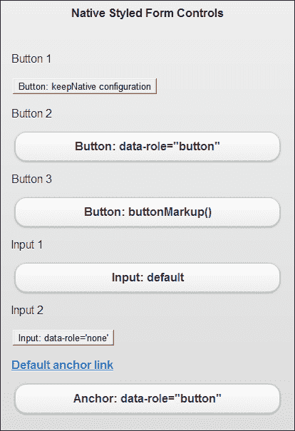

默认情况下，该框架增强了所有其他控件。添加一个输入按钮`input1`，您将看到它得到了增强。对于本机样式的控件，可以使用输入控件`input2`的前面代码中所示的`data-role='none'`属性。

对于锚定链接，默认情况下使用本机样式。您可以使用锚定链接上的`data-role='button'`属性来增强锚定链接。创建的表单如上图所示。

## 还有更多。。。

如前所述，该框架增强了表单控件，使其在所有平台上都具有手指友好性。但这些控件似乎要稍微大一些，以便在其他小容器（如工具栏）中使用。通过在控件上设置`data-mini = 'true'`属性，可以使用控件的**迷你版****。该控件现在的大小稍小，但仍然对手指友好。您可以直接在`controlgroup`上设置此属性，所有子元素都会自动缩小。访问 jQueryMobile 在线文档，查看[中各种控件的比较 http://jquerymobile.com/test/docs/forms/forms-all-compare.html](http://jquerymobile.com/test/docs/forms/forms-all-compare.html) 。**

 **### 设置多个控件以使用本机样式

您可以指定多个控件由**页面插件**本机设置样式。以下代码行以本机方式设置表单中所有按钮、输入控件和选择菜单的样式：

```js
$.mobile.page.prototype.options.keepNative = 'button, input, select';
```

### 数据角色 class='none'属性

基于控件类型，框架通过使用相应的插件来初始化和增强控件。当指定了`data-role='none'`时，框架不会增强该控件，并且该控件会以本机方式设置样式。通过使用`data-theme`属性在控件上设置主题之类的任何操作都将被忽略。

### 注

jquerymobile 提供的增强样式是轻触式的，非常适合移动设备。尽可能避免应用中的本地样式。

# 禁用文本控件

此配方向您展示了在表单中启用和禁用文本控件的不同方法。

## 准备好了吗

从`code/05/text-controls`源文件夹复制此配方的完整代码。此代码可以使用 URL`http://localhost:8080/05/text-controls/main.html`启动。

## 怎么做。。。

1.  在`main.html`中，以表单的形式创建以下文本控件：

    ```js
    <form action='#' method='post'>
      <input type='search' id='searchitem' name='searchitem' autofocus
          placeholder='Enter search text' value='' />
      <input type='text' id='textitem' name='textitem' 
          placeholder='Enter text item' value='' />
      <textarea id='textarea' name='textarea' 
          placeholder='Enter description'></textarea>
     <a href='#' data-role='button' class='ui-disabled'>More Details</a>
    </form>
    ```

2.  在`<head>`部分添加以下脚本以禁用所有控件：

    ```js
      $('#main').live('pageinit', function(event) {
     $('#textitem').prop('disabled', true);
     $('#textarea').textinput('disable');

    ```

3.  然后处理搜索文本控件的`change`事件，启用所有表单控件：

    ```js
       $('#searchitem').bind('change', function(event, ui) {
          var str = $(this).attr('value');
     $('#textitem').prop('disabled', true);
     $('#textarea').textinput('enable').append(str
     + ' is absolutely awesome!');
          $('a').removeClass('ui-disabled');
       });
    });
    ```

## 它是如何工作的。。。

在`main.html`中，添加一个输入为`type='search'`的搜索控件，并添加一个输入为`type='text'`的文本。现在，添加一个空的`textarea`，如前代码所示。添加链接并通过设置属性`class='ui-disabled'`将其禁用。在脚本中，添加一个`pageinit`事件处理程序，该处理程序在页面初始化后被调用。在这里，通过调用`prop('disabled', true)`方法设置其`disabled`属性来禁用文本输入。接下来，通过`textinput('disable')`调用**文本输入插件**上的 disable 方法来禁用`textarea`。现在，当加载应用时，表单上除搜索输入之外的所有控件都将被禁用，如以下屏幕截图所示：

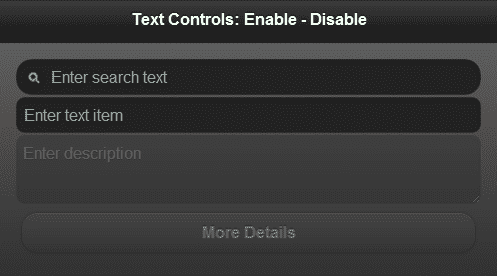

### 注

您不能在已使用`data-role='button'`增强为按钮的锚定链接上使用`disabled`属性。此属性将被忽略。

现在要启用这些控件，请将搜索控件的`change`事件绑定到事件处理程序。在这里，通过调用`prop('disabled', false)`方法启用`textitem`控件。接下来，调用`textarea`上的方法`textinput('enable')`调用其**文本输入插件**上的 enable 方法。调用`textarea`上的`append()`方法向其添加文本。最后，在锚链接上调用 jQuery`removeClass()`方法来删除'`ui-disabled'`类。现在，只要在搜索字段中键入内容，表单控件都将启用，如以下屏幕截图所示：

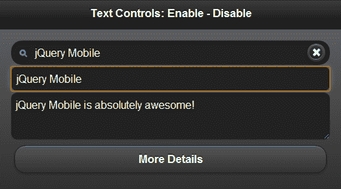

## 还有更多。。。

您还可以通过使用`attr()`和`removeAttr()`jQuery 方法向控件添加`disabled`属性来启用或禁用控件，如下代码所示：

```js
$('#textitem').attr('disabled', 'disabled'); // to disable
$('#textitem').removeAttr('disabled'); // to enable
```

### 文本控件的自动初始化

框架自动增强文本区域和文本输入控件（输入`type='text'`。您还可以使用`data-theme`属性设置文本控件的主题。

# 在网格中分组单选按钮

jQueryMobile 框架允许创建水平或垂直分组的单选按钮。本食谱向您展示了如何在一个简单的座位预订表单中以 3 x 3 的网格对无线电控制进行分组。

## 准备好了吗

从`code/05/radiobutton-grid`源文件夹复制此配方的完整代码。此代码可以使用 URL`http://localhost:8080/05/radiobutton-grid/main.html`启动。

## 怎么做。。。

1.  在`main.html`中，使用 3 x 3 布局网格创建九个无线电控件。这些单选按钮属于同一控制组。

    ```js
    <form action='#' method='post'>
      <fieldset data-role='controlgroup' data-type='horizontal' 
          class='ui-grid-a'>
        <div class='ui-block-a' style='width: 30%'>
            <legend>First Row</legend></div>
        <div class='ui-block-b' style='width: 70%'>
          <input type='radio' name='radio-1' id='radio-11' value='Seat-A1' checked />
          <label for='radio-11'>A-1</label>
          <input type='radio' name='radio-1' id='radio-12' value='Seat-A2' />
          <label for='radio-12'>A-2</label>
          <input type='radio' name='radio-1' id='radio-13' value='Seat-A3'/>
     <label id='l-13' for='radio-13' class='ui-corner-right'>A-3</label>
        </div>
        <div class='ui-block-a' style='width: 30%'>
            <legend>Mid Row</legend></div>
        <div class='ui-block-b' style='width: 70%'>
          <input type='radio' name='radio-1' id='radio-21' value='Seat-B1' />
     <label id='l-21' for='radio-21' class='ui-corner-left'>B-1</label>
          <input type='radio' name='radio-1' id='radio-22' value='Seat-B2' />
          <label for='radio-22'>B-2</label>
          <input type='radio' name='radio-1' id='radio-23' value='Seat-B3'/>
     <label id='l-23' for='radio-23' class='ui-corner-right'>B-3</label>
        </div>
        <div class='ui-block-a' style='width: 30%'>
            <legend>Last Row</legend></div>
          <div class='ui-block-b' style='width: 70%'>
            <input type='radio' name='radio-1' id='radio-31' value='Seat-C1' />
     <label id='l-31' for='radio-31' class='ui-corner-left'>C-1</label>
            <input type='radio' name='radio-1' id='radio-32' value='Seat-C2' />
            <label for='radio-32'>C-2</label>
            <input type='radio' name='radio-1' id='radio-33' value='Seat-C3'/>
            <label for='radio-33'>C-3</label>
        </div>
      </fieldset>
    </form>
    ```

2.  将下面的脚本添加到`<head>`部分，以修复边缘单选按钮的样式：

    ```js
    $('#main').live('pageshow', function(event) {
      $('#l-13').children('span').addClass('ui-corner-right ui-controlgroup-last');
      $('#l-23').children('span').addClass('ui-corner-right ui-controlgroup-last');
      $('#l-21').children('span').addClass('ui-corner-left');
      $('#l-31').children('span').addClass('ui-corner-left');
    });
    ```

## 它是如何工作的。。。

在`main.html`中通过指定`data-role='controlgroup'`和`data-type='horizontal'`添加一个水平无线电控制组。现在将`ui-grid-a`类添加到此`fieldset`容器中，以创建两列布局网格。对于每一行，通过在`div`容器中指定`class='ui-block-a'`在第一列中添加图例，并在第二列中使用`class='ui-block-b'`添加单选按钮。如前一代码所示，添加九个带有适当标签的单选按钮，每行包含三个单选按钮。这将创建一个 3 x 3 单选按钮组的网格。

在前面的代码中，您会发现网格中的第一个和最后一个单选按钮的样式设置正确，但所有其他边缘单选按钮（带有标签 l-13、l-21、l-23 和 l-31）的样式设置不正确。它们有矩形的边而不是角。要解决此问题，请将框架为第一个单选按钮（`class='ui-corner-left'`的标签生成的样式复制到标签 l-21 和 l-31 的内部`span`。同样，将最后一个单选按钮（`class='ui-corner-right ui-controlgroup-last'`的标签框架生成的样式复制到标签 l-13 和 l-23 的内部`span`。单选按钮网格现在已正确设置样式，如下面的屏幕截图所示，您一次只能在整个网格中选择一个单选按钮：

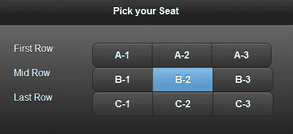

## 还有更多。。。

当框架遇到带有`type='radio'`的`input`控件时，它会使用**checkboxradio 插件**自动将其增强为一个样式化的单选按钮。您可以在初始化期间使用`data-theme`属性设置单选按钮的主题。您可以通过使用`data-role='none'`属性关闭自动初始化并使用本机样式。

## 另见

*   *定制复选框组*配方

# 自定义复选框组

默认的水平分组的复选框控件没有图标，垂直分组的复选框控件不使用活动状态主题。此配方显示如何自定义复选框并添加这些样式。它还向您展示了如何调整布局以处理不同的屏幕大小。您将在此配方中创建一个简单的**博客订阅**表单。

## 准备好了吗

从`code/05/custom-checkbox`源文件夹复制此配方的完整代码。此代码可以使用 URL`http://localhost:8080/05/custom-checkbox/main.html`启动。

## 怎么做。。。

表单首先使用复选框控件的水平和垂直组创建。水平复选框控件通过 JavaScript 在`pageshow`事件处理程序中添加图标进行定制。复选框控件的`change`事件指示复选框`checked`状态是否已更改。`change`事件处理程序用于添加和切换复选框的活动状态。

1.  在`main.html`中，创建一个带有垂直复选框控制组的表单：

    ```js
    <form action='#' method='post'>
      <div data-role='fieldcontain'>
        <fieldset data-role='controlgroup'>
          <legend>Subscribe to:</legend>
          <input type='checkbox' name='posts' id='posts' />
     <label for='posts' id='postslbl'>New Posts</label>
          <input type='checkbox' name='comments' id='comments' />
     <label for='comments' id='commentslbl'>Comments</label>
        </fieldset>
      </div>
    ```

2.  接下来添加两个水平切换集或复选框组：

    ```js
      <div data-role='fieldcontain'>
        <fieldset data-role='controlgroup' data-type='horizontal'>
          <legend>Notify Me:</legend>
          <input type='checkbox' name='notify' id='notify' />
          <label for='notify'>Immediate</label>
          <input type='checkbox' name='digest' id='digest' />
          <label for='digest'>Daily Digest</label>
        </fieldset>
      </div>
      <div data-role='fieldcontain'>
        <fieldset data-role='controlgroup' data-type='horizontal'>
          <legend>Share To:</legend>
          <input type='checkbox' name='twitter' id='twitter' />
     <label for='twitter' id='twitterlbl'>Twitter</label>
          <input type='checkbox' name='facebook' id='facebook' />
     <label for='facebook' id='facebooklbl'>Facebook</label>
        </fieldset>
      </div>
    </form>
    ```

3.  在`<head>`部分添加以下脚本，将图标添加到水平组：

    ```js
    $('#main').live('pageshow', function(event, data) {
      $('#twitterlbl').children('span').append("<span class='ui-icon ui-icon-shadow ui-icon-checkbox-off'>").trigger('create');
      $('#twitterlbl').addClass('ui-btn-icon-left').trigger('refresh');
      $('#facebooklbl').children('span').append("<span class='ui-icon ui-icon-shadow ui-icon-checkbox-off'>").trigger('create');
      $('#facebooklbl').addClass('ui-btn-icon-left').trigger('refresh');
      updatePosts();
      updateComments();
      $('#posts').bind('change', updatePosts);
      $('#comments').bind('change', updateComments);
    });
    ```

4.  接下来，绑定`change`事件来处理控件`checked`状态的变化：

    ```js
    function updatePosts(event, ui) {
     if($('#posts').prop('checked')) {
        $('#postslbl').addClass('ui-btn-active').trigger('refresh');
      } else {
        if($('#postslbl').hasClass('ui-btn-active'))
          $('#postslbl').removeClass('ui-btn-active').trigger('refresh');
      }
    }
    ```

5.  最后，根据垂直复选框的`checked`状态切换激活状态：

    ```js
    function updateComments(event, ui) {
     if($('#comments').prop('checked')) {
        $('#commentslbl').addClass('ui-btn-active').trigger('refresh');
      } else {
        if($('#commentslbl').hasClass('ui-btn-active'))
          $('#commentslbl').removeClass('ui-btn-active').trigger('refresh');
      }
    }
    ```

## 它是如何工作的。。。

在`main.html`中，在**博客订阅**表单中添加三个`fieldset`元素和`data-role='controlgroup'`。在第一个`fieldset`元素中添加一个垂直复选框组，其中包含**帖子**和**评论**的复选框。第二个对照组是一个水平切换集，用于选择博客通知（**即时**和**作为每日摘要**）。第三组复选框也是水平的，可以在**Twitter**和**Facebook**中共享选项。

默认情况下，水平切换集没有图标。您可以对此进行自定义并向其添加图标。为`pageshow`事件创建事件处理程序，并将所需样式添加到第三个水平切换集的标签中。在带有`id='twitterlbl'`和`id='facebooklbl'`的标签上添加一个带有`class='ui-icon ui-icon-shadow ui-icon-checkbox-off'`的内跨距，并在标签上添加`ui-btn-icon-left`类。这将在两个复选框的左侧添加一个图标，类似于垂直复选框控件中可用的图标。将其与其他水平 toggelset 进行比较。

默认情况下，垂直复选框具有图标，选中这些图标时会显示记号标记。垂直复选框不具有`btn-active`样式（与水平复选框不同）。要添加活动按钮样式，请在两个垂直复选框上为`change`事件创建事件处理程序（带有`id='posts'`和`id='comments'`。对于每个复选框，使用`prop('checked')`调用确定控件是否为`checked`，然后添加或删除`ui-btn-active`类以设置垂直复选框的样式，类似于水平复选框。屏幕显示如以下屏幕截图所示：

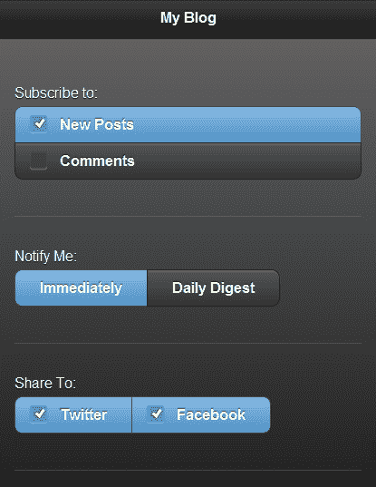

## 还有更多。。。

在前面的代码中，每个复选框组包装在一个容器中，该容器的属性为`data-role='fieldcontain'`。此属性将导致框架根据屏幕大小动态调整控件的布局及其标签的位置。还添加了一条小的水平分隔线以显示分隔。在更宽的屏幕上或使用横向时，显示如以下屏幕截图所示：

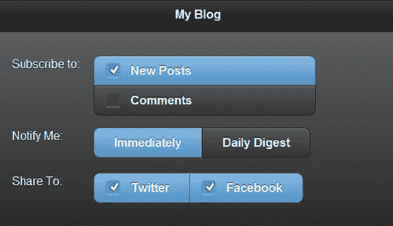

### 复选框控件的自动初始化

当框架遇到带有`type='checkbox'`的`input`控件时，它会使用**checkboxradio 插件**自动将其增强为一个样式化的复选框。您可以在初始化期间使用`data-theme`属性设置复选框的主题。您可以通过使用`data-role='none'`属性关闭自动初始化并使用本机样式。

## 另见

*   网格配方中的*分组单选按钮*

# 创建动态翻转开关和滑块控件

本食谱向您展示了如何使用 JavaScript 将**翻转开关**和**滑块**控件动态添加到页面，并处理它们的事件。在这里，您将创建一个简单的**音量控制**表单，其中有一个音量滑块，当音量非常大时会向用户发出警告。

## 准备好了吗

从`code/05/dynamic-slider`源文件夹复制此配方的完整代码。此代码可以使用 URL`http://localhost:8080/05/dynamic-slider/main.html`启动。

## 怎么做。。。

1.  在`main.html`中，将以下空表单添加到页面内容中：

    ```js
    <form id='volumeForm' action='#' method='post'></form>
    ```

2.  在`<head>`部分添加以下脚本，动态添加翻转开关和滑块：

    ```js
    $('#main').live('pageinit', function(event) {
      var str="<div data-role='fieldcontain' style='width: 50%'><label for='flipswitch'>Volume:</label>"
        + "<select name='flipswitch' id='flipswitch' data-role='slider' data-track-theme='d'>"
        + "<option value='no'>Off</option><option value='yes'>On</option></select></div>"
        + "<div id='volcontainer' data-role='fieldcontain' style='width: 100%'>"
        + "<input type='range' name='volume' id='volume' value='8' min='0' max='15' data-track-theme='b' disabled /></div>";
     $('#volumeForm').html(str).trigger('create');

    ```

3.  处理翻转开关的事件以启用音量滑块控制：

    ```js
      $('#flipswitch').bind('change', function(event, data) {
     if ($(this).slider().val() == 'no') {
          $('#volume').slider('disable');
        } else {
          $('#volume').slider('enable');
        }
      });
    });
    ```

4.  处理音量滑块上的`change`事件，根据其值设置滑块样式：

    ```js
    $('#main').live('pageshow', function(event) {
     $('#volume').bind('change', function(event, data) {
        if ($(this).slider().val() > 10) {
          $('#volcontainer').find('.ui-btn-down-b')
          .removeClass('ui-btn-down-b').addClass('ui-btn-down-e');
        } else {
          $('#volcontainer').find('.ui-btn-down-e')
          .removeClass('ui-btn-down-e').addClass('ui-btn-down-b');
        }
      });
    });
    ```

## 它是如何工作的。。。

将空表单`id='volumeForm'`添加到`main.html`。为`pageinit`事件创建一个事件处理程序，该事件在页面初始化后触发。在这里，为表单生成 HTML 内容。使用带有`data-role='slider'`的选择控件添加一个翻转开关控件（`id='flipswitch'`。此翻转开关将打开和关闭**音量**。使用`type='range'`添加输入控件，创建一个滑块控件（`id='volume'`。将`disabled`属性添加到滑块，以便在启动时禁用控件。将此 HTML 内容设置为空表单，并触发`'create'`方法，让框架初始化并增强控件。当页面加载时，您将看到**音量控制**窗体，其中动态添加了翻转开关和禁用的滑块控制，如以下屏幕截图所示：

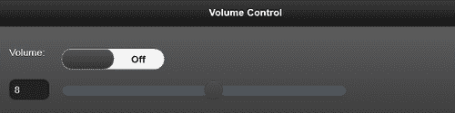

接下来添加代码来处理`#flipswitch`的`change`事件，在事件处理程序中，使用`slider().val()`调用检查翻转开关是**打开**还是**关闭**。根据该值，通过调用`slider('enable')`或`slider('disable')`来启用或禁用滑块音量控制。现在，当您切换翻转开关值时，您将看到滑块被启用或禁用，如以下屏幕截图所示：

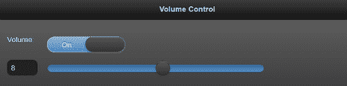

在`pageshow`事件处理程序中绑定音量滑块控件的`change`事件，在这里使用`slider().val()`调用检查滑块的值。如果该值大于**10**的阈值音量，则将滑块设置为主题`'e'`，如果尚未设置样式。如果该值低于**10**的阈值，将主题设置回主题`'b'`。您可以使用 jQuery`find()`方法，将`ui-btn-down-b`类替换为`ui-btn-down-e`类，反之亦然。现在，当您设置高音量时，滑块将变为黄色，如以下屏幕截图所示：

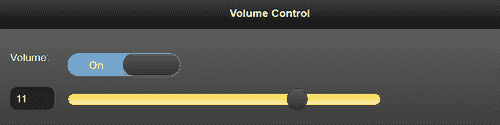

## 还有更多。。。

您可以在初始化期间使用`data-theme`属性设置翻转开关和滑块控件的主题，并使用`data-theme-track`属性设置滑块轨迹的主题。要在初始化后操作这些控件，您必须操作底层本机控件，然后对它们调用`'refresh'`方法。

### 滑块自动初始化

当框架遇到带有`type='range'`的`input`控件时，它会使用**滑块插件**自动将其增强为滑块控件。同样，滑块插件通过`data-role='slider'`将选择控制增强为翻转开关。您可以通过使用`data-role='none'`属性关闭自动初始化并使用本机样式。

# 使用选项自动初始化选择菜单

jQuery Mobile 框架对原生 HTML 选择菜单进行了增强，使其对移动设备的手指友好。此配方向您展示了如何通过使用 JavaScript 设置其控制选项来自动初始化**选择菜单**。

## 准备好了吗

从`code/05/select-menu`源文件夹复制此配方的完整代码。此代码可以使用 URL`http://localhost:8080/05/select-menu/main.html`启动。

## 怎么做。。。

1.  在`main.html`中，添加以下代码创建选择菜单：

    ```js
    <form action='#' method='post'>
      <div data-role='fieldcontain'>
        <label for='selectid' class='select'>Sample Select Menu</label>
        <select name='selectid' id='selectid' multiple data-native-menu='false' data-overlay-theme='e'>
          <option value='Sample Select Menu' data-placeholder='true'>Sample Select Menu</option>
          <option value='opt1'>Option 1</option>
     <option value='disabledopt' disabled>Disabled Option</option>
          <option value='opt2'>Option 2</option>
     <optgroup label='Options in Group1'>
            <option value='grp1'>&nbsp;&nbsp;&nbsp;&nbsp;Group Option1</option>
            <option value='grp2'>&nbsp;&nbsp;&nbsp;&nbsp;Group Option2</option>
          </optgroup>
     <optgroup label='Options in GroupA'>
            <option value='grpA'>&nbsp;&nbsp;&nbsp;&nbsp;Group OptionA</option>
            <option value='grpB'>&nbsp;&nbsp;&nbsp;&nbsp;Group OptionB</option>
          </optgroup>
        </select>
      </div>
    </form>
    ```

2.  将下面的脚本添加到`<head>`部分，以设置选择菜单控制选项：

    ```js
    $('#main').live('pageinit', function(event) {
     $('#selectid').selectmenu({ 
        theme: 'd', 
        inline: false, 
        corners: true,
        icon: 'star',
        iconpos: 'left',
        shadow: true,
        iconshadow: true
      });
    });
    ```

## 它是如何工作的。。。

在`main.html`中，创建一个表单，并将一个 select 控件添加到属性为`multiple`的表单中，以启用多选。设置属性`data-native-menu='false'`表示框架应该增强选择菜单。同时设置`data-overlay-theme='e'`属性，指定选择菜单覆盖的图层应使用样本`e`（黄色）。

添加具有`data-placeholder`属性的第一个选项元素，该属性指示此选项元素文本必须用作选择菜单的标题。现在添加不同的选项元素，如前面的代码所示。`opt1`和`opt2`元素是常规选项项。通过向 option 元素添加属性`disabled`来禁用元素`disableopt`。然后使用前面代码中的`optgroup`元素添加两个选项组（**组 1**和**组 A**）。这些可以包含子选项元素。`选择菜单如下图所示：`

 `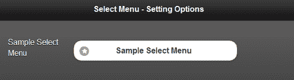

将脚本添加到`pageinit`事件处理程序中，该事件处理程序在页面启动时初始化后被调用。这里，通过将选项值传递给**selectmenu 插件**，设置 selectmenu 控件的初始配置选项。在代码中，设置选择菜单的属性`theme`、`inline`、`corners`、`icon`、`iconpos`、`shadow`和`iconshadow`的值。现在，当您单击“选择菜单”时，样式化菜单选项如以下屏幕截图所示：

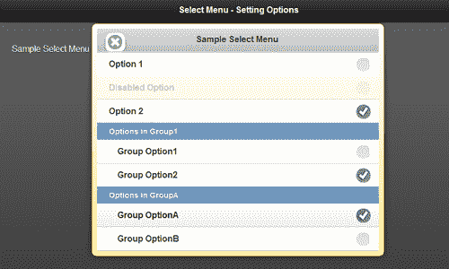

## 还有更多。。。

当框架遇到`select`元素时，它会使用**选择菜单插件**自动将其增强为选择菜单。您可以通过使用`data-role='none'`属性关闭自动初始化并使用本机样式。

### 打开和关闭选择菜单

您可以调用`selectmenu`插件上的`open`和`close`方法，以编程方式打开或关闭选择菜单，如下图所示：

```js
$('#selectid').selectmenu('open'); // open select menu
$('#selectid').selectmenu('close'); // close select menu
```

# 验证表单

在将表单提交到服务器之前对其进行验证可以节省带宽和时间，因为错误可能会被困在客户端本身。因此可以避免服务器请求。在 jQueryMobile 应用中，可以使用 JavaScript 验证表单。本食谱向您展示了如何验证**博客评论表**中的条目。

## 准备好了吗

从`code/05/validate-form`源文件夹复制此配方的完整代码。此代码可以使用 URL`http://localhost:8080/05/validate-form/main.html`启动。

## 怎么做。。。

1.  在`main.html`中，添加以下代码创建表单：

    ```js
    <form id='commentform' action='#' method='post'>
      <div data-role='fieldcontain'>
        <label for='username'>Name</label>
        <input id='username' name='username' type='text' required placeholder='Enter Name' />
      </div>
      <div data-role='fieldcontain'>
        <label for='email'>Email ID</label>
        <input id='email' name='email' type='email' required placeholder='Enter Email' />
      </div>
      <div data-role='fieldcontain'>
        <label for='comments'>Comments</label>
        <textarea id='comments' name='comments' required placeholder='Enter Comments <10-100 chars long>'></textarea>
      </div>
      <div id='errmsg' style='color: #f00'></div>
      <input id='submitid' type='submit' data-transition='pop' value='Submit Comment'/>
    </form>
    ```

2.  添加下面的脚本来验证注释字段：

    ```js
    $('#main').live('pageinit', function(event) {
     $('#commentform').submit(function() {
        var len = $('#comments').val().length;
        if ( len < 10 || len > 100 ) {
          $('#errmsg').text('Invalid comments. Length must be between 10-100 chars').show().fadeOut(5000);
          return false;
        }
        else
          return true;
      });
    });
    ```

## 它是如何工作的。。。

在`main.html`中，添加一个表单（`id='commentform'`，并在表单中添加以下三个字段：**用户名**（`type='text'`）、**电子邮件**（`type='email'`）和**评论**（`textarea`。将`required`属性添加到所有三个字段中，以将其指定为必填项。使用前面代码中所示的`placeholder`属性向用户添加适当的提示。在表单中添加一个空 div（`id='errmsg'`），以显示表单验证时的任何错误消息。

当您加载表单并点击**提交评论**按钮而不输入**名称**字段时，显示以下错误消息：

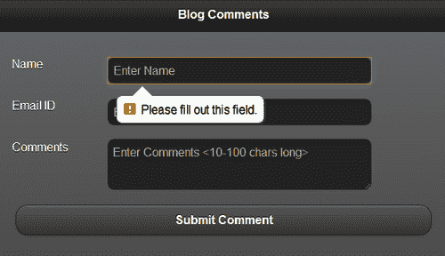

当您在没有有效的**电子邮件 ID**的情况下单击提交按钮时，显示以下错误：

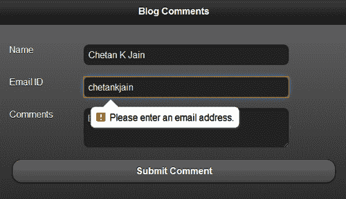

添加`pageinit`事件处理程序，如前一个脚本所示。这将在页面在启动时初始化后调用。这里定义表单的`submit()`方法来验证注释的长度。如果注释的长度无效，则显示错误消息五秒钟，然后消失。现在由于有错误，从`submit`方法返回`false`；此表单将不予提交。

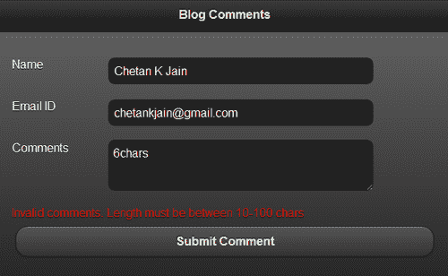

验证成功后，从`submit()`方法返回`true`，将表单成功提交到服务器。

## 还有更多。。。

在此配方中，表单的`action`设置为`#`或与当前 HTML 页面相同的 URL。此表单称为**自提交表单**。在这种情况下，默认响应是表单内容本身。如果表单由 web 服务器提供，则可以自定义生成对帖子的响应。如果您使用的是本书源代码附带的 nodejsweb 服务器，那么您将得到一个定制的成功响应，而不是表单内容。

### 表单中的唯一 ID

在 jQueryMobile 应用中，由于多个页面可以同时驻留在 DOM 中，因此应该确保表单控件的 ID 是唯一的。ID 在整个应用中应该是唯一的，而不仅仅是在单个页面中。如果不遵循此规则，查找和表单行为可能会失败或表现不同。某些浏览器可能仍在一定程度上支持重复 ID，但这并不能保证。

## 另见

*   *使用 POST*配方提交表单
*   使用 GET 方法获取数据的*方法*

# 使用 POST 提交表单

本食谱向您展示了如何使用 Ajax 发布和提交表单，以及如何在不使用 Ajax 的情况下提交同一论坛。上一个配方中使用的**博客评论**表单用于提交。

## 准备好了吗

从`code/05/submit-form`源文件夹复制此配方的完整代码。此代码可以使用 URL`http://localhost:8080/05/submit-form/main.html`启动。要尝试这个方法，您还需要启动简单的 nodejs web 服务器，该服务器与本书的源代码一起提供。使用以下命令启动服务器：

```js
node jqmserver.js

```

## 怎么做。。。

1.  在`main.html`中创建**博客评论**表单，如下代码所示：

    ```js
    <form id='commentform' action='/postComment' data-transition='pop' method='post'>
      <div data-role='fieldcontain'>
        <label for='username'>Name</label>
        <input id='username' name='username' type='text' required placeholder='Enter Name' />
      </div>
      <div data-role='fieldcontain'>
        <label for='email'>Email ID</label>
        <input id='email' name='email' type='email' required placeholder='Enter Email' />
      </div>
      <div data-role='fieldcontain'>
        <label for='comments'>Comments</label>
        <textarea id='comments' name='comments' required placeholder='Enter Comments <10-100 chars long>'></textarea>
      </div>
      <div id='errmsg' style='color: #f00'></div>
      <input id='submitid' type='submit' value='Submit Comment'/>
    </form>
    ```

2.  将以下脚本添加到`<head>`部分以验证注释字段：

    ```js
    $('#main').live('pageinit', function(event) {
     $('#commentform').submit(function() {
        var len = $('#comments').val().length;
        if ( len < 10 || len > 100 ) {
          $('#errmsg').text('Invalid comments. Length must be between 10-100 chars').show().fadeOut(5000);
          return false;
        }
        else
          return true;
      });
    });
    ```

## 它是如何工作的。。。

在`main.html`中，创建**博客评论**表单。将表单`action`设置为`'/postComment'`，并且还指定了属性`data-transition='pop'`。其余的代码和表单验证与前一个配方中的相同，并在此处进行了详细说明。启动应用时，将显示表单，如以下屏幕截图所示：

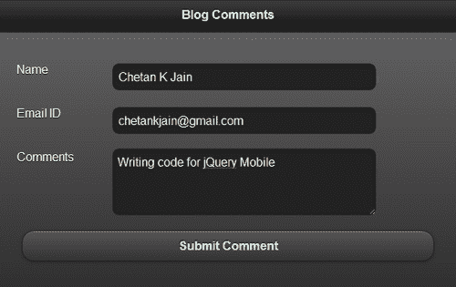

填写表单并点击**提交评论**按钮。如果没有发现错误，则通过 Ajax 提交表单。定制 nodejs web 服务器响应`/postComment`请求，生成以下 HTML 内容作为 mime 类型`'text/html'`的响应：

```js
<div data-role='page' data-theme='a'>
  <div data-role='header'>
    <h1>Comments Added</h1>
  </div>
  <div data-role='content'>
    Hi {User name entered}!
    <p>Your Email ID: {Email ID entered}</p>
    <p>Added your comment: {Comments entered}</p>
    <a href='#' data-role='button' data-rel='back'>Back</a>
  </div>
</div>
```

响应由框架呈现，如以下屏幕截图所示：

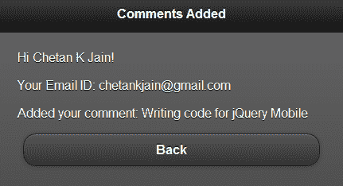

页面过渡平滑，使用`pop`动画。您可以单击**后退**按钮，并导航回原始页面，因为还指定了`data-rel='back'`属性。

## 还有更多。。。

通过为表单元素指定`data-ajax='false'`属性，您可以在不使用 Ajax 的情况下提交此表单。此代码可在与`main.html`相同文件夹中的`non-ajax.html`文件中找到：

```js
<form id='commentform' action='/postComment' method='post' data-ajax='false'>
```

不使用 Ajax 时，响应会触发整个页面刷新。此配方中的服务器响应仅返回页面`div`容器，而不返回带有任何 jQueryMobile 样式表链接的`<head>`元素。此外，响应中缺少对 jQuery 和 jQueryMobile 库的引用。因此，生成的页面如下面的屏幕截图所示。这里的响应页面没有样式，如果您单击**返回**链接，则该页面不起作用。

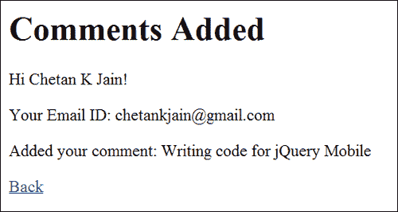

### Ajax 响应

通过 Ajax 的服务器响应替换了本配方中所示的请求表单的内容。您可以使用 DOM 检查器查看此响应。但是，如果查看页面源，则仍会显示原始页面。POST 请求无法添加书签，因为它们在哈希中不包含任何查询参数。对 POST 请求的响应返回与请求相同的 URL，并且不会更新 URL 哈希。

### 其他非 Ajax 表单提交方式

此配方通过设置属性`data-ajax='false'`向您展示了如何在不使用 Ajax 的情况下提交表单。另一种不使用 Ajax 的方法是为表单指定一个`target`属性，如下代码所示：

```js
<form id='commentform' action='/postComment' method='post' target='sometarget'>
```

这适用于 POST 和 GET 服务器请求。

还可以通过使用全局配置在应用中关闭 Ajax，如`mobileinit`事件处理程序中的以下代码所示：

```js
$.mobile.ajaxEnabled = false;
```

## 另见

*   *验证表*配方
*   使用 GET 方法获取数据的*方法*
*   [第 7 章](07.html "Chapter 7. Configurations")*配置*中的*配置 AJAX 启用*配方

# 使用 GET 获取数据

此配方向展示了如何使用 Ajax**获取**请求并从服务器获取数据。在此配方中，服务器将足球分数发回**足球联赛分数**表单的 GET 请求。

## 准备好了吗

从`code/05/get-request`源文件夹复制此配方的完整代码。此代码可以使用 URL`http://localhost:8080/05/get-request/main.html`启动。要尝试这个方法，您需要启动简单的 nodejs web 服务器，该服务器与本书的源代码一起提供。使用以下命令启动服务器：

```js
node jqmserver.js

```

## 怎么做。。。

1.  在`main.html`中，添加以下代码创建表单：

    ```js
    <div id='scores' data-role='fieldcontain'>
     <form id='scoreform' action='/getScores' method='get'>
        The latest scores are now available!
        <input id='submitid' type='submit' name='submitid' data-inline='true' value='Fetch Scores' />
      </form>
    </div>
    ```

2.  将以下脚本添加到`<head>`部分，以使用 Ajax 获取和显示分数：

    ```js
    $('#main').live('pageshow', function(event) {
      $('#scoreform').submit(function() {
     $.get('/getScores').success(showScores).error(errMsg);
        return false; // cancel the default submit
      });
    });
    function showScores(data) { // on success
     $('#scores').html(data).trigger('create');
    }
    function errMsg() { // on error
      $('#scores').html('Unable to fetch scores, try later');
    }
    ```

## 它是如何工作的。。。

在`main.html`中添加一个带有`id='scores'`的`<div>`容器，并设置其属性`data-role='fieldcontain'`。此`<div>`容器将显示分数。在页面中添加一个表单（`id='scoreform'`，并将其`action`设置为`'/getScores'`，将`method`设置为`'get'`。在表单中添加文本为**获取分数**的提交按钮，从服务器获取分数。您可以使用`class='ui-bar ui-bar-e'`向页面添加装饰页脚。加载应用时，将显示以下屏幕：

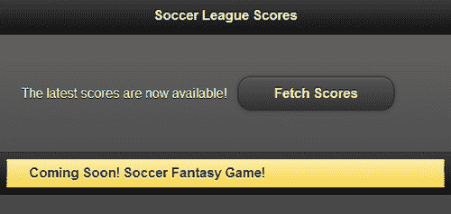

将事件处理程序添加到`pageshow`事件中，如前面的代码所示。当您点击`submit`按钮时，它调用 jQuery`submit()`方法。服务器对默认表单`submit()`的响应将用新内容替换整个页面。要获得部分页面更新，请调用 jQuery`.get()`Ajax 方法从`'/getScores'`服务器 URL 获取数据。然后通过返回`false`取消默认`submit()`方法。`.get()`方法指定了`success`和`error`的回调函数，如前面的代码所示。在成功回调函数`showScores()`中，将`#scores`div 的内容替换为从服务器获取的 HTML 响应。触发`'create'`方法，让 jQueryMobile 框架初始化并增强新添加的内容。任何错误都由`errMsg()`错误处理程序处理，如前面的代码所示。

自定义 nodejs web 服务器通过生成以下 HTML 内容作为 mime 类型为`'text/html'`的响应来响应`/getScores`get 请求：

```js
<ul data-role='listview'>
  <li data-role='list-divider'>Group A</li>
    <li>Team A beat Team B [ 5 - 3 ]</li>
    <li>Team C lost to Team D [ 1 - 2 ]</li>
  <li data-role='list-divider'>Group B</li>
    <li>Team E drew Team F [ 0 - 0 ]</li>
    <li>Team G lost to Team H [ 3 - 4 ]</li>
</ul>
```

现在只有`#scores <div>`容器的内容被此服务器响应替换。页眉和页脚保持不变。结果显示如以下屏幕截图所示：

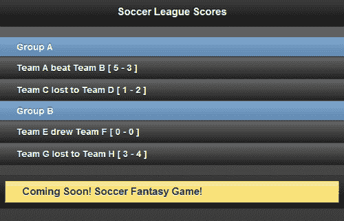

## 还有更多。。。

您可以在不使用 Ajax 的情况下提交表单，方法是为表单元素指定`data-ajax='false'`属性，如下代码所示。不使用 Ajax 时，响应会触发整个页面刷新。因此，请确保在服务器响应中返回正确的 jQueryMobile 页面，否则生成的页面可能会有样式和其他问题。

```js
<form action='/someAction' method='get' data-ajax='false'>
```

### Ajax 响应

通过 Ajax 的服务器响应完全替换了请求表单的内容。您可以使用 DOM 检查器查看响应。但是，如果查看页面源，则仍会显示原始页面。GET 请求可以添加书签，因为它们支持哈希中的查询参数。GET 响应允许更新 URL 哈希。

### 表单提交默认值

您也可以提交一个没有任何动作或方法属性的表单，如下代码所示：

```js
<form>
```

表单将使用动作和方法属性的默认值。方法默认为`'get'`，动作默认为当前页面的相对路径。您可以通过调用`$.mobile.path.get()`方法来访问此路径。

### 注

始终为表单指定`action`和`method`属性。

## 另见

*   *验证表*配方
*   *使用 POST*配方提交表单
*   [第 7 章](07.html "Chapter 7. Configurations")*配置*中的*配置 AJAX 启用*配方

# 创建一个可访问的表单

jQueryMobile 框架对易访问性特性有很好的支持，比如**WAI-ARIA**。这为屏幕阅读器等辅助工具提供了支持。这使您的应用屏幕能够向依赖此类辅助技术的用户读出。此外，语音输入控件现在在一些浏览器上可用，如 Chrome（使用 webkit 引擎）。这些控件接受语音输入。这个方法向您展示了如何生成可访问的表单控件，这些控件接受语音输入并支持屏幕阅读器。

## 准备好了吗

从`code/05/accessible-controls`源文件夹复制此配方的完整代码。您可以使用 URL`http://localhost:8080/05/accessible-controls/main.html`启动此代码。

## 怎么做。。。

1.  在`main.html`中，添加以下代码创建表单：

    ```js
    <form action='#' method='post'>
     <div data-role='fieldcontain' class='ui-hide-label'>
        <input type='text' name='username' id='username' placeholder='Enter Name' speech x-webkit-speech/>
        <label for='username'>Name</label>
      </div>
      <div data-role='fieldcontain'>
     <input type='number' name='age' id='age' placeholder='Enter Age' speech x-webkit-speech/>
        <label for='age' class='ui-hidden-accessible'>Age</label>
      </div>
      <div data-role='fieldcontain'>
        <input type='text' name='city' id='city' placeholder='Enter City' class='custom' speech x-webkit-speech/>
     <label for='city' class='ui-hidden-accessible'>City</label>
      </div>
      <input type='submit' name='submit' id='submit' value='Submit' />
    </form>
    ```

## 它是如何工作的。。。

在`main.html`中增加三个字段，分别为**用户名**（输入`type='text'`）、**年龄**（输入`type='number'`）和**城市**（输入`type='text'`）。将标签与这些字段中的每个相关联，并为每组标签和输入控件添加一个具有属性`data-role='fieldcontain'`的`div`容器。这有助于框架根据平台和设置动态调整布局。`placeholder`属性用于向用户提供适当的提示以供输入。

要启用语音输入，请为每个输入控件添加前面代码中所示的属性`speech`和`x-webkit-speech`。语音输入的支持完全依赖于浏览器的实现，一些浏览器仍然没有实现它们。加载页面时，您将看到以下屏幕截图：

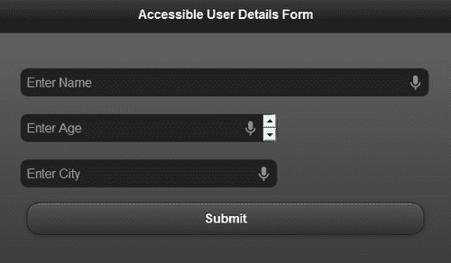

您将在每个输入控件的右角看到一个小麦克风图标。用户可以点击此图标，系统将提示输入值。一旦用户在**中讲话，语音到文本引擎**将语音转换为文本，并在控件中显示输入值文本。虽然不完全准确，语音到文本的技术正在日臻完善。

## 还有更多。。。

如前所述，jQueryMobile 框架对 WAI-ARIA 等可访问性特性有很好的支持。因此，向所有表单元素添加有意义的标签。初始化页面时，框架会自动向屏幕阅读器公开这些标签。如果已经在使用占位符向用户提供提示，则标签可能是多余的。但是，如果您正在寻求构建一个支持可访问性的应用，那么您还应该定义标签。

如果您想使用占位符特性并支持可访问性，那么 jQueryMobile 版提供了一个简单的选项，通过使用表单控件上的样式`'ui-hidden-accessible'`来隐藏标签。您还可以通过向表单字段容器添加样式`'ui-hide-label'`来隐藏标签，如代码所示。现在，标签不会显示在显示屏上，但仍可供屏幕阅读器使用。您可以通过运行您喜爱的屏幕阅读器并访问创建的页面来验证这一点。

### 移动设备流行的语音阅读器

目前市场上有很多语音阅读器，您可以根据自己的平台尝试任何流行的语音阅读器。苹果手机有**画外音**（见[http://www.apple.com/accessibility/iphone/vision.html](http://www.apple.com/accessibility/iphone/vision.html) 、安卓有**对讲**、**Spiel**、**安卓移动无障碍**等应用**中安卓游戏商店**。

### 台式语音阅读器

对于 Chrome 桌面浏览器，**ChromeVox**扩展可从[安装 http://code.google.com/p/google-axs-chrome](http://code.google.com/p/google-axs-chrome) 一旦启用，它将开始为您读取表单控件。您可以验证屏幕阅读器是否也读取了隐藏的标签内容。`**