# 六、列表视图

在本章中，我们将介绍：

*   使用插入和非插入列表
*   创建自定义编号列表
*   使用嵌套列表
*   使用只读嵌套列表
*   格式化列表中的内容
*   使用拆分按钮列表
*   使用图像图标
*   创建自定义搜索筛选器
*   使用 JavaScript 修改列表

# 导言

jQuery Mobile 中的简单列表是使用以下代码创建的：

```js
<ul data-role='listview'>
  <li><a href='link1'>Item 1</a></li>
  <li><a href='link2'>Item 2</a></li>
</ul>
```

前面的代码是一个常规的 HTML 无序列表，您可以在其中添加属性`data-role='listview'`。框架现在对列表进行了增强，对其进行了样式化，并使其具有移动友好性。它为锚元素添加了一个右箭头，当您点击任何列表项时，链接中的页面将加载到 DOM 中，并在可能的情况下使用 AJAX 转换打开。

# 使用插入和非插入列表

**插入列表**是嵌入在容器中的列表（页面或表单或其他列表）。本食谱向您展示了如何创建插入列表和非插入列表。该配方还强调了在与其他表单控件一起使用非插入列表时需要注意的事项。

## 准备好了吗

从`code/06/inset-list`源文件夹复制此配方的完整代码。此代码可以使用 URL`http://localhost:8080/06/inset-list/main.html`启动。

## 怎么做。。。

1.  创建具有三个列表和几个按钮的`main.html`，如下代码所示：

    ```js
    <div data-role='content'>
      <a href='#' data-role=button data-theme='b'>Button 1</a>
     <ul data-role='listview' data-inset='true'>
        <li data-theme='e'><a href='#'>Item 1</a></li>
        <li data-theme='e'><a href='#'>Item 2</a></li>
      </ul>
      <a href='#' data-role=button data-theme='b'>Button 2</a>
     <ul data-role='listview'>
        <li data-theme='e'><a href='#'>Item A</a></li>
        <li data-theme='e'><a href='#'>Item B</a></li>
      </ul>
      <a href='#' data-role=button data-theme='b'>Button 3</a>
     <ul data-role='listview' style='margin: 15px'>
        <li data-theme='e'><a href='#'>Item 3</a></li>
        <li data-theme='e'><a href='#'>Item 4</a></li>
      </ul>
      <a href='#' data-role=button data-theme='b'>Button 4</a>
    </div>
    ```

## 它是如何工作的。。。

在代码中，第一个列表是插入列表，另外两个是非插入列表。您可以通过将属性`data-inset='true'`添加到列表中来创建插入列表。这使列表具有圆角的样式，并且在所有四个边上都有`15px`的良好边距。如果将按钮或任何其他表单控件放置在插入列表旁边，则会自动调整布局。

代码中的下一个列表是非插入列表，没有`data-inset`属性。框架在这个列表中添加了一个`-15px`填充，并将其拉伸以填充整个屏幕宽度。如果将按钮或任何其他表单控件放置在此列表旁边，则由于负数填充，这些控件将相互重叠。此列表有矩形角。

代码中的第三个列表也是非插入列表。但是这里通过使用属性`style='margin: 15px'`来处理控件的重叠。这会在列表中添加`15px`的边距，并否定默认的填充。三个列表显示如下屏幕截图所示：

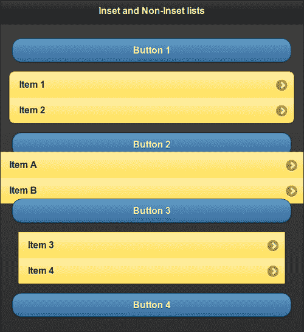

### 注

将非插入列表与其他表单控件一起使用时，请添加额外的页边距，以避免控件重叠。

## 还有更多。。。

您可以将框架配置为默认情况下在应用中使用插入列表。您可以将`listview`插件的`inset`选项设置为`true`并将其绑定到`mobileinit`事件，如下代码所示：

```js
$(document).bind('mobileinit',function(){
  $.mobile.listview.prototype.options.inset = 'true';
});
```

### 设置 listview 主题

您可以使用的`data-theme`属性，将一个主题设置到列表中，如下代码所示。列表使用以下代码中的样例`e`：

```js
<ul data-role='listview' data-theme='e'>
```

### 设置列表项的主题

您可以对每个列表项使用`data-theme`属性，并设置不同的主题。以下代码将样本`e`设置为列表项**项 1**，而列表项**项 2**将使用样本`d`。

```js
<ul data-role='listview' data-theme='e'>
  <li>Item 1</a>
  <li data-theme='d'>Item 2</li>
</ul>
```

# 创建自定义编号列表

默认的**编号列表**在 jQuery Mobile 中使用小数。框架使用 CSS 添加编号。JavaScript 用于不能使用 CSS 的地方。这个食谱向您展示了如何使用 JavaScript 将字母表编号添加到列表中。

## 准备好了吗

从`code/06/custom-numbered-list`源文件夹复制此配方的完整代码。此代码可以使用 URL`http://localhost:8080/06/custom-numbered-list/main.html`启动。

## 怎么做。。。

1.  在`main.html`中，创建有序和无序列表，如下代码所示：

    ```js
    <div data-role='content'>
     <ol data-role='listview' data-theme='e' data-inset='true'>
        <li>Soccer</li>
        <li>Basketball</li>
        <li>Hockey</li>
        <li>Tennis</li>
      </ol>
     <ul id='alphalist' data-role='listview' data-theme='e' data-inset='true'>
        <li>Soccer</li>
        <li>Basketball</li>
        <li>Hockey</li>
        <li>Tennis</li>
      </ul>
    </div>
    ```

2.  添加以下脚本，将字母编号添加到无序列表中：

    ```js
    $('#main').live('pageinit', function(event) {
      var alph = 'a';
      $('#alphalist').find('li').each(function() {
        var str = "<span style='font-weight: normal'>" + alph 
            + '.&nbsp;</span>' + $(this).html();
        $(this).html(str);
        alph = String.fromCharCode(alph.charCodeAt(0)+1);
      });
    });
    ```

## 它是如何工作的。。。

代码中的第一个列表是有序的列表，默认使用十进制数字。下一个带有`id='alphalist'`的列表是无序列表。将给定脚本添加到页面容器或`main.html`的`<head>`部分。

在脚本中，将`pageinit`事件绑定到注入字母编号的函数。在此函数中，调用 jQuery`find('li')`方法获取列表中的所有列表项。使用 jQuery`each()`方法遍历这些项中的每一项。在`each()`的回调函数中，使用`$(this).html()`获取列表项的当前文本，并在该文本前面加上字母（带有`normal`字重）。使用`$(this).html(str)`将此新字符串（`str`设置为列表项。最后使用`charCodeAt()`和`fromCharCode()`JavaScript 方法增加循环中的字母。显示页面时，两个列表现在显示如下屏幕截图所示：

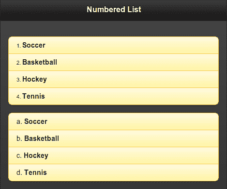

## 还有更多。。。

您可以使用 JavaScript 创建任何类型的编号列表（如罗马数字、小写或大写字母、项目符号等）。但您必须确保使用这些列表处理所有场景（例如，处理嵌套列表的项目编号）。

# 使用嵌套列表

**嵌套列表**是嵌入另一个列表的列表项中的列表。默认情况下，列表项上会显示一个右箭头图标，当您单击它时，框架将打开一个单独的子页面以显示嵌套列表。显示的子页面默认使用主题`b`作为页面标题。该框架可以处理 n 级嵌套。这个食谱向您展示了如何使用嵌套列表，以及如何使用 JavaScript 获取嵌套列表的子页面。

## 准备好了吗

从`code/06/nested-list`源文件夹复制此配方的完整代码。此代码可以使用 URL`http://localhost:8080/06/nested-list/main.html`启动。

## 怎么做。。。

1.  在`main.html`中，添加以下代码以创建作者列表。向某些作者添加带有书名的嵌套列表。

    ```js
    <div data-role='content'>
      <ul data-role='listview' data-theme='b' data-inset='true'>
        <li><a href='#'>H.G. Wells</a></li>
        <li><a href='#'>Rabindranath Tagore</a>
     <ul data-role='listview' data-theme='a' data-inset='true'>
            <li><a href='#'>The Gardener</a></li>
            <li><a href='#'>Gitanjali</a></li>
          </ul>
        </li>
        <li><a href='#'>William Shakespeare</a>
     <ul data-role='listview' data-theme='a' data-inset='true'>
            <li><a href='#'>Merchant of Venice</a></li>
            <li><a href='#'>Romeo and Juliet</a></li>
          </ul>
        </li>
      </ul>
     <div id='nestedlists'></div>
    </div>
    ```

2.  添加以下脚本以获取嵌套列表的子页面：

    ```js
    $('#main').live('pageinit', function(event) {
      var str = '';
     $('ul').listview('childPages').each(function() {
        str = $(this).find("div[class$='ui-title']").html() + ', ' + str;
      });
      $('#nestedlists').html('Books available for authors : ' + str);
    });
    ```

## 它是如何工作的。。。

在代码中，添加作者姓名作为带有锚链接的列表项。为作者**拉宾德拉纳特·泰戈尔**和**威廉·莎士比亚**添加带有书名的嵌套列表。作者**H.G.Wells**没有嵌套列表。

将给定脚本添加到页面容器或`main.html`中的`<head>`标记。在脚本中，将`pageinit`事件绑定到事件处理程序，调用**listview 插件**的`childPages`方法。使用 jQuery`each()`方法遍历子页面数组。在`each()`的回调函数中，使用 jQuery`find()`方法获取子页面的标题文本。查找具有属性`class='ui-title'`的标题 div。将此文本连接到一个字符串，在获取所有作者子页后，将此字符串设置为空`'nestedlists'`div 的内容。这将显示具有嵌套书籍列表的作者列表。作者**H.G.Wells**没有嵌套列表，因此未显示。

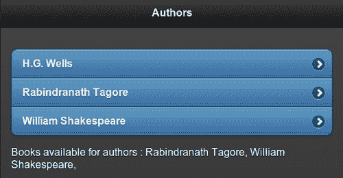

嵌套列表嵌入在列表中列表项`<li>`标记内的锚链`<a>`标记之后。单击此列表项时，将打开子页面，如以下屏幕截图所示。锚定链接文本设置为子页面的标题，默认标题使用主题`b`。

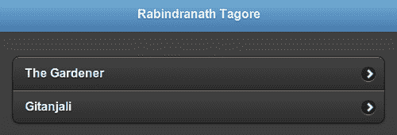

## 还有更多。。。

你会注意到子页面的主题与主页的不同。主页面使用主题`a`作为页面内容和页眉。它使用主题`b`作为列表。子页面标题默认设置为主题`b`。由于嵌套列表使用了`data-theme='a'`属性，因此整个子页面（包括嵌套列表）都以样例`a`为主题。在应用中使用嵌套列表时，这可能并不理想。参考[第 10](10.html "Chapter 10. The Theme Framework")章*主题框架*中的*嵌套列表主题化*配方，了解如何正确设置嵌套列表的主题。

### 为嵌套列表的子页标题设置主题

如本配方所示，默认情况下，嵌套列表子页面的标题设置为 swatch`b`。您可以使用如下代码所示的属性`data-header-theme`来设置子页面的标题主题：

```js
<ul data-role='listview' data-theme='d' data-header-theme='a'>
```

### 配置列表视图的标题主题选项

通过设置`listview`插件的`headerTheme`选项，您可以在应用中配置嵌套列表的默认标题主题。以下代码将其设置为主题`a`并将其绑定到`mobileinit`事件：

```js
$(document).bind('mobileinit',function(){
  $.mobile.listview.prototype.options.headerTheme = 'a';
});
```

## 另见

*   *使用只读嵌套列表*配方
*   [第 10 章](10.html "Chapter 10. The Theme Framework")中的*主题化嵌套列表*配方*主题框架*

# 使用只读嵌套列表

**只读列表**是包含非交互项或其中没有锚定链接的项的列表。与常规项相比，框架设置只读项的样式有所不同。只读项的主题颜色为浅色或浅色，并且它们的大小较小，因为用户不希望点击它们。

此方法向您展示了如何创建只读嵌套列表，以及如何使用**选项**配置列表视图。它还向您展示了如何将嵌套列表显示为插入列表。

## 准备好了吗

从`code/06/read-only-list`源文件夹复制此配方的完整代码。此代码可以使用 URL`http://localhost:8080/06/read-only-list/main.html`启动。

## 怎么做。。。

1.  在`main.html`中，添加以下代码以创建作者列表。向某些作者添加带有书名的嵌套列表。

    ```js
    <div data-role='content'>
      <ul data-role='listview'>
        <li>H.G. Wells</li>
     <li><a href='#'>Mark Twain</a></li>
        <li>Rabindranath Tagore
     <ul data-role='listview'>
            <li>The Gardener</li>
            <li>Gitanjali</li>
          </ul>
        </li>
        <li>William Shakespeare
     <div><ul data-role='listview'>
              <li>Merchant of Venice</li>
              <li>Romeo and Juliet</li>
     </ul></div>
        </li>
      </ul>
    </div>
    ```

2.  将以下脚本添加到页面以配置列表视图选项：

    ```js
    <script>
     $.mobile.listview.prototype.options.theme = 'e';
     $.mobile.listview.prototype.options.headerTheme = 'a';
     $.mobile.listview.prototype.options.inset = true;
    </script>
    ```

## 它是如何工作的。。。

在代码中，添加作者姓名作为列表项，没有任何锚链接。为作者**拉宾德拉纳特·泰戈尔**和**威廉·莎士比亚**添加书籍嵌套列表。作者**H.G.Wells**没有嵌套列表。作家**马克·吐温**有一个锚定链接。列表使用主题`e`，即黄色。没有嵌套列表或锚定链接的项目将以较浅的阴影和较小的字体显示。带有嵌套列表或锚定链接的项目以常规颜色显示，字体更大。

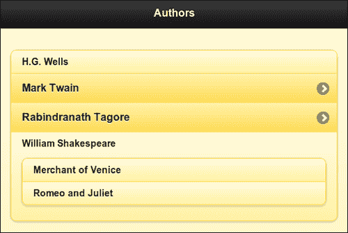

将上一个脚本添加到页面或`main.html`的`<head>`标记中，如代码所示。脚本配置`listview`插件的默认选项。在此配方中，配置了`theme`、`headerTheme`和`inset`选项。使用`headerTheme`选项将子页面标题的主题设置为`a`，如前一代码所示。现在，当您单击列表项**Rabindranath Tagore**时，将打开嵌套列表的子页面。标题主题为`a`的嵌套列表如下图所示：

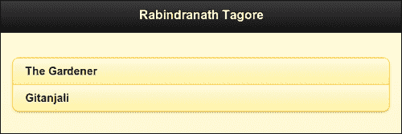

## 还有更多。。。

当您希望将嵌套列表显示为插入列表时，可能存在实例。您可以通过将内部列表包装在一个`<div>`标记中来实现这一点。框架现在不会为嵌套列表创建子页。

### 注

在`listview`插件上调用`childPages`方法不会返回嵌入`<div>`标记的列表。

**威廉·莎士比亚**的书籍列表嵌入在该配方的`<div>`标记中，因此不会创建嵌套列表。

### 注

使用插入嵌套列表将垂直拉伸列表，用户必须滚动页面才能查看所有内容。所以有选择地使用它们。

## 另见

*   *使用嵌套列表*配方
*   [第 10 章](10.html "Chapter 10. The Theme Framework")中的*主题化嵌套列表*配方*主题框架*

# 在列表中格式化内容

本食谱向您展示如何格式化列表项中的文本。它还向您展示了如何使用可折叠项和列表项中的**计数气泡**。

## 准备好了吗

从`code/06/format-content`源文件夹复制此配方的完整代码。此代码可以使用 URL`http://localhost:8080/06/format-content/main.html`启动。

## 怎么做。。。

1.  在`main.html`中，添加以下代码创建运输方式列表：

    ```js
    <div data-role='content'>
      <ul data-role='listview'>
        <li>
     <p class='ui-li-aside' style='font-size: 15px'>
              <strong>High Speed</strong></p>
          <div data-role='collapsible' data-theme='e'>
            <h2>Air</h2>
            <ul data-role='listview'>
              <li>Aeroplane</li><li>Helicopter</li>
            </ul>
          </div>
     <p class='ui-li-count'>2</p>
        </li>
        <li  data-theme='e'>
          <p class='ui-li-aside' style='font-size: 15px'>
              <strong>Moderate Speed</strong></p>
          <div data-role='collapsible' data-theme='e'>
            <h2>Land</h2>
            <ul data-role='listview'>
              <li>Bus</li><li>Car</li><li>Bike</li><li>Train</li>
            </ul>
          </div>
     <p class='ui-li-count'>4</p>
        </li>
        <li>
          <p class='ui-li-aside' style='font-size: 15px'>
              <strong>Slow Speed</strong></p>
          <div data-role='collapsible' data-theme='e'>
            <h2>Water</h2>
            <ul data-role='listview'>
              <li>Ship</li><li>Submarine</li><li>Boat</li>
            </ul>                
          </div>
     <p class='ui-li-count'>3</p>
        </li>
      </ul>
    </div>
    ```

2.  将以下脚本添加到页面以配置列表视图选项：

    ```js
    <script>
     $.mobile.listview.prototype.options.theme = 'e';
     $.mobile.listview.prototype.options.countTheme = 'a';
     $.mobile.listview.prototype.options.inset = true;
    </script>
    ```

## 它是如何工作的。。。

添加三种运输方式作为列表项，如前一代码所示。将带有`data-role='collapsible'`的可折叠块添加到每个列表项中。向每个可折叠块添加标题文本，并创建一个包含不同车辆类型的列表作为其内容。添加样式设置为`class='ui-li-aside'`的字符串。这将创建一个字符串并将其放置在列表项的右上角。最后，添加列出的车辆数量，并使用`class='ui-li-count'`将其样式设置为**计数气泡**。对每个列表项执行此操作。

将代码中显示的脚本添加到页面或`main.html`的`<head>`标签，配置列表选项`theme`、`inset`、`countTheme`的默认值。该列表现在显示如下屏幕截图所示：

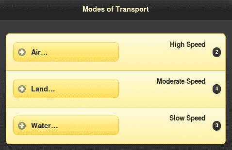

下图显示了展开了一个可折叠块的列表：

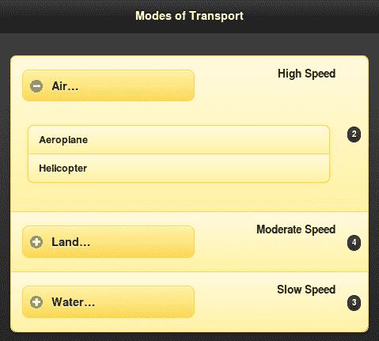

## 还有更多。。。

您可以使用本配方中已经提到的选项`countTheme`为计数气泡设定主题。您也可以在列表中设置`data-count-theme`属性，如下代码所示：

```js
<ul data-role='listview' data-count-theme='a'>
```

### 在列表项中使用表单控件

本食谱向您展示了如何将带有列表的可折叠内容添加到列表项中。您还可以向列表项添加任何表单控件，如以下代码所示。该框架通过在列表项中添加所需的填充和边距来增强表单控件，并使表单控件友好。

```js
<li><input type='text' name='username' placeholder='Enter name'/></li>
```

## 另见

*   *使用拆分按钮列表*配方

# 使用拆分按钮列表

**拆分按钮列表**是为同一列表项提供两种不同动作的列表。这是通过向列表项添加两个锚链接创建的。然后，框架会自动将列表项转换为拆分按钮。添加到第一个链接的任何图像都会缩小为大小为`80 x 80px`的缩略图。第二个链接替换为一个名为**拆分图标**的图标，位于拆分按钮的右角。此配方向您展示了如何创建拆分按钮列表以在列表中显示图像。

## 准备好了吗

从`code/06/split-button-list`源文件夹复制此配方的完整代码。此代码可以使用 URL`http://localhost:8080/06/split-button-list/main.html`启动。

## 怎么做。。。

1.  创建`main.html`作为多页模板应用。在`#main`页面增加拆分按钮列表，如下代码所示：

    ```js
    <div data-role='content'>
     <ul data-role='listview' data-inset='true' data-theme='b' 
     data-split-theme='e' data-split-icon='arrow-d'>
        <li>
     <a href='#viewphoto' data-rel='dialog'>
            
            <h3>Lal Bagh</h3>
            <p>Bangalore, India</p>
          </a>
     <a href='#download' data-rel='dialog'>Lal Bagh, Bangalore</a>
        </li>
        <li>
          <a href='#viewphoto' data-rel='dialog'>
            
            <h3>Peacock</h3>
            <p>Mysore, India</p>
          </a>
          <a href='#download' data-rel='dialog'>Peacock, Mysore</a>
        </li>
        <li>
          <a href='#viewphoto' data-rel='dialog'>
            
            <h3>Ganesha</h3>
            <p>Bangalore, India</p>
          </a>
          <a href='#download' data-rel='dialog'>Ganesha, Bangalore</a>
        </li>
      </ul>
    </div>
    ```

2.  添加点击拆分按钮左侧将打开的`#viewphoto`页面。

    ```js
    <div id='viewphoto' data-role='page' data-theme='e' >
      <div data-role='header' data-theme='e'>
        <h1>Photo View</h1>
      </div>
      <div data-role='content'>
        Showing photo here ...
      </div>
    </div>
    ```

3.  添加点击拆分图标将打开的`#download`页面。

    ```js
    <div id='download' data-role='page' data-theme='e' >
      <div data-role='header' data-theme='e'>
        <h1>Download</h1>
      </div>
      <div data-role='content'>
          Downloading file ...
      </div>
    </div>
    ```

## 它是如何工作的。。。

将列表项添加到`#main`页面的列表中，如前代码所示。每个列表项都有两个链接，通过设置`data-rel='dialog'`属性，两个链接都作为对话框打开。将第一个链接指向`#viewphoto`页面。添加指向照片的图像，并向锚定链接文本添加格式化描述。根据缩略图的大小，可以向图像添加填充，如前一代码所示。

将第二个链接指向`#download`页面。第二个链接将自动转换为拆分图标。默认情况下，拆分图标使用右箭头。您可以使用列表视图上的`data-split-icon`属性进行配置。使用`data-split-theme`属性设置分割图标的主题。拆分按钮列表显示如下屏幕截图所示：

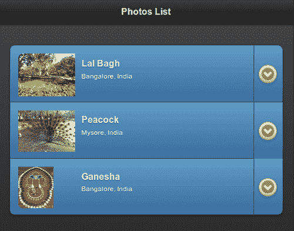

点击照片图像或列表项中的左键打开**照片视图**对话框，如下图所示：

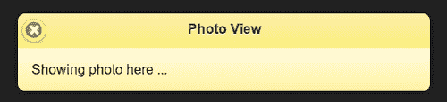

点击拆分图标打开**下载**对话框，如下图所示：

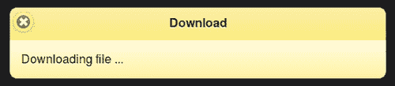

## 还有更多。。。

要在`#viewphoto`对话框中显示照片图像，您必须编写一些 JavaScript 代码来处理`pagechange`事件。这在[第 9 章](09.html "Chapter 9. Methods and Utilities")、*方法和实用程序*中使用 changePage（）更改页面的配方*中有介绍。*

### 使用 listview 选项配置拆分按钮列表

您可以使用`listview`插件的`splitTheme`和`splitIcon`选项配置拆分图标和拆分图标主题的默认值，并将其绑定到`mobileinit`事件。以下代码将星形图标和主题`e`设置为列表视图选项的默认值：

```js
$(document).bind('mobileinit',function(){
  $.mobile.listview.prototype.options.splitIcon = 'star';
  $.mobile.listview.prototype.options.splitTheme = 'e';
});
```

## 另见

*   列表配方中的*格式化内容*
*   *使用图像图标*配方
*   *使用 changePage（）更改[第 9 章](09.html "Chapter 9. Methods and Utilities")中的*配方*方法和实用程序*

# 使用图像图标

jQueryMobile 框架在交互列表项（具有链接的列表项）的右侧添加一个图标。您还可以将图标添加到列表项文本中，框架将此图标调整为适合`40 x 40px`的大小。本食谱向您展示了如何显示带有列表项的图标。

## 准备好了吗

从`code/06/list-icons`源文件夹复制此配方的完整代码。此代码可以使用 URL`http://localhost:8080/06/list-icons/main.html`启动。

## 怎么做。。。

1.  在`main.html`中增加一个列表，列表项如下代码所示：

    ```js
    <div data-role='content'>
      <ul data-role='listview' data-theme='b' data-inset='true'>
        <li data-icon='star'>
          <a href='#'>
     
            <h3 style='margin-left: 25px'>Lal Bagh, Bangalore</h3>
          </a>
        </li>
        <li data-icon='star'>
          <a href='#'>
     
            <h3 style='margin-left: 25px'>Peacock, Mysore</h3>
          </a>
        </li>
        <li data-icon='star'>
          <a href='#'>
     
            <h3 style='margin-left: 25px'>Ganesha, Bangalore</h3>
          </a>
        </li>
      </ul>
    </div>
    ```

## 它是如何工作的。。。

在列表项的锚链接内，向列表中的每个列表项添加图像。将属性`class='ui-li-icon'`设置为此图像元素。这将指示框架将图像样式设置为图标，图像将自动缩小以适合列表项。您可以为文本设置所需的边距，以便在调整图像大小后正确显示文本。该列表显示如下屏幕截图所示：

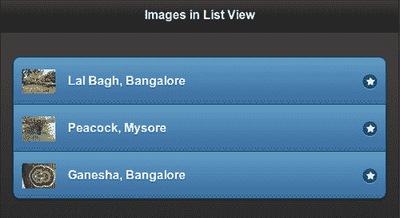

## 还有更多。。。

对于交互式列表项，即带有链接的项，框架默认情况下会在列表项的右侧添加一个右箭头图标。这可以通过使用列表项上的`data-icon`属性进行更改。此配方中的代码使用列表项的`star`图标。

## 另见

*   列表配方中的*格式化内容*
*   *使用拆分按钮列表*配方

# 创建自定义搜索过滤器

当使用**列表搜索筛选器**时，框架将遍历列表项并显示与筛选器文本匹配的项。替代文本也可以与搜索筛选器一起使用。使用替代文本时，将忽略列表项文本。搜索是一般匹配，文本中出现的任何搜索值都会显示在结果中。

此配方向您展示了如何使用搜索过滤器来搜索列表项文本和备选文本。它还向您展示了如何配置搜索过滤器，以及如何实现使用自定义搜索逻辑的自定义搜索回调函数。

## 准备好了吗

从`code/06/custom-search`源文件夹复制此配方的完整代码。此代码可以使用 URL`http://localhost:8080/06/custom-search/main.html`启动。

## 怎么做。。。

1.  在`main.html`中，创建以下移动平台列表。列表项还包含属性`data-filtertext`中的操作系统制造商名称。

    ```js
    <div data-role='content' data-theme='e'>
      <ul id='oslist' data-role='listview'>
     <li data-role='list-divider'>Open Source</li>
        <li data-filtertext='Google'>Android</li>
        <li data-filtertext='HP'>WebOS</li>
        <li data-filtertext='Samsung Intel'>Tizen</li>
        <li data-filtertext='Linux Foundation'>LiMo</li>
        <li data-filtertext='Mozilla'>Boot2Gecko</li>    
     <li data-role='list-divider'>Closed</li>
        <li data-filtertext='Apple'>iOS</li>
        <li data-filtertext='Nokia'>Symbian</li>
        <li data-filtertext='Nokia'>S40</li>
        <li data-filtertext='RIM'>Blackberry OS</li>
        <li data-filtertext='Microsoft'>Windows Phone</li>
        <li data-filtertext='Samsung'>Bada</li>
      </ul>
    </div>
    ```

2.  将以下脚本添加到页面以配置默认列表选项：

    ```js
    $.mobile.listview.prototype.options.theme = 'e';
    $.mobile.listview.prototype.options.inset = true;      
    $.mobile.listview.prototype.options.dividerTheme = 'e';
    $.mobile.listview.prototype.options.filter = true;
    $.mobile.listview.prototype.options.filterTheme = 'e';
    $.mobile.listview.prototype.options.filterPlaceholder = 'Search for ...';
    $.mobile.listview.prototype.options.filterCallback = customFilter;

    ```

3.  以下代码片段包含搜索文本中的列表项文本：

    ```js
    $('#main').live('pageinit', function(event) {
      $('#oslist').find('li').each(function() {
        $(this).attr('data-filtertext', 
            $(this).attr('data-filtertext') + ' ' + $(this).html());
      });
    });
    ```

4.  自定义搜索回调定义如下代码所示：

    ```js
    function customFilter(text, searchValue) {
      var regx='\\b'+searchValue;
     return !(text.match(new RegExp(regx, 'i')));
    }
    ```

## 它是如何工作的。。。

在`main.html`中为各种移动操作系统平台创建一个`id='oslist'.`添加列表项的列表，如代码所示。创建属性为`data-role='list-divider'`的列表项，并将列表项分离为**开源**和**关闭**。使用`data-filtertext`属性将操作系统制造商名称添加为备用搜索文本。

将给定脚本添加到页面或`main.html`的`<head>`标记中。设置各种列表视图配置选项，如`theme='e'`和`inset='true'`。这是一个**只读列表**，列表项以浅黄色阴影显示。使用`dividerTheme='e'`选项设置列表分隔符项目的主题。列表分隔符项的样式由框架设置为较深的阴影。

接下来，添加`filter='true'`和`filterTheme='e'`选项，将搜索过滤器添加到列表中，并使用样例`e`为其设置主题。使用`filterPlaceholder`选项为搜索筛选器文本控件指定自定义文本（默认值为“【T4]”）。最后通过设置选项`filterCallback=customFilter`设置自定义搜索回拨功能。该列表显示如下屏幕截图所示：

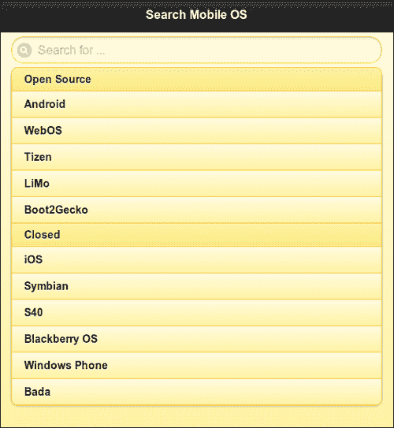

列表中的默认搜索函数与文本中出现的搜索字符串匹配。要覆盖此选项，请定义自定义筛选器回调，如前面的代码所示。函数接受两个参数`text`和`searchValue`。创建一个正则表达式来搜索给定文本中单词开头出现的`searchValue`。将忽略单词之间搜索值的出现。使用`match()`方法将正则表达式与文本匹配。`i`参数使其不区分大小写。

如果`filtertext`属性与列表项一起使用，则默认搜索仅使用此文本并忽略列表项文本。要同时使用列表项文本和过滤器文本，请添加一个`pageinit`事件处理程序，如前面的代码所示。在此函数中，使用 jQuery`find('li).each()`方法查找每个列表项，在`each()`的回调中，获取列表项文本并将其添加到过滤器文本中。这不会对列表项产生任何可见的影响。但是列表项文本现在是过滤器文本的一部分，因此可用于搜索过滤器。因此，搜索**a**将列出**Android**和**iOS**（filtertext 的值为**Apple**。但这不会列出包含**a**的**Symbian**或**Bada**，如以下截图所示：

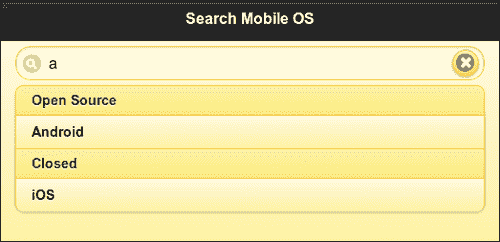

如果您搜索**Bo**它只列出**Boot2Gecko**，如以下截图所示：

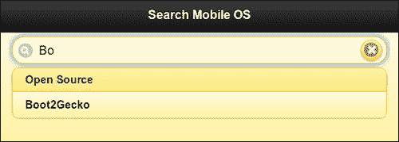

## 还有更多。。。

search callback 函数返回一个布尔值，指示文本是否应该被搜索过滤器隐藏。因此，对于所有匹配的元素，搜索过滤器回调应该返回`false`。不匹配的文本元素返回`true`并被搜索过滤器隐藏。

### 使用数据属性配置列表分隔符主题

配方使用选项`dividerTheme`选项为列表分隔符项设置主题。您也可以使用`data-divider-theme`属性，如下代码所示：

```js
<ul data-role='listview' data-theme='e' data-divider-theme='e'>
```

### 使用数据属性配置列表搜索过滤器

配方显示您如何使用`filter`、`filterTheme`和`filterPlaceholder`选项配置列表视图。也可以使用`data-filter`、`data-filter-theme`和`data-filter-placeholder`属性进行设置，如下代码所示：

```js
<ul data-role='listview' data-filter='true' data-filter-theme='e' data-filter-placeholder='Search for...'>
```

# 使用 JavaScript 修改列表

您可以使用 JavaScript 动态修改列表及其内容。此配方向您展示了如何使用 JavaScript 在只读列表中添加或删除列表项。

## 准备好了吗

从`code/06/scripting-lists`源文件夹复制此配方的完整代码。此代码可以使用 URL`http://localhost:8080/06/scripting-lists/main.html`启动。

## 怎么做。。。

1.  在`main.html`中，添加以下代码在布局网格中创建空列表：

    ```js
    <div data-role='content'>
      <div data-role='fieldcontain'>
        <fieldset class='ui-grid-b'>
          <div class='ui-block-a' style='width: 65%'>
     <ul id='numlist' data-role='listview' data-theme='e' 
     data-inset='true'>
     </ul>
          </div>
          <div class='ui-block-b'>
            <button data-theme='b' id='addBtn'>Add</button>
            <button data-theme='b' id='removeBtn'>Remove</button>
          </div>
        </fieldset>
      </div>
    </div>
    ```

2.  添加以下脚本以动态添加或删除列表项：

    ```js
    var count = 0;
    $('#main').live('pagecreate', function(event) {
     $('#numlist').listview({create: function(event, ui) {
        $('#addBtn').bind('click', function(event, ui) {
          var str = "<li><a href='#'>Item " + (++count) + '</a></li>';
          $('#numlist').append(str);
     $('#numlist').listview('refresh');
        });
        $('#removeBtn').bind('click', function(event, ui) {
          if (--count < 0) {
            count = 0;
            return;
          }
          $('#numlist').find('li').last().remove();
     $('#numlist').listview('refresh');
        });
      }});
    });
    ```

## 它是如何工作的。。。

使用`fieldset`容器上的属性`class='ui-grid-b'`向`main.html`添加两列布局网格。在第一列添加一个带`id='numlist'`的空列表。在第二列添加两个 ID 为`addBtn`和`removeBtn`的按钮。单击这些按钮后，列表项将动态更新为第一列中的空列表。

将给定脚本添加到页面或`main.html`的`<head>`部分。在脚本中，为在页面完全初始化之前触发的`pagecreate`事件创建一个事件处理程序。在这里，为`listview`元素的`create`事件添加一个事件处理程序。创建`listview`元素时，将触发此事件。在其回调函数中，绑定`addBtn`和`removeBtn`按钮的`click`事件，如前面代码所示。

按下`addBtn`键时，会向列表中添加一个列表项。列表项文本保存在内存中，并在添加新元素时递增。按下`removeBtn`键时，获取通过调用 jQuery`find('li').last()`方法添加的最新列表项元素。通过调用`remove()`方法删除最后一个元素。修改后调用**listview 插件**上的`refresh()`方法更新列表。

当应用启动时，显示如以下屏幕截图所示，其中有一个空列表：

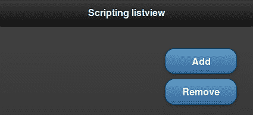

按下**添加**按钮将新的列表项添加到列表中，如下图所示：

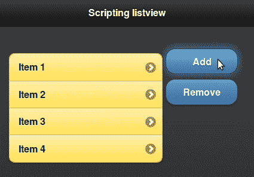

按**删除**按钮删除最近添加的列表项。

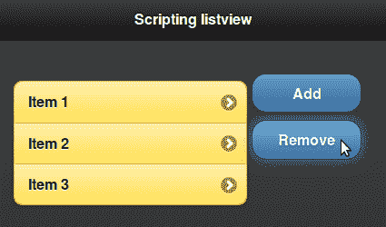

## 还有更多。。。

如本配方所述，在修改后，您必须调用**listview 插件**上的`refresh()`方法。在添加新列表项或删除列表项时，`refresh()`方法触发列表更新，并对列表项应用必要的样式和增强。

```js
$('#numlist').listview('refresh');
```