# 七、配置

在本章中，我们将介绍以下配方：

*   配置活动类
*   配置`ajaxEnabled`
*   配置`autoInitializePage`
*   配置默认转换
*   配置`ignoreContentEnabled`
*   配置页面加载和错误消息
*   配置默认命名空间
*   配置`hashListeningEnabled`和`subPageUrlKey`
*   配置`pushStateEnabled`和`linkBindingEnabled`

# 导言

jquerymobile 框架在文档加载后立即增强文档中的标记和元素。您可以通过在`mobileinit`事件处理程序中设置它们的值来调整用于这些增强功能的默认配置，该事件处理程序在启动文档对象时启动。本章介绍如何使用框架中提供的各种配置。

# 配置活动类

jQueryMobile 框架默认使用 CSS 类`activeBtnClass`为处于活动状态的按钮设置主题`b`的样式。`activeBtnClass`类有一个默认字符串值`ui-btn-active`。为了给活动页面（视图中或转换中的页面）设置样式，框架使用 CSS 类`activePageClass`，该类具有默认字符串值`ui`-`page-active`。这个方法向您展示了如何将框架配置为使用自定义类而不是这些默认类。

## 准备好了吗

从`code/07/active-class`源文件夹复制此配方的完整代码。您可以使用 URL:`http://localhost:8080/07/active-class/main.html`启动此代码。

## 怎么做。。。

1.  在`main.html`中，将以下样式添加到页面的`<head>`标记中，以定义您自己的自定义活动按钮类和活动页面类：

    ```js
    <link rel="stylesheet" 
      href="http://code.jquery.com/mobile
      /1.1.1/jquery.mobile-1.1.1.min.css" />
    <style>
     .ui-custom-btn-active {
        background: #53C584;
        background-image: -webkit-gradient(linear, left top, 
          left bottom, from( #53C584 ), to( #6FD598 ));
        background-image: -webkit-linear-gradient( #53C584 , 
          #6FD598 );
        background-image: -moz-linear-gradient( #53C584 , 
          #6FD598 );
        background-image: -ms-linear-gradient( #53C584 , 
          #6FD598 );
        background-image: -o-linear-gradient( #53C584 , 
          #6FD598 );
        background-image: linear-gradient( #53C584 , 
          #6FD598 );
      }
     .ui-mobile .ui-custom-page-active {
        border: 3px;
        border-style: dotted;
        width: 99%;
        display: block;
        overflow: visible;
      }
    </style>
    ```

2.  在包含 jQueryMobile 脚本之前添加以下脚本：

    ```js
    $(document).bind("mobileinit", function() { 
     $.mobile.activePageClass = "ui-custom-page-active"; 
     $.mobile.activeBtnClass = "ui-custom-btn-active";
    });
    ```

3.  创建带有打开#`page1`链接的#`main`页面，如下所示：

    ```js
    <div id="main" data-role="page" data-theme="e">
      <div data-role="header" data-theme="e">
        <h1>Active Classes</h1>
      </div>
      <div data-role="content">
        <a href="#page1" data-role="button">Open Page 1</a>
      </div>
    </div>
    ```

4.  创建带有链接的#`page1`返回到#`main`页面，如下所示；这是一个多页文档：

    ```js
    <div id="page1" data-role="page" data-theme="e">
      <div data-role="header" data-theme="e">
        <h1>Page 1</h1>
      </div>
      <div data-role="content">
        <a href="#main" data-rel="back" data-role="button">
          Go Back
        </a>
      </div>
    </div>
    ```

## 它是如何工作的。。。

在`main.html`中，添加一个样式标签，定义类`ui-custom-btn-active`在活动按钮上设置不同的渐变背景（绿色阴影）。默认的活动按钮背景为亮蓝色。还添加一个`ui-custom-page-active`类，为页面设置`3px`粗点边框。接下来，在包含对`jquery.mobile.js`的引用之前，在代码中添加给定脚本。在脚本中，为在应用启动时触发的`mobileinit`事件添加事件处理程序。在这里，将`$.mobile.activePageClass`和`$.mobile.activeBtnClass`属性设置为两个新类。最后，添加`#main`和`#page1`页面容器。当您启动应用时，`#main`页面现在显示为虚线边框，如以下屏幕截图所示：

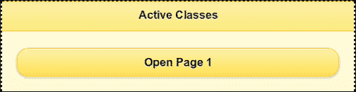

当您点击打开第 1 页按钮时，按钮的激活状态在按下时显示为绿色阴影，如下图所示：

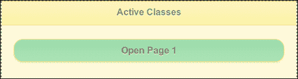

接下来，页面`#page1`打开，它也有虚线边框：


当你点击**返回**按钮时，它也会得到一个绿色的阴影：

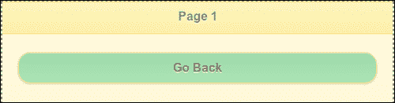

## 还有更多。。。

您可以使用`mobileinit`事件处理程序自定义和配置 jQuery Mobile framework 的默认设置。您必须在包含`jquery.mobile.js`脚本之前添加此自定义脚本，以确保使用您的设置初始化框架。

### 使用 jQuery.extend（）调用

除了直接在`$.mobile`上设置属性外，还可以使用`.extend()`jQuery 调用来扩展`$.mobile`对象，如下所示：

```js
$.extend( $.mobile, {
  $.mobile.activeBtnClass = "ui-custom-btn-active";
});
```

## 另见

*   [第 2 章](02.html "Chapter 2. Pages and Dialogs")、*页面和对话框*、*使用 CSS 创建跳转页面转换*：此配方提供了供应商前缀的定义和概述

# 配置 AJAX 已启用

只要可能，jQuery Mobile 框架就会自动使用 Ajax 处理链接点击和表单提交。这可以使用`$.mobile.ajaxEnabled`属性进行配置，默认情况下，该属性的布尔值为`true`。如果 Ajax 被禁用或不受支持，则使用普通 HTTP 请求并进行完整页面加载。URL 哈希侦听也被禁用。此配方向您展示了如何配置`$.mobile.ajaxEnabled`属性。

## 准备好了吗

从`code/07/ajax-enabled`源文件夹复制此配方的完整代码。您可以使用 URL:`http://localhost:8080/07/ajax-enabled/main.html`启动此代码。

## 怎么做。。。

1.  在`main.html`中，在包含`jquery.mobile.js`之前添加以下脚本：

    ```js
    $(document).bind("mobileinit", function() {
     $.mobile.ajaxEnabled = true;
    });
    ```

2.  创建带有打开`page1.html`：

    ```js
    <div id="main" data-role="page" data-theme="e">
      <div data-role="header" data-theme="a">
        <h1>Ajax Enabled</h1>
      </div>
      <div data-role="content">        
        <p>This is the main page</p>
        <a href="page1.html" data-role="button">
          <p>Open Page 1</p>
        </a>
      </div>
    </div>
    ```

    链接的主页
3.  最后，创建一个链接返回到`main.html`的`page1.html`，如下所示：

    ```js
    <div data-role="page" data-theme="e" data-add-back-
      btn="true">
      <div data-role="header">
        <h1>Page 1</h1>
      </div>
      <div data-role=content>    
        <p>Sub Page Contents</p>
        <a href="main.html" data-role="button">Go back</a>
      </div>
    </div>
    ```

## 它是如何工作的。。。

在代码中添加给定脚本，然后在中添加对`jquery.mobile.js`的引用。在脚本中，为在应用启动时触发的`mobileinit`事件添加事件处理程序。在这里，设置配置`$.mobile.ajaxEnabled=true`。

### 注

因为默认情况下`$.mobile.ajaxEnabled`是`true`，所以您不必在代码中显式设置它。它包含在这个配方中，因为您将在代码的后面将这个值更改为`false`。

添加`#main`页面。如代码所示创建`page1.html`（注意`page1.html`中不存在`<head>`元素）。此时将显示`#main`页面，如下图所示：

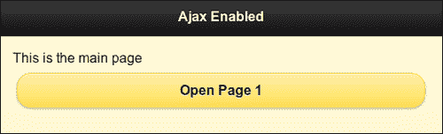

点击**打开页面 1**按钮，打开`page1.html`，如下所示。该页面通过 Ajax 加载，框架增强了控件。

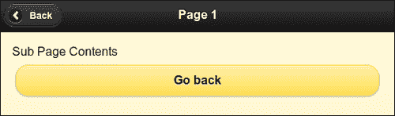

接下来，在`main.html`中将`ajaxEnabled`属性设置为`false`，并重新加载页面。现在打开`page1.html`时，元素没有增强，如下图所示：


## 还有更多。。。

禁用 Ajax 时，将加载整个页面。在`page1.html`中，由于缺少带有 jQueryMobile 框架库链接的`<head>`元素，因此该页面没有任何样式或增强。

# 配置自动初始化页面

当您导航到新页面或在 DOM 中加载页面时，框架初始化页面并使其可见。这由`$.mobile.intializePage`属性控制，默认情况下，该属性的布尔值为`true`。如果设置为`false`，则不显示页面。您必须手动将其设置回`true`才能显示页面。这个食谱告诉你如何做同样的事情。

## 准备好了吗

从`code/07/auto-initialize`源文件夹复制此配方的完整代码。您可以使用 URL:`http://localhost:8080/07/auto-initialize/main.html`启动此代码。

## 怎么做。。。

1.  在`main.html`中，在包含`jquery.mobile.js`之前添加以下脚本：

    ```js
    $(document).bind("mobileinit", function() {
     $.mobile.autoInitializePage = false;
    });
    ```

2.  创建包含以下内容的主页：

    ```js
    <div data-role="content">
      <a href="#" data-role="button">A button</a>
      <script>
     $.mobile.autoInitializePage = true;
      </script>
    </div>
    ```

## 它是如何工作的。。。

在包含对`jquery.mobile.js`的引用之前，将给定的`autoInitializePage`脚本添加到代码中。在脚本中，为在应用启动时触发的`mobileinit`事件添加事件处理程序。在这里，设置配置`$.mobile.autoInitializePage=false`。最后，添加`#main`页面。页面内容将类似于以下屏幕截图：

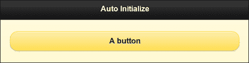

当`$mobile.autoInitializePage`的值被手动设置为`true`时，内容被初始化并可见，如代码所示。您可以对这一行（在页面内容部分）进行注释，然后重新加载页面以发现没有显示任何内容。

## 还有更多。。。

您可以使用此功能在后台工作或从服务器获取后台数据时延迟显示页面。当您手动处理页面更改时，它非常有用。

# 配置默认转换

默认情况下，jQuery 移动框架在使用 Ajax 加载页面时使用淡入过渡。使用 Ajax 打开对话框时，默认使用**pop**转换。此配方向您展示了如何为应用设置不同的默认转换。

## 准备好了吗

从`code/07/default-transitions`源文件夹复制此配方的完整代码。您可以使用 URL:`http://localhost:8080/07/default-transitions/main.hml`启动此代码。

## 怎么做。。。

1.  在`main.html`中，在包含`jquery.mobile.js`之前添加以下脚本：

    ```js
    $(document).bind("mobileinit", function() {
     $.mobile.defaultDialogTransition = "flow";
     $.mobile.defaultPageTransition = "turn";
    });
    ```

2.  创建`#main`页面如下：

    ```js
    <div id="main" data-role="page" data-theme="e">
      <div data-role="header">
        <h1>Configure Transitions</h1>
      </div>
      <div data-role=content>
        <a href="#page1" data-role="button">Open as Page</a>
        <a href="#page1" data-rel="dialog" data-role="button">Open as Dialog</a>
      </div>
    </div>
    ```

3.  创建`#page1`如下；这是一个多页文档：

    ```js
    <div id="page1" data-role="page" data-theme="e" data-add-back-btn="true">
      <div data-role="header">
        <h1>Page 1</h1>
      </div>
      <div data-role=content>
        <p>Page 1 Content</p>
      </div>
    </div>
    ```

## 它是如何工作的。。。

创建`main.html`并在代码中添加给定脚本，然后再包含对`jquery.mobile.js`的引用。在脚本中，为在应用启动时触发的`mobileinit`事件添加一个事件处理程序。在这里，使用`$.mobile.defaultDialogTransition`和`$.mobile.defaultPageTransition`属性设置页面和对话框的默认转换。最后，添加`#main`和`#page1`页面容器，如图所示。

`#main`中有两个按钮。第一个打开`#page1`作为页面，第二个打开`#page1`作为对话框。您将看到默认转换已更改。页面现在使用`turn`转换，对话框使用`flow`转换。

## 还有更多。。。

您还可以将页面和对话框的默认转换设置为`none`。这将只加载页面或对话框，而不使用任何转换：

```js
$.mobile.defaultDialogTransition = "none";
$.mobile.defaultPageTransition = "none";
```

### 使用自定义转换

您可以将框架配置为使用您自己的自定义转换作为默认转换。必须按如下方式设置转换名称：

```js
$.mobile.defaultDialogTransition = "myDialogTransition";
$.mobile.defaultPageTransition = "myPageTransition";
```

### 过渡回退

`fade`转换是默认转换，它使用 2D。所有其他过渡都使用 3D。不支持 3D 转换的旧浏览器和设备将退回使用`fade`。您可以将此默认回退转换配置为`none`，也可以将其设置为您自己的自定义 2D 转换。这可以针对每个单独的 3D 过渡进行，如下所示：

```js
$.mobile.transitionFallbacks.slideout = "none";
$.mobile.transitionFallbacks.flip = "myCustom2DTransition";
```

## 另见

*   [第 2 章](02.html "Chapter 2. Pages and Dialogs")*使用 CSS 创建跳转页面过渡*
*   [第 2 章](02.html "Chapter 2. Pages and Dialogs")*使用 JS 创建幻灯片 n 淡入过渡*

# 配置 ignoreContentEnabled

jQueryMobile 框架自动增强了页面中的控件和标记。要跳过增强标记的某些部分，可以使用`$.mobile.ignoreContentEnabled`配置（默认情况下为`false`。这个食谱告诉你如何做同样的事情。

## 准备好了吗

从`code/07/content-enabled`源文件夹复制此配方的完整代码。您可以使用 URL:`http://localhost:8080/07/content-enabled/main.html`启动此代码。

## 怎么做。。。

1.  在`main.html`中，在包含`jquery.mobile.js`之前添加以下脚本：

    ```js
    $(document).bind("mobileinit", function() {
     $.mobile.ignoreContentEnabled = true;
    });
    ```

2.  创建包含以下内容的`#main`页面：

    ```js
    <div data-role="content">
     <div data-enhance="false">
        <input type="checkbox" name="chkbox1" id="chkbox1" 
          checked />
        <label for="chkbox1">Checkbox</label>
        <input type="radio" name="radiobtn1" id="radiobtn1" 
          checked />
        <label for="radiobtn1">Radio Button</label>
     </div>
      <div>
        <input type="checkbox" name="chkbox2" id="chkbox2" 
          checked />
        <label for="chkbox2">Enhanced Checkbox</label>
        <input type="radio" name="radiobtn2" id="radiobtn2" 
          checked />
        <label for="radiobtn2">Enhanced Radio Button</label>
      </div>
    </div>
    ```

## 它是如何工作的。。。

创建`main.html`并在代码中添加给定脚本，然后包括对`jquery.mobile.js`的引用。在脚本中，为在应用启动时触发的`mobileinit`事件添加事件处理程序。在这里，设置属性`$.mobile.ignoreContentEnabled=true`。在`#main`中，添加两个 div。为每个`div`添加复选框和单选按钮。将属性`data-enhance=false`设置为第一个`div`。现在，添加到这个`div`中的元素没有被框架增强。第二个`div`中的元素会自动增强。页面显示如以下屏幕截图所示：

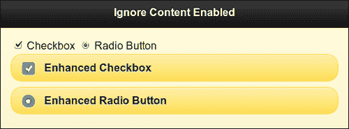

## 还有更多。。。

当您使用`$.mobile.ignoreContentEnabled=true`配置时，它告诉框架避免增强标记的某些部分。这是通过使用`data-enhance="false"`属性完成的，如本配方所示。现在，当框架遇到每个控件或标记时，它首先检查父元素的`data-enhance`属性是否设置为`false`。如果是这样，它将跳过对控件应用样式或任何增强。

### 注

使用`$.mobile.ignoreContentEnabled`和`data-enhance`可能会在增强页面的同时导致性能下降。

# 配置页面加载和错误消息

默认情况下，jQueryMobile 框架在加载新页面时显示主题为`a`且没有任何文本的旋转动画。如果有错误，页面加载超时，显示错误消息`Error Loading Page`，主题为`e`。此配方向您展示了如何更改和自定义页面加载和错误消息。

## 准备好了吗

从 sources`code/07/load-message`文件夹复制此配方的完整代码。要尝试此配方，请使用以下命令启动文件夹代码中可用的简单`nodejs`web 服务器：

```js
node jqmserver.js

```

然后您可以使用 URL:`http://localhost:8080/07/load-message/main.hml`启动代码。

## 怎么做。。。

1.  在`main.html`中，在包含`jquery.mobile.js`之前添加以下脚本：

    ```js
    $(document).bind("mobileinit", function() {
     $.mobile.loadingMessage = "Fetching it...";
     $.mobile.loadingMessageTextVisible = true;
     $.mobile.loadingMessageTheme = "b";
     $.mobile.pageLoadErrorMessage = "Oops, it's missing!";
     $.mobile.pageLoadErrorMessageTheme = "b";
    });
    ```

2.  创建包含以下内容的`#main`页面：

    ```js
    <div data-role="content">
     <a href="/delay" data-role="button">Dummy page</a>
    </div>
    ```

## 它是如何工作的。。。

创建`main.html`，并在包含对`jquery.mobile.js`的引用之前添加给定脚本。在脚本中，为在应用启动时触发的`mobileinit`事件添加事件处理程序。在此，设置默认页面加载消息和错误消息，如代码所示。

在`#main`中，有一个链接试图打开`"/delay"`页面。这是在`nodejs`服务器上的`GET`操作。服务器处理此请求，并在暂停几秒钟后返回错误代码。在此期间，将显示带有文本消息的旋转控件，如以下屏幕截图所示：

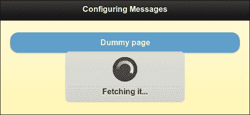

错误响应导致显示以下错误消息：

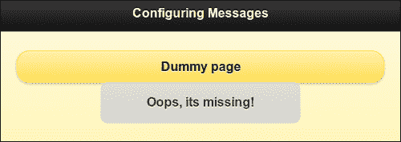

# 配置默认名称空间

这个方法向展示了如何配置 jQuery Mobile 框架，以便为`data-`属性使用自定义名称空间。

## 准备好了吗

从`code/07/namespace`源文件夹复制此配方的完整代码。您可以使用 URL:`http://localhost:8080/07/namespace/main.html`启动此代码。

## 怎么做。。。

1.  在`main.html`中，在包含`jquery.mobile.js`之前添加以下脚本：

    ```js
    $(document).bind("mobileinit", function() {
     $.mobile.ns = "my-";
    });
    ```

2.  在`<head>`标签中添加以下样式：

    ```js
    <link rel="stylesheet" href="http://code.jquery.com/mobile/1.1.1/jquery.mobile-1.1.1.min.css" />
    <style>
     .ui-mobile [data-my-role=page], .ui-mobile [data-my-role=dialog], 
     .ui-page { top: 0; left: 0; width: 100%; min-height: 100%; 
     position: absolute; display: none; border: 0; } 
    </style>
    ```

3.  按如下方式创建主页：

    ```js
    <div id="main" data-my-role="page" data-my-theme="e">
      <div data-my-role="header" data-my-theme="a">
        <h1>Configure Namespace</h1>
      </div>
     <div data-my-role="content"> 
        <p>This is the main page</p>
        <a href="#dialog" data-my-role="button">
          Open Dialog
        </a>
      </div>
    </div>
    ```

4.  创建`#dialog`页面，如下所示；这是一个多页文档：

    ```js
    <div id="dialog" data-my-role="dialog" data-my-theme="e">
      <div data-my-role="header" data-my-theme="a">
        <h1>Dialog</h1>
      </div>
      <div data-my-role="content">
        <p>This is a dialog</p>
     <a href="#" data-my-role="button" data-my-
     rel="back">Go Back</a>
      </div>
    </div>
    ```

## 它是如何工作的。。。

要使用自定义名称空间，您必须覆盖`jquery.mobile.css`文件中的一个特定选择器、`.ui-mobile [data-my-role=page]`和`.ui-mobile [data-my-role=dialog]`选择器。覆盖此样式，如代码所示。使用`data-my-role`表示名称空间设置为`my`。

创建`main.html`，并通过在包含对`jquery.mobile.js`的引用之前添加前面的脚本来设置此配置。在脚本中，为在应用启动时触发的`mobileinit`事件添加事件处理程序。在这里，使用`$.mobile.ns="my-"`配置设置默认名称空间。添加`#main`和`#dialog`页面。

以下屏幕截图显示了通过 DOM 检查器看到的页面：

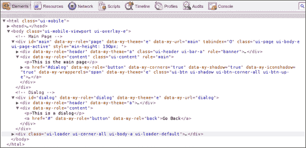

您将注意到代码还使用了`data-my-`属性。您还将观察到框架添加了增强功能，甚至这些增强功能在整个页面中都使用自定义名称空间。

### 注

在自定义名称空间中使用`"my-"`中的尾随连字符。这样更容易阅读增强的代码。

# 配置 hashListeningEnabled 和 subPageUrlKey

当您使用嵌套的`listview`时，jQuery 移动框架会以`pagename.html&ui-page=subpageidentifier`的形式生成一个子页面。框架使用子页面 URL 键`(&ui-page)`前的哈希段进行导航。此配方向您展示了如何使用自定义子页面 URL 键。它还向您展示了如何使用`$.mobile.hashListeningEnabled`配置。

## 准备好了吗

从源文件夹`code/07/sub-page`复制此配方的完整代码。您可以使用 URL:`http://localhost:8080/07/sub-page/main.html`启动此代码。

## 怎么做。。。

1.  在`main.html`中，在包含`jquery.mobile.js`之前添加以下脚本：

    ```js
    $(document).bind("mobileinit", function() {
     $.mobile.subPageUrlKey = "my-page";
     $.mobile.hashListeningEnabled = false; 
    });
    ```

2.  创建内容中包含嵌套列表的`#main`页面，如下所示：

    ```js
    <div data-role="content">
     <ul data-role="listview" data-theme="e">
        <li>Main Page Item 1</li>
        <li>Sub Page Items
     <ul data-role="listview">
            <li>Sub Page Item A</li>
            <li>Sub Page Item B</li>
          </ul>
        </li>
      </ul>
    </div>
    ```

## 它是如何工作的。。。

创建`main.html,`和在代码中添加给定脚本，然后再包括对`jquery.mobile.js`的引用。在脚本中，为在应用启动时触发的`mobileinit`事件添加事件处理程序。在此，设置`$.mobile.subPageUrlKey="my-page"`和`$.mobile.hashListeningEnabled=false`配置。最后，添加带有嵌套列表的`#main`页面，如代码所示。输出将类似于以下屏幕截图：

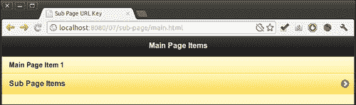

点击**子页面项目**、，打开子页面中的嵌套列表。地址栏显示自定义子页面 URL 键`my-page`，如下图所示：

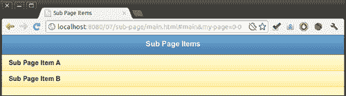

现在，使用浏览器**返回**按钮返回。地址栏中的 URL 会得到更新，但页面不会更改回上一个屏幕，如以下代码所示：

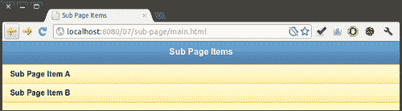

这是，因为`hashListeningEnabled`在启动时配置为`false`。这将防止框架侦听和处理位置散列更改。如果将`hashListeningEnabled`设置为`true`（默认值）并重新加载页面，页面导航将正常工作，主列表将从嵌套列表中再次显示。

### 注

仅当您希望自定义管理哈希更改而不允许框架处理时，才配置`hashListeningEnabled`。

## 另见

*   [第 7 章](07.html "Chapter 7. Configurations")、*配置*、*配置 pushStateEnabled 和链接**绑定 Enabled*

# 配置 pushStateEnabled 和 linkBindingEnabled

当你点击一个链接时，导航发生，URL 散列被更新。该框架允许您在支持`history.replaceState`API 的浏览器中将 URL 哈希替换为完整路径。此配方向您展示了如何使用`$.mobile.pushStateEnabled`配置进行此操作。它还向您展示了如何使用允许框架自动绑定文档中锚链接点击的`$.mobile.linkBindingEnabled`配置。默认情况下，这两个都是`true`。

## 准备好了吗

从 sources`code/07/push-state`文件夹复制此配方的完整代码。您可以使用 URL:`http://localhost:8080/07/push-state/main.html`启动此代码。

## 怎么做。。。

1.  在`main.html`中，在包含`jquery.mobile.js`之前添加以下脚本：

    ```js
    $(document).bind("mobileinit", function() {
     $.mobile.linkBindingEnabled = true;
     $.mobile.pushStateEnabled = false; 
    });
    ```

2.  创建包含以下内容的`#main`页面：

    ```js
    <div data-role="content">
      <a href="page1.html" data-role="button">Go to Page 1</a>
    </div>
    ```

3.  创建`page1.html`如下：

    ```js
    <div id="page1" data-role="page" data-theme="e">
      <div data-role="header">
        <h1>Header of Page 1</h1>
      </div>
      <div data-role="content">
        <a href="#" data-role="button" data-rel="back">Go Back</a>
      </div>
    </div>    
    ```

## 它是如何工作的。。。

创建`main.html`，在包含对`jquery.mobile.js`的引用之前，在代码中添加给定脚本。在脚本中，为在应用启动时触发的`mobileinit`事件添加事件处理程序。在这里设置`$.mobile.pushStateEnabled=false`和`$.mobile.linkBindingEnabled=true`配置。最后，添加`#main`页面内容和`page1.html`，如代码所示。输出将类似于以下屏幕截图：

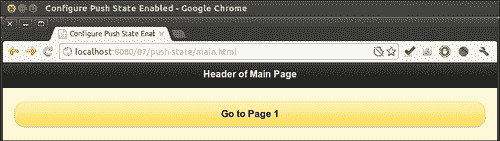

当您打开**页面 1**时，URL 地址栏将完整路径追加到`main.html`，如下图所示：

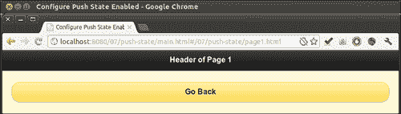

这是因为启动时`pushStateEnabled`被设置为`false`。如果将其设置为`true`（默认值）并重新加载页面，则 URL 哈希将被替换，并显示为`http://localhost:8080/07/push-state/page1.html`。

### 注

当您的应用中未使用 Ajax 或广泛使用外部链接时，请将`pushStateEnabled`配置设置为`false`。

## 还有更多。。。

在此配方中，`linkBindingEnabled`配置在启动时设置为`true`（其默认值）。如果您将其设置为`false`并重新加载页面，您将注意到**转到第 1 页**按钮在单击时没有处于活动状态。在这种情况下，框架不会自动绑定链接单击。

### 注

仅当您希望自定义代码（或其他库）处理链接点击时，才使用`linkBindingEnabled`配置。

## 另见

*   [第 7 章](07.html "Chapter 7. Configurations")、*配置*、*配置 hashListeningEnabled 和 subPageUrlKey*