# 八、事件

在本章中，我们将介绍：

*   使用定向事件
*   使用滚动事件
*   使用触摸事件
*   使用虚拟鼠标事件
*   使用页面初始化事件
*   使用页面加载和删除事件
*   使用页面更改事件
*   使用页面转换和动画事件
*   使用布局事件

# 导言

除了桌面和移动平台的默认本机事件外，jQueryMobile 框架还提供特定事件。它允许您使用 jQuery`bind()`或`live()`方法绑定到这些事件，从而允许您执行自定义操作。本章向您展示了如何使用 jQueryMobile 框架中可用的事件。

# 使用定向事件

当移动设备的方向（**纵向**或**横向**发生变化时，jQueryMobile 框架触发一个`orientationchange`事件。本食谱向您展示了如何使用`orientationchange`事件。

## 准备好了吗

从`code/08/orientation`源文件夹复制此配方的完整代码。您可以使用 URL`http://localhost:8080/08/orientation/main.html`启动此代码

## 怎么做。。。

执行以下步骤：

1.  创建`main.html`如下：

    ```js
    <div id="main" data-role="page" data-theme="e">
      <div data-role="header" data-theme="a">
     <h1>Orientation Events</h1>
      </div>    
      <div data-role="content">
        <p>Change orientation</p>
      </div>
    </div>
    ```

2.  在`<head>`部分

    ```js
    $(window).bind("orientationchange", function(event, data) {
     $("h1").html(data.orientation);
    });
    ```

    添加脚本处理`orientationchange`事件

## 它是如何工作的。。。

使用页面内容创建`main.html`，如前面的代码片段所示。添加给定脚本并将`orientationchange`事件绑定到回调函数。在此，将设备的当前方向设置为页面的`h1`标题。您可以使用回调函数的`data.orientation`属性获取设备方向。

加载页面时，更改设备的方向；标题文本将根据当前方向显示**纵向**或**横向**。

## 还有更多。。。

在不支持方向属性的平台中（`$.support.orientation`为`false`），或者`$.mobile.orientationChangeEnabled`全局配置设置为`false`时，框架绑定 resize 事件处理程序来处理设备的方向更改。

### 已启用方向更改的全局配置

您可以在`mobileinit`事件处理程序中配置配置，该事件处理程序在应用启动时被调用。这必须在包含`jquery.mobile.js`脚本之前完成。

```js
$(document).bind("mobileinit", function() {
  $.mobile.orientationChangeEnabled = false;
});
```

# 使用滚动事件

当您滚动时，jQueryMobile 框架触发 scrollstart 事件。当您停止滚动时，`scrollstop`事件被触发。此食谱向您展示如何使用这两个事件。

## 准备好了吗

从`code/08/scroll`源文件夹复制此配方的完整代码。您可以使用 URL`http://localhost:8080/08/scroll/main.html`启动此代码

## 怎么做。。。

执行以下步骤：

1.  创建`main.html`页面内容`div`样式，高度值较大，滚动条出现：

    ```js
    <div id="main" data-role="page" data-theme="e">
      <div data-role="header" data-theme="a" data-
      position="fixed">
     <h1>Scroll Events</h1>
      </div>    
      <div data-role="content">
        <div style="height: 1000px">Scroll now</div>
      </div>
    </div>
    ```

2.  将以下脚本添加到`<head>`部分以处理`scroll`事件：

    ```js
    $(window).bind("scrollstart", function(event) {
      $("h1").html("Scrolling now...");
    });
    $(window).bind("scrollstop", function(event) {
      $("h1").html("Scrolling done!");
    });
    ```

## 它是如何工作的。。。

创建`main.html`，如前代码所示。在页面内容中添加一个`height`为`1000px`的`div`容器。这将使垂直滚动条出现。现在，将给定的脚本添加到页面的`<head>`部分。将`scrollstart`事件绑定到更新页眉文本的回调函数。类似地，将`scrollstop`事件绑定到更新标题文本的回调函数。现在，按住垂直滚动条手柄滚动页面。您可以看到页眉文本显示`"Scrolling now..."`，当您停止或暂停滚动时，文本更新为`"Scrolling done!"`。

## 还有更多。。。

`scrollstart`事件如何在 iOS 设备上运行存在一个问题。在滚动期间不允许 DOM 操作，并且一旦滚动停止，事件将排队并触发。因此，在 iOS 设备上处理滚动事件时，请记住这一点。您必须在滚动开始前进行更改，而不是在滚动开始后进行更改。

# 使用触摸事件

jQueryMobile 框架提供五个触摸事件。它们是`tap``taphold``swipe``swipeleft`和`swiperight`事件。点击屏幕时触发点击事件。如果点击持续时间较长，则先触发`taphold`事件，然后在您抬起手指后触发`tap`事件。当您在屏幕上滑动时，首先触发`swipe`事件，然后根据滑动动作的方向触发`swipeleft`或`swiperight`事件。本食谱向您展示了如何使用这些触摸事件。

在此配方中，上次点击屏幕的位置会显示一个黄色框。每次点击并按住时都会创建一个绿色框。您还可以通过在屏幕的左边缘或右边缘滑动蓝色条来查看滑动操作的工作方式。

## 准备好了吗

从`code/08/touch`源文件夹复制此配方的完整代码。您可以使用 URL`http://localhost:8080/08/touch/main.html`启动此代码。

## 怎么做。。。

要遵循的步骤如下

1.  在`main.html`中，在`<head>`标签中定义以下样式：

    ```js
    <style>
      .box { width:60px; height:60px; position:fixed }
      .yellow { background-color:yellow; z-index:1 }
      .green { background-color:green; z-index:2 }
      .blue { background-color: blue; z-index:3; height:100% }
    </style>
    ```

2.  添加带有两个`<div>`标签的页面内容，标签样式为蓝色条和黄色框：

    ```js
    <div id="content" data-role="content">
      <div id="movingbox" class="box yellow" style="top:0px; left:0px"></div>
      <div id="edgebar" class="box blue" style="top:0px; left:0px"></div>
    </div>
    ```

3.  将以下脚本添加到`<head>`部分，以处理`tap`和`taphold`事件：

    ```js
    var tapholdflag = false;
    $("#main").live("tap", function(event) {
      var stylestr = "left:" + event.clientX + "px; top:" 
        + event.clientY + "px;"
      if (tapholdflag) {
        var str = "<div class=''box green'' style=''" + 
          stylestr + "''></div>";
        $("#content").append(str).trigger("create");
      } else {
        $("#movingbox").attr("style", 
          stylestr).trigger("refresh");
      }
      tapholdflag = false;
    });
    $("#main").live("taphold", function(event) {
      tapholdflag = true;
    });
    ```

4.  最后，处理的`swipe`、`swipeleft`和`swiperight`事件：

    ```js
    $("#main").live("swipe", function(event) {
      $.event.special.swipe.scrollSupressionThreshold = 15;
      $.event.special.swipe.durationThreshold = 1250;
      $.event.special.swipe.horizontalDistanceThreshold = 25;
      $.event.special.swipe.verticalDistanceThreshold = 50;
    });  
    $("#main").live("swipeleft", function(event) {
      $("#edgebar").attr("style", "top:0px; 
        left:0px").trigger("refresh");
    });
    $("#main").live("swiperight", function(event) {
      $("#edgebar").attr("style", "top:0px; 
        right:0px").trigger("refresh"); 
    });
    ```

## 它是如何工作的。。。

在`main.html`中添加`style`标签，定义`box`、`yellow`、`green`和`blue`类。添加一个空的带有`id="movingbox"`的`div`标签，并设置属性`class="box yellow"`。这将创建一个`60px`宽的黄色正方形。接下来，添加一个空的带有`id="edgebar"`的`div`标记，并设置属性`class="box blue"`。这将创建一个`60px``wide blue bar on the edge of the screen as shown in the following screenshot. The yellow box is hidden below the blue bar as it has a lower `z-index`值。`

 `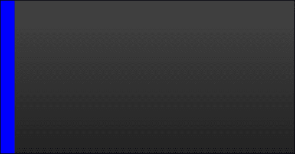

现在将给定脚本添加到`main.html`的`<head>`部分。将五个触摸事件中的每一个绑定到回调函数，如图所示。如果抽头持续时间长，则为`taphold`。因此，定义一个布尔值`tapholdflag`来跟踪`tap`事件是否为`taphold`。在`taphold`事件处理程序中将其设置为`true`，并在触发`tap`事件后将其清除。

在`tap`事件的回调中，首先检查`tapholdflag`是否已经设置。如果是，那么这是一个`taphold`事件。创建一个新的绿色框并调用`"``create"`方法，如图所示。如果`tapholdflag`为`false`，则这是一个简单的点击。更新黄色框的新位置，触发`"refresh"`方法。最后，清除`tapholdflag`并将其设置为`false`。

您可以使用`event.clientX`和`event.clientY`参数获取分接头位置。将这些值设置为框的`left`和`top`样式属性，以更新其位置。在几个`tap`和`taphold`事件之后，屏幕看起来类似于以下屏幕截图：

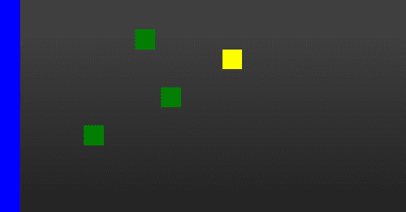

现在，将`swipe`事件绑定到回调函数，并配置`swipe`事件属性，如代码所示。代码显示了如何配置`scrollSupressionThreshold`、`durationThreshold`、`horizontalDistanceThreshold`和`verticalDistanceThreshold`属性。

将`swipeleft`事件绑定到回调，设置蓝条的`left`和`top`样式属性，调用`"refresh"`方法。这会将条移动到屏幕的左边缘。类似地，将`swiperight`事件绑定到回调以设置蓝条的`right`和`top`样式属性，并调用`"refresh"`。这会将条移动到屏幕的右边缘。现在，当您向屏幕右侧滑动时，该条移动到右侧边缘，如下面的屏幕截图所示；向左侧轻扫，条形图移回左侧边缘：

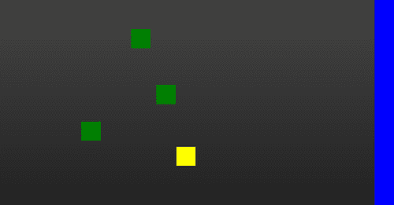

## 还有更多。。。

在代码中，`swipe`事件的回调向您展示了如何配置`swipe`事件属性。可用配置如下所示：

*   `scrollSupressionThreshold`（`10px`默认）刷卡距离必须大于此值才能触发事件，否则为`scroll`事件
*   `durationThreshold`（`1000ms`默认）：如果刷卡持续时间大于此值，则`swipe`事件被阻止触发
*   `horizontalDistanceThreshold`（`30px`默认值）：水平滑动距离必须大于此值才能触发事件
*   `verticalDistanceThreshold`（`75px`默认）垂直滑动距离必须小于此值，才能触发事件

### tapholdThreshold 属性

当您点击屏幕时，`tap`事件将触发。如果抽头持续时间超过某个值（默认情况下为`750ms`，则这将被视为`taphold`事件。您可以通过如下设置`$.event.special.tap.tapholdThreshold`属性来配置此持续时间：

```js
$("#main").live("tap", function(event) {
  $.event.special.tap.tapholdThreshold = 1000;
});
```

### 注

默认的`tap`事件配置适用于大多数平台。因此，只有当你有很强的理由这样做时，才修改它们。

## 另见

*   使用虚拟鼠标事件的*配方*

# 虚拟鼠标事件

jQueryMobile 框架提供虚拟`mouse`或`vmouse`事件来抽象鼠标和触摸事件。

您不必为每个受支持的平台或设备的触摸和鼠标事件编写单独的处理程序。您只需要为`vmouse`事件编写事件处理程序，这将在各种平台上工作。框架支持七个`vmouse`事件：`vmousemove`、`vmouseover`、`vmouseout`、`vmousedown`、`vmouseup`、`vclick`、`vmousecancel`。本食谱向您展示了如何使用这些`vmouse`事件。

## 准备好了吗

从`code/08/vmouse`源文件夹复制此配方的完整代码。您可以使用 URL`http://localhost:8080/08/vmouse/main.html`启动此代码。

## 怎么做。。。

应遵循的步骤如下：

1.  为七个`vmouse`事件创建内容具有七个`div`标签的`main.html`，如下所示：

    ```js
    <div data-role="content">
      <div id="move"></div>
      <div id="over"></div>        
      <div id="out"></div>        
      <div id="down"></div>
      <div id="up"></div>
      <div id="click"></div>
      <div id="cancel"></div>
    </div>
    ```

2.  将以下脚本添加到`<head>`部分以处理事件`vmousemove`、`vmouseover`和`vmouseout`事件：

    ```js
    $("#main").live("pageinit", function(e) {
     $("#main").bind("vmousemove", function(e) {
        $("#move").html("<p>Move: " + e.clientX + ", " 
          + e.clientY + "</p>");
      });
     $("#main").bind("vmouseover", function(e) {
        $("#over").html("<p>Over: " + e.clientX + ", " 
          + e.clientY + "</p>");
      });
     $("#header").bind("vmouseout", function(e) {
        $("#out").html("<p>Out: " + e.clientX + ", " + 
          e.clientY + "</p>");
      });
    ```

3.  接下来，处理的`vmousedown`、`vmouseup`、和`vclick`事件：

    ```js
     $("#main").bind("vmousedown", function(e) {
        var whichbtn;
        switch (e.which) {
          case 1: whichbtn = "Left Button"; break;
          case 2: whichbtn = "Center Button"; break;
          case 3: whichbtn = "Right Button"; break;
          default: whichbtn = "Tap"; break;
        }                        
        $("#down").html("<p>Down: " + e.clientX + ", " 
          + e.clientY + " - " + whichbtn + " </p>");
      });
     $("#main").bind("vmouseup", function(e) {
        $("#up").html("<p>Up: " + e.clientX + ", " + 
          e.clientY + "</p>");
      });
     $("#main").bind("vclick", function(e) {
        $("#click").html("<p>Click: " + e.clientX + ", 
          " + e.clientY + "</p>");
      });
    ```

4.  最后，处理事件`vmousecancel`如下：

    ```js
     $("#main").bind("vmousecancel", function(e) {
        $("#cancel").html("<p>Cancel: " + e.clientX + ", 
          " + e.clientY + "</p>");
      });
    });
    ```

## 它是如何工作的。。。

创建`main.html`、并添加七个空`divs`以显示七个`vmouse`事件中每个事件的事件位置。添加给定的脚本并为每个`vmouse`事件绑定回调函数，如`pageinit`事件处理程序所示。使用传递给回调函数的事件参数的`e.clientX`和`e.clientY`值获取`vmouse`事件的位置。加载页面并移动鼠标执行所述的各种鼠标操作时，屏幕显示如下：

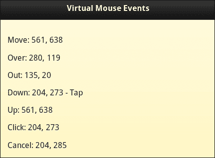

移动鼠标时（或在`touchmove`事件上），触发`vmousemove`事件。当对事件绑定到的元素执行移动操作时，触发`vmouseover`事件。当`move`动作超出事件绑定的元素时，触发`vmouseout`事件。在前面的代码中，`vmouseout`事件绑定到`h1`头。将鼠标移到标题上并移出标题，以查看此参数在屏幕上得到更新。点击鼠标（或点击`touchstart`事件）时触发`vmousedown`事件。点击结束时，`vmouseup`事件跟随`down`事件（`touchend`事件）。点击或点击操作时，`vclick`事件与`vmousedown`和`vmouseup`事件一起触发。在`vmousedown`事件处理程序中，您可以使用`event.which`属性查找单击的鼠标按钮。对于`tap`事件，此值为`0`。您可以尝试单击鼠标上的不同按钮，以查看相应的屏幕更新。最后，当鼠标或触摸事件被取消时，`vmousecancel`事件被触发。

## 还有更多。。。

框架为`vmouse`事件提供以下三种配置：

*   `$.vmouse.moveDistanceThreshold`（`10px`默认）：如果移动量大于此值，则为`scroll`事件。调用`vmousecancel`事件，取消`TouchMove`事件。
*   `$.vmouse.clickDistanceThreshold`（`10px`默认）：如果`vmouse`点击事件已经捕获，则该事件在阻止列表中。然后，所有小于此距离的`vmouse`点击将被忽略。
*   `$.vmouse.resetTimerDuration` (`1500ms` by default): If the interval between `vmouse` clicks is more than this duration, then it is not a touch event. `Scroll`, `TouchMove`, and `TouchEnd` events use this. The block list is cleared.

    ### 注

    默认的`vmouse`配置适用于大多数平台。因此，只有当你有很强的理由这样做时，才修改它们。

### 鼠标坐标

此配方显示使用`event.clientX`和`event.clientY`属性获取鼠标坐标。您还可以使用`event.pageX`、`event.pageY`、`screen.pageX`和`screen.pageY`属性获取屏幕和页面坐标。

### 在触摸设备上使用 vclick 事件

在触摸式设备上，已知`webkit`浏览器会在`touchend`事件触发后大约 300 毫秒后处理点击事件。如果基础对象或背景在此间隙内发生变化，则此延迟可能导致选择不同的目标。另一个问题是，由于时间滞后，将事件与相应的目标相匹配；例如，当使用`event.preventDefault()`时。为避免触摸设备出现这些问题，请使用`click`事件而不是`vclick`事件。

## 另见

*   使用触摸事件的*配方*

# 页面初始化事件

jQueryMobile 框架提供**页面插件**，自动处理页面初始化事件。在创建页面之前触发`pagebeforecreate`事件。`pagecreate`事件在页面创建之后、小部件初始化之前触发。完成初始化后触发`pageinit`事件。这个食谱告诉你如何使用这些事件。

## 准备好了吗

从`code/08/pageinit`源文件夹复制此配方的完整代码。您可以使用 URL`http://localhost:8080/08/pageinit/main.html`启动此代码

## 怎么做。。。

执行以下步骤：

1.  创建带有三个空的`<div>`标签的`main.html`，如下所示：

    ```js
    <div id="content" data-role="content">
      <div id="div1"></div>
      <div id="div2"></div>
      <div id="div3"></div>
    </div>
    ```

2.  将以下脚本添加到`<head>`部分以处理`pagebeforecreate`事件：

    ```js
    var str = "<a href='#' data-role='button'>Link</a>";
    $("#main").live("pagebeforecreate", function(event) {
      $("#div1").html("<p>DIV1 :</p>"+str);
    });
    ```

3.  接下来，处理`pagecreate`事件：

    ```js
    $("#main").live("pagecreate", function(event) {
      $("#div1").find("a").attr("data-icon", "star");
    });
    ```

4.  最后，处理`pageinit`事件：

    ```js
    $("#main").live("pageinit", function(event) {
      $("#div2").html("<p>DIV 2 :</p>"+str);
      $("#div3").html("<p>DIV 3 :</p>"+str);
      $("#div3").find("a").buttonMarkup({"icon": "star"});
    });
    ```

## 它是如何工作的。。。

在`main.html`中将三个空`divs`添加到页面内容中，如图所示。将给定脚本添加到页面。在脚本中，`str`是一个 HTML 字符串，用于创建具有`data-role="button"`属性的锚定链接。

添加`pagebeforecreate`事件的回调，并将`str`设置为`div1`容器。由于页面尚未创建，`div1`中的按钮会自动初始化并增强，如下图所示。

为`pagecreate`事件添加回调。使用 jQuery`find()`方法选择`div1`中的上一个锚按钮，并设置其`data-icon`属性。由于此更改是在页面初始化之后但在按钮初始化之前进行的，因此会自动为`div1`按钮显示`star`图标，如以下屏幕截图所示。最后，添加`pageinit`事件的回调，并将`str`添加到`div2`和`div3`容器中。此时，页面和小部件已经初始化并增强。添加锚定链接现在将仅显示为本机链接，而不会对`div2`进行任何增强，如以下屏幕截图所示。但是对于`div3`，找到锚定链接，手动调用按钮插件上的`buttonmarkup`方法，并将其图标设置为`star`。现在当您加载页面时，`div3`中的链接得到如下增强：

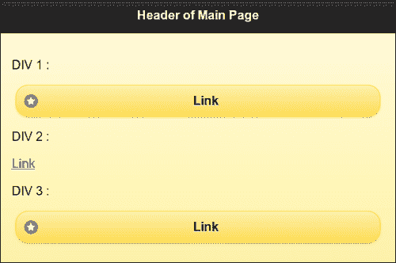

## 还有更多。。。

您可以在插件上触发`"create"`或`"refresh"`，让 jQueryMobile 框架增强初始化后对页面或小部件所做的动态更改。

### 页面初始化事件只触发一次

页面初始化事件只触发一次。因此，这是进行任何特定初始化或添加自定义控件的好地方。

### 不要使用$（document）.ready（）

`$(document).ready()`处理程序仅在加载第一个页面或 DOM 第一次准备就绪时工作。如果通过 Ajax 加载页面，则不会触发`ready()`功能。鉴于，`pageinit`事件在页面创建、加载和初始化时触发。因此，这是在应用中进行初始化后活动的最佳位置。

```js
$(document).bind("pageinit", callback() {…});
```

# 页面加载和删除事件

每当外部页面加载到 DOM 中时，jQueryMobile 框架就会触发页面加载事件。加载页面前触发`pagebeforeload`事件，然后根据页面加载状态触发`pageload`或`pageloadfailed`事件。从 DOM 中删除页面时会触发`pageremove`事件。此配方向您展示了如何使用页面加载和页面删除事件。

## 准备好了吗

从`code/08/pageload`源文件夹复制此配方的完整代码。您可以使用 URL`http://localhost:8080/08/pageload/main.html`启动此代码。

## 怎么做。。。

执行以下步骤：

1.  用四个按钮和一个空的`div`元素创建`main.html`，如下面的代码片段所示：

    ```js
    <div id="content" data-role="content">
      <a href="page1.html" data-role="button" data-
        inline="true">Page 1</a>
      <a href="page2.html" data-role="button" data-
        inline="true">Page 2</a>        
      <a href="page3.html" data-role="button" data-
        inline="true">Page 3</a>
      <a href="page4.html" data-role="button" data-
        inline="true">Page 4</a>
      <div id="msgdiv"></div>
    </div>
    ```

2.  将下面的脚本添加到`<head>`部分，以处理`pagebeforeload`事件：

    ```js
    $(document).bind("pagebeforeload", function(event, data) {
      var str = "<p>LOADING PAGE ...</p>"
        + "<p>url: " + data.url + "</p>"
        + "<p>absUrl : " + data.absUrl + "</p>"
        + "<p>dataUrl : " + data.dataUrl + "</p>"
        + "<p>options.type: " + data.options.type + "</p>";
      var re = /page2.html/;
      if ( data.url.search(re) !== -1 ) {
        str += "<p>ABORTED!!! page2.html does not 
          exist.</p>";
        event.preventDefault();
     data.deferred.reject( data.absUrl, data.options);
      }
      re = /page4.html/;
      if ( data.url.search(re) !== -1 ) {
        str += "<p>ABORTED!!! error dialog shown 
          instead.</p>";
        event.preventDefault();
     data.deferred.resolve( data.absUrl, data.options, 
     $("#subpage")); 
      }
      $("#msgdiv").html(str).trigger("refresh");
    });
    ```

3.  接下来，处理`pageload`事件：

    ```js
    $(document).bind("pageload", function(event, data) {
      var str = "<p>PAGE LOADED!</p><p>textStatus: " + data.textStatus 
        +   "</p><p>xhr.status : " + data.xhr.status + "</p>";
      $("#msgdiv").append(str).trigger("refresh");
    });
    ```

4.  接下来，用`pageloadfailed`事件

    ```js
    $(document).bind("pageloadfailed", function(event, 
     data) {
      var str = "<p>PAGE LOAD FAILED!</p>"+ "<p>textStatus: " + data.textStatus + "</p>"
        + "<p>xhr.status : " + data.xhr.status + "</p>"
        + "<p>errorThrown : " + data.errorThrown + "</p>";
      $("#msgdiv").append(str).trigger("refresh");
    });
    ```

    处理任何错误
5.  同时处理的`pageremove`事件：

    ```js
    $("#page1").live("pageremove", function(event) {
      $("#msgdiv").append("<p>PAGE 
        REMOVED!</p>").trigger("refresh");
    });
    ```

6.  现在，创建一个与`id="dialog"`的对话框，如下所示：

    ```js
    <div id="dialog" data-role="dialog" data-theme="e" data-add-back-btn="true">
      <div data-role="header">
        <h1>Page Load Failed!</h1>
      </div>
      <div data-role="content">
        <p>There was an error</p>
      </div>      
    </div>
    ```

7.  最后，用按钮创建`page1.html`返回`#main`，如下代码片段所示：

    ```js
    <div id="page1" data-role="page" data-theme="e">
      <div data-role="header">
        <h1>Header of Page 1</h1>
      </div>
      <div data-role="content">
        <a href="#" data-role="button" data-
          rel="back">Go to Main Page</a>
      </div>
    </div>
    ```

## 它是如何工作的。。。

在`main.html`中创建`#main`页面，添加四个具有`data-role="button"`和`data-inline="true"`属性的锚链接，创建四个内联按钮。这些链接指向`page1.html`、`page2.html`、`page3.html`和`page4.html`。同时添加一个带有`id="msgdiv"`的空`div`容器以显示消息。接下来，在`main.html`中添加一个带有`id="dialog"`的对话框。最后，只创建`page1.html`，如图所示，带有返回主页的链接。其他三个页面未创建。将页面加载和页面删除事件绑定到脚本中给定的回调函数。这些回调函数有两个可用参数。第一个是`event`对象，第二个是`data`对象。

在`pagebeforeload`事件的回调中，从`data`对象获取`url`、`absUrl`（绝对 URL）、`dataUrl`（数据 URL）和`options.type`属性。在`msgdiv`容器中显示它们。`options`对象与传入`$.mobile.loadPage()`调用的对象相同。

在`pageload`事件的回调中，获取指示页面加载成功的`xhr.status`（jQuery`XMLHttpRequest`对象）和`textStatus`属性，并显示在`msgdiv`容器中。

增加`pageloadfailed`回调函数显示页面加载错误的`data.xhr.status`和`data.errorThrown`属性。最后，添加`pageremove`回调函数并显示页面已删除的消息。

现在，当您最初加载应用并点击**页面 1**按钮打开`page1.html`时，首先触发`pagebeforeload`事件，然后在页面完全加载后触发`pageload`事件。导航回主页面，触发`pageremove`事件。您可以看到显示的这些消息，如以下屏幕截图所示：

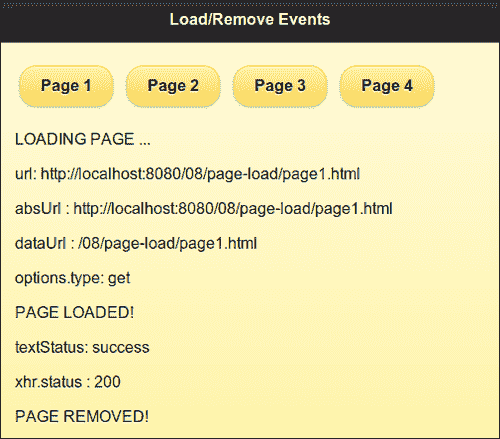

接下来，在`pagebeforeload`事件处理程序中，使用正则表达式搜索检查请求的页面还是`data.url`是`page2.html`（不存在）。如果请求了`page2.html`，则显示自定义错误消息。也可以通过拨打`event.preventDefault()`来阻止对此请求采取任何进一步行动。最后必须调用`data.deferred.reject()`方法以拒绝数据对象中包含的延迟对象引用。现在，当您点击**第 2 页**按钮时，不会触发`pageloadfailed`事件，如下图所示，自定义错误消息**被中止！！！page2.html 不存在。**显示：

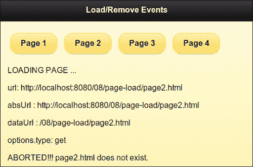

点击**第 3 页**按钮；现在尝试加载不存在的`page3.html`，并显示覆盖在当前页面上的**错误加载页面**默认错误消息，如下图所示。您还可以在此处看到来自`pageloadfailed`事件处理程序的消息。在这种情况下没有进行自定义事件处理。

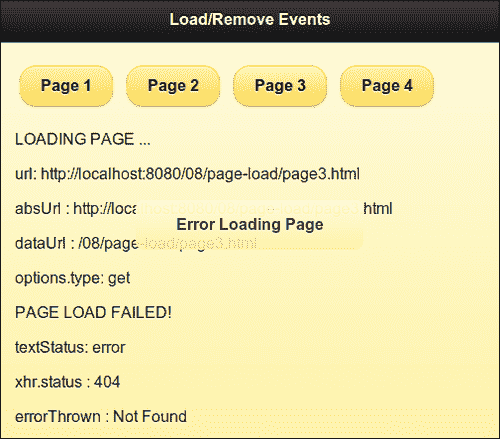

最后，在`pagebeforeload`回调函数中添加代码，在`data.url`对象中搜索`page4.html`。如果找到字符串，则重定向请求以加载`#dialog`对话框。此外，如果请求了`page4.html`，则会显示一条自定义消息。现在，为了防止对`pagebeforeevent`执行默认操作，请调用`event.preventDefault()`方法。您还必须调用`data.deferred.resolve()`方法来解析`data`对象中包含的延迟对象引用。然后，打开`#dialog`页面，将其作为参数传递给`resolve`方法，如代码所示。现在，当您单击**第 4 页**按钮时，将显示自定义错误对话框弹出窗口。当您关闭对话框时，您的自定义消息**被中止！！！改为显示错误对话框。显示**，如下图所示。您将注意到，`pageloadfailed`事件回调函数没有被调用。

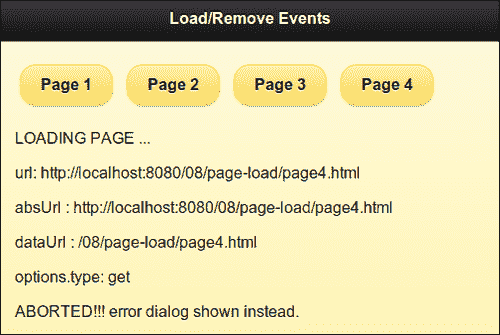

## 还有更多。。。

如果您通过调用`event.preventDefault()`方法来阻止默认页面加载事件，那么您必须在完成后通知框架继续处理其他`changePage()`请求。可以通过调用传递给事件回调函数的`data.deferred`对象上的`reject()`或`resolve()`方法来实现。

## 另见

*   *使用 loadPage（）加载[第 9 章](09.html "Chapter 9. Methods and Utilities")、*方法和实用程序*中的*配方页面

# 页面更改事件

每当`$.mobile.changePage()`方法将页面加载到 DOM 中时，jQueryMobile 框架就会触发页面更改事件。在页面更改之前，先触发`pagebeforechange`事件。然后，触发`pagechange`事件（成功时）或`pagechangefailed`事件（失败时）。此配方向您展示了如何使用页面更改事件。

## 准备好了吗

从`code/08/pagechange`源文件夹复制此配方的完整代码。您可以使用 URL`http://localhost:8080/08/pagechange/main.html`启动此代码。

## 怎么做。。。

执行以下步骤：

1.  创建带有两个链接的`main.html`以打开两个对话框，并在其页面内容中创建一个空的`div`元素，如下所示：

    ```js
    <div id="content" data-role="content">
      <a href="#dialog1" data-role="button">Dialog 1</a>
      <a href="#dialog2" data-role="button">Dialog 2</a>        
      <div id="msgdiv"></div>
    </div>
    ```

2.  在处理`pagebeforechange`事件的`<head>`部分添加以下脚本：

    ```js
    $(document).bind("pagebeforechange", function(event, data) {
      var str = "<p>CHANGING PAGE ...</p><p>toPage: ";
      str += (!!data.toPage.attr)? data.toPage.attr("data-
        url") : data.toPage;
      str += "</p>";
      $("#msgdiv").html(str).trigger("refresh");
      $("#dialogdiv").html(str).trigger("refresh");
    });
    ```

3.  接下来，处理`pagechange`事件：

    ```js
    $(document).bind("pagechange", function(event, data) {
      var str = "<p>CHANGED PAGE ...</p><p>fromPage: ";
      str += (!!data.options.fromPage && !!data.options.fromPage.attr)? 
      data.options.fromPage.attr("data-url") : "none";
      str += "</p><p>options.transition: " + data.options.transition + "</p>";
      $("#msgdiv").append(str).trigger("refresh");
      $("#dialogdiv").append(str).trigger("refresh");
    });
    ```

4.  接下来，用`pagechangefailed`事件

    ```js
    $(document).bind("pagechangefailed", function(event, 
     data) {
      var str = "<p>PAGE CHANGE FAILED ...</p>";
      $("#msgdiv").append(str).trigger("refresh");
    });
    ```

    处理任何错误
5.  最后，创建`#dialog1`对话框，如下所示。第二个对话框`#dialog2`未创建。

    ```js
    <div id="dialog1" data-role="dialog" data-theme="e" 
      data-add-back-btn="true">
      <div data-role="header">
        <h1>Dialog Header</h1>
      </div>
      <div data-role="content">
        <div id="dialogdiv"></div>
      </div>
    </div> 
    ```

## 它是如何工作的。。。

在`main.html`中，将两个带有`data-role="button"`的锚定链接添加到`#main`页面的内容中。这些链接指向`#dialog1`和`#dialog2`对话框。另外，添加一个带有`id="msgdiv"`的空`div`容器以显示消息。最后，只向`main.html`添加一个带有`id="dialog1"`的对话框。将带有`id="dialogdiv"`的空`div`容器添加到此对话框。未创建另一个对话框。将页面更改事件绑定到脚本中给定的回调函数。这些回调函数有两个可用参数。第一个是`event`对象，第二个是`data`对象。

在`pagebeforechange`事件的回调中，获取`data.toPage`（目标页面）属性。这可以是字符串或对象。检查这是否是一个对象（如果它有`toPage`属性），然后使用`data.toPage.data-url`字符串。在两个信息`div`容器中显示`toPage`信息。

在`pagechange`事件的回调中，获取`data.fromPage`（源页面）属性。再次检查这是一个对象还是一个字符串，如果它是消息`div`容器中的一个对象，则显示`data.fromPage.data-url`字符串。此外，`data.options`对象具有您可以使用的属性，例如`transition`。

最后，在`pagechangefailed`事件的回调中，显示一条自定义错误消息。当页面第一次加载时，您可以看到下图。**toPage**显示文本**main**；此处没有第页的**：**

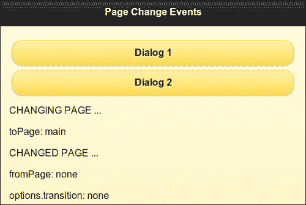

点击**对话框 1**按钮，将显示以下对话框。**toPage**值为**对话框 1**，页面中的**为**主**。使用的转换显示为**弹出**，这是对话框的默认转换：**

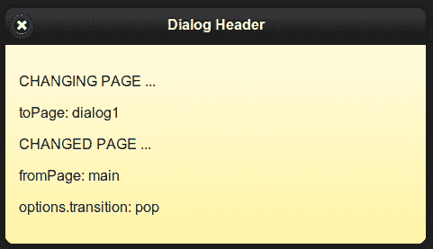

关闭此对话框，`#main`页面打开，显示与以下屏幕截图类似的消息。**toPage**为**主**，而页面中的**为**对话框 1**。使用的转换再次显示为**pop**：**

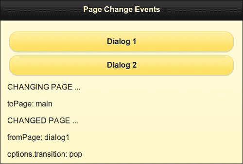

最后点击**对话框 2**按钮；由于`#dialog2`不存在，在`pagechangefailed`回调中显示自定义错误消息**页面更改失败**，如下图所示：

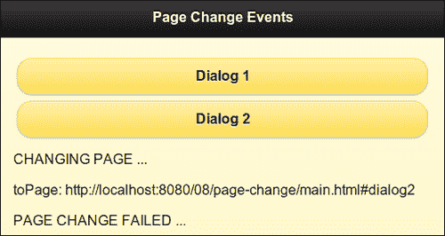

## 还有更多。。。

您可以通过调用`pagebeforechange`事件处理程序中的`event.preventDefault()`方法来阻止默认的页面更改操作。您可以使用`$.mobile.changePage()`方法将导航重定向到此处的另一个页面。

### 页面更改事件的顺序

触发`pagebeforechange`事件后，`changePage()`请求将页面加载到 DOM 中，页面发生转换。此时触发`pageshow`和`pagehide`事件。最后，`pagechange`事件仅在此之后触发。

## 另见

*   *使用 changePage（）更改[第 9 章](09.html "Chapter 9. Methods and Utilities")、*方法和实用程序*中的*页面配方

# 页面转换和动画事件

在页面导航期间，当前页面向外过渡，新活动页面向内过渡。在受支持的位置使用动画。jQueryMobile 框架在页面导航过程中会触发四个页面转换事件，如下所示：

*   `pagebeforehide`：此事件在当前页面隐藏前触发
*   `pagehide`：一旦当前页面被隐藏，就会触发此事件
*   `pagebeforeshow`：此事件在显示新的活动页面之前触发
*   `pageshow`：一旦显示激活的页面，就会触发此事件

动画完成后，您还可以访问`animationComplete`插件执行自定义操作。本食谱向您展示了如何使用页面转换事件以及如何使用`animationComplete`插件。

## 准备好了吗

从`code/08/transition`源文件夹复制此配方的完整代码。您可以使用 URL`http://localhost:8080/08/transition/main.html`启动此代码。

## 怎么做。。。

执行以下步骤：

1.  创建`main.html`，添加`#main`页面，添加链接打开`#page`页面和一个空`div`容器，如下代码片段所示：

    ```js
    <div id="main" data-role="page" data-theme="e">
      <div data-role="header">
        <h1>Page Transition and Animation Events</h1>
      </div>
      <div id="content" data-role="content">
        <a href="#page" data-role="button" data-
          transition="slide">Page 1</a>
      <div id="msgdiv"></div>
    </div>
    ```

2.  创建`#page`页面，如下所示，带有返回`#main`的按钮和显示消息的空`div`容器：

    ```js
    <div id="page" data-role="page" data-theme="e">
      <div data-role="header">
        <h1>Page Header</h1>
      </div>
      <div data-role="content">
        <a href="#" data-rel="back" data-role="button">Go Back</a>
      <div id="pagediv"></div>
    </div>
    ```

3.  将以下脚本添加到`<head>`部分，以便在单击链接时清除消息`div`容器：

    ```js
    $("#main").live("pageinit", function(event) {
      $("a").bind("click", function(event, ui) {
        $("#msgdiv").html("");
        $("#pagediv").html("");
      });
    });
    ```

4.  处理`pagebeforeshow`事件：

    ```js
    $(document).bind("pagebeforeshow", function(event, data) {
      var str = "<p>BEFORE PAGE SHOW ...</p><p>Previous 
        Page: ";
      str += (!!data.prevPage.attr)? 
        data.prevPage.attr("data-url") : "none";
      str += "</p>";
      $("#msgdiv").append(str).trigger("refresh");
      $("#pagediv").append(str).trigger("refresh");
    });
    ```

5.  处理`pagebeforehide`事件：

    ```js
    $(document).bind("pagebeforehide", function(event, 
     data) {
     $(data.nextPage).animationComplete(anim);
      var str = "<p>BEFORE PAGE HIDE ...</p><p>Current Page: ";
      str += (!!data.nextPage.attr)?
        data.nextPage.attr("data-url") : "none";
      str += "</p>";        
      $("#msgdiv").append(str).trigger("refresh");
      $("#pagediv").append(str).trigger("refresh");
    });
    ```

6.  处理`pageshow`事件：

    ```js
    $(document).bind("pageshow", function(event, data) {
      var str = "<p>PAGE SHOW!</p><p>Previous Page: ";
      str += (!!data.prevPage.attr)? 
        data.prevPage.attr("data-url") : "none";
      str += "</p>";
      $("#msgdiv").append(str).trigger("refresh");
      $("#pagediv").append(str).trigger("refresh");
    });
    ```

7.  处理的`pagehide`事件：

    ```js
    $(document).bind("pagehide", function(event, data) {
      var str = "<p>PAGE HIDE!</p><p>Current Page: ";
      str += (!!data.nextPage.attr)? 
        data.nextPage.attr("data-url") : "none";
      str += "</p>";        
      $("#msgdiv").append(str).trigger("refresh");
      $("#pagediv").append(str).trigger("refresh");
    });
    ```

8.  `animationComplete()`方法：

    ```js
    anim = function() {
      $("#msgdiv").append("ANIMATION 
        DONE!!!").trigger("refresh");
      $("#pagediv").append("ANIMATION 
        DONE!!!").trigger("refresh");          
    }
    ```

    增加回调函数

## 它是如何工作的。。。

创建`main.html`和在`#main`页面的内容中添加一个带有`data-role="button"`的锚定链接。此链接打开`main.html`中的`#page`页面。创建`#page`页面，如图所示，带有返回`#main`的链接。分别在页面中添加空的`#msgdiv`和`#pagediv`容器，以显示消息。在`pageinit`事件处理程序中绑定锚定链接的`click`事件，清除之前显示的所有消息。每当您单击应用中的链接时，就会触发此回调。

现在，将四页转换事件绑定到它们的回调函数，如脚本中所示。这些回调函数有两个可用参数。第一个是`event`对象，第二个是`data`对象。

在`pagebeforeshow`事件的回调中，获取`data.prevPage`（上一页）对象。第一次加载时，此字段可以为空。检查是否可用（如果有`prevPage`属性）并使用`data.prevPage.data-url`字符串。在两个信息`div`容器中显示`prevPage`信息。在`pagehide`事件的回调中使用类似的逻辑。

同样，在`pagebeforehide`和`pagehide`事件的回调中，获取并显示`data.toPage`（源页面）属性。最后，调用`animationComplete`插件并定义`anim`回调函数，如`pagebeforehide`事件处理程序所示。在`anim()`函数中编写代码，以显示完成的简单**动画！！！**两个 div 容器中的消息，如图所示。

当页面第一次加载时，您可以看到调用了`pagebeforeshow`和`pageshow`事件处理程序的下图。此时未定义`prevPage`。

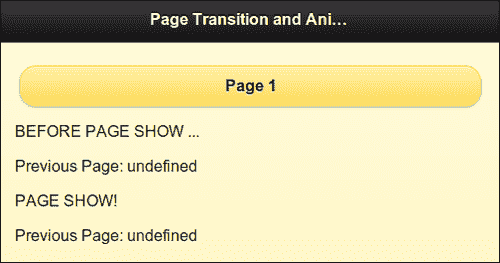

点击**第 1 页**按钮打开`#page`。您可以看到来自`pagebeforehide`和`pagebeforeshow`事件处理程序的消息，说明**当前页面**是**页面**，而**上一页面**是**主**。然后，您可以看到**动画完成！！！**来自`animationComplete()`回调的消息。此时页面可见，`pagehide`和`pageshow`事件的消息也可以看到：

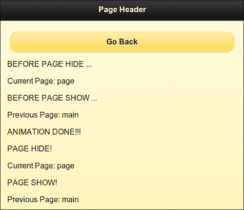

点击**返回**按钮。现在，`#main`显示，消息显示与之前一样。本次**当前页面**为**主**，上一页面为**页面**：

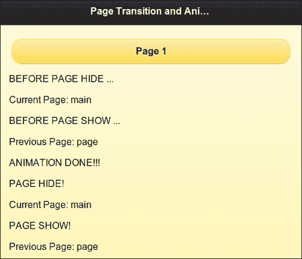

## 还有更多。。。

在第一次加载时，和`pageshow`事件处理程序显示一个空的`data.nextPage`对象。要在第一次加载时显示正确的值，这两个事件必须在页面加载时和加载`jquery.mobile.js`脚本文件之前绑定到`mobileinit`处理程序中的回调函数，如以下代码段所示：

```js
<script>
 $(document).bind("mobileinit", function() {
    $(document).bind("pagebeforeshow", function(event, data) {
    alert(data.nextPage);
  });
  $(document).bind("pageshow", function(event, data) {
    alert(data.nextPage);
  });
});
</script>
<script src="http://code.jquery.com/mobile/1.1.1/jquery.mobile-1.1.1.min.js"></script>
```

## 另见

*   [第 7 章](07.html "Chapter 7. Configurations")*配置*中的*配置默认转换*配方

# 使用布局事件

组件如列表视图和可折叠块通过用户交互动态调整大小。这可能导致控制重叠或定位问题。为了防止这种情况发生，这些组件触发`updatelayout`事件，jQueryMobile 框架更新整个文档并确保所有组件的布局正确。本食谱向您展示了如何使用`updatelayout`事件。

## 准备好了吗

从`code/08/layout`源文件夹复制此配方的完整代码。您可以使用 URL`http://localhost:8080/08/layout/main.html`启动此代码。

## 怎么做。。。

执行以下步骤：

1.  创建带有三个可折叠块和一个`<div>`容器的`main.html`，如下面的代码片段所示：

    ```js
    <div data-role="content">
     <div id="msgdiv">Collapsible Blocks</div>
      <div data-role="collapsible" data-theme="a" data-
        collapsed="false">
        <h3>Tallest Mountain</h3>
        Mt. Everest
      </div>
      <div data-role="collapsible" data-theme="a" data-
        collapsed="false">
        <h3>Longest River</h3>
        R. Nile
      </div>
      <div data-role="collapsible" data-theme="a" data-
        collapsed="false">
        <h3>Largest Ocean</h3>
        Pacific
      </div>
    </div>
    ```

2.  将以下脚本添加到`<head>`部分，以处理`updatelayout`事件：

    ```js
    $("#main").live("pageshow", function(event, ui) {
     $("div").bind("updatelayout", function(event) {
        $("#msgdiv").html("updatelayout on : " + event.target.innerHTML);
      });
    });
    ```

## 它是如何工作的。。。

在`main.html`中，在页面内容中添加一个带有`id="msgdiv"`的`div`容器。添加三个具有`data-collapsed="false"`属性的可折叠块。添加给定脚本以将`pageshow`事件（在页面显示时触发）绑定到事件处理程序。这里，将`updatelayout`事件绑定到回调函数。在此回调中，使用`event.target.innerHTML`属性获取调用`updatelayout`事件的可折叠块的文本。在`msgdiv`块中显示，如图所示。现在，当您加载页面时，可以看到三个可折叠块已展开。

点击第一个显示为**最高山峰**的区块。您将看到它崩溃，`msgdiv`文本被更新，显示**updatelayout 在：珠穆朗玛峰**上，如以下屏幕截图所示：

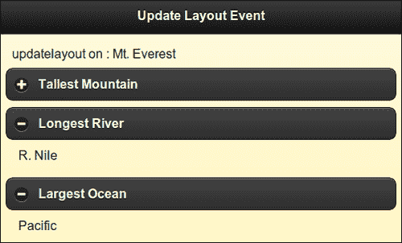

## 还有更多。。。

当您添加或操作组件或在页面中切换组件的可见性时，jQuery Mobile framework 会根据大多数场景的需要更新布局并调整位置。您必须在这些元素上触发`create`或`refresh`方法。但在某些情况下，当您添加或操作控件或切换其可见性时，框架可能无法正确处理定位。在这种情况下，您可以触发`updatelayout`事件并通知框架更新所有组件并重新定位它们。您可以使用以下代码执行此操作：

```js
(yourselector).trigger("updatelayout");
````