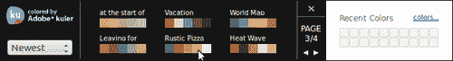

# 十、主题框架

在本章中，我们将介绍以下配方：

*   设置嵌套列表的主题
*   使用自定义背景
*   使用自定义字体
*   造型角
*   覆盖全局活动状态主题
*   覆盖现有样例
*   使用 ThemeRoller 工具创建样例

# 导言

jQueryMobile 框架提供了一个轻量级主题化系统，它支持许多 CSS3 属性，例如圆角、阴影、和渐变。它还提供了一个轻量级的精灵图标集，您可以在移动应用中使用（图标精灵在[第 4 章](04.html "Chapter 4. Buttons and Content Formatting")、*按钮和内容格式*中介绍）。框架提供了五个默认样例（**a**到**e**，最多支持 26 个样例。这些样例可以为您的应用提供不同的外观。

# 创建嵌套列表的主题

当您将一个嵌套列表设置为与页面主题不同的主题时，列表子页面与主页面相比看起来不一致。这在*使用嵌套列表*配方的[第 6 章](06.html "Chapter 6. List Views")、*列表视图*中进行了描述。这个食谱向您展示了如何以一致的方式为嵌套列表设置主题。

## 准备好了吗

从`code/10/nested-list`文件夹中复制此配方的完整代码。您可以使用 URL`http://localhost:8080/10/nested-list/main.html`启动此代码。

## 怎么做。。。

1.  创建带有嵌套列表的`#main`页面的`main.html`，如下所示：

    ```js
    <div id='main' data-role='page' data-theme='a'>
      <div data-role='header' data-theme='a'>
        <h1>Movies</h1>
      </div>
      <div data-role='content'>
        <ul data-role='listview' data-header-theme='a' data-
          theme='b' data-inset='true'>
          <li><a href='#'>Director 1</a>
            <ul data-role='listview' data-inset='true'>
              <li><a href='#'>Movie 1</a></li>
              <li><a href='#'>Movie 2</a></li>
              <li><a href='#'>Movie 3</a></li>
            </ul>
          </li>
     <li><a href='#'>Director 2</a>
     <ul data-theme='a' data-role='listview' data-
     inset='true'>
     <li data-theme='b'><a href='#'>Movie A</a></li>
              <li data-theme='b'><a href='#'>Movie B</a></li>
              <li data-theme='b'><a href='#'>Movie C</a></li>
            </ul>
          </li>
        </ul>
      </div>
    </div>
    ```

## 它是如何工作的。。。

在`main.html`中，在`#main`页面中添加`data-theme='a'`以赋予其黑色主题。添加带有`data-theme='a'`的黑色标题。使用`data-theme='b'`向页面内容添加蓝色列表视图。使用`data-header-theme='a'`将其标题设置为黑色。在此列表中添加两项，**导演 1**和**导演 2**。该列表现在将显示在以下屏幕截图中：


将嵌套列表添加到这两个列表项中。第一个嵌套列表未指定任何其他主题属性。点击第一个列表项时，显示**导演 1**的电影子页面。您会注意到子页面的背景为`data-theme='b'`，与主页面不一致，如下图所示：


现在，在第二个嵌套列表上设置`data-theme='a'`。将`data-theme='b'`属性添加到每个嵌套列表项。这将创建具有黑色背景的子页面。嵌套列表项得到蓝色。出现子页面，如下面的屏幕截图所示；它现在与主页一致：


## 另见

*   在[第 6 章](06.html "Chapter 6. List Views")*列表视图*中*使用嵌套列表*配方

# 使用自定义背景

此配方向您展示如何在应用中使用自定义背景。

## 准备好了吗

从`code/10/custom-background`源文件夹复制此配方的完整代码。您可以使用 URL:`http://localhost:8080/10/custom-background/main.html`启动此代码。

## 怎么做。。。

1.  创建`main.html`并在`<head>`部分定义`orangebar`和`orangebody`类，如下所示：

    ```js
    <style>
     .orangebar {
        border: 1px solid #e3b264;
        background: #f7e0bb;
        color: #000;
        text-shadow: 0 1px 0 #bfbfbf;
        background-image: -webkit-gradient(linear, left top, 
          left bottom,
          from( #f7e0bb ), to( #f7bd5e ));
        background-image: -webkit-linear-gradient( #f7e0bb , 
          #f7bd5e );
        background-image: -moz-linear-gradient( #f7e0bb , 
          #f7bd5e );
        background-image: -ms-linear-gradient( #f7e0bb , 
          #f7bd5e );
        background-image: -o-linear-gradient( #f7e0bb , 
          #f7bd5e );
        background-image: linear-gradient( #f7e0bb , #f7bd5e );
      }
     .orangebody {
        border: 1px solid #e3b264;
        background: #f4ffde;
        color: #000;
        text-shadow: 0 1px 0 #bfbfbf; 
        background-image: -webkit-gradient(linear, left top, 
          left bottom,
          from( #fef9f1 ), to( #f2d5a6 ));
        background-image: -webkit-linear-gradient( #fef9f1 , 
          #f2d5a6 );
        background-image: -moz-linear-gradient( #fef9f1 , 
          #f2d5a6 );
        background-image: -ms-linear-gradient( #fef9f1 , 
          #f2d5a6 );
        background-image: -o-linear-gradient( #fef9f1 , 
          #f2d5a6 );
        background-image: linear-gradient( #fef9f1 , #f2d5a6 );
      }
    </style>
    ```

2.  在`#main`页面中增加，内容如下：

    ```js
    <div id='main' data-role='page' class='orangebody'>
     <div data-role='header' class='orangebar'>
        <h1>Orange Background</h1>
      </div>
      <div data-role='content'>
        <p>Page Content</p>
      </div>
    </div>
    ```

## 它是如何工作的。。。

在`main.html`中，定义`<style>`标记中的`orangebar`和`orangebody`类。定义`border`、`background`和`background-image`CSS 属性的值。为`background-image`属性指定具有多个供应商特定值的线性渐变。创建`#main`页面并设置页面样式以使用`orangebody`类。设置标题样式以使用`orangebar`类。页面现在显示为橙色背景，如以下屏幕截图所示：


## 还有更多。。。

此食谱向您展示如何快速更改页面背景及其标题。但是，如果您向该页面添加按钮或任何控件，该控件将获得默认主题，并且看起来不合适。您必须为控件设置主题以匹配页面。您可以使用[提供的 jQuery Mobile**ThemeRoller**工具创建主题或修改现有主题，而不是手动设置每个元素的主题 http://www.jquerymobile.com/themeroller](http://www.jquerymobile.com/themeroller) 。

### 注

最好使用单独的 CSS 文件来存储样式信息。通过这种方式，样式与 HTML 或文档结构保持分离，使得以后更容易维护和升级样式。

## 另见

*   *使用 ThemeRoller 工具对活动状态*和*进行主题化，以创建样本*配方
*   *在[第 2 章](02.html "Chapter 2. Pages and Dialogs")、*页面和对话框*中使用 CSS 创建跳转页面转换*配方：该配方提供了供应商前缀的详细信息

# 使用自定义字体

jQueryMobile 框架默认使用 Helvetica、Arial 和无衬线字体。此配方显示如何在应用中包含和使用其他字体。

## 准备好了吗

从`code/10/custom-font`源文件夹复制此配方的完整代码。本配方中使用的**Komika TrueType 字体**位于`code/resources/font`文件夹中。**切分网页字体**来自**谷歌网页字体**网站。您可以使用 URL:`http://localhost:8080/10/custom-font/main.html`启动此代码。

## 怎么做。。。

1.  创建`main.html`，并将链接添加到 Syncopate Google web 字体样式表，如下所示：

    ```js
    <link rel='stylesheet' href='http://code.jquery.com/mobile/1.1.1/jquery.mobile-1.1.1.min.css' />
    <link rel='stylesheet' href='http://fonts.googleapis.com/css?family=Syncopa
    te:400,700'/> 

    ```

2.  定义样式类以使用`<style>`标记中的两种自定义字体：

    ```js
    <style>
      h1 {font-family: 'Syncopate', sans-serif; }
      .divstyle {font-family: 'Syncopate'; font-weight: 400; }  
     @font-face { 
     font-family: KomikaDisplay; 
        src: url('../../resources/font/Komika_display.ttf'); 
      }
     .komikafont { font-family: KomikaDi
    splay; }
    </style>
    ```

3.  使用如下自定义字体添加`#main`页面容器：

    ```js
    <div id='main' data-role='page' data-theme='a'>
      <div data-role='header'>
        <h1>Custom Font</h1>
      </div>
      <div data-role='content'>
        <p>In Default font</p>
     <div class='komikafont'><p>In Komika Display Font</p></div>
     <div class='divstyle'><p>In Syncopate Font</p></div>
      </div>
    </div>
    ```

## 它是如何工作的。。。

创建`main.html`、并在包含 jQuery Mobile 样式表后，从 Google Web Fonts 网站添加到切分音样式表的链接，如图所示。使用`font-family`CSS 属性定义标题`h1`以使用切分音和`sans-serif`字体。创建一个名为`divstyle`的 CSS 类，并使用`400`的`font-weight`将`font-family`属性设置为`Syncopate`。要包含 Komika Display TrueType 字体，请使用 CSS`@font-face`功能定义字体系列。将其源指向`.ttf`文件的位置。最后，定义一个`komikafont`类，并将其`font-family`设置为`KomikaDisplay`。

现在，创建标题为`h1`的`#main`页面。标题现在将使用切分网页字体。在页面内容中添加一个带有`class='komikafont'`的`div`标记，此`div`标记中的文本将使用 Komika 显示字体。最后，添加另一个带有`class='divstyle'`的`div`标记，这将使用字体重量为`400`的切分音字体。屏幕将显示如下：


## 还有更多。。。

本食谱向您展示了如何为特定元素使用自定义字体。要在整个应用中全局更改字体，请使用[提供的 jQuery Mobile`ThemeRoller`工具 http://www.jquerymobile.com/themeroller](http://www.jquerymobile.com/themeroller) 。以下屏幕截图显示了正在全局设置的**Verdana**字体：


### 使用 TrueType 字体

现代浏览器大多支持**TrueType****TTF**或**OpenType**字体。如果您针对的是较旧的浏览器或大多数较旧的设备和功能手机，您必须小心，因为`@font-face`可能不支持字体。您可以参考[http://www.caniuse.com/#search=ttf](http://www.caniuse.com/#search=ttf) 获取各种浏览器对 TTF 支持的更新状态。您会注意到旧版本的 iOS 不支持 TTF。您可能必须改用 SVG 字体。

### 下载字体

您可以访问并使用位于[的谷歌网页字体页面中的其他网页字体 http://www.google.com/webfonts](http://www.google.com/webfonts) 。所有的字体都是开源的，可以自由使用。Apostrophic Labs 设计的 Komika 显示字体可在 font Squirrel 网页（[中找到 http://www.fontsquirrel.com/fonts/Komika-Display](http://www.fontsquirrel.com/fonts/Komika-Display) ）。FontSquirrel 网站有大量可用的字体，都是免费的。

## 另见

*   *使用 ThemeRoller 工具创建样本*配方

# 造型角

此配方向您展示了如何使用 jQuery Mobile 中提供的不同角落样式。

## 准备好了吗

从`code/10/corner-styles`源文件夹复制此配方的完整代码。您可以使用 URL:`http://localhost:8080/10/corner-styles/main.html`启动此代码。

## 怎么做。。。

1.  创建`main.html`，并将以下`<style>`标记添加到其`<head>`部分：

    ```js
    <style>
      .mydiv { border: 2px solid #000; margin: 5px; text-align: center; }
    </style>
    ```

2.  在布局网格中创建包含四个`div`元素的`#main`页面，如下所示：

    ```js
    <div id='main' data-role='page' data-theme='a'>
     <div data-role='header' data-theme='e'  class='ui-
     corner-top' style='margin-top: 10px'>
        <h1>Header Text</h1>
      </div>
      <div id='content' data-theme='e' data-role='content'>
        <fieldset data-role='controlgroup' data-
          type='horizontal' class='ui-grid-a'>
          <div class='ui-block-a ui-corner-tl mydiv' 
            style='width: 45%'><p>Top Left</p></div>
          <div class='ui-block-b ui-corner-tr mydiv' 
            style='width: 45%'><p>Top Right</p></div>
          <div class='ui-block-a ui-corner-bl mydiv' 
            style='width: 45%'><p>Bottom Left</p></div>
          <div class='ui-block-b ui-corner-br mydiv' 
            style='width: 45%'><p>Bottom Right</p></div>
        </fieldset>
      </div>
     <div data-role='footer' class='ui-corner-bottom' data-
     theme='e'>
        <h4>Footer Text</h4>
      </div>
    </div>
    ```

## 它是如何工作的。。。

在`main.html`中，使用边框、边距和居中对齐的文本定义`.mydiv`类，如图所示。创建`#main`页面，并使用`class='ui-corner-top'`设置标题样式。这将在收割台的顶部侧添加拐角。用`class='ui-corner-bottom'`定义页脚，为页脚添加底角。不要在内容`div`中添加任何样式，因此默认使用`class='ui-corner-none'`样式。现在，使用两列布局网格（`grid-a`在两行中添加四个`div`标记。使用`mydiv`类设置这些`div`标记的样式。另外，将不同的角样式（`ui-corner-tl`、`ui-corner-tr`、`ui-corner-bl`和`ui-corner-br`分别添加到这些`div`标记中。四个`div`标记的样式如下：


## 还有更多。。。

您可以使用[提供的 jQuery Mobile`ThemeRoller`工具全局设置角半径 http://www.jquerymobile.com/themeroller](http://www.jquerymobile.com/themeroller) 。


## 另见

*   *使用 ThemeRoller 工具创建样本*配方
*   [第 5 章](05.html "Chapter 5. Forms")*表单*中的*网格*配方分组单选按钮

# 覆盖全局活动状态主题

jQueryMobile 框架使用明亮的蓝色来表示按钮和其他控件的活动状态。此**活动状态**主题与所有默认样例一致，不能通过标记覆盖。此配方向您展示了如何覆盖活动状态主题。

## 准备好了吗

从`code/10/active-state`源文件夹复制此配方的完整代码。您可以使用 URL:`http://localhost:8080/10/active-state/main.html`启动此代码。

## 怎么做。。。

1.  创建`active-state.css`样式表来设置活动状态的样式，如下所示： ```js`
    .ui-btn-active {
      border: 1px solid #137000;
      background: #93ff86;
      font-weight: bold;
      color: #000;
      text-shadow: 0 1px 1px #eee;
      cursor: pointer;
      text-decoration: none;
      background-image: -webkit-gradient(linear, left top, 
        left bottom, from( #a1ff93), to( #14b800));
      background-image: -webkit-linear-gradient( #a1ff93, 
        #14b800);
      background-image: -moz-linear-gradient( #a1ff93, 
        #14b800);
      background-image: -ms-linear-gradient( #a1ff93, 
        #14b800);
      background-image: -o-linear-gradient( #a1ff93, 
        #14b800);
      background-image: linear-gradient( #a1ff93, #14b800);
      font-family: Helvetica, Arial, sans-serif;
    }
    ```` 
`*   指定对焦事件的样式：

    ```js
    .ui-focus, .ui-btn:focus {
      -moz-box-shadow: 0px 0px 12px #37bf37;
      -webkit-box-shadow: 0px 0px 12px #37bf37;
      box-shadow: 0px 0px 12px #37bf37;
    }
    ```

    *   指定复选框和单选按钮控件的打开状态样式：

    ```js
    .ui-checkbox-on .ui-icon, .ui-radio-on .ui-icon {
      background-color: #50cf44;
    }
    ```

    *   在`main.html`：

    ```js
    <link rel='stylesheet' href='http://code.jquery.com/mobile/1.1.1/jquery.mobile-1.1.1.min.css' />
    <link rel='stylesheet' href='./active-state.css' />

    ```

    中包含前面的样式表*   现在，在`#main`页面

    ```js
    <div id='main' data-role='page' data-theme='a'>
      <div data-role='header'>
        <h1>Active State</h1>
        <div data-role='navbar'>
          <ul>
            <li><a href='#'>Nav1</a></li>
     <li><a href='#' class='ui-btn-
     active'>Nav2</a></li>
            <li><a href='#'>Nav3</a></li>
          </ul>
        </div>
      </div>
    ```

    中创建一个带有`navbar`控件的标题*   最后，通过水平复选框、垂直复选框和滑块添加页面内容，如下所示：

    ```js
      <div data-role='content'>
        <div data-role='fieldcontain'>
          <fieldset data-role='controlgroup' data-
            type='horizontal'>
            <legend>CheckBox</legend>
            <input type='checkbox' name='hchkbox' 
              id='hchkbox'/>
            <label for='hchkbox'>Horizontal</label>
          </fieldset>
        </div>
        <div data-role='fieldcontain'>
          <fieldset data-role='controlgroup'>
            <legend>CheckBox</legend>
            <input type='checkbox' name='vchkbox' 
              id='vchkbox'/>
            <label for='vchkbox'>Vertical</label>
          </fieldset>
        </div>    
        <div data-role='fieldcontain'>
          <label for='sldr'>Input slider:</label>
          <input type='range' name='sldr' id='sldr' 
            value='50' min='0' max='100' data-
            highlight='true' />
        </div>
      </div>
    </div>
    ```` 

 `## 它是如何工作的。。。

创建`active-state.css`样式表，将样式信息与 HTML 文件分开。默认情况下，复选框和单选按钮控件的活动状态、打开焦点事件以及打开状态样式使用亮蓝色主题。您可以在 CSS 文件中覆盖它们，如代码所示。首先，覆盖`.ui-btn-active`类，并指定您对`border`、`background`、`color`和`background-image`CSS 属性的设置。接下来，覆盖`.ui-focus`和`.ui-btn:focus`类，并指定框阴影的颜色。`ui-checkbox-on`和`.ui-radio-on`样式，如代码所示。

创建`main.html`，在表头添加`navbar`控件。将`ui-btn-active`类添加到`navbar`中的第二个链接中。当页面加载时，您将看到在第二个链接上设置的活动状态。接下来，添加一组水平和垂直的复选框控件。最后，向页面添加一个输入滑块。页面现在加载，如以下屏幕截图所示，默认的亮蓝色活动状态主题替换为荧光绿色主题：


## 还有更多。。。

您还可以使用[上提供的 jQuery Mobile ThemeRoller 工具全局设置活动状态主题 http://www.jquerymobile.com/themeroller](http://www.jquerymobile.com/themeroller) 。


## 另见

*   *使用 ThemeRoller 工具创建样本*配方
*   *在[第 2 章](02.html "Chapter 2. Pages and Dialogs")、*页面和对话框*中使用 CSS 创建跳转页面转换*配方：该配方提供了关于供应商前缀的说明
*   [第 7 章](07.html "Chapter 7. Configurations")*配置*中的*配置活动类*配方

# 覆盖现有样本

jQueryMobile 框架使用`ui-btn-hover`类来主题化**按钮悬停**事件。此配方向您展示了如何覆盖现有样例的按钮悬停事件的样式。

## 准备好了吗

从`code/10/button-hover`源文件夹复制此配方的完整代码。您可以使用 URL:`http://localhost:8080/10/button-hover/main.html`启动此代码。

## 怎么做。。。

1.  创建`main.html`，并在`<head>`部分添加以下`<style>`标签：

    ```js
    <link rel='stylesheet' href=
      'http://code.jquery.com/mobile/1.1.1/jquery.mobile-
      1.1.1.min.css' />
    <style>
     .ui-btn-hover-a {
        border: 1px solid #115e00;
        background: #51b54a;
        font-weight: bold;
        color: #fff;
        text-shadow: 0 1px 1px #197d19;
        background-image: -webkit-gradient(linear, left top, 
          left bottom, from( #7ad66f), to( #41a343));
        background-image: -webkit-linear-gradient( #7ad66f, 
          #41a343);
        background-image: -moz-linear-gradient( #7ad66f, 
          #41a343);
        background-image: -ms-linear-gradient( #7ad66f, 
          #41a343);
        background-image: -o-linear-gradient( #7ad66f, 
          #41a343);
        background-image: linear-gradient( #7ad66f, #41a343);  }
    </style>
    ```

2.  创建`#main`页面，并在页面内容中添加一个按钮：

    ```js
      <a href='#' data-role='button'>button</a>
    ```

## 它是如何工作的。。。

在`main.html`中，链接 jQuery Mobile 样式表后，定义`.ui-btn-hover-a`类的覆盖，如代码所示。指定`border`、`background`、`color`、`text-shadow`和`background-image`CSS 属性。使用`data-theme='a'`创建`#main`页面，并在页面内容中添加一个按钮。加载页面，在按钮悬停时，您将看到按钮得到明亮的绿色，而不是默认的悬停样式，如下面的屏幕截图所示：


## 还有更多。。。

您还可以使用[上提供的 jQuery Mobile ThemeRoller 工具为**样例 A**设置悬停按钮主题 http://www.jquerymobile.com/themeroller](http://www.jquerymobile.com/themeroller) 。


### 按钮 markup.hoverDelay 配置

您可以通过在`mobileinit`上设置`buttonMarkup.hoverDelay`（默认为`200`毫秒）配置来配置按钮悬停的延迟。但是要小心，因为使用太大或太小的值会影响用户体验。可以使用以下代码配置此属性：

```js
$(document).bind('mobileinit', function() {
  $.mobile.buttonMarkup.hoverDelay = 500;
});
```

## 另见

*   *使用 ThemeRoller 工具创建样本*配方
*   *在[第 2 章](02.html "Chapter 2. Pages and Dialogs")、*页面和对话框*中使用 CSS 创建跳转页面转换*配方：该配方提供了关于供应商前缀的说明

# 使用 ThemeRoller 工具创建样例

此配方向您展示了如何使用 jQueryMobile ThemeRoller web 工具创建样例。

## 准备好了吗

此配方中的代码是使用[上提供的 jQueryMobile ThemeRoller web 工具创建的 http://www.jquerymobile.com/themeroller](http://www.jquerymobile.com/themeroller) 。该代码位于`code/10/myTheme`源文件夹中。您可以使用 URL`http://localhost:8080/10/myTheme/index.html`启动此代码。

## 怎么做。。。

1.  使用 jQueryMobile ThemeRoller 工具生成`myTheme.css`文件。它包含在生成的`index.html`文件中，如下所示：

    ```js
    <link rel='stylesheet' href='themes/myTheme.min.css' />
    <link rel="stylesheet" 
     href="http://code.jquery.com/mobile
     /1.1.1/jquery.mobile.structure-1.1.1.min.css" />
    <script src="http://code.jquery.com/jquery-1.7.1.min.js">
    </script>
    <script src="http://code.jquery.com/mobile/
      1.1.1/jquery.mobile-1.1.1.min.js"></script>
    ```

2.  `index.html`中的`<body>`内容生成如下：

    ```js
    <div data-role="page" data-theme="a">
      <div data-role="header" data-position="inline">
        <h1>It Worked!</h1>
      </div>
      <div data-role="content" data-theme="a">
        <p>
          Your theme was successfully downloaded. You can use 
            this page as a reference for how to link it up!
        </p>
        <pre> .... </pre>
        <p>
          This is content color swatch "A" and a preview of a 
            <a href="#" class="ui-link">link</a>.
        </p>
        <label for="slider1">Input slider:</label>
        <input type="range" name="slider1" id="slider1" 
          value="50" min="0" max="100" data-theme="a" />
        <fieldset data-role="controlgroup"  data-
          type="horizontal" data-role="fieldcontain">
          <legend>Cache settings:</legend>
          <input type="radio" name="radio-choice-a1" id=
            "radio-choice-a1" value="on" checked="checked" />
          <label for="radio-choice-a1">On</label>
          <input type="radio" name="radio-choice-a1" id=
            "radio-choice-b1" value="off"  />
          <label for="radio-choice-b1">Off</label>
        </fieldset>
      </div>
    </div>
    ```

## 它是如何工作的。。。

启动 jQuery 移动 ThemeRoller web 工具。您将在左侧窗格**检查器窗格**中看到可用的样例。样例始终以**A**开始，您可以添加、复制或删除样例。其他样例立即按字母顺序排序。您最多可以创建 26 个样例（**A**到**Z**。您可以在**检查器**窗格中直接修改 CSS 属性。


您也可以使用屏幕顶部提供的**Adobe Kuler**样本条来代替手动输入颜色。将所选颜色直接拖放到预览屏幕中的组件上。组件将立即使用新颜色进行更新。


您可以单击“Kuler 样例”链接，并访问联机提供的多种随时可用的颜色组合。



现在，在屏幕组件上拖放您选择的颜色。您将看到屏幕预览（如下图所示）立即反映主题更改。您还可以在此处设置活动状态的主题。


主题完成后，点击屏幕顶部的**下载**按钮即可下载。提供名称并下载 zip 文件。zip 文件包含所需的图标、CSS 文件以及一个示例`index.html`文件。提取这些文件并打开`index.html`文件时，将显示新主题。


### 注

生成的`index.html`文件中未使用`jquery.mobile.css`文件。相反，它包含指向`myTheme.css`（用于自定义主题）和`jquery.mobile.structure.css`（与结构相关的 CSS 属性）的链接。将可设置主题的属性分开可以更容易地维护、升级和共享您的主题。

## 还有更多。。。

您可以使用 ThemeRoller 工具顶部的**Inspector 开/关**按钮同步**预览**窗格和**Inspector**窗格。将鼠标悬停在**预览**窗格中的任何控件上，会突出显示带有蓝色边框的控件。单击该控件以在**检查器**窗格中打开其 CSS 设置。这在开发主题时非常方便。

### 导入和升级主题

您可以将现有 CSS 主题导入 ThemeRoller 工具，并对其进行扩展以创建新主题。您还可以使用 ThemeRoller 将 jQuery Mobile 主题的旧版本升级到最新的 v1.1.1。点击**ThemeRoller**屏幕顶部的**导入**或**升级**按钮，打开**导入主题**对话框。


您可以复制粘贴现有主题，然后点击**导入**按钮。新升级的主题已准备就绪并加载到工具中。您还可以通过点击**导入**对话框顶部的**导入默认主题**选项，加载 jQueryMobile 框架提供的默认主题。这会将五个默认样例加载到 Meroller 中。现在可以使用此集合作为创建新主题的起点。

### 分享主题

ThemeRoller 工具还提供了一个很酷的功能，可以与他人共享您的工作。点击工具顶部的**共享主题链接**按钮，获取您可以与他人共享的链接。任何具有此链接的人都可以直接访问、使用或处理主题的副本。`