# 十一、HTML5 和 jQuery Mobile

在本章中，我们将介绍以下配方：

*   使用新的 HTML5 语义
*   提高速度并使应用脱机
*   使用 Web Workers 执行密集型任务
*   使用本地和会话存储
*   带画布的二维绘图
*   在 SVG 图像上应用高斯模糊
*   使用地理定位 API 跟踪您的位置
*   使用`<audio>`元素播放音乐
*   使用`<video>`元素观看视频

# 导言

HTML5 引入了新的语义和许多新的酷炫功能，如应用缓存、2D 画布、地理位置、本地和会话存储、网络工作者以及对音频和视频的支持。jQueryMobile 框架构建在 HTML5 和 CSS3 之上，为这些新语义和新特性提供了极好的支持。本章介绍可以在 jQueryMobile 应用中使用的一些功能。

### 注

网上有很多学习 HTML5 的资源。举几个例子，您可以在 HTML5 Rocks（[上阅读更多内容 http://www.html5rocks.com/en](http://www.html5rocks.com/en) 、HTML5 演示（[http://www.html5demos.com](http://www.html5demos.com) 、Mozilla 开发者网络（[https://developer.mozilla.org/en-US/docs/HTML/HTML5](https://developer.mozilla.org/en-US/docs/HTML/HTML5) ）。

在各种浏览器和平台上对 HTML5 元素和功能的支持各不相同。在使用特定功能时，您必须小心，并确保它在您的目标平台上工作。这一支持水平与日俱增。

### 注

[http://www.caniuse.com](http://www.caniuse.com) 对各种 HTML5 功能可用的平台支持的更新状态有很好的参考。

# 使用新的 HTML5 语义

HTML5 定义了新的语义，以便更好地将 HTML 文档组织成更具逻辑性的部分。这个方法向您展示了如何使用新的 HTML5 语义来定义 jQueryMobile 应用。本配方涵盖以下 HTML5 元素：

*   `section`：此定义了文档中的节。页眉、页脚和页面内容都是部分。
*   `header`：此定义单据头。
*   `footer`：此定义单据页脚。
*   `aside`：此定义了与文档主要内容相关的附加内容，通常作为边栏放置。
*   `article`：此定义了与文档相关的内容，但也可以独立发布。
*   `nav`：这是一个提供导航链接的部分，可以包含一个或多个锚链接。

## 准备好了吗

从`code/11/semantics`文件夹复制此配方的完整代码。您可以使用 URL:`http://localhost:8080/11/semantics/main.html`启动此代码。

## 怎么做。。。

应遵循的步骤如下：

1.  创建`main.html`，为页面使用新的 HTML5 语义；请勿在此处使用`<div>`标签：

    ```js
    <section id='main' data-role='page' data-theme='a'>
     <header data-role='header' data-theme='b'>
        <h1>New HTML5 Tags</h1>
      </header>
     <section data-role='content'>
        Main content goes here
     <aside style='border: 2px; border-style: solid; 
     border-color: #666'> 
          <h3>Aside</h3>
          Standalone content but related to main
        </aside>
        <section>
          <h3>Articles</h3>
     <article>
            <h4>Item 1</h4>
            Item 1 description here            
          </article>
          <article>
            <h4>Item 2</h4>
            Item 2 description here           
          </article>
        </section>
      </section>
     <footer data-role='footer' data-theme='b'>
     <nav class='ui-bar' data-theme='d'>
          <a href='#' data-role='button'>Link 1</a> 
          <a href='#' data-role='button' class='ui-btn-
            right'>Link 2</a>          
        </nav>
      </footer>
    </section>
    ```

## 它是如何工作的。。。

创建`main.html`，并使用带有`data-role='page'`属性的`<section>`标记向其添加`#main`页面。添加带有`data-role='header'`的`<header>`标记以创建页眉。接下来，添加一个带有`data-role='content'`的`<section>`标记来创建页面内容部分。最后，添加带有`data-role='footer'`属性的`<footer>`标记的页脚。现在，您已经准备好了带有页眉、内容和页脚的页面。您会注意到`<div>`到目前为止还没有被使用。

将`<aside>`和`<article>`元素添加到页面内容中，如代码所示。由于有多篇文章，您可以将它们分组到一个`<section>`元素中。最后，添加一个带有两个按钮链接的`<nav>`元素到页脚。添加`ui-btn-right`类，将第二个按钮移动到屏幕右侧。现在，当您启动应用时，将显示以下屏幕：

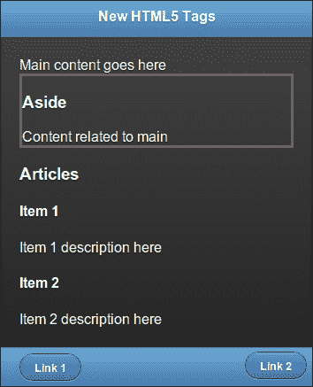

## 还有更多。。。

HTML5 支持更多的新元素，例如：

*   `figure`：此用于包含图像、照片、图表、插图等。
*   `figcaption`：此定义了`<figure>.`的标题
*   `hgroup`：此用于分组一组头元素（`<h1>`、`<h2>`等）。
*   `mark`：此用于突出显示文本。
*   `meter`：用于指定最小-最大范围内的数值。还可以指定阈值（低和高）。
*   `progress`：此表示进度。
*   `time`：用于标记日期/时间值。

### 关于使用<div>

在 HTML5 之前，`<div>`被用作对元素进行分组的容器。但这并不是很具有描述性。HTML5 文档结构的页眉、页脚等更具描述性和意义。

### 注

使用 HTML5 时，使用`<div>`对不符合任何新 HTML5 元素描述的元素进行分组，例如`<section>`。

### 使用 jQuery Mobile 的<部分>

对 HTML5 语义的支持是多种多样的，并且在当今市场上的众多平台中不断改进。从 v1.1.1 开始，jQueryMobile 框架建议使用带有`data-role`属性的`<div>`元素来指定各种页面组件，例如页眉和页脚。这是为了确保与旧版本浏览器（如 IE8）的兼容性，并支持最大数量的设备和平台。这在不久的将来 jquerymobile 版本中肯定会改变，因为对旧浏览器的支持将被取消。在那之前，使用新的 HTML5 元素，记住你的目标用户。

# 提高速度，让应用离线

HTML5 引入了一个名为**应用缓存**的新功能，允许您的 web 应用在本地缓存网络资源。您还可以比早期的浏览器缓存技术更好地控制和配置此缓存。使用应用缓存，您的移动应用可以更好地工作，即使在网络覆盖缓慢或没有网络覆盖的情况下也是如此。你的应用速度更快，因为它可以找到许多存储在本地的资源，而不是从服务器获取它们。这也有助于用户降低服务提供商收取的数据传输成本。

此配方向您展示了如何在 jQueryMobile 应用中使用应用缓存功能。它还向您展示了如何使用本地存储的 jQueryMobile 库，而不是从 CDN 获取库文件。

## 准备好了吗

从`code/11/appcache`文件夹复制此配方的完整代码。您必须在 web 服务器上托管此代码，才能查看应用缓存的工作方式。`sources`文件夹包含一个`nodejs`web 服务器，可用于运行此应用。您可以使用 URL:`http://localhost:8080/11/appcache/main.html`启动此代码。

## 怎么做。。。

应遵循的步骤如下：

1.  创建`main.html`，并在`<html>`标记中指定清单文件：

    ```js
    <!DOCTYPE html>
    <html manifest="jqmcookbook.appcache"> 

    ```

2.  在`main.html`页面内容中添加以下三个链接：

    ```js
    <div data-role="content">
      <a href="cached.html" data-role="button">CACHE</a>
      <a href="online.html" data-role="button">FALLBACK</a>
      <a href="network.html" data-role="button">NETWORK</a>
    </div>
    ```

3.  创建以下`jqmcookbook.appcache`清单文件并指定要缓存的文件：

    ```js
    CACHE MANIFEST
    *# jQuery Mobile*
     *Cookbook Edition 1.0*

    *# Cached resources (also caching jQuery Mobile files for* offline access)
    CACHE:
    main.html
    cached.html
    http://code.jquery.com/mobile/1.1.1/jquery.mobile-1.1.1.min.css
    http://code.jquery.com/jquery-1.7.1.min.js
    http://code.jquery.com/mobile/1.1.1/jquery.mobile-1.1.1.min.js

    *# offline.html will be displayed as fall back*
    FALLBACK:
    online.html offline.html

    *# Accessible only when online*
    NETWORK:
    network.html
    ```

4.  创建以下`cached.html`文件，该文件由应用缓存，可供脱机访问：

    ```js
    <!-- Cached Page : Cached and works offline too -->  
    <div id="cached" data-role="page">
      <div data-role="content">
        <h1>
          This page is shown from cache and even works when 
            offline
        </h1>
        <a href="#" data-role="button" data-rel="back" 
            data-theme="b">Go Back</a>
      </div>
    </div>
    ```

5.  创建以下`online.html`文件，该文件不会被缓存，每次访问时都会从网络中获取：

    ```js
    <!-- Online Page : Shown only when Online -->  
    <div id="online" data-role="page">
      <div data-role="content">
        <h1>This page is shown only when online</h1>
        <a href="#" data-role="button" data-rel="back" 
            data-theme="b">Go Back</a>
      </div>     
    </div>
    ```

6.  创建以下被缓存的`offline.html`文件，当`online.html`页面无法通过网络访问时用作回退：

    ```js
    <!-- Offline Page : Shown as a fall back -->  
    <div id="offline" data-role="page">
      <div data-role="content">
        <h1>This is a fallback for online.html</h1>
        <a href="#" data-role="button" data-rel="back" 
            data-theme="b">Go Back</a>
      </div>
    </div>
    ```

7.  最后，创建下面的`network.html`文件，该文件不会被缓存，并且总是从网络中获取；它不使用任何回退：

    ```js
    <!-- Network Page : Shown only when online -->
    <div id="network" data-role="page">
      <div data-role="content">
        <h1>This is always fetched from the network</h1>
        <a href="#" data-role="button" data-rel="back" 
            data-theme="b">Go Back</a>
      </div>
    </div>
    ```

## 它是如何工作的。。。

创建`main.html`，并在其`<html>`标记中将`jqmcookbook.appcache`指定为清单文件。这向浏览器指示应缓存 HTML 文件。它还指示必须处理清单文件以查找要在本地缓存的所有资源。为`cached.html`、`online.html`和`network.html`页面添加三个链接，如图所示。这些将用作此配方中缓存的资源。

使用第一行指定的文本`CACHE MANIFEST`创建`jqmcookbook.appcache`清单文件。您可以将注释添加到清单文件中，它们以`#`字符开头。现在，将应用要缓存的资源添加到清单文件中。每个文件名必须位于单独的行上，并且可以使用相对路径或绝对路径。缓存清单文件有三个部分，分别由`CACHE`、`FALLBACK`和`NETWORK`头标识。

定义默认的`CACHE`部分，列出本地应该缓存的文件。本节增加`main.html`和`cached.html`。当您启动应用并点击第一个按钮时，无论设备在线还是离线，它都会打开`cached.html`。

### 注

图像、图标、样式表、JavaScript 和其他静态文件是您应该在本地缓存的资源。

缓存文件仅在第一次下载。当应用尝试访问这些文件时，它们总是首先从缓存中获取，或者只有在不可用时，才从服务器获取。

### 注

在应用中缓存主 HTML 文件（在其`<html>`标记中定义了清单）是一种很好的做法。

接下来，用每行两个文件名定义`FALLBACK`部分。将`online.html`指定为第一个文件，然后将回退指定为`offline.html`。现在，当你点击应用中的第二个按钮时，`online.html`仅在设备在线时显示。如果设备离线，则缓存中会自动显示`offline.html`。在这里，第一个文件总是从网络中获取，并且从不缓存。

最后，定义`NETWORK`部分，其中列出了`network.html`。使用此部分可定义不应在应用中缓存的文件列表。这些文件总是从网络获取的。现在，当您单击第三个按钮时，`network.html`仅在设备联机时显示，如果设备脱机，则显示错误。

## 还有更多。。。

您可以使用目前大多数浏览器提供的开发人员/调试工具在浏览器中查看当前缓存文件的列表。下面的屏幕截图显示了 Chrome 开发者工具的资源视图，这些资源已被缓存用于此配方中的`main.html`文件。清单中列出的文件都可以在**应用缓存**部分看到。

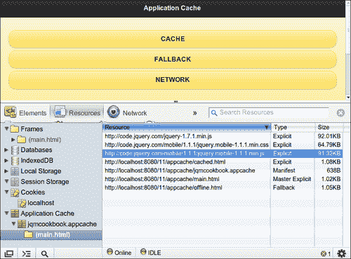

### 缓存大小限制

您可以在本地存储的数据量有浏览器限制。通常是 5 到 10 MBs，需要用户的许可才能超过此限制。某些浏览器（如 Chrome）允许您将此值设置为无限制。因此，请小心缓存文件，并包含您经常访问的资源。还包括使应用脱机所需的资源。

### 刷新应用缓存

每次访问文件`main.html`时，都会提取远程清单文件，并与本地清单文件进行比较。仅当清单已更改（这甚至可能只是一条注释）时，才会获取新的清单文件。然后将清除缓存，并从服务器刷新整个缓存文件集。另一方面，只要向清单文件添加一个新文件，就会触发完全刷新，即使其他文件都没有更改。

### 注

在清单文件的注释中使用版本号是保持缓存文件更新的好方法。

### 清单文件的 MIME 类型

您应该始终为清单文件提供**MIME**类型的文本/缓存清单。您可以将此清单命名为任何名称。您的服务器应该能够识别此 MIME 类型。如果没有，则应将此 MIME 类型添加到服务器配置中。本烹饪书的源代码附带的 nodejs web 服务器已经支持文本/缓存清单 MIME 类型。

### Ajax 预过滤器解决方案

应用缓存在某些浏览器上无法正常工作，在这种情况下需要 Ajax 预过滤解决方案。在这些浏览器中，成功的 Ajax 调用在成功时返回`0`HTTP 状态。为了解决这个问题，您应该使用 jqueryajax 预过滤器，并将`isLocal`属性设置为`true`。有关使用`isLocal`解决方案的详细 github 讨论线程，请访问[https://github.com/jquery/jquery-mobile/issues/1579](https://github.com/jquery/jquery-mobile/issues/1579) 。

## 另见

*   *使用网络工作者完成密集任务*配方
*   [第 2 章](02.html "Chapter 2. Pages and Dialogs")、*页面和对话框*、*预取页面用于更快的导航*和*使用 DOM 缓存提高性能*配方

# 使用网络工作者完成密集任务

当您运行执行复杂或冗长活动的脚本时，浏览器线程将冻结，直到任务完成后才会响应。这可以通过使用 Web Worker 来克服，Web Worker 是一个与后台无关的线程，用于运行 JavaScript。浏览器线程未被阻止，因此可以继续响应用户操作。这个食谱向你展示了如何使用网络工作者。

## 准备好了吗

从`code/11/webworkers`文件夹复制此配方的完整代码。您可以使用 URL:`http://localhost:8080/11/webworkers/main.html`启动此代码。

## 怎么做。。。

需要执行的步骤如下：

1.  创建带有复选框和滑块作为其页面内容的`main.html`：

    ```js
    <div data-role='content'>
      <div id='msgdiv'></div>
      <div data-role='fieldcontain'>
        <input type="range" name="myslider" id="myslider" 
          value='0' min="0" max="100" />
        <label for="myslider">Slide me:</label>
      </div>
      <div data-role='fieldcontain'>
        <input type="checkbox" name="countchk" id="countchk" />
        <label for="countchk">Count with Webworkers</label>        
      </div>
    </div>
    ```

2.  添加以下脚本以在单击复选框时触发长时间运行的循环。选中时，循环在 Web worker 中运行，没有 UI 冻结，您可以继续使用该页面。当复选框未选中时，所有内容立即冻结，直到循环完成。

    ```js
    $('#main').live('pageinit', function(event) {
      $('#countchk').bind('change', function(event, ui) {
        if($('#countchk').prop("checked")) {
          $('#msgdiv').html('Worker is counting ...');
     var myworker = new Worker('webworker.js');
     myworker.onmessage = function(event) {
          $('#msgdiv').html(event.data);
        }
     myworker.postMessage('start'); 
      } else {
        $('#msgdiv').html('Started Counting ...');        	

        var count = 0;
        for (var i=1; i<=10000000000; i++)
          count++;
          $('#msgdiv').html('Loops : ' + count);                      

        }
      });
    });
    ```

3.  最后，添加`webworker.js`JavaScript 文件来处理循环：

    ```js
    self.onmessage = function(event) {
      var count = 0;
      for (var i=1; i<10000000000; i++)
        count++;
     self.postMessage('Worker Loops : ' + count);
    };
    ```

## 它是如何工作的。。。

创建`main.html`，并在`#main`的内容中添加一个滑块和一个带有`id='countchk'`的复选框。另外，添加一个空的`#msgdiv`属性来显示消息。将复选框的`change`事件绑定到`pageinit`回调中的事件处理程序。

选中该复选框后，触发 Web Worker 中的循环。通过调用`new Worker()`启动 Web Worker，并将 JavaScript`webworker.js`文件的名称传递给它。定义`onmessage`事件处理程序来处理工作程序接收到的消息。您可以在`#msgdiv`中显示此消息。最后，通过发布一条`start`消息来调用 worker。此消息可以是任何内容，必须在 worker 中编写代码才能处理它。在文件`webworker.js`中，定义`onmessage`回调以处理来自浏览器线程的传入消息。运行循环并向主线程返回适当的消息。

启动页面并选中复选框时，循环将在 Web Worker 中启动。即使循环仍在运行，也可以使用滑块查看页面中正在更新的消息：

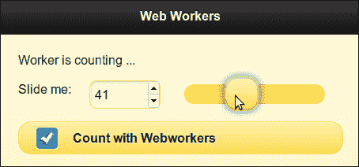

如果未选中该复选框，循环将在主浏览器线程本身中运行。现在，甚至在复选框可以反映您的单击之前，整个 UI 都会冻结，并且 UI 只有在循环完成后才会响应：

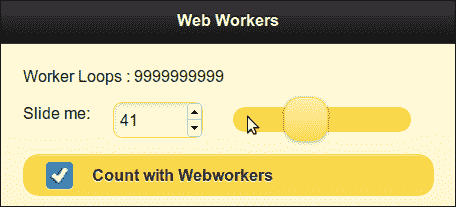

## 还有更多。。。

并非所有浏览器都支持 Web Workers。您可以通过调用以下代码来检查应用中的 Web Worker 支持，该代码检查是否存在`window`对象的`Worker`属性。如果未定义，则该功能不可用。

```js
if (!!window.Worker)
  // Web workers are supported
else
  // Web workers are not supported
```

### 使用 Modernizer 检查网络工作者支持

**现代化**（可在[购买）http://www.modernizr.com](http://www.modernizr.com) 是一个非常流行且方便的库，可用于检测您浏览器中对 Web Workers 和其他 HTML5 和 CSS3 功能的支持。如果浏览器中不支持特定属性，则提供**polyfills**或**回退**。它带有一个**MIT****许可证**，可以自由使用。如果您的浏览器支持 Web Workers，`Modernizr.webworkers`属性将被定义并可用。

## 另见

*   *提高速度并使应用离线*配方

# 使用本地和会话存储

**Cookies**是早期用于存储客户端信息的机制。但是 cookie 只能存储多达 4KB 的数据，每个请求都会发送到服务器。**Web 存储**是 HTML5 引入的客户端存储标准。它有两种类型：**本地存储**和**会话存储**。在用户会话处于活动状态之前，会话存储中存储的数据都是可用的，一旦会话结束，数据就会丢失。本地存储数据跨会话持久化。此配方向您展示了如何使用本地存储和会话存储。

## 准备好了吗

从`code/11/storage`文件夹复制此配方的完整代码。您可以使用 URL:`http://localhost:8080/11/storage/main.html`启动此代码。

## 怎么做。。。

应遵循的步骤如下：

1.  创建`main.html`，其页面内容包含三个文本字段和一个**保存**按钮：

    ```js
    <div data-role='content'>
      <div data-role='fieldcontain'>
        <label for='nostore'>No Storage</label>
        <input type="text" id="nostore" name="nostore" 
          autofocus placeholder="Enter text" value="" />
      </div>
      <div data-role='fieldcontain'>
        <label for='sessionstore'>Session Storage</label>
        <input type="text" id="sessionstore" 
          name="sessionstore" placeholder="Enter text" 
          value="" />
      </div>
      <div data-role='fieldcontain'>
        <label for='localstore'>Local Storage</label>
        <input type="text" id="localstore" name="localstore" 
          placeholder="Enter text" value="" />
      </div>
      <button id='savebtn'>Save</button>
    </div>
    ```

2.  通过点击**保存**按钮，添加以下脚本以保存文本字段内容：

    ```js
    $('#main').live('pageinit', function(event) {
      $('#savebtn').bind('click', function(event, ui) {
     window.localStorage.setItem('localval', $('#localstore').val());
     window.sessionStorage.setItem('sessionval', $('#sessionstore').val());
      });
    });
    ```

3.  最后，在页面显示时恢复保存的值：

    ```js
    $('#main').live('pageshow', function(event, data) {
     $('#localstore').val(window.localStorage.getItem('localval'));
     $('#sessionstore').val(window.sessionStorage.getItem('sessionval')); 
    });
    ```

4.  刷新页面，然后关闭并重新打开页面，查看这些持久值在单个会话和多个会话中的行为。

## 它是如何工作的。。。

添加三个 ID 为：`nostore`、`sessionstore`和`localstore`的文本。添加带有`id='savebtn'`的按钮，并将其`click`事件绑定到`pageinit`事件处理程序中的回调。在回调中，通过分别在`window.sessionStorage`和`window.localStorage`对象上使用唯一键（`localval`和`sessionval`调用`setItem()`方法来持久化文本字段。

要在页面重新加载或刷新时恢复这些持久值，请向`pageshow`事件添加事件处理程序。将`localval`键传递给`window.localStorage.getItem()`功能，从本地存储器读取数据。将`sessionval`键传递到`window.sessionStorage.getItem()`以从会话存储中读取。将这些值设置为相应的文本字段。

当应用加载时，输入文本值并点击**保存**按钮保存它们。

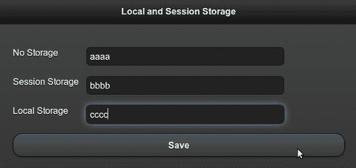

接下来，刷新浏览器以重新加载页面。会话仍处于活动状态，您将看到本地和会话存储值被恢复。第一个字段被清除，因为它未被持久化，如以下屏幕截图所示：

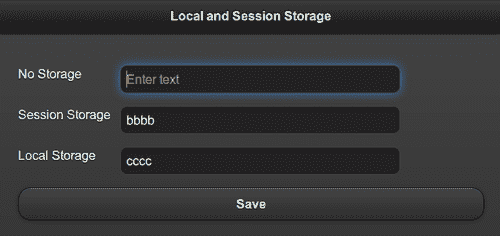

最后，关闭应用并重新打开。这一次，会话被终止。您将看到，仅显示**本地存储**数据，其他两个文本字段被清除：

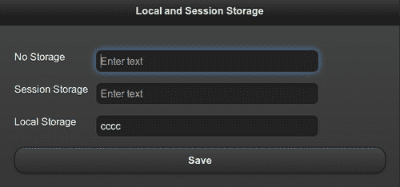

## 还有更多。。。

并非所有浏览器都支持 Web 存储。您可以通过运行以下代码来检查`window`对象是否具有有效的`localstorage`或`sessionStorage`属性，以验证是否可以使用该功能：

```js
If (('localStorage' in window) && window['localStorage'] !== null)
  // Local storage is supported
If (('sessionStorage' in window) && window['sessionStorage'] !== null)
  // Session storage is supported
```

您还可以使用免费的`Modernizr`库通过检查`Modernizr.localstorage`和`Modernizr.sessionstorage`属性是否有效来测试 Web 存储支持。

### 检查网络存储

您可以在浏览器中打开开发者工具，并检查浏览器中存储的当前键值集，以进行本地和会话存储。以下屏幕截图显示了保存在此配方中的本地存储键值：

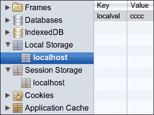

下面的屏幕截图显示了使用**会话存储**存储的键值：

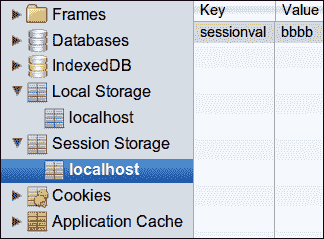

### WebSQL 存储

WebSQL 存储是 HTML5 中定义的另一个用于存储客户端数据的功能。它使用 SQLite 查询来执行数据操作。IE 和 Firefox 都不支持此功能。此规范不再维护，可能会在以后删除。

### IndexedDB 存储

**IndexedDB****存储**是使用索引数据查询的另一种客户端存储形式。在编写此配方时，只有 Firefox 和 Chrome 浏览器支持此功能。旧版 IE、Safari 和 Opera 不支持此功能。

# 带画布的二维图纸

**画布**是网页中的一个矩形区域，您可以使用 JavaScript 绘制二维形状，也可以渲染位图图像。它用于图形、动画、图像、照片合成、实时视频处理和游戏。此配方向您展示了如何在 jQueryMobile 应用中使用画布。

## 准备好了吗

从`code/11/canvas`文件夹复制此配方的完整代码。您可以使用 URL:`http://localhost:8080/11/canvas/main.html`启动此代码。

## 怎么做。。。

应遵循的步骤如下：

1.  创建`main.html`，其页面内容包含`canvas`元素：

    ```js
    <div data-role='content'>
     <canvas id="myCanvas" width="500" height="500">
        Canvas is not supported on your browser
      </canvas>
    </div>
    ```

2.  添加以下脚本以获取 2D 上下文，然后绘制两个矩形：

    ```js
    $('#main').live('pageinit', function(event) {
     var cxt = $('#myCanvas')[0].getContext("2d");
      cxt.fillStyle = '#5f98c5';
      cxt.fillRect(20,20, 100, 100);
      cxt.strokeRect(10,10,120, 120);
    });
    ```

## 它是如何工作的。。。

创建`main.html`，并在`#main`页面中添加一个`<canvas>`元素和`id='mycanvas'`，其中`width`和`height`为`500`像素。如果浏览器不支持画布功能，则显示您的浏览器不支持文本**画布**。接下来，向`pageinit`回调函数添加一个脚本，以获取`mycanvas`元素的 2D 上下文（`cxt`。用灰色阴影`#5f98c5`定义`cxt`的`fillStyle`。现在，使用`fillRect()`绘制一个填充矩形，传递原点、长度和宽度作为参数。接下来，使用`strokeRect()`绘制一个没有任何填充的矩形轮廓。此时将显示屏幕，如以下屏幕截图所示：

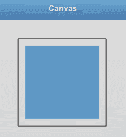

## 还有更多。。。

这个配方只是对 Canvas 元素进行了基本介绍，并向您展示了如何在 jQueryMobile 应用中使用它。画布是一个非常强大的元素，支持各种 API。您可以设置颜色、样式、渐变、图案、字体和文本对齐方式。可以绘制几何图形，例如直线、矩形、路径、圆弧和贝塞尔曲线。画布支持转换 API，例如缩放、旋转、平移和转换。您可以绘制图像，也可以在像素级别对其进行操作。画布有助于构图。还可以将画布的图形状态保存在堆栈中，并从堆栈中恢复以前保存的任何图形状态。

### 注

在画布上绘制的元素采用绝对坐标。因此，在使用这些值时要小心，记住目标设备的实际屏幕大小。

## 另见

*   *在 SVG 图像*上应用高斯模糊

# 在 SVG 图像上应用高斯模糊

**可缩放矢量图形**（**SVG**）是二维可缩放矢量图形的一系列规范。它们基于 XML，可以是静态的或动态的（动画或交互式）。这个配方向您展示了如何在应用中使用 SVG 图像，并在单击它时应用高斯滤波器。

## 准备好了吗

从`code/11/svg`文件夹复制此配方的完整代码。SVG 图像位于`code/resources/images`文件夹中。您可以使用 URL:`http://localhost:8080/11/svg/main.html`启动此代码。

## 怎么做。。。

应遵循的步骤如下：

1.  在页面内容中使用 SVG 元素创建`main.html`。绘制一个 SVG 矩形，并在矩形内显示 SVG 图像：

    ```js
    <div data-role='content'>
      <svg  version="1.1">
        <defs>
          <filter id="gausfilter" x="0" y="0">
     <feGaussianBlur in="SourceGraphic" 
     stdDeviation="5" />
          </filter>
        </defs>
     <rect width="180px" height="220px" x='10' y='10'
     style="fill:none;stroke-
     width:2;stroke:rgb(0,0,0)"/>
        <image id='svgimg' width='160px' height='200px' 
          x='20' y='20' 
          xlink:href='../../resources/images
          /Chrisdesign_green_comic_egg.svg'>
        </image>
      </svg>
    </div>
    ```

2.  单击图像时，将 Guassian 过滤器应用于 SVG 图像：

    ```js
    $('#main').live('pageinit', function(event) {
      $('#svgimg').bind('click', function(event, ui) {
     $(this).attr('filter', 
     'url(#gausfilter)').trigger('refresh'); 
      });
    });
    ```

## 它是如何工作的。。。

创建`main.html`，并在其页面内容中添加`<svg>`元素。指定 SVG 名称空间和版本，如代码所示。使用`<rect>`元素创建一个矩形，指定其属性，如宽度、高度、x 和 y 位置，并设置其`stroke`样式。接下来，添加一个`<image>`元素，其中`id='svgimg'`指向 SVG 图像，并指定要使用的图像的位置、位置和大小。加载页面时，将显示以下屏幕截图：


现在，通过在`<defs>`元素中添加`id='gausfilter'`元素来定义高斯滤波器。在`<filter>`内增加`<feGaussianBlur>`元素，设置`5`的标准偏差。最后，将`#svgimg`映像上的`click`事件绑定到`pageinit`回调函数中的事件处理程序。在这里，使用 jQuery`attr()`调用将`filter='gausfilter'`属性添加到`<image>`标记中。现在，当您单击 SVG 图像时，会应用高斯模糊，如以下屏幕截图所示：


## 还有更多。。。

SVG 支持矢量图形、光栅图形和文本元素。它允许您对 SVG 图像进行变换、剪辑路径、应用 alpha 遮罩和过滤效果。本配方中使用的 SVG 图像是设计的，并提供给位于[的*Open Clipart*网站 http://openclipart.org](http://openclipart.org) ，根据 ChrisDesign（[http://chrisdesign.wordpress.com](http://chrisdesign.wordpress.com) ）。Open Clipart 网站还提供了数千张免费的 SVG 图像，可在公共领域使用。

### SVG 小规格

SVG 规范有一个移动版本，称为**SVG Tiny**（**SVGT**规范。目前，SVGT v1.2 是 W3C 的建议。它在大多数移动设备和平台上都有很好的支持，对它的支持每天都在不断提高。

## 另见

*   带画布的*2D 图纸*配方

# 使用地理定位 API 跟踪您的位置

**地理定位 API**是一个单独的规范，是 HTML5 堆栈的一部分。您可以使用 JavaScript 并使用各种技术定位客户端设备位置，如 IP 地址、Wi-Fi、GSM/CDMA 蜂窝 ID 或设备全球定位系统（GPS）。此配方向您展示了如何在应用中使用地理定位 API 查找当前位置。

## 准备好了吗

从`code/11/geolocation`文件夹中复制此配方的完整代码。您可以使用 URL:`http://localhost:8080/11/geolocation/main.html`启动此代码。

## 怎么做。。。

应遵循的步骤如下：

1.  使用空的`div`标记创建`main.html`，以显示地理位置信息。

    ```js
    <div data-role='content'>
      <p>You current Position is ...</p>
      <div id='geopos'></div>
    </div>
    ```

2.  调用方法使用`show_pos()`回调函数获取当前位置。

    ```js
    $('#main').live('pageinit', function(event) {
      if (navigator.geolocation)
     navigator.geolocation.getCurrentPosition(show_pos);
      else
        $('#geopos').html('Error: Unable to get your position!');
    });
    ```

3.  最后，在`show_pos()`回调函数中显示当前位置：

    ```js
    function show_pos(pos) {
      var geostr = '<p>Latitude (deg): ' 
        + pos.coords.latitude
        + '</p><p>Longitude (deg): ' + pos.coords.longitude
        + '</p><p>Altitude (m): ' + pos.coords.altitude
        + '</p><p>Accuracy (m): ' + pos.coords.accuracy
        + '</p><p>AltitudeAccuracy (m): ' 
        + pos.coords.altitudeAccuracy
        + '</p><p>Heading (deg): ' + pos.coords.heading
        + '</p><p>Speed (m/s): ' + pos.coords.speed
        + '</p><p>Timestamp: '+ pos.timestamp;
      $('#geopos').html(geostr);
    }
    ```

## 它是如何工作的。。。

创建`main.html`，并在`#main`页面添加一个带`id='geopos'`的空`div`标签，以显示位置信息。使用`pageinit`事件处理程序首先检查`navigator.geolocation`对象是否可用。如果可用，使用回调函数`show_pos()`调用`getCurrentPosition()`方法以获取位置信息。`show_pos()`回调函数可以访问 position（`pos`对象，该对象具有当前位置的各种属性。进入`pos.coords`获取纬度、经度、海拔、精度等信息。`pos`对象还具有用于当前位置读取的关联时间戳。现在，在`div`的`#geopos`属性中显示位置详细信息。

启动应用时，浏览器首先请求您访问位置信息的权限。一旦您同意，屏幕上将显示以下位置详细信息：

### 注

地理位置 API 规范要求用户位置信息保密，浏览器在访问或共享此信息之前应发出警告并获得用户的许可。

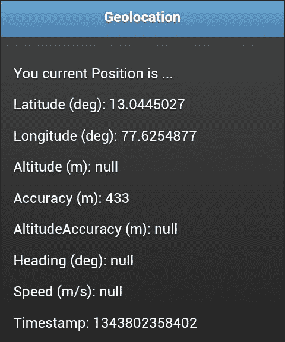

## 还有更多。。。

在此配方中，`getCurrentPosition()`调用只对用户位置 ping 一次，并使用`show_pos()`回调函数显示信息。但是，如果您希望跟踪移动设备，可以使用`watchCurrentPosition()`调用访问连续的位置读数。语法保持不变，但此方法持续且周期性地对设备位置保持 ping 并每次调用`show_pos()`回调。该方法还填充了`pos.coords.speed`和`pos.coords.heading`属性，以对移动设备的速度和方向进行反馈。系统将提示用户仅在第一次通话时才允许共享位置详细信息。

```js
if (navigator.geolocation)
 navigator.geolocation.watchCurrentPosition(show_pos);

```

### 谷歌齿轮

在地理定位 API 规范之前，Google Gears JavaScript 库在获取位置信息方面非常流行。GoogleGears 随后对地理定位 API 的开发做出了相当大的贡献，现在已被弃用。

### 桌面浏览器上的地理定位

在桌面浏览器上获取的位置信息基于从 ISP 服务器获取的 IP 和 MAC 地址详细信息。因此，这些信息具有很大的精确度，有时在几公里范围内，而移动设备依赖网络塔和 GPS 设备（如果启用）进行定位。因此，移动设备可以在几米范围内非常精确地定位位置、高度、速度和航向信息。

# 使用<音频>元素播放音乐

HTML5 引入了一个新的`<audio>`元素，可以直接在浏览器中播放音频文件。在之前，浏览器必须使用插件，如 Flash Player、Real Player 或 Quick Time 来播放音频文件。`<audio>`元素提供了一个轻量级的替代方案，这个配方向您展示了如何在应用中使用它来播放音频文件。

## 准备好了吗

从`code/11/audio`文件夹复制此配方的完整代码。音频剪报可在`code/resources/audio`文件夹中找到。您可以使用 URL:`http://localhost:8080/11/audio/main.html`启动此代码。

## 怎么做。。。

应遵循的步骤如下：

1.  在页面内容中使用`<audio>`元素创建`main.html`：

    ```js
    <div data-role='content'>
     <audio controls autoplay preload='auto'>
        <source src='../../resources/audio/song.mp3' 
          type='audio/mpeg' /> 
        <source src='../../resources/audio/song.oga' 
          type='audio/ogg' /> 
        <source src='../../resources/audio/song.webma' 
          type='audio/webm' /> 
        <p>Browser does not support audio tag</p>          
      </audio>
    </div>
    ```

## 它是如何工作的。。。

使用`controls`、`autoplay`和`preload`属性将`<audio>`元素添加到`#main`页面。属性显示播放按钮、音量滑块和其他控件。`preload='auto'`选项表示一旦页面准备就绪，浏览器就可以在后台开始播放音频文件。`autoplay`属性告诉浏览器，它可以在下载并准备好后直接开始播放音频文件。

### 注

`<audio>`元素还支持一个`loop`属性，该属性使音频保持连续循环播放。

不同的浏览器支持不同的音频格式，第一种支持的音频格式被拾取并播放。因此，使用`<source>`元素以`.mp3`、`.oga`和`.webma`格式向音频文件添加 URL 链接，如代码所示。大多数浏览器都能识别这三种音频格式中的一种。最后，在末尾添加一条错误消息`Browser does not support audio tag`。如果浏览器不支持`audio`元素，则显示此消息。现在，当您加载页面时，会看到类似于以下内容的屏幕截图，音频文件开始播放：

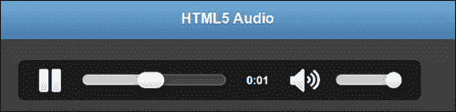

## 还有更多。。。

较早的浏览器如 IE8 不支持`<audio>`元素。在这种情况下，您必须使用闪存回退机制。

有关使用 flash fallback 和 HTML5 媒体播放器的音频格式和编解码器的说明，请参阅`<video>`元素的下一个配方。

## 另见

*   *使用<视频>元素*配方观看视频

# 使用<视频>元素观看视频

HTML5 引入了一个新的`<video>`元素，可以直接在浏览器中播放视频文件。在此之前，浏览器必须使用插件，如 Flash Player、Real Player、或 Quick Time 来播放视频文件。这个`<video>`元素是一个轻量级的替代品，这个配方向你展示了如何在你的应用中使用它来观看视频。

## 准备好了吗

从`code/11/video`文件夹复制此配方的完整代码。视频剪辑可在`code/resources/video`文件夹中找到。您可以使用 URL:`http://localhost:8080/11/video/main.html`启动此代码。

## 怎么做。。。

应遵循的步骤如下：

1.  在页面内容中使用`<video>`元素创建`main.html`：

    ```js
    <div data-role='content'>
     <video controls autoplay preload='auto' width='300' 
     height='300'>
        <source src='../../resources/video/spiral.mp4' 
          type='video/mpeg' /> 
        <source src='../../resources/video/spiral.ogv' 
          type='video/ogg' /> 
        <source src='../../resources/video/spiral.webmv' 
          type='video/webm' /> 
        <p>Browser does not support video tag</p>
      </video>
    </div>
    ```

## 它是如何工作的。。。

使用`controls`、`autoplay`和`preload`属性将`<video>`元素添加到`#main`页面。属性显示播放按钮、音量滑块、全屏按钮和其他控件。`preload='auto'`选项表示一旦页面准备就绪，浏览器就可以开始在后台播放视频文件。`autoplay`属性告诉浏览器，准备好后可以直接播放视频。另外，添加`width`和`height`属性以像素为单位调整视频大小。

不同的浏览器支持不同的视频格式，第一种受支持的视频格式被拾取并播放。因此，在`.mp4`、`.ogv`和中添加视频文件的 URL 链接。`webmv`格式使用`<source>`元素，如代码所示。大多数浏览器都能识别这三种视频格式中的一种。最后，在末尾添加一条错误消息`Browser does not support video tag`。如果浏览器不支持视频元素，将显示此消息。现在，当您加载页面时，将显示类似于以下内容的屏幕截图，视频文件开始播放：

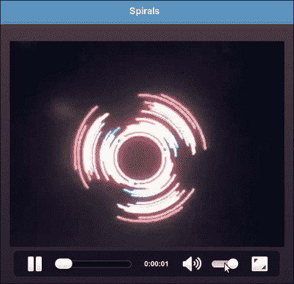

## 还有更多。。。

`<video>`标签还支持一些额外的属性，如`loop`（连续循环播放视频）、`muted`（关闭音频）和`poster`（视频开始播放前，要作为海报显示的图像的 URL）。

### 注

设置`preload`为`auto`自动下载媒体文件，部分浏览器出于安全原因不支持`preload`。

### 闪电后退

较早的浏览器如 IE8 不支持`<video>`和`<audio>`元素。通过使用 flash 播放器作为回退机制，您仍然可以在不受支持的浏览器中播放 HTML5 音频和视频。您必须使用`<video>`或`<audio>`元素末尾的`<object>`标记嵌入播放器。在这种情况下，浏览器无法识别新的 HTML5 标记，只能使用 flash 回退播放音频/视频。

### 编解码器

现在网络上流行多种音频/视频格式。在不同的浏览器中支持不同，这些浏览器只支持特定的音频/视频编解码器。你必须确保你的应用在最大的平台上运行，如有必要，包括相同音频/视频文件的不同格式，如本配方所示。关于这一事项的详细信息，包括支持矩阵表，可在[上查阅 http://diveintohtml5.info/video.html](http://diveintohtml5.info/video.html) 。

### 音视频 API

**音频 API**和**视频 API**现在可供您使用 JavaScript 直接控制`<audio>`和`<video>`元素。它们允许您触发动作（播放、暂停等）和收听事件（播放、结束等）。

### HTML5 媒体播放器

HTML5 标记本身为您提供了非常简单的 UI 和控件。您可以使用音频和视频 API 增强外观并添加其他功能。相反，您也可以使用任何可用的流行库，例如**jPlayer**（[）http://jplayer.org](http://jplayer.org) 、**MediaElement.js**（[mediaelementjs.com](http://mediaelementjs.com)）、**JW 播放器**（[http://longtailvideo.com](http://longtailvideo.com) 、**Video.js**（[http://videojs.com](http://videojs.com) 、**Audio.js**[http://kolber.github.com/audiojs/](http://kolber.github.com/audiojs/) 。

## 另见

*   *使用<音频>元素*配方播放音乐