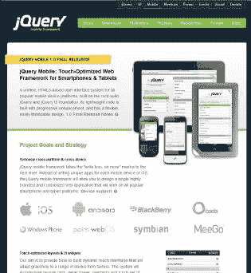
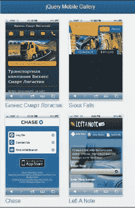
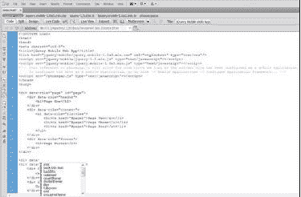

# 零、序言

# 什么是 jQuery Mobile？

大约两年前的 2010 年 8 月 11 日，John Resig（jQuery 的创建者）宣布了 jQueryMobile 项目。在关注 UI 框架的同时，这也是对 jQuery 本身作为移动站点工具的认可，并且将对核心框架本身进行改进，以使其在设备上更好地工作。发布一个又一个版本后，jQueryMobile 项目演变成了一个强大的框架，包含了更多的平台、更多的功能和更好的性能。

但是当我们说一个*UI 框架时，意味着什么呢？*这对开发者和设计师意味着什么？jQueryMobile 提供了一种将常规 HTML（和 CSS）转换为移动友好站点的方法。正如您将在第一章中很快看到的，您可以获取一个常规 HTML 页面，添加 jQuery Mobile 所需的位（基本上是五行 HTML），并发现您的页面立即转换为一个移动友好的版本。

与其他框架不同，jQueryMobile 专注于 HTML。事实上，对于一个绑定到 jQuery 的框架，您可以在不编写一行 JavaScript 的情况下完成大量工作。这是一种强大、实用的创建移动网站的方法，任何现有的 HTML 开发人员都可以在几个小时内学会并适应。将此与其他框架（如 Sencha Touch）进行比较。SenchaTouch 也是一个功能强大的框架，但它的方法完全不同，使用 JavaScript 帮助定义和布局页面。与 JavaScript 相比，jQuery Mobile 对更熟悉 HTML 的人更友好。jQuery Mobile 是*触摸友好型*，这对任何使用过智能手机、在一个有着微小文本和难以识别链接的网站上努力点击正确位置的人来说都是有意义的。这对那些无意中点击了重置按钮而不是提交的人来说是有意义的。jQuery Mobile 将增强您的内容以帮助解决这些问题。普通的按钮会变大、变胖，并且容易点击。链接可以转换为基于列表的导航系统。内容可以拆分为具有平滑过渡的虚拟页面。你会惊讶于 jquerymobile 在没有编写太多代码的情况下是如何工作的。

jquerymobile 有一些非常大的赞助商。他们包括诺基亚、黑莓、Adobe 和其他大公司。这些公司投入了资金、硬件和开发人员资源，以帮助确保项目的成功：



## 费用是多少？

啊，百万美元的问题。幸运的是，这个问题很容易回答：没什么。jQuery Mobile 与 jQuery 本身一样，完全可以自由地用于任何目的。不仅如此，它是完全开源的。不喜欢事情的运作方式？你可以改变它。想要框架不支持的东西吗？您可以添加它。公平地说，深入挖掘代码库可能是大多数人不愿意做的事情。然而，事实上，如果你需要，你可以，而且其他人也可以，这将导致一个产品将被整个社区开发。

## 你需要知道什么？

最后，除了不用花一分钱就可以获得 jquerymobile 并使用它之外，最好的事情是您可能已经具备了使用该框架所需的所有技能。正如您将在接下来的章节中看到的，jQuery Mobile 是一个基于 HTML 的框架。如果您了解 HTML，即使只是简单的 HTML，也可以使用 jQueryMobile 框架。有 CSS 和 JavaScript 知识者优先，但不完全是必需的。（虽然 jquerymobile 在幕后使用了大量的 CSS 和 JavaScript，但实际上您不必自己编写任何内容！）

## 本地应用呢？

jQuery Mobile 不创建本机应用。您将在本书后面看到如何将 jQuery Mobile 与 PhoneGap 等*包装器*技术结合起来创建本机应用，但一般来说，jQuery Mobile 用于构建网站。关于是开发网站还是开发移动应用的问题，本书无法回答。你需要看看你的业务需求，看看什么能满足它们。因为我们自己并不是在开发移动应用，所以您不必担心在谷歌或苹果上建立任何帐户，也不必为市场支付任何费用。任何拥有包含浏览器的移动设备的用户都可以查看您的移动优化站点。

再说一次——如果你想用 jQuery mobile 开发真正的移动应用，这绝对是一个选择。

## 救命！

虽然我们认为这本书将涵盖所有 jQueryMobile 需求可能需要的每一个主题，但很可能会有我们无法涵盖的内容。如果你需要帮助，有几个地方你可以试试。

一是 jQueryMobile 单据（[http://jquerymobile.com/demos/1.0/](http://jquerymobile.com/demos/1.0/) ），封面语法、功能和总体开发，与本书非常相似。虽然这些材料可能涵盖了一些相同的领域，但如果你发现这里有什么令人困惑的地方，请尝试官方文档。有时候，第二种解释真的很有帮助。

二是 jQueryMobile 论坛（[http://forum.jquery.com/jquery-mobile](http://forum.jquery.com/jquery-mobile) ），是 jQueryMobile 主题的开放式讨论列表。这是提问的最佳场所。同时，这也是一个了解别人所遇到问题的好地方。你甚至可以帮助他们。学习新话题的最好方法之一是帮助他人。

## 示例

希望看到 jQuery Mobile 的运行吗？有一个网站。JQM 画廊（[http://www.jqmgallery.com/](http://www.jqmgallery.com/) ），是用户提交的网站集合，使用 jQuery Mobile 构建。毫不奇怪，这个网站也使用 jQuery Mobile，这使得它成为了另一种使用 jQuery Mobile 的方式：



# 这本书涵盖的内容

[第一章](01.html "Chapter 1. Preparing your First jQuery Mobile Project")*准备您的第一个 jQueryMobile 项目*，让您完成您的第一个 jQueryMobile 项目。它详细说明了必须添加到项目目录和源代码中的内容。

[第 2 章](02.html "Chapter 2. Working with jQuery Mobile Pages")*使用 jQueryMobile 页面*继续上一章的工作，并介绍了 jQueryMobile 页面的概念。

[第 3 章](03.html "Chapter 3. Enhancing Pages with Headers, Footers, and Toolbars")*使用页眉、页脚和工具栏增强页面*，介绍了如何使用格式良好的页眉和页脚增强页面。

[第 4 章](04.html "Chapter 4. Working with Lists")*使用列表*描述了如何创建 jQueryMobile 列表视图。这些是移动优化列表，特别适合导航。

[第 5 章](05.html "Chapter 5. Getting Practical — Building a Simple Hotel Mobile Site")*实际构建一个简单的酒店移动网站*，引导您创建第一个“真实”（尽管简单）的 jQueryMobile 应用。

[第 6 章](06.html "Chapter 6. Working with Forms and jQuery Mobile")*使用表单和 jQuery Mobile*解释了使用 jQuery Mobile 优化表单的过程。详细介绍了布局和特殊形状特征。

[第 7 章](07.html "Chapter 7. Creating Modal Dialogs, Grids, and Collapsible Blocks")*创建模式对话框、网格和可折叠块*将引导您了解用于创建基于网格的布局、对话框和可折叠内容区域的特殊 jQueryMobile 用户界面项。

[第 8 章](08.html "Chapter 8. jQuery Mobile Configuration, Utilities, and JavaScript methods")、*jQueryMobile 配置、工具和 JavaScript 方法*描述了您的代码可能需要的各种基于 JavaScript 的工具。

[第 9 章](09.html "Chapter 9. Working with Events")、*处理事件*，详细介绍了 jQueryMobile 相关的各种功能抛出的事件，如页面加载和卸载。

[第 10 章](10.html "Chapter 10. Moving further with the Notekeeper Mobile Application")*通过 Notekeeper 移动应用*进一步推进，引导您完成创建另一个网站的过程，这是一个 HTML5 增强的笔记应用。

[第 11 章](11.html "Chapter 11. Enhancing jQuery Mobile")*增强 jQuery Mobile*演示了如何通过选择和创建独特主题来更改 jQuery Mobile 站点的默认外观。

[第 12 章](12.html "Chapter 12. Creating Native Applications")*创建本机应用*介绍了您之前学到的知识，并展示了如何使用开源 PhoneGap 项目创建真正的本机应用。

[第 13 章](13.html "Chapter 13. Becoming an expert - Build an RSS Reader application")，*成为构建 RSS 阅读器应用*的专家，通过创建一个允许您在移动设备上添加和读取 RSS 提要的应用，对上一章进行了扩展。

# 这本书你需要什么

没有什么从技术上讲，您需要一台计算机和一个浏览器，但是 jQueryMobile 是用 HTML、CSS 和 JavaScript 构建的。无需 IDE（集成开发环境）或专用工具即可使用该框架。如果您的系统上有任何编辑器（并且所有操作系统都包含某种免费编辑器），那么您可以使用 jQuery Mobile 进行开发。

有一些好的 IDE 可以帮助您提高工作效率。例如，Adobe Dreamweaver CS 5.5 包括对 jQuery Mobile 的本机支持，包括代码辅助和设备预览：



最终，您可以免费使用 jQuery Mobile 进行开发。下载、开发和发布 jQueryMobile 站点对您来说是零成本的。

# 这本书是给谁的

这本书是为任何希望拥抱移动开发并将其技能扩展到桌面之外的人准备的。

# 公约

在这本书中，你会发现许多不同类型的文本可以区分不同类型的信息。下面是这些风格的一些例子，并解释了它们的含义。

文本中的代码如下所示：“请注意添加到`div`标记的新`data-title`标记。”

代码块设置如下：

```js
<html>
<head>
<meta name="viewport" content="width=device-width, initial- scale=1">
<title>Multi Page Example</title>

```

**新术语**和**重要词语**以粗体显示。例如，您在屏幕上、菜单或对话框中看到的文字出现在文本中，如下所示：“想象一下我们的**Megacorp**页面。它有三个页面，但**产品**页面是一个单独的 HTML 文件。”

### 注

警告或重要注释显示在这样的框中。

### 提示

提示和技巧如下所示。

# 读者反馈

我们欢迎读者的反馈。让我们知道你对这本书的看法你喜欢或可能不喜欢什么。读者反馈对于我们开发您真正从中获益最多的标题非常重要。

要向我们发送一般反馈，只需向`<[feedback@packtpub.com](mailto:feedback@packtpub.com)>`发送电子邮件，并通过邮件主题提及书名即可。

如果您对某个主题有专业知识，并且您有兴趣撰写或贡献一本书，请参阅我们的作者指南，网址为[www.packtpub.com/authors](http://www.packtpub.com/authors)。

# 客户支持

既然您是一本 Packt 图书的骄傲拥有者，我们有很多东西可以帮助您从购买中获得最大收益。

## 下载示例代码

这本书包含许多代码示例。您不需要输入它们。你不应该把它们都打进去。相反，您应该从书的公共 Github 存储库设置下载它们：[https://github.com/cfjedimaster/jQuery-Mobile-Book](http://https://github.com/cfjedimaster/jQuery-Mobile-Book) 。当书中发现打字错误和其他错误时，Github 存储库将被更新。因此，代码可能与书中的文本不完全匹配。

如果您不熟悉 Github，只需单击**下载**选项卡，然后**下载为 zip**或**下载为 tar.gz**，即可快速获取所有文件的存档集合。

您应该将这些文件解压缩到本地 web 服务器上。如果没有安装，建议安装 Apache（[http://httpd.apache.org/](http://httpd.apache.org/) ）。Apache 可以在所有平台上工作，是免费的，并且通常易于安装。提取后，您可以编辑这些文件，在浏览器中查看它们，或将其复制为自己项目的起点。

您还可以下载从您的账户[购买的所有 Packt 书籍的示例代码文件 http://www.packtpub.com](http://www.packtpub.com) 。如果您在其他地方购买了本书，您可以访问[http://www.packtpub.com/support](http://www.packtpub.com/support) 并注册，将文件直接通过电子邮件发送给您。

## 勘误表

虽然我们已尽一切努力确保内容的准确性，但错误确实会发生。如果您在我们的一本书中发现错误，可能是文本或代码中的错误，如果您能向我们报告，我们将不胜感激。通过这样做，您可以使其他读者免于沮丧，并帮助我们改进本书的后续版本。如果您发现任何错误，请访问[进行报告 http://www.packtpub.com/support](http://www.packtpub.com/support) ，选择您的书籍，点击**勘误表提交表**链接，输入您勘误表的详细信息。一旦您的勘误表得到验证，您的提交将被接受，勘误表将上传到我们的网站，或添加到该标题勘误表部分的任何现有勘误表列表中。

## 盗版

在互联网上盗版版权材料是所有媒体的一个持续问题。在 Packt，我们非常重视版权和许可证的保护。如果您在互联网上发现我们作品的任何形式的非法复制品，请立即向我们提供地址或网站名称，以便我们采取补救措施。

请致电`<[copyright@packtpub.com](mailto:copyright@packtpub.com)>`与我们联系，并提供可疑盗版材料的链接。

我们感谢您在保护我们的作者方面的帮助，以及我们为您带来有价值内容的能力。

## 问题

如果您对本书的任何方面有疑问，请致电`<[questions@packtpub.com](mailto:questions@packtpub.com)>`与我们联系，我们将尽力解决。