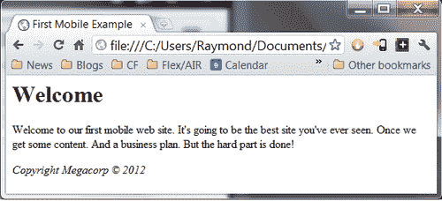
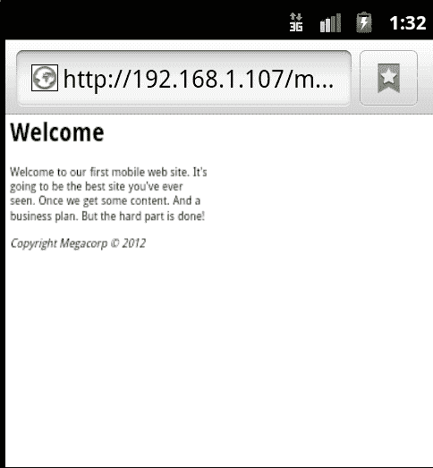
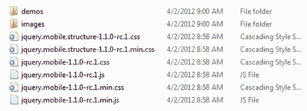
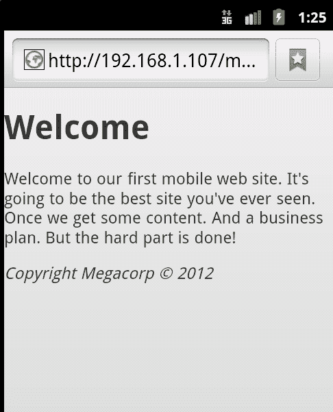

# 一、准备第一个 jQueryMobile 项目

您知道 jQuery Mobile 是什么，它的历史以及它的特性和目标。现在，我们将实际构建我们的第一个 jQueryMobile 网站（嗯，web 页面），看看它有多容易使用。

在本章中，我们将：

*   创建一个简单的 HTML 页面
*   将 jQuery Mobile 添加到页面
*   使用自定义数据属性（数据-*）
*   更新 HTML 以使用数据属性 jQuery

# 重要的预备要点

您可以在从 Github 下载的 ZIP 文件的 c1 文件夹中找到本章的所有源代码。如果您希望手动键入所有内容，我们建议您使用类似的文件名。

# 构建 HTML 页面

让我们从一个没有经过移动优化的简单网页开始。明确地说，我们并不是说它不能在移动设备上使用。一点也不。但它可能无法在移动设备上使用。可能很难阅读（文本太小）。它可能太宽了。它可能使用在触摸屏上无法正常工作的表单。在开始测试之前，我们根本不知道会出现什么样的问题。（我们都在移动设备上对我们的网站进行了测试，看看它们的工作情况如何，对吗？

我们来看看`Listing 1-1:`

```js
Listing 1-1: test1.html
<html>
<head>
<title>First Mobile Example</title>
</head>
<body>
<h1>Welcome</h1>
<p>
Welcome to our first mobile web site. It's going to be the best site you've ever seen. Once we get some content. And a business plan. But the hard part is done!
</p>
<p>
<i>Copyright Megacorp &copy; 2012</i>
</p>
</body>
</html>

```

就像我们说的，没什么太复杂的，对吧？让我们在浏览器中快速查看一下：



### 注

您还可以下载从您的账户[购买的所有 Packt 书籍的示例代码文件 http://www.packtpub.com](http://www.packtpub.com) 。如果您在其他地方购买了本书，您可以访问[http://www.packtpub.com/support](http://www.packtpub.com/support) 并注册，将文件直接通过电子邮件发送给您。

还不错吧？但是让我们看看移动模拟器中的同一页：



哇，太小了。您可能以前在移动设备上见过类似的网页。当然，您通常可以使用收缩和缩放或双击操作来增加文本的大小。但最好是让页面立即呈现在移动友好视图中。这就是 jquerymobile 进入的地方。

# 获取 jQuery Mobile

在前言中，我们讨论了 jQuery Mobile 如何“只是”一组文件。这并不是说要尽可能减少创建这些文件的工作量，也不是说要减少它们的功能，而是要强调使用 jQuery Mobile 意味着您不必安装任何特殊工具或服务器。您可以下载这些文件并将其包含在页面中。如果这是太多的工作，你有一个更简单的解决方案。jQuery Mobile 的文件托管在内容交付网络（CDN）上。这是一个由他们托管的资源，保证（尽可能多地）在线和可用。多个站点已经在使用这些 CDN 托管的文件。这意味着当用户访问您的站点时，他们的缓存中已经有了资源。对于本书，我们将使用 CDN 托管的文件，但对于第一个示例，我们将下载并提取位。我建议你在飞机上，想快速建立一个移动网站的时候，无论如何都要这样做。

欲了解详情，请访问[http://jquerymobile.com/download](http://jquerymobile.com/download) 。这里有几个选项，但您需要 ZIP 文件选项。继续下载 ZIP 文件并解压缩它。（您先前从 Github 下载的 ZIP 文件已经有一个副本。）以下屏幕截图演示了从 ZIP 文件中提取文件后应该看到的内容：



### 注

重要提示：在编写本书时，jQuery Mobile 正在为 1.1 版的发布做准备。发布的版本是 1.0.1。但随着 1.1 即将发布，该版本正在使用中。显然，当你读这本书的时候，一个更高版本可能会出版。您在上一个屏幕截图中看到的文件名是特定于版本的，因此请记住它们对您来说可能有点不同。

请注意，ZIP 文件包含 jQuery Mobile 的 CSS 和 JavaScript 文件，以及两者的简化版本。您通常希望在生产应用中使用缩小版，而在开发时使用常规版。“图像”文件夹有 6 个图像，CSS 在生成移动优化页面时使用这些图像。因此，很清楚，整个框架，以及我们将在本书其余部分讨论的所有功能，将由一个由 8 个文件组成的框架组成。当然，还需要包括 jQuery 库。您可以在[www.jquery.com](http://www.jquery.com)上单独下载。

# 实现 jQueryMobile

好的，我们已经有了比特，我们如何使用它们？向站点添加 jQueryMobile 支持至少需要以下三个步骤：

1.  首先将 HTML5 doctype 添加到页面：`<!DOCTYPE html>`。这有助于通知浏览器将要处理的内容类型。
2.  添加视口元标记：`<meta name="viewport" content="width=device-width, initial-scale="1">`。这有助于在移动设备上查看页面时设置更好的默认值。
3.  最后，CSS、JavaScript 库和 jQuery 本身需要包含在文件中。

让我们看一下之前 HTML 文件的修改版本，它添加了上述所有内容：

```js
Listing 1-2: test2.html
<!DOCTYPE html>
<html>
<head>
<title>First Mobile Example</title>
<meta name="viewport" content="width=device-width, initial- scale=1">
<link rel="stylesheet" href ="jquery.mobile-1.1.0-rc.1.css" />
<script type="text/javascript" src ="http://code.jquery.com/jquery-1.7.1.min.js"></script>
<script type="text/javascript" src="jquery.mobile-1.1.0- rc.1.min.js"></script>
</head>
<body>
<h1>Welcome</h1>
<p>
Welcome to our first mobile web site. It's going to be the best site you've ever seen. Once we get some content. And a business plan. But the hard part is done!
</p>
<p>
<i>Copyright Megacorp &copy; 2012</i>
</p>
</body>
</html>

```

除了添加 doctype、CSS 链接和我们的两个 JavaScript 库之外，这个版本在很大程度上与`listing 1`完全相同。请注意，我们指向 jQuery 库的托管版本。混合使用本地 JavaScript 文件和远程 JavaScript 文件是非常好的。如果希望确保可以脱机工作，也可以下载 jQuery 库。

因此，虽然`body`标记之间的代码没有任何变化，但现在浏览器中会出现完全不同的视图。下面的屏幕截图显示了 Android 移动浏览器现在如何呈现页面：



你马上就会看到一些不同。最大的区别是文本的相对大小。注意它有多大，更容易阅读。正如我们所说，用户可以放大上一版本，但许多移动用户并不知道这项技术。此页面以一种在移动设备上更可用的方式立即加载。

# 使用数据属性

正如我们在上一个示例中所看到的，仅仅添加 jquerymobile 对于更新我们的页面以获得移动支持有很大的帮助。但要真正为移动设备准备页面，还需要做很多工作。在本书的整个过程中，我们都在使用 jQuery Mobile，我们将使用各种数据属性以 jQuery Mobile 能够理解的方式标记页面。但什么是数据属性？

HTML5 引入了数据属性的概念，作为向 DOM（文档对象模型）添加特定值的一种方式。例如，这是一个完全有效的 HTML:

```js
<div id="mainDiv" data-ray="moo">Some content</div>

```

在前面的 HTML 中，`data-ray`属性是完全组合的。但是，因为我们的属性以`data-`开头，所以它也是完全合法的。那么，在浏览器中查看时会发生什么情况？没有什么这些数据属性的要点是与其他代码（如 JavaScript）集成，这些代码可以。。。不管他们想要什么。例如，您可以编写 JavaScript，使用`data-ray`属性查找 DOM 中的每个项，并将背景颜色更改为值中指定的任何颜色。

这就是 jquerymobile 的用武之地，它广泛使用数据属性，包括标记（创建小部件）和行为（控制单击链接时发生的事情）。让我们看看 jQuery Mobile 中数据属性的主要用途之一——定义页面、页眉、内容和页脚：

```js
Listing 1-3: test3.html
<!DOCTYPE html>
<html>
<head>
<title>First Mobile Example</title>
<meta name="viewport" content="width=device-width, initial- scale=1">
<link rel="stylesheet" href ="jquery.mobile-1.1.0-rc.1.css" />
<script type="text/javascript" src ="http://code.jquery .com/jquery-1.7.1.min.js"></script>
<script type="text/javascript" src="jquery. mobile-1.1.0-rc.1.min.js"></script>
</head>
<body>
<div data-role="page">
<div data-role="header">Welcome</div>
<div data-role="content">
<p>
Welcome to our first mobile web site. It's going to be the best site you've ever seen. Once we get some content. And a business plan. But the hard part is done!
</p>
</div>
<div data-role="footer">
<i>Copyright Megacorp &copy; 2012</i>
</div>
</div>
</body>
</html>

```

将前面的代码片段与`listing 1-2`进行比较，您可以看到主要的区别在于增加了`div`块。一个`div`块定义页面。请注意，它将所有内容包装在`body`标记中。在`body`标签内，有三个独立的`div`块。一个角色是“页眉”，另一个角色是“内容”，最后一个角色标记为“页脚”。所有的块都使用`data-role`，这应该给你一个线索，我们正在为每个块定义一个角色。如上所述，这些数据属性对浏览器本身没有任何意义。但让我们看看 jQuery Mobile 遇到这些标签时会做什么：


请立即注意，页眉和页脚现在都应用了黑色背景。这使得它们在其他内容中更加突出。说到内容，页面文本现在与两侧之间有一点空间。一旦应用了带有识别的`data-roles`的`div`标签，所有这些都是自动的。这是一个主题，当我们阅读这本书时，你会看到它一次又一次地重复。您将要做的绝大多数工作都涉及到数据属性的使用。

# 总结

在本章中，我们讨论了网页如何在移动浏览器中呈现不好。我们讨论了 jQuery Mobile 的简单使用如何在很大程度上改善网站的移动体验。具体来说，我们讨论了如何下载 jQuery Mobile 并将其添加到现有 HTML 页面，数据属性在 HTML 中的含义，以及 jQuery Mobile 如何利用数据属性来增强页面。在下一章中，我们将基于这种用法，开始使用链接和多页内容。