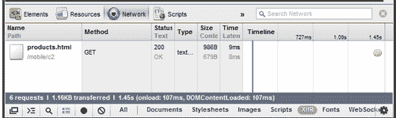
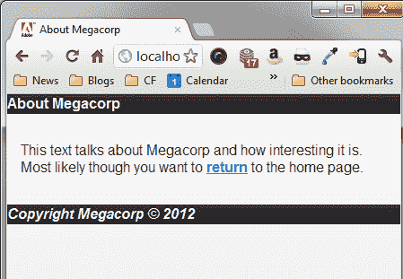

# 二、使用 jQueryMobile 页面

在上一章中，您看到了将 jQuery Mobile 添加到一个简单的 HTML 页面是多么容易。如果每个网站只有一个页面就好了，但真正的网站是由多个通过链接连接的页面组成的。jquerymobile 可以轻松地处理多个页面，并提供许多不同的方式来创建和链接页面。

在本章中，我们将：

*   将多个页面添加到一个 jQueryMobile 文件中
*   讨论 jQuery Mobile 如何修改链接（以及如何禁用链接）
*   演示如何将其他文件链接到 jQueryMobile 站点并添加到该站点
*   讨论 jQuery Mobile 如何自动处理 URL 以方便书签

# 重要的预备要点

如前一章所述，本章中的所有代码都可以通过 Github 下载的 ZIP 文件获得。

# 将多个页面添加到一个文件中

在上一章中，我们处理了一个包含简单文本页面的文件。对于第一次修改，我们将向文件中添加另一个页面，并创建指向该页面的链接。如果您还记得的话，jquerymobile 会寻找一个特殊的`<div>`包装器来帮助它知道页面的位置：`<div data-role="page">`。jquerymobile 如此易于使用的原因是，我们可以通过使用相同格式添加另一个 div 来添加另一个页面。下面的代码片段`Listing 2-1`显示了此功能的一个简单示例：

```js
Listing 2-1: test1.html
<!DOCTYPE html>
<html>
<head>
<meta name="viewport" content="width=device-width, initial- scale=1">
<title>Multi Page Example</title>
<link rel ="stylesheet" href="http://code.jquery.com/mobile/ latest/jquery.mobile.min.css" />
<script src ="http://code.jquery.com/jquery- 1.7.1.min.js"></script>
<script src ="http://code.jquery.com/mobile/latest/ jquery.mobile.min.js"></script>
</head>
<body>
<div data-role="page" id="homePage">
<div data-role="header">Welcome</div>
<div data-role="content">
<p>
Welcome to our first mobile web site. It's going to be the best site you've ever seen. Once we get some content. And a business plan. But the hard part is done!
</p>
<p>
You can also <a href= "#aboutPage">learn more</a> about Megacorp.
</p>
</div>
<div data-role="footer">
<i>Copyright Megacorp &copy; 2012</i>
</div>
</div>
<div data-role="page" id="aboutPage">
<div data-role="header">About Megacorp</div>
<div data-role="content">
<p>
This text talks about Megacorp and how interesting it is. Most likely though you want to
<a href= "#homePage">return</a> to the home page.
</p>
</div>
<div data-role="footer">
<i>Copyright Megacorp &copy; 2012</i>
</div>
</div>
</body>
</html>

```

好的，一如既往，我们从几个必需的位开始我们的模板：HTML5 doctype、meta 标记、一个 CSS include 和两个 JavaScript 文件。这已在上一章中介绍，我们将不再提及。请注意，此模板切换到 CSS 和 JavaScript 库的 CDN 版本：

```js
<link rel="stylesheet" href="http://code.jquery.com/ mobile/latest/jquery.mobile.min.css" />
<script src="http://code.jquery.com/jquery-1.7.1.min.js"></script>
<script src="http://code.jquery.com/mobile/latest/ jquery.mobile.min.js"></script>

```

这些版本由 jQuery 团队托管，其优点是始终是最新版本。您的访问者很可能已经加载了这些库，因此在到达您的移动站点之前，它们就存在于缓存中。虽然这是我们将进一步介绍示例的路线，但请记住，您始终可以使用下载的版本。

请注意，现在我们有两个`<div>`街区。第一个示例与前一个示例相比没有太大变化。我们添加了一个唯一的 ID（`homepage`），以及第二段。注意第二段中的链接。它使用一个标准的内部链接（`#aboutPage`）告诉浏览器我们只需将浏览器向下滚动到页面的该部分。指定的目标`aboutPage`在另一个`div`块的正下方定义。

在传统 web 页面中，这将显示为页面上的两个主要文本块。单击这两个链接中的任何一个都会相应地上下滚动浏览器。然而，jquerymobile 将在这里做一些显著不同的事情。下图显示了如何在移动浏览器中呈现页面：


注意到什么了吗？尽管我们的 HTML 包含两个文本块（两个`<div>`块），但它只呈现了一个。jQuery Mobile 将始终显示它找到的第一个页面，并且仅显示该页面。最好的部分来了。如果单击链接，第二个页面将自动加载。使用设备返回按钮，或只需单击链接，即可返回到第一页。您还将注意到平滑过渡。这是您以后可以配置的。但是这里的所有交互，页面的显示和隐藏，转换，都是由 jquerymobile 自动完成的。现在是讨论链接以及 jQueryMobile 在单击链接时所做的事情的好时机。

# jQueryMobile、链接和您

当 jQuery Mobile 遇到一个简单的链接`(<a href= "something.html"> Foo</a>)`时，它会自动捕获该链接上的任何点击，并将其更改为基于 Ajax 的加载。这意味着，如果它检测到目标是同一页面上的某个内容，即我们上面使用的 hashmark 样式（`href="#foo"`链接），它将处理将用户转换到新页面的操作。如果它检测到同一服务器上另一个文件的页面，它将使用 Ajax 加载该页面并替换当前可见的页面。

如果链接到外部站点，那么 jQuery Mobile 将保持链接不变，并且将发生正常的链接行为。有时您可能希望禁用 jQuery Mobile，使其无法对链接执行任何操作。在这种情况下，您可以使用一个数据属性，让框架知道它不应该做任何事情。例如：

```js
<a href= "foo.html" data-ajax="false">Normal, non-special link</a>

```

正如我们在[第一章](01.html "Chapter 1. Preparing your First jQuery Mobile Project")*中所看到的，在准备第一个 jQuery Mobile 项目*时，jQuery Mobile 大量使用了数据属性。它还可以让你禁用你不喜欢的行为。随着我们在本书中的继续，您将看到 jQuery Mobile 为增强您的移动设备站点所做的一个又一个示例。不过，在所有这些情况下，框架都会意识到有时您可能想要禁用它。

# 使用多个文件

在一个理想的世界里，我们可以用一个文件构建一个完整的网站，不必进行修改，并且在周五下午 2 点之前完成每个项目。但在现实世界中，我们必须处理大量的文件，大量的修改，不幸的是，还有大量的工作。在前面的代码清单中，您看到了如何在一个文件中包含两个页面。jquerymobile 很容易处理这个问题。但你可以想象，过一段时间后，这会变得很笨拙。虽然我们可以包含 10 页、20 页甚至 30 页，但这将使文件难以处理，并使用户的初始下载速度大大降低。

要处理多个页面和文件，我们只需创建一个简单的链接，链接到与第一个文件位于同一域中的其他文件。我们甚至可以将第一种技术（一个文件中有两个页面）与其他文件的链接结合起来。在`listing 2-2`中，我们修改了第一个示例，添加了指向新页面的链接。请注意，我们保留了现有的`About`页面。

```js
Listing 2-2:test2.html
<!DOCTYPE html>
<html>
<head>
<meta name="viewport" content="width=device-width, initial- scale=1">
<title>Multi Page Example (2)</title>
<link rel="stylesheet" href="http://code.jquery.com/mobile/ latest/jquery.mobile.min.css" />
<script src="http://code.jquery.com/jquery- 1.7.1.min.js"></script>
<script src="http://code.jquery.com/mobile/ latest/jquery.mobile.min.js"></script>
</head>
<body>
<div data-role="page" id="homePage">
<div data-role="header">Welcome</div>
<div data-role="content">
<p>
Welcome to our first mobile web site. It's going to be the best site you've ever seen. Once we get some content. And a business plan. But the hard part is done!
</p>
<p>
Find out about our wonderful
<a href= "products.html">products</a>.
</p>
<p>
You can also <a href= "#aboutPage">learn more</a> about Megacorp.
</p>
</div>
<div data-role="footer">
<i>Copyright Megacorp &copy; 2012</i>
</div>
</div>
<div data-role="page" id="aboutPage">
<div data-role="header">About Megacorp</div>
<div data-role="content">
<p>
This text talks about Megacorp and how interesting it is. Most likely though you want to
<a href= "#homePage">return</a> to the home page.
</p>
</div>
<div data-role="footer">
<i>Copyright Megacorp &copy; 2012</i>
</div>
</div>
</body>
</html>

```

现在我们来看`listing 2-3`，我们的产品页面：

```js
Listing 2-3: products.html
<!DOCTYPE html>
<html>
<head>
<meta name="viewport" content="width=device-width, initial- scale=1">
<title>Products</title>
<link rel="stylesheet" href="http://code.jquery.com/mobile/ latest/jquery.mobile.min.css" />
<script src="http://code.jquery.com/jquery- 1.7.1.min.js"></script>
<script src="http://code.jquery.com/mobile/ latest/jquery.mobile.min.js"></script>
</head>
<body>
<div data-role="page" id="productsPage">
<div data-role="header">Products</div>
<div data-role="content">
<p>
Our products include:
</p>
<ul>
<li>Alpha Series</li>
<li>Beta Series</li>
<li>Gamma Series</li>
</ul>
</div>
</div>
</body>
</html>

```

我们的产品页面相当简单，但请注意，我们在顶部包含了 jQuery 和 jQueryMobile 资源。为什么？我在前面提到，jquerymobile 将使用 Ajax 加载额外的页面。如果你在 Chrome 或 Firebug 支持的 Firefox 中打开`test2.html`，你可以自己看到这一点。单击 products 的链接将触发 XHR（想想 Ajax）请求，如以下角色所示：



很好。但是当有人给应用添加书签时会发生什么呢？现在让我们看看 jQuery Mobile 如何处理 URL 和导航。

### 提示

**什么是萤火虫？**

Firebug 是 Firefox（[www.getfirebug.com](http://www.getfirebug.com)的扩展，它为您的浏览器提供了一套与开发人员相关的工具。Chrome 内置了类似的工具。这些工具支持许多特性，其中之一就是能够监视与 XHR（或 Ajax）相关的请求。

# jQueryMobile 和 URL

如果您在浏览器中打开`test2.html`并使用它，您可能会在导航时注意到 URL 的一些有趣之处。以下是初始 URL。（当然，地址和文件夹在您的计算机上会有所不同）：`http://localhost/mobile/c2/test2.html`。

点击产品后，URL 变为`http://localhost/mobile/c2/products.html`。如果我点击后退，点击**了解更多**，我会得到`http://localhost/mobile/c2/test2.html#aboutPage`。

在两个子页面（产品页面和关于页面）中，URL 都是由框架本身更改的。该框架在支持它的浏览器中使用`history.pushState`和`history.replaceState`。对于较旧的浏览器，或者不支持 URL 的 JavaScript 操作的浏览器，将使用基于哈希的导航。在 Internet Explorer 中查看“产品”链接时，如下所示：

`http://localhost/mobile/c2/test2.html#/mobile/c2/products.html`。

有趣的是，在这种书签样式中，`test2.html`总是先加载。实际上，您可以将`products.html`构建为只包含 div，并确保如果先请求产品，它仍然会正确呈现。是更新、更高级的浏览器有问题。如果您没有包含正确的 jQuery 和 jQuery Mobile includes，当它们直接转到`products.html`时，您将得到一个没有样式的页面。最好总是包含适当的头文件（CSS、JavaScript 等）。任何像样的编辑器都会提供创建模板的简单方法。

# 额外定制

在 jQuery Mobile 中处理多个页面非常简单。你可以利用前两章中讨论的内容，现在就建立一个非常简单但兼容手机的网站。以下是你可能要考虑的一些有趣的技巧。

## 页面标题

您可能已经注意到，在上一个示例中，当您单击**产品**页面时，浏览器的标题已正确更新为`Products`。这是因为 jQuery Mobile 注意到并解析了`products.html`文件中的 title 标记。但是如果你点击**关于**的链接，你不会得到同样的行为。显然，由于**About**页面位于同一 HTML 中，因此它也具有相同的标题标记。jquerymobile 提供了一种简单的方法来解决这个问题，它再次涉及到数据标记。下面的代码片段显示了向嵌入页面添加标题的简单方法：

```js
<div data-role="page" id="aboutPage" data-title="About Megacorp">
<div data-role="header">About Megacorp</div>
<div data-role="content">
<p>
This text talks about Megacorp and how interesting it is. Most likely though you want to
<a href= "#homePage">return</a> to the home page.
</p>
</div>
<div data-role="footer">
<i>Copyright Megacorp &copy; 2012</i>
</div>
</div>

```

请注意添加到`div`标记的新`data-title`标记。jQuery Mobile 会注意到，当**关于**页面加载时，它也会更新浏览器标题。同样，只有在一个 HTML 文件中包含多个页面时，才需要这样做。您可以在`test3.html:`中找到此版本



## 预取内容

将所有内容包含在一个 HTML 文件中的好处是，所有页面都可以立即使用。但负面影响（更新太难，初次下载太慢）远远超过了这一点。大多数 jQueryMobile 应用将包含多个文件，通常每个文件只有一到两页。但是，您可以确保更快地加载某些页面，以帮助改善用户体验。想象一下我们的**Megacorp**页面。它有三个页面，但是**产品**页面是一个单独的 HTML 文件。由于它是网站上唯一的真实内容，我们的所有用户很可能最终都会点击该链接。我们可以告诉 jQuery Mobile 在加载主页后立即预取内容。这样，当用户点击链接时，页面加载速度会更快。这再一次归结为一个简单的数据属性。

```js
<p>
Find out about our wonderful <a href= "products.html" data- prefetch>products</a>.
</p>

```

在上一个链接中，我们所做的只是将`data-prefetch`添加到链接中。当 jquerymobile 在链接中发现此内容时，它将立即自动获取内容。现在，当用户点击**产品**链接时，他们会更快地看到内容。此修改保存在`test4.html`中。

显然，这项技术应该小心使用。给定一个有四个主要链接的页面，您可能只考虑预取两个最流行的页面，而不是全部四个页面。

## 更改页面转换

前面我们提到，您可以配置 jQuery Mobile 在页面之间使用的转换。在本书的后面，我们将讨论如何在全局范围内实现这一点，但如果您想为特定链接切换到不同的转换，只需在链接中包含一个`data-transition`属性：

```js
<p>
Find out about our wonderful <a href= "products.html" data- transition="pop">products</a>.
</p>

```

许多转换还支持反向操作。通常情况下，jQuery Mobile 会判断您是否需要此功能，但如果您想强制执行一个方向，请使用数据方向属性：

```js
<p>
Find out about our wonderful <a href= "products.html" data- transition="pop" data-direction="reverse">products</a>.
</p>

```

# 总结

本章进一步充实了 jQueryMobile 页面的概念以及如何使用多个页面。具体来说，我们看到了一个物理文件如何包含许多不同的页面。jQuery Mobile 将处理隐藏除第一页以外的所有页面。我们还了解了如何链接到其他页面，以及 jQueryMobile 如何使用 Ajax 将内容动态加载到浏览器中。接下来，我们讨论了 jQuery Mobile 如何处理更新浏览器 URL 以启用书签功能。最后，我们讨论了有助于改进页面的两个工具。第一种方法是为嵌入页面提供标题。第二种技术演示了如何预取内容，以进一步改善访问您站点的用户的体验。

在下一章中，我们将了解页眉、页脚和导航栏。这些将大大增强我们的页面，使其更易于导航。