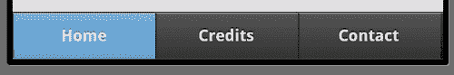

# 三、使用页眉、页脚和工具栏增强页面

工具栏提供了向移动网站添加导航元素的简单方法。对于用户在应用中导航时始终可以参考的一致性或站点范围的导航控件，它们尤其有用。

在本章中，我们将：

*   讨论如何创建页眉和页脚
*   讨论如何将这些页眉和页脚转换为有用的工具栏
*   演示如何创建始终显示的固定位置工具栏，无论特定页面的内容有多大
*   显示导航栏的示例

# 重要的预备要点

如前一章所述，本章中的所有代码都可以通过 Github 下载的 ZIP 文件获得。本章中的大多数代码示例都很短，因此测试时应使用完整的代码。

# 添加标题

您以前已经使用过头文件，因此代码会很熟悉。在本章中，我们将更深入地研究它们，并演示如何向站点标题添加其他功能，如按钮。

如果您还记得，只需使用具有适当角色的 div 即可定义标题：

```js
<div data-role="header">My Header</div>

```

前面的标签将为文本添加一个漂亮的黑色背景，使其更加突出，如以下屏幕截图所示：


然而，我们可以让这更美好。通过在文本周围添加一个`h1`标记，jQuery Mobile 将使标题更大，并自动将文本居中，如标记后面的屏幕截图所示：

```js
<div data-role="header"><h1>My Header</h1></div>

```


马上你就可以看到区别了。我们可以通过添加按钮进一步向标题添加功能。按钮可用于导航（例如，返回主屏幕），或提供相关页面的链接。因为标题的中心用于文本，所以按钮只有两个*空格*，一个在左边，一个在右边。只需在标题中创建链接即可添加按钮。第一个链接将位于文本的左侧，第二个链接将位于右侧。以下代码段是一个示例：

```js
<div data-role="header">
<a href= "index.html">Home</a>
<h1>My Header</h1>
<a href= "contact.html">Contact</a>
</div>

```

在移动浏览器中查看时，您可以看到以下屏幕截图：


请注意，更简单的链接是如何自动变成大按钮的，从而使它们更易于使用，标题更“像控件”。你可能想知道，如果你只想要一个按钮，并且想要它在右手边怎么办？移除第一个按钮并保留第二个按钮将不起作用，如以下代码段所示：

```js
<div data-role="header">
<h1>My Header</h1>
<a href= "contact.html">Contact</a>
</div>

```

前面的代码片段在标题中但在左侧创建了一个按钮。要将按钮定位到右侧，只需添加类`ui-btn-right`。以下代码段是一个示例：

```js
<div data-role="header">
<h1>My Header</h1>
<a href= "contact.html" class="ui-btn-right">Contact</a>
</div>

```

您还可以指定`ui-btn-left`将链接放置在左侧，但如前一段代码所示，这是正常行为：


# 图标潜行峰值

虽然不是一个特定的标题工具栏特性，但 jquerymobile 中所有按钮都可以使用的一个有趣特性是能够指定图标。jQuery Mobile 附带了一组简单、易于识别的图标，可以立即使用。这些图标将在[第 6 章](06.html "Chapter 6. Working with Forms and jQuery Mobile")*创建移动优化表单*中进一步讨论，但作为快速预览，以下代码片段显示了带有两个自定义图标的标题：

```js
<div data-role="header">
<a href= "index.html" data-icon="home">Home</a>
<h1>My Header</h1>
<a href= "contact.html" data-icon="info">Contact</a>
</div>

```

请注意新属性`data-icon`。在浏览器中查看时，您将看到以下屏幕截图：


# 使用后退按钮

根据用户的硬件，他们可能有也可能没有物理后退按钮。对于像 Android 手机这样的设备，在 jQueryMobile 应用中点击后退按钮就可以了。无论用户以前在哪个页面上，只要单击按钮，就会加载该页面。但是在其他设备上，比如 iPhone，没有这样的按钮可以点击。虽然您可以提供链接来自己浏览页面，但 jQuery Mobile 提供了一些很好的内置支持，可以在开箱即用的情况下向后导航。

有两种方法可以添加自动后退按钮。`Listing 3-1`显示了一个简单的两页 jQueryMobile 站点。在第二页中，我们添加了一个新的数据属性`data-add-back-btn="true"`。这将在第二页的页眉中自动创建一个后退按钮。接下来，我们还在页面内容中添加了一个简单的链接。当链接的实际 URL 为空时，请注意`data-rel="back"`属性。jQuery Mobile 将检测到此链接并自动将用户发送到上一页。以下代码段是一个示例：

```js
Listing 3-1: back_button_test.html
<!DOCTYPE html>
<html>
<head>
<title>Back Examples</title>
<meta name="viewport" content="width=device-width, initial- scale=1">
<link rel="stylesheet" href="http://code.jquery.com/mobile/ latest/jquery.mobile.min.css" />
<script src="http://code.jquery.com/jquery- 1.7.1.min.js"></script>
<script src="http://code.jquery.com/mobile/ latest/jquery.mobile.min.js"></script>
</head>
<body>
<div data-role="page">
<div data-role="header"><h1>My Header</h1></div>
<div data-role="content">
<p>
<a href= "#subpage">Go to the sub page...</a>
</p>
</div>
</div>
<div data-role="page" id="subpage" data-add-back-btn="true">
<div data-role="header"><h1>Sub Page</h1></div>
<div data-role="content">
<p>
<a href= "" data-rel="back">Go back...</a>
</p>
</div>
</div>
</body>
</html>

```

下面的屏幕截图演示了正在运行的功能：


如果您感到好奇，只需在页面 div:`data-add-back-btn="true" data-back-btn-text="Return"`中使用另一个数据属性，就可以自定义按钮的文本。您可以全局打开后退按钮支持，也可以通过 JavaScript 更改文本。这将在[第 9 章](09.html "Chapter 9. Working with Events")、*jQuery Mobile*中的 JavaScript 配置和工具中讨论。

# 使用页脚

页脚在很大程度上与页眉非常相似。我们之前已经演示了如何使用数据角色创建页脚：

```js
<div data-role="footer">My Footer</div>

```

但是，与标题一样，如果我们在 div 标记中添加适当的 HTML，我们可以获得更好的格式：

```js
<div data-role="header"><h4>My Footer</h4></div>

```

添加了`h4`标记后，我们的页脚现在居中并加了一点填充，使它们更加突出，如以下屏幕截图所示：


与页眉一样，可以在页脚中包含按钮。与页眉不同，页脚中的按钮不会自动将自身定位到文本的左侧和右侧。事实上，如果您决定使用文本和按钮，您需要确保从页脚文本中删除`h4`标记，否则页脚将非常大。下面是一个带有两个按钮的简单示例：

```js
<div data-role="footer">
<a href= "credits.html">Credits</a>
<a href= "contact.html">Contact</a>
</div>

```

以下屏幕截图演示了此更改：


这是可行的，但请注意按钮周围没有太多空间。您可以通过在页脚`div`标记中添加一个名为`ui-bar`的类来改进这一点，如以下代码段所示：

```js
<div data-role="footer" class="ui-bar">
<a href= "credits.html">Credits</a>
<a href= "contact.html">Contact</a>
</div>

```


# 创建固定和全屏页眉和页脚

在前面关于页眉和页脚的讨论中，您看到了几个如何添加按钮的示例。这些按钮对于在站点中导航很有用。但是如果某个页面有点长怎么办？例如，博客条目可能相当长，尤其是在移动设备上查看时。当用户滚动时，页眉或页脚可能会离开屏幕。jquerymobile 提供了一种创建固定位置页眉和页脚的方法。启用此功能后，页眉和页脚将始终可见。当用户滚动时，它们可能会消失，但只要他们抬起手指并停止滚动，页眉和页脚就会重新出现。此功能可通过向用于页眉或页脚的 div 标记添加`data-position="fixed"`来启用。`Listing 3-2`展示了一个例子。为了确保页面真正滚动，许多段落的文本被重复。这已从书中的代码中删除，但存在于实际文件中。

```js
Listing 3-2: longpage.html
<!DOCTYPE html>
<html>
<head>
<title>Fixed Positioning Example</title>
<meta name="viewport" content="width=device-width, initial- scale=1">
<link rel="stylesheet" href="http://code.jquery.com/mobile/ latest/jquery.mobile.min.css" />
<script src="http://code.jquery.com/jquery- 1.7.1.min.js"></script>
<script src="http://code.jquery.com/mobile/ latest/jquery.mobile.min.js"></script>
</head>
<body>
<div data-role="page">
<div data-role="header" data-position="fixed"><h1>My Header</h1></div>
<div data-role="content">
<p>
Lorem ipsum dolor sit amet, consectetur adipiscing elit. Suspendisse id posuere lacus. Nulla ac sem ut eros dignissim interdum a et erat. Class aptent taciti sociosqu ad litora torquent per conubia nostra, per inceptos himenaeos. In ac tellus est. Nunc consequat metus lobortis enim mattis nec convallis tellus pulvinar. Nullam diam ligula, dictum sed congue nec, dapibus id ipsum. Ut facilisis pretium dui, nec varius dui iaculis ultricies. Maecenas sollicitudin urna felis, non faucibus
leo. Cum sociis natoque penatibus et magnis dis parturient montes, nascetur ridiculus mus. In id volutpat lectus.Quisque mauris ipsum, vehicula id ornare aliquet, auctor volutpat dui. Sed euismod sem in arcu dapibus condimentum dictum nibh consequat.
</p>
</div>
<div data-role="footer" data-position="fixed"><h4>My Footer</h4></div>
</div>
</body>
</html>

```

我们不必为这个示例的屏幕截图操心，因为它不能很好地传达该功能，但如果您在移动设备中尝试此功能，请注意，在上下滚动时，只要您抬起手指，页眉和页脚都会弹出。这样，无论页面有多大，用户都可以访问它们。

## 全屏定位

另一个要考虑的选项是所谓的全屏幕定位。这是一个常用于图片的隐喻，但也可以用于使用固定位置的页眉和页脚的地方。在这种情况下，页眉和页脚会随着单击而出现和消失。因此，使用照片，您可以查看照片的真实情况，还可以通过简单的单击返回页眉和页脚。也许，代替全屏定位，你可以把它看作是 To.??.可检索的 To1 ??。页眉和页脚。一般来说，当您希望页面内容能够自己查看时，最好使用这种方法。同样，图片就是一个很好的例子。

要启用此功能，只需在用于定义页面的 div 标记中添加`data-fullscreen="true"`。`Listing 3-3`演示了此功能，如下面的代码片段所示：

```js
Listing 3-3: fullscreen.html
<!DOCTYPE html>
<html>
<head>
<title>Full Screen Example</title>
<meta name="viewport" content="width=device-width, initial- scale=1">
<link rel="stylesheet" href="http://code.jquery.com/mobile/ latest/jquery.mobile.min.css" />
<script src="http://code.jquery.com/jquery- 1.7.1.min.js"></script>
<script src="http://code.jquery.com/mobile/ latest/jquery.mobile.min.js"></script>
</head>
<body>
<div data-role="page" data-fullscreen="true">
<div data-role="header" data-position="fixed"><h1>My Header</h1></div>
<div data-role="content">
<p>

</p>
<p>
</div>
<div data-role="footer" data-position="fixed"><h4>My Footer</h4></div>
</div>
</body>
</html>

```

与前面的示例一样，前面的代码片段不能很好地转换为静态屏幕截图。在您的手机浏览器中打开并查看。请记住，可以多次单击以打开和关闭效果。

# 使用导航条

现在您已经看到了一些示例，其中包括带有页眉和页脚的按钮，但是 jquerymobile 有一个更干净的版本，称为 NavBars（或导航栏）。这些是用于固定按钮的全屏宽条。jQuery Mobile 还支持一次突出显示一个按钮作为活动按钮。当用于导航时，这是一种将页面标记为活动页面的简单方法。

导航栏只是一个无序列表，包装在使用`data-role="navbar"`的 div 标记中。放在页脚内，它看起来类似于以下代码片段：

```js
<div data-role="footer">
<div data-role="navbar">
<ul>
<li><a href= "persistent_footer_index.html" class="ui-btn- active">Home</a></li>
<li><a href= "persistent_footer_credits.html" >Credits</a></li>
<li><a href= "persistent_footer_contact.html" >Contact</a></li>
</ul>
</div>
</div>

```

注意在第一个链接上使用了`class="ui-btn-active"`。这会将第一个按钮标记为活动。jQuery Mobile 将无法自动为您执行此操作，因此当您构建每个页面并使用`navbar`时，您将不得不*适当地移动*类。以下屏幕截图显示了它的外观：



您最多可以添加 5 个按钮，jquerymobile 将适当调整按钮的大小以使其适合。如果超过五个，则按钮将简单地拆分为多行。最有可能的是，这不是您想要涵盖的内容。用太多的按钮压倒用户肯定会让用户感到困惑，甚至愤怒。

您还可以在标题中包含一个`navbar`。如果放在文本或任何其他按钮之后，jQuery Mobile 将自动将其放到下一行：

```js
<div data-role="header">
<h1>Home</h1>
<div data-role="navbar">
<ul>
<li><a href= "persistent_footer_index.html" class="ui-btn- active">Home</a></li>
<li><a href= "persistent_footer_credits.html" >Credits</a></li>
<li><a href= "persistent_footer_contact.html" >Contact</a></li>
</ul>
</div>
</div>

```


您可以在名为`header_and_footer_with_navbar.html`的文件中看到这两种方法的示例。

## 跨多个页面持久化导航栏页脚

现在，让我们把前面的两个主题结合到一个非常酷的小功能中——多页持久页脚。这需要做更多的工作，但您可以创建一个页脚导航栏，当从一页切换到另一页时，它不会消失。为了做到这一点，你必须遵循几个简单的规则：

*   您的页脚 div 必须出现在所有页面上
*   您的页脚 div 在所有页面上必须使用相同的`data-id`值
*   您必须在导航栏的*活动*页面上使用两个 CSS 类：`ui-state-persist`和`ui-btn-active`
*   您还必须使用永久页脚功能

这听起来有点复杂，但实际上只是模板中的 HTML 多一点。在`listing 3-4`中，虚构公司的索引页使用页脚导航栏。请注意，当前所选页面使用了`ui-state-persist`和`ui-btn-active`。

```js
Listing 3-4: persistent_footer_index.html
<!DOCTYPE html>
<html>
<head>
<title>Persistent Footer Example</title>
<meta name="viewport" content="width=device-width, initial- scale=1"> <link rel="stylesheet" href="http://code.jquery.com/mobile/ latest/jquery.mobile.min.css" />
<script src="http://code.jquery.com/jquery- 1.7.1.min.js"></script>
<script src="http://code.jquery.com/mobile/ latest/jquery.mobile.min.js"></script>
</head>
<body>
<div data-role="page">
<div data-role="header"><h1>Home</h1></div>
<div data-role="content">
<p>
This is the Home Page
</p>
</div>
<div data-role="footer" data-position="fixed" data- id="footernav">
<div data-role="navbar">
<ul>
<li><a href= "persistent_footer_index.html" class="ui-btn- active ui-state-persist">Home</a></li>
<li><a href= "persistent_footer_credits.html"> Credits</a></li>
<li><a href= "persistent_footer_contact.html"> Contact</a></li>
</ul>
</div>
</div>
</div>
</body>
</html>

```

以下屏幕截图显示了整个页面的外观：


我们不必太担心其他两页。您可以在下载的 ZIP 文件中找到它们。以下代码段是第二页的页脚部分。注意这里唯一的变化是`ui-btn-active`类的移动：

```js
<div data-role="footer" data-position="fixed" data-id="footernav">
<div data-role="navbar">
<ul>
<li><a href= "persistent_footer_index.html">Home</a></li>
<li><a href= "persistent_footer_credits.html" class="ui-btn- active ui-state-persist">Credits</a></li>
<li><a href= "persistent_footer_contact.html">Contact</a></li>
</ul>
</div>
</div>

```

从一个页面单击到另一个页面将显示到每个页面的平滑过渡，但页脚栏仍保留。很像一个框架网站（不要发抖——框架并不总是被轻蔑地看待），当用户在整个网站中导航时，页脚将保持不变。

# 总结

在本章中，我们讨论了如何将页眉、页脚和导航栏（导航栏）添加到 jQueryMobile 页面。我们展示了正确的 div 标记如何在页面上创建格式良好的页眉和页脚，以及如何使这些页眉和页脚在一个长页面上保持不变。此外，我们还演示了页眉和页脚的*全屏模式*。这些页眉和页脚会随着单击而出现和消失-非常适合您希望在移动设备的全屏类型视图中显示的图像和其他项目。最后，我们了解了如何将永久页脚和导航栏组合起来，创建一个在页面更改时不会消失的页脚。

在下一章中，我们将深入研究列表。列表是人们向移动站点添加导航和菜单的主要方式之一。jQuery Mobile 提供了大量用于创建和设置列表样式的选项。