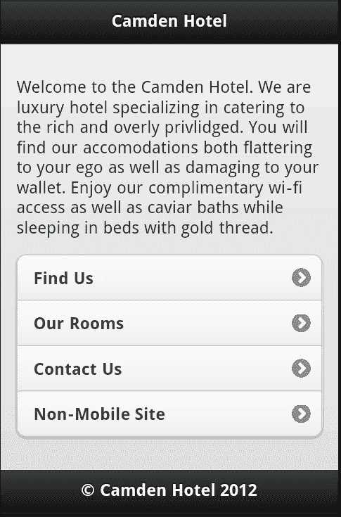
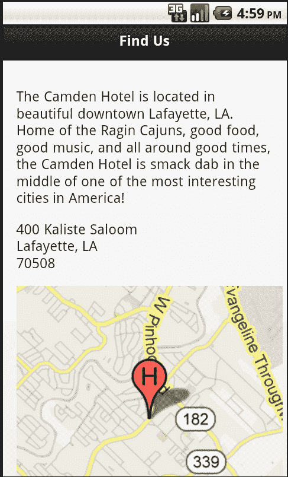
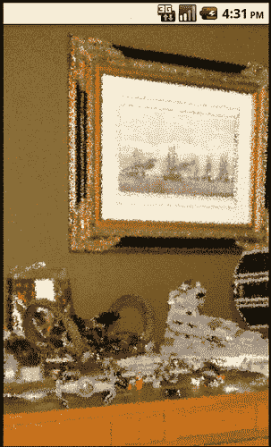
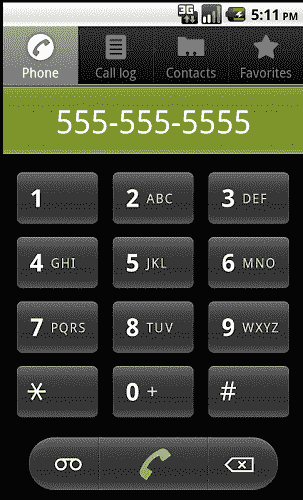

# 五、实用化——建立一个简单的酒店移动网站

在过去的四章中，我们已经了解了 jQuery Mobile 的一些特性，但是我们已经有足够的知识来构建一个简单、非常基础的移动优化网站。

在本章中，我们将：

*   讨论我们的酒店移动网站将包含哪些内容
*   使用 jQuery mobile 创建酒店移动网站
*   讨论如何使网站更具互动性

# 欢迎来到卡姆登酒店

享誉全球的卡姆登酒店（Hotel Camden）在网络上已有一段时间了。（好的，说得清楚一点，这是我们编造的！）他们是网络世界的早期创新者，从 1996 年的一个简单网站开始，多年来逐渐提高了他们的在线影响力。卡姆登酒店的在线游客现在可以看到房间的虚拟游览，使用令人惊叹的 3D Adobe Flash 插件查看场地，并实际在线预订。不过，最近卡姆登酒店的业主决定进军移动领域。目前，他们希望简单地开始创建一个移动优化网站，其中包括以下功能：

*   **联系方式：**包括电话号码和电子邮件地址。理想情况下，用户将能够单击这些按钮并连接到真实的人。
*   **酒店位置地图：**这应该包括地址，可能还有地图。
*   **可用房间类型：**这是一个简单的房间列表，从最简单到最豪华。
*   最后，为用户提供一种访问真实网站的方式。我们接受我们的移动版本会有一定的限制（对于这个版本），所以至少我们应该为用户提供一种返回到站点桌面版本的方式。

# 主页

让我们从卡姆登酒店的初始主页开始。这将提供一个简单的选项列表，以及顶部的一些营销文本。文本实际上对任何人都没有帮助，但营销人员不会让我们在没有它的情况下发布网站：

```js
Listing 5-1: index.html
<!DOCTYPE html>
<html>
<head>
<title>The Camden Hotel</title>
<meta name="viewport" content="width=device-width, initial- scale=1">
<link rel="stylesheet" href="http://code.jquery.com/mobile/ latest/jquery.mobile.min.css" />
<script src="http://code.jquery.com/jquery- 1.7.1.min.js"></script>
<script src="http://code.jquery.com/mobile/ latest/jquery.mobile.min.js"></script>
</head>
<body>
<div data-role="page">
<div data-role="header">
<h1>Camden Hotel</h1>
</div>
<div data-role="content">
<p>
Welcome to the Camden Hotel. We are a luxury hotel specializing in catering to the rich and overly privileged. You will find our accommodations both flattering to your ego, as well as damaging to your wallet. Enjoy our complimentary wi-fi access, as well as caviar baths while sleeping in beds with gold thread.
</p>
<ul data-role="listview" data-inset="true">
<li><a href= "find.html">Find Us</a></li>
<li><a href= "rooms.html">Our Rooms</a></li>
<li><a href= "contact.html">Contact Us</a></li>
<li><a href= "">Non-Mobile Site</a></li>
</ul>
</div>
<div data-role="footer">
<h4>&copy; Camden Hotel 2012</h4>
</div>
</div>
</body>
</html>

```

在高层，`listing 5-1`中的代码只是我们前面讨论过的 jQuery 页面模型的另一个实例。您可以看到 CSS 和 JavaScript 包括哪些内容，以及设置页面、页眉、页脚和内容的 div 包装器。在我们的 content div 中，您还可以看到正在使用的列表。我们将非移动网站选项（“非移动网站”）的 URL 留空，因为我们没有真正的卡姆登酒店网站。

还考虑了列表项的顺序。每个项目都是按照员工认为最常见的请求的顺序列出的，第一个是找到酒店，最后一个选项（忽略离开现场）是联系酒店。

总的来说，这个例子的想法是提供对我们认为酒店客户需要的最重要方面的快速访问。以下截图显示了该网站的外观：



它不是非常性感，但渲染效果很好，而且非常容易使用。稍后，您将学习如何为 jQuery Mobile 设置主题，使您的站点看起来不像其他所有示例。

# 寻找酒店

我们手机网站的下一页重点是帮助用户找到酒店。这将包括地址和地图。`Listing 5-2`显示了这是如何完成的：

```js
Listing 5-2: find.html
<!DOCTYPE html>
<html>
<head>
<title>The Camden Hotel - Find Us</title>
<meta name="viewport" content="width=device-width, initial- scale=1">
<link rel="stylesheet" href="http://code.jquery.com/mobile/ latest/jquery.mobile.min.css" />
<script src="http://code.jquery.com/jquery- 1.7.1.min.js"></script>
<script src="http://code.jquery.com/mobile/latest/ jquery.mobile.min.js"></script>
</head>
<body>
<div data-role="page">
<div data-role="header">
<h1>Find Us</h1>
</div>
<div data-role="content">
<p>
The Camden Hotel is located in beautiful downtown Lafayette, LA. Home of the Ragin Cajuns, good food, good music, and all around good times, the Camden Hotel is smack dab in the middle of one of the most interesting cities in America!
</p>
<p>
400 Kaliste Saloom<br/>
Lafayette, LA<br/>
70508
</p>
<p>

</p>
</div>
<div data-role="footer">
<h4>&copy; Camden Hotel 2012</h4>
</div>
</div>
</body>
</html>

```

模板的开头再次包含了我们的锅炉板，和以前一样，我们在顶部有一些营销讲话的绒毛。紧接着下面是地址和地图。我们使用谷歌最酷的功能之一静态地图创建了地图。你可以在谷歌静态地图的主页上阅读更多关于谷歌静态地图的信息：[http://code.google.com/apis/maps/documentation/staticmaps/](http://code.google.com/apis/maps/documentation/staticmaps/) 。本质上，它是一种通过 URL 参数创建静态映射的方法。这些地图中没有缩放或平移功能，但如果您只是想向用户显示您的企业所在地，这是一种功能强大且简单的方法。虽然有大量的选项可用于此 API，但我们的示例只是将其集中在一个地址上，并在该地址上添加一个标记。标签**H**用于标记，但可以使用自定义图标。下面的屏幕截图显示了它的外观：



你可以在地图 URL 上玩得更多一些，根据你的喜好改变缩放、颜色等等。

# 列出酒店房间

现在我们来看`rooms.html`。在这里，我们将列出酒店可用的房间类型：

```js
Listing 5-3: rooms.html
<!DOCTYPE html>
<html>
<head>
<title>The Camden Hotel - Our Rooms</title>
<meta name="viewport" content="width=device-width, initial- scale=1">
<link rel="stylesheet" href="http://code.jquery.com/mobile/ latest/jquery.mobile.min.css" />
<script src="http://code.jquery.com/jquery- 1.7.1.min.js"></script>
<script src="http://code.jquery.com/mobile/ latest/jquery.mobile.min.js"></script>
</head>
<body>
<div data-role="page">
<div data-role="header">
<h1>Our Rooms</h1>
</div>
<div data-role="content">
<p>
Select a room below to see a picture.
</p>
<ul data-role="listview" data-inset="true">
<li><a href= "room_poor.html">Simple Elegance</a></li>
<li><a href= "room_medium.html">Gold Standard</a></li>
<li><a href= "room_high.html">Emperor Suite</a></li>
</ul>
</div>
<div data-role="footer">
<h4>&copy; Camden Hotel 2012</h4>
</div>
</div>
</body>
</html>

```

房间页面只是他们房间的列表。酒店有三层房间，每层都链接到列表中的，因此用户可以获得详细信息。您可以在从 Github 下载的 ZIP 中找到所有三个文件，但让我们详细了解其中一个：

```js
Listing 5-4: room_high.html
<!DOCTYPE html>
<html>
<head>
<title>The Camden Hotel - Emperor Suite</title>
<meta name="viewport" content="width=device-width, initial- scale=1">
<link rel="stylesheet" href="http://code.jquery.com/mobile/ latest/jquery.mobile.min.css" />
<script src="http://code.jquery.com/jquery- 1.7.1.min.js"></script>
<script src="http://code.jquery.com/mobile/ latest/jquery.mobile.min.js"></script>
</head>
<body>
<div data-role="page" data-fullscreen="true">
<div data-role="header" data-position="fixed">
<h1>Emperor Suite</h1>
</div>
<div data-role="content">

</div>
<div data-role="footer" data-position="fixed">
<h4>&copy; Camden Hotel 2012</h4>
</div>
</div>
</body>
</html>

```

“房间详细信息”页面只是一个图像。这不是很有帮助，但它让人明白了重点。但是，请注意，我们使用了在[第 3 章](03.html "Chapter 3. Enhancing Pages with Headers, Footers, and Toolbars")中学习的技巧，*使用工具栏增强页面*-全屏模式。这允许用户快速单击并隐藏标题，以便他们可以看到房间的所有荣耀：



# 联系酒店

现在让我们看一下联系页面。这将为用户提供如何到达酒店的信息：

```js
Listing 5-5: contact.html
<!DOCTYPE html>
<html>
<head>
<title>The Camden Hotel - Contact</title>
<meta name="viewport" content="width=device-width, initial- scale=1">
<link rel="stylesheet" href="http://code.jquery.com/mobile/ latest/jquery.mobile.min.css" />
<script src="http://code.jquery.com/jquery- 1.7.1.min.js"></script>
<script src="http://code.jquery.com/mobile/ latest/jquery.mobile.min.js"></script>
</head>
<body>
<div data-role="page">
<div data-role="header">
<h1>Contact Us</h1>
</div>
<div data-role="content">
<p>
<b>Phone:</b> <a href= "tel:555-555-5555"> 555-555-5555</a><br/>
<b>Email:</b> <a href= "mailto:people@camdenhotel.fake"> people@camdenhotel.fake</a>
</p>
</div>
<div data-role="footer">
<h4>&copy; Camden Hotel 2012</h4>
</div>
</div>
</body>
</html>

```

和以前一样，我们已经用适当的脚本块和`div`标记包装了页面。请特别注意我们的两个链接。电话和电子邮件链接都使用您可能不熟悉的 URL。第一种方式`tel:555-555-555`实际上是让移动设备拨打电话号码的一种方式。点击它会弹出拨号器，如下图所示：



这使得用户很容易快速呼叫酒店。类似地，mailto 链接将允许快速将电子邮件发送到酒店。还有其他 URL 方案，包括发送 SMS 消息的方案。正如您可能猜到的，此方案使用“sms”形式，因此要开始向电话号码发送 sms 消息，您可以使用以下 URL:`sms://5551112222`。

# 总结

在本章中，我们学习了到目前为止所学的知识，为一家假酒店建立了一个非常简单但有效的网站。该网站为需要在移动设备上了解酒店的人们共享了基本信息，利用谷歌的静态地图 API 创建了一个简单的地图，显示酒店的位置，并演示了如何使用`tel`和`mailto`URL 方案进行自动电话拨号和发邮件。

在下一章中，我们将介绍表单以及如何使用 jQuery Mobile 自动改进表单。