# 六、使用表单和 jQuery Mobile

在本章中，我们将介绍表单。表单是大多数网站的关键部分，因为它们为用户提供了与网站交互的主要方式。jquerymobile 在为移动设备提供可用且设计优雅的表单方面做了大量工作。

在本章中，我们将：

*   谈谈 jQuery Mobile 对表单的作用
*   使用示例表单并描述如何处理结果
*   讨论如何构建特定类型的表单以及如何使用 jQueryMobile 约定的细节

# 开始之前

在本章中，我们将讨论表单以及 jQueryMobile 如何增强表单。作为讨论的一部分，我们将把表单发布到服务器上。为了让服务器对响应进行实际操作，我们将使用来自 Adobe 的名为 ColdFusion 的应用服务器。ColdFusion 并非免费用于生产，而是 100%免费用于开发，是构建 web 应用的优秀服务器。您不需要下载 ColdFusion。如果未提交，则不应提交本章中使用的表格。本章确实讨论了表单是如何提交的，但对表单的响应并不是很关键。如果您知道另一种语言，比如 PHP，那么您应该能够简单地模拟 ColdFusion 用于回显表单数据的代码。

ColdFusion（当前版本 9）可在[下载 http://www.adobe.com/go/coldfusion](http://www.adobe.com/go/coldfusion) 。Windows、OS X 和 Linux 的版本已经存在。如上所述，您可以在开发服务器上免费运行 ColdFusion，而不受超时限制。

# jQuery Mobile 如何处理表单

在开始编写代码之前，关于 jQuery Mobile 将如何处理 HTML 表单，您应该了解两件非常重要的事情：

*   所有表单都将通过 Ajax 提交数据。这意味着数据将直接发送到表单的操作，结果将返回给用户并放置在保存表单的页面中。这将防止重新加载整个页面。
*   所有表单字段都会自动增强，每个字段都有自己的方式。正如我们在本章中继续介绍的那样，您将看到这方面的示例，但基本上 jQuery Mobile 会修改表单字段，以便在移动设备上更好地工作。按钮就是一个很好的例子。jquerymobile 会自动加宽和加高按钮，使它们在手机的小尺寸中更容易点击。如果出于某种原因您不喜欢这种情况，jQuery Mobile 提供了一种方法来禁用它，可以是全局禁用，也可以是每次使用禁用。

考虑到这一点，我们来看一下`Listing 6-1:`中的第一个示例

```js
Listing 6-1: test1.html
<!DOCTYPE html>
<html>
<head>
<title>Form Example 1</title>
<meta name="viewport" content="width=device-width, initial- scale=1">
<link rel="stylesheet" href="http://code.jquery.com/mobile/ latest/jquery.mobile.min.css" />
<script src="http://code.jquery.com/jquery- 1.7.1.min.js"></script>
<script src="http://code.jquery.com/mobile/ latest/jquery.mobile.min.js"></script>
</head>
<body>
<div data-role="page">
<div data-role="header">
<h1>Form Demo</h1>
</div>
<div data-role="content">
<form action="echo.cfm" method="post">
<div data-role="fieldcontain">
<label for="name">Name:</label>
<input type="text" name="name" id="name" value="" />
</div>
<div data-role="fieldcontain">
<label for="email">Email:</label>
<input type="text" name="email" id="email" value="" />
</div>
<div data-role="fieldcontain">
<input type="submit" name="submit" value="Send" />
</div>
</form>
</div>
</div>
</body>
</html>

```

像往常一样，模板以适当的 include 开始，并用我们特别标记的`div`标签包装我们页面的主要内容。我们将重点关注具有主要内容区域的表单字段。建议使用以下标签包装每个表单字段：

```js
<div data-role="fieldcontain">
</div>

```

这将帮助 jQuery Mobile 对齐标签和表单字段。你马上就会明白为什么了。我们的表单有两个文本字段，一个用于名称，一个用于电子邮件。最后一项只是“提交”按钮。因此，除了使用`fieldcontain`包装器并确保表单字段有标签外，这里没有其他特别的事情。尽管您可以立即看到表单的一些令人印象深刻的更改：

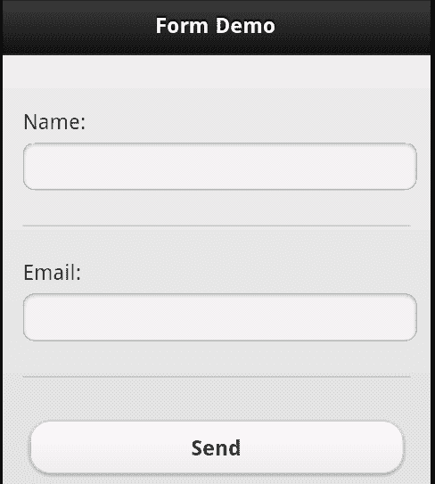

请注意标签是如何显示在表单字段上方的。这为字段在移动设备上提供了更多空间。另外请注意，submit 按钮很大，很容易单击。如果我们旋转设备，jQuery Mobile 会更新显示以利用额外的空间：

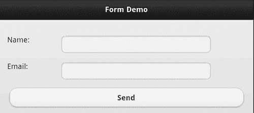

请注意，这些字段现在直接排列在其标签的右侧。那么提交表单时会发生什么？正如本章开头提到的，我们使用 ColdFusion 来处理对表单请求的响应。我们的`echo.cfm`模板将简单地循环所有表单字段，并向用户显示它们：

```js
Listing 6-2: echo.cfm
<div data-role="page">
<div data-role="header">
<h1>Form Result</h1>
</div>
<div data-role="content">
<cfloop item="field" collection="#form#">
<cfoutput>
<p>
The form field #field# has the value #form[field]#.
</p>
</cfoutput>
</cfloop>
</div>
</div>

```

如果不想安装 ColdFusion，只需编辑`listing 6-1`中的表单操作值，指向 PHP 文件或任何其他服务器端处理器。您也可以简单地将其更改为`test1.html`，即文件本身。提交时不会发生任何事情，但也不会出现错误。点击提交后，设备将显示以下内容：

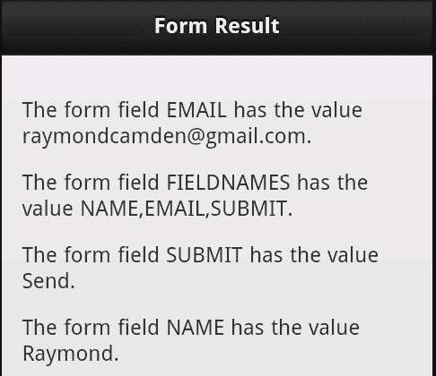

jQuery Mobile 如何更新表单字段的另一个很好的例子是，默认情况下，在移动设备上使用`textarea. textarea`可能非常困难，特别是当文本量超过`textarea`的大小并且添加了滚动条时。在下面的代码清单中，我们简单地修改了前面的表单，以包含第三项，即使用`textarea`的 bio 字段。完整的文件可以在书的代码 ZIP 文件中找到。下面的代码片段是在前两个字段之后添加的`div`块：

```js
<div data-role="fieldcontain">
<label for="bio">Bio:</label>
<textarea name="bio" id="bio" />
</div>

```

在设备上查看时，`textarea`会像常规文本字段一样扩展到更大的宽度，并变得更高：


但一旦你开始打字并输入多行文字，`textarea`就会自动展开：

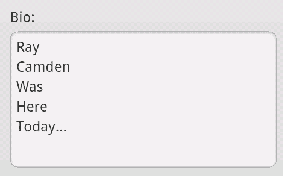

这比使用滚动条更容易阅读。现在让我们看看另一个常见的表单选项-单选按钮和复选框。

## 使用单选按钮和复选框

单选按钮和复选框也会更新，以便在移动设备上正常工作，但需要更多的代码。在前面的示例中，我们用一个使用了`data-role="fieldcontain"`的`div`标记包装表单字段。使用单选按钮和复选框时，还需要一个标签：

```js
<fieldset data-role="controlgroup">

```

此`fieldset`标签将用于将单选按钮或复选框组合在一起。`Listing 6-3`显示一组单选按钮和一个复选框组：

```js
Listing 6-3: test3.html
<!DOCTYPE html>
<html>
<head>
<title>Form Example 3</title>
<meta name="viewport" content="width=device-width, initial- scale=1">
<link rel="stylesheet" href="http://code.jquery.com/mobile/ latest/jquery.mobile.min.css" />
<script src="http://code.jquery.com/jquery- 1.7.1.min.js"></script>
<script src="http://code.jquery.com/mobile/ latest/jquery.mobile.min.js"></script>
</head>
<body>
<div data-role="page">
<div data-role="header">
<h1>Form Demo</h1>
</div>
<div data-role="content">
<form action="echo.cfm" method="post">
<div data-role="fieldcontain">
<fieldset data-role="controlgroup">
<legend>Favorite Movie:</legend>
<input type="radio" name="favoritemovie" id="favoritemovie1" value="Star Wars">
<label for="favoritemovie1">Star Wars</label>
<input type="radio" name="favoritemovie" id="favoritemovie2" value="Vanilla Sky">
<label for="favoritemovie2">Vanilla Sky</label>
<input type="radio" name="favoritemovie" id="favoritemovie3" value="Inception">
<label for="favoritemovie3">Inception</label>
</fieldset>
</div>
<div data-role="fieldcontain">
<fieldset data-role="controlgroup">
<legend>Favorite Colors:</legend>
<input type="checkbox" name="favoritecolor" id="favoritecolor1" value="Green">
<label for="favoritecolor1">Green</label>
<input type="checkbox" name="favoritecolor" id="favoritecolor2" value="Red">
<label for="favoritecolor2">Red</label>
<input type="checkbox" name="favoritecolor" id="favoritecolor3" value="Yellow">
<label for="favoritecolor3">Yellow</label>
</fieldset>
</div>
<input type="submit" name="submit" value="Send" />
</div>
</form>
</div>
</div>
</body>
</html>

```

我们的表格有两个主要问题-你最喜欢的电影是什么？你最喜欢的颜色是什么？每个块都包装在我们前面提到的 div 标记中。这里面是使用`data-role="controlgroup"`的`fieldset`。最后，您将拥有您的收音机和复选框组。正如前面的每个示例所示，在适当的标签选项卡中包含标签非常重要。一旦呈现，jQuery Mobile 会将这些控件组合成一个漂亮的、单一的控件：

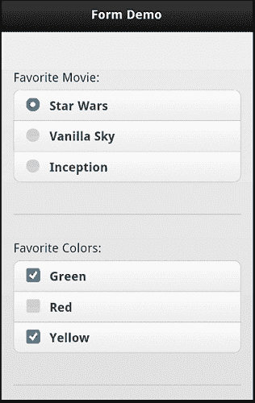

请注意，每个项目都有很宽的可单击区域。这使得在移动设备上选择项目更加容易。这两个控件的另一个有趣特性是能够将它们转换为水平按钮栏。在`test4.html`中，两个`fieldset`标记都被修改为包含一个新的数据属性：

```js
<fieldset data-role="controlgroup" data-type="horizontal">

```

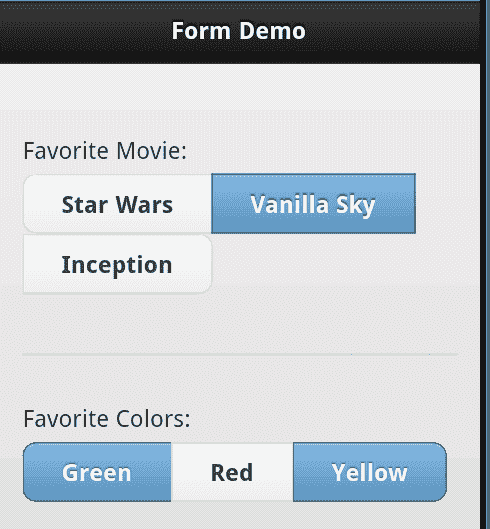

正如您所看到的，第一组中的较长文本的效果不太好，所以一定要测试它。

## 使用选择菜单

jQueryMobile 表单增强的另一个例子是选择菜单。与前面的示例一样，我们使用了一个`fieldcontain div`和`label`标记，但除此之外，`select`标记是正常使用的。以下代码段来自`test5.html:`

```js
<div data-role="fieldcontain">
<label for="favmovie">Favorite Movie:</label>
<select name="favmovie" id="favmovie">
<option value="Star Wars">Star Wars</option>
<option value="Revenge of the Sith">Revenge of the Sith</option>
<option value="Tron">Tron</option>
<option value="Tron Legacy">Tron Legacy</option>
</select>
</div>

```

在移动设备上，选择的初始显示被修改为更容易点击：

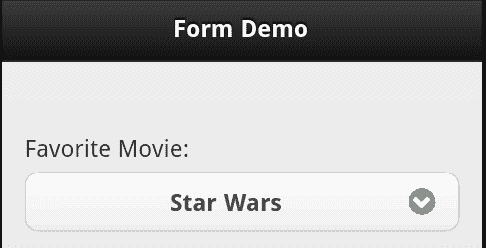

但是，单击后，设备的本机菜单将接管。这在您使用的平台上看起来会有所不同。以下屏幕截图显示 Android 如何呈现菜单：

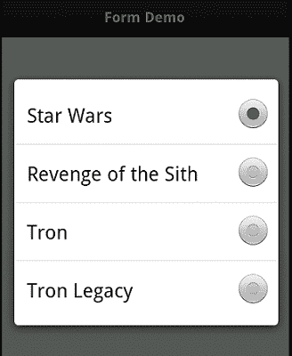

与选择字段一起使用的另一个选项是分组。jQuery Mobile 允许您将多个选择字段垂直或水平分组。在这两种情况下，所需的只是使用`controlgroup`的`data-role`将您选择的字段包装在一个`fieldset`中，就像我们之前对收音机和复选框所做的那样。下面的代码片段是一组垂直对齐的 select 字段的示例：

```js
<div data-role="fieldcontain">
<fieldset data-role="controlgroup">
<legend>Trip Setup:</legend>
<label for="location">Location</label>
<select name="location" id="location">
<option value="Home">Home</option>
<option value="Work">Work</option>
<option value="Moon">Moon</option>
<option value="Airport">Airport</option>
</select>
<label for="time">Time</label>
<select name="time" id="time">
<option value="Morning">Morning</option>
<option value="Afternoon">Afternoon</option>
<option value="Evening">Evening</option>
</select>
<label for="time">Meal</label>
<select name="meal" id="meal">
<option value="Meat">Meat</option>
<option value="Vegan">Vegan</option>
<option value="Kosher">Kosher</option>
</select>
</fieldset>
</div>

```

此模板的其余部分可在`test6.html`中找到。下面的屏幕截图显示了它的外观：

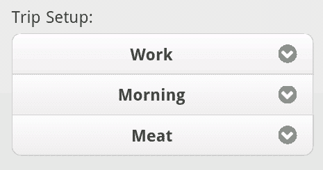

请注意 jQuery Mobile 是如何将它们组合在一起并很好地绕过各个角落的。水平版本可以通过向 fieldset 标记添加一个`data-type="horizontal"`属性来实现。使用“fieldcontain”删除`div`也很重要。下面是一个例子（完整的文件可以在`test7.html):`中找到）

```js
<div data-role="page">
<div data-role="header">
<h1>Form Demo</h1>
</div>
<div data-role="content">
<form action="echo.cfm" method="post">
<fieldset data-role="controlgroup" data-type="horizontal">
<legend>Trip Setup:</legend>
<label for="location">Location</label>
<select name="location" id="location">
<option value="Home">Home</option>
<option value="Work">Work</option>
<option value="Moon">Moon</option>
<option value="Airport">Airport</option>
</select>
<label for="time">Time</label>
<select name="time" id="time">
<option value="Morning">Morning</option>
<option value="Afternoon">Afternoon</option>
<option value="Evening">Evening</option>
</select>
<label for="meal">Meal</label>
<select name="meal" id="meal">
<option value="Meat">Meat</option>
<option value="Vegan">Vegan</option>
<option value="Kosher">Kosher</option>
</select>
</fieldset>
<div data-role="fieldcontain">
<input type="submit" name="submit" value="Send" />
</div>
</form>
</div>
</div>

```

下面的屏幕截图显示了结果：


## 搜索、切换和滑块字段

除了使用常规表单字段并使其更好地工作外，jQuery Mobile 还帮助使一些较新的 HTML5 表单字段在多个浏览器中正确工作。虽然还没有在每个主要浏览器的桌面上确定支持，但 jQuery Mobile 为搜索、切换和滑块字段提供了内置支持。让我们来看看每一个。

### 搜索字段

搜索字段是三个新字段中最简单的一个，它只是在开始键入后在字段末尾添加一个快速删除图标。一些设备还将在前面放置沙漏图标，以帮助传达该字段用于某种类型搜索的想法。要使用此字段，只需将您的类型从文本切换到搜索。如`test8.html:`中的以下示例所示

```js
<div data-role="fieldcontain">
<label for="name">Name:</label>
<input type="search" name="name" id="name" value="" />
</div>

```

下面的屏幕截图是结果。请注意，我键入了一点，该字段会自动在末尾添加一个**删除**图标：

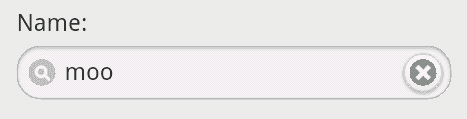

### 翻转切换字段

翻转切换字段是在一个值和两个值之间翻转的控件。创建切换字段涉及使用具有特定数据角色值的选择控件。现在，事情可能会变得有点混乱。要使选择字段变为切换字段，请使用`data-role="slider"`。稍后我们将看到另一个滑块控件，但它使用了不同的技术。请记住，尽管您将在 HTML 中看到`"slider"`，但它实际上是我们正在创建的切换控件。让我们看一个简单的例子。（您可以在`test9.html):`中找到完整的来源）

```js
<div data-role="fieldcontain">
<label for="gender">Gender:</label>
<select name="gender" id="gender" data-role="slider">
<option value="0">Male</option>
<option value="1">Female</option>
</select>
</div>

```

jQuery Mobile 呈现后，以下屏幕截图显示结果，首先是默认的**男性**选项，然后是**女性：**


### 滑块字段

对于我们的最后一个特殊领域，我们来看看滑块。与搜索字段一样，这是基于 HTML5 规范的，该规范适用于某些浏览器，而不适用于其他浏览器。jquerymobile 只是让它在任何地方都能工作。为了启用此字段，我们使用一个常规文本字段，并将类型切换到`"range"`以给滑块提供一个范围，我们还提供了`min`和`max`值。您还可以通过添加属性`data-highlight="true"`向滑块添加其他颜色。下面的代码片段是一个示例。（您可以在`test10.html):`中找到完整的文件

```js
<div data-role="fieldcontain">
<label for="coolness">Coolness:</label>
<input type="range" name="coolness" id="coolness" min="0" max="100" value="22" data-highlight="true">
</div>

```

结果是一个滑块控件和一个输入字段。两者都允许您修改最小值和最大值之间的值：

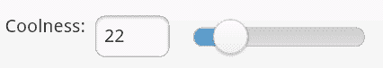

注意，该范围的 HTML5 规范支持 step 属性。虽然这在某些浏览器中有效，但 jQuery Mobile 尚未直接支持它。换句话说，jQuery Mobile 不会尝试在没有内置支持的浏览器上添加这种支持。您可以添加属性，只要您知道它可能并不总是按预期工作。

## 使用本机表单控件

现在，您已经了解了 jQuery Mobile 将在多大程度上增强和授权表单字段，以便在移动设备上更好地工作，但如果您不喜欢 jQuery Mobile 的工作，该怎么办？如果您喜欢它对按钮的更新，但不喜欢它对下拉菜单的更改，该怎么办？幸运的是，jquerymobile 提供了一种禁用自动增强的简单方法。在每一个你想单独留下的字段中，只需将`data-role="none"`添加到标记中。因此，给定以下 HTML，第一个项目将被更新，而第二个项目不会被更新：

```js
<input type="submit" value="Awesome">
<input type="submit" value="Not So Awesome" data-role="none">

```


另一个选项是在初始化 jQuery Mobile 时禁用它。该选项将在[第 9 章](09.html "Chapter 9. Working with Events")、*jQuery Mobile*中的 JavaScript 配置和工具中讨论。

# 使用“迷你”字段

在前面的示例中，我们看到了 jquerymobile 如何自动增强表单字段，使它们在更小的基于触摸的设备上变得更容易。总的来说，jquerymobile 把你的领域做得又好又胖。虽然这在大多数情况下都是可取的，但您可能希望对表单字段进行一点节食。在页眉或页脚中放置表单字段时尤其如此。jQuery Mobile 支持在任何表单字段上创建一个较小版本的字段：`data-mini="true"`的属性。下面的代码片段是一个完整的示例：

```js
<div data-role="fieldcontain">
<label for="name">Name:</label>
<input type="search" name="name" id="name" value="" />
</div>
<div data-role="fieldcontain">
<label for="name">Name (Slim):</label>
<input type="search" name="name" id="name" value="" data- mini="true" />
</div>

```

结果有点微妙，但您可以在以下屏幕截图的第二个字段中看到高度差：

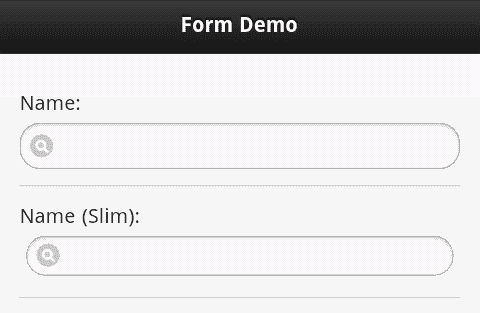

此示例可以在名为`test12.html`的文件中找到其余文件。

# 总结

在本章中，我们讨论了表单以及如何在 jQueryMobile 应用中呈现表单。我们讨论了 jQueryMobile 如何自动将所有表单提交转换为基于 Ajax 的调用，并更新表单字段以更好地在移动设备上工作。不仅所有表单字段都会自动更新，还可以使用新控件，如切换、滑块和搜索输入。

在下一章中，我们将了解模态对话框、小部件和布局网格。这些为您的移动优化站点提供了额外的 UI 选项。