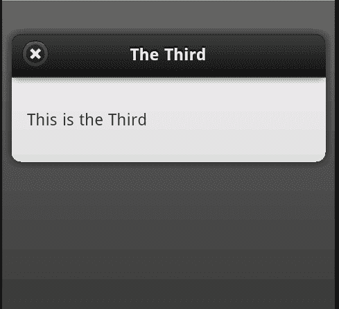
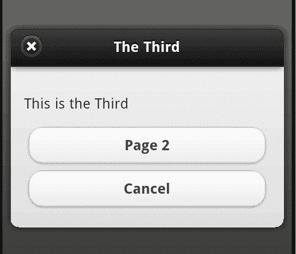
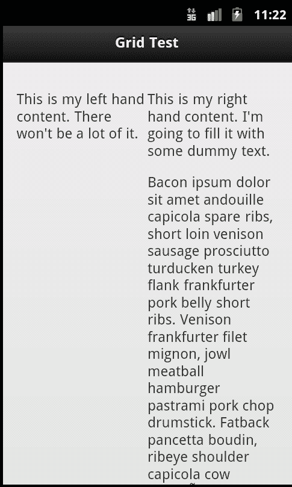
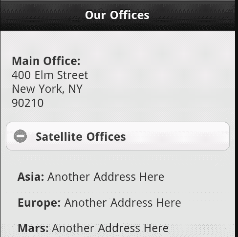
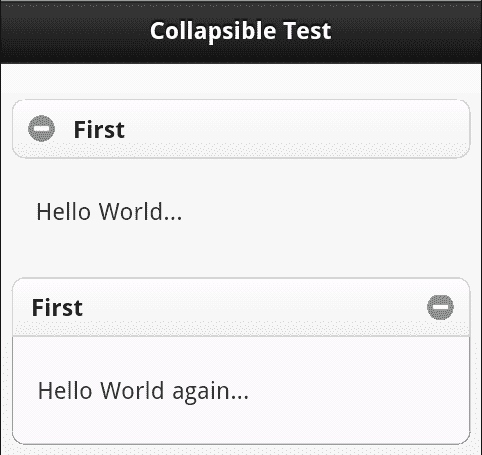
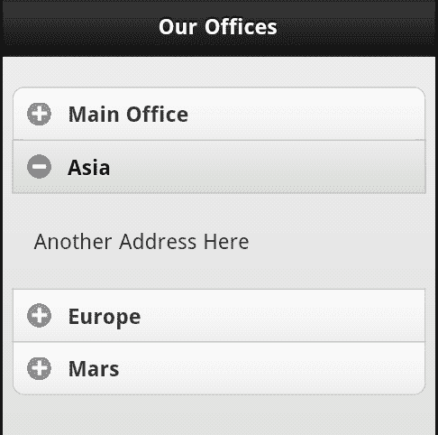

# 七、创建模态对话框、网格和可折叠块

在本章中，我们将介绍对话框、网格和可折叠块。在前面的章节中，我们讨论了页面、按钮和表单控件。虽然 jQuery Mobile 为它们提供了很好的支持，但在框架中可以获得更多的 UI 控件。

在本章中，我们将：

*   讨论如何链接和创建对话框，以及如何处理这些对话框
*   演示网格以及如何将其添加到页面中
*   展示可折叠块如何允许您在少量空间中打包大量信息

# 创建对话

对话框：至少在 jQueryMobile 框架下：是覆盖现有页面的小窗口。它们通常为用户提供短消息或问题。它们通常还包括一个按钮，允许用户关闭对话框并返回站点。在 jQuery Mobile 中创建对话框只需向链接添加一个简单属性：`data-rel="dialog"`。下面的清单演示了一个示例：

```js
Listing 7-1: test1.html
<!DOCTYPE html>
<html>
<head>
<title>Dialog Test</title>
<meta name="viewport" content="width=device-width, initial- scale=1">
<link rel="stylesheet" href="http://code.jquery.com/mobile/ latest/jquery.mobile.min.css" />
<script src="http://code.jquery.com/jquery- 1.7.1.min.js"></script>
<script src="http://code.jquery.com/mobile/latest/ jquery.mobile.min.js"></script>
</head>
<body>
<div data-role="page" id="first">
<div data-role="header">
<h1>Dialog Test</h1>
</div>
<div data-role="content">
<p>
<a href="#page2">Another Page (normal)</a>
</p>
<p>
<a href="#page3" data-rel="dialog">A Dialog (dialog)</a>
</p>
</div>
</div>
<div data-role="page" id="page2">
<div data-role="header">
<h1>The Second</h1>
</div>
<div data-role="content">
<p>
This is the Second
</p>
</div>
</div>
<div data-role="page" id="page3">
<div data-role="header">
<h1>The Third</h1>
</div>
<div data-role="content">
<p>
This is the Third
</p>
</div>
</div>
</body>
</html>

```

这是一个简单的多页面 jQueryMobile 站点。注意我们如何链接到第二页和第三页。第一个环节是典型的。不过，第二个链接包括前面提到的`data-rel`属性。请注意，第二页和第三页都是以通常的方式定义的。所以我们这里唯一的变化就是链接。当点击第二个链接时，页面呈现方式完全不同：



请记住，该页面的定义并不不同。您在上一个屏幕截图中看到的更改是由链接本身的更改驱动的。就这样！点击小的**X**按钮将隐藏对话框并将用户返回到原始页面。

页面中的任何链接都可以关闭对话框。如果您希望添加取消类型按钮或链接，可以使用链接中的`data-rel="back"`进行添加。链接的目标应该是启动对话框的页面。`Listing 7-2`显示早期模板的修改版本。在本例中，我们只是在对话框中添加了两个按钮。第一个按钮将启动第二个页面，第二个按钮将作为**取消**操作。

```js
Listing 7-2: test2.html
<!DOCTYPE html>
<html>
<head>
<title>Dialog Test (2)</title>
<meta name="viewport" content="width=device-width, initial- scale=1">
<link rel="stylesheet" href="http://code.jquery.com/mobile/ latest/jquery.mobile.min.css" />
<script src="http://code.jquery.com/jquery- 1.7.1.min.js"></script>
<script src="http://code.jquery.com/mobile/ latest/jquery.mobile.min.js"></script>
</head>
<body>
<div data-role="page" id="first">
<div data-role="header">
<h1>Dialog Test</h1>
</div>
<div data-role="content">
<p>
<a href="#page2">Another Page (normal)</a>
</p>
<p>
<a href="#page3" data-rel="dialog">A Dialog (dialog)</a>
</p>
</div>
</div>
<div data-role="page" id="page2">
<div data-role="header">
<h1>The Second</h1>
</div>
<div data-role="content">
<p>
This is the Second
</p>
</div>
</div>
<div data-role="page" id="page3">
<div data-role="header">
<h1>The Third</h1>
</div>
<div data-role="content">
<p>
This is the Third
</p>
<a href="#page2" data-role="button">Page 2</a>
<a href="#first" data-role="button" data- rel="back">Cancel</a>
</div>
</div>
</body>
</html>

```

此模板的主要变化是在对话框中添加了按钮，包含在`page3 div`中。请注意，第一个链接变成了一个按钮，但在按钮之外是一个简单的链接。第二个按钮包括添加`data-rel="back"`属性。这将简单地处理取消对话框的问题。以下屏幕截图显示了添加按钮后对话框的外观：



# 使用网格布局内容

网格是 jQuery Mobile 的少数几个不使用特定数据属性的功能之一。相反，您只需为内容指定 CSS 类即可使用网格。

网格有四种风格：两列、三列、四列和五列。（您可能不想在手机设备上使用“五”列。请将其保存在平板电脑上。）

您可以使用`ui-grid-X`类的`div`块开始网格，其中`X`将是`a, b, c`或`d. ui-grid-a`表示两列网格。`ui-grid-b`是一个三柱网格。你大概可以猜出`c`和`d`创造了什么。

因此，要开始两列网格，您需要用以下内容包装内容：

```js
<div class="ui-grid-a">
Content
</div>

```

在`div`标记中，然后对内容的每个“单元格”使用`div`。网格调用的类以`ui-block-X`开始，其中`X`从`a`到`d. ui-block-a`将用于第一个单元，`ui-block-b`用于下一个单元，依此类推。这与 HTML 表非常相似。

下面的代码片段展示了一个简单的两列网格，其中包含两个内容单元：

```js
<div class="ui-grid-a">
<div class="ui-block-a">Left</div>
<div class="ui-block-b">Right</div>
</div>

```

单元格中的文本将自动换行。`Listing 7-3`展示了一个简单的网格，其中一列包含大量文本：

```js
Listing 7-3: test3.html
<!DOCTYPE html>
<html>
<head>
<title>Grid Test</title>
<meta name="viewport" content="width=device-width, initial- scale=1">
<link rel="stylesheet" href="http://code.jquery.com/mobile/ latest/jquery.mobile.min.css" />
<script src="http://code.jquery.com/jquery- 1.7.1.min.js"></script>
<script src="http://code.jquery.com/mobile/ latest/jquery.mobile.min.js"></script>
</head>
<body>
<div data-role="page" id="first">
<div data-role="header">
<h1>Grid Test</h1>
</div>
<div data-role="content">
<div class="ui-grid-a">
<div class="ui-block-a">
<p>
This is my left hand content. There won't be a lot of it.
</p>
</div>
<div class="ui-block-b">
<p>
This is my right hand content. I'm going to fill it with some dummy text.
</p>
<p>
Bacon ipsum dolor sit amet andouille capicola spare ribs, short loin venison sausage prosciutto turducken turkey flank frankfurter pork belly short ribs. Venison frankfurter filet mignon, jowl meatball hamburger pastrami pork chop drumstick. Fatback pancetta boudin, ribeye shoulder capicola cow leberkäse bresaola spare ribs prosciutto venison ball tip jowl andouille. Beef ribs t-bone swine, tail capicola turkey pork belly leberkäse frankfurter jowl. Shankle ball tip sirloin frankfurter bacon beef ribs. Tenderloin beef ribs pork chop, pancetta turkey bacon short ribs ham flank chuck pork belly. Tongue strip steak short ribs tail swine.
</p>
</div>
</div>
</div>
</div>
</body>
</html>

```

在手机浏览器中，您可以清楚地看到两列：



因此，使用其他类型的网格只需切换到其他类即可。例如，将设置一个类似于以下代码段的四列网格：

```js
<div class="ui-grid-c">
<div class="ui-block-a">1st cell</div>
<div class="ui-block-b">2nd cell</div>
<div class="ui-block-c">3rd cell</div>
</div>

```

同样，记住你的目标受众。任何超过两列的东西在手机上都可能太薄。

要在网格中创建多行，只需重复块。下面的代码片段演示了一个包含两行单元格的网格的简单示例：

```js
<div class="ui-grid-a">
<div class="ui-block-a">Left Top</div>
<div class="ui-block-b">Right Top</div>
<div class="ui-block-a">Left Bottom</div>
<div class="ui-block-b">Right Bottom</div>
</div>

```

请注意，没有任何行的概念。jQuery Mobile 知道当块以标记为`ui-block-a`的行重新开始时，它应该创建一个新行。下面的代码片段`Listing 7-4`是一个简单的示例：

```js
Listing 7-4:test4.html
<!DOCTYPE html>
<html>
<head>
<title>Grid Test (2)</title>
<meta name="viewport" content="width=device-width, initial- scale=1">
<link rel="stylesheet" href="http://code.jquery.com/mobile/ latest/jquery.mobile.min.css" />
<script src="http://code.jquery.com/jquery- 1.7.1.min.js"></script>
<script src="http://code.jquery.com/mobile/latest/ jquery.mobile.min.js"></script>
</head>
<body>
<div data-role="page" id="first">
<div data-role="header">
<h1>Grid Test</h1>
</div>
<div data-role="content">
<div class="ui-grid-a">
<div class="ui-block-a">
<p>

</p>
</div>
<div class="ui-block-b">
<p>
This is Raymond Camden. Here is some text about him. It may wrap or it may not but jQuery Mobile will make it look good. Unlike Ray!
</p>
</div>
<div class="ui-block-a">
<p>
This is Scott Stroz. Scott Stroz is a guy who plays golf and is really good at FPS video games.
</p>
</div>
<div class="ui-block-b">
<p>

</p>
</div>
</div>
</div>
</div>
</body>
</html>

```

以下屏幕截图显示了结果：


# 处理可折叠内容物

我们将在本章中介绍的最后一个小部件支持可折叠内容。这只是可以折叠和扩展的内容。创建一个可折叠的内容小部件非常简单，只需将其包装在一个 div 中，添加`data-role="collapsible"`，并包含内容的标题。考虑下面的简单例子：

```js
<div data-role="collapsible">
<h1>My News</h1>
<p>This is the latest news about me...
</div>

```

呈现后，jQuery Mobile 会将标题变成可单击的横幅，可以展开和折叠其中的内容。让我们看一个真实的例子。假设您想共享公司主地址的位置。您还希望包括卫星办公室。由于大多数人不关心其他办公室，我们可以使用一个简单的可折叠内容小部件来隐藏默认内容。下面的代码片段`Listing 7-5`演示了一个示例：

```js
Listing 7-5: test5.html
<!DOCTYPE html>
<html>
<head>
<title>Collapsible Content</title>
<meta name="viewport" content="width=device-width, initial- scale=1">
<link rel="stylesheet" href="http://code.jquery.com/mobile/ latest/jquery.mobile.min.css" />
<script src="http://code.jquery.com/jquery- 1.7.1.min.js"></script>
<script src="http://code.jquery.com/mobile/latest/ jquery.mobile.min.js"></script>
</head>
<body>
<div data-role="page" id="first">
<div data-role="header">
<h1>Our Offices</h1>
</div>
<div data-role="content">
<p>
<strong>Main Office:</strong><br/>
400 Elm Street<br/>
New York, NY<br/>
90210
</p>
<div data-role="collapsible">
<h3>Satellite Offices</h3>
<p>
<strong>Asia:</strong>
Another Address Here
</p>
<p>
<strong>Europe:</strong>
Another Address Here
</p>
<p>
<strong>Mars:</strong>
Another Address Here
</p>
</div>
</div>
</div>
</body>
</html>

```

您可以看到，其他办公室都使用新的可折叠内容角色包装在`div`标记中。查看时，请注意它们是隐藏的：


点击标题旁边的**+**按钮打开，再次点击可重新关闭：



默认情况下，jQuery Mobile 将折叠并隐藏内容。当然，您可以告诉 jquerymobile 初始化块 open 而不是 closed。为此，只需将`data-collapsed="false"`添加到初始`div`标记中即可。例如：

```js
<div data-role="collapsible" data-collapsed="false">
<h1>My News</h1>
<p>This is the latest news about me...
</div>

```

该区域仍有崩溃和打开的能力，但将默认为最初打开。

可折叠内容块的另一个选项是能够对折叠区域的内容设置主题。通过提供一个`data-content-theme`属性，您可以指定一种背景颜色，使该区域更加内聚。主题化在[第 11 章](11.html "Chapter 11. Enhancing jQuery Mobile")、*主题化 jQuery Mobile*中有介绍，但我们可以看一个简单的例子。在下面的屏幕截图中，第一个区域不使用该功能，而第二个区域使用该功能：



请注意，图标也向右移动。这说明了另一个选项`data-iconpos`。在代码文件夹中找到的以下代码片段`test5-2.html`演示了这些选项：

```js
<div data-role="collapsible">
<h3>First</h3>
<p>
Hello World...
</p>
</div>
<div data-role="collapsible" data-content-theme="c" data- iconpos="right">
<h3>First</h3>
<p>
Hello World again...
</p>
</div>

```

最后，您可以将多个可折叠区域合并为一个称为手风琴的区域。这是通过简单地获取多个可折叠块并将它们包装在一个新的`div`标签中来实现的。此`div`标签利用`data-role="collapsible-set"`将内部块作为一个单元。`Listing 7-6`就是一个例子。它以前面的办公地址为例，为每个唯一地址使用一个可折叠的集合：

```js
Listing 7-6: test6.html
<!DOCTYPE html>
<html>
<head>
<title>Collapsible Content</title>
<meta name="viewport" content="width=device-width, initial- scale=1">
<link rel="stylesheet" href="http://code.jquery.com/mobile/ latest/jquery.mobile.min.css" />
<script src="http://code.jquery.com/jquery- 1.7.1.min.js"></script>
<script src="http://code.jquery.com/mobile/ latest/jquery.mobile.min.js"></script>
</head>
<body>
<div data-role="page" id="first">
<div data-role="header">
<h1>Our Offices</h1>
</div>
<div data-role="content">
<div data-role="collapsible-set">
<div data-role="collapsible">
<h3>Main Office</h3>
<p>
400 Elm Street<br/>
New York, NY<br/>
90210
</p>
</div>
<div data-role="collapsible">
<h3>Asia</h3>
<p>
Another Address Here
</p>
</div>
<div data-role="collapsible">
<h3>Europe</h3>
<p>
Another Address Here
</p>
</div>
<div data-role="collapsible">
<h3>Mars</h3>
<p>
Another Address Here
</p>
</div>
</div>
</div>
</div>
</body>
</html>

```

在`listing 7-6`中，我们简单地用`div`标记包装四个可折叠块，该标记利用可折叠集。完成后，jQuery Mobile 将它们组合在一起，并在另一个打开时自动关闭：



# 总结

在本章中，我们进一步了解了 jQuery Mobile 如何增强基本 HTML，从而为移动页面提供额外的布局控件。通过对话，我们学习了如何向用户提供基本、快速、模态的消息。使用网格，我们学习了一种新方法，可以轻松地在列中布局内容。最后，通过可折叠的内容块，我们学习了一种很酷的方法，可以在不占用屏幕空间的情况下共享其他内容。

在下一章中，我们将演示一个完整的真实示例，该示例创建一个基本的便笺跟踪器。它利用了额外的 HTML5 特性，以及您在过去几章中学习的一些 UI 技巧。