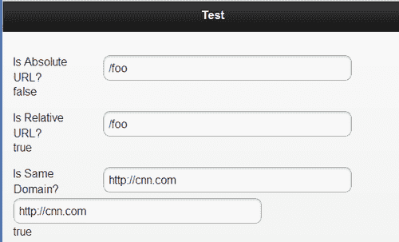
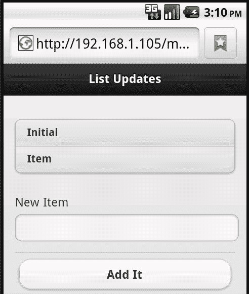
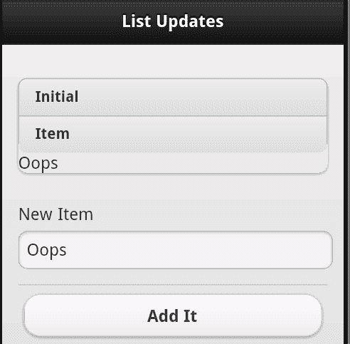
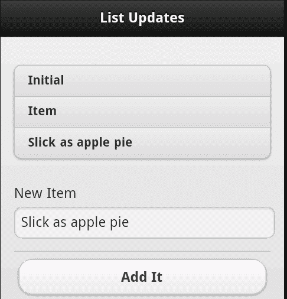

# 八、jQueryMobile 配置、工具和 JavaScript 方法

在本章中，我们将了解如何使用 JavaScript 进一步配置和增强 jQueryMobile 网站。到目前为止，我们已经使用 HTML 和 CSS 来生成所有内容。现在，我们将研究为站点添加附加功能的附加脚本。

在本章中，我们将：

*   解释如何通过 JavaScript 配置 jQueryMobile 站点
*   讨论 jQuery Mobile 附带的各种 JavaScript 工具，以及如何使用它们
*   解释用于增强 jQueryMobile 表单和小部件控件的 API

# 配置 jQuery Mobile

jquerymobile 为您做了很多事情——从改进页面导航到更改表单控件的工作方式。所有这些都是为了让您的内容在移动环境中更好地工作。但是，有时您不希望 jquerymobile 做一些事情，或者您可能只是想稍微调整一下框架的工作方式。这就是配置的用武之地。

要配置 jQueryMobile 站点，首先要编写侦听`mobileinit`事件的代码。这可以使用普通的 jQuery 事件处理程序进行监听，类似于下面的代码片段：

```js
$(document).bind("mobileinit", function() {
//your customization here
});

```

为了捕获此事件，必须在实际加载 jQuery Mobile 之前对其进行配置。要做到这一点，最简单的方法，也是 jQuery Mobile 文档推荐的方法，就是简单地将此代码放在 jQuery Mobile JavaScript 库之前加载的脚本中。下面的代码片段显示了文件的标题通常是什么样子：

```js
<!DOCTYPE html>
<html>
<head>
<title>Dialog Test</title>
<meta name="viewport" content="width=device-width, initial- scale=1">
<link rel="stylesheet" href="http://code.jquery.com/mobile/ latest/jquery.mobile.min.css" />
<script src="http://code.jquery.com/jquery- 1.7.1.min.js"></script>
<script src="http://code.jquery.com/mobile/ latest/jquery.mobile.min.js"></script>
</head>

```

请注意，jQueryMobile 库是最后一个加载的库。我们只需在它前面添加一个新的脚本标记：

```js
<!DOCTYPE html>
<html>
<head>
<title>Dialog Test</title>
<meta name="viewport" content="width=device-width, initial- scale=1">
<link rel="stylesheet" href="http://code.jquery.com/mobile/ latest/jquery.mobile.min.css" />
<script src="http://code.jquery.com/jquery- 1.7.1.min.js"></script>
<script src="config.js"></script>
<script src="http://code.jquery.com/mobile/ latest/jquery.mobile.min.js"></script>
</head>

```

配置 jQuery Mobile 就像更新`$.mobile`对象一样简单。下面的代码片段是一个简单的示例：

```js
$(document).bind("mobileinit", function() {
$.mobile.someSetting="some value here";
});

```

此对象包含一组可配置的各种设置的键/值对。您实际上并没有创建它-它在事件处理程序运行时存在。另一个选项是使用 jQuery 的`extend()`功能，如以下代码片段所示：

```js
$(document).bind("mobileinit", function() {
$.extend($.mobile, {
someSetting:"some value here"
});
});

```

任何一种形式都可以，并且工作原理完全相同。使用感觉更舒服的。现在，让我们看看各种配置选项：

<colgroup><col style="text-align: left"> <col style="text-align: left"></colgroup> 
| 

设置

 | 

使用

 |
| --- | --- |
| `ns` | 这是用于数据属性的命名空间值。它默认为无。如果希望在 jQuery Mobile 可识别的数据属性前加前缀，可以在此处指定一个值。因此，例如，如果您想使用`data-jqm-role="page"`而不是`data-role="page"`，您可以将 ns 值配置为`jqm`。 |
| `activeBtnClass` | 这只是设置处于活动状态的按钮所使用的类名。此值的默认值为`ui-btn-active`。 |
| `activePageClass` | 这将为当前正在查看的页面设置类名。此值的默认值为`ui-page-active`。 |
| `ajaxEnabled` | 我们之前已经讨论过如何将 Ajax 用于页面加载和表单提交。如果要禁用此功能，请将此值设置为`false`。显然，默认值是`true`。 |
| `allowCrossDomainPages` | 安全设置默认为 false，将其设置为 true 允许通过`$.mobile.loadPage`加载远程页面。这通常仅适用于从其他服务器加载内容的 PhoneGap 应用。 |
| `autoInitializePage` | 正常情况下，jQuery Mobile 会加载运行`$.mobile.initializePage`。这将显示“渲染”页面。（此时，此特定函数未正确记录。）如果要禁用此默认值，请将`autoInitializePage`设置为`false`。您需要手动运行`$.mobile.initializePage`。 |
| `defaultDialogTransition` | 指定应使用何种转换来显示或隐藏对话框。默认为`pop`。可能的值为：`fade, flip, pop, slide, slidedown`和`slideup`。 |
| `defaultPageTransition` | 与前面的选项一样，此设置用于转换，这次用于页面加载。默认为`slide`，可以选择与上一个选项类似的选项。 |
| `gradea` | 用于确定“良好”浏览器的实际构成。这是由 jquerymobile 处理的，但是如果您想要否决框架，或者定义一些必须满足的其他条件，那么您可以在这里提供一个返回布尔值（true 或 false）的函数。 |
| `hashListeningEnabled` | 指能够监听浏览器`location.hash`属性中的更改。jQuery Mobile 通常会处理这个问题，但如果该值设置为`false`，您可以编写自己的代码来响应这些更改。 |
| `ignoreContentEnabled` | 通常情况下，jquerymobile 会自动增强它所能做到的一切。在某些情况下，您可以在控制级别禁用此功能，但也可以通过添加`data-enhance=true`告知 jQuery Mobile 忽略特定容器中的所有内容。如果您使用此功能，那么您的配置必须设置为`ignoreContentEnabled`到`true`。这告诉 jquerymobile 寻找并尊重这个特定的标志。这在默认情况下设置为`false`，并允许 jQuery Mobile 更快地发挥其魔力。 |
| `linkBindingEnabled` | jQuery Mobile 通常会侦听所有链接单击。如果您希望全局禁用此功能，可以使用此设置。 |
| `loadingMessage` | 这指定加载页面时使用的文本。这通常是“加载”，但您可以在此处使用自定义代码检查用户的区域设置并使用特定于本地的版本。但是，消息通常是隐藏的。有关详细信息，请参见下一设置。 |
| `loadingMessageTextVisible` | 当 jQuery Mobile 加载页面时，只使用加载图形。如果您希望同时显示消息，请将此值设置为`true`。默认为`false`。 |
| `loadingMessageTheme` | 用于页面加载对话框的主题。默认为`a`。 |
| `minScrollBack` | 当您返回页面时，jQuery Mobile 将尝试记住您在页面中的滚动位置。这在用户访问另一个页面后返回的大型页面上非常有用。默认情况下，如果滚动超过默认值`150`，则会记住滚动。 |
| `pageLoadErrorMssage` | 如果加载页面时发生错误，则向用户显示此消息。默认为**错误加载页面**，但由于本地化原因可以更改。（或者任何真正的原因。） |
| `pageLoadErrorMessageTheme` | 显示页面加载错误对话框时要使用的主题。默认为`e`。 |
| `pushStateEnabled` | 告诉 jQuery Mobile 使用 HTML5`pushState`功能，而不是基于哈希的页面导航更改。默认为`true`。 |
| `subPageUrlKey` | jQuery Mobile 支持一个文件中的多个页面。为了使这些“虚拟”页面成为可书签页面，jQuery Mobile 将向包含前缀 ui 页面的 URL 追加一个值。例如，`ui-page=yourpage`。此设置允许您自定义前缀。 |

这是相当多的选项，但通常您只需要配置其中一个或两个设置。让我们看一个简单的例子，其中有一些是可以使用的。`Listing 8-1`是应用的主页。请注意，在我们的配置中使用了额外的脚本标记来加载：

```js
Listing 8-1: test1.html
<!DOCTYPE html>
<html>
<head>
<title>Page Transition Test</title>
<meta name="viewport" content="width=device-width, initial- scale=1">
<link rel="stylesheet" href="http://code.jquery.com/mobile/ latest/jquery.mobile.min.css" />
<script src="http://code.jquery.com/jquery- 1.6.4.min.js"></script>
<script src="config.js"></script>
<script src="http://code.jquery.com/mobile/ latest/jquery.mobile.min.js"></script>
</head>
<body>
<div data-role="page" id="first">
<div data-role="header">
<h1>Dialog Test</h1>
</div>
<div data-role="content">
<p>
<a href="#page2">Another Page</a><br/>
<a href="test2.html">Yet Another Page</a><br/>
</p>
</div>
</div>
<div data-role="page" id="page2">
<div data-role="header">
<h1>The Second</h1>
</div>
<div data-role="content">
<p>
This is the Second. Go <a href="#first">first</a>.
</p>
</div>
</div>
</body>
</html>

```

该文件包含两个页面，并链接到另一个页面`test2.html`。该页面只是提供了一个链接，因此不会包含在文本中。现在我们来看`config.js:`

```js
Listing 8-2: config.js
$(document).bind("mobileinit", function() {
$.mobile.defaultPageTransition = "fade";
$.mobile.loadingMessage="Fetching page...";
});

```

在`config.js`中，修改了两个设置-默认页面转换和页面加载消息。

在前一章中，我们讨论了表单以及 jQueryMobile 如何自动增强控件。虽然可以在 HTML 中的控件上抑制此增强，但也可以告诉 jQuery Mobile 一个永远不会增强的控件列表。要设置此列表，请为`$.mobile.page.prototype.options.keepnative`指定一个值。该值应为选择器列表。与其中一个选择器匹配的任何字段都不会被增强。

# 使用 jQueryMobile 工具

现在我们已经覆盖了 jQueryMobile 配置，让我们来看一下应用可用的工具。这些是框架提供的工具，可以在任何应用中使用。您可能不需要在您的站点上全部（或任何）使用它们，但知道它们在那里可以帮助您在将来节省时间。

## 页面方法和工具

让我们开始研究与页面和页面间导航相关的方法和工具：

*   `$.mobile.activePage:`此属性是对当前页面的引用。
*   `$.mobile.changePage(page,options):`此方法用于切换到其他页面。第一个参数 page 可以是字符串（URL）或 jQuery DOM 对象。`options`参数是键/值对的可选对象。这些选项是：
    *   `allowSamePageTransition:`通常情况下，jQuery Mobile 不允许您切换到同一页面，但如果设置为`false`，则允许切换到同一页面。
    *   `changeHash:`确定 URL 是否应更改。
    *   `data:`传递到下一页的字符串或值对象。
    *   `data-url:`用于浏览器中 URL 的值。这通常由用户发送到的页面设置。你可以在这里覆盖它。
    *   `pageContainer:`jQuery Mobile 将页面放置在 DOM 项中，该 DOM 项充当所有页面的*包*。您可以绕过此自动收集，而改用 DOM 中的另一项。
    *   `reloadPage:`如果浏览器中已经存在页面，jQuery Mobile 将从内存中获取该页面。将此设置为`true`将强制 jQuery Mobile 重新加载页面。
    *   `role:`jQuery Mobile 通常会查找加载页面的`data-role`属性。要指定其他角色，请设置此选项。
    *   `showLoadMsg:`通常，jQuery Mobile 在获取页面时会显示加载消息。您可以通过将此值设置为`false`来禁用此功能。
    *   `transition:`使用什么过渡。请记住，这也可以在全局级别进行配置。
    *   `type:`我们前面提到，jQuery Mobile 通过基于 Ajax 的请求加载新页面。`type`选项允许您指定用于加载页面的 HTTP 方法。默认值为`get`。
*   `$.mobile.loadPage(page,options):`这是一个较低级别的函数，当`$.mobile.changePage`被传递一个要加载的字符串 URL 时使用。其第一个参数与`$.mobile.changePage`相同，但其选项仅限于`data, loadMsgDelay, pageContainer, reloadPage, role`和`type`。这些选项与上一个选项中列出的选项相同，但`loadMsgDelay`除外。该值使框架有时间尝试首先通过缓存获取页面。
*   `$.mobile.showPageLoadingMsg()`和`$.mobile.hidePageLoadingMsg():`显示或隐藏页面加载消息。`showPageLoadingMsg`功能允许自定义文本、主题和图标视图。

在`listing 8-2`中，展示了`$.mobile.changePage`的一个简单示例：

```js
Listing 8-2: test3.html
<!DOCTYPE html>
<html>
<head>
<title>Page Tester</title>
<meta name="viewport" content="width=device-width, initial- scale=1">
<link rel="stylesheet" href="http://code.jquery.com/mobile/ latest/jquery.mobile.min.css" />
<script src="http://code.jquery.com/jquery- 1.7.1.min.js"></script>
<script src="http://code.jquery.com/mobile/ latest/jquery.mobile.min.js"></script>
</head>
<body>
<div data-role="page" id="third">
<div data-role="header">
<h1>Test</h1>
</div>
<div data-role="content">
<input type="button" id="pageBtn" value="Go to page">
</div>
</div>
<script>
$("#pageBtn").click(function() {
$.mobile.changePage("test2.html", {transition:"flip"});
});
</script>
</body>
</html>

```

页面只包含一个按钮。文件底部是该按钮的 jQuery 事件侦听器。点击时，`$.mobile.changePage`用于加载`test2.html`，同时使用翻转过渡。

## 路径和 URL 相关工具

这些工具与应用的当前位置、URL 或路径相关：

*   `$.mobile.path.isAbsoluteUrl`和`$.mobile.path.isRelativeUrl:`这两个函数查看 URL，并允许您检查它们是完整 URL、绝对 URL 还是相对 URL。
*   `$.mobile.path.isSameDomain(first url, second url):`允许您比较两个 URL 并确定它们是否在同一个域中。此方法将注意 HTTP 与 HTTPS，并正确地考虑这些单独的域。
*   `$.mobile.path.makePathAbsolute(relative path, absolute path):`获取相对路径，将其与绝对路径进行比较，并返回相对路径的绝对路径版本。
*   `$.mobile.path.makeUrlAbsolute(relative url, absolute url):`与前面的函数稍有不同，此工具使用绝对 URL。
*   `$.mobile.path.parseUrl(url):`URL 由许多不同的部分组成。此函数将获取完整或相对 URL，并返回包含以下属性的对象：哈希、主机名、主机名、href、路径名、端口、协议和搜索。除了这些相当典型的 URL 属性外，该函数还返回以下属性：
    *   `authority:`包含用户名、密码和主机属性。
    *   `directory:`给定 URL 的路径部分，这将只返回目录。
    *   `domain:`包含 URL 的权限和协议部分。
    *   `filename:`只返回 URL 的文件名部分。
    *   `hrefNoHash:`给定一个带有散列的 URL，返回 href 减去散列。
    *   `hrefNoSearch:`给定带有搜索属性的 URL，返回 href 减去搜索值。
    *   `username`和`password:`包含用户名和密码（如果 URL 中存在）。

`Listing 8-3`是*测试仪*应用。它包含表单字段，允许您测试前面讨论的所有方法：

```js
Listing 8-3: test4.html
<!DOCTYPE html>
<html>
<head>
<title>Path Tester</title>
<meta name="viewport" content="width=device-width, initial- scale=1">
<link rel="stylesheet" href="http://code.jquery.com/mobile/ latest/jquery.mobile.min.css" />
<script src="http://code.jquery.com/jquery- 1.6.4.min.js"></script>
<script src="http://code.jquery.com/mobile/ latest/jquery.mobile.min.js"></script>
</head>
<body>
<div data-role="page" id="third">
<div data-role="header">
<h1>Test</h1>
</div>
<div data-role="content">
<form>
<div data-role="fieldcontain">
<label for="isabsurl">Is Absolute URL?</label>
<input type="text" name="isabsurl" id="isabsurl" value="" />
<div id="isabsurlresult"></div>
</div>
<div data-role="fieldcontain">
<label for="isrelurl">Is Relative URL?</label>
<input type="text" name="isrelurl" id="isrelurl" value="" />
<div id="isrelurlresult"></div>
</div>
<div data-role="fieldcontain">
<label for="issamedomain">Is Same Domain?</label>
<input type="text" name="issamedomain" id="issamedomain" value="" />
<input type="text" name="issamedomain2" id="issamedomain2" value="" />
<div id="issamedomainresult"></div>
</div>
<div data-role="fieldcontain">
<label for="makepath">Make Path Absolute</label>
<input type="text" name="makepath" id="makepath" value="" placeholder="Relative Path" />
<input type="text" name="makepath2" id="makepath2" value="" placeholder="Absolute Path" />
<div id="makepathresult"></div>
</div>
<div data-role="fieldcontain">
<label for="makeurl">Make URL Absolute</label>
<input type="text" name="makeurl" id="makeurl" value="" placeholder="Relative URL" />
<input type="text" name="makeurl2" id="makeurl2" value="" placeholder="Absolute URL" />
<div id="makeurlresult"></div>
</div>
<div data-role="fieldcontain">
<label for="parseurl">Parse URL</label>
<input type="text" name="parseurl" id="parseurl" value="" />
<div id="parseurlresult"></div>
</div>
</form>
</div>
</div>
<script>
$("#isabsurl").keyup(function() {
var thisVal = $(this).val();
var isAbsUrl = $.mobile.path.isAbsoluteUrl(thisVal);
$("#isabsurlresult").text(isAbsUrl);
});
$("#isrelurl").keyup(function() {
var thisVal = $(this).val();
var isRelUrl = $.mobile.path.isRelativeUrl(thisVal);
$("#isrelurlresult").text(isRelUrl);
});
$("#issamedomain,#issamedomain2").keyup(function() {
var domainVal1 = $("#issamedomain").val();
var domainVal2 = $("#issamedomain2").val();
var isSameDomain = $.mobile.path.isSameDomain(domainVal1,domainVal2);
$("#issamedomainresult").text(isSameDomain);
});
$("#makepath,#makepath2").keyup(function() {
var pathVal1 = $("#makepath").val();
var pathVal2 = $("#makepath2").val();
var makePathResult = $.mobile.path.makePathAbsolute(pathVal1,pathVal2);
$("#makepathresult").text(makePathResult);
});
$("#makeurl,#makeurl2").keyup(function() {
var urlVal1 = $("#makeurl").val();
var urlVal2 = $("#makeurl2").val();
var makeUrlResult = $.mobile.path.makeUrlAbsolute(urlVal1,urlVal2);
$("#makeurlresult").text(makeUrlResult);
});
$("#parseurl").keyup(function() {
var thisVal = $(this).val();
var parsedUrl = $.mobile.path.parseUrl(thisVal);
var s = "";
for (k in parsedUrl) {
s+= k+"="+parsedUrl[k]+"<br/>";
}
$("#parseurlresult").html(s);
});
</script>
</body>
</html>

```

`Listing 9-4`有点长，但其实很简单。每个`fieldcontain`块由一个特定的路径方法和工具测试组成。在模板的下半部分，您可以看到我们使用了`keyup`事件侦听器来监视这些字段的更改并运行每个测试。您可以使用此模板查看这些方法如何根据不同的输入做出反应。下面的屏幕截图显示了一个示例：



## 其他公用设施

您可能还想了解更多工具：

*   `$.mobile.fixedToolbars.hide()`和`$.mobile.fixedToolbars.show():`显示或隐藏固定工具栏。这两个工具都可以采用布尔参数，指定隐藏（或显示）操作是否立即发生。如果未指定（或传递 false），则工具栏将在隐藏或显示时设置动画。
*   `$.mobile.silentScroll(position):`将页面滚动到某个 y 位置。这里的术语`silent`指的是这个方法*不会*触发任何代码监听滚动事件。
*   `jqmData()`和`jqmRemoveData():`由于 jQuery Mobile 在各种功能中大量使用数据属性，因此，应该用这些函数取代 jQuery 数据函数的“常规”使用。它们还可以识别对默认名称空间的任何更新。

# jQuery 小部件和表单工具

我们已经多次提到 jquerymobile 如何自动更新各种项目并支持列表和可折叠内容。然而，您可能会遇到一件事，那就是试图让 jQuery Mobile 在呈现页面后处理加载的内容。例如，想象一个列表视图，它通过一些 JavaScript 代码将数据添加到列表视图中。`Listing 8-4`展示了一个简单的例子。它有一个`listview`，里面有一些项目，但也有一个表单，用户可以通过该表单添加新条目：

```js
Listing 8-4: test5.html
<!DOCTYPE html>
<html>
<head>
<title>List Updates</title>
<meta name="viewport" content="width=device-width, initial- scale=1">
<link rel="stylesheet" href="http://code.jquery.com/mobile/ latest/jquery.mobile.min.css" />
<script src="http://code.jquery.com/jquery- 1.7.1.min.js"></script>
<script src="http://code.jquery.com/mobile/ latest/jquery.mobile.min.js"></script>
</head>
<body>
<div data-role="page" id="third">
<div data-role="header">
<h1>List Updates</h1>
</div>
<div data-role="content">
<ul id="theList" data-role="listview" data-inset="true">
<li>Initial</li>
<li>Item</li>
</ul>
<form>
<div data-role="fieldcontain">
<label for="additem">New Item</label>
<input type="text" name="additem" id="additem" value="" />
</div>
<input type="button" id="testBtn" value="Add It">
</form>
</div>
</div>
<script>
$("#testBtn").click(function() {
var itemToAdd = $.trim($("#additem").val());
if(itemToAdd == "") return;
$("#theList").append("<li>"+itemToAdd+"</li>");
});
</script>
</body>
</html>

```

最初加载时，请注意一切似乎都正常：



但是，以下屏幕截图显示了将项目添加到列表末尾时发生的情况：



正如您所看到的，新项目确实被添加到了列表的末尾，但没有正确绘制。这就引出了一个关键点。jQuery Mobile 会分析代码中的数据属性，并检查表单字段一次。在这样做之后，它认为自己的工作已经完成。幸运的是，这些 UI 项有一种标准的更新方式。对于我们的`listview`来说，调用列表本身的`listview`方法很简单。`listview`方法可用于将新列表转换为`listview`，或刷新现有`listview`。要刷新我们的`listview`，我们只需修改代码，如下面的代码片段所示：

```js
<script>
$("#testBtn").click(function() {
var itemToAdd = $.trim($("#additem").val());
if(itemToAdd == "") return;
$("#theList").append("<li>"+itemToAdd+"</li>");
$("#theList").listview("refresh");
});
</script>

```

您可以在`test6.html`中找到前面的代码片段。以下屏幕截图显示了应用如何处理新项：



这种`listview`方法也可以用于全新的列表。考虑下面的代码片段

```js
Listing 8-5: test7.html
<!DOCTYPE html>
<html>
<head>
<title>List Updates</title>
<meta name="viewport" content="width=device-width, initial- scale=1">
<link rel="stylesheet" href="http://code.jquery.com/mobile/ latest/jquery.mobile.min.css" />
<script src="http://code.jquery.com/jquery- 1.7.1.min.js"></script>
<script src="http://code.jquery.com/mobile/ latest/jquery.mobile.min.js"></script>
</head>
<body>
<div data-role="page" id="third">
<div data-role="header">
<h1>List Updates</h1>
</div>
<div data-role="content" id="contentDiv">
<input type="button" id="testBtn" value="Add A List">
</div>
</div>
<script>
$("#testBtn").click(function() {
$("#contentDiv").append("<ul data-role='listview' data- inset='true' id='theList'><li>Item One</li><li>Item Two</li></ul>");
$("#theList").listview();
});
</script>
</body>
</html>

```

在本例中，一个全新的列表被附加到`div`标记上。请注意，我们仍然包含正确的`data-role`。但是，这本身是不够的。在 HTML 插入之后，我们调用`listview`方法来增强刚才添加的列表。

其他字段也有类似的 API。例如，可以通过调用页面上的`button()`方法来增强添加到页面中的新按钮。通常，假设对增强控件的任何更改都需要通过各自的 JavaScript API 进行更新。

# 总结

在本章中，我们（终于！）推出了一些 JavaScript。我们研究了如何配置各种 jQueryMobile 设置、存在哪些工具以及如何处理增强控件的渲染后更新。

在下一章中，我们将继续使用 JavaScript，并查看代码可以监听的各种事件。