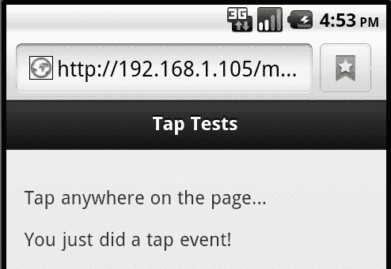
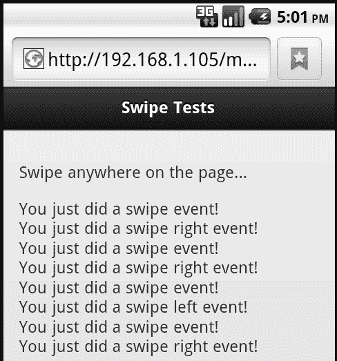
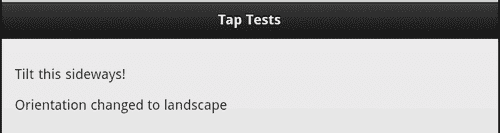
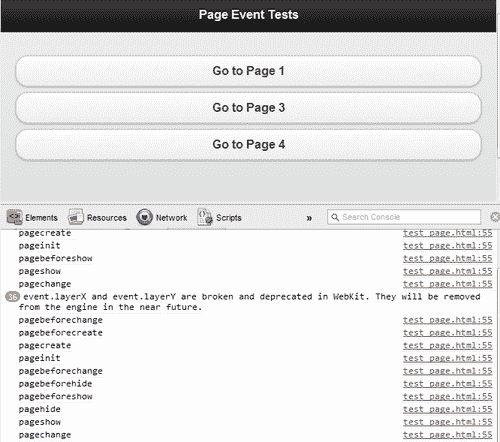
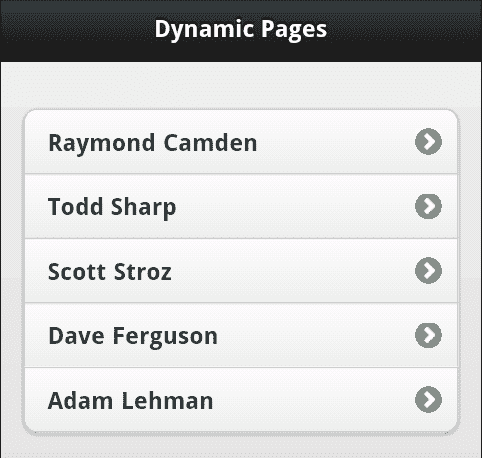
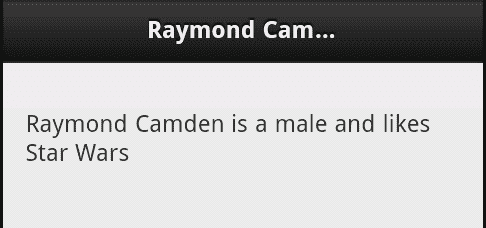

# 九、处理事件

在本章中，我们将了解事件如何在 jQuery Mobile 中工作。尽管开发人员显然可以访问常规事件（按钮点击等），jquerymobile 也为开发人员公开了自己的事件。

在本章中，我们将：

*   讨论触摸、滑动、滚动和其他物理事件
*   讨论页面事件

# 处理身体事件

在本章的第一部分中，我们将重点介绍“物理”事件，或与触摸和设备执行的其他操作相关的事件。

### 提示

对于那些使用常规浏览器测试 jQuery Mobile 的人，请注意以下一些示例在桌面浏览器上无法正常工作。如果愿意，您可以下载并安装各种手机类型的模拟器。例如，Android 有一个支持创建虚拟移动设备的 SDK。苹果也有办法模拟 iOS 设备。设置和安装这些模拟器超出了本章的范围，但它肯定是一个选项。当然，您也可以使用真正的硬件设备。

物理事件包括以下内容：

*   `tap`和`taphold: tap`代表了它听起来的样子——在网页上快速的身体接触。`taphold`是一个较长的触摸。许多应用将使用两个单独的操作-一个用于`tap`和一个用于`taphold`。
*   `swipe, swipeleft`和`swiperight:`表示在大多数设备上滑动或手指移动。`swipe`事件是一个通用事件，而`swipeleft`和`swiperight`代表在特定方向上的滑动。不支持向上或向下滑动事件。
*   `scrollstart`和`scrollstop:`分别处理滚动页面的开始和结束。
*   `orientationchange:`当设备方向改变时触发。
*   `vclick, vmousedown, vmouseup, vmousemove, vmousecancel`和`vmouseover:`所有这些都是“虚拟”事件，旨在抽象检查触摸或鼠标点击事件。由于这些主要只是单击和触摸事件的别名，因此将不演示它们。

现在我们已经列出了基本的物理事件，让我们开始看几个例子。`Listing 9-1`展示了`tap`和`taphold`事件的一个简单示例：

```js
Listing 9-1: test1.html
<!DOCTYPE html>
<html>
<head>
<title>Tap Tests</title>
<meta name="viewport" content="width=device-width, initial- scale=1">
<link rel="stylesheet" href="http://code.jquery.com/mobile/ latest/jquery.mobile.min.css" />
<script src="http://code.jquery.com/jquery- 1.7.1.min.js"></script>
<script src="http://code.jquery.com/mobile/ latest/jquery.mobile.min.js"></script>
</head>
<body>
<div data-role="page" id="first">
<div data-role="header">
<h1>Tap Tests</h1>
</div>
<div data-role="content">
<p>
Tap anywhere on the page...
</p>
<p id="status"></p>
</div>
</div>
<script>
$("body").bind("tap", function(e) {
$("#status").text("You just did a tap event!");
});
$("body").bind("taphold", function(e) {
$("#status").text("You just did a tap hold event!");
});
</script>
</body>
</html>

```

这个模板相当简单。页面上有一些解释性文字，要求用户点击。下面是一段空话。请注意，尽管这两个选项在文档末尾绑定。一个监听`tap`，另一个监听`taphold`。用户可以执行任一操作，并显示不同的状态消息。虽然很简单，但这让您很好地了解了如何根据用户按住手指的时间做出不同的响应。（触发`taphold`事件的时间约为 1 秒）：



现在让我们看一下`Listing 9-2`，一个刷卡事件的示例：

```js
Listing 9-2: test2.html
<!DOCTYPE html>
<html>
<head>
<title>Swipe Tests</title>
<meta name="viewport" content="width=device-width, initial- scale=1">
<link rel="stylesheet" href="http://code.jquery.com/mobile/ latest/jquery.mobile.min.css" />
<script src="http://code.jquery.com/jquery- 1.7.1.min.js"></script>
<script src="http://code.jquery.com/mobile/latest/ jquery.mobile.min.js"></script>
</head>
<body>
<div data-role="page" id="first">
<div data-role="header">
<h1>Swipe Tests</h1>
</div>
<div data-role="content">
<p>
Swipe anywhere on the page...
</p>
<p id="status"></p>
</div>
</div>
<script>
$("body").bind("swipe", function(e) {
$("#status").append("You just did a swipe event!<br/>");
});
$("body").bind("swipeleft", function(e) {
$("#status").append("You just did a swipe left event!<br/>");
});
$("body").bind("swiperight", function(e) {
$("#status").append("You just did a swipe right event!<br/>");
});
</script>
</body>
</html>

```

这个例子与前一个非常相似，只是现在我们的事件处理程序侦听`swipe, swipeleft`和`swiperight`。一个重要的区别是我们附加到 status div，而不是简单地设置它。为什么？`swiperight`或`swipeleft`事件自动为刷卡事件。如果我们简单地在段落中设置文本，其中一个将删除另一个。以下屏幕截图显示了设备在几次滑动后的外观：



一个更复杂的例子怎么样？考虑下面的代码片段，

```js
Listing 9-3: test3.html
<!DOCTYPE html>
<html>
<head>
<title>Swipe Tests</title>
<meta name="viewport" content="width=device-width, initial- scale=1">
<link rel="stylesheet" href="http://code.jquery.com/mobile/ latest/jquery.mobile.min.css" />
<script src="http://code.jquery.com/jquery- 1.7.1.min.js"></script>
<script src="http://code.jquery.com/mobile/ latest/jquery.mobile.min.js"></script>
</head>
<body>
<div data-role="page" id="first">
<div data-role="header">
<h1>First</h1>
</div>
<div data-role="content">
<p>
Swipe to navigate
</p>
</div>
</div>
<div data-role="page" id="second">
<div data-role="header">
<h1>Second</h1>
</div>
<div data-role="content">
<p>
Swipe to the right...
</p>
</div>
</div>
<script>
$("body").bind("swipeleft swiperight", function(e) {
var page = $.mobile.activePage[0];
var dir = e.type;
if(page.id == "first" && dir == "swipeleft") $.mobile.changePage("#second");
if(page.id == "second" && dir == "swiperight") $.mobile.changePage("#first");
});
</script>
</body>
</html>

```

在本例中，我们得到了一个包含两个独立页面的文件，一个页面 id 为`first`，另一个页面 id 为`second`。请注意，我们没有链接。那么我们如何导航呢？用刷子！我们的事件处理程序现在正在侦听`swipeleft`和`swiperight`。我们首先使用`$.mobile.activePage`抓取活动页面，如[第 8 章](08.html "Chapter 8. jQuery Mobile Configuration, Utilities, and JavaScript methods")所述，jQuery Mobile 中的*JavaScript 配置和工具中的方法和工具。末尾的`[0]`表示该值实际上是一个 jQuery 选择器。使用`[0]`获取实际的 DOM 项。事件类型将为`swipeleft`或`swiperight`。一旦我们知道了这一点，我们就可以根据用户当前所在的页面以及他们的浏览方向主动移动用户。*

现在让我们看看滚动。您可以检测滚动的开始和结束时间。`Listing 9-4`是另一个简单的例子：

```js
Listing 9-4: test4.html
<!DOCTYPE html>
<html>
<head>
<title>Scroll Tests</title>
<meta name="viewport" content="width=device-width, initial- scale=1">
<link rel="stylesheet" href="http://code.jquery.com/mobile/ latest/jquery.mobile.min.css" />
<script src="http://code.jquery.com/jquery- 1.7.1.min.js"></script>
<script src="http://code.jquery.com/mobile/ latest/jquery.mobile.min.js"></script>
</head>
<body>
<div data-role="page" id="first">
<div data-role="header">
<h1>Scroll Tests</h1>
</div>
<div data-role="content">
<p>
Scroll please....<br/>
<br/>
<br/>
(Many <br/> tags removed to save space!)
<br/>
<br/>
</p>
<p id="status"></p>
</div>
</div>
<script>
$("body").bind("scrollstart", function(e) {
$("#status").append("Start<br/>");
});
$("body").bind("scrollstop", function(e) {
$("#status").append("Done!<br/>");
});
</script>
</body>
</html>

```

这个模板与抽头测试仪`test1.html`非常相似，只是现在我们听了`scrollstart`和`scrollstop`。还要注意`<br/>`标签的列表。在真实的源文件中，有很多这样的文件。这将确保测试时页面实际上是可滚动的。当滚动开始和结束时，我们只需附加到另一个状态`div`。（请注意，当前 DOM 操作在收听`scrollstart`时被列为有缺陷。前面的示例可能在 iOS 中不起作用，但在 Android 上可以正常工作。）

现在让我们看一下方向。虽然前面的示例应该（大部分）可以在您的桌面上进行测试，但您肯定需要一台真正的移动设备来测试下一个示例：

```js
Listing 9-5: test5.html
<!DOCTYPE html>
<html>
<head>
<title>Orientation Tests</title>
<meta name="viewport" content="width=device-width, initial- scale=1">
<link rel="stylesheet" href="http://code.jquery.com/mobile/ latest/jquery.mobile.min.css" />
<script src="http://code.jquery.com/jquery- 1.7.1.min.js"></script>
<script src="http://code.jquery.com/mobile/ latest/jquery.mobile.min.js"></script>
</head>
<body>
<div data-role="page" id="first">
<div data-role="header">
<h1>Orientation Tests</h1>
</div>
<div data-role="content">
<p>
Tilt this sideways!
</p>
<p id="status"></p>
</div>
</div>
<script>
$(window).bind("orientationchange", function(e,type) {
$("#status").html("Orientation changed to "+e.orientation);
});
</script>
</body>
</html>

```

前面代码清单的关键部分是最后的 JavaScript，特别是用于更改方向的事件侦听器。这实际上不是 jQuery Mobile 支持的事件，而是浏览器本身支持的事件。一旦连接了事件侦听器，就可以根据设备的方向执行任何操作。以下屏幕截图是演示：



# 处理页面事件

既然我们已经讨论了物理类型事件，现在是时候将注意力转向页面事件了。请记住，jQuery Mobile 有自己的页面概念。为了让开发人员能够更好地控制 jquerymobile 中页面的工作方式，支持许多页面事件。并不是所有的都会对你的日常发展有用。通常，页面事件可分为以下类别：

*   加载：这些是与页面加载相关的事件。它们是`pagebeforeload, pageload`，并且`pageloadfailed. pagebeforeload`在请求页面之前被触发。您的代码可以基于任何合理的逻辑批准或拒绝此请求。如果加载页面，则触发`pageload`。相反，`pageloadfailed`将在任何未完成的负载上点火。
*   更改：这些事件与从一个页面到另一个页面的更改相关。它们是：`pagebeforechange, pagechange`和`pagechangefailed`。与前面一样，`pagebeforechange`函数充当以编程方式拒绝事件的方式。如果完成，则触发`pagechangefailed`事件。`pagebeforechange`在`pagebeforeload`事件之前*被触发。显示页面后，`pagechange`将触发。*
*   转换：与从一页到另一页的移动或转换相关的事件。它们是：`pagebeforeshow, pageshow, pagebeforehide, pagehide`。`pagebeforeshow`和`pagebeforehide`都在相关事件之前运行，但与`pagebeforeload`和`pagebeforechange`不同，它们实际上无法阻止下一个事件。
*   init：正如在本书中多次展示的那样，jquerymobile 对基本 HTML 执行多次更新，以针对移动显示进行优化。这些是与初始化相关的事件。您可以侦听的事件有：`pagebeforecreate, pagecreate`和`pageinit. pagebeforecreate`在对控件触发任何自动更新之前触发。这允许您事先通过 Javascript 操作 HTML。`pagecreate`在 DOM 中存在页面内容后，但仍然在 jQuery Mobile 更新布局之前触发。官方文档建议在这里进行任何自定义小部件处理。最后，`pageinit`将在初始化完成后运行。
*   移除：该类别`pageremove`有一个事件。在 jQuery Mobile 从 DOM 中删除非活动页面之前触发此事件。您可以侦听此事件以防止框架删除页面。
*   版面：最后一个类别与版面相关，有一个事件`updatelayout`。这通常是由其他布局更改触发的，作为让页面知道需要更新自身的一种方式。

太多了！观察这些事件的一个简单方法是简单地倾听所有这些事件。在`Listing 9-6`中，我们有一个简单的例子：

```js
Listing 9-6: test_page.html
<!DOCTYPE html>
<html>
<head>
<title>Page Event Tests</title>
<meta name="viewport" content="width=device-width, initial- scale=1">
<link rel="stylesheet" href="http://code.jquery.com/mobile/ latest/jquery.mobile.min.css" />
<script src="http://code.jquery.com/jquery- 1.7.1.min.js"></script>
<script src="http://code.jquery.com/mobile/ latest/jquery.mobile.min.js"></script>
</head>
<body>
<div data-role="page" id="first">
<div data-role="header">
<h1>Page Event Tests</h1>
</div>
<div data-role="content">
<p>
<a href="#page2" data-role="button">Go to Page 2</a>
<a href="test_pagea.html" data-role="button"> Go to Page 3</a>
<a href="test_pageb.html" data-role="button"> Go to Page 4</a>
<a href="test_pageDOESNTEXIST.html" data-role="button"> Go to Page Failed</a>
</p>
</div>
</div>
<div data-role="page" id="page2">
<div data-role="header">
<h1>Page Event Tests</h1>
</div>
<div data-role="content">
<p>
<a href="#first" data-role="button">Go to Page 1</a>
<a href="test_pagea.html" data-role="button"> Go to Page 3</a>
<a href="test_pageb.html" data-role="button"> Go to Page 4</a>
</p>
</div>
</div>
<script>
$(document).bind("pagebeforeload pageload pageloadfailed pagebeforechange pagechange pagechangefailed pagebeforeshow pagebeforehide pageshow pagehide pagebeforecreate pagecreate pageinit pageremove updatelayout", function(e) {
console.log(e.type);
});
</script>
</body>
</html>

```

此模板是一个四页、三个文件的简单应用的一部分，该应用具有链接到每个其他页面的按钮。其他页面可以在您下载的 ZIP 文件中找到。为了测试此应用，您**应该**使用支持控制台的桌面浏览器。这是任何版本的 Chrome 浏览器、最新的 Firefox 浏览器（或带有 Firebug 的 Firefox）和最新的 Internet Explorer。本章不适合对浏览器控制台进行全面解释，但您可以将其视为一个隐藏的调试日志，用于记录事件和其他消息。在本例中，我们告诉 jQuery 侦听所有 jQueryMobile 页面事件。然后将特定事件类型记录到控制台。点击一点后，下面的屏幕截图显示了控制台日志在 Chrome 浏览器中的外观：



在 Chrome 中打开控制台很简单。单击浏览器右上角的活动扳手图标。选择**工具**，然后选择**JavaScript 控制台**。在自己测试这些文件之前打开控制台，您可以实时监控页面事件的发生。

## 美元（单据）怎么样？准备好了吗？

如果您是 jQuery 用户，您可能会好奇`$(document).ready`是如何与 jQueryMobile 站点一起使用的。几乎所有 jQuery 应用都使用`$(document).ready`进行初始化和其他重要的设置操作。但是，在 jQueryMobile 应用中，这将无法正常工作。由于 Ajax 用于加载页面，`$(document).ready`只对*第一个*页面有效。因此，`pageInit`事件应该在您过去使用`$(document).ready`的情况下使用。

## 创造一个真实的例子

那么一个真实的例子呢？我们的下一组代码将演示如何创建一个简单但动态的 jQueryMobile 网站。内容将通过 Ajax 加载。通常这是动态数据，但出于我们的目的，我们将使用 JSON 数据的简单静态文件。JSON 代表 JavaScript 对象表示法，是一种将复杂数据表示为简单字符串的方法。`Listing 9-7`是应用的主页：

```js
Listing 9-7: test_dyn.html
<!DOCTYPE html>
<html>
<head>
<title>Test Dynamic</title>
<meta name="viewport" content="width=device-width, initial- scale=1">
<link rel="stylesheet" href="http://code.jquery.com/mobile/ latest/jquery.mobile.min.css" />
<script src="http://code.jquery.com/jquery- 1.7.1.min.js"></script>
<script src="http://code.jquery.com/mobile/latest/ jquery.mobile.min.js"></script>
</head>
<body>
<div data-role="page" id="homepage">
<div data-role="header">
<h1>Dynamic Pages</h1>
</div>
<div data-role="content">
<ul id="peopleList" data-role="listview" data-inset="true"></ul>
</div>
</div>
<script>
$("#homepage").bind("pagebeforecreate", function(e) {
//load in our people
$.get("people.json", {}, function(res,code) {
var s = "";
for (var i = 0; i < res.length; i++) {
s+="<li><a href='test_people.html ?id="+res[i].id+"'>"+res[i].name+"</a></li>";
}
$("#peopleList").html(s).listview("refresh");
}, "json");
});
$("#personpage").live("pagebeforeshow", function(e) {
var thisPage = $(this);
var thisUrl = thisPage.data("url");
var thisId = thisUrl.split("=")[1];
$.get("person"+thisId+".json", {}, function(res, code) {
$("h1",thisPage).text(res.name);
s = "<p>"+res.name +" is a "+res.gender+" and likes "+res.hobbies+"</p>";
$("#contentArea", thisPage).html(s);
}, "json");
});
</script>
</body>
</html>

```

关于这个 jQueryMobile 页面，您可能会注意到的第一件事是没有任何实际内容。至少不在 jQueryMobile 页面的内容块中。有`listview`但没有实际内容。那么内容将从何而来？在页面底部可以看到两个事件侦听器。现在让我们只关注第一个问题。

这里的代码绑定到 jQuery Mobile 为页面触发的`pagebeforecreate`事件。我们已经告诉 jQuery Mobile 在创建页面之前运行此事件。此事件将运行一次且仅运行一次。在此事件中，我们使用 jQuery`get`功能对文件`people.json`执行 Ajax 请求。该文件只是 JSON 格式的名称数组：

```js
[{"id":1,"name":"Raymond Camden"},{"id":2,"name":"Todd Sharp"},{"id":3,"name":"Scott Stroz"},{"id":4,"name":"Dave Ferguson"},{"id":5,"name":"Adam Lehman"}]

```

每个名称都有一个 ID 和实际名称值。当 jQuery 加载时，它将转换为简单对象的实际数组。回顾事件处理程序，您可以看到我们只是在这个数组上循环并创建一个表示一组`li`标记的字符串。请注意，每一个都有一个指向`test_people.html`的链接以及一个动态名称。还要注意链接本身是动态的。它们包括从 JSON 字符串中检索到的每个人的 ID 值：



前面提到过，但请注意呼叫`listview("refresh"):`

```js
$("#peopleList").html(s).listview("refresh");

```

如果没有`listview("refresh")`部分，我们添加到 listview 的项目将无法正确设置样式。

让我们快速查看下一步：

```js
Listing 9-8: test_people.html
<!DOCTYPE html>
<html>
<head>
<title>Test Dynamic</title>
<meta name="viewport" content="width=device-width, initial- scale=1">
<link rel="stylesheet" href="http://code.jquery.com/mobile/ latest/jquery.mobile.min.css" />
<script src="http://code.jquery.com/jquery- 1.7.1.min.js"></script>
<script src="http://code.jquery.com/mobile/latest/ jquery.mobile.min.js"></script>
</head>
<body>
<div data-role="page" id="personpage">
<div data-role="header">
<h1></h1>
</div>
<div data-role="content" id="contentArea">
</div>
</div>
</body>
</html>

```

与我们的上一页一样，这一页内容非常缺乏。请注意，标题和内容区域均为空白。但是，如果您还记得`test_dyn.html`中的第二个事件处理程序，我们可以在这里加载内容。这次我们使用了`pagebeforeshow`事件。为什么？我们希望在每次显示页面之前运行此代码。我们需要知道要加载的特定人员。如果您还记得，这个人的 ID 是在 URL 中传递的。我们可以通过页面对象上存在的数据属性`url`获取它。这将返回完整的 URL，但我们所关心的只是它的结尾我们的 ID。因此，我们拆分字符串并获取最后一个值。一旦有了，我们就可以为每个人加载一个特定的 JSON 文件。此文件名的格式为`personX.json`，其中`X`是数字 1 到 5。以下代码行是一个示例：

```js
{"name":"Raymond Camden","gender":"male","hobbies":"Star Wars"}

```

显然，一个真人对象会有更多的数据。获取此字符串后，我们可以对其进行解析，并将结果显示在页面上：



# 总结

在本章中，我们研究了 jQueryMobile 应用可以监听和响应的事件。这些事件包括物理类型（滚动、方向、触摸）和基于页面的事件。

在下一章中，我们将了解 jQueryMobile 站点是如何主题化的——既有现成的主题，也有自定义主题。