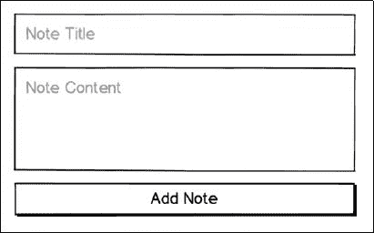
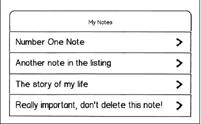
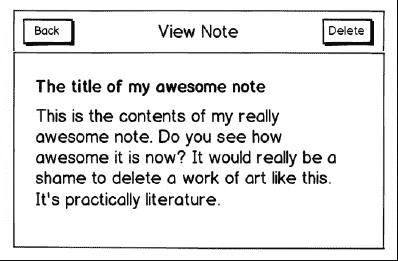
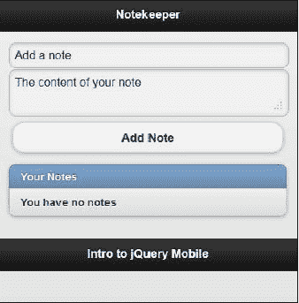
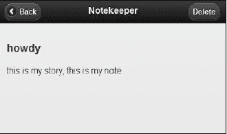

# 十、进一步使用 Notekeeper 移动应用

在本章中，我们将开始将我们所学到的关于列表、表单、页面和内容格式的所有知识组合成一个可用的“移动应用”；记事本应用。

在本章中，我们将：

*   使用表单接受用户输入
*   使用 HTML5 localStorage 功能本地存储用户输入的数据
*   演示如何动态添加、编辑和删除页面中的项目

# 什么是移动应用？

在编写第一个移动应用之前，也许我们应该定义它是什么。维基百科说，移动应用是为小型低功耗手持设备（如个人数字助理、企业数字助理或移动电话）开发的*软件。虽然 jQueryMobile 应用确实是用 HTML、CSS 和 JavaScript 编写的，但这并不妨碍它们成为复杂的软件。它们的开发当然考虑到了移动设备。*

一些批评家可能会注意到，除非“安装”，否则它不可能是真正的软件。正如您将在本书后面看到的，jQueryMobile 应用与开源库 PhoneGap 结合使用时，实际上可以安装在各种设备（包括 iOS、Android 和 Windows Mobile）上。这意味着你可以吃蛋糕，也可以吃蛋糕。您可能会问自己，是否可以将使用 jQuery Mobile 编写的代码视为软件，并且在本章中您将发现，答案是肯定的。

# 设计您的第一款移动应用

任何软件的目标都是满足需求。Gmail 满足了这一需求，它将用户从一台电脑中解放出来，并允许他们从任何网络浏览器中查看电子邮件。Photoshop 满足了这一需求，它允许用户以前所未有的方式操作照片。我们的记事本应用通过允许我们记录简单的笔记以供以后参考而满足了需要。我知道，相比之下有点失望，但我们必须从某个地方开始，对吗？

在构建软件时，最好先花时间为您的项目编写一个规范：它将做什么，它将是什么样子，它应该有什么。记住，如果你不知道你在建什么，你怎么知道它是否完成了？

## 列出要求

我们已经知道我们希望应用做什么，记笔记。问题是，有太多的方法可以构建一个记笔记的应用，因此必须勾勒出我们想要做的事情。不是太多，也不是太少，但现在已经足够了。事实上，对于开发人员来说，我们的应用从未“完成”，它们只是“暂时”完成。有了 Notekeeper，我们决定在应用中可以做以下三件事：

*   添加注释
*   显示注释列表
*   查看注释/删除注释

在决定我们的应用需要完成哪些任务后，我们需要决定它将如何完成这些任务。最简单的方法是简单地把这些事情写在一个列表中。通过将每个部分分解成更小的部分，我们可以更容易地理解，并了解我们需要什么使其工作。这就像是找到你最喜欢的餐馆的方向；在这里左转，在那里转个弯，然后你就在不知不觉中坐到了桌子旁。让我们看看我们希望 Notekeeper 做的每件事，下面是各个部分：

*   添加注释（表格）
    *   表单容器。所有用户输入小部件都包装成一个表单。
    *   标题，便条的名称。这也将用于显示现有注释。
    *   音符本身。注释的内容或正文。
    *   保存按钮。这将触发实际的保存。
*   显示注释列表的能力（listview）
    *   包含注释标题的行项目。此行应该是指向包含注释正文的页面的链接。
    *   一个节标题行可能很好。
*   查看注释和删除注释的功能（标签、段落、按钮）
    *   注释标题的标签
    *   包含注释内容的段落
    *   标签为**删除**的按钮
    *   后退按钮

### 构建您的线框

现在我们已经列出了我们应用的功能，我们来画出每一个部分，这样我们就可以知道我们想要它是什么样子了？不要担心如果你失败了艺术，或者你不能画一个棒的数字。如果你必须使用一个尺子，或者考虑使用微软 Excel，或者 PowerPoint，如果你有这些。您只需要能够绘制一些框和一些文本标签。

### 设计添加注释线框

现在，添加注释部分怎么样？我们决定它需要一个标题、一个用于注释的框和一个提交按钮。表单是一个看不见的容器，因此我们不需要绘制：



### 显示注释线框

listview 是移动开发不可或缺的一部分。这是将相似的项目组合在一起的最简单方法，此外，它还提供了许多额外的功能，如滚动和内置链接图像。我们将使用 listview 显示注释列表：



### 查看注释/删除按钮线框

最后，一旦我们添加了注释，我们需要能够删除证据，我的意思是清除旧注释，为新注释让路。请注意，我们还绘制了一个后退按钮。一旦你开始看到事情的发展，你会发现你忘记了一些真正重要的事情（比如能够回到上一页）：



## 编写 HTML

现在我们的线框已经完成，我们对它们很满意，是时候把铅笔画变成 1 和 0 了。因为我们的应用相对简单，所以 HTML 应该都不难。毕竟，这本书你已经完成了一半以上，你应该在睡觉的时候做这些事情。

您生成的 HTML 应该与下面的代码片段中显示的非常相似。让我们一起来研究一下：

```js
Listing 10-1: notekeeper.html
<!DOCTYPE html>
<html>
<head>
<title>Notekeeper</title>
<meta name="viewport" content="width=device-width, initial- scale=1">
<link rel="stylesheet" href="http://code.jquery.com/mobile/ latest/jquery.mobile.min.css" />
<script src="http://code.jquery.com/jquery-1.6.4.js"></script>
<script src="http://code.jquery.com/mobile/latest/ jquery.mobile.min.js"></script>
<script src="application.js"></script>
</head>
<body>
<div data-role="page">
<div data-role="header">
<h1>Notekeeper</h1>
</div>
<div data-role="content">
<form>
<div>
<input id="title" type="text" placeholder="Add a note" />
</div>
<div>
<textarea id="note" placeholder="The content of your note"></textarea>
</div>
<div class="ui-grid-a">
<div class="ui-block-a">
<input id="btnNoThanks" type="submit" value="No Thanks" />
</div>
<div class="ui-block-b">
<input id="btnAddNote" type="button" value="Add Note" />
</div>
</div>
</form>
<ul id="notesList" data-role="listview" data-inset="true">
<li data-role="list-divider">Your Notes</li>
<li id="noNotes">You have no notes</li>
</ul>
</div>
<div data-role="footer" class="footer-docs">
<h5>Intro to jQuery Mobile</h5>
</div>
</div>
</body>
</html>

```

我们的 Notekeeper 应用将使用单个 HTML 文件（`notekeeper.html`和单个 JavaScript 文件（`application.js`。到目前为止，您编写的代码中没有一个真正需要 JavaScript，但一旦您开始编写更复杂的应用，JavaScript 将是必不可少的。在 web 浏览器中预览`Listing 10-1`中的 HTML，您应该会看到类似于以下屏幕截图的内容：



请注意，我们在与视图注释相同的页面上显示了**添加注释**表单。在移动应用开发中，尽可能地精简内容是一个好主意。不要硬性规定这一点，但由于我们的应用几乎没有什么内容，所以将这两个部分放在一起是可以接受的决定，只要它们有明确的标签。您可以看到，此页面满足我们为添加注释和显示现有注释而设置的所有要求。它有一个标题输入字段、一个注释输入字段、一个保存按钮，整个内容被包装在一个表单容器中。它还有一个列表视图，一旦我们开始添加便笺，它将用于显示便笺。这里没有看到的是一个删除按钮，但一旦我们添加第一个便笺并查看详细信息页面，它就会显示出来。

# 使用 JavaScript 添加功能

正如本书所提到的，您不需要编写任何 JavaScript 就可以从 jQueryMobile 获得物有所值的回报。但随着您在 jQuery Mobile 体验中的进步，您将开始看到 JavaScript 可以为您的项目增加多少附加值。在我们看代码之前，让我们先谈谈它的结构。如果您曾经做过任何 web 设计或开发，那么您可能见过 JavaScript。毕竟，它从 1995 年就已经存在了。问题是在 JavaScript 中有很多不同的方法来做同样的事情，但并不是所有的方法都是好的。

此应用中的 JavaScript 代码将使用所谓的设计模式。这只是一个花哨的术语，它为代码指定了某种结构。使用现有设计模式有三个主要原因：

*   它有助于我们的代码保持组织和整洁。
*   它可以防止我们编写的变量和函数被我们可能添加的任何其他代码意外覆盖或更改。jQuery 插件，或者从第三方网站加载的代码。
*   它将帮助未来的开发人员更快地适应您的代码。当你在下一个 Facebook 上工作时，你正在考虑未来的开发者，对吗？

让我们先看看这个设计模式的一个非常简单的实现，然后再跳进完整的代码：

```js
Listing 10-2: kittyDressUp.js
$(document).ready(function(){
// define the application name
var kittyDressUp = {};
(function(app){
// set a few variables which can be used within the app
var appName = 'Kitty Dress Up';
var version = '1.0';
app.init = function(){
// init is the typical name that developers give for the
// code that runs when an application first loads
// use whatever word you prefer
var colors = app.colors();
}
app.colors = function(){
var colors = ['red','blue','yellow','purple'];
return colors;
}
app.init();
})(kittyDressUp);
});

```

如果您熟悉 JavaScript 或 jQuery，您可能会看到一些您熟悉的元素。对于那些不熟悉 jQuery 或 JavaScript 的读者，我们将逐行回顾这个示例。`KittyDressUp.js`从 jQuery 最好的朋友开始。大括号中包含的任何代码都将等待执行，直到文档或 HTML 页面完全加载。这意味着您（开发人员）可以确信，在代码运行之前，页面上需要的所有内容都已存在：

```js
$(document).ready({
// I'm ready captain!
});

```

简单地说，下一行创建一个名为`kittyDressUp`的变量，并为其分配一个空对象的值。但是，在我们的代码中，这个新对象将包含我们的整个应用：

```js
// define the application name
var kittyDressUp = {};

```

以下声明是 Kitty 装扮应用的核心。它创建一个接受单个参数的函数，然后立即调用自身，传入我们在前一行中创建的空对象。这个概念被称为自执行函数，它可以防止外部代码干扰我们的应用。

```js
(function(app){
// define the app functionality
})(kittyDressUp);

```

接下来的两行设置了一些只能从应用的上下文或范围内访问的变量：

```js
// set a few variables which can be used within the app
var appName = 'Kitty Dress Up';
var version = '1.0';

```

最后，最后几行设置了两个可在应用中使用的函数。您可以看到，每个函数都分配了一个名称，该名称位于较大应用的范围内。`app`变量是函数所在的位置，而单词位于函数后面。是函数名。请注意，在`init`函数中，我们调用了同一应用中的另一个函数`app.colors()`。我们也可以引用我们在顶部定义的任何变量。

```js
app.init = function(){
// init is the typical name that developers give for the
// code that runs when an application first loads
// use whatever word you prefer
var colors = app.colors();
}
app.colors = function(){
var colors = ['red','blue','yellow','purple'];
return colors;
}
app.init();

```

请记住，`app`是传递给自执行函数的参数的名称，其值是空对象。总的来说，这几行创建了一个名为`kittyDressUp`的对象，该对象包含两个变量（`appName`和`version)`，以及两个函数（`init`和`colors)`。这个例子以及 Notekeeper 的代码都是简单的例子，但它们说明了如何将大型应用的各个部分的代码打包成独立的包。事实上，在`kittyDressUp.js`运行后，您甚至可以将`kittyDressUp`传递到另一组代码中供使用。

呸…每个人都拿五块，你赢了。

## 存储记事员数据

现在，我们已经结束了五分钟的休息，是时候卷起袖子，开始为我们的应用添加功能了。虽然我们已经讨论了我们希望 Notekeeper 如何表现，但我们还没有讨论将笔记数据存储在何处的核心问题。有一些可能性，所有这些都有利弊。让我们把它们列出来：

*   **数据库（MySQL、SQL Server、PostgreSQL）：**虽然数据库是理想的解决方案，但对于我们的应用来说，它有点复杂，需要互联网连接，你需要一个服务器端组件（ColdFusion、PHP、.NET）作为中间人将注释保存到数据库中。
*   **文本文件：**文本文件非常好，因为它们占用的空间非常小。问题是，作为一个 web 应用，Notekeeper 无法将文件保存到用户的设备上。
*   **localStorage:**localStorage 相对较新，但正迅速成为一个不错的选择。它以键/值对的形式存储用户机器上的信息。它有一个大小限制，但对于纯文本来说它非常大，大多数现代浏览器都支持它，并且可以在脱机模式下使用。

### 使用本地存储

在本章中，我们将选择`localStorage`作为我们的选择方法。让我们来看看它的行为，这样当你看到它的时候你会很熟悉它。如前所述，`localStorage`工作的前提是将数据存储在键/值对中。将值保存到`localStorage`有两种方式，而且无论您选择哪种方式都很简单：

```js
localStorage.setItem('keyname','this is the value I am saving');

```

或

```js
localStorage['keyname'] = 'this is the value I am saving';

```

您选择哪个版本是个人偏好，但因为它的输入量稍少，所以我们将使用第二种方法，方括号。我们将遇到的一个问题是`localStorage`无法存储数组或对象之类的复杂数据。它只存储字符串。这是一个问题，因为我们将把所有数据存储在一个变量中，这样我们就可以知道它的位置。不用担心，我们可以在`localStorage`上拉一个快速的，并使用一个名为`stringify()`的内置函数将我们的复杂对象转换为自身的字符串表示。

以下代码段显示了它的工作原理：

```js
// create our notes object
var notes = {
'note number one': 'this is the contents of note number one', 'make conference call': 'call Evan today'
}
// convert it to a string, then store it.
localStorage['Notekeeper'] = JSON.stringify(Notekeeper);

```

检索值与设置值一样简单，它还提供两个选项。您通常需要定义一个变量来接收`localStorage`变量的内容。

```js
var family = localStorage.getItem('my family');

```

或

```js
var family = localStorage['my family'];

```

如果要检索复杂值，则必须执行另外一个步骤，然后才能使用变量的内容。正如我们刚才提到的，要存储复杂的值，必须首先使用`stringify()`函数，它有一个名为`parse()`的对应函数。`parse()`函数获取包含该复杂对象的字符串，并将其转换回纯 JavaScript。它的用法如下：

```js
var myFamily = ['andy', 'jaime', 'noelle', 'evan', 'mason'];
localStorage['family'] = JSON.stringify(myFamily);
var getFamily =JSON.parse(localStorage['family']);

```

最后，如果您想要完全删除密钥，那么您可以在一行代码中完成，同样有两种风格：

```js
localStorage.removeItem('my family');

```

或

```js
delete localStorage[my family'];

```

值得注意的是，如果您试图检索 localStorage 中不存在的密钥，JavaScript 不会抛出错误。它只返回“undefined”，这是 JavaScript 表示“抱歉，但什么都没有”的方式。以下代码段是一个示例：

```js
var missing = localStorage['yertl the turtle'];
console.log(missing);
// returns undefined

```

## 样板的有效使用

在开始构建 JavaScript 文件之前，还有最后一件事。在我们的应用中，我们只有一个 JavaScript 文件，它将包含整个代码库。这对于像我们这样的小应用来说是不错的，但对于大应用来说是个坏主意。最好将项目分解为不同的部分，然后将每个部分放入各自的文件中。这使得开发团队更容易合作（例如，Noelle 负责登录过程，而 Mason 负责建立供应商列表）。它还使每个文件更小，更容易理解，因为它只处理整个文件的一部分。当你希望你的应用的所有部分都有相似的结构和设计时，最好从一个样板开始。我们将为我们的应用的唯一文件使用样板文件（您可以在下面的代码片段`Listing 10-3)`中看到。您可能会注意到它看起来与`kittyDressUp`示例非常相似，您是对的：

```js
Listing 10-3: application.js
$(function(){
// define the application
var Notekeeper = {};
(function(app){
// variable definitions go here
app.init = function(){
// stuff in here runs first
}
app.init();
})(Notekeeper);
});

```

## 构建添加注释功能

终于，我们可以开始建造了！由于很难显示不存在的注释列表，更不用说删除注释了，我们将首先开始编写`Add Note`功能。为了让用户能够添加注释，他们必须输入标题、注释内容，然后点击提交按钮。让我们从这里开始。

### 添加绑定

我们将在`app.init()`函数定义下创建一个新的空函数块。它应该类似于下面的代码行：

```js
app.bindings = function(){
}

```

绑定功能将包含用户在我们的应用中执行某些操作（如单击提交按钮或删除按钮）时需要触发的任何代码。为了便于组织，我们将代码分组在一起。在`bindings()`函数中，我们将添加以下行。当用户点击`Add Note`表单上的提交按钮时，将触发此操作

```js
// set up binding for form
$('#btnAddNote').bind('click', function(e){
e.preventDefault();
// save the note
app.addNote(
$('#title').val(),
$('#note').val()
);
});

```

jQuery 的`val()`函数是一种速记方法，用于获取任何表单输入字段的当前值。

关于此新添加的几个注意事项：

*   在使用 jQuery 时，完成某件事情的方法总是不止一种，在大多数情况下，您只需选择您最喜欢的方法（它们通常提供相同的性能）。你可能更熟悉`$('#btnAddNote').click()`，这也没关系。
*   请注意，`click`函数接受一个参数：`e`是事件对象（在本例中是单击事件）。我们调用`e.preventDefault()`来阻止标准的 click 事件在此元素上发生，但仍然允许剩余的代码继续运行。您可能见过其他开发人员使用`return false`，但 jQuery 最佳实践建议使用`e.preventDefault()`。
*   在点击绑定中，我们调用`addNote`函数，并将用户键入的标题和注释传递给它。空白并不重要，只是为了更容易看到我们在做什么。

即使我们已经在代码中添加了绑定，但如果您现在运行应用，当您单击**添加注释**按钮时，将不会发生任何事情。原因是实际上还没有调用`bindings()`函数。在`init()`函数中添加以下行，您就可以开始了：

```js
app.init = function(){
app.bindings();
}

```

### 数据的采集与存储

接下来我们在`app.bindings:`下添加另一个新的空功能块

```js
app.addNote = function(title, note){
}

```

现在，因为我们将所有笔记存储在`localStorage`中的一个键中，所以我们首先需要检查是否已经存在笔记。从`localStorage`中检索 Notekeeper 键，将其保存到变量中，然后进行比较。如果我们请求的键的值是空字符串，或者`undefined`我们需要创建一个空对象。如果有一个值，那么我们将获取该值并使用`parse()`函数将其转换为 JavaScript:

```js
var notes = localStorage['Notekeeper'];
if (notes == undefined || notes == '') {
var notesObj = {};
} else {
var notesObj = JSON.parse(notes)
}

```

请注意，我们期望将两个变量传递到`addNote()`函数中，`title`和`note`。接下来，我们用破折号替换标题中的任何空格，这使某些浏览器更容易理解文本字符串。然后，我们将键/值对放入新创建的 notes 对象中：

```js
notesObj[title.replace(/ /g,'-')] = note;

```

JavaScript`replace`方法使得字符串操作非常简单。它作用于一个字符串，获取一个搜索项和一个替换项。搜索词可以是简单的字符串，也可以是复杂的正则表达式。

下一步是将我们的`notesObj`变量`stringify()`放入`localStorage`中。然后，我们清除两个输入字段中的值，以便于用户输入另一个注释。作为构建软件的一项规则，在添加或删除内容后，将界面恢复到原始状态是一种很好的方式：

```js
localStorage['Notekeeper'] = JSON.stringify(notesObj);
// clear the two form fields
$note.val('');
$title.val('');
//update the listview
app.displayNotes();

```

您应该熟悉所有这些变量定义，但我们应该指出一个例外。许多 jQuery 开发人员喜欢对包含 jQuery 对象的变量使用常规命名。

具体来说，它们在变量名前面加上一个`$`符号，就像 jQuery 一样。这让他们或未来的开发人员知道变量中包含的内容。让我们继续将这些定义添加到我们的应用顶部。在`// variable definitions go here`行之后，添加以下行。它们分别指标题输入字段和注释文本区域字段：

```js
var $title = $('#title');
var $note = $('#note');

```

作为此函数的最后一步，我们调用`app.displayNotes()`来更新注释列表。因为这个函数还不存在，所以让我们接下来创建它。

### 构建显示注释功能

您可能在编写上一节时测试了`Add Note`功能。这意味着您将在`localStorage`中保存至少一个备忘，用于测试`Display Notes`功能。到现在为止，您已经熟悉了任何新部分的第一步。继续添加空的`displayNotes()`函数来保存我们的代码：

```js
app.displayNotes = function(){
}

```

接下来，我们需要从`localStorage:`检索所有笔记

```js
// get notes
var notes = localStorage['Notekeeper'];
// convert notes from string to object
return JSON.parse(notes);

```

您可能会开始看到我们的许多函数的模式，几乎所有函数都是从我们从`localStorage`检索注释开始的。虽然执行这项任务只需要两行代码，但我们没有必要在每次需要获取注释时重复这两行代码。我们将编写一个包含这两行的快速帮助函数。它看起来类似于以下代码段：

```js
app.getNotes = function(){
// get notes
var notes = localStorage['Notekeeper'];
// convert notes from string to object
return JSON.parse(notes);
}

```

有了新的 helper 函数，我们可以在`displayNotes()`函数中使用它，如下面的代码片段所示：

```js
app.displayNotes = function(){
// get notes
var notesObj = app.getNotes();
}

```

现在我们有了包含注释包的`notesObj`变量，我们需要循环该包并输出内容：

```js
// create an empty string to contain html
var html = '';
// loop over notes
for (n in notesObj) {
html += li.replace(/ID/g,n.replace(/-/g,' ')).replace(/LINK/g,n);
}
$ul.html(notesHdr + html).listview('refresh');

```

`for`循环中的行有多个 replace 语句，这似乎有些奇怪，但 JavaScript 的本质允许链接方法。链接是指返回其操作的全部结果的方法。添加一个额外的方法调用只是重复这个过程。

在这个代码块中可能会有一些新的概念，让我们仔细看看。名为`html`的变量没有什么特别之处，但我们使用它的方式可能是。当我们在现有注释上循环时，我们将新信息存储到`html`变量中，以及其中的任何内容。我们通过使用`+=`操作符来实现这一点，它允许我们同时赋值和追加。

你可能会注意到的第二件事是作业右侧的`li`。那是从哪里来的？这是尚未创建的单个列表项的模板。在我们讨论它之前，让我们先这样做。在您的`app.js`文件的顶部，在读取`// variable definitions go here`的行之后，添加以下两行代码：

```js
var $ul = $('#notesList');
var li = '<li><a href="#pgNotesDetail?title=LINK">ID</a></li>';

```

You should already be familiar with the convention of adding a `$` before a variable to indicate a jQuery object. That's what we're doing with the `$ul` variable. The second variable, the `li` is slightly different. This contains the HTML for a single list item that will display a notes title. It's best practice to avoid mixing HTML or CSS in with your JavaScript wherever possible. We're declaring this as a template now in case we decide to use it in multiple places later.

The other part which might be of interest is the way we're using the `li` variable. When calling the string replace function, we're looking for all occurrences of the word LINK (upper case intended) and replacing it with the title of the note. Because JavaScript is a case-sensitive language it's a safe assumption that we won't run into a natural occurrence of that work.

## Dynamically adding notes to our listview

There's one final thing we need to put in place before our notes show up on the page. You might have noticed that the only place which calls the `displayNotes()` function appears within the `addNote()` function. This is a good place for it, but it can't be the only place. We need something that runs when the page first loads. The prime place for this would be in the `init()` function, and that's where we'll place it.

There's one problem though, we can't just load our notes and run, what happens if there are no notes? We need a nice message to display to the user so that they don't think something's wrong. Let's create a new function called `app.checkForStorage()` which handles all of this:

```js
app.checkForStorage = function(){
// are there existing notes?
if (localStorage['Notekeeper']) {
// yes there are. pass them off to be displayed
app.displayNotes();
} else {
// nope, just show the placeholder
$ul.html(notesHdr + noNotes).listview('refresh');
}
}

```

By now, all of this should be familiar to you: checking `localStorage` for notes, and calling the `displayNotes()` function if it finds them. The second part has some new items though. When we set the html for the `$ul` jQuery object, we're calling two new variables. One for the listview header, and another if we don't have any notes. Let's add those two variable definitions now. Under `// variable definitions go here`, add the following two lines:

```js
var notesHdr = '<li data-role="list-divider">Your Notes</li>';
var noNotes = '<li id="noNotes">You have no notes</li>';

```

The last part of the line normally might go unnoticed, but we won't let it. It's really crucial. jQuery Mobile offers developers options. The option of having static HTML code, that's already on the page when it loads; jQuery Mobile also provides an option for adding HTML code on the fly. That really gives developers lots of flexibility, but it presents a unique challenge as well. By design jQuery Mobile converts HTML into stylish looking buttons before the page loads. This means that any HTML added after that will be presented to the user without any style.

However, jQuery Mobile also offers a way to get around this by building in the ability to refresh each and every element that it converts. Most of them have a built-in function corresponding to the name of the element; in our case it's the `listview()` function. Actually this method offers the ability to add a completely new listview to the page. In our situation we only care about refreshing the one we have, so we simply add the `refresh` keyword and jQuery Mobile converts your plain text listview. Try leaving that last part off and see just how much work jQuery Mobile saves you. Maybe you should add the jQuery Mobile team to your Christmas card list?

Finally, we have to actually call our newest function. Within the `init()` function add the following line. Then reload the page and watch your notes load up.

```js
app.checkForStorage();

```

## Viewing a note

At this point we should be able to create a new note, and have that note be immediately displayed in our listview. In fact, the rows in the listview are already links, they just don't work, let's change that right now.

### Using the Live function

Add the following lines to the `bindings()` function:

```js
$('#notesList a').live('click',function(e){
e.preventDefault();
var href = $(this)[0].href.match(/\?.*$/)[0];
var title = href.replace(/^\?title=/,'');
app.loadNote(title);
});

```

This new binding has a few new concepts so let's unpack them. First up, we're not using the `bind` function, instead we use jQuery's `live` function. The difference is that `bind` only works on existing page elements, whereas `live` is proactive. It works on existing elements as well as ones which get created after the binding is applied.

The second and third lines of the binding might look a little confusing but they only do one thing. They retrieve the URL from the href attribute of the link that was clicked. The `li` template we defined earlier in the chapter contained the following URL for each list item:

```js
#pgNotesDetail?title=LINK

```

After the `displayNote()` function runs, the URL looks like this (run your mouse over each list item to see the link displayed at the bottom of your browser window):

```js
#pgNotesDetail?title=the-title-of-the-note

```

Finally we tell our code to run a new function appropriately named `app.loadNote()`.

## Dynamically creating a new page

If you haven't already created the new empty function block for our new `loadNote()` function, go ahead and do it now. Remember that we're passing in the title of the note we want to view, so make sure to add that as an argument in the `loadNote()` function:

```js
app.loadNote = function(title){
}

```

Then place the following two lines at the top of the function:

```js
// get notes
var notes = app.getNotes();
// lookup specific note
var note = notes[title];

```

The first line retrieves our note object, while the second line pulls the specific note that the user has requested. The next variable definition breaks the rule we mentioned earlier in the chapter about mixing HTML and JavaScript, but every rule has exceptions. We're defining it here as opposed to the header of our JS file since this is the only place it is needed. This still serves the purpose of keeping the document organized.

```js
var page = '<div data-role="page" data-url="details" data-add-back- btn="true">\
<div data-role="header">\
<h1>Notekeeper</h1>\
<a id="btnDelete" href ="" data-href="http://ID data-role="button" class="ui-btn-right">Delete</a>\
</div>\
<div data-role="content"><h3>TITLE</h3><p>NOTE</p></div>\
</div>';

```

The `page` variable now contains all of the HTML needed to display a "note details" page to the user. Do you recall that our app has only one HTML file? We're actually creating an entire page from scratch using the previous HTML code. There are also some details in it worth pointing out:

*   默认情况下，jQuery Mobile 不为页面提供后退按钮。但是，您可以在任何具有`data-role="page"`属性的`div`标记上使用`data-add-back-btn="true"`属性逐页启用一个。
*   `data-url`属性是 jQuery Mobile 使用的标识符，因此它可以跟踪生成的多个页面。

Now that we have a whole page contained within a variable, what can we do with it? The first thing we can do is to turn it into a jQuery object. By wrapping any distinct chunk of HTML with a `$()` you turn it into a Grade-A jQuery object:

```js
var newPage = $(page);

```

Then we can take the HTML of that newly created page and replace parts of it with the values from our selected note.

```js
//append it to the page container
newPage.html(function(index,old){
return old
.replace(/ID/g,title)
.replace(/TITLE/g,title
.replace(/-/g,' '))
.replace(/NOTE/g,note)
}).appendTo($.mobile.pageContainer);

```

Since Version 1.4, jQuery has offered the option of a **callback** within certain functions. These include `.html(), .text(), .css()` and a few others. This function expects two arguments, of which the second contains the full HTML currently contained within the matching element. This means that we can make tweaks to the HTML contained inside our `newPage` variable without having to completely change it. Wonderful isn't it?

接下来，我们将把整个`newPage`变量追加到当前页面的末尾，这里由`$.mobile.pageContainer`常量引用。最后，因为我们取消了绑定中的默认单击操作，所以我们必须告诉链接执行一个操作，将用户转发到这个新创建的页面。jquerymobile 提供了一种内置的方法来实现这一点：

```js
$.mobile.changePage(newPage);

```

现在是大揭幕。如果您在浏览器中加载`notekeeper.html`，您应该能够在单个浏览器窗口的范围内添加、显示并最终查看注释。jQueryMobile 不是很棒吗？



## 删除注释

回顾我们的应用的需求，我们做得很好。我们已经编写了 HTML 代码来设置文档结构，允许我们添加注释、显示注释和查看注释。剩下的就是删除一个便笺，它从`bindings()`函数中设置的最后一个绑定开始。我们现在就添加它：

```js
$('#btnDelete').live('click',function(e){
e.preventDefault();
var key = $(this).data('href');
app.deleteNote(key);
});

```

在这个绑定中，只有一项对您来说可能是新的，那就是 jQuery 的`.data()`函数的使用。HTML5 允许您通过使用前面加有`data-`的属性直接在任何 HTML 元素上存储任意数据，这一功能是 jQueryMobile 功能的核心。无论你在哪里看到`data-role="something"`，你都会看到 HTML5 数据在运行。进一步的 jQuery 允许您通过使用`.data()`函数并传入要查看的项目的键来检索任何`data-`值。在上面的例子中，我们已经将注释的标题直接存储到视图页面中删除按钮上的`data-href`属性中。因为我们要添加的绑定是分配给 delete 按钮的 click 处理程序，所以我们可以通过调用`$(this).data('href')`来检索注释的标题。干净利落！

这将是我们在本章中添加的最后一个函数。你难过吗？这确实是一个令人痛心的时刻，但在你成为一名成功的 jQueryMobile 开发人员之后，我们可以满怀深情地回顾这一时刻。我们再次从一个空函数开始，它接受一个参数，即我们要删除的注释的标题。

```js
app.deleteNote = function(key){
}

```

按照函数定义，使用我们的 helper 函数检索注释：

```js
// get the notes from localStorage
var notesObj = app.getNotes();

```

然后我们删除注释。当我们回顾`localStorage`时，您已经看到了这一点，因此您应该很熟悉：

```js
// delete selected note
delete notesObj[key];
// write it back to localStorage
localStorage['Notekeeper'] = JSON.stringify(notesObj);

```

删除注释后，通过将剩余注释写回`localStorage`快速连续删除注释。`deleteNote()`函数的最后两行将我们带回应用的主页，即注释列表。它们还触发原始的`checkForStorage()`功能。

```js
// return to the list of notes
$.mobile.changePage('notekeeper.html');
// restart the storage check
app.checkForStorage();

```

最后一行对你来说可能很奇怪，但请记住，我们事先不知道是否还有任何笔记。运行存储检查允许我们在没有注释的情况下显示占位符文本。这是一个好习惯，因为它可以帮助我们的应用减少出错的可能性。

# 总结

在本章中，我们使用 jQuery mobile 构建了一个活生生的移动应用。停下来拍拍自己的背。我们完成了列出应用需求、构建线框和编写 HTML 的过程。我们了解了 HTML5 的`localStorage`，使用模板替换文本，以及 jQueryMobile 的一些更酷的功能，包括在页面上动态添加和刷新元素。

在下一章中，您将学习如何为 jQuery Mobile 设置全局配置选项，如何在 jQuery Mobile 中使用其他 API 来处理表单和内容块。