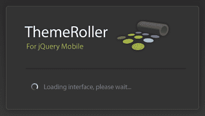

# 十一、增强 jQueryMobile

在本章中，我们将学习如何增强 jQuery Mobile，如何通过创建主题和图标来改善应用的外观和功能，使您的移动应用真正脱颖而出。

在本章中，我们将：

*   了解 jQuery Mobile 的构建块
*   使用 ThemeRoller 创建我们自己的 jQueryMobile 主题
*   为我们的应用设计和实现自定义图标

# 什么是可能的？

当许多开发者第一次使用 jQuery Mobile 时，他们的反应是惊叹于为他们的用户实现一个丰富、引人注目的移动网站是多么容易。它可以轻松地将普通 HTML 转换为美观、可用的按钮和列表视图。表单元素是一个可以使用的梦想。jQueryMobile 团队甚至在软件包的其余部分中提供了五个设计良好、吸引人的主题和 18 个常用图标。他们甚至建立了一个工具，我们可以用来建立自己的主题；**电动轮**。

在与 jQuery Mobile 合作了一段时间后，开发人员可能会问：“我还可以用它做什么？”就像 60 年代和 70 年代的肌肉车一样。这还不够，他们已经是可怕的，调整者和齿轮头想要做更多。如果你认同这种心态，那么本章就是为你准备的。

jquerymobile 的奇妙之处在于，因为它都是纯 CSS 和 HTML，我们几乎可以做任何我们想做的事情，只需很少的努力。在本章中，我们将使用用于 jQuery Mobile 的 ThemeRoller 从头开始创建我们自己的主题。我们将设计按钮并编写实现低分辨率和高分辨率版本所需的 CSS 代码。我们还将研究如何扩展 jquerymobile 中已有的样式和类，使之与众不同。我们现在就开始吧，好吗？

# jQuery Mobile 的可视化构建块

正如您已经看到的，jquerymobile 对用户非常友好，令人赏心悦目。它很好地利用了圆角、微妙的渐变、阴影使元素从周围环境中脱颖而出，以及平面设计师多年来在印刷品中使用的其他技巧。但在网络上，这些效果只有在使用图像或复杂且支持较差的插件和小程序时才能实现。

随着 Web2.0 和 CSS 3 的出现，所有这些选项都提供给了我们这些外行 Web 开发人员。只要记住，强大的力量带来巨大的责任。jquerymobile 遵循渐进增强的原则。这是一个棘手的短语，但它只是意味着您应该开发最低的公分母，并为理解它们的浏览器提供增强功能。

幸运的是，这些风格的添加几乎完全是装饰性的。如果浏览器不理解`border-radius`声明，那么它只会显示方形的角。渐变和阴影也是如此。当 jquerymobile 将这些效果添加到您的应用中时，了解如何自己添加它们是值得的。

## 边界半径

圆角是最优雅、最吸引人的效果之一，也是最容易添加的效果。开发人员需要知道一些关于此效果和其他效果的注意事项。虽然 W3C 推荐了一个`border-radius`规范，但事实证明，每个主要浏览器制造商对它的支持方式略有不同。最终的结果是一样的，但通往它的道路是不同的。让我们来看一看最基本的 AUTT1 声明，下面的截图是它的结果：

```js
#rounded {
border-radius: 10px;
}

```


您还可以选择仅舍入某些角，以及调整值，使角不是完美的四分之一圆。让我们再看几个例子。以下代码片段和屏幕截图演示了获取两个圆角的示例：

```js
#topLeftBottomRight {
border-radius: 15px 0 15px 0;
}

```


下面的代码片段和屏幕截图演示了一个获得圆角的示例：

```js
#bottomLeft {
border-top-left-radius: 100px 40px;
}

```


不幸的是，现在还没有这么容易。由于每个浏览器供应商都有自己独特的效果呈现方式，谷歌或 Mozilla 等软件开发人员开始创建自己的版本，通常称为**供应商前缀**。为了使前面的样式声明具有最广泛的覆盖范围，您必须添加以下代码行：

```js
#rounded {
-webkit-border-radius: 10px;
-moz-border-radius: 10px;
border-radius: 10px;
}
#topLeftBottomRight {
-webkit-border-top-left-radius: 15px;
-webkit-border-bottom-right-radius: 15px;
-moz-border-radius-topleft: 15px;
-moz-border-radius-bottomright: 15px;
border-top-left-radius: 15px;
border-bottom-right-radius: 15px;
/* mozilla and webkit prefixes require you to define each corner individually when setting different values */
}
#bottomLeft {
-webkit-border-top-left-radius: 100px 40px;
-moz-border-radius-topleft: 100px 40px;
border-top-left-radius: 100px 40px;
}

```

## 应用阴影

CSS 中的下拉阴影有两种形式：文本阴影（应用于文本）和框阴影（应用于其他所有内容）。与`border-radius`类似，如果您正在查看 W3C 规范，则放置阴影是相当简单的。

### 使用文本阴影

我们先来看`text-shadow`：

```js
p {
text-shadow: 2px 2px 2px #000000;
/* horizontal, vertical, blur, color */
}

```


此属性还通过在逗号分隔的列表中添加其他声明来支持多个阴影，如以下代码段和输出所示：

```js
p {
text-shadow: 0px 0 px 4px white,
0 px -5px 4px #ffff33,
2px -10px 6px #ffdd33,
-2px -15px 11px #ff8800,
2px -25px 18px #ff2200
}

```


与`border-radius`属性不同，`text-shadow`属性不需要供应商前缀。这并不意味着所有浏览器都支持它，它只是意味着支持此属性的浏览器按预期显示它，而不支持此属性的浏览器则什么也看不到。

### 使用盒影

框阴影遵循与文本阴影非常相似的模型，添加了一个选项，即允许内部阴影的`inset`关键字。让我们来看看这些例子。第一个示例显示标准外部阴影：

```js
#A {
-moz-box-shadow: -5px -5px #888888;
-webkit-box-shadow: -5px -5px #888888;
box-shadow: -5px -5px #888888; /* horizontal, vertical, color */
}
#B {
-moz-box-shadow: -5px -5px 5px #888888;
-webkit-box-shadow: -5px -5px 5px #888888;
box-shadow: -5px -5px 5px #888888;
/* horizontal, vertical, blur, color */
}
#C {
-moz-box-shadow: 0 0 5px 5px #888888;
-webkit-box-shadow: 0 0 5px 5px #888888;
box-shadow: 0 0 5px 5px #888888;
/* horizontal, vertical, blur, spread, color */
}

```


现在，在下面的示例中，检查这些内部阴影。时髦的，嗯？

```js
#D {
-moz-box-shadow: inset -5px -5px #888888;
-webkit-box-shadow: inset -5px -5px #888888;
box-shadow: inset -5px -5px #888;}
#E {
-moz-box-shadow: inset -5px -5px 5px #888888;
-webkit-box-shadow: inset -5px -5px 5px #888888;
box-shadow: inset 0px 0px 10px 20px #888888;
}
#F {
-moz-box-shadow: inset -5px -5px 0 5px #888888;
-webkit-box-shadow: inset -5px -5px 0 5px #888888;
box-shadow: inset 0 0 5px 5px #888888;
}

```


值得一提的是，框阴影和文本阴影都可以使用不太常用的`rgb`和`rgba`声明设置颜色。这允许开发人员使用更熟悉的 RGB 值约定设置颜色。`rgba`声明还允许将颜色不透明度从`0`设置为`1`。这方面的代码是一个简单的更改，如以下代码片段所示：

```js
#opacity {
box-shadow: inset 0 0 5px 5px rgb(0,0,0); /* black */
}
#transparent {
box-shadow: inset 0 0 5px 5px rgba(0,0,0,.5);
/* black with 50% transparency */
}

```

### CSS 梯度

CSS 渐变是一个很好的方式来增加美丽和影响你的网站。选项包括线性渐变（从右到左、从上到下等）和径向渐变（从中心向外）。默认情况下，渐变由开始颜色和结束颜色组成。CSS 渐变还可以包括使用颜色停止的附加色调。

但是应该注意的是，在旧浏览器中对 CSS 渐变的支持并不完美，特别是在 Internet Explorer 中。好消息是，有一些方法可以解决 IE 问题，允许开发人员在开发中可靠地使用渐变。坏消息是这种支持的代码非常健壮。让我们来看看最简单的梯度声明：

```js
div {
width: 500px;
height: 100px;
background: linear-gradient(left, #ffffff 0%,#000000 100%);
}

```

渐变声明可能非常复杂，因此让我们用一个信息图来分解它：


现在是关键…在撰写本文时，还没有浏览器支持使用实际属性的 W3C 规范。让我们来看看支持多个浏览器的代码，你会更喜欢 jQuery Mobile。

```js
div {
width: 500px;
height: 100px;
border: 1px solid #000000;
/* Old browsers */
background: #ffffff;
/* FF3.6+ */
background: -moz-linear-gradient(left, #ffffff 0%, #000000 100%);
/* Chrome10+,Safari5.1+ */
background: -webkit-linear-gradient(left, #ffffff 0%,#000000 100%);
/* Opera 11.10+ */
background: -o-linear-gradient(left, #ffffff 0%,#000000 100%);
/* IE10+ */
background: -ms-linear-gradient(left, #ffffff 0%,#000000 100%);
/* W3C spec*/
background: linear-gradient(left, #ffffff 0%,#000000 100%);
/* IE6-9 */
filter: progid:DXImageTransform.Microsoft.gradient( startColorstr='#ffffff', endColorstr='#000000',GradientType=1 );
}

```


通过添加其他逗号分隔的声明，可以向渐变添加多种颜色。例如，以下代码：

```js
div {
width: 500px;
height: 100px;
border: 1px solid #000000;
/* Old browsers */
background: #ffffff;
/* FF3.6+ */
background: -moz-linear-gradient(left, #ffffff 0%, #000000 35%, #a8a8a8 100%);
/* Chrome10+,Safari5.1+ */
background: -webkit-linear-gradient(left, #ffffff 0%,#000000 35%,#a8a8a8 100%);
/* Opera 11.10+ */
background: -o-linear-gradient(left, #ffffff 0%,#000000 35%,#a8a8a8 100%);
/* IE10+ */
background: -ms-linear-gradient(left, #ffffff 0%,#000000 35%,#a8a8a8 100%);
/* W3C */
background: linear-gradient(left, #ffffff 0%,#000000 35%,#a8a8a8 100%);
/* IE6-9 */
filter: progid:DXImageTransform.Microsoft.gradient( startColorstr='#ffffff', endColorstr='#a8a8a8',GradientType=1 );
}

```

结果如下图所示：


在阅读了最后几页之后，您可能会猜到，jquerymobile 为您做了很多繁重的工作。它不仅添加了平滑的渐变页面背景，还必须跟踪所有可能会阻止甜蜜阴影出现的浏览器怪癖。当我们进入下一节时，您可能会对它处理主题和色样的方式印象更深刻。

# jQueryMobile 主题化的基础知识

jquerymobile 中的主题化对于开发人员来说简单明了，但在幕后却非常复杂。幸运的是，很少有时间你需要知道为你所做的一切。然而，花一点时间来理解它是如何工作的是值得的。

开箱即用的 jQuery Mobile 附带了一个由五个色样组成的主题集，每个色样与来自 a-E 的一封信相关联。该主题包含一系列基本 CSS 类，可以随意应用于几乎任何元素，它们包含宽度、高度、边界半径和阴影的全局设置。各个样例包含有关颜色、字体等的特定信息。

可以将其他样例添加到 F-Z 中的五个原始样例，也可以随意替换或替代原始样例。该系统允许总共 26 个不同的样例，允许数百万个主题颜色、样式和图案的可能组合。通过添加一个带有所需主题字母的`data-theme`属性，将 jQueryMobile 主题应用于所选元素：


在应用样式时，开发人员通常会选择使用`data-theme`属性方法，但也可以将 CSS 类名直接附加到页面元素，以实现更精细的控制。有几个主要前缀允许这种灵活性。

## 条（.ui 条-？）

条前缀通常用于页眉、页脚和其他具有高度重要性的区域：


## 内容块（.ui-body-？）

内容块通常应用于预期出现段落文本的区域。其颜色有助于确保最大的可读性，文本颜色置于其上方：


## 按钮和列表视图（.ui btn-？）

按钮和列表视图是 jQueryMobile 库中最重要的两个元素，您可以放心，团队花了大量的时间将它们正确地显示出来。`.ui-btn`前缀还包括向上、向下、悬停和活动状态的样式：


## 混合匹配样本

jQuery Mobile 中主题化的一个好处是，除非另有指定，否则子元素从其父元素继承。这意味着，如果您将一个没有自身`data-theme`属性的按钮放在页眉或页脚栏中，该按钮将使用与其父按钮相同的主题。邪恶的，嗯？


使用一个样例放置元素和使用另一个样例放置元素的子元素也是完全可以接受的，甚至是受到鼓励的。这可以帮助元素更加突出，或者匹配应用的不同部分，或者开发人员选择的任何推理。这是可能的，而且更容易。只需在标题栏中放置一个按钮（或其他元素），并为其分配自己的`data-theme`属性：


## 站点范围的活动状态

jQuery Mobile 还为所有元素应用全局*活动*状态。此活动状态用于按钮、表单元素、导航以及需要指示当前选定内容的任何位置。更改此颜色值的唯一方法是通过 CSS 设置（或覆盖）它。活动状态的 CSS 类被恰当地命名为`.ui-btn-active:`


## 默认图标

jquerymobile 集合中包含了 18 个图标，它们涵盖了开发人员的各种需求。图标集是白色透明的，jQuery Mobile 将其覆盖在半透明的黑色圆圈上，以提供与所有样例的对比度。要添加图标，请使用所需图标的名称指定`data-icon`属性：


jQuery Mobile 还提供了使用`data-iconpos="[top, right, bottom, left]"`属性在按钮的顶部、右侧、底部或左侧放置图标的功能，左侧是默认位置。开发者也可以通过指定`data-iconpos="notext":`单独显示图标，而不显示文本


部署自定义图标也是可能的，本章稍后将介绍。

# 创建和使用自定义主题

我们已经讨论过主题化在 jQuery Mobile 中有多强大。开发一个风格简单优雅的丰富的移动网站是件很简单的事情。更强大的功能是创建自己的样例库，这些样例库可用于使您的应用或网站真正独一无二。开发自己的主题可以通过以下两种方式之一实现：

1.  下载并打开现有的 jquerymobilecss 文件，然后根据您的心意进行编辑。
2.  将您的 web 浏览器指向 jQuery Mobile 的浏览器：[http://jquerymobile.com/themeroller/](http://jquerymobile.com/themeroller/) 。

我们将只关注选项二，因为老实说，当你可以在 10 分钟内指向、单击并拖动到一个新主题，充满样例时，为什么还要费力地浏览所有 CSS 呢？让我们来看看他们是怎么回事。

## 他们是什么人？

ThemerollerforjQueryMobile 是为 jQueryUI 项目编写的基于 web 的应用的扩展。它允许用户使用拖放颜色管理在几分钟内快速组合一个主题，其中包含大量样例。它提供了一个交互式预览，这样您就可以立即看到更改对主题的影响。它还有一个内置的 inspector 工具，可以帮助您深入了解细节（如果您需要）。它还与颜色管理工具 Adobe®Kuler®集成。您可以在完成后下载您的主题，您可以通过自定义 URL 与其他人共享，并且您可以重新导入过去的主题，以便在最后一分钟进行调整。它是一个强大的工具，是 jQuery Mobile 的完美补充。

这五个默认样例的一个特点是 jQueryMobile 团队在可读性和可用性方面花费了大量时间。样例的范围从最高对比度（A）到最低对比度（E）。在单一主题中，对比度最大的区域是页面上最突出的区域。这包括标题（和 listview 标题）和按钮。在创建自己的主题时，最好记住这一点。我们总是想关注应用的可用性，对吗？如果因为糟糕的颜色选择没有人能阅读，那么一个光滑的应用又有什么好处呢？

### 使用电动轮

当您加载 Meroller 时，首先会看到一个外观光滑的启动屏幕，然后是一个有用的**入门**屏幕：



**入门**屏幕上有一些有用的提示，请确保在点击**启动**按钮之前浏览一下该屏幕：


当所有的闪屏都消失后，您将看到主界面：


ThemeRoller 分为四个主要区域：预览、颜色、检查器和工具。其中每一项都包含我们需要回顾的重要功能。我们将从预览部分开始。

### 预演

除非您正在加载现有主题，否则预览区域将显示三个完整、相同且交互式的 jQueryMobile 页面，其中包含各种小部件：


将鼠标移到它们上面，您将看到每个页面都可以正常工作。每页的页眉都包含一个字母，指示哪个样例控制其外观。

## 颜色

在页面顶部，您将看到一系列彩色芯片，以及两个滑块控件和一个切换按钮。再往右看，你会看到另外十块应该是空白的色片。这些专用于最近使用的颜色，在您选择颜色之前将为空：


色卡下方有两个滑块，分别标有**亮度**和**饱和度**。“亮度”滑块可调整一系列色样的明暗色调，而“饱和度”可使颜色更生动或更不生动。总之，用户应该能够近似地选择任何颜色。要使用 Kuler®中的颜色，请单击标记为**Adobe Kuler 样例**的文本链接。

每个色片都可以拖动到预览区域内的任何元素上。这使得样例集的开发非常容易。请注意，许多 jQuery Mobile 样式重叠，例如，页面顶部的标题栏接收与 listview 标题相同的样式。根据需要调整颜色，然后将每个芯片拖到页面上的一个元素上。请记住，每个单独的页面都是它自己的样例，所以要小心选择如何混合颜色。

### 检查员

界面最左边是 inspector 面板，分为两部分。顶部包含按钮，允许开发人员下载主题、导入现有主题以及共享主题链接。还有一个**帮助**链接，用于未购买本书的人：


底部包含一系列标签，标签为**全局、a、B、C**和**+**。每个选项卡都包含一个手风琴面板，其中包含单个样例的所有值，但应用于所有样例的“全局”选项卡除外。

选择**全局**选项卡，然后点击**活动状态**，手风琴面板将展开，显示整个主题的活动状态设置。选项包括文本颜色、文本阴影、背景和边框。更改全局中的值会使每个当前（和未来）样例反映新设置。

可以通过两种方式将其他样例添加到主题中。单击 inspector 顶部的**+**选项卡，在主题的最后一个位置添加一个新样例。您还可以通过单击位于预览区域底部的**添加样例**按钮来添加新样例。通过选择包含要删除的样例的选项卡，然后单击位于样例名称右侧的**删除**链接，可以删除样例。请注意，从堆栈顶部删除样例将导致重命名其余样例。

### 工具

在页面的最顶端有一系列按钮。这些按钮允许您执行我们稍后将介绍的各种任务，但首先，请仔细查看按钮本身：


您将注意到以下按钮：一个允许您在 1.1（当前）版本和 1.0.1 版本之间进行更改的开关，撤消/重做，以及一个用于 inspector 的切换按钮。将此切换设置为 on 允许您检查预览区域中的任何小部件。将鼠标悬停在小部件上，会用蓝色框突出显示该元素。单击该元素将导致“检查器”区域中的“手风琴”菜单展开，以显示特定于该元素的设置。

有四个附加按钮，允许您下载主题、导入或升级先前创建的主题、与他人共享主题，以及一个帮助按钮。

## 为记事本创建主题

既然我们已经熟悉了 ThemeRoller 界面，那么我们继续创建第一个主题怎么样？与其抽象地构建一个应用，不如创建一个实际用于我们之前构建的 Notekeeper 应用的应用。让我们从修改 jQuery Mobile 附带的一个现有主题开始。该团队非常友好，允许用户导入默认主题作为新主题的起点，因此这是我们首先要做的。点击窗口左上角的**导入**按钮，您将得到一个框，允许您粘贴现有主题的内容：


通过点击右上角的链接导入默认主题，适当标题为**导入默认主题**。文本区填充 CSS 后，点击**导入**。预览区域将重新加载并显示从**A**到**E**的样例。

我们将集中精力改变白色样本**D**，因为它最接近我们的最终目标。因为我们更愿意使用样例**A**作为名称，所以让我们删除其他样例，以便只剩下**d**。请记住，当删除其他样例时，Meroller 会重命名样例。这意味着当你删除样本**A 时，B**变成**A，C**变成**D**，依此类推。

继续，直到**D**的样本现在处于**A**位置。最后，删除 swatch**B**（以前是 swatch**E】**，剩下的就是 swatch**A:**


这个样本很好看，但有点乏味。让我们通过将标题更改为漂亮的绿色来注入一点颜色。确定任何元素应更改哪些值的最简单方法是使用检查器。将 inspector 切换到顶部上的**，然后点击主题**A**标题的任意位置。如果在左侧选择了**A**选项卡，并且**页眉/页脚栏**面板展开：，您就会知道是否正确**


您可以通过以下几种方法之一更改颜色。您可以将色片从顶部直接拖动到背景上。您还可以将色卡拖到输入字段上。最后，您可以手动输入值。请注意，当您单击包含颜色值的字段时，会提供一个平滑的颜色选择器。继续并将此面板中输入字段中的值更改为上一屏幕截图中显示的值。

看起来不错，但现在主题的活动状态中的蓝色与我们的绿色冲突。使用 inspector 工具，单击开/关切换条的上的**部分。这将导致**全局**选项卡中的**活动状态**面板展开。我们将把蓝色换成暖灰色。全局面板现在应该类似于以下屏幕截图：**


只有一件事使我们的新主题看起来不那么热门，那就是顶部段落中的蓝色文本链接。回到我们信任的检查员，让我们直接点击链接，该链接将展开**A**选项卡中的**内容体**面板。现在，对于那些已经熟悉 CSS 的人来说，你知道如果不改变悬停、`visited:hover`和活动状态，你不能简单地改变链接颜色。问题是没有做出这些更改的选项，但他们已经为您做了介绍。点击**链接颜色**输入字段右侧的**+**显示其余选项，然后更改颜色，如下图截图所示：


就这样。在探索 inspector 区域时，可以随意对主题进行其他更改。你想怎么改就怎么改，现在只需要一点点。请记住，当时没有撤消选项。如果你真的喜欢某件事，考虑写下这些价值，这样你就不会失去它们，也不会像原来那样输出。说到。。。

### 导出您的主题

在我们真正导出主题之前，有一件事必须注意。还记得带有“有用”信息的启动页吗？事实证明，有一项不是建议，而是要求。

**我们建议至少使用 3 个样例（A-C）**构建主题。

为了使我们的主题正确应用于 Notekeeper 应用，我们需要将单个样本（字母**A**复制到样本**B**和**C**。幸运的是，这是一件容易做到的事情。选择检验员顶部的**A**选项卡，然后点击**+**选项卡两次。你应该看到三个相同的样本，现在我们完成了。

现在我们已经完成了我们的主题，我们将导出它以在记事本应用中使用。这是一个简单的过程，首先点击位于页面中间的 PoT ??.下载主题“To1 ??”按钮，在界面的顶部。您将看到一个框，允许您命名您的主题，一些关于如何应用主题的信息，以及一个标签为**Download Zip**的按钮。命名我们的主题记事本后，点击**下载 Zip**按钮，您将在下载文件夹中收到美味的小点心。

解压缩 ZIP 文件的内容，您将看到以下目录结构：

*   index.html
*   主题/
    *   `Notekeeper.css`（主题的未压缩版本）
    *   `Notekeeper.min.css`（压缩版本，在生产中使用）
    *   图像/
        *   `ajax-loader.gif`
        *   `icons-18-black.png`
        *   `icons-18-white.png`
        *   `icons-36-black.png`
        *   `icons-36-white.png`

树顶部的 HTML 文件包含关于如何实现主题的信息，以及一些确认主题工作的小部件。所有链接在示例文件中都是相对的，因此您应该能够将其拖动到任何浏览器窗口中并查看结果。

关于主题下载和实现的一些注意事项：

1.  jQuery 团队在这个 ZIP 文件中为您提供按钮图标是有原因的。主题要求这些图像与 CSS 文件相关。这意味着，除非您已经在使用默认主题，否则在将主题上载到网站时，您还需要包含图像文件夹，否则图标将不会显示。
2.  **保留主题的未压缩版本**。由于尺寸原因，您不希望在生产中使用它，但如果您希望在 Meroller 中编辑它，则需要它。在撰写本文时，Meroller 无法导入缩小的 CSS 文件。

# 创建和使用自定义图标

我们已经看到，使用 ThemeRoller 将我们自己的主题添加到 jQueryMobile 是多么容易。现在，我们将通过创建一个自定义图标，为 Notekeeper 应用添加更多的香料。本节中的说明特定于 Photoshop，但任何能够导出透明 PNG 文件的图形应用都是可以接受的。

## CSS 精灵

在创建和使用图标之前，我们应该首先了解 jQuery Mobile 如何使用图标并应用它们。在您刚刚创建的主题中，存在多个图像文件（主题/图像）。在您选择的图形编辑器中打开`icons-18-black.png`和`icons-36-black.png`。将两者放大到 400%左右，您会看到与下图非常相似的内容：


打开这些文件时，您可能会注意到每个图像都包含所有图标。这是因为 jQuery Mobile 利用了一种称为**CSS Sprites**的技术，该技术本身利用了 CSS 允许开发人员通过指定背景图像在其容器中的位置来*裁剪*背景图像的事实，以及隐藏通常在容器外部显示的任何其他背景部分。其主要好处包括：

1.  减少浏览器必须发出的请求数。请求更少通常意味着页面加载速度更快。
2.  集中图像位置。所有图标都可以在一个位置找到。

以下屏幕截图是该技术的简单说明：


浏览器总是从左上角引用图像。在 CSS 语言中，这是`0,0`。为了达到这个效果，你在一个容器上设置背景图像，然后简单地调整`X`和`Y`坐标，直到图像的位置与你的设计相匹配。然后将容器溢出设置为裁剪或隐藏图像的其余部分。请记住，您将*图像移到左侧，因此您将使用负数表示`X`位置。使用前面的插图作为参考，以下代码片段用于实现此效果：*

```js
<html>
<head>
<title></title>
<style>
div {
background: url("icons-36-black.png");
background-position: -929px 4px;
background-repeat: no-repeat;
border: 1px solid #000000;
height: 44px;
overflow: hidden;
width: 44px;
}
</style>
</head>
<body>
<div></div>
</body>
</html>

```

## 设计你的第一个图标

我们只需要创建一个图标，所以我们不需要图标周围的所有空白。让我们从决定我们想要说明的内容开始。我们的应用称为 Notekeeper，它创建便笺。也许用一个图标来画一张纸就行了？这将有一个额外的好处，即很容易以较小的尺寸表示。在您选择的图像编辑器中，以`72`dpi 的`36x36`像素创建一个新文档。命名为`notekeeper-icon-black-36.png:`


即使文档的尺寸为 36x36 像素，图标的活动区域也仅为 22x22 像素。这与 jQueryMobile 团队提供的图标保持一致，并将确保我们的图标看起来不奇怪。为了更容易保持在线条内，请使用矩形选择工具在 22px 处绘制一个正方形，然后将其放置在文档上边缘 7px 处，左侧 7px 处。

下一步，沿每条边绘制辅助线，使文档看起来与以下屏幕截图类似：


在绘制图标时，要记住所示对象的尺寸和属性。你不能代表一切，但你需要传达事物的精神。一张纸比宽高，上面有线条。让我们从这两件事开始，看看我们能想出什么。集合中的其他图标有一种厚重的感觉，因此它们可以在背景中脱颖而出。让我们在一个实心形状中着色，然后删除页面的线条，使图标具有相同的粗感觉。我们将用黑色绘制线条，以便它们在书中更好地显示，但我们的图标将需要白色。确保您相应地调整您的设计：


这个图标似乎符合我们的所有标准。它比宽高，线条像纸一样。它也有一个活泼的小翻页给它一些态度。这难道不是每个人在他们的纸图标中寻找的吗？确保图标的线条为白色，然后保存。jQueryMobile 图标已保存为透明 PNG-8 文件。这类似于 GIF 格式，但不是必需的。如果愿意，请使用透明 GIF 或透明 PNG-24。

当我们创建第一个图标时，我们创建了高分辨率版本。为了简洁起见，我们将快速完成创建低分辨率图标的步骤：

1.  创建一个 18x18 像素的新图像文档。把这个命名为`notekeeper-icon-18`。
2.  此图标的活动区域将为 12x12 像素。画一个 12 像素的正方形，然后将其从顶部放置 3 倍，从左侧放置 3 倍。
3.  绘制参考线，然后使用以前的版本作为参考绘制图标。用这么小的空间画画要难多了，不是吗？
4.  Your final result should look similar to the following screenshot:

    

将两幅图像与记事本主题一起保存，然后关闭 Photoshop。

## 高分辨率和低分辨率

分辨率是可以显示到给定区域的点或像素数。你们这些来自网络世界的人用 72dpi 来测量一切，因为这是大多数显示器显示的。如果你对手机有丰富的经验，那么你可能知道每台设备的分辨率与旁边的不同。问题在于，更高分辨率的设备只是在屏幕上显示更多的像素。这意味着在高分辨率屏幕上显示的图像将比在低分辨率屏幕上显示的相同图像小。

jquerymobile 通过每个图标有两个版本以及用于高分辨率和低分辨率设备的两组代码来说明这一点。在下一节中，我们将把自定义主题和自定义图标应用到记事本应用中。

# 更新记事本 app

现在是我们把所有这些零散的事情联系起来的时候了。我们有一个使用 ThemeRoller 构建的自定义主题，我们有一个甜美的自定义图标，现在是我们将所有部分组合在一起的时候了。您需要完成以下几件作品：

1.  您在记事本章节末尾完成的代码。
2.  您在本章前面创建的自定义主题。
3.  你的自定义图标；白色的；18px 和 36px 尺寸。

## 添加我们的定制主题

让我们从最简单的部分开始。添加自定义主题非常简单。打开`notekeeper.html`（在您的浏览器和您选择的文本编辑器中）。查找`<head>`标记并添加以下行：

```js
<title>Notekeeper</title>
<meta name="viewport" content="width=device-width, initial-scale=1">
<link rel="stylesheet" href="http://code.jquery.com/mobile/ latest/jquery.mobile.min.css" />
<link rel="stylesheet" href ="themes/Notekeeper.min.css" />
<link rel="stylesheet" href ="styles.css" />
<script src="http://code.jquery.com/jquery-1.6.4.js"></script>
<script src="http://code.jquery.com/mobile/ latest/jquery.mobile.min.js"></script>
<script src="application.js"></script>

```

第一行实现了我们创建的新主题。第二行当前指向一个丢失的文件（因为我们还没有创建它）。即使有了 jquerymobile 这样的丰富主题系统，我们仍然会有一些用于各种事情的定制 CSS。`styles.css`是我们放置各种样式的地方，特别是自定义图标的定义。

顺便说一下，继续重新加载您的浏览器窗口，看看我们的新主题。这不是很时髦吗？几分钟后，当我们的自定义图标出现时，它将看起来更加时髦。

## 添加我们的自定义图标

继续，在记事本应用代码的根目录中创建`styles.css`，然后打开它。我们要做的第一件事是为我们的 18px 图标添加声明。它的分辨率很低，将是您在桌面浏览器中看到的分辨率。目前，高分辨率图标仅出现在 iPhone4 和 iPhone4S 中。

要添加自定义图标，我们遵循 jQuery Mobile 设置的模式。它使用`.ui-icon`前缀将图标应用于按钮和其他元素。这意味着，为了让图标在框架内工作，我们必须按如下方式命名 CSS 类：

```js
.ui-icon-notekeeper-note {
background-image: url("themimg/notekeeper-icon-white-18.png");
}

```

然后，将图标添加到我们的`Add Note`按钮就像添加`data-icon`属性一样简单，如下代码行所示：

```js
<div class="ui-block-b">
<input id="btnAddNote" type="button" value="Add Note" data- icon="notekeeper-note" />
</div>

```

请记住，字符串`notekeeper-note`可以是任何内容，只要它与前面创建的 CSS 类的后半部分相匹配。最后，让我们将剩下的部分添加到我们的应用中，即高分辨率图标。

jQuery Mobile 的一个特点是它支持所谓的**媒体查询**。媒体查询本质上允许您根据给定设备的媒体类型（屏幕、打印、电视、手持设备和其他几种媒体）查询各种信息。此查询的答案允许开发人员分支 CSS 代码，并以一种方式显示桌面浏览器（屏幕）页面，另一种方式显示电视（电视）。对于图标，我们想询问任何具有屏幕类型的查看设备，它是否支持名为`-webkit-min-device-pixel-ratio`的属性，以及该属性的值是否为`2`。在低分辨率图标声明后的`styles.css`中添加以下行：

```js
@media only screen and (-webkit-min-device-pixel-ratio: 2) {
.ui-icon-notekeeper-note {
background-image: url("themimg/notekeeper-icon-white-36.png");
background-size: 18px 18px;
}
}

```

除了媒体查询代码之外，唯一的独特之处是`background-size`属性。它允许开发人员指定将给定背景缩放到指定大小（18x18 像素），而不是其原始大小 36x36 像素。由于 iPhone4 和 4S 上的分辨率是低分辨率设备的两倍，这意味着我们将两倍的像素压缩到与较小图标相同的空间中。最终的结果是图标看起来越来越清晰。如果您有这些设备之一，请将代码上载到服务器并查看。你的耐心会得到回报的。

# 总结

在本章中，我们学习了 jQueryMobile 体验的核心高级 CSS 技术，以及 jQueryMobile 如何使用这些技术为最终用户提供丰富的界面。我们深入研究了 jQueryMobile 主题的基础知识及其工作原理。我们使用 ThemeRoller 工具构建了一个自定义主题，这是一个我们自己动手定制的图标，我们学习了如何将所有这些东西结合在一起，并在应用中实现它们。

在下一章中，您将学习如何采用在过去 11 章中学习的原则，并使用 Phonegap 开源库创建一个可以在 iOS 和 Android 平台（以及其他几个平台）上运行的本机应用。