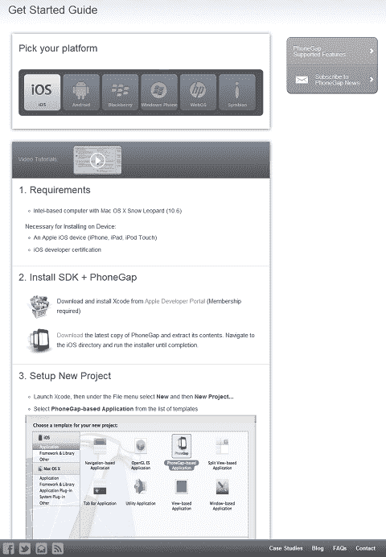
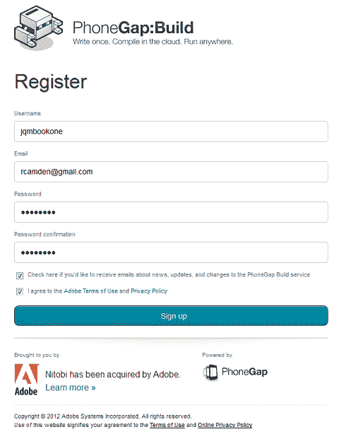
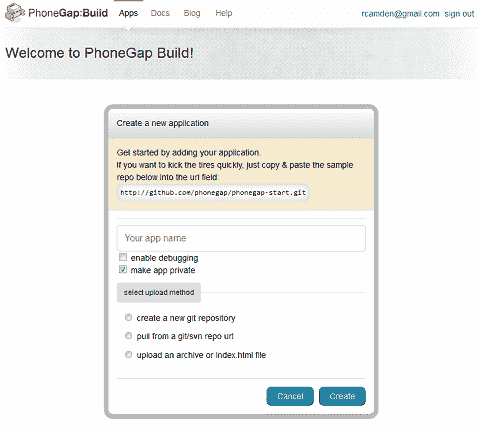
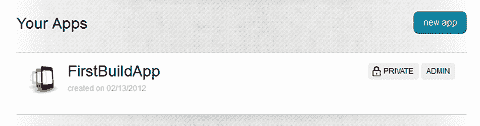
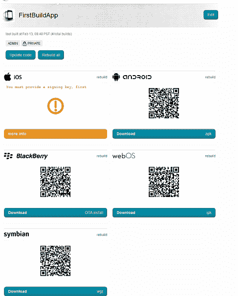
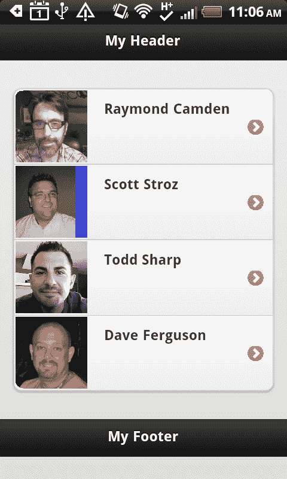
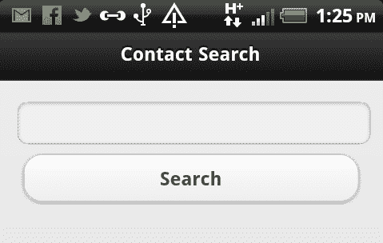
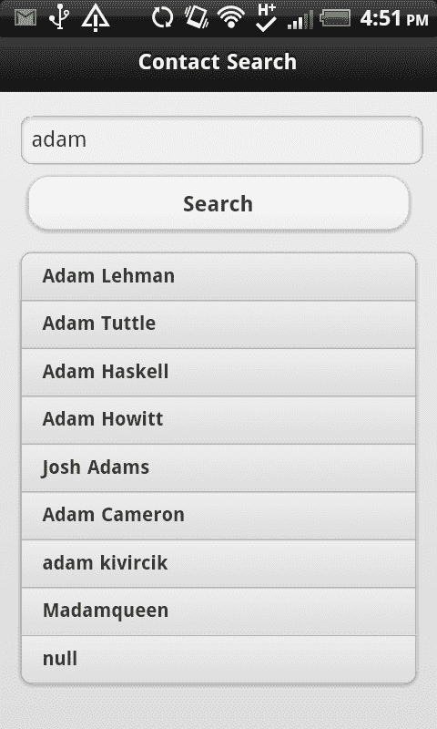

# 十二、创建本机应用

在本章中，我们将研究如何将基于 jQueryMobile 的 web 应用转换为移动设备的本机应用。我们将讨论 PhoneGap 框架，以及它如何允许您利用设备的硬件。

在本章中，我们将：

*   讨论 PhoneGap 项目及其作用
*   演示如何使用 PhoneGap 的构建服务创建本机应用

# HTML 作为本机应用

对于大多数人来说，在 Android 或 iOS 这样的平台上创建本机应用需要学习一种全新的编程语言。虽然学习新语言和扩展技能总是很好的，但如果你可以利用现有的 HTML 技能在移动设备上本机使用它们，那不是很酷吗？

幸好有这样一个平台。电话间隔（[http://www.phonegap.com](http://www.phonegap.com) 是一个开源项目，允许您获取 HTML 页面并创建本机应用。此代码完全免费，可用于开发 iOS（iPhone 和 iPad）、Android（同样包括手机和平板电脑）、黑莓、WebOS、WindowsPhone7、Symbian 和 Bada 等应用。PhoneGap 通过在本机环境中创建项目并指向 HTML 文件来工作。设置完成后，您可以使用现有的 HTML、CSS 和 JavaScript 技能创建应用的 UI 和功能。

更好的是，PhoneGap 为 JavaScript 代码提供了额外的 API。这些 API 允许：

*   加速计：允许您的代码检测设备上的基本运动
*   摄像头：允许您的代码使用摄像头
*   指南针：允许您访问设备上的指南针
*   联系人：提供基本搜索和联系人创建支持
*   文件：对设备存储器的读/写访问
*   地理定位：提供一种检测设备位置的方法
*   媒体：允许基本视频/音频捕获支持
*   网络：确定设备的网络连接设置
*   通知：创建通知的简单方法（通过弹出窗口、声音或振动）
*   存储：访问简单 SQL 数据库

通过使用这些 API，您可以将普通的 HTML 站点转换为功能强大、类似于本机的应用，用户可以下载并安装到他们的设备上。

在我们进一步之前，让我们快速地看一下 Po.??\. PosiGAP Apple ??。PhoneGap 是一个开源项目，目前在 Apache 处于孵化状态。更名为**科尔多瓦**。你可能会听到人们提到它的名字。在写这本书的时候，大多数人仍然把这个项目称为 PhoneGap，这是我们将使用的术语。需要记住的重要一点是 PhoneGap 是免费的、开源的！

在我们进一步讨论之前，让我们快速讨论一下 PhoneGap 应用与本机应用的比较。在大多数情况下，本机应用将比使用 PhoneGap 创建的应用执行得更快。PhoneGap 并不是要取代本机开发。但通过允许您使用现有技能并同时部署到多个平台，其好处可能远远超过对性能的任何担忧。

## 与 PhoneGap 合作

创建 PhoneGap 项目主要有两种方法。人们使用 PhoneGap 的主要方式是使用他们首先构建的平台的开发工具。因此，对于 Android 项目，需要使用 Eclipse 编辑器和正确的插件，而在 iOS 上则需要 XCode。*入门指南*（[http://www.phonegap.com/start](http://www.phonegap.com/start) 提供了有关如何为您选择的设备平台设置环境的详细信息：



详细说明每个平台的设置对于本书来说太多了（而且只会复制 PhoneGap 网站上的内容），因此我们将关注创建本机应用的另一个选项，**PhoneGap Build**服务。PhoneGap 构建（[https://build.phonegap.com](https://build.phonegap.com) 是一项在线服务，它简化并自动化了创建本机应用的过程。它允许您简单地上传代码（或使用公共源代码管理存储库）以生成本机二进制文件。更好的是，您可以使用 PhoneGap Build 为所有受支持的平台生成二进制文件。这意味着你可以为 iPhone、Android、Blackberry 和其他版本编写代码和吐出代码，所有这些都来自于网站本身：


不过，PhoneGap 构建服务不是免费的。定价计划和其他细节可以在网站上找到，但幸运的是有一个免费的开发商计划。这就是我们将在本章中使用的服务。让我们先创建一个帐户。（在下面的屏幕截图和示例中，请确保将详细信息更改为适合您的内容。）

首先点击**创建账户**按钮并填写相关详细信息：



注册后，您将返回 PhoneGap 构建主页，不会看到任何类型的确认消息。这有点不幸，但如果你检查你的电子邮件，你应该会看到一条来自他们的消息，要求验证你的注册。单击该链接，您将进入一个页面，要求您创建第一个 PhoneGap 构建项目：



请注意，构建服务支持从新的 Github 存储库、现有 Git 或 Subversion 存储库或通过上载的 ZIP 或 HTML 文件为项目设定种子。现在，让我们从网站切换到代码。我们想从一组非常简单的代码开始。在本章后面，我们将做一些更有趣的事情，但现在，我们的目标是上传一些 HTML，看看接下来会发生什么。在从 GitHub 下载的代码中，打开`c12`文件夹并查看`app1`文件夹。本文件包含[第 4 章](04.html "Chapter 4. Working with Lists")中*处理清单*的一个清单示例的副本。它使用 jquerymobile 创建一个简单的四人列表，以及缩略图。没有什么太令人兴奋的，但它完成了我们在这里的工作。您会注意到已经有一个`app1.zip`文件。

如果您返回网站并选择**上传档案**，则您可以浏览到计算机上提取文件的位置并选择该 ZIP 文件。还要确保输入应用的名称。我选择了`FirstBuildApp`。点击**创建**后，您将进入一个包含所有应用的页面，如果您是新的构建用户，该页面将只包含刚刚创建的应用：



点击应用标题，您可以选择下载各种风格的应用。信不信由你——你已经可以下载大多数平台的版本了。使用 iOS 需要您提供其他详细信息，但：



如果您没有看到**下载**链接，而是看到**排队的**通知，请给构建服务一两分钟的时间以赶上进度。如果你只是重新加载页面，你最终会看到链接出现。

实际使用应用取决于您选择的平台。对于 Android，您需要确保已启用设置**允许安装非市场应用**。该设置的确切措辞和位置将取决于您的设备。这句话可以在我的 HTC Inspire 设备上的**应用**设置中找到。您可以通过编辑 PhoneGap 生成站点上的设置来对应用进行签名。一旦你做到了这一点，你就可以向安卓市场提交你的应用了。但由于 Android 允许您使用未经签名的应用，您可以在测试时跳过该步骤。如果下载 APK（表示应用的实际文件），可以通过几种方式在设备上获得它。Android SDK 包括从命令行安装应用的工具。最简单的方法是使用电子邮件。如果您通过电子邮件将文件发送给自己，并在设备上检查电子邮件，则应该能够在设备上安装该文件。以下屏幕截图显示了在我的手机上运行的应用：



## 添加 PhoneGap 功能

我们刚刚演示了如何使用 PhoneGap 构建服务将 HTML（当然还有 JavaScript、CSS 和图像）转化为一个真正的、适用于多种平台的本地应用。不过，正如本章前面提到的，PhoneGap 提供的不仅仅是将 HTML 转换为本机应用的简单包装器。PhoneGap JavaScript API 提供了对许多以设备为中心的服务的访问，这些服务可以极大地增强应用的功能。对于我们的第二个示例，我们将看一看这些特性之一——Contacts API。（有关详细信息，请参见*联系人 API 文档*，该文档位于：[http://docs.phonegap.com/en/1.4.1/phonegap_contacts_contacts.md.html#Contacts)](http://docs.phonegap.com/en/1.4.1/phonegap_contacts_contacts.md.html#Contacts))。

`Listing 12-1`中的应用是一个简单的联系人搜索工具。让我们看一下代码，然后看看正在发生的事情：

```js
Listing 12-1: index.html
<!DOCTYPE html>
<html>
<head>
<title>Contact Search</title>
<meta name="viewport" content="width=device-width, initial- scale=1">
<link rel="stylesheet" href ="jquery.mobile.min.css" />
<script src="jquery.js"></script>
<script src="jquery.mobile.min.js"></script>
<script src="phonegap-1.4.1.js"></script>
<script>
document.addEventListener("deviceready", onDeviceReady, false);
function onDeviceReady(){
$("#searchButton").bind("touchend", function() {
var search = $.trim($("#search").val());
if(search == "") return;
var opt = new ContactFindOptions();
opt.filter = search;
opt.multiple = true;
navigator.contacts.find(["displayName","emails"], foundContacts, errorContacts, opt);
});
foundContacts = function(matches){
//create results in our list
var s = "";
for (var i = 0; i < matches.length; i++) {
s += "<li>"+matches[i].displayName+"</li>";
}
$("#results").html(s);
$("#results").listview("refresh");
}
errorContacts = function(err){
navigator.notification.alert("Sorry, we had a problem and gave up.", function() {});
}
}
</script>
</head>
<body>
<div data-role="page">
<div data-role="header">
<h1>Contact Search</h1>
</div>
<div data-role="content">
<input type="text" id="search" value="adam" />
<button id="searchButton">Search</button>
<ul id="results" data-role="listview" data-inset="true"></ul>
</div>
</div>
</div>
</body>
</html>

```

让我们先看看应用的布局部分，它位于文件的下半部分。您可以看到我们的 jQueryMobile 页面结构，其中有一个输入字段、一个按钮和一个空列表。这里的想法是，用户将输入要搜索的名称，点击按钮，结果将显示在列表中。下面的屏幕截图演示了输出：



现在看一下 JavaScript 代码。我们所做的第一个更改是包括 PhoneGap JavaScript 库：

```js
<script src="phonegap-1.4.1.js"></script>

```

此 JavaScript 库可从 PhoneGap 下载的 ZIP 文件中获得。即使我们不打算在本地构建应用（尽管您当然可以），我们也需要在发送给构建服务的 ZIP 文件中包含 JavaScript 文件。这是一个棘手的部分。从 PhoneGap v1.4.1 开始，JavaScript 文件在每个平台上都是唯一的。这意味着 PhoneGap 支持的每个操作系统都有一个不同的 JavaScript 文件。构建服务足够智能，可以将您的文件引用与正确的文件交换到正确的平台。如果您在本书中使用 Github 存储库中的代码，那么它就是 Android 版本。如果您希望将此代码用于 iOS，请确保在本地替换 JavaScript 文件。

下一个有趣的消息是以下代码行：

```js
document.addEventListener("deviceready", onDeviceReady, false);

```

`deviceready`事件是 PhoneGap 触发的特殊事件。它本质上意味着您的代码现在可以使用高级功能，如 Contacts API。

在事件处理程序`onDeviceReady`中，我们有一些事情正在进行。注意的第一个函数是搜索按钮的事件处理程序。前几行只是获取、修剪和验证值。

在我们确定确实有需要搜索的内容后，您可以看到 Contacts API 的第一次实际使用，如以下代码段所示：

```js
var opt = new ContactFindOptions();
opt.filter = search;
opt.multiple = true;
navigator.contacts.find(["displayName","emails"], foundContacts, errorContacts, opt);

```

Contacts API 有一个搜索方法。它的第一个参数是要搜索和返回的字段数组。在我们的例子中，我们是说，我们要搜索联系人的姓名和电子邮件值。第二个和第三个参数是成功和错误回调。最后一个选项是搜索的一组选项。您可以看到它是在调用之前创建的。过滤键只是搜索词。默认情况下，联系人搜索返回一个结果，因此我们也专门要求多个结果。

现在让我们来看看成功的处理程序：

```js
foundContacts = function(matches){
//create results in our list
var s = "";
for (var i = 0; i < matches.length; i++) {
s += "<li>"+matches[i].displayName+"</li>";
}
$("#results").html(s);
$("#results").listview("refresh");
}

```

联系人搜索的结果将是一个结果数组。请记住，您只会得到您请求的内容，因此我们的结果对象包含`displayName`和`emails`属性。现在，我们的代码只需要将`displayName`添加到列表中。记住我们从前面的一章中学到的内容，我们还知道无论何时修改 jQuery Mobile listview，都需要刷新它。以下屏幕截图显示了一个示例搜索：



# 总结

在本章中，我们研究了 PhoneGap 开源项目，以及它如何允许您使用 HTML、JavaScript 和 CSS，并为多种不同的设备创建本机应用。我们使用构建服务，并使用它上载代码和下载编译后的本机应用。虽然 PhoneGap 不需要 jQuery Mobile，但两者构成了一个非常强大的团队。

在下一章中，我们将带领这个团队创建我们的最终应用，一个成熟的 RSS 阅读器。