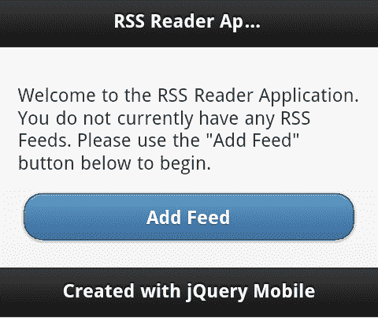
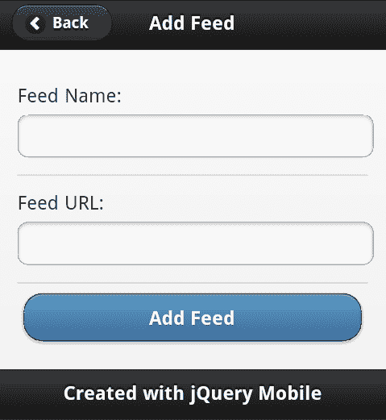
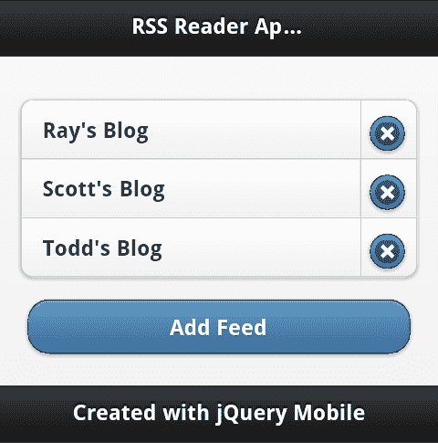
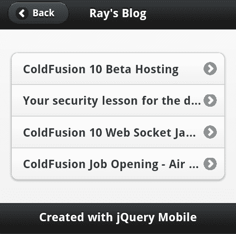
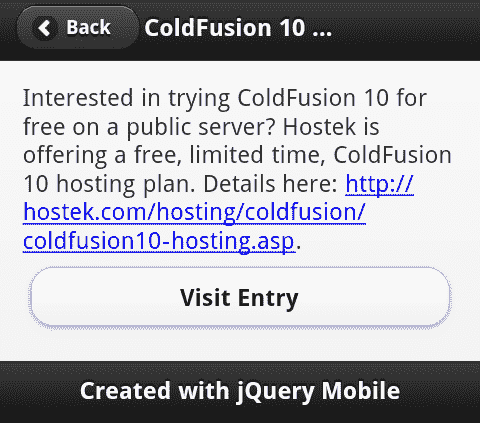

# 十三、成为专家——构建 RSS 阅读器应用

现在，您已经了解了 jQuery Mobile 及其特性，现在是构建最终的完整应用的时候了——RSS 阅读器。

在本章中，我们将：

*   讨论 RSS 阅读器应用及其特性
*   创建应用
*   讨论可以添加到应用中的内容

# RSS 阅读器-应用

在深入研究代码之前，快速演示应用的最终工作形式可能是有意义的，这样您就可以看到各个部分以及它们是如何协同工作的。RSS 阅读器应用正是这样，一个应用旨在获取 RSS 提要（例如来自 CNN、ESPN 和其他网站），将其解析为可读数据，并为用户提供查看文章的方式。此应用将允许您添加和删除提要，提供名称和 URL，然后提供查看提要中当前条目的方法。

应用从一组基本指令开始。只有在不使用任何已知源运行应用时，这些说明才可见：



点击**添加提要**按钮，您将看到一个简单的表单，该表单同时允许名称和 URL。（不幸的是，URL 必须手动输入。幸运的是，现代移动设备允许复制和粘贴。我强烈建议使用它！）：



添加提要后，您将返回主页。下面的屏幕截图显示了添加几个提要后的视图：



要开始阅读条目，用户只需选择其中一个提要。然后将获取提要并显示当前条目：



应用的最后一部分是条目视图本身。有些博客不通过 RSS 提供条目的“完整”副本，显然你可能想对博客本身发表评论。因此，在底部，我们提供了一种访问真实网站的简单方法，如以下屏幕截图所示：



现在您已经看到了应用，让我们构建它。我们将再次使用 PhoneGap 构建来创建最终结果，但该应用实际上也会像在常规网站上一样运行。（稍后我们将详细讨论原因。）

# 创建 RSS 阅读器应用

我们的申请从第一页`index.html`开始。此页面也将加载到 jQuery 和 jQuery Mobile 中。它的核心任务是列出您当前的提要，但它必须识别用户何时根本没有提要，并提供一些文本鼓励他们添加第一个提要：

```js
Listing 13-1: index.html
<!DOCTYPE html>
<html>
<head>
<title>RSS Reader App</title>
<meta name="viewport" content="width=device-width, initial- scale=1">
<link rel="stylesheet" href ="jquery.mobile/jquery.mobile- 1.1.0.min.css" />
<script src="jquery.mobile/jquery-1.6.4.min.js"></script>
<script src="jquery.mobile/jquery.mobile-1.1.0.min.js"></script>
<script src="main.js"></script>
</head>
<body>
<div data-role="page" id="intropage">
<div data-role="header">
<h1>RSS Reader Application</h1>
</div>
<div data-role="content" id="introContent">
<p id="introContentNoFeeds" style="display:none">
Welcome to the RSS Reader Application. You do not currently have any RSS Feeds. Please use the "Add Feed" button below to begin.
</p>
<ul id="feedList" data-role="listview" data-inset="true" data- split-icon="delete"></ul>
<a href ="addfeed.html" data-role="button" data-theme="b">Add Feed</a>
</div>
<div data-role="footer">
<h4>Created with jQuery Mobile</h4>
</div>
</div>
<script>
$("#intropage").bind("pagecreate", function(e) {
init();
});
</script>
</body>
</html>

```

正如代码清单前面提到的，我们需要首先加载 jQuery 和 jQueryMobile 模板。您可以在前面代码清单的开头看到这一点。页面的其余部分大部分是您在上一章中看到的锅炉板 HTML，因此让我们列出一些细节。

首先记下介绍性段落。注意到 CSS 隐藏文本了吗？这里的假设是——大多数情况下——用户不需要这些文本，因为他们有提要。我们的代码将在必要时处理显示它。

在该段之后是一个空列表，将显示我们的提要。右下方是用于添加新提要的按钮。

最后，我们在结尾有一点脚本。这将为 jQueryMobile 页面事件`pagecreate`创建一个事件监听器，我们将其绑定到该事件中，然后启动应用任务。

我们的所有代码（即我们的自定义代码）将存储在`main.js`中。这个文件有点大，所以我们将简单地显示与每个部分相关的部分。在我们读完这一章时，请记住这一点。可以找到整个文件以及本书剩余的示例代码：

```js
Listing 13-2: Portion of main.js
function init() {
//handle getting and displaying the intro or feeds
$("#intropage").live("pageshow",function(e) {
displayFeeds();
});

```

`main.js`中的第一个片段来自`init`函数。记住这是在`pagecreate`上运行的主页。它在页面显示之前运行。这使它成为一个好地方，可以在页面显示时继续注册函数。我们把大部分逻辑都放到了它自己的函数中，让我们来看看下一个。

## 显示馈送功能

`displayFeeds`处理检索我们的提要并显示它们。逻辑很简单。如果没有提要，我们希望显示介绍性文本：

```js
Listing 13-3: displayFeeds from main.js
function displayFeeds() {
var feeds = getFeeds();
if(feeds.length == 0) {
//in case we had one form before...
$("#feedList").html("");
$("#introContentNoFeeds").show();
} else {
$("#introContentNoFeeds").hide();
var s = "";
for(var i=0; i<feeds.length; i++) {
s+= "<li><a href ='http://feed.html?id="+i+"' data- feed='"+i+"'>"+feeds[i].name+"</a> <a href ='http:// class='deleteFeed' data-feedid='"+i+"'>Delete</a></li>";
}
$("#feedList").html(s);
$("#feedList").listview("refresh");
}
}

```

注意，我们还清理了列表。这是可能的，一个用户有提要并删除了它们。通过将列表重置为空字符串，我们可以确保不会留下任何内容。如果有提要，我们会动态创建列表，确保在最后调用`listview("refresh")`API，让 jQuery Mobile 整理列表。

## 存储我们的提要

那么这些提要是从哪里来的呢？我们如何储存它们？当我们使用 PhoneGap 并可以利用嵌入式 SQLite 数据库实现时，我们可以使用更简单的东西`localStorage. localStorage`是一种 HTML5 功能，它允许您在客户端上存储键/值对。虽然不能存储复杂数据，但可以在存储复杂数据之前使用 JSON 序列化对其进行编码。这使得数据的存储极其简单。请记住，`localStorage`涉及文件存储。每当对数据进行更改时，应用都需要从文件中读取数据。但是，因为我们讨论的是一个简单的提要列表，所以这个数据应该相对较小：

```js
Listing 13-3: getFeeds, addFeed, and removeFeed
function getFeeds() {
if(localStorage["feeds"]) {
return JSON.parse(localStorage["feeds"]);
} else return [];
}
function addFeed(name,url) {
var feeds = getFeeds();
feeds.push({name:name,url:url});
localStorage["feeds"] = JSON.stringify(feeds);
}
function removeFeed(id) {
var feeds = getFeeds();
feeds.splice(id, 1);
localStorage["feeds"] = JSON.stringify(feeds);
displayFeeds();
}

```

前三个函数代表存储系统的整个包装器。`getFeeds`只需检查`localStorage`中的值，如果该值存在，则处理将 JSON 数据转换为本机 JavaScript 对象的操作。`addFeed`获取提要名称和 URL，从中创建一个简单对象，并存储 JSON 版本。最后，`removeFeed`函数只需在数组中查找正确的项，将其删除，并将其存储回`localStorage`。

## 添加 RSS 源

到现在为止，一直都还不错。现在让我们看看添加提要所需的逻辑。如果您还记得，我们用来添加提要的链接转到了`addfeed.html`。让我们来看一看：

```js
Listing 13-4: addfeed.html
<!DOCTYPE html>
<html>
<head>
<title>Add Feed</title>
<meta name="viewport" content="width=device-width, initial-scale=1">
</head>
<body>
<div data-role="page" id="addfeedpage" data-add-back-btn="true">
<div data-role="header">
<h1>Add Feed</h1>
</div>
<div data-role="content">
<form id="addFeedForm">
<div data-role="fieldcontain">
<label for="feedname">Feed Name:</label>
<input type="text" id="feedname" value="" />
</div>
<div data-role="fieldcontain">
<label for="feedurl">Feed URL:</label>
<input type="text" id="feedurl" value="" />
</div>
<input type="submit" value="Add Feed" data-theme="b">
</div>
<div data-role="footer">
<h4>Created with jQuery Mobile</h4>
</div>
</div>
</body>
</html>

```

除了表单之外，此页面没有太多内容。请注意，我们的表单没有任何操作。我们这里没有使用服务器。相反，我们的代码将处理接收表单提交并对其进行处理。还要注意的是，我们没有做之前推荐的事情——将 jQuery 和 jQueryMobile 包含放在顶部。这些包含在桌面应用中是必要的，因为用户可能会在应用主页之外的页面上添加书签。由于此代码的最终目标是 PhoneGap 应用，因此我们不必担心这一点。这使我们的 HTML 文件变得更小。现在让我们回到`main.js`并查看处理此逻辑的代码。

下面的代码是来自`main.js`的`init`方法的片段。它处理表单上的按钮点击：

```js
Listing 13-5: Add Feed event registration logic
//Listen for the addFeedPage so we can support adding feeds
$("#addfeedpage").live("pageshow", function(e) {
$("#addFeedForm").submit(function(e) {
handleAddFeed();
return false;
});
});

```

现在我们来看看`handleAddFeed`。我对这段代码进行了抽象，只是为了让事情更简单：

```js
Listing 13-6: handleAddFeed
function handleAddFeed() {
var feedname = $.trim($("#feedname").val());
var feedurl = $.trim($("#feedurl").val());
//basic error handling
var errors = "";
if(feedname == "") errors += "Feed name is required.\n";
if(feedurl == "") errors += "Feed url is required.\n";
if(errors != "") {
//Create a PhoneGap notification for the error
navigator.notification.alert(errors, function() {});
} else {
addFeed(feedname, feedurl);
$.mobile.changePage("index.html");
}
}

```

在大多数情况下，这里的逻辑应该简单易懂。我们获取提要名称和 URL 值，确保它们不是空的，并且可以选择警告任何错误。如果没有发生错误，那么我们运行前面描述的`addFeed`方法。注意，我们使用`changePage`API 将用户返回主页。

我将在这里调用一个特定的代码位，即处理显示错误的行：

```js
navigator.notification.alert(errors, function() {});

```

这一行来自 PhoneGap API。它会为您的设备创建特定于移动设备的警报通知。您可以将其视为一个更高级的 JavaScript`alert()`调用。第二个参数是警报窗口的回调函数。因为在这种情况下我们不需要做任何事情，所以我们提供了一个空回调，它什么也不做。

## 查看提要

继续讨论当用户单击查看提要时会发生什么？这可能是应用最复杂的方面。我们从 HTML 模板开始，它非常简单，因为大部分工作都将在 JavaScript 中完成：

```js
Listing 13-7: feed.html
<!DOCTYPE html>
<html>
<head>
<title>Feed</title>
<meta name="viewport" content="width=device-width, initial-scale=1">
</head>
<body>
<div data-role="page" id="feedpage" data-add-back-btn="true">
<div data-role="header">
<h1></h1>
</div>
<div data-role="content" id="feedcontents">
</div>
<div data-role="footer">
<h4>Created with jQuery Mobile</h4>
</div>
</div>
</body>
</html>

```

这个页面基本上是一个外壳。注意，它根本没有真正的内容，只有等待填充的空 HTML 元素。让我们回到`main.js`来看看它是如何工作的：

```js
Listing 13-8: Feed display handler (part 1)
//Listen for the Feed Page so we can displaying entries
$("#feedpage").live("pageshow", function(e) {
//get the feed id based on query string
var query = $(this).data("url").split("=")[1];
//remove ?id=
query = query.replace("?id=","");
//assume it's a valid ID, since this is a mobile app folks won't be messing with the urls, but keep
//in mind normally this would be a concern
var feeds = getFeeds();
var thisFeed = feeds[query];
$("h1",this).text(thisFeed.name);
if(!feedCache[thisFeed.url]) {
$("#feedcontents").html("<p>Fetching data...</p>");
//now use Google Feeds API
$.get("https://ajax.googleapis.com/ajax/services/feed/ load?v=1.0&num=10&q="+encodeURI(thisFeed.url)+"&callback=?", {}, function(res,code) {
//see if the response was good...
if(res.responseStatus == 200) {
feedCache[thisFeed.url] = res.responseData.feed.entries;
displayFeed( thisFeed.url);
} else {
var error = "<p>Sorry, but this feed could not be loaded:</p><p>"+res.responseDetails+"</p>";
$("#feedcontents").html(error);
}
},"json");
} else {
displayFeed(thisFeed.url);
}
});

```

第一个代码段用于监听`feed.html`上的`pageshow`事件。这意味着它将在每次查看文件时运行，这是我们想要的，因为它用于每个不同的提要。这是怎么回事？请记住，我们的提要列表包含提要本身的标识符：

```js
for(var i=0; i<feeds.length; i++) {
s+= "<li><a href='http://feed.html?id="+i+"' data- feed='"+i+"'>"+feeds[i].name+"</a> <a href='http:// class='deleteFeed' data-feedid='"+i+"'>Delete</a></li>";
}

```

jQuery Mobile 通过数据（“URL”）API 为我们提供了对 URL 的访问。因为它返回整个 URL，我们只关心问号后面的内容，所以我们可以使用一些字符串函数来清理它。最终结果是一个数值查询，我们可以使用它从提要查询中提取数据。在常规桌面应用中，用户很容易搞乱 URL 参数。因此，我们将在这里进行一些检查，以确保请求的值实际存在。因为这是移动设备上的单用户应用，所以真的不必担心这一点。

在尝试获取提要之前，我们使用了一个简单的缓存系统。`main.js`中的第一行创建了一个空对象：

```js
//used for caching
var feedCache= {};

```

这个对象将存储来自提要的结果，这样我们就不必不断地重新获取它们。这就是为什么下面这句话：

```js
if(!feedCache[thisFeed.url]) {

```

在我们进行任何其他网络呼叫之前运行。那么，我们如何才能真正获得反馈呢？谷歌有一个很酷的服务叫做 FeedAPI（[https://developers.google.com/feed/](https://developers.google.com/feed/) 。它允许我们使用 Google 处理 RSS 提要的 XML 抓取并将其转换为 JSON。JavaScript 可以与 XML 一起使用，但 JSON 要容易得多，因为它变成了常规的、简单的 JavaScript 对象。我们有一些错误处理，但如果一切正常，我们只需缓存结果。最后一位是对`displayFeed:`的调用

```js
Listing 13-9: displayFeed
function displayFeed(url) {
var entries = feedCache[url];
var s = "<ul data-role='listview' data-inset='true' id='entrylist'>";
for(var i=0; i<entries.length; i++) {
var entry = entries[i];
s += "<li><a href ='entry.html?entry="+i+"&url="+encodeURI(url)+"'>"+ entry.title+"</a></li>";
}
s += "</ul>";
$("#feedcontents").html(s);
$("#entrylist").listview();
}

```

前一个块所做的就是迭代结果提要。当 Google 从提要解析 XML 时，它变成了一个可以循环的对象数组。虽然提要中有许多属性我们可能感兴趣，但对于列表，我们只关心标题。注意我们是如何建立链接的。我们传递数字索引和 URL（我们将在下一部分中使用）。然后将其呈现到一个简单的 jQuery Mobile listview。

## 创建入口视图

准备好最后一部分了吗？让我们看一下单个条目显示。和前面一样，我们将从模板开始：

```js
Listing 13-10: entry.html
<!DOCTYPE html>
<html>
<head>
<title>Entry</title>
<meta name="viewport" content="width=device-width, initial-scale=1">
</head>
<body>
<div data-role="page" id="entrypage" data-add-back-btn="true">
<div data-role="header">
<h1></h1>
</div>
<div data-role="content">
<div id="entrycontents"></div>
<a href ="" id="entrylink" data-role="button">Visit Entry</a>
</div>
<div data-role="footer">
<h4>Created with jQuery Mobile</h4>
</div>
</div>
</body>
</html>

```

与之前的`feed.html`类似，`entry.html`是一个空壳。请注意，标题、内容和链接都是空的。所有这些都将被真正的代码所取代。让我们回到`main.js`并查看处理此页面的代码：

```js
Listing 13-11: Entry page event handler
$("#entrypage").live("pageshow", function(e) {
//get the entry id and url based on query string
var query = $(this).data("url").split("?")[1];
//remove ?
query = query.replace("?","");
//split by &
var parts = query.split("&");
var entryid = parts[0].split("=")[1];
var url = parts[1].split("=")[1];
var entry = feedCache[url][entryid];
$("h1",this).text(entry.title);
$("#entrycontents",this).html(entry.content);
$("#entrylink",this).attr("href",entry.link);
});

```

这是怎么回事？请记住，我们传递了一个索引值（单击了哪个条目，第一个，第二个？）和提要的 URL。我们从 URL 解析出这些值。一旦我们知道了提要的 URL，我们就可以使用缓存来获取特定的条目。一旦我们有了它，更新标题、内容和链接就很简单了。就这样！

## 更进一步

您可以从此应用中获取代码，并立即将其上载到 PhoneGap 构建服务，以便在您自己的设备上试用。但我们还能做些什么呢？以下是需要考虑的事项的简短列表：

*   PhoneGap 提供连接 API（[http://docs.phonegap.com/en/1.4.1/phonegap_connection_connection.md.html](http://docs.phonegap.com/en/1.4.1/phonegap_connection_connection.md.html) ），返回有关设备连接状态的信息。您可以添加对此的支持，以防止用户在设备不在线时尝试读取提要。
*   当我们将用户的提要存储在`localStorage`中时，读取 RSS 条目的缓存数据被临时存储。您还可以存储该数据，并在用户脱机时使用它。
*   PhoneGap 有一个优秀的插件 API，并且已经有很多插件可用。（[https://github.com/phonegap/phonegap-plugins](https://github.com/phonegap/phonegap-plugins) ）其中一个插件可以更方便地发送短信。您可以添加一个选项，通过短信向朋友发送条目标题和链接。我们是否提到 PhoneGap 还允许您与联系人一起工作？更多信息请参见联系人 API:[http://docs.phonegap.com/en/1.4.1/phonegap_contacts_contacts.md.html](http://docs.phonegap.com/en/1.4.1/phonegap_contacts_contacts.md.html) 。

希望你能明白。这只是 jQuery Mobile 和 PhoneGap 强大功能的一个例子。

# 总结

在本章中，我们从上一章中学习了 PhoneGap，并创建了一个完整的移动应用，使用 jQuery mobile 进行设计和交互。