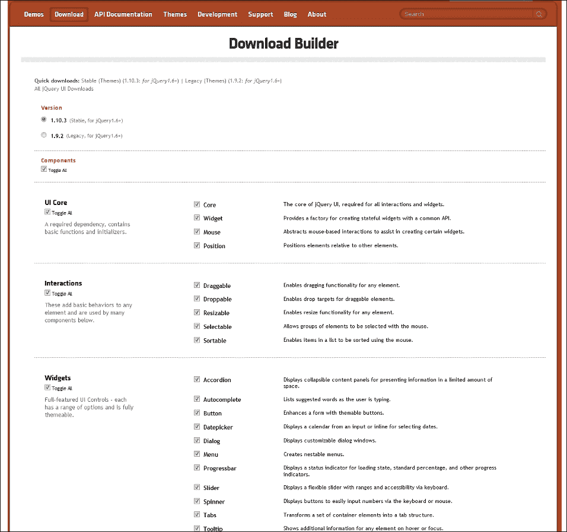
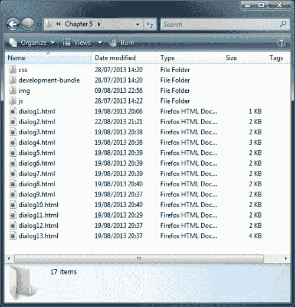
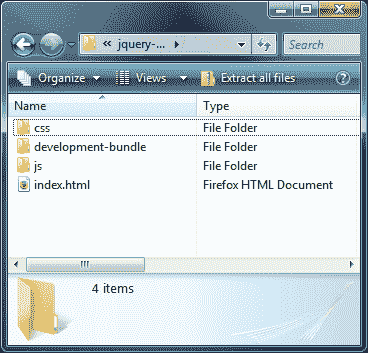
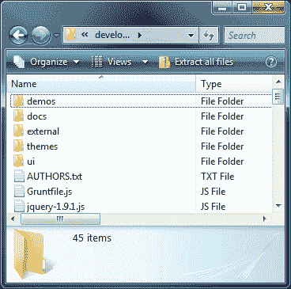
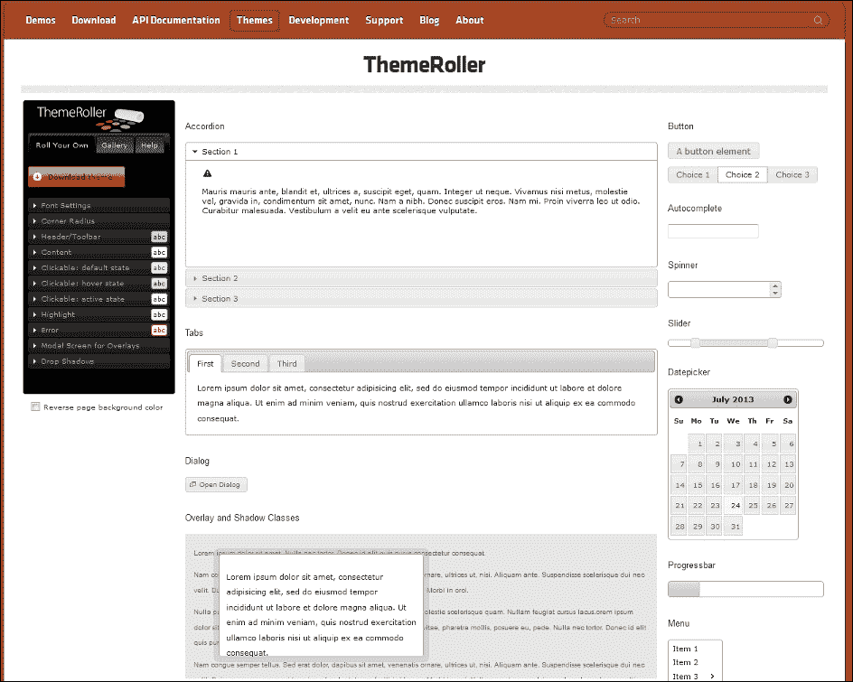
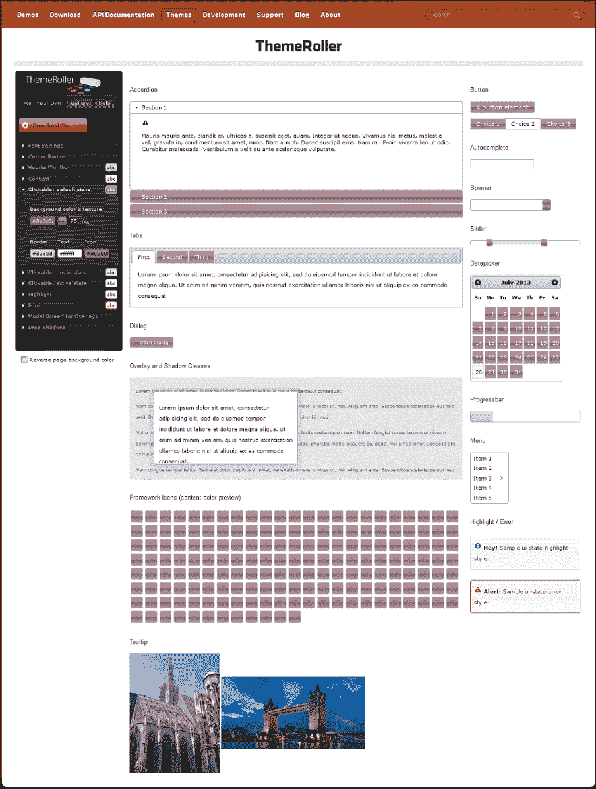

# 一、jQueryUI 简介

欢迎来到*jQuery UI 1.10:**jQuery*的用户界面库。本资源旨在引导您从最初的步骤开始，深入使用 JavaScript 库中的 UI 小部件和交互助手，这些小部件和交互助手构建在非常流行且易于使用的 jQuery 之上。

jqueryui 扩展了底层 jQuery 库，提供了一套丰富的交互式小部件以及代码保存交互助手，这些小部件是为增强网站和 web 应用的用户界面而构建的。jQuery 核心和 UI 都是根据严格的编码约定构建的，这些编码约定会定期更新，并遵循当前 JavaScript 设计的最佳实践。作为 jQuery 的官方 UI 库，严格遵守当前的 JavaScript 标准有助于使其成为 jQuery 可用的更好的 UI 库之一。

在本章中，我们将介绍以下主题：

*   如何获得图书馆的副本
*   如何建立一个开发环境
*   图书馆的结构
*   ThemeRoller
*   浏览器支持
*   图书馆如何获得许可
*   API 的格式

jQuery 已经迅速成为当今使用的最流行的 JavaScript 库之一，这要归功于它不断增长的通用 UI 小部件、高水平的可配置性以及它异常容易的实现。该库由一些非常知名的名称使用和支持，如 Microsoft、WordPress、Adobe 和 Intel。

jQueryUI 运行在 jQuery 之上，因此用于初始化、配置和操作不同组件的语法与 jQuery 具有相同的舒适和易于使用的风格。由于 jQuery 是 UI 的基础，我们还可以利用所有优秀的 jQuery 功能。该库还受到一系列非常有用的工具的支持，例如提供一系列辅助 CSS 类的 CSS 框架，以及优秀的 ThemeRoller 应用，该应用允许我们可视化地为小部件创建自己的自定义主题，或者从不断增长的已有主题库中进行选择。我们将在本章后面介绍 ThemeRoller 应用。

在本书的整个过程中，我们将了解构成库的每个现有组件。我们还将研究他们的配置选项，并尝试他们的方法，以便充分了解他们的工作方式和能力。在本书的最后，您将成为 jQueryUI 库中每个小部件的配置和使用方面的专家。当我们创建一个自定义组件时，当我们添加一个新的小部件或交互助手时，我们已经对这些组件有了基本的工作知识，因为我们实现组成库的不同组件的方式是一致的。因此，我们只需要学习任何特定于小部件的功能，就可以掌握我们希望使用的特定组件。

# 下载图书馆

本书专门针对 jQuery UI 的 1.10 版定制，需要 jQuery 1.6 或更高版本；在本书中，我们将在代码示例中使用 jQuery 2.0.3。

### 注

如果您仍然需要支持 IE6，那么 jQuery UI 库的旧版本 1.9.2 也可以下载。您还需要使用 jQuery1.10 的副本，因为 jQuery2.0 不支持 IE6-8。

要获取库的副本，我们应该访问[的下载生成器 http://www.jqueryui.com/download](http://www.jqueryui.com/download) 。这个工具为我们提供了一系列不同的选项来构建一个适合我们特定需求的下载包。以下截图显示了**下载生成器**：



我们可以下载完整的当前版本，也可以下载旧版本的完整软件包。我们还可以只选择我们想要的组件并下载一个定制包，这是特别推荐用于生产环境的，在生产环境中，我们只使用 UI 库的一个子集；这有助于减少查看页面时使用的带宽。

该页面的布局友好且易于使用。它列出了各自分组中的所有不同组件（**UI 核心**、**交互**和**小部件**），并允许我们从 24 个不同的预先设计主题中选择一个（或者根本没有主题）。该页面还提供有关包的信息（包括其压缩大小和未压缩大小）。

### 提示

如果作为开发人员，您希望看到源代码管理下的 jQuery UI 的最新快照，那么您可以从 GitHub 下载一份副本，该副本可在[上获得 https://github.com/jquery/jquery-ui](https://github.com/jquery/jquery-ui) 。

稍后我们将查看在库中找到的不同文件，但现在我们应该下载完整的库。它将包含我们需要的一切，包括 JavaScript 和 CSS 文件，以及来自当前主题的任何依赖于不同组件的图像。它甚至包含 jQuery 本身的最新版本，所以我们不需要担心单独下载。

现在，只需使用页面顶部的自定义**下载**链接，然后选择**平滑度**作为下一页的主题，然后点击**下载**。我们将在下一章中介绍下载和使用其他主题。

本书附带的代码下载包括每章练习文件夹中的 jQuery 2.03 副本。如果您需要下载新副本，您可以下载。下载新副本的说明在[附录](15.html "Appendix A. Help and Support")、*帮助和支持*中列出。

## 使用 jQuery UI 的托管版本

我们不需要下载库来在生产 web 应用中实现它。jQuery 和 jQuery UI 都托管在谷歌、CDNJS、微软和 MediaTemple（为 jQuery UI 提供 CDN）提供的**内容交付****网络**（**CDN**）上。

在一个接收大量国际流量的实时站点上，使用 CDN 将有助于确保库文件从地理位置接近的服务器下载到访问者的计算机上。这有助于加快他们的响应速度，并节省我们自己的带宽。然而，这不建议用于本地开发！

### 提示

**托管文件**

如果您想利用 CDN 链接，可以在以下位置找到这些链接：

*   谷歌的 CDN:[http://code.google.com/apis/libraries/](http://code.google.com/apis/libraries/)
*   CDNJS 的 CDN:[http://cdnjs.com](http://cdnjs.com)
*   jQuery 的 CDN:[http://code.jquery.com](http://code.jquery.com)
*   微软 CDN:[http://www.asp.net/ajaxlibrary/CDN.ashx](http://www.asp.net/ajaxlibrary/CDN.ashx)

# 建立发展环境

我们需要一个位置来解包 jQueryUI 库，以便在我们自己的文件中轻松访问它的不同部分。我们应该首先创建一个`project`文件夹，将所有示例文件、所有库以及其他相关资源保存到该文件夹中。

在`C:`驱动器或主目录中创建一个新文件夹，并将其命名为`jqueryui`。这将是我们项目的根文件夹，也是我们在本书中存储所有示例文件的位置。

### 注

本书附带代码下载的结构将反映我们正在创建的本地环境。

要解压缩库，您可以使用 Windows 资源管理器（如果在 PC 上工作），或者使用压缩程序，如 7-zip。提取库时，选择我们刚刚创建的`jqueryui`文件夹。如果您是 Mac 用户，您可能需要将`jqueryui-1.10.3.custom`文件夹的内容复制到我们刚刚创建的新`jqueryui`文件夹中。（我们将在本章后面介绍`jqueryui`文件夹的结构。）

### 注

7-zip 是一个类似于 WinZip 或 WinRAR 的开源归档应用；我个人觉得它更好更容易使用。您可以从[免费下载 http://www.7-zip.org](http://www.7-zip.org) 。

我们将看到的代码示例使用其他资源，主要是图像，但偶尔也使用一些 PHP 文件。*Packt Publishing*网站上提供的附带代码下载包含我们将使用的所有图像。如果可以，您应该从[下载此文件 http://www.packtpub.com/support/book/user-interface-library-for-jquery](http://www.packtpub.com/support/book/user-interface-library-for-jquery) 。您需要在`jqueryui`项目文件夹中创建一个新文件夹，并将其命名为`img`，然后将存档中图像文件夹中的所有图像解压缩到该新文件夹中。

打开`jqueryui`文件夹并添加所需的其他文件夹后，您将看到类似于以下截图的内容，我以**第 5 章**为例，这需要创建其他`img`文件夹：



代码下载还包含所有示例以及库本身。提供这些文件的目的是希望它们仅供参考。我建议您在阅读过程中遵循本书中的示例，手动创建所示的每个文件，而不是仅参考代码下载中的文件。学习代码的最好方法，就是编码。

这就是我们需要做的一切，不需要安装其他平台或应用，也不需要配置或设置任何东西。只要您有一个浏览器和某种代码或文本编辑器，就可以开始使用该库进行开发。

有很多可用的编辑器，任何一个都可以与 jQuery UI 一起使用，如果您还没有 Windows 用户的首选编辑器，您可以尝试 Notepad++（可从[免费获得）http://www.notepad-plus-plus.org](http://www.notepad-plus-plus.org) ）或升华文本 2（共享软件，可从[http://www.sublimetext.com/2](http://www.sublimetext.com/2) 。我会避免使用内存不足的 IDE，因为它们会促进太多的工作，因此在使用 jQuery UI 时会影响学习曲线。

### 注

对于那些喜欢使用本地 web 服务器进行开发的人，如果您还没有将某些设置作为日常工作流程的一部分，那么您可以使用 WAMP（用于 PC）或 MAMP（用于 Mac）之类的工具。Linux 用户应该在发行版中找到合适的 web 服务器。

# 了解图书馆的结构

让我们花一点时间看看图书馆的结构，一旦它被解压缩，我们就知道在哪里寻找特定的实用工具和文件。这将使我们对它的组成和结构有一种感觉。打开我们打开图书馆的`jqueryui`文件夹。此文件夹的内容应如下所示：

*   `css`文件夹
*   `development-bundle`文件夹
*   `js`文件夹
*   `index.html`文件

我们可以从以下屏幕截图中看到结构的外观：



为了使用 jQuery UI，只需知道`js`和`css`文件夹是生产环境中需要使用的文件夹即可；这些文件可以按原样放入站点结构中，并相应地从代码中引用相关的压缩文件。

但是，如果您以开发能力使用库，那么我建议您使用`development-bundle`文件夹；它包含与单个源文件相同的代码，但为未压缩格式。

## 详细检查文件夹结构

对于大多数人来说，没有必要知道 jQueryUI 库是如何组成的；毕竟，要使用的两个关键文件夹可以简单地放到您的站点中并相应地引用。在这种情况下，您可能希望跳过本节，转到*与他们的合作伙伴*。

但是，如果您的技能更高，并且您想了解更多关于图书馆结构的信息，请继续阅读。我建议您在阅读本节时，将 jQuery 的副本下载到手上，以便了解库的组成。

`css`文件夹用于存储库附带的完整 CSS 框架。在这个文件夹中将有一个目录，其中包含我们在构建下载包时选择的主题的名称。其中有一个包含所有 CSS 框架的单一文件，以及一个包含主题使用的所有图像的文件夹。我们还可以将要创建的`css`文件存储在此`css`目录中。

`js`文件夹包含 jQuery 的简化版本和完整的 jQuery UI 库，所有组件都集成到一个文件中。在一个实时项目中，我们希望将`js`和`css`文件夹放入我们的站点。

索引是一个 HTML 文件，它简要介绍了该库，并显示了所有小部件以及一些 CSS 类。如果这是你第一次使用这个库，你可以看看这个文件，看看我们在这本书的整个过程中将要用到的一些东西。

`development-bundle`目录包含一系列帮助我们与图书馆一起发展的资源。它由以下子目录组成：

1.  `demos`文件夹
2.  `docs`文件夹
3.  `external`文件夹
4.  `themes`文件夹
5.  `ui`文件夹

以下屏幕截图显示了文件夹结构的显示方式：



目录中还有许可证文件、JSON 源文件、显示库及其主要贡献者版本的文档，以及 jQuery 的未压缩版本。

`demos`文件夹包含系列基本示例，显示了所有不同的组件。`docs`文件夹包含每个不同组件的 API 文档。

`external`文件夹包含一套工具，可供开发人员使用。详情如下:

*   `globalize`插件
*   `jshint`插件
*   `mousewheel`插件
*   单元测试套件`qunit`（由 JavaScript 和 CSS 文件组成）

`globalize`插件为 jQuery 提供本地化支持，可用于格式化 350 多种文化中的字符串、日期和数字。`jshint`插件是`jslint`插件的衍生产品，它是一种检测 JavaScript 代码中错误和潜在问题的工具，同时强制执行您自己的编码约定。Brandon Aaron 设计的`mousewheel`插件为您的网站或在线应用添加了跨浏览器鼠标滚轮支持。QUnit 框架是 jQuery 的单元测试套件，我们可以使用它在我们创建的任何代码上运行单元测试。

### 提示

有关 QUnit 的更多信息，请访问[http://docs.jquery.com/QUnit](http://docs.jquery.com/QUnit) 。

`themes`文件夹包含默认主题或下载生成器期间选择的主题。我们稍后下载的其他主题或我们自己创建的主题也可以存储在这里。

`ui`文件夹包含库中每个不同组件的单个和未压缩源文件。

### 注

如果您从主页面选择**稳定**下载选项，您会发现内容看起来不同**稳定**下载选项只包含`development-bundle`文件夹的内容，默认包含的主题名为**基**。这在视觉上类似于我们在定制包中下载的**平滑度**主题。

# 与机器一起工作

ThemeRoller 是一个用 jQuery 和 PHP 编写的定制工具。它允许我们可视化地生成自己的定制 jQueryUI 主题，并将其打包到一个方便的、可下载的归档文件中，然后我们可以将其放入我们的项目中，而无需进一步编码（当然，除了在 HTML`<link>`元素中使用样式表之外）。

ThemeRoller，主持地点为[http://ui.jquery.com/themeroller](http://ui.jquery.com/themeroller) 是由 Filames Group，Inc.创建的，使用了许多发布到开源社区的 jQuery 插件。它可以用于为 jQueryUI1.10 或 jQueryUI 的旧版本 1.9 生成主题。

### 提示

**主持主题**

我们甚至不需要下载一个主题，如果我们使用的主题之一，可从主站点。在生产环境中，您可能更喜欢使用主题的 CDN 版本，就像使用 CDN 链接引用主库一样。

您可以使用以下链接导入基本主题或平滑主题：[http://code.jquery.com/ui/1.10.3/themes/smoothness/jquery-ui.css](http://code.jquery.com/ui/1.10.3/themes/smoothness/jquery-ui.css) 。如果要使用其他主题之一，请将 URL 中的`smoothness`替换为首选主题。

ThemeRoller 无疑是创建您自己的 jQueryUI 主题的最全面的工具。我们可以非常快速、轻松地创建一个完整的主题，其中包含针对构成库的不同小部件所需的所有样式，包括我们需要的图像。



如果您稍早查看`index.html`文件，ThemeRoller 登录页将立即熟悉，因为它显示页面上的所有 UI 小部件，并使用默认的**平滑度**主题。

ThemeRoller 页面左侧有一个用于处理应用的交互式菜单。菜单中的每个项目都会展开，让您可以访问小部件每个部分的可用样式设置，例如小部件的**内容**和**可点击**区域、**标题**和**内容**区域，以及其他相关内容，例如警告和**错误**消息。

在这里，我们可以轻松创建自定义主题，并尽快查看更改，因为这些更改应用于页面上每个小部件的不同可见部分，如以下屏幕截图所示：



如果您在创建主题时感觉不到特别的灵感，那么还有一个预先配置的主题库，您可以立即使用它生成完全配置的主题。除了方便之外，这些预选主题最好的一点是，当您选择一个主题时，它会加载到左侧菜单中。因此，您可以根据需要轻松地进行小调整。

这是创建与现有站点样式相匹配的具有视觉吸引力的自定义主题的极好方法，也是创建自定义外观的推荐方法。

安装和使用新主题与选择或创建它一样简单。上面截图中的**下载主题**按钮将我们带回下载生成器，该生成器将新主题的 CSS 和图像集成到下载包中。

如果它只是我们想要的新主题，我们可以取消选择实际组件，只需下载主题。下载后，下载档案中的`css`文件夹将包含一个具有主题名称的文件夹。我们可以简单地将这个文件夹拖到我们自己的本地`css`文件夹中，然后从我们的页面链接到样式表。

在本书中，我们不会详细介绍这个工具。我们将把重点放在样式规则上，我们需要在自己的自定义样式表中手动覆盖这些规则，以手动生成所需的示例外观。

# 对组件类别进行分类

在 jQuery UI 库中可以找到三种类型的组件，如下所示：

*   **低级交互助手**：这些组件主要用于处理鼠标事件
*   **小部件**：这些组件在页面上生成可见对象
*   **核心组件**：这些是库中其他部分依赖的组件

让我们花一点时间来考虑组成这些类别中的每一个组件，从核心组件开始。

核心组成部分包括：

*   果心
*   小装置
*   老鼠
*   位置

核心文件设置了所有组件用于运行的结构，并添加了一些由所有库组件共享的核心功能，如键盘映射、父级滚动和 z 索引管理器。此文件不是为单独使用而设计的，并且不公开可在其他组件之外使用的功能。

交互帮助程序由以下组件组成：

*   拖动
*   可降落
*   可调整大小
*   可选的
*   可恶的

交互助手向任何元素添加基于鼠标的基本行为；这允许您动态创建可排序列表、调整元素（如对话框）大小，甚至构建功能（如基于拖放的购物车）。

更高级别的小部件（在撰写本文时）包括：

*   手风琴
*   自动补全
*   按钮
*   日期选择器
*   对话
*   菜单
*   进度条
*   滑块
*   标签
*   菜单
*   工具提示

小部件是将丰富的桌面应用功能带到 Web 的 UI 控件。每个小部件都可以完全定制外观和行为。

## 介绍 widget 工厂及效果

当使用 jQueryUI 的小部件时，您会遇到小部件工厂。这实际上为库公开的所有可见小部件创建了基础。它实现了所有小部件通用的共享 API，如`create`和`destroy`方法，并提供事件回调逻辑。它还允许我们创建继承共享 API 的自定义 jQueryUI 小部件。我们将在本章后面详细介绍 Widget 工厂。

除了这些组件和交互助手之外，还有一系列 UI 效果，可以在页面上的目标元素上生成不同的动画或转换。这些都是优秀的添加天赋和风格，我们的网页。我们将在本书的最后一章[第 14 章](14.html "Chapter 14. UI Effects")*UI 效果*中介绍这些效果。

jQueryUI 的简化 API 的好处在于，一旦您学会了使用所有现有组件（正如本书将向您展示的），您就能够非常快速地获取任何新组件。未来版本中还有更多组件的计划，包括将 jQueryMobile 合并到库中！

# 浏览器支持

与 jQuery 本身一样，这个版本的 jQueryUI 正式支持当前和以前版本的浏览器，尽管库可以很好地使用较旧版本的主要浏览器，包括以下浏览器：IE7+、Firefox 2+、Opera 9+、Safari 3+和 Chrome 1+。

### 提示

**对 IE6 和 IE7 的支持**

如前所述，jQueryUI 团队已经放弃了对 UI1.10 中 IE6 的支持；通过下载旧版本 1.9.2，您仍然可以使用 jQuery UI。IE7 的用户可能会注意到，也有计划放弃对该浏览器的支持；在编写本文时，这一点目前计划在 1.11 版中实现，尽管这一点尚未得到确认。

小部件是根据组件需要生成的语义正确的 HTML 元素构建的。因此，我们不会看到创建或使用过多或不必要的元素。

# 使用本书示例

该库与标准 JavaScript 一样灵活。我的意思是，做同一件事或达到同一目的的方法往往不止一种。例如，不同组件的配置对象中使用的回调事件通常可以引用函数或内联匿名函数，并以同样的轻松和效率使用它们。

在实践中，建议尽可能地减少代码（jQuery 确实可以提供帮助）。但为了使示例更具可读性和可理解性，我们将尽可能多的代码分离为离散的模块。因此，回调函数和配置选项将与调用或使用它们的代码分开定义。

在本书中，我们将把 JavaScript 和 CSS 代码分离成不同的文件；虽然这对于开发工作来说是过分的，但对于制作网站来说是可取的。浏览器可以缓存驻留在外部`js`文件中的脚本，从而大大提高加载速度；在线写入的（即直接写入`<script>`标记）不会被浏览器缓存。

我还想说清楚，本书的主要目的是学习如何使用构成 jQueryUI 的不同组件。如果一个例子看起来有点复杂，那么这可能是公开特定方法或属性的功能的最简单的方法，而不是我们为常规实现编码的情况。

我想在这里补充一点，jQueryUI 库目前正在经历一个快速的扩展、bug 修复和开发阶段。对于这个版本，jQuery 团队将重点放在 bug 修复上，以帮助使库尽可能稳定。从长远来看，jqueryui 团队将重点放在每个小部件 API 的完全重新设计上，然后在未来的版本中添加大量新的小部件，并完成与 jquerymobile 的计划合并。

# 图书馆牌照

与 jQuery 一样，jQueryUI 库也是根据麻省理工学院开源许可证授权的。这是一个非常不受限制的许可证，允许创作者获得其制作的荣誉并保留其知识产权，而不会阻止我们的开发者以我们喜欢的任何方式在任何类型的网站上使用该库。

MIT 许可证明确规定软件用户（本例中为 jQuery UI）可以自由使用、复制、合并、修改、发布、分发、再许可和销售。这让我们可以对图书馆做任何我们想做的事情。本许可证的唯一要求是我们必须保持原始版权和保修声明的完整性。

这是一个重要的观点。你可以拿着图书馆做任何你喜欢的事。您可以在库的顶部构建应用，然后出售这些应用或免费赠送它们。你可以把图书馆放在嵌入式系统中，比如手机操作系统，然后出售。但不管你做什么，都要保留原始文本文件，上面有 John Resig 的名字。您还可以在应用的帮助文件或文档中逐字复制它。

麻省理工学院的许可证非常宽松，但因为它本身没有版权，我们可以自由更改它。因此，我们可以要求我们软件的用户将属性提供给我们，而不是 jQuery 团队，或者将代码作为我们自己的代码。

该许可证不以任何方式限制我们，也不同于您可能购买并安装在自己计算机上的软件附带的许可证类型。在大多数情况下，使用该库时不会考虑该库的许可方式。然而，插件作者希望确保他们的插件在类似的许可下发布。

# 介绍 API

一旦您使用了库中的一个组件，当您使用任何其他组件时，您将立即感到宾至如归，因为每个组件的方法都是以完全相同的方式调用的。

每个组件的 API 由一系列不同的方法组成。虽然这些都是技术上的方法，但根据它们的特定功能对它们进行分类可能是有用的。

<colgroup><col style="text-align: left"> <col style="text-align: left"></colgroup> 
| 

方法类型

 | 

描述

 |
| --- | --- |
| 插件方法 | 此方法用于初始化组件，只是组件的名称，后跟括号。我将在整本书中将其称为 plugin 方法或 widget 方法。 |
| 共享 API 方法 | `destroy`方法可以与任何组件一起使用，以完全禁用正在使用的小部件，并且在大多数情况下将底层 HTML 返回到其原始状态。初始化后，所有组件使用`option`方法获取或设置任何配置选项。大多数库组件使用`enable`和`disable`方法来启用或禁用组件。由所有小部件公开的`widget`方法返回对当前小部件的引用。 |
| 专门的方法 | 每个组件都有一个或多个特定组件特有的方法来执行专门的功能。 |

通过将我们想要调用的方法作为简单字符串传递给组件的`plugin`方法，方法在的每个不同组件中被一致地调用，方法接受的任何参数在方法名称后作为字符串传递。

例如，要调用手风琴组件的`destroy`方法，我们只需使用以下代码：

```js
$("#someElement").accordion("destroy");
```

看那是多么容易！所有不同组件公开的每个方法都以相同的简单方式调用。

一些方法（如标准 JavaScript 函数）接受触发组件中不同行为的参数。例如，如果我们想在 tabs 小部件中的特定选项卡上调用`disable`方法，我们将使用以下代码：

```js
$("#someElement").tabs("disable", 1);
```

当与 tabs 小部件一起使用时，`disable`方法接受一个整数，该整数表示小部件中单个选项卡的索引。同样，为了再次启用该选项卡，我们将使用`enable`方法，如下代码所示：

```js
$("#someElement").tabs("enable", 1);
```

同样，我们提供一个参数来修改该方法的使用方式。有时传递给方法的参数在组件之间会有所不同。例如，accordion 小部件不启用或禁用单个 accordion 面板，而只启用或禁用整个小部件，因此不需要在方法名称后面附加参数。

`option`方法比其他常用方法稍微复杂一些，但它也更强大，同样易于使用。该方法用于在组件初始化后获取或设置任何可配置选项。

要使用`getter`模式下的期权方法检索期权的当前值，我们可以使用以下代码：

```js
$("#someElement").accordion("option", "navigation");
```

前面的代码将返回 accordion 小部件的`navigation`选项的当前值。因此，要触发`getter`模式，我们只需提供要检索的选项名。

为了在`setter`模式下使用`option`方法，我们可以提供选项名称和新值作为参数：

```js
$("#someElement").accordion("option", "navigation", true);
```

前面的代码将`navigation`选项的值设置为`true`。请注意，还可以将对象文本传递给`option`方法，以便一次设置多个不同的选项。例如：

```js
$("#someElement").accordion("option", {
  animate: "bounceslide",
  heightStyle: "fill"
});
```

正如您所看到的，尽管`option`方法为我们提供了同时使用`get`和`set`配置选项的能力，但它仍然保留了与其他方法相同的易于使用的格式。

## 事件和回调

每个组件的 API 还包含一个丰富的事件模型，允许我们轻松地对不同的交互做出反应。每个组件都公开自己的一组独特的自定义事件，但无论使用哪个事件，这些事件的使用方式都是相同的。

在 jQueryUI 中，我们有两种处理事件的方法。每个组件都允许我们添加在触发指定事件时执行的回调函数，作为配置选项的值。例如，要使用 tabs 小部件的`select`事件（每次选择 tab 时都会触发），我们可以使用以下代码：

```js
var options = {
  select: function() {
  ...
  }
};
$("#myTabs").tabs(options);
```

事件名称用作`option`名称，匿名函数用作`option`值。在后面的章节中，我们将查看每个组件使用的所有单个事件。

处理事件的另一种方法是使用 jQuery 的`on()`方法。要以这种方式使用事件，只需指定组件名称，后跟事件名称：

```js
$("#someElement").on("tabsselect", function() {
...
});
```

通常，但并非总是，与`on()`方法一起使用的回调函数在触发事件后执行，而使用配置选项指定的回调函数则直接在触发事件之前执行。回调函数在触发事件的 DomeElement 的上下文中调用。例如，在具有多个选项卡的选项卡小部件中，`select`事件将由所选的实际选项卡触发，而不是由整个选项卡小部件触发。这对我们非常有用，因为它允许我们将事件与特定选项卡相关联。

jQuery UI 组件触发的一些自定义事件是可取消的，如果停止，可以用来防止某些操作发生。最好的例子（我们将在本书后面介绍）是通过在`beforeClose`事件的回调函数中返回`false`来防止对话框小部件关闭：

```js
beforeClose: function() {
  if (readyToClose === false) {
    event.preventDefault();
}
```

如果不满足本例中的任意条件，回调函数将返回`false`，对话框将保持打开状态。这是一个优秀而强大的特性，可以让我们对每个小部件的行为进行细粒度的控制。

## 回调参数

使用任何小部件的一个重要特性是它能够接受回调。我们可以使用回调来运行执行特定任务的匿名函数。例如，我们可以在 Accordion 小部件中每次单击特定标题时在屏幕上触发警报。

任何作为回调函数提供给不同事件的匿名函数都会自动传递两个参数：原始、扩展或修改的事件对象，以及包含有关小部件有用信息的对象。第二个对象中包含的信息因组件而异。举个例子，让我们来看看在使用手风琴小部件时可以实现的回调：

```js
$("#myAccordion").accordion({
  activate: function (event, ui) {
    if(ui.newHeader.length > 0){
      alert(ui.newHeader.attr("id"));
    } else {
      // closed
    }
  }
});
```

在将结果显示在屏幕上之前，我们已经将参数传递给函数，并使用它们来确定哪个手风琴标题是打开的。将这些对象传递给我们定义的任何回调函数的原理同样适用于所有组件；我们将在后面的章节中详细介绍这一点。

# 总结

jQueryUI 消除了构建引人入胜且有效的用户界面的困难。它提供了一系列组件，可以快速、轻松地使用，只需很少的配置即可开箱即用。每个组件都公开了一组全面的属性和方法，用于与页面或应用集成，如果需要更复杂的配置，可以利用这些属性和方法。

每个组件都被设计为高效、轻量级和语义正确，同时利用了 JavaScript 最新的面向对象功能，并使用了一个简洁、经过良好测试的框架。当与 jQuery 结合使用时，它为任何 web 开发人员的工具包提供了一个极好的补充。

到目前为止，我们已经了解了如何获取库，如何设置系统以利用它，以及库是如何构造的。我们还研究了如何为不同的小部件添加或自定义主题，API 如何简单而一致地公开库的功能，以及组件的不同类别。在本章的过程中，我们已经讨论了一些重要的主题，但是现在我们可以继续使用 jQueryUI 的组件，并开始进行一些适当的编码，首先看一下 CSS 框架。