# 二、CSS 框架和其他工具

在 1.7 版中添加的 jQueryUI 库包含一个更新的 CSS 框架，可用于有效且一致地对库中可用的每个小部件进行主题化。该框架由许多帮助器类组成，我们可以在自己的代码中使用这些类，即使我们不使用任何库组件。

在本章中，我们将介绍以下主题：

*   构成框架的文件
*   如何使用框架公开的类
*   如何快速轻松地切换主题
*   压倒主题
*   使用位置工具

# 处理构成框架的文件

在库的结构中，有两个位置是构成框架的 CSS 文件所在的位置，具体取决于您选择下载的库的版本。

详情如下:

*   `css`：此文件夹保存完整的 CSS 框架，包括构建下载包时选择的主题。所有必要的 CSS 都放在一个简单、简洁、平均的样式表中，以最小化生产环境中的 HTTP 请求。CSS 文件存储在一个文件夹中，以下载生成器上选择的主题命名。此版本的框架将包含在下载生成器中选择的所有组件的样式，因此其大小将根据库的使用量而有所不同。
*   `themes`：框架的另一个版本存在于`development-bundle`文件夹中，您可以在文件夹中找到`themes`文件夹。此文件夹中提供了两个主题：基本主题和下载库时选择的主题。基本主题是灰色的中性主题，在视觉上与平滑度主题相同。

在每个主题文件夹中，都有组成框架的各个文件。框架的每个不同组件都被拆分为各自的文件：

<colgroup><col style="text-align: left"> <col style="text-align: left"></colgroup> 
| 

组成部分

 | 

使用

 |
| --- | --- |
| 

```js
jquery.ui.all.css

```

 | 在开发中使用此文件可以链接主题所需的所有文件。它由拉入`ui.base.css`和`ui.theme.css`文件的`@import`指令组成。 |
| 

```js
jquery.ui.base.css

```

 | 此文件由`ui.all.css`使用。它还包含拉入`ui.core.css file`的`@import`指令，以及每个小部件 CSS 文件。但是，它不包含控制每个小部件外观的主题样式。 |
| 

```js
jquery.ui.core.css

```

 | 此文件提供核心框架样式，例如“清除修复”辅助对象和通用覆盖。 |
| 

```js
jquery.ui.accordion.css
jquery.ui.datepicker.css
jquery.ui.button.css
jquery.ui.autocomplete.css
jquery.ui.dialog.css
jquery.ui.progressbar.css
jquery.ui.resizable.css
jquery.ui.selectable.css
jquery.ui.slider.css
jquery.ui.spinner.css
jquery.ui.tabs.css
jquery.ui.menu.css
jquery.ui.tooltip.css
jquery-ui.css

```

 | 这些文件是控制每个小部件的布局和基本外观的单个源文件。 |
| 

```js
jquery.ui.theme.css

```

 | 该文件包含构成库中每个小部件的所有视觉元素的完整视觉主题和目标。 |

让我们更详细地看看这些文件中的每一个。

## jquery.ui.all.css

`jquery.ui.all.css`文件使用 CSS 导入，使用`@import`规则读入两个文件`jquery.ui.base.css`和`jquery.ui.theme.css`文件。这是文件中的全部内容，也是实现完整框架和选定主题所需的全部内容。

从这个文件中的两个指令中，我们可以看到框架中使小部件发挥功能的部分和使其具有视觉外观的主题之间的分离。

## jquery.ui.base.css

`jquery.ui.base.css`文件也只包含条`@import`规则，并将`jquery.ui.core.css`文件与每个小部件 CSS 文件一起导入。此时，我应该提到，可调整大小的组件有自己的框架文件，以及每个小部件。

## jquery.ui.core.css

`jquery.ui.core.css`文件为所有组件使用的框架提供通用样式。它包含以下类：

<colgroup><col style="text-align: left"> <col style="text-align: left"></colgroup> 
| 

班

 | 

使用

 |
| --- | --- |
| `.ui-helper-hidden` | 这个类隐藏了带有`display: none`的元素。 |
| `.ui-helper-hidden-accessible` | 这个类通过剪切元素来隐藏元素，以便元素保持完全可访问性。元素根本没有隐藏或定位在屏幕外。 |
| `.ui-helper-reset` | 这是 jQueryUI 的重置机制（它不使用单独的重置样式表），它抵消了浏览器应用于公共元素的边距、填充和其他常见默认样式。有关重置默认浏览器样式的重要性的介绍，请访问：[http://sixrevisions.com/css/css-tips/css-tip-1-resetting-your-styles-with-css-reset/](http://sixrevisions.com/css/css-tips/css-tip-1-resetting-your-styles-with-css-reset/) 。 |
| `.ui-helper-clearfix` | `.ui-helper-clearfix`样式应用于容器本身。 |
| `.ui-helper-zfix` | `.ui-helper-zfix`类提供应用于`<iframe>`元素的规则，以便在使用覆盖时修复 z 索引问题。 |
| `.ui-state-disabled` | 这个类将游标设置为禁用元素的默认值，并使用重要指令确保它不会被重写。 |
| `.ui-icon` | 此规则是库用背景图像替换元素文本内容的方法。`jquery.ui.theme.css`文件负责设置库中不同图标的背景图像。 |
| `.ui-widget-overlay` | 此类设置显示对话框和其他模式弹出窗口时应用于页面的覆盖的基本样式属性。当覆盖使用图像时，该类的某些样式也可以在主题文件中找到。 |

核心文件为框架的其余部分奠定了基础。我们还可以为我们自己的元素指定这些类名称，以便在使用库时清除浮动或隐藏元素，尤其是在构建新的 jQuery UI 插件以与 ThemeRoller 一致主题化时。

### 解释单个组件框架文件

库中的每个小部件以及可调整大小的交互助手都有一个框架文件，用于控制 CSS 并使小部件正常工作。例如，“选项卡”小部件中的选项卡标题必须向左浮动才能显示为选项卡。框架文件设置了此规则。当我们在自定义主题中重写框架时，需要呈现这些样式。

这些文件很简短，每个组件都使用尽可能少的规则来正确运行。通常，文件非常紧凑（通常不超过 15 个样式规则长度）。Datepicker 源文件是例外，因为它需要大量规则才能正常工作。

## jquery.ui.theme.css

此文件将根据使用 ThemeRoller 选择或创建的主题进行自定义。

它为组成每个小部件的不同元素设置所有视觉属性（颜色、图像等）。

在`jquery.ui.theme.css`文件中，有许多注释包含描述性标签，用大括号括起来。这些被称为**占位符**，它们前面的 CSS 样式在生成主题时由 ThemeRoller 自动更新。

这是将为完整主题生成的文件，它包含使用 ThemeRoller 创建或选择主题时每个小部件的所有可见部分的样式。当重写框架以创建自定义主题时，将被重写的主要是该文件中的规则。

每个小部件由一组公共元素构成。例如，每个小部件的外部容器都有一个名为`ui-widget`的类，而小部件中的任何内容都将保存在一个名为`ui-widget-content`的容器中。正是这种一致的布局和分类惯例使得框架如此有效。

### 提示

**下载示例代码**

您可以下载您在[账户购买的所有 Packt 书籍的示例代码文件 http://www.packtpub.com](http://www.packtpub.com) 。如果您在其他地方购买了本书，您可以访问[http://www.packtpub.com/supportand](http://www.packtpub.com/supportand) 注册，将文件直接通过电子邮件发送给您。

这是框架使用的最大的样式表，包含太多的类，无法在这里完整列出（但是现在可以随意打开它并查看一下）。下表列出了不同类别的课程：

<colgroup><col style="text-align: left"> <col style="text-align: left"></colgroup> 
| 

类别

 | 

使用

 |
| --- | --- |
| 容器 | 此类别设置小部件、标题和内容容器的样式属性。 |
| 相互作用状态 | 这些类为任何可点击的元素设置默认、悬停和活动状态。 |
| 交互线索 | 此类别将视觉提示应用于元素，包括突出显示、错误、禁用、主要和次要样式。 |
| 状态和图像 | 这些类设置内容和标题容器中显示的图标所用的图像，以及任何可点击的元素，包括默认、悬停、活动、突出显示、聚焦和错误状态。 |
| 图像定位 | 主题使用的所有图标图像存储在单个精灵文件中，并通过操纵精灵文件的背景位置属性来单独显示。此类别设置所有单个图标的背景位置。 |
| 角半径 | CSS3 用于为支持的浏览器（如 Firefox 3+、Safari 3+、Chrome 1+、Opera 10+和 IE9+）提供圆角。 |
| 覆盖层 | 此处设置了用于核心 CSS 文件中定义的通用覆盖的图像，因为它是一个在指定元素上实现半透明覆盖的类。 |

jQuery UI 文档在[中对主题 API 进行了广泛的概述 http://api.jqueryui.com/category/theming/](http://api.jqueryui.com/category/theming/) 。

# 链接到所需的框架文件

对于开发环境中所有 jQuery UI 小部件的快速主题化，我们可以使用`jquery.ui.all.css`链接到所有单独的文件：

```js
<link rel="stylesheet"
href="development-bundle/themes/smoothness/jquery.ui.all.css">
```

例如，为了在测试 tabs 小部件等组件时单独使用每个文件，我们将使用以下`<link>`元素：

```js
<link rel="stylesheet"
  href="development-bundle/themes/base/jquery.ui.core.css">
<link rel="stylesheet"
  href="development-bundle/themes/base/jquery.ui.tabs.css">
<link rel="stylesheet"
  href="development-bundle/themes/base/jquery.ui.theme.css">
```

单独链接时，CSS 资源应按以下顺序添加到 HTML 页面：`core.css`、小部件的 CSS 文件和`theme.css`文件。

当然，在生产环境中，我们会使用超级高效的组合文件来最小化对 CSS 文件的 HTTP 请求数量。我们需要链接到`css/themename/`目录中找到的组合`jquery-ui-x.x.x.min.css`样式表，其中 x.x.x 是您下载的 jQuery UI 的版本号：

```js
<link rel="stylesheet"
  href="css/smoothness/jquery-ui-x.x.x.custom.css">
```

为了便于编码和方便，我们将在所有示例中链接到`development-bundle/themes/base/jquery.ui.all.css`文件。如果您已按上一章所示解包了库以及`css`、`development-bundle`和`js`文件夹，则 CSS 文件的上一个路径将是正确的。如果您使用的是不同的结构，请相应地更改 CSS 文件的路径。

### 提示

**从本书中创建示例**

在本书中，您会注意到我们提到将文件保存在`jqueryui`文件夹中；您可能希望在每个章节中放置一个子文件夹，以便代码与其他章节分开存储。这反映在本书附带的代码下载中。

# 使用框架类

除了在实现正式 jQueryUI 小部件时使用该框架外，我们还可以在部署自己的自定义插件时使用它。

## 使用容器

推荐使用容器，因为它意味着我们编写的小部件或插件将更容易准备，也更容易让最终开发人员进行主题化和定制。让我们看看将框架与我们自己的元素一起使用是多么容易。

在文本编辑器中，创建新文件并添加以下代码：

```js
<!DOCTYPE html>
<html>
<head>
  <meta charset="utf-8">
  <title>CSS Framework - Containers</title>
  <link rel="stylesheet"
    href="development-bundle/themes/base/jquery.ui.all.css">
</head>
<body>
  <div class="ui-widget">
    <div class="ui-widget-header ui-corner-top">
      <h2>This is a .ui-widget-header container</h2>
    </div>
    <div class="ui-widget-content ui-corner-bottom">
      <p>This is a .ui-widget-content container</p>
    </div>
  </div>
</body>
</html>
```

解包库时，在[第一章](01.html "Chapter 1. Introducing jQuery UI")*介绍 jQuery UI*中创建的`jqueryui`项目文件夹中，将此页面另存为`containers.html`。我们正在从库中的基本开发主题链接到`jquery.ui.all.css`文件。如果我们正在构建一个更复杂的小部件，我们可能还想链接到`jquery.ui.core.css`文件。

在创建小部件或插件时使用此文件是非常重要的，因为它让我们能够验证我们提供给容器的类名是否具有适当的样式，并向我们保证它们将准备就绪。我们需要自己应用的任何样式都会进入一个单独的样式表，就像库中的每个小部件都有自己的自定义样式表一样。

在这个例子中，我们只使用了几个元素。我们的外部容器被赋予类名`ui-widget`。

在外部容器中，我们还有两个其他容器。一个是`ui-widget-heading`集装箱，另一个是`ui-widget-content`集装箱。我们还分别给出了角舍入类的这些元素变体：`ui-corner-top`和`ui-corner-bottom`。

在 header 和 content 容器中，我们只需要放入几个适当的元素，比如 header 中的`<h2>`和 content 元素中的`<p>`。这些元素将从各自的容器中继承一些规则，但不会由主题文件直接设置样式。

当我们在浏览器中查看此基本页面时，应该看到我们的两个容器元素从主题文件中提取样式，如以下屏幕截图所示：

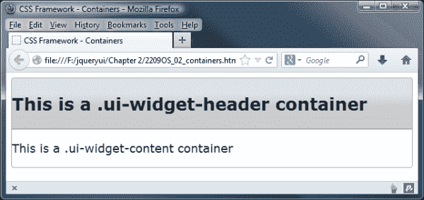

## 使用交互

让我们看一下在操作中的更多框架类。在`containers.html`中，删除带有`<body>`标记的标记，并添加以下内容：

```js
<body>
 <div class="ui-widget">
 <div class="ui-state-default ui-state-active ui-corner-all">
 <a href="#">I am clickable and selected</a>
 </div>
 <div class="ui-state-default ui-corner-all">
 <a href="#">I am clickable but not selected</a>
 </div>
 </div>
</body>
```

让我们也修改标题，以反映我们在代码中创建的内容。删除现有的`<title>`，并替换为以下内容：

```js
<title>CSS Framework - Interaction states</title>
```

将此文件另存为`jqueryui`项目文件夹中的`interactions.html`。在这些示例中，我们定义了两个可单击的元素，它们由一个容器`<div>`和一个`<a>`元素组成。两个容器都被赋予了类名`ui-state-default`和`ui-corner-all`，但第一个容器也被赋予了所选状态`ui-state-active`。

这将使我们的可点击元素具有以下外观：


CSS 框架没有在`:hover`CSS 伪类上提供样式。相反，它使用类名应用一组样式，类名是使用 JavaScript 添加的。要在关闭`</body>`标记之前查看此操作，请添加以下代码：

```js
<script type="text/javascript" src="js/jquery-2.0.3.js"> </script>
<script>
  $(document).ready(function($){
    $(".ui-widget a").hover(function() {
      $(this).parent().addClass("ui-state-hover");
    }, function() {
      $(this).parent().removeClass("ui-state-hover");    
    });
  });
</script>
```

将上一示例文件的此变体另存为`interactionsHovers.html`。

### 注

jQuery 的版本号将随着库的不断发展而变化；我们在本书中使用了 2.03 版。如果下载的版本不同，则应将其替换为任何一个版本。

当鼠标指针移动到一个可点击的元素上时，我们简单的脚本会将`ui-state-hover`类名添加到该元素上，然后在鼠标指针离开时将其删除。当我们在浏览器中运行页面并将鼠标悬停在第二个可单击元素上时，我们应该会看到`ui-state-hover`样式：

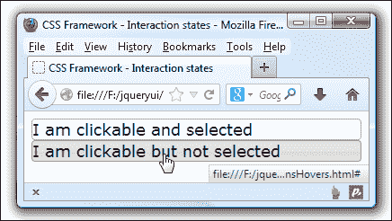

## 添加图标

框架还提供了一系列我们可以用作图标的图像。更改`interactionsHovers.html`中 ui 小部件容器的内容，使其显示如下：

```js
<div class="ui-widget">
  <div class="ui-state-default ui-state-active ui-corner-all">
 <span class="ui-icon ui-icon-circle-plus"></span>

```

```js
    <a href="#">I am clickable and selected</a>
  </div>
  <div class="ui-state-default ui-corner-all">
 <span class="ui-icon ui-icon-circle-plus"></span>

```

```js
    <a href="#">I am clickable but not selected</a>
  </div>
</div>
```

将此保存为`jqueryui`目录中的`icons.html`。在本例中，具有类`ui-icon`和`ui-icon-circle-plus`的嵌套`<div>`元素被从 sprite 文件中指定了正确的图标：

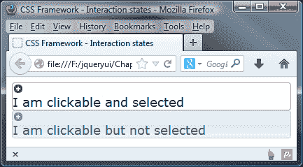

### 注

如果你还不熟悉精灵的工作原理，那么值得一读关于这项技术的文章，看看[http://nerdwith.me/news/css-sprites-for-beginners/](http://nerdwith.me/news/css-sprites-for-beginners/) 有关如何创建精灵图像的示例。如果您需要创建精灵图像，那么 CSS 精灵生成器将在[中运行 http://csssprites.com/](http://csssprites.com/) 是一个很好的网站。

如您所见，`ui-state-active`图标与`ui-state-default`图标（以及`ui-state-hover`图标）略有不同。在本例中，我们根本没有定位图标，因为这需要创建一个新的样式表。

本例的重点是了解如何使用框架中的类名自动添加图标，而不必在默认情况下添加任何额外的 CSS 样式。

### 注

如果我们想要调整定位，我们可以通过添加额外的样式来覆盖`.existing .ui-icon`类，例如`span.ui-icon { float: left; }`，它将重新定位每个`<span>`中文本左侧的图标。

### 详细检查图标

现在我们看到了一些图标在使用中，让我们来看看如何更详细地使用它们。

图标以精灵图像的形式出现，我们将其作为主题的一部分下载。在库中的主`css`文件夹中，您将找到多个主题文件夹。取决于需要下载的数量；每个主题库都包含许多精灵图像，jQueryUI 使用这些图像来生成图标，比如我们在前面的示例中看到的图标。

当查看包含图标的图像精灵时，它们的外观如下所示：

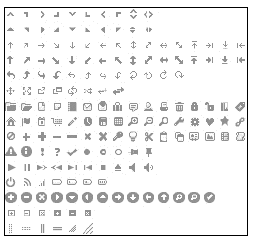

如果我们在诸如 Firebug 之类的 DOM 检查器中检查代码，您将发现至少添加了两种样式，例如：

```js
<span class="ui-icon ui-icon-circle-plus"></span>

```

图标 CSS 的格式通常遵循`.ui-icon-{icon type}-{icon sub description}-{direction}`；需要注意的是，如果您在小部件中使用`icon`选项，例如手风琴，则会添加第三个类。

每个图标元素都有一个基类`.ui-icon`，该基类将图标的尺寸设置为 16 像素的方形块，隐藏内部文本，并使用所选的精灵图像设置背景图像。使用的背景精灵图像将取决于其父容器；例如，`ui-state-default`容器中的`ui-icon`元素将根据`ui-state-default`的图标颜色进行着色。

### 添加自定义图标

向小部件添加图标不需要局限于库中的图标。您可以使用自己的自定义图标。

要做到这一点，我们有两个选项，你可以参考个别文件，或使用类似的图像精灵；后者更可取，尤其是当您使用多个自定义图标时，因为包含它们的精灵将在加载后缓存。

### 提示

您可以在[中看到核心 jQuery UI 库中可用的图标的完整列表，以及它们的图标类名 http://api.jqueryui.com/theming/icons/](http://api.jqueryui.com/theming/icons/) 。

要引用这些图标，您需要添加自己的自定义样式，这将覆盖`.ui-icon`类。这是为了确保 jQuery UI 不会尝试应用自己的样式来抵消您自己的样式。此类自定义类的示例如下所示：

```js
.ui-button .ui-icon.you-own-cusom-class {
    background-image: url(your-path-to-normal-image-file.png);
    width: your-icon-width;
    height: your-icon-height; 
}
.ui-button.ui-state-hover .ui-icon.you-own-cusom-class {
    background-image: url(your-path-to-highlighted-image-file.png);
    width: your-icon-width;
    height: your-icon-height;
}
```

然后，我们可以将新样式应用于所选的小部件，如使用 jQuery UI 按钮示例所示：

```js
       $('selector-to-your-button').button({
         text: false,
         icons: {
           primary: "you-own-cusom-class"   // Custom icon
         }
       });
```

只要图标的格式正确，并且在我们的代码中被正确引用，那么我们就可以自由添加我们想要的图标；值得在网上研究选项，因为将有大量图标可供使用，例如[上的字体库 http://fortawesome.github.io/Font-Awesome/icons/](http://fortawesome.github.io/Font-Awesome/icons/) 或 IcoMoon，可从[下载 http://icomoon.io/](http://icomoon.io/) 。

### 提示

**为什么我的图标出现在新行上？**

在某些情况下，您可能会发现您的图标出现在小部件文本上方或下方的新行上，如本章前面的图标示例所示。原因是`.ui-icon`类中的`display: block`属性：

`.ui-icon { display: block; text-indent: -99999px; overflow: hidden; background-repeat: no-repeat; }`要绕过它，您可以使用 float 属性，并根据需要将其设置为在左侧、右侧或中心显示图标。

### 使用自定义图标–注释

如果你决定使用自定义图标，那么没有什么可以阻止你这么做，这可能会带来很多可能性！您需要注意的是，使用自定义图标需要使用两个类`base .ui-icon`，然后是您自己的自定义类。这是为了确保图标正确显示，并防止 jqueryui 试图覆盖您自己的图标。

如果不注意确保图标尺寸正确，则使用自己的图标可能会与框架内的样式冲突；强烈建议您仔细查看提供的现有图标库，因为 jQueryUI 团队可能已经转换了一些有用的东西。或者，上网看看也有帮助；已经为 jQueryUI 编写了自定义主题，您可以找到一个包含所需图标的主题。

## 互动线索

我们可以使用的另一组类是交互线索。我们将看另一个使用这些的例子。在文本编辑器的新页面中，添加以下代码。这将创建一个表单示例，我们可以在其中看到活动中的提示：

```js
<!DOCTYPE html>
<html>
<head>
  <meta charset="utf-8">
  <title>CSS Framework - Interaction cues</title>
  <link rel="stylesheet" href="development-bundle/themes/base/jquery.ui.all.css">
  <link rel="stylesheet" href="css/jquery.ui.form.css">
</head>
<body>
  <div class="ui-widget ui-form">
    <div class="ui-widget-content ui-corner-all">
      <div class="ui-widget-header ui-corner-all">
        <h2>Login Form</h2>
      </div>
      <form action="#" class="ui-helper-clearfix">
        <label>Username</label>
        <div class="ui-state-error ui-corner-all">
          <input type="text">
          <div class="ui-icon ui-icon-alert"></div>           
          <p class="ui-helper-reset ui-state-error-text">Required field</p>
        </div>
      </form>
    </div>
  </div>
</body>
</html>
```

将此文件另存为`jqueryui`文件夹中的`cues.html`。这一次，我们链接到一个定制文件，`jquery.ui.form.css`，稍后我们将创建它。

在页面上，我们有外部小部件容器，类名为`ui-form`和`ui-widget`。`ui-form`类将用于从`jquery.ui.form.css`样式表中提取我们的自定义样式。在小部件中，我们有`ui-widget-header`和`ui-widget-content`容器。

在内容部分中，我们有一个`<form>`元素，其中有一行元素，一个`<label>`元素后跟一个`<div>`元素，该元素具有硬编码的`ui-state-error`和`ui-corner-all`类名。

在这个`<div>`元素中，我们有一个标准的`<input>`、一个添加了`ui-icon`的`<div>`和`ui-icon-alert`类，以及一个添加了`ui-state-error-text`类名的`<p>`元素。因为`<form>`将有由于我们将在`jquery.ui.form.css`中添加的样式而浮动的子元素，我们可以使用`ui-helper-clearfix`类来清除浮动，我们将其作为类名添加。

我们现在应该创建定制的`jquery.ui.form.css`样式表。在文本编辑器的新文件中，添加以下代码：

```js
.ui-form { width: 470px; margin: 0 auto; }
.ui-form .ui-widget-header h2 { margin: 10px 0 10px 20px; }
.ui-form .ui-widget-content { padding: 5px; }
.ui-form label, .ui-form input, .ui-form .ui-state-error,
.ui-form .ui-icon, .ui-form .ui-state-error p { float: left; }
.ui-form label, .ui-state-error p { font-size: 12px; padding: 10px 10px 0 0; }
.ui-form .ui-state-error { padding: 4px; }
.ui-form .ui-state-error p { font-weight: bold; padding-top: 5px; }
.ui-form .ui-state-error .ui-icon { margin:5px 3px 0 4px; }
.ui-helper-clearfix:before, .ui-helper-clearfix:after { margin-top: 10px; } 
```

在我们的`jqueryui`项目文件夹中，有一个名为`css`的文件夹，用于存储框架的单文件生产版本。为了方便起见，我们在本书中创建的所有 CSS 文件也将保存在这里。将此文件另存为`css`文件夹中的`jquery.ui.form.css`。

想象一下我们有更多形式的元素和提交按钮。通过将`ui-state-error`类添加到`<div>`元素中，我们可以使用错误类进行表单验证，在提交失败时将显示图标和文本。以下屏幕截图显示了页面的外观：

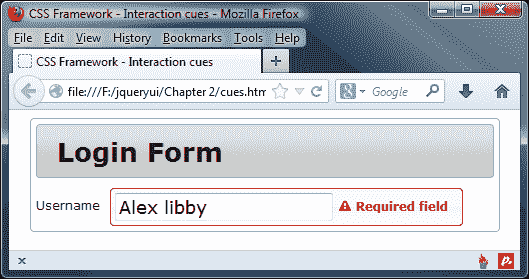

# 快速轻松地切换主题

一旦我们使用基本主题开发内容，我们可能会决定将主题更改为更适合我们整个网站主题的内容；谢天谢地，CSS 框架使切换主题成为一项轻松的任务。在前面的例子中，我们需要做的就是使用 ThemeRoller（可在[上找到）选择一个新主题来更改小部件的外观 http://www.jqueryui.com/themeroller](http://www.jqueryui.com/themeroller) ），然后下载新主题。我们可以通过选择下载生成器中的所有组件并点击**下载**来下载新主题。

在下载的归档文件中，将有一个目录，其中包含所选主题的名称，例如**redmond**。我们将`theme`文件夹从归档文件中拖出到`development-bundle\themes`文件夹中，并从我们的页面链接新的主题文件，给我们的表单一个全新的外观，如下面的屏幕截图所示：

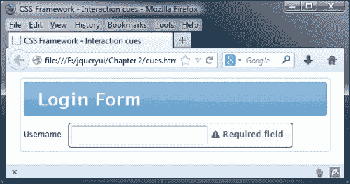

我用来获取这个截图的主题是 redmond。它使用各种深浅的蓝色作为背景或普通文本；小部件中的选定选项（如选项卡标题或选定项）将以橙色文本或橙色背景显示。在本书的其余部分，我们将使用这个主题，或者我们自己创作的主题。

## 压倒主题

使用 ThemeRoller gallery 和定制工具，我们可以生成大量独特的主题。但有时我们可能需要更深层次的定制，而不是使用 ThemeRoller 所能达到的程度；在这种情况下，我们有两种选择。

我们可以自己从头开始创建一个完整的主题文件，也可以创建一个额外的样式表，只覆盖`jquery.ui.theme.css`文件中我们需要的那些规则。后者可能是最简单的方法，因此需要编写更少的代码。

我们现在来看看主题化的这一方面。如果您在前面的示例中更改了基础主题，请切换回`cues.html`的`<head>`中的基础主题。将页面另存为`cuesOverridden.html`，然后创建以下新样式表：

```js
.ui-corner-all { border-radius: 4px; }
.ui-widget-header { font-family: Helvetica; background:   #251e14; border-radius: 4px 4px 0 0; border: 1px solid #362f2d;color: #c7b299; }
.ui-form .ui-widget-header h2 { margin: 0; padding: 5px; font-style: italic; font-weight: normal; }
.ui-form .ui-widget-content { background: #eae2d8; border: 1px solid #362f2d; border-top: 0; width:  500px; padding: 0; }
.ui-widget-content form { padding: 20px; border: 1px solid #f3eadf; border-radius: 0 0 4px 4px; }
.ui-widget-content .ui-state-error-text { color: #9A1B1E; }
.ui-form .ui-state-error { border-radius:  4px 4px 4px 4px; }
```

将保存为`css`文件夹中的`overrides.css`。在这个样式表中，我们主要覆盖`jquery.ui.theme.css`文件中的规则。这些都是简单的样式，我们只是在更改颜色、背景和边框。通过在`cuesOverridden.html`中的其他样式表下方添加以下代码行链接到此样式表：

```js
<link rel="stylesheet" href="css/overrides.css">
```

我们的简陋形式现在应显示在以下屏幕截图中：

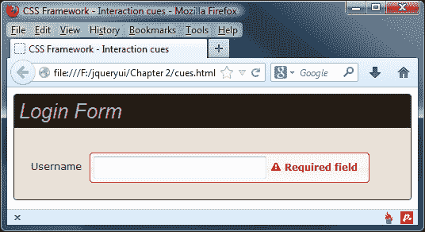

只要我们的样式表出现在`theme`文件之后，并且我们匹配或超过`jquery.ui.theme.css`文件中使用的选择器的特定性，我们的规则将优先。关于 CSS 选择器权重的长期讨论超出了本书的范围。然而，对特定性的简要解释可能是有益的，因为它是覆盖选定主题的关键。CSS 特异性是指 CSS 选择器的具体程度，它越具体，它的权重就越大，并且随后将覆盖应用于其他选择器所针对的元素的其他规则。例如，考虑下列选择器：

```js
#myContainer .bodyText
.bodyText
```

第一个选择器比第二个选择器更具体，因为它不仅使用目标元素的类名，还使用其父容器的 ID。因此，它将覆盖第二个选择器，而不管第二个选择器是否出现在它之后。

### 注

如果你想了解更多关于 CSS 特性的信息，那么互联网上有很多好文章。首先，您可能想看看[http://designshack.net/articles/css/what-the-heck-is-css-specificity/](http://designshack.net/articles/css/what-the-heck-is-css-specificity/) 或[http://reference.sitepoint.com/ css/特异性](http://reference.sitepoint.com/ css/specificity)。或者，您也可以通过 Chris Coyier 在[上的示例进行研究 http://css-tricks.com/specifics-on-css-specificity/](http://css-tricks.com/specifics-on-css-specificity/) 。

在本例中，我们可以完全控制要蒙皮的元素。但是，当使用库中的任何小部件或第三方编写的插件时，许多标记可能会自动生成，这是我们无法控制的（没有对实际库文件本身进行黑客攻击）。

因此，我们可能需要以这种方式依赖于覆盖样式。我们需要做的就是在文本编辑器中打开`jquery.ui.theme.css`文件，查看其中使用的选择器，以找到要覆盖的样式。如果做不到这一点，我们可以使用 Firebug 的 CSS 查看器查看需要覆盖的规则，如以下示例所示：

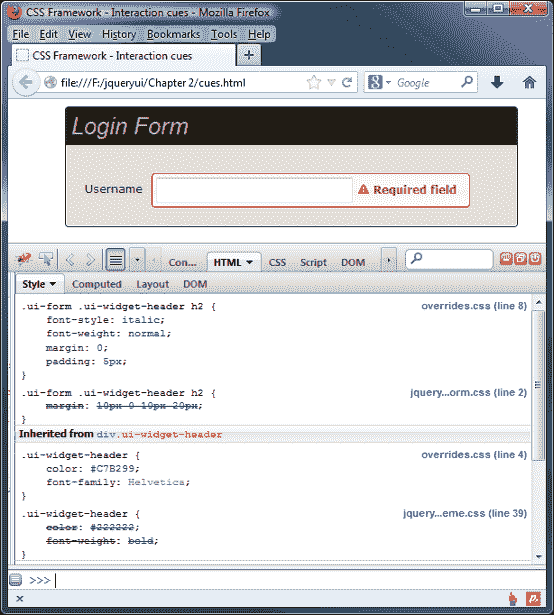

### 提示

**DOM 探索者**

所有现代的浏览器都有 DOM 探索器和 CSS 检查器，比如 Firebug，可以用来查看 CSS 规则的应用顺序。使用浏览器的 CSS 检查器通常是检查 CSS 顺序最方便的方法。

# 位置工具

position 工具是一个强大的独立工具，用于相对于窗口、文档、特定元素或鼠标指针定位任何元素。它在库组件中是唯一的，因为它不需要`jquery.ui.core.js`或`jquery.effects.core.js`作为依赖项。

它不公开唯一的或自定义的方法（除了`position()`方法），也不触发事件，但它提供了一系列允许我们使用它的配置选项。下表列出了这些选项：

<colgroup><col style="text-align: left"> <col style="text-align: left"> <col style="text-align: left"></colgroup> 
| 

选项

 | 

总体安排

 | 

曾经

 |
| --- | --- | --- |
| 在 | 一串 | 指定要相对放置的图元的边。例如，格式化为左下角。 |
| 碰撞 | 一串 | 当定位元素溢出其容器时，将定位元素移动到备用位置。 |
| 我的 | 一串 | 指定要定位的图元的边，这些边应与要定位的图元对齐，例如右上角。 |
| 属于 | 选择器、jQuery、对象、事件对象 | 指定要相对于已定位图元定位的图元。当提供选择器或 jQuery 对象时，将使用第一个匹配的元素。提供事件对象时，将使用 pageX 和 pageY 属性 |
| 使用 | 作用 | 接受一个函数，该函数实际定位定位的元素。此函数接收包含新位置顶部和左侧值的对象。 |

## 使用位置工具

使用位置工具很容易。让我们看几个例子；在文本编辑器中创建以下页面：

```js
<!DOCTYPE html>
<html>
<head>
  <meta charset="utf-8">
  <title>Position Utility - position</title>
  <link rel="stylesheet" href="css/position.css">
  <script src="js/jquery-2.0.3.js"></script>
  <script src="development-bundle/ui/jquery.ui.position.js"> </script>
  <script>
    $(document).ready(function() {
      (function($) {
        $(".ui-positioned-element").position({
          of: ".ui-positioning-element"
        });
      })(jQuery);
    });
  </script>
</head>
<body>
  <div class="ui-positioning-element">I am being positioned against</div>
  <div class="ui-positioned-element">I am being positioned </div>
</body>
</html>
```

另存为`position.html`。在本例中，我们还使用了一个非常基本的样式表，包括以下样式：

```js
.ui-positioning-element { width: 200px; height: 200px; border: 1px solid #000; }
.ui-positioned-element { width: 100px; height: 100px; border: 1px solid #f00; }
```

将此文件保存在`css`文件夹中为`position.css`。我们定位所针对的元素以及我们定位自身的元素可以设置为相对、绝对或静态定位，而不会影响定位元素的行为。如果要定位的图元使用其顶部、左侧、底部或右侧样式属性移动，则要定位的图元将考虑到这一点，并且仍能正常工作。

在页面上，我们只有两个`<div>`元素：一个是我们将定位的对象，另一个是我们将定位的实际元素。jQuery 本身是一个需求，因此我们链接到`<head>`元素中的 jQuery，并且我们还链接到 position 工具的源文件。正如我前面提到的，当单独使用 position 时，我们不需要链接到`jquery.ui.core.js`文件。

在本例中，我们可以使用的最低配置是设置`of`选项，我们使用该选项指定要定位的元素。当我们只设置这一选项时，我们定位的元素正好位于我们定位的元素的中心，如以下屏幕截图所示：

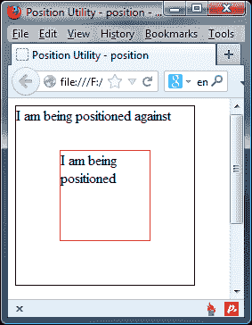

这一点非常有用，因为元素不仅在水平方向居中，而且在垂直方向居中。

通过使用以及`my`和`at`属性，我们可以将定位元素的任何边放置在我们定位的元素的任何边上。更改外部功能内的代码，使其显示如下（新代码/更改的代码以粗体显示）：

```js
$(".ui-positioned-element").position({
 of: ".ui-positioning-element",
 my: "right bottom",
 at: "right bottom"
});
```

以下屏幕截图显示了此代码的输出：

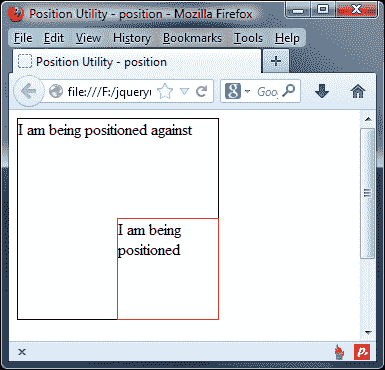

`my`选项是指正在定位的元件。字符串的第一部分（作为此选项的值提供）是水平轴，可以设置为左、中或右。第二部分是垂直轴，可以设置为顶部、中心或底部。

`at`选项是指被定位的元件的水平和垂直边缘。它还接受与`my`配置选项相同格式的字符串。

## 解释避碰

位置工具具有内置碰撞检测系统，以防止正在定位的元素溢出视口。我们可以使用两个不同的选项来设置检测到碰撞时发生的情况。默认值为`flip`，这会导致元素翻转并对齐配置的元素的相对边。

例如，如果我们将一个`<div>`元素的右边缘定位为与另一个元素的左边缘对齐，则如果该元素溢出视口，它将被翻转，使其右边缘与定位元素的右边缘对齐。

将`position.html`中的配置更改为：

```js
$(".ui-positioned-element").position({
 of: ".ui-positioning-element",
 my: "right",
 at: "left"
});
```

这将导致以下定位：

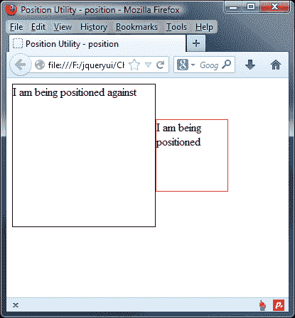

另一种避碰模式是`fit`，它将尽可能遵守配置的定位，但调整元素的定位，使其保持在视口内。按如下方式配置碰撞选项：

```js
$(".ui-positioned-element").position({
 collision: "fit",
 of: ".ui-positioning-element",
 my: "right",
 at: "left"
});
```

将此文件另存为`positionFit.html`。这一次，将元件放置在尽可能靠近其预期位置的位置：

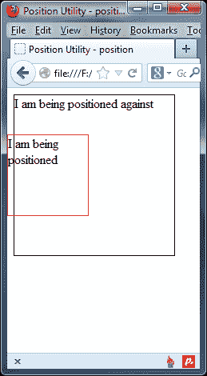

### 提示

我们还可以将`collision`选项的值设置为`none`以完全禁用碰撞检测，并允许定位元素溢出视口。

# 带功能的定位

我们可以将`using`选项设置为功能，并手动定位定位元件。更改配置，使其显示如下：

```js
$(".ui-positioned-element").position({
  of: ".ui-positioning-element",
 my: "right bottom",
 at: "right bottom",
 using: function(pos) {
 $(this).css({
 backgroundColor: "#fc7676",
 top: pos.top,
 left: pos.left
 });
 }
});
```

将此更改另存为`positionFunction.html`。我们提供一个匿名函数作为`using`选项的值。此函数作为单个参数传递，该参数是一个包含 top 和 left 属性的对象，对应于我们定位的元素应该给出的值。

正如您从这段代码中看到的，我们仍然需要手动定位元素，但是该函数允许我们对可能需要的元素进行任何预处理。在函数中，`this`对象被设置为所定位的元素。

# 在真实示例中使用位置小部件

到目前为止，我们已经考虑了使用位置小部件背后的理论；在继续查看小部件工厂之前，让我们花一点时间考虑一下如何在真实场景中使用这个位置小部件。

一个完美的例子是 jQueryUI 的对话框小部件，它被配置成一个模式对话框。在这里，我们可以使用位置小部件将对话框放置在与按钮当前位置相关的页面上。

要了解如何操作，请将以下代码添加到文本编辑器中的新文件中：

```js
<!DOCTYPE html>
<html>
<head>
  <meta charset="utf-8">
  <title>Dialog</title>
  <link rel="stylesheet" href="development-bundle/themes/redmond/jquery.ui.all.css">
  <script src="js/jquery-2.0.3.js"></script>
  <script src="development-bundle/ui/jquery.ui.core.js"></script>
  <script src="development-bundle/ui/jquery.ui.widget.js"></script>
  <script src="development-bundle/ui/jquery.ui.position.js"></script>
  <script src="development-bundle/ui/jquery.ui.dialog.js"></script>
  <script src="development-bundle/ui/jquery.ui.button.js"></script>
  <script></script>
</head>
<body></body>
</html>
```

我们需要一些标记，因此在`<body>`标记之间添加以下代码：

```js
<div id="myDialog" title="This is the title!">
  Lorem ipsum dolor sit amet, consectetuer adipiscing elit.
  Aenean sollicitudin. Sed interdum pulvinar justo. Nam iaculis
  volutpat ligula. Integer vitae felis quis diam laoreet
  ullamcorper. Etiam tincidunt est vitae est.
</div>
Lorem ipsum dolor sit amet, consectetuer adipiscing elit.
Aenean sollicitudin. Sed interdum pulvinar justo. Nam iaculis
volutpat ligula. Integer vitae felis quis diam laoreet
ullamcorper. Etiam tincidunt est vitae est.
<button id="showdialog">Click me</button>
```

最后，为了将其连接在一起并使其工作，在结束`</head>`标记之前添加以下脚本作为最后一个条目：

```js
$(document).ready(function($){
  $("#showdialog").button();
  $("#myDialog").dialog({ autoOpen: false, modal: true, });
  $("#showdialog").click(function() {
    $("#myDialog").dialog("open");
  });
  $("#showdialog").position({
    my: "left+20 top+100",
    at: "left bottom",
    of: myDialog
  });
});
```

如果我们在浏览器中预览，您将看到，当单击按钮时，我们无法对背景中的文本执行任何操作：

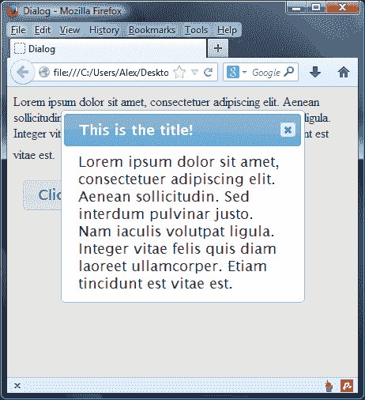

在这里，我们已经启动了一个 UI 对话框，并将其配置为一个模式；autopen 已设置为`false`，因此显示页面时不会显示对话框。然后我们创建了一个简单的点击处理程序，在点击按钮时显示对话框；接下来是对 position 小部件的调用，我们在其中设置`my`和`at`属性，以正确显示与按钮当前位置相关的对话框。

# 小部件工厂

jQuery UI 库中的另一个工具是 widget factory，它是在 jQuery UI 的 1.8 版中引入的，此后经历了一些重要的更改。这将允许轻松创建小部件的功能拆分为一个独立的工具文件。这是`jquery.ui.widget.js`文件，我们可以使用它轻松创建自己的 jQuery UI 插件。与 jQuery 本身一样，jqueryui 提供了`fn.extend()`方法来轻松创建插件，jqueryui 还提供了使插件创建更容易的机制，并确保公共 API 功能保留在新插件中。我们将在一个单独的章节中更详细地介绍 Widget 工厂，可以随书下载。

# 总结

在本章中，我们已经了解了 CSS 框架如何一致地为每个库组件设置样式。我们已经看了制作这些小部件的文件，以及它们如何协同工作以提供小部件的完整外观。我们还看到了 ThemeRoller 应用与框架的紧密集成，以及使用 ThemeRoller 安装或更改主题是多么容易。我们还研究了如果我们需要对一个小部件进行彻底的定制，而单靠 ThemeRoller 是无法实现的，那么如何覆盖主题文件。

本章还介绍了如何构建我们自己的小部件或插件，使其与框架兼容并能够利用框架，以及确保我们的创作更容易实现。我们还可以利用框架提供的 helper 类，比如`ui-helper-clearfix`类，快速实现常见的 CSS 解决方案。

我们还研究了 position 工具，它允许我们将一个元素的任何边与另一个元素的任何边对齐，从而为我们创建或操作的元素提供了一种强大而灵活的定位方式。

在下一章中，我们将继续研究库提供的小部件，从 tabs 小部件开始。